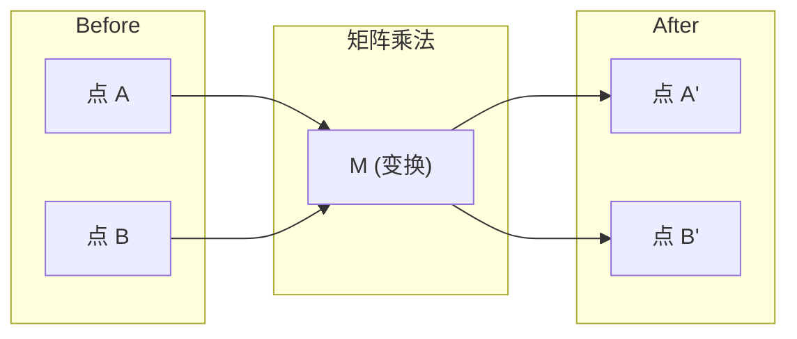
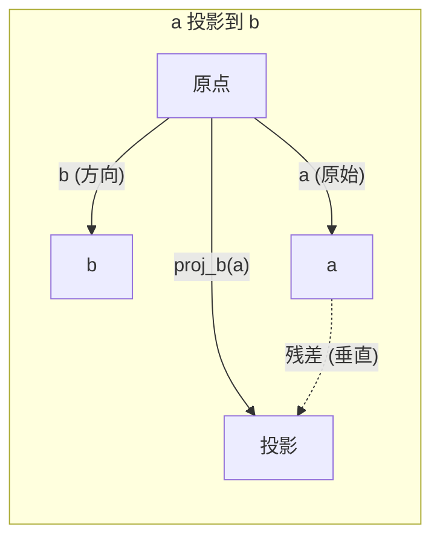

# 线性代数直觉

> 每一个 AI 模型都只是戴着一顶花哨帽子的矩阵运算。

**类型：** 学习型
**语言：** Python、Julia
**前置条件：** 阶段 0
**时间：** 约 60 分钟

## 学习目标

- 用 Python 从零实现向量与矩阵的基本运算（加法、点积、矩阵乘法）
- 从几何角度解释点积、投影与 Gram-Schmidt 过程究竟在做什么
- 用行化简判断一组向量的线性无关性、秩与基
- 把线性代数概念与现代 AI 的应用连接起来：embedding、注意力分数、LoRA

## 问题

随便翻开一篇 ML 论文。首页里就会冒出向量、矩阵、点积和变换。没有线性代数的直觉，这些只是符号；有了它，你就能看清神经网络真正在做的事 —— 在空间里搬动点。

你不必是数学家，只需要看清这些运算在几何上意味着什么，然后自己动手把它们写出来。

## 概念

### 向量既是点，也是方向

向量就是一组数字。但这些数字是有意义的 —— 它们是空间里的坐标。

**二维向量 [3, 2]：**

| x | y | 点 |
|---|---|-------|
| 3 | 2 | 该向量从原点 (0,0) 指向平面上的 (3, 2) |

向量的模为 sqrt(3^2 + 2^2) = sqrt(13)，方向指向右上方。

在 AI 中，向量可以表示任何东西：
- 一个词 → 长度为 768 的向量（它在 embedding 空间中的"含义"）
- 一张图像 → 由上百万个像素值组成的向量
- 一个用户 → 由偏好组成的向量

### 矩阵就是变换

矩阵把一个向量变换成另一个。它能旋转、缩放、拉伸或投影。



在 AI 中，矩阵就是模型本身：
- 神经网络的权重 → 把输入变换为输出的矩阵
- 注意力分数 → 决定关注什么的矩阵
- Embedding → 把词映射为向量的矩阵

### 点积度量相似度

两个向量的点积告诉你它们有多相似。

```
a · b = a₁×b₁ + a₂×b₂ + ... + aₙ×bₙ

同向：       a · b > 0  （相似）
垂直：       a · b = 0  （无关）
反向：       a · b < 0  （不相似）
```

搜索引擎、推荐系统、RAG 本质上都在做这件事 —— 找出点积最大的那些向量。

### 线性无关

如果一组向量中没有任何一个能被其他向量线性组合出来，它们就线性无关。如果 v1、v2、v3 互相无关，它们张成一个 3 维空间；如果其中一个能被其他组合出来，它们就只能张成一个平面。

这对 AI 很重要：你的特征矩阵列之间应该线性无关。如果两个特征完全相关（线性相关），模型就无法区分它们各自的影响。这在回归里就是多重共线性 —— 权重矩阵变得不稳定，输入的微小变化就会引发输出剧烈摆动。

**具体例子：**

```
v1 = [1, 0, 0]
v2 = [0, 1, 0]
v3 = [2, 1, 0]   # v3 = 2*v1 + v2
```

v1 和 v2 互相无关 —— 任何一个都不是另一个的标量倍或组合。但 v3 = 2*v1 + v2，所以 {v1, v2, v3} 是一个相关组。三个向量都躺在 xy 平面上，无论怎么组合都到不了 [0, 0, 1]。有三个向量，却只有两个方向的自由度。

对应到数据集：若 feature_3 = 2*feature_1 + feature_2，加入 feature_3 不会给模型带来任何新信息。更糟的是，它会让正规方程组奇异 —— 权重没有唯一解。

### 基与秩

基是能张成整个空间的最小一组线性无关向量。基向量的个数就是空间的维数。

3 维空间的标准基是 {[1,0,0], [0,1,0], [0,0,1]}，但 3 维中任何三个无关向量都构成一个合法基。基的选择，就是坐标系的选择。

矩阵的秩 = 线性无关的列数 = 线性无关的行数。若 rank < min(行数, 列数)，矩阵就是秩亏的。这意味：
- 方程组有无穷多解（或者无解）
- 变换过程中有信息丢失
- 矩阵不可逆

| 情况 | 秩 | 对 ML 的含义 |
|-----------|------|---------------------|
| 满秩 (rank = min(m, n)) | 尽可能大 | 最小二乘解唯一，模型良态。 |
| 秩亏 (rank < min(m, n)) | 低于最大 | 特征冗余，权重有无穷多解，需要正则化。 |
| 秩为 1 | 1 | 每一列都是同一向量的缩放副本。所有数据落在一条直线上。 |
| 近秩亏（奇异值很小） | 数值上偏低 | 矩阵病态。输入的微小噪声会引发输出剧烈变化。可用 SVD 截断或岭回归。 |

### 投影

把向量 **a** 投影到向量 **b** 上，得到 **a** 在 **b** 方向上的分量：

```
proj_b(a) = (a · b / b · b) * b
```

残差 (a - proj_b(a)) 与 b 垂直。这种正交分解是**最小二乘拟合**的根基。

投影在 ML 中无处不在：
- 线性回归最小化观测到列空间的距离 —— 解本身就是一次投影
- PCA 把数据投影到方差最大的方向上
- Transformer 中的注意力计算的是 query 到 key 的投影



**举例：** a = [3, 4], b = [1, 0]

proj_b(a) = (3*1 + 4*0) / (1*1 + 0*0) * [1, 0] = 3 * [1, 0] = [3, 0]

投影把 y 分量扔掉了。这就是最朴素的降维 —— 丢掉你不在意的方向。

### Gram-Schmidt 过程

把任意一组无关向量变成一组正交基（orthonormal basis）。"正交"意味着每个向量长度为 1，并且两两垂直。

算法步骤：
1. 取第一个向量，归一化
2. 取第二个向量，减去它在第一个向量上的投影，再归一化
3. 取第三个向量，减去它在前面所有向量上的投影，再归一化
4. 对剩余向量重复上述过程

```
输入：  v1, v2, v3, ... (线性无关)

u1 = v1 / |v1|

w2 = v2 - (v2 · u1) * u1
u2 = w2 / |w2|

w3 = v3 - (v3 · u1) * u1 - (v3 · u2) * u2
u3 = w3 / |w3|

输出：  u1, u2, u3, ... (正交基)
```

QR 分解的内部就是这样工作的。Q 就是正交基，R 装着投影系数。QR 分解用于：
- 线性方程组求解（比高斯消元更稳定）
- 特征值计算（QR 算法）
- 最小二乘回归（标准的数值方法）

## 动手实现

### 第 1 步：从零实现向量 (Python)

```python
class Vector:
    def __init__(self, components):
        self.components = list(components)
        self.dim = len(self.components)

    def __add__(self, other):
        return Vector([a + b for a, b in zip(self.components, other.components)])

    def __sub__(self, other):
        return Vector([a - b for a, b in zip(self.components, other.components)])

    def dot(self, other):
        return sum(a * b for a, b in zip(self.components, other.components))

    def magnitude(self):
        return sum(x**2 for x in self.components) ** 0.5

    def normalize(self):
        mag = self.magnitude()
        return Vector([x / mag for x in self.components])

    def cosine_similarity(self, other):
        return self.dot(other) / (self.magnitude() * other.magnitude())

    def __repr__(self):
        return f"Vector({self.components})"


a = Vector([1, 2, 3])
b = Vector([4, 5, 6])

print(f"a + b = {a + b}")
print(f"a · b = {a.dot(b)}")
print(f"|a| = {a.magnitude():.4f}")
print(f"cosine similarity = {a.cosine_similarity(b):.4f}")
```

### 第 2 步：从零实现矩阵 (Python)

```python
class Matrix:
    def __init__(self, rows):
        self.rows = [list(row) for row in rows]
        self.shape = (len(self.rows), len(self.rows[0]))

    def __matmul__(self, other):
        if isinstance(other, Vector):
            return Vector([
                sum(self.rows[i][j] * other.components[j] for j in range(self.shape[1]))
                for i in range(self.shape[0])
            ])
        rows = []
        for i in range(self.shape[0]):
            row = []
            for j in range(other.shape[1]):
                row.append(sum(
                    self.rows[i][k] * other.rows[k][j]
                    for k in range(self.shape[1])
                ))
            rows.append(row)
        return Matrix(rows)

    def transpose(self):
        return Matrix([
            [self.rows[j][i] for j in range(self.shape[0])]
            for i in range(self.shape[1])
        ])

    def __repr__(self):
        return f"Matrix({self.rows})"


rotation_90 = Matrix([[0, -1], [1, 0]])
point = Vector([3, 1])

rotated = rotation_90 @ point
print(f"Original: {point}")
print(f"Rotated 90°: {rotated}")
```

### 第 3 步：这跟 AI 有什么关系

```python
import random

random.seed(42)
weights = Matrix([[random.gauss(0, 0.1) for _ in range(3)] for _ in range(2)])
input_vector = Vector([1.0, 0.5, -0.3])

output = weights @ input_vector
print(f"Input (3D): {input_vector}")
print(f"Output (2D): {output}")
print("This is what a neural network layer does -- matrix multiplication.")
```

### 第 4 步：Julia 版

```julia
a = [1.0, 2.0, 3.0]
b = [4.0, 5.0, 6.0]

println("a + b = ", a + b)
println("a · b = ", a ⋅ b)       # Julia supports unicode operators
println("|a| = ", √(a ⋅ a))
println("cosine = ", (a ⋅ b) / (√(a ⋅ a) * √(b ⋅ b)))

# Matrix-vector multiplication
W = [0.1 -0.2 0.3; 0.4 0.5 -0.1]
x = [1.0, 0.5, -0.3]
println("Wx = ", W * x)
println("This is a neural network layer.")
```

### 第 5 步：从零实现线性无关判断与投影 (Python)

```python
def is_linearly_independent(vectors):
    n = len(vectors)
    dim = len(vectors[0].components)
    mat = Matrix([v.components[:] for v in vectors])
    rows = [row[:] for row in mat.rows]
    rank = 0
    for col in range(dim):
        pivot = None
        for row in range(rank, len(rows)):
            if abs(rows[row][col]) > 1e-10:
                pivot = row
                break
        if pivot is None:
            continue
        rows[rank], rows[pivot] = rows[pivot], rows[rank]
        scale = rows[rank][col]
        rows[rank] = [x / scale for x in rows[rank]]
        for row in range(len(rows)):
            if row != rank and abs(rows[row][col]) > 1e-10:
                factor = rows[row][col]
                rows[row] = [rows[row][j] - factor * rows[rank][j] for j in range(dim)]
        rank += 1
    return rank == n


def project(a, b):
    scalar = a.dot(b) / b.dot(b)
    return Vector([scalar * x for x in b.components])


def gram_schmidt(vectors):
    orthonormal = []
    for v in vectors:
        w = v
        for u in orthonormal:
            proj = project(w, u)
            w = w - proj
        if w.magnitude() < 1e-10:
            continue
        orthonormal.append(w.normalize())
    return orthonormal


v1 = Vector([1, 0, 0])
v2 = Vector([1, 1, 0])
v3 = Vector([1, 1, 1])
basis = gram_schmidt([v1, v2, v3])
for i, u in enumerate(basis):
    print(f"u{i+1} = {u}")
    print(f"  |u{i+1}| = {u.magnitude():.6f}")

print(f"u1 · u2 = {basis[0].dot(basis[1]):.6f}")
print(f"u1 · u3 = {basis[0].dot(basis[2]):.6f}")
print(f"u2 · u3 = {basis[1].dot(basis[2]):.6f}")
```

## 实际使用

接下来用 NumPy 写同样的东西 —— 这才是实际工作中会用到的写法：

```python
import numpy as np

a = np.array([1, 2, 3], dtype=float)
b = np.array([4, 5, 6], dtype=float)

print(f"a + b = {a + b}")
print(f"a · b = {np.dot(a, b)}")
print(f"|a| = {np.linalg.norm(a):.4f}")
print(f"cosine = {np.dot(a, b) / (np.linalg.norm(a) * np.linalg.norm(b)):.4f}")

W = np.random.randn(2, 3) * 0.1
x = np.array([1.0, 0.5, -0.3])
print(f"Wx = {W @ x}")
```

### 用 NumPy 做秩、投影与 QR

```python
import numpy as np

A = np.array([[1, 2], [2, 4]])
print(f"Rank: {np.linalg.matrix_rank(A)}")

a = np.array([3, 4])
b = np.array([1, 0])
proj = (np.dot(a, b) / np.dot(b, b)) * b
print(f"Projection of {a} onto {b}: {proj}")

Q, R = np.linalg.qr(np.random.randn(3, 3))
print(f"Q is orthogonal: {np.allclose(Q @ Q.T, np.eye(3))}")
print(f"R is upper triangular: {np.allclose(R, np.triu(R))}")
```

### PyTorch —— 张量就是带自动求导的向量

```python
import torch

x = torch.randn(3, requires_grad=True)
y = torch.tensor([1.0, 0.0, 0.0])

similarity = torch.dot(x, y)
similarity.backward()

print(f"x = {x.data}")
print(f"y = {y.data}")
print(f"dot product = {similarity.item():.4f}")
print(f"d(dot)/dx = {x.grad}")
```

点积对 x 的梯度就是 y，PyTorch 自动算出来了。神经网络的每一步运算都建立在这些基础操作之上 —— 矩阵乘、点积、投影 —— 自动求导会跟踪穿过它们的所有梯度。

你刚刚用几十行代码复现了 NumPy 一行就能搞定的事。现在你知道底层到底发生了什么。

## 交付物

本课产出：
- `outputs/prompt-linear-algebra-tutor.md` —— 一个给 AI 助手的提示词，让它用几何直觉来讲线性代数

## 联系

本课的所有概念都与现代 AI 的具体部分相连接：

| 概念 | 出现在哪里 |
|---------|------------------|
| 点积 | Transformer 的注意力分数、RAG 中的余弦相似度 |
| 矩阵乘法 | 每一个神经网络层、每一个线性变换 |
| 线性无关 | 特征选择、规避多重共线性 |
| 秩 | 判定方程组是否可解、LoRA (低秩适配) |
| 投影 | 线性回归 (向列空间投影)、PCA |
| Gram-Schmidt / QR | 数值求解器、特征值计算 |
| 正交基 | 稳定的数值计算、白化变换 |

LoRA 值得专门说一说。它通过把权重更新分解成低秩矩阵来微调大语言模型。原本要更新一个 4096x4096 的权重矩阵（16M 个参数），LoRA 改成更新两个矩阵：4096x16 和 16x4096（共 131K 个参数）。秩 16 的约束意味着 LoRA 假定权重更新只活在整个 4096 维空间里的一个 16 维子空间中。这就是线性代数在真正干活。

## 练习

1. 实现 `Vector.angle_between(other)`，返回两个向量之间的夹角（单位：度）
2. 写一个 2D 缩放矩阵，把 x 坐标翻倍、y 坐标变三倍，然后作用在向量 [1, 1] 上
3. 给出 5 个 50 维的"类词"随机向量，用余弦相似度找出最相似的那一对
4. 验证 Gram-Schmidt 的输出确实是正交基：检查每对点积为 0，每个向量的模为 1
5. 构造一个秩为 2 的 3x3 矩阵，用 `rank()` 方法验证秩，并说明它的列向量张成的几何对象是什么
6. 把向量 [1, 2, 3] 投影到 [1, 1, 1] 上。几何上，结果代表什么？

## 关键术语

| 术语 | 大家怎么说的 | 实际含义 |
|------|----------------|----------------------|
| 向量 (Vector) | "一支箭" | 一组数字，表示 n 维空间里的一个点或方向 |
| 矩阵 (Matrix) | "一张数字表" | 把向量从一个空间映射到另一个空间的变换 |
| 点积 (Dot product) | "对应相乘再求和" | 衡量两个向量方向对齐程度 —— 相似度搜索的核心 |
| Embedding | "AI 的某种魔法" | 一个向量，表示某物（词、图、用户）的含义 |
| 线性无关 (Linear independence) | "它们不重叠" | 组里没有哪个向量能被其他向量线性组合出来 |
| 秩 (Rank) | "多少个维度" | 矩阵里线性无关的列（或行）的个数 |
| 投影 (Projection) | "影子" | 一个向量在另一个向量方向上的分量 |
| 基 (Basis) | "坐标轴" | 一组最少的、能张成整个空间的无关向量 |
| 正交基 (Orthonormal) | "互相垂直的单位向量" | 两两垂直、且每个长度为 1 的向量 |
