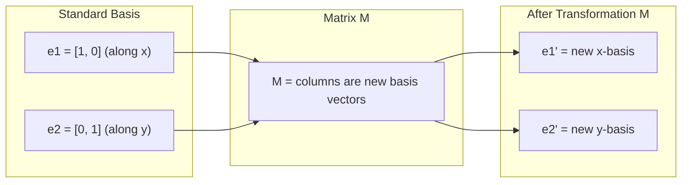
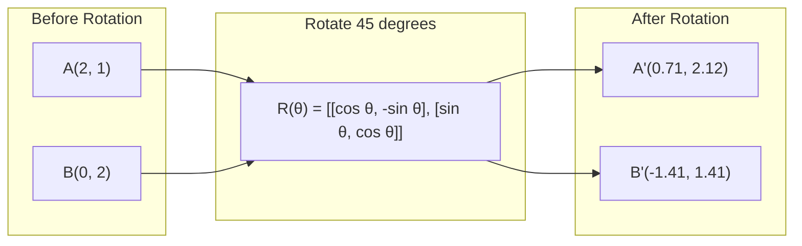
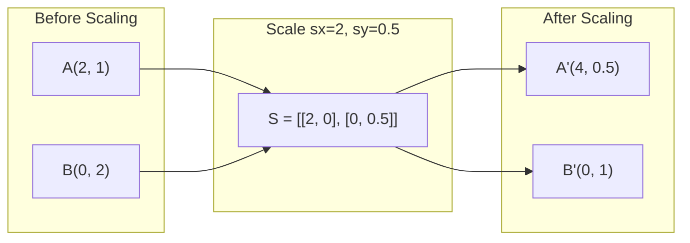
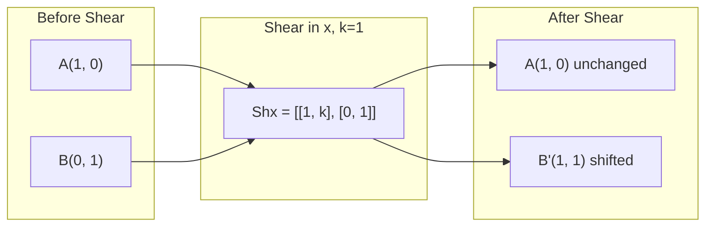
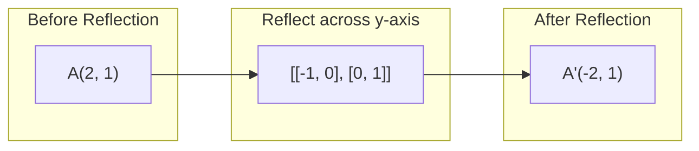
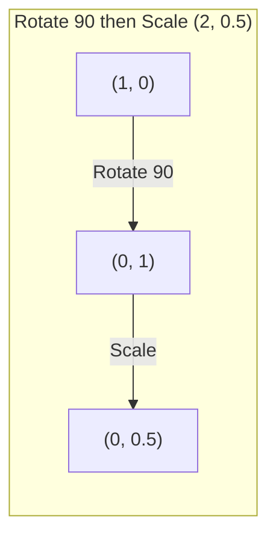
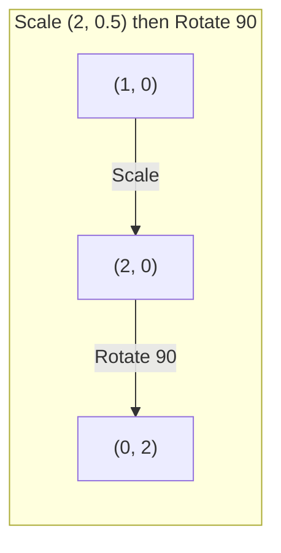

# 矩阵变换

> 矩阵是一台重塑空间的机器。看清它对每个点做了什么，你就理解了整个变换。

**类型：** 构建
**语言：** Python、Julia
**前置要求：** 第一阶段，第 01-02 课（线性代数直觉、向量与矩阵运算）
**预计时间：** 约 75 分钟

## 学习目标

- 构造旋转、缩放、剪切和反射矩阵，并将它们作用到 2D 和 3D 点上
- 通过矩阵乘法组合多个变换，并验证顺序不同结果不同
- 从特征方程出发，手算 2×2 矩阵的特征值与特征向量
- 解释为什么特征值决定了 PCA 的方向、RNN 的稳定性以及谱聚类的行为

## 问题

你读 PCA 的资料，看到"求协方差矩阵的特征向量"。你读模型稳定性的文章，看到"检查所有特征值的模是否小于 1"。你读数据增强的代码，看到"施加一个随机旋转"。在理解矩阵对空间做了什么之前，这些都毫无意义。

矩阵不只是数字表格。它们是空间的机器。旋转矩阵让点绕圈。缩放矩阵拉伸它们。剪切矩阵倾斜它们。神经网络施加在数据上的每一个变换，都是这些操作之一或它们的组合。这一课让这些操作变得具体可感。

## 概念

### 变换就是矩阵

二维空间中的每一个线性变换都可以写成一个 2×2 矩阵。矩阵告诉你的就是基向量 [1, 0] 和 [0, 1] 去了哪里。其他一切随之确定。



### 旋转

二维旋转保持距离和角度不变，把每个点沿圆弧移动。



三维旋转绕轴进行，每个轴有自己的旋转矩阵：

```
Rz(theta) = | cos  -sin  0 |     绕 z 轴旋转
            | sin   cos  0 |     (xy 平面旋转，z 不动)
            |  0     0   1 |

Rx(theta) = | 1   0     0    |   绕 x 轴旋转
            | 0  cos  -sin   |   (yz 平面旋转，x 不动)
            | 0  sin   cos   |

Ry(theta) = |  cos  0  sin |     绕 y 轴旋转
            |   0   1   0  |     (xz 平面旋转，y 不动)
            | -sin  0  cos |
```

### 缩放

缩放沿各轴独立地拉伸或压缩。



### 剪切

剪切倾斜一个轴，另一个轴保持不变。它把矩形变成平行四边形。



剪切矩阵：
- `Shx = [[1, k], [0, 1]]`  将 x 偏移 k * y
- `Shy = [[1, 0], [k, 1]]`  将 y 偏移 k * x

### 反射

反射将点沿某条轴或某条直线做镜像。



反射矩阵：
- 沿 y 轴反射：`[[-1, 0], [0, 1]]`
- 沿 x 轴反射：`[[1, 0], [0, -1]]`

### 组合：串联变换

先施加变换 A 再施加变换 B，等价于将它们的矩阵相乘：`result = B @ A @ point`。顺序很重要 —— 先旋转再缩放，与先缩放再旋转，结果不同。



组合矩阵：`S @ R = [[0, -2], [0.5, 0]]`



组合矩阵：`R @ S = [[0, -0.5], [2, 0]]`

结果不同。矩阵乘法不满足交换律。

### 特征值与特征向量

大多数向量被矩阵作用后会改变方向。特征向量是特殊的例外：矩阵只缩放它，从不旋转它。缩放系数就是特征值。

```
A @ v = lambda * v

v 是特征向量（幸存的方向）
lambda 是特征值（拉伸的倍数）

示例：A = | 2  1 |
         | 1  2 |

特征向量 [1, 1]，特征值 3：
  A @ [1,1] = [3, 3] = 3 * [1, 1]     （方向不变，缩放 3 倍）

特征向量 [1, -1]，特征值 1：
  A @ [1,-1] = [1, -1] = 1 * [1, -1]  （方向不变，保持原样）
```

这个矩阵沿 [1, 1] 方向把空间拉伸 3 倍，沿 [1, -1] 方向保持不变。其他所有方向都是这两个方向的混合。

### 特征分解

如果一个矩阵有 n 个线性无关的特征向量，它就可以被分解：

```
A = V @ D @ V^(-1)

V  = 列是特征向量的矩阵
D  = 特征值构成的对角矩阵
V^(-1) = V 的逆矩阵

这句话的意思是：旋转到特征向量坐标系，沿各轴缩放，再旋转回来。
```

### 特征值为什么重要

**PCA。** 协方差矩阵的特征向量就是主成分方向。特征值告诉你每个主成分捕获了多少方差。按特征值排序，保留前 k 个，就得到了降维。

**稳定性。** 在循环网络和动力系统中，特征值模大于 1 会导致输出爆炸；模小于 1 会导致输出消失。这就是梯度消失/爆炸问题用一句话讲清楚。

**谱方法。** 图神经网络使用邻接矩阵的特征值。谱聚类使用拉普拉斯矩阵的特征值。特征向量揭示了图的结构。

### 行列式：体积缩放因子

变换矩阵的行列式告诉你它缩放面积（2D）或体积（3D）的倍数。

```
det = 1：  面积不变（旋转）
det = 2：  面积翻倍
det = 0：  空间被压扁到更低维度（奇异）
det = -1： 面积不变但方向翻转（反射）

| det(旋转) | = 1        （始终成立）
| det(缩放 sx, sy) | = sx * sy
| det(剪切) | = 1        （面积不变）
| det(反射) | = -1       （方向翻转）
```

## 动手实现

### 第 1 步：从零实现变换矩阵 (Python)

```python
import math

def rotation_2d(theta):
    c, s = math.cos(theta), math.sin(theta)
    return [[c, -s], [s, c]]

def scaling_2d(sx, sy):
    return [[sx, 0], [0, sy]]

def shearing_2d(kx, ky):
    return [[1, kx], [ky, 1]]

def reflection_x():
    return [[1, 0], [0, -1]]

def reflection_y():
    return [[-1, 0], [0, 1]]

def mat_vec_mul(matrix, vector):
    return [
        sum(matrix[i][j] * vector[j] for j in range(len(vector)))
        for i in range(len(matrix))
    ]

def mat_mul(a, b):
    rows_a, cols_b = len(a), len(b[0])
    cols_a = len(a[0])
    return [
        [sum(a[i][k] * b[k][j] for k in range(cols_a)) for j in range(cols_b)]
        for i in range(rows_a)
    ]

point = [1.0, 0.0]
angle = math.pi / 4

rotated = mat_vec_mul(rotation_2d(angle), point)
print(f"Rotate (1,0) by 45 deg: ({rotated[0]:.4f}, {rotated[1]:.4f})")

scaled = mat_vec_mul(scaling_2d(2, 3), [1.0, 1.0])
print(f"Scale (1,1) by (2,3): ({scaled[0]:.1f}, {scaled[1]:.1f})")

sheared = mat_vec_mul(shearing_2d(1, 0), [1.0, 1.0])
print(f"Shear (1,1) kx=1: ({sheared[0]:.1f}, {sheared[1]:.1f})")

reflected = mat_vec_mul(reflection_y(), [2.0, 1.0])
print(f"Reflect (2,1) across y: ({reflected[0]:.1f}, {reflected[1]:.1f})")
```

### 第 2 步：变换的组合

```python
R = rotation_2d(math.pi / 2)
S = scaling_2d(2, 0.5)

rotate_then_scale = mat_mul(S, R)
scale_then_rotate = mat_mul(R, S)

point = [1.0, 0.0]
result1 = mat_vec_mul(rotate_then_scale, point)
result2 = mat_vec_mul(scale_then_rotate, point)

print(f"Rotate 90 then scale: ({result1[0]:.2f}, {result1[1]:.2f})")
print(f"Scale then rotate 90: ({result2[0]:.2f}, {result2[1]:.2f})")
print(f"Same? {result1 == result2}")
```

### 第 3 步：从零求特征值 (2×2)

对于 2×2 矩阵 `[[a, b], [c, d]]`，特征值由特征方程求解：`lambda^2 - (a+d)*lambda + (ad - bc) = 0`。

```python
def eigenvalues_2x2(matrix):
    a, b = matrix[0]
    c, d = matrix[1]
    trace = a + d
    det = a * d - b * c
    discriminant = trace ** 2 - 4 * det
    if discriminant < 0:
        real = trace / 2
        imag = (-discriminant) ** 0.5 / 2
        return (complex(real, imag), complex(real, -imag))
    sqrt_disc = discriminant ** 0.5
    return ((trace + sqrt_disc) / 2, (trace - sqrt_disc) / 2)

def eigenvector_2x2(matrix, eigenvalue):
    a, b = matrix[0]
    c, d = matrix[1]
    if abs(b) > 1e-10:
        v = [b, eigenvalue - a]
    elif abs(c) > 1e-10:
        v = [eigenvalue - d, c]
    else:
        if abs(a - eigenvalue) < 1e-10:
            v = [1, 0]
        else:
            v = [0, 1]
    mag = (v[0] ** 2 + v[1] ** 2) ** 0.5
    return [v[0] / mag, v[1] / mag]

A = [[2, 1], [1, 2]]
vals = eigenvalues_2x2(A)
print(f"Matrix: {A}")
print(f"Eigenvalues: {vals[0]:.4f}, {vals[1]:.4f}")

for val in vals:
    vec = eigenvector_2x2(A, val)
    result = mat_vec_mul(A, vec)
    scaled = [val * vec[0], val * vec[1]]
    print(f"  lambda={val:.1f}, v={[round(x,4) for x in vec]}")
    print(f"    A@v = {[round(x,4) for x in result]}")
    print(f"    l*v = {[round(x,4) for x in scaled]}")
```

### 第 4 步：行列式作为体积缩放因子

```python
def det_2x2(matrix):
    return matrix[0][0] * matrix[1][1] - matrix[0][1] * matrix[1][0]

print(f"det(rotation 45) = {det_2x2(rotation_2d(math.pi/4)):.4f}")
print(f"det(scale 2,3)   = {det_2x2(scaling_2d(2, 3)):.1f}")
print(f"det(shear kx=1)  = {det_2x2(shearing_2d(1, 0)):.1f}")
print(f"det(reflect y)   = {det_2x2(reflection_y()):.1f}")

singular = [[1, 2], [2, 4]]
print(f"det(singular)     = {det_2x2(singular):.1f}")
print("Singular: columns are proportional, space collapses to a line.")
```

## 实际使用

NumPy 用优化过的例程处理这一切。

```python
import numpy as np

theta = np.pi / 4
R = np.array([[np.cos(theta), -np.sin(theta)],
              [np.sin(theta),  np.cos(theta)]])

point = np.array([1.0, 0.0])
print(f"Rotate (1,0) by 45 deg: {R @ point}")

S = np.diag([2.0, 3.0])
composed = S @ R
print(f"Scale(2,3) after Rotate(45): {composed @ point}")

A = np.array([[2, 1], [1, 2]], dtype=float)
eigenvalues, eigenvectors = np.linalg.eig(A)
print(f"\nEigenvalues: {eigenvalues}")
print(f"Eigenvectors (columns):\n{eigenvectors}")

for i in range(len(eigenvalues)):
    v = eigenvectors[:, i]
    lam = eigenvalues[i]
    print(f"  A @ v{i} = {A @ v}, lambda * v{i} = {lam * v}")

print(f"\ndet(R) = {np.linalg.det(R):.4f}")
print(f"det(S) = {np.linalg.det(S):.1f}")

B = np.array([[3, 1], [0, 2]], dtype=float)
vals, vecs = np.linalg.eig(B)
D = np.diag(vals)
V = vecs
reconstructed = V @ D @ np.linalg.inv(V)
print(f"\nEigendecomposition A = V @ D @ V^-1:")
print(f"Original:\n{B}")
print(f"Reconstructed:\n{reconstructed}")
```

### 用 NumPy 做三维旋转

```python
def rotation_3d_z(theta):
    c, s = np.cos(theta), np.sin(theta)
    return np.array([[c, -s, 0], [s, c, 0], [0, 0, 1]])

def rotation_3d_x(theta):
    c, s = np.cos(theta), np.sin(theta)
    return np.array([[1, 0, 0], [0, c, -s], [0, s, c]])

point_3d = np.array([1.0, 0.0, 0.0])
rotated_z = rotation_3d_z(np.pi / 2) @ point_3d
rotated_x = rotation_3d_x(np.pi / 2) @ point_3d

print(f"\n3D point: {point_3d}")
print(f"Rotate 90 around z: {np.round(rotated_z, 4)}")
print(f"Rotate 90 around x: {np.round(rotated_x, 4)}")
```

## 交付物

本课为 PCA（第二阶段）和神经网络权重分析打下了几何基础。这里构建的特征值/特征向量代码，就是驱动生产级 ML 系统中降维、谱聚类和稳定性分析的同一套算法。

产出文件：`outputs/prompt-matrix-transformations.md` —— 一个用几何直觉讲解矩阵变换的 AI 提示词。

## 联系

本课的概念与现代 AI 的具体部分紧密相连：

| 概念 | 出现在哪里 |
|---------|------------------|
| 旋转矩阵 | 计算机视觉中的数据增强（随机旋转、翻转）、点云配准 |
| 缩放矩阵 | 特征归一化、Batch Normalization、权重初始化 |
| 剪切 | 图像仿射变换、数据增强中的透视变换 |
| 反射 | 图像翻转增强、对称性利用 |
| 变换组合 | 每一个神经网络的每一层（权重矩阵的串联） |
| 特征值/特征向量 | PCA 降维、谱聚类、PageRank、RNN 梯度稳定性分析 |
| 特征分解 | 协方差矩阵分析、流形学习、图神经网络中的谱图论 |
| 行列式 | 判断矩阵可逆性、正则化流中的 Jacobian 行列式、概率密度变换 |

特别值得展开的是 PCA：给定一个数据中心化后的矩阵 X，协方差矩阵 X^T X 的特征向量就是数据方差最大的方向（主成分）。压缩一张 784 维的 MNIST 图像到 50 维，就是只保留前 50 个最大特征值对应的特征向量方向。这就是特征分解在真正干活。

## 练习

1. 对单位正方形（四个角分别为 [0,0]、[1,0]、[1,1]、[0,1]）分别施加旋转、缩放和剪切。打印每种变换后的四个角坐标。验证旋转后各角之间的距离保持不变。

2. 用手算方式，通过特征方程求矩阵 [[4, 2], [1, 3]] 的特征值。然后用你的从零实现函数和 NumPy 分别验证。

3. 创建一个三重变换的组合（旋转 30 度，按 [1.5, 0.8] 缩放，kx=0.3 剪切），作用到排列成圆的 8 个点上。打印变换前后的坐标。计算组合矩阵的行列式，验证它等于各个变换行列式的乘积。

## 关键术语

| 术语 | 大家怎么说的 | 实际含义 |
|------|----------------|----------------------|
| 旋转矩阵 (Rotation matrix) | "让东西转圈" | 一个正交矩阵，沿圆弧移动点，同时保持距离和角度不变。行列式恒为 1。 |
| 缩放矩阵 (Scaling matrix) | "让东西变大" | 一个对角矩阵，沿各轴独立拉伸或压缩。行列式是各缩放因子的乘积。 |
| 剪切矩阵 (Shearing matrix) | "让东西倾斜" | 一个矩阵，将某个坐标按比例偏移到另一个坐标，把矩形变成平行四边形。行列式为 1。 |
| 反射 (Reflection) | "让东西镜像" | 一个矩阵，沿某条轴或平面翻转空间。行列式为 -1。 |
| 组合 (Composition) | "做两件事" | 将变换矩阵相乘来串联操作。顺序重要：B @ A 表示先施加 A 再施加 B。 |
| 特征向量 (Eigenvector) | "特殊的方向" | 矩阵只缩放、从不旋转的方向。变换的指纹。 |
| 特征值 (Eigenvalue) | "拉伸了多少" | 矩阵沿其特征向量方向缩放的标量系数。可以为负（翻转）或复数（旋转）。 |
| 特征分解 (Eigendecomposition) | "把矩阵拆开" | 将矩阵写成 V @ D @ V^(-1)，将其分离为基础缩放方向和幅度。 |
| 行列式 (Determinant) | "矩阵算出来的一个数" | 变换缩放面积（2D）或体积（3D）的因子。为零意味着变换不可逆。 |
| 特征方程 (Characteristic equation) | "特征值的出处" | det(A - lambda * I) = 0。根就是特征值的多项式方程。 |

## 进一步阅读

- [3Blue1Brown: Linear Transformations](https://www.3blue1brown.com/lessons/linear-transformations) —— 矩阵如何重塑空间的视觉直觉
- [3Blue1Brown: Eigenvectors and Eigenvalues](https://www.3blue1brown.com/lessons/eigenvalues) —— 特征向量几何含义的最佳可视化讲解
- [MIT 18.06 Lecture 21: Eigenvalues and Eigenvectors](https://ocw.mit.edu/courses/18-06-linear-algebra-spring-2010/) —— Gilbert Strang 的经典课程
