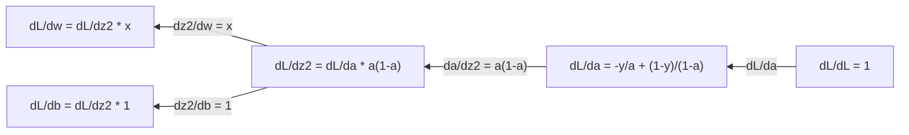
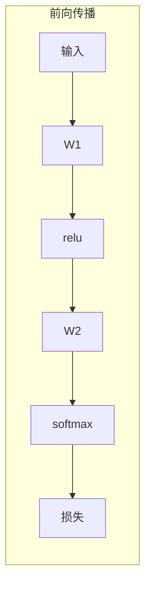
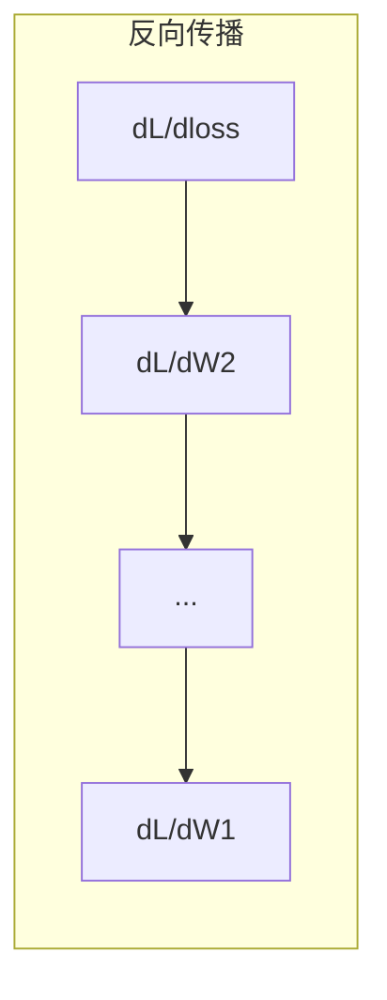

# 机器学习中的微积分

> 导数告诉你哪个方向是下坡。神经网络学习需要的全部信息，就这么多。

**类型：** 学习
**语言：** Python
**前置要求：** 第一阶段，第 01-03 课
**预计时间：** 约 60 分钟

## 学习目标

- 计算 ML 中常见函数的数值导数与解析导数（x²、sigmoid、交叉熵）
- 从零实现梯度下降，在 1D 和 2D 上最小化损失函数
- 推导线性回归模型的梯度，并通过手动更新权重来训练它
- 解释 Hessian 矩阵、泰勒级数近似，以及它们与优化方法的联系

## 问题

你有一个包含数百万权重的神经网络。每个权重都是一个旋钮。你需要弄清楚该往哪个方向拧每一个旋钮，才能让模型错得稍微少一点。微积分就是这个方向。

没有微积分，训练神经网络就只能随机尝试，撞大运。有了导数，你能精确知道每个权重对误差的影响。每个旋钮都拧对方向，每一次。

## 概念

### 什么是导数？

导数衡量变化率。对于函数 y = f(x)，导数 f'(x) 告诉你：把 x 轻轻推一点点，y 会变化多少。

几何上，导数就是某一点的切线斜率。

**f(x) = x²：**

| x | f(x) | f'(x)（斜率） |
|---|------|---------------|
| 0 | 0    | 0（平的，在碗底） |
| 1 | 1    | 2 |
| 2 | 4    | 4（该点的切线斜率） |
| 3 | 9    | 6 |

在 x=2 处，斜率是 4。把 x 向右挪一丁点，y 大约增加该移动量的 4 倍。在 x=0 处，斜率是 0。你到了碗底。

正式定义：

```
f'(x) = lim   f(x + h) - f(x)
        h->0  -----------------
                     h
```

写代码时，跳过极限，直接用很小的 h。这就是数值导数。

### 偏导数：一次只对一个变量求导

真实的函数有很多输入。神经网络的损失取决于成千上万个权重。偏导数让所有变量保持不变，只对一个变量求导。

```
f(x, y) = x^2 + 3xy + y^2

df/dx = 2x + 3y     （把 y 当作常数）
df/dy = 3x + 2y     （把 x 当作常数）
```

每个偏导数回答的是：如果只拧这一个权重，损失怎么变？

### 梯度：所有偏导数的向量

梯度把所有偏导数收集到一个向量里。对于函数 f(x, y, z)，梯度是：

```
grad f = [ df/dx, df/dy, df/dz ]
```

梯度指向最陡上升方向。要最小化一个函数，就往相反方向走。

**f(x,y) = x² + y² 的等高线图：**

这个函数是一个碗形，等高线是同心圆。最小值在 (0, 0)。

| 点 | grad f | -grad f（下降方向） |
|-------|--------|----------------------------|
| (1, 1) | [2, 2]（指向上坡，远离最小值） | [-2, -2]（指向下坡，朝向最小值） |
| (0, 0) | [0, 0]（平的，在最小值处） | [0, 0] |

这就是梯度下降的全貌。算梯度，取反，迈一步。

### 与优化的联系

训练神经网络就是优化。有一个损失函数 L(w1, w2, ..., wn) 衡量模型错得有多离谱。你想把它最小化。

```
梯度下降更新规则：

  w_new = w_old - learning_rate * dL/dw

对每个权重：
  1. 计算损失对该权重的偏导数
  2. 从权重中减掉它的一小倍
  3. 重复
```

学习率控制步长。太大，你会冲过头。太小，你只能慢慢爬。

**损失地形（1D 切片）：**

损失函数 L(w) 随权重 w 变化形成一条有峰有谷的曲线。

| 特征 | 描述 |
|---------|-------------|
| 全局最小值 | 整条曲线上最低的点——最优解 |
| 局部最小值 | 比邻居都低、但不是全局最低的山谷 |
| 坡度 | 梯度下降从任意起点沿着坡度往下走 |

梯度下降沿着坡度往下走。它可能卡在局部最小值，但在高维空间（数百万权重）中，这在实际中很少成为问题。

### 数值导数 vs 解析导数

求导数有两种方式。

解析法：手动用微积分规则。f(x) = x² 的导数是 f'(x) = 2x。精确，快速。

数值法：用定义近似。取一个极小的 h，算 f(x+h) 和 f(x-h)，用差分近似。

```
数值法（中心差分）：

f'(x) ~= f(x + h) - f(x - h)
          -----------------------
                  2h

实际中 h = 0.0001 效果很好
```

数值导数更慢，但任何函数都能用。解析导数更快，但需要你推导公式。神经网络框架用第三种方法：自动求导，它机械地算出精确导数。第三阶段会见到它。

### 简单函数的手算导数

以下是你在 ML 中反复见到的导数。

```
函数            导数              用途
--------        ----------       -------
f(x) = x²      f'(x) = 2x      损失函数（MSE）
f(x) = wx + b  f'(w) = x        线性层（对权重的梯度）
                f'(b) = 1        线性层（对偏置的梯度）
                f'(x) = w        线性层（对输入的梯度）
f(x) = eˣ      f'(x) = eˣ      Softmax、注意力
f(x) = ln(x)   f'(x) = 1/x     交叉熵损失
f(x) = 1/(1+e⁻ˣ)  f'(x) = f(x)(1-f(x))   Sigmoid 激活
```

对 f(x) = x²：

```
f(x) = x²    f'(x) = 2x

  x    f(x)   f'(x)   含义
  -2    4      -4      斜率向左（递减）
  -1    1      -2      斜率向左（递减）
   0    0       0      平坦（最小值！）
   1    1       2      斜率向右（递增）
   2    4       4      斜率向右（递增）
```

对 f(w) = wx + b，其中 x=3, b=1：

```
f(w) = 3w + 1    f'(w) = 3

对 w 的导数就是 x。
如果 x 很大，w 的微小变化会导致输出的巨大变化。
```

### 链式法则

函数复合时，链式法则告诉你如何求导。

```
如果 y = f(g(x))，那么 dy/dx = f'(g(x)) * g'(x)

例子：y = (3x + 1)²
  外层：f(u) = u²       f'(u) = 2u
  内层：g(x) = 3x + 1    g'(x) = 3
  dy/dx = 2(3x + 1) * 3 = 6(3x + 1)
```

神经网络就是函数的链条：输入 → 线性 → 激活 → 线性 → 激活 → 损失。反向传播就是从输出到输入反复使用链式法则。这就是整个算法。

### Hessian 矩阵

梯度告诉你坡度。Hessian 告诉你曲率。

Hessian 是二阶偏导数组成的矩阵。对于函数 f(x1, x2, ..., xn)，Hessian 的第 (i, j) 项是：

```
H[i][j] = d²f / (dx_i * dx_j)
```

对于二元函数 f(x, y)：

```
H = | d²f/dx²    d²f/dxdy |
    | d²f/dydx    d²f/dy² |
```

**Hessian 在临界点（梯度为 0 处）告诉你的信息：**

| Hessian 性质 | 含义 | 示例曲面 |
|-----------------|---------|-----------------|
| 正定（所有特征值 > 0） | 局部最小值 | 朝上的碗 |
| 负定（所有特征值 < 0） | 局部最大值 | 朝下的碗 |
| 不定（特征值有正有负） | 鞍点 | 马鞍形状 |

**例子：** f(x, y) = x² - y²（鞍函数）

```
df/dx = 2x       df/dy = -2y
d²f/dx² = 2    d²f/dy² = -2    d²f/dxdy = 0

H = | 2   0 |
    | 0  -2 |

特征值：2 和 -2（一正一负）
--> 在 (0, 0) 处是鞍点
```

对比 f(x, y) = x² + y²（碗形）：

```
H = | 2  0 |
    | 0  2 |

特征值：2 和 2（都为正）
--> 在 (0, 0) 处是局部最小值
```

**Hessian 为什么在 ML 中重要：**

牛顿法用 Hessian 来走比梯度下降更好的优化步。它不只跟随坡度，还把曲率考虑进去：

```
牛顿法更新：    w_new = w_old - H⁻¹ * gradient
梯度下降：     w_new = w_old - lr * gradient
```

牛顿法收敛更快，因为 Hessian 对梯度做了"重标定"——陡峭方向走小步，平坦方向走大步。

代价是：对于有 N 个参数的神经网络，Hessian 是 N×N 的。一个百万参数模型需要万亿项的矩阵。所以要用近似。

| 方法 | 使用什么 | 每步代价 | 收敛速度 |
|--------|-------------|------|-------------|
| 梯度下降 | 仅一阶导数 | O(N) | 慢（线性） |
| 牛顿法 | 完整 Hessian | O(N³) | 快（二次） |
| L-BFGS | 从梯度历史近似 Hessian | O(N) | 中等（超线性） |
| Adam | 逐参数自适应学习率（对角 Hessian 近似） | O(N) | 中等 |
| 自然梯度 | Fisher 信息矩阵（统计 Hessian） | O(N²) | 快 |

实际中，Adam 是深度学习的默认优化器。它通过追踪每个参数梯度的运行均值和方差，廉价地近似了二阶信息。

### 泰勒级数近似

任何光滑函数都可以在局部用多项式近似：

```
f(x + h) = f(x) + f'(x)*h + (1/2)*f''(x)*h^2 + (1/6)*f'''(x)*h^3 + ...
```

包含的项越多，近似越好——但只在点 x 附近成立。

**泰勒级数为什么对 ML 重要：**

- **一阶泰勒 = 梯度下降。** 使用 f(x + h) ~ f(x) + f'(x)*h 时，你做了一个线性近似。梯度下降最小化这个线性模型来选 h = -lr * f'(x)。

- **二阶泰勒 = 牛顿法。** 使用 f(x + h) ~ f(x) + f'(x)*h + (1/2)*f''(x)*h²，你得到了一个二次模型。最小化它得到 h = -f'(x)/f''(x)——牛顿步。

- **损失函数设计。** MSE 和交叉熵是光滑的，这意味着它们的泰勒展开表现良好。这不是巧合。光滑的损失函数让优化可预测。

```
近似阶数        捕获什么        优化方法
-------------------    -----------------   -------------------
0 阶（常数）           仅函数值          随机搜索
1 阶（线性）           坡度               梯度下降
2 阶（二次）           曲率               牛顿法
更高阶                更精细的结构       ML 中极少使用
```

关键洞察：所有基于梯度的优化，本质上都是在局部近似损失函数，然后走到那个近似的最小值。

### ML 中的积分

导数告诉你变化率。积分计算累积——曲线下的面积。

在 ML 中极少手动计算积分，但这个概念无处不在：

**概率。** 对于密度为 p(x) 的连续随机变量：
```
P(a < X < b) = 从 a 到 b 的 p(x) dx 的积分
```
概率密度曲线在 a 和 b 之间的面积，就是落在该区间的概率。

**期望值。** 按概率加权的平均结果：
```
E[f(X)] = f(x) * p(x) dx 的积分
```
数据分布上的期望损失是一个积分。训练就是在最小化它的经验近似。

**KL 散度。** 衡量两个分布的差异：
```
KL(p || q) = p(x) * log(p(x) / q(x)) dx 的积分
```
用于 VAE、知识蒸馏和贝叶斯推断。

**归一化常数。** 在贝叶斯推断中：
```
p(w | data) = p(data | w) * p(w) / (p(data | w) * p(w) dw 的积分)
```
分母是对所有可能参数值的积分。它常常是难解的，所以才用 MCMC 和变分推断等近似方法。

| 积分概念 | 在 ML 中出现于 |
|-----------------|----------------------|
| 曲线下面积 | 从密度函数求概率 |
| 期望值 | 损失函数、风险最小化 |
| KL 散度 | VAE、策略优化、知识蒸馏 |
| 归一化 | 贝叶斯后验、softmax 分母 |
| 边缘似然 | 模型比较、证据下界（ELBO） |

### 计算图中的多元链式法则

链式法则不只适用于排成一列的标量函数。在神经网络中，变量会分叉和汇聚。以下展示导数如何流过一个简单的前向传播：


反向传播从右向左计算梯度：



每条箭头都乘以局部导数。任何参数的梯度，是从损失到该参数沿路径上所有局部导数的乘积。当路径分叉再汇聚时，把各条贡献加起来（多元链式法则）。

反向传播就是这些：链式法则在计算图上系统地应用，从输出到输入。

### Jacobian 矩阵

当一个函数把向量映射到向量（就像神经网络层），它的导数就是一个矩阵。Jacobian 包含了每个输出对每个输入的所有偏导数。

对于 f: Rⁿ → Rᵐ，Jacobian J 是一个 m×n 矩阵：

| | x1 | x2 | ... | xn |
|---|---|---|---|---|
| f1 | df1/dx1 | df1/dx2 | ... | df1/dxn |
| f2 | df2/dx1 | df2/dx2 | ... | df2/dxn |
| ... | ... | ... | ... | ... |
| fm | dfm/dx1 | dfm/dx2 | ... | dfm/dxn |

你不会为神经网络手算 Jacobian。PyTorch 替你处理了。但知道它的存在能帮你理解反向传播中的形状：如果一个层把 Rⁿ 映射到 Rᵐ，它的 Jacobian 就是 m×n。梯度通过这个矩阵的转置向后流动。

### 这对神经网络为什么重要

神经网络中的每个权重都得到一个梯度。梯度告诉你如何调整该权重来减少损失。





每个权重更新：
- `W1 = W1 - lr * dL/dW1`
- `W2 = W2 - lr * dL/dW2`

前向传播计算预测和损失。反向传播计算损失对每个权重的梯度。然后每个权重沿下坡方向走一小步。重复数百万步。这就是深度学习。

## 动手实现

### 第 1 步：从零实现数值导数

```python
def numerical_derivative(f, x, h=1e-7):
    return (f(x + h) - f(x - h)) / (2 * h)

def f(x):
    return x ** 2

for x in [-2, -1, 0, 1, 2]:
    numerical = numerical_derivative(f, x)
    analytical = 2 * x
    print(f"x={x:2d}  f'(x) numerical={numerical:.6f}  analytical={analytical:.1f}")
```

数值导数与解析导数在小数点后多位都一致。

### 第 2 步：偏导数与梯度

```python
def numerical_gradient(f, point, h=1e-7):
    gradient = []
    for i in range(len(point)):
        point_plus = list(point)
        point_minus = list(point)
        point_plus[i] += h
        point_minus[i] -= h
        partial = (f(point_plus) - f(point_minus)) / (2 * h)
        gradient.append(partial)
    return gradient

def f_multi(point):
    x, y = point
    return x**2 + 3*x*y + y**2

grad = numerical_gradient(f_multi, [1.0, 2.0])
print(f"Numerical gradient at (1,2): {[f'{g:.4f}' for g in grad]}")
print(f"Analytical gradient at (1,2): [2*1+3*2, 3*1+2*2] = [{2*1+3*2}, {3*1+2*2}]")
```

### 第 3 步：用梯度下降找 f(x) = x² 的最小值

```python
x = 5.0
lr = 0.1
for step in range(20):
    grad = 2 * x
    x = x - lr * grad
    print(f"step {step:2d}  x={x:8.4f}  f(x)={x**2:10.6f}")
```

从 x=5 出发，每步都向 x=0（最小值）靠近。

### 第 4 步：在二维函数上做梯度下降

```python
def f_2d(point):
    x, y = point
    return x**2 + y**2

point = [4.0, 3.0]
lr = 0.1
for step in range(30):
    grad = numerical_gradient(f_2d, point)
    point = [p - lr * g for p, g in zip(point, grad)]
    loss = f_2d(point)
    if step % 5 == 0 or step == 29:
        print(f"step {step:2d}  point=({point[0]:7.4f}, {point[1]:7.4f})  f={loss:.6f}")
```

### 第 5 步：比较数值导数与解析导数

```python
import math

test_functions = [
    ("x^2",      lambda x: x**2,          lambda x: 2*x),
    ("x^3",      lambda x: x**3,          lambda x: 3*x**2),
    ("sin(x)",   lambda x: math.sin(x),   lambda x: math.cos(x)),
    ("e^x",      lambda x: math.exp(x),   lambda x: math.exp(x)),
    ("1/x",      lambda x: 1/x,           lambda x: -1/x**2),
]

x = 2.0
print(f"{'Function':<12} {'Numerical':>12} {'Analytical':>12} {'Error':>12}")
print("-" * 50)
for name, f, df in test_functions:
    num = numerical_derivative(f, x)
    ana = df(x)
    err = abs(num - ana)
    print(f"{name:<12} {num:12.6f} {ana:12.6f} {err:12.2e}")
```

### 第 6 步：用数值方法计算 Hessian

```python
def hessian_2d(f, x, y, h=1e-5):
    fxx = (f(x + h, y) - 2 * f(x, y) + f(x - h, y)) / (h ** 2)
    fyy = (f(x, y + h) - 2 * f(x, y) + f(x, y - h)) / (h ** 2)
    fxy = (f(x + h, y + h) - f(x + h, y - h) - f(x - h, y + h) + f(x - h, y - h)) / (4 * h ** 2)
    return [[fxx, fxy], [fxy, fyy]]

def saddle(x, y):
    return x ** 2 - y ** 2

def bowl(x, y):
    return x ** 2 + y ** 2

H_saddle = hessian_2d(saddle, 0.0, 0.0)
H_bowl = hessian_2d(bowl, 0.0, 0.0)
print(f"Saddle Hessian: {H_saddle}")  # [[2, 0], [0, -2]] -- mixed signs
print(f"Bowl Hessian:   {H_bowl}")    # [[2, 0], [0, 2]]  -- both positive
```

鞍函数的 Hessian 特征值为 2 和 -2（符号混合，确认是鞍点）。碗形函数的特征值为 2 和 2（都为正，确认是最小值）。

### 第 7 步：泰勒近似实战

```python
import math

def taylor_approx(f, f_prime, f_double_prime, x0, h, order=2):
    result = f(x0)
    if order >= 1:
        result += f_prime(x0) * h
    if order >= 2:
        result += 0.5 * f_double_prime(x0) * h ** 2
    return result

x0 = 0.0
for h in [0.1, 0.5, 1.0, 2.0]:
    true_val = math.sin(h)
    t1 = taylor_approx(math.sin, math.cos, lambda x: -math.sin(x), x0, h, order=1)
    t2 = taylor_approx(math.sin, math.cos, lambda x: -math.sin(x), x0, h, order=2)
    print(f"h={h:.1f}  sin(h)={true_val:.4f}  order1={t1:.4f}  order2={t2:.4f}")
```

在 x0=0 附近，sin(x) ≈ x（一阶泰勒）。h 很小时近似极好，h 变大时近似崩溃。这就是梯度下降要用小学习率的原因——每一步都假设线性近似是准确的。

### 第 8 步：这对神经网络有什么用

```python
import random

random.seed(42)

w = random.gauss(0, 1)
b = random.gauss(0, 1)
lr = 0.01

xs = [1.0, 2.0, 3.0, 4.0, 5.0]
ys = [3.0, 5.0, 7.0, 9.0, 11.0]

for epoch in range(200):
    total_loss = 0
    dw = 0
    db = 0
    for x, y in zip(xs, ys):
        pred = w * x + b
        error = pred - y
        total_loss += error ** 2
        dw += 2 * error * x
        db += 2 * error
    dw /= len(xs)
    db /= len(xs)
    total_loss /= len(xs)
    w -= lr * dw
    b -= lr * db
    if epoch % 40 == 0 or epoch == 199:
        print(f"epoch {epoch:3d}  w={w:.4f}  b={b:.4f}  loss={total_loss:.6f}")

print(f"\nLearned: y = {w:.2f}x + {b:.2f}")
print(f"Actual:  y = 2x + 1")
```

每个基于梯度的训练循环都遵循这个模式：预测、算损失、算梯度、更新权重。

## 实际使用

用 NumPy 写同样的操作，更快更简洁：

```python
import numpy as np

x = np.array([1, 2, 3, 4, 5], dtype=float)
y = np.array([3, 5, 7, 9, 11], dtype=float)

w, b = np.random.randn(), np.random.randn()
lr = 0.01

for epoch in range(200):
    pred = w * x + b
    error = pred - y
    loss = np.mean(error ** 2)
    dw = np.mean(2 * error * x)
    db = np.mean(2 * error)
    w -= lr * dw
    b -= lr * db

print(f"Learned: y = {w:.2f}x + {b:.2f}")
```

你刚才从零实现了梯度下降。PyTorch 把梯度计算自动化了，但更新循环完全一样。

## 交付物

本课产出：
- `code/gradient_descent.py` —— 从零实现的梯度下降、Hessian 计算和泰勒近似代码

## 联系

本课的所有概念都与现代 AI 的具体部分相连接：

| 概念 | 出现在哪里 |
|---------|------------------|
| 导数 | 每个权重的更新方向和幅度 |
| 偏导数 | 隔离单个参数对损失的影响 |
| 梯度 | 梯度下降的每一步，SGD、Adam 等所有优化器的基础 |
| 链式法则 | 反向传播的数学根基——通过每一层传播梯度 |
| Jacobian | 神经网络层之间梯度流动的形状与变换 |
| Hessian | 牛顿法、L-BFGS、Adam 的二阶近似——判断收敛速度 |
| 泰勒级数 | 解释了梯度下降（一阶近似）和牛顿法（二阶近似）为什么有效 |
| 积分 | 概率计算（连续分布）、期望损失、KL 散度、贝叶斯归一化 |
| 梯度下降 | 所有神经网络训练的核心循环 |

Hessian 值得多说一句。它解释了为什么 Adam 能工作。Adam 不是真正的二阶方法，但它追踪每个参数梯度的均值和方差——本质上是对 Hessian 对角线的廉价近似。陡峭的参数（Hessian 对角项大）走小步，平坦的参数走大步。这就是自适应学习率的本质：用一阶的代价，偷到二阶的收敛速度。

## 练习

1. 实现 `numerical_second_derivative(f, x)`，通过调用两次 `numerical_derivative` 来完成。验证 x³ 在 x=2 处的二阶导数是 12。
2. 用梯度下降找 f(x, y) = (x - 3)² + (y + 1)² 的最小值。从 (0, 0) 出发。答案应收敛到 (3, -1)。
3. 给梯度下降循环加动量：维护一个累积历史梯度的速度向量。在 f(x) = x⁴ - 3x² 上比较有动量和无动量的收敛速度。

## 关键术语

| 术语 | 大家怎么说的 | 实际含义 |
|------|----------------|----------------------|
| 导数 (Derivative) | "斜率" | 函数在某点的变化率。告诉你输入每变化一个单位，输出变化多少。 |
| 偏导数 (Partial derivative) | "一个变量的导数" | 在保持其他变量不变的情况下对某个变量的导数。 |
| 梯度 (Gradient) | "最陡上升方向" | 所有偏导数组成的向量。指向函数增长最快的方向。 |
| 梯度下降 (Gradient descent) | "往下坡走" | 把梯度（乘以学习率）从参数中减掉以降低损失。神经网络训练的核心。 |
| 学习率 (Learning rate) | "步长" | 控制每次梯度下降步幅的标量。太大：发散。太小：收敛太慢。 |
| 链式法则 (Chain rule) | "把导数乘起来" | 对复合函数求导的规则：df/dx = df/dg * dg/dx。反向传播的数学基础。 |
| Jacobian | "导数矩阵" | 当函数把向量映射到向量时，Jacobian 是所有输出对输入偏导数的矩阵。 |
| 数值导数 (Numerical derivative) | "有限差分" | 通过在两个邻近点求函数值并计算其间斜率来近似导数。 |
| 反向传播 (Backpropagation) | "反向模式自动求导" | 用链式法则从输出到输入逐层计算梯度。神经网络就是这样学习的。 |
| Hessian | "二阶导数矩阵" | 所有二阶偏导数的矩阵。描述函数的曲率。临界点处正定 Hessian 意味着局部最小值。 |
| 泰勒级数 (Taylor series) | "多项式近似" | 用导数在一点附近近似函数：f(x+h) ≈ f(x) + f'(x)h + (1/2)f''(x)h² + ... 理解梯度下降和牛顿法为何有效的根基。 |
| 积分 (Integral) | "曲线下的面积" | 一个量在区间上的累积。在 ML 中，积分定义了概率、期望值和 KL 散度。 |

## 进一步阅读

- [3Blue1Brown: Essence of Calculus](https://www.3blue1brown.com/topics/calculus) —— 导数、积分和链式法则的视觉直觉
- [Stanford CS231n: Backpropagation](https://cs231n.github.io/optimization-2/) —— 梯度如何流过神经网络各层
