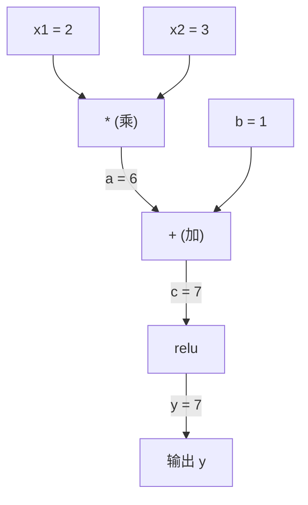
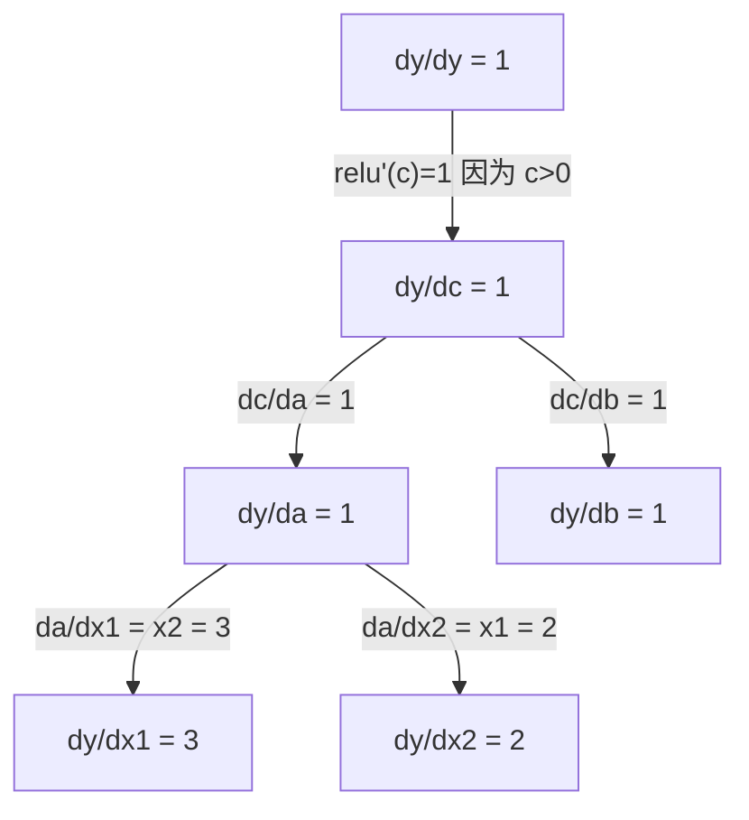

# 链式法则与自动求导

> 链式法则是每一个会学习的神经网络背后的引擎。

**类型：** 构建
**语言：** Python
**前置要求：** 第一阶段，第 04 课（导数与梯度）
**预计时间：** 约 90 分钟

## 学习目标

- 构建一个最小自动求导引擎（Value 类），记录运算并通过反向模式自动求导计算梯度
- 使用拓扑排序在计算图上实现前向和反向传播
- 用纯从零实现的自动求导引擎构建并训练一个 XOR 多层感知机
- 通过梯度检验（对比数值有限差分）验证自动求导的正确性

## 问题

你已会算简单函数的导数。但神经网络不是简单函数。它是几百个函数的复合：矩阵乘、加偏置、施加激活、再矩阵乘、softmax、交叉熵损失。输出是函数的函数的函数。

要训练网络，需要损失对每一个权重的梯度。手算百万参数量不可能。数值法（有限差分）太慢。

链式法则给出了数学。自动求导给出了算法。两者一起，让你能精确算出经过任意函数复合的梯度，耗时与一次前向传播相当。

这就是 PyTorch、TensorFlow 和 JAX 的工作原理。你要从零构建一个微型版本。

## 概念

### 链式法则

如果 `y = f(g(x))`，y 对 x 的导数是：

```
dy/dx = dy/dg * dg/dx = f'(g(x)) * g'(x)
```

沿链条把导数乘起来。每一环贡献它的局部导数。

例子：`y = sin(x²)`

```
g(x) = x²       g'(x) = 2x
f(g) = sin(g)    f'(g) = cos(g)

dy/dx = cos(x²) * 2x
```

嵌套更深时，链条继续延伸：

```
y = f(g(h(x)))

dy/dx = f'(g(h(x))) * g'(h(x)) * h'(x)
```

神经网络中的每一层都是这条链条上的一环。

### 计算图

计算图让链式法则可视化。每个运算成为一个节点。数据沿图向前流动。梯度向后流动。

**前向传播（计算值）：**



**反向传播（计算梯度）：**



反向传播在每个节点上应用链式法则，从输出向输入传播梯度。

### 前向模式 vs 反向模式

在图上应用链式法则有两种方式。

**前向模式**从输入开始，把导数向前推。它计算 `dx/dx = 1` 并传播通过每个运算。输入少、输出多时效果好。

```
前向模式：种子 dx/dx = 1，向前传播

  x = 2       (dx/dx = 1)
  a = x²      (da/dx = 2x = 4)
  y = sin(a)  (dy/dx = cos(a) * da/dx = cos(4) * 4 = -2.615)
```

**反向模式**从输出开始，把梯度向后拉。它计算 `dy/dy = 1` 并反向传播通过每个运算。输入多、输出少时效果好。

```
反向模式：种子 dy/dy = 1，向后传播

  y = sin(a)  (dy/dy = 1)
  a = x²      (dy/da = cos(a) = cos(4) = -0.654)
  x = 2       (dy/dx = dy/da * da/dx = -0.654 * 4 = -2.615)
```

神经网络有数百万输入（权重）和一个输出（损失）。反向模式一次反向传播就能算出所有梯度。这就是反向传播用反向模式的原因。

| 模式 | 种子 | 方向 | 最适合 |
|------|------|-----------|-----------|
| 前向 | `dx_i/dx_i = 1` | 输入到输出 | 少输入、多输出 |
| 反向 | `dy/dy = 1` | 输出到输入 | 多输入、少输出（神经网络） |

### 前向模式的对偶数实现

前向模式可以用对偶数优雅地实现。对偶数形式为 `a + b*epsilon`，其中 `epsilon² = 0`。

```
对偶数: (值, 导数)

(2, 1) 表示：值是 2，对 x 的导数是 1

算术规则：
  (a, a') + (b, b') = (a+b, a'+b')
  (a, a') * (b, b') = (a*b, a'*b + a*b')
  sin(a, a')         = (sin(a), cos(a)*a')
```

把输入变量种子为导数 1。导数自动传播通过每个运算。

### 构建一个自动求导引擎

自动求导引擎需要三样东西：

1. **值包装。** 把每个数字包在一个对象中，存储它的值和梯度。
2. **图记录。** 每个操作记录下它的输入和局部梯度函数。
3. **反向传播。** 对图做拓扑排序，然后反向遍历，在每个节点应用链式法则。

这正是 PyTorch `autograd` 做的事。`torch.Tensor` 类包装值，在 `requires_grad=True` 时记录操作，调用 `.backward()` 时计算梯度。

### PyTorch Autograd 的底层原理

当你写 PyTorch 代码时：

```python
x = torch.tensor(2.0, requires_grad=True)
y = x ** 2 + 3 * x + 1
y.backward()
print(x.grad)  # 7.0 = 2*x + 3 = 2*2 + 3
```

PyTorch 内部做了：

1. 为 `x` 创建一个 `Tensor` 节点，`requires_grad=True`
2. 每个操作（`**`、`*`、`+`）创建新节点并记录反向函数
3. `y.backward()` 通过记录的图触发反向模式自动求导
4. 每个节点的 `grad_fn` 计算局部梯度并传给父节点
5. 梯度通过加法（而非替换）累积在 `.grad` 属性中

图是动态的（define-by-run）。每次前向传播都会构建一张新图。这就是 PyTorch 支持模型内部控制流（if/else、循环）的原因。

## 动手实现

### 第 1 步：Value 类

```python
class Value:
    def __init__(self, data, children=(), op=''):
        self.data = data
        self.grad = 0.0
        self._backward = lambda: None
        self._prev = set(children)
        self._op = op

    def __repr__(self):
        return f"Value(data={self.data:.4f}, grad={self.grad:.4f})"
```

每个 `Value` 存储它的数值、梯度（初始为 0）、一个反向函数，以及指向生成它的子节点的指针。

### 第 2 步：带梯度追踪的算术运算

```python
    def __add__(self, other):
        other = other if isinstance(other, Value) else Value(other)
        out = Value(self.data + other.data, (self, other), '+')
        def _backward():
            self.grad += out.grad
            other.grad += out.grad
        out._backward = _backward
        return out

    def __mul__(self, other):
        other = other if isinstance(other, Value) else Value(other)
        out = Value(self.data * other.data, (self, other), '*')
        def _backward():
            self.grad += other.data * out.grad
            other.grad += self.data * out.grad
        out._backward = _backward
        return out

    def relu(self):
        out = Value(max(0, self.data), (self,), 'relu')
        def _backward():
            self.grad += (1.0 if out.data > 0 else 0.0) * out.grad
        out._backward = _backward
        return out
```

每个操作创建一个闭包，知道如何计算局部导数并乘以上游梯度（`out.grad`）。`+=` 处理了同一个值被多个操作使用的情况。

### 第 3 步：反向传播

```python
    def backward(self):
        topo = []
        visited = set()
        def build_topo(v):
            if v not in visited:
                visited.add(v)
                for child in v._prev:
                    build_topo(child)
                topo.append(v)
        build_topo(self)

        self.grad = 1.0
        for v in reversed(topo):
            v._backward()
```

拓扑排序确保每个节点的梯度在向其子节点传播前已完全算出。种子梯度是 1.0（dy/dy = 1）。

### 第 4 步：更多运算，构建完整引擎

基础 Value 类支持加法、乘法和 relu。真正的自动求导引擎需要更多。以下是构建神经网络所需的运算：

```python
    def __neg__(self):
        return self * -1

    def __sub__(self, other):
        return self + (-other)

    def __radd__(self, other):
        return self + other

    def __rmul__(self, other):
        return self * other

    def __rsub__(self, other):
        return other + (-self)

    def __pow__(self, n):
        out = Value(self.data ** n, (self,), f'**{n}')
        def _backward():
            self.grad += n * (self.data ** (n - 1)) * out.grad
        out._backward = _backward
        return out

    def __truediv__(self, other):
        return self * (other ** -1) if isinstance(other, Value) else self * (Value(other) ** -1)

    def exp(self):
        import math
        e = math.exp(self.data)
        out = Value(e, (self,), 'exp')
        def _backward():
            self.grad += e * out.grad
        out._backward = _backward
        return out

    def log(self):
        import math
        out = Value(math.log(self.data), (self,), 'log')
        def _backward():
            self.grad += (1.0 / self.data) * out.grad
        out._backward = _backward
        return out

    def tanh(self):
        import math
        t = math.tanh(self.data)
        out = Value(t, (self,), 'tanh')
        def _backward():
            self.grad += (1 - t ** 2) * out.grad
        out._backward = _backward
        return out
```

**每个运算的意义：**

| 运算 | 反向规则 | 用在 |
|-----------|--------------|---------|
| `__sub__` | 复用 add + neg | 损失计算（预测 - 目标） |
| `__pow__` | n * x^(n-1) | 多项式激活、MSE（误差²） |
| `__truediv__` | 复用 mul + pow(-1) | 归一化、学习率缩放 |
| `exp` | exp(x) * 上游梯度 | Softmax、对数似然 |
| `log` | (1/x) * 上游梯度 | 交叉熵损失、对数概率 |
| `tanh` | (1 - tanh²) * 上游梯度 | 经典激活函数 |

巧妙之处：`__sub__` 和 `__truediv__` 用已有操作来定义。它们免费获得正确的梯度，因为链式法则在底层的 add/mul/pow 操作上自动复合。

### 第 5 步：从零构建迷你 MLP

有完整的 Value 类后，可以构建神经网络。不用 PyTorch。不用 NumPy。只用 Value 和链式法则。

```python
import random

class Neuron:
    def __init__(self, n_inputs):
        self.w = [Value(random.uniform(-1, 1)) for _ in range(n_inputs)]
        self.b = Value(0.0)

    def __call__(self, x):
        act = sum((wi * xi for wi, xi in zip(self.w, x)), self.b)
        return act.tanh()

    def parameters(self):
        return self.w + [self.b]

class Layer:
    def __init__(self, n_inputs, n_outputs):
        self.neurons = [Neuron(n_inputs) for _ in range(n_outputs)]

    def __call__(self, x):
        return [n(x) for n in self.neurons]

    def parameters(self):
        return [p for n in self.neurons for p in n.parameters()]

class MLP:
    def __init__(self, sizes):
        self.layers = [Layer(sizes[i], sizes[i+1]) for i in range(len(sizes)-1)]

    def __call__(self, x):
        for layer in self.layers:
            x = layer(x)
        return x[0] if len(x) == 1 else x

    def parameters(self):
        return [p for layer in self.layers for p in layer.parameters()]
```

一个 `Neuron` 计算 `tanh(w1*x1 + w2*x2 + ... + b)`。一个 `Layer` 是一列神经元。一个 `MLP` 堆叠各层。每个权重都是 `Value`，所以调用 `loss.backward()` 就能把梯度传到每个参数。

**在 XOR 上训练：**

```python
random.seed(42)
model = MLP([2, 4, 1])  # 2 个输入，4 个隐藏神经元，1 个输出

xs = [[0, 0], [0, 1], [1, 0], [1, 1]]
ys = [-1, 1, 1, -1]  # XOR 模式（用 -1/1 配合 tanh）

for step in range(100):
    preds = [model(x) for x in xs]
    loss = sum((p - y) ** 2 for p, y in zip(preds, ys))

    for p in model.parameters():
        p.grad = 0.0
    loss.backward()

    lr = 0.05
    for p in model.parameters():
        p.data -= lr * p.grad

    if step % 20 == 0:
        print(f"step {step:3d}  loss = {loss.data:.4f}")

print("\nPredictions after training:")
for x, y in zip(xs, ys):
    print(f"  input={x}  target={y:2d}  pred={model(x).data:6.3f}")
```

这就是 micrograd。纯 Python 写的完整神经网络训练循环，带自动求导。每个商业深度学习框架在本质上做的是同一件事，只是规模大得多。

### 第 6 步：梯度检验

怎么知道你的自动求导是正确的？跟数值导数对比。这就是梯度检验。

```python
def gradient_check(build_expr, x_val, h=1e-7):
    x = Value(x_val)
    y = build_expr(x)
    y.backward()
    autodiff_grad = x.grad

    y_plus = build_expr(Value(x_val + h)).data
    y_minus = build_expr(Value(x_val - h)).data
    numerical_grad = (y_plus - y_minus) / (2 * h)

    diff = abs(autodiff_grad - numerical_grad)
    return autodiff_grad, numerical_grad, diff
```

在一个复杂表达式上测试它：

```python
def expr(x):
    return (x ** 3 + x * 2 + 1).tanh()

ad, num, diff = gradient_check(expr, 0.5)
print(f"Autodiff:  {ad:.8f}")
print(f"Numerical: {num:.8f}")
print(f"Difference: {diff:.2e}")
# 差异应该 < 1e-5
```

实现新操作时梯度检验必不可少。如果反向传播有 bug，数值检验会抓住它。每个严肃的深度学习实现在开发过程中都会跑梯度检验。

**何时使用梯度检验：**

| 情况 | 做梯度检验？ |
|-----------|-------------------|
| 给自动求导引擎加新操作 | 是，必须做 |
| 调试不收敛的训练循环 | 是，先检查梯度 |
| 生产训练 | 否，太慢（每个参数多 2 次前向传播） |
| 自动求导代码的单元测试 | 是，自动化它 |

### 第 7 步：用手算结果验证

```python
x1 = Value(2.0)
x2 = Value(3.0)
a = x1 * x2          # a = 6.0
b = a + Value(1.0)    # b = 7.0
y = b.relu()          # y = 7.0

y.backward()

print(f"y = {y.data}")          # 7.0
print(f"dy/dx1 = {x1.grad}")   # 3.0 (= x2)
print(f"dy/dx2 = {x2.grad}")   # 2.0 (= x1)
```

手动验证：`y = relu(x1*x2 + 1)`。因为 `x1*x2 + 1 = 7 > 0`，relu 就是恒等映射。
`dy/dx1 = x2 = 3`。`dy/dx2 = x1 = 2`。引擎算对了。

## 实际使用

### 跟 PyTorch 对比验证

```python
import torch

x1 = torch.tensor(2.0, requires_grad=True)
x2 = torch.tensor(3.0, requires_grad=True)
a = x1 * x2
b = a + 1.0
y = torch.relu(b)
y.backward()

print(f"PyTorch dy/dx1 = {x1.grad.item()}")  # 3.0
print(f"PyTorch dy/dx2 = {x2.grad.item()}")  # 2.0
```

同样的梯度。你的引擎算出了与 PyTorch 相同的结果，因为数学是一样的：通过链式法则的反向模式自动求导。

### 一个更复杂的表达式

```python
a = Value(2.0)
b = Value(-3.0)
c = Value(10.0)
f = (a * b + c).relu()  # relu(2*(-3) + 10) = relu(4) = 4

f.backward()
print(f"df/da = {a.grad}")  # -3.0 (= b)
print(f"df/db = {b.grad}")  #  2.0 (= a)
print(f"df/dc = {c.grad}")  #  1.0
```

## 交付物

本课产出：
- `outputs/skill-autodiff.md` —— 构建和调试自动求导系统的技能指南
- `code/autodiff.py` —— 一个可扩展的最小自动求导引擎

这里构建的 Value 类是第三阶段神经网络训练循环的基础。

## 联系

本课的所有概念都与现代 AI 的具体部分相连接：

| 概念 | 出现在哪里 |
|---------|------------------|
| 链式法则 | 每个神经网络训练的数学根基——反向传播就是反复使用链式法则 |
| 计算图 | PyTorch 的 autograd 图、TensorFlow 的静态图——每次前向传播都在建图 |
| 反向模式自动求导 | 所有深度学习框架的核心：一次反向传播算出所有参数梯度 |
| Value 包装 | `torch.Tensor` 的 `requires_grad=True`，`tf.Variable`——记录操作并传播梯度 |
| 拓扑排序 | 决定梯度传播的正确顺序，确保子节点的梯度在其父节点之前算出 |
| 梯度累积（+=） | 一个值被多次使用时，它的梯度是各路贡献之和——PyTorch 的 `.grad` 也是这样累加的 |
| 动态图（define-by-run） | PyTorch 的核心设计：每次前向传播建新图，支持 if/else 和循环 |
| 梯度检验 | 调试自动求导实现的黄金标准——对比数值差分，差异必须在 1e-5 以内 |

自动求导引擎说到底是三样东西的优雅组合：Value 包装（存值和梯度）、图记录（每次运算记住来源）、拓扑排序（反向传播时按依赖顺序走）。PyTorch 在你的代码之下，做的正是你在这课里亲手写的那些事——只是多了几十年的工程优化。

## 练习

1. 给 Value 类加 `__pow__`，使你能算 `x ** n`。验证 `d/dx(x³)` 在 `x=2` 处等于 `12.0`。

2. 把 `tanh` 作为激活函数加入。验证 `tanh'(0) = 1` 和 `tanh'(2) ≈ 0.0707`。

3. 为单个神经元构建计算图：`y = relu(w1*x1 + w2*x2 + b)`。算出全部五个梯度，用 PyTorch 验证。

4. 用对偶数实现前向模式自动求导。创建一个 `Dual` 类，验证它给出的导数与反向模式引擎一致。

## 关键术语

| 术语 | 大家怎么说的 | 实际含义 |
|------|----------------|----------------------|
| 链式法则 (Chain rule) | "把导数乘起来" | 复合函数的导数等于每层函数局部导数之积，在正确的位置取值 |
| 计算图 (Computational graph) | "网络图" | 一个有向无环图，节点是运算，边承载值（前向）或梯度（反向） |
| 前向模式 (Forward mode) | "把导数往前推" | 从输入向输出传播导数的自动求导。每个输入变量需要一次传播。 |
| 反向模式 (Reverse mode) | "反向传播" | 从输出向输入传播梯度的自动求导。每个输出变量需要一次传播。 |
| 自动求导 (Autograd) | "自动算梯度" | 一个系统，记录对值的操作、建图、通过链式法则计算精确梯度 |
| 对偶数 (Dual numbers) | "值加导数" | 形式为 a + b*epsilon（epsilon² = 0）的数，通过算术运算携带导数信息 |
| 拓扑排序 (Topological sort) | "依赖顺序" | 把图节点排序，使每个节点排在它所有依赖之后。正确传播梯度的前提。 |
| 梯度累积 (Gradient accumulation) | "加，不要替换" | 当一个值馈入多个操作时，它的梯度是所有传入梯度贡献之和 |
| 动态图 (Dynamic graph) | "运行即定义" | 每次前向传播重建计算图，允许模型内使用 Python 控制流（PyTorch 风格） |
| 梯度检验 (Gradient checking) | "数值验证" | 把自动求导的梯度与数值有限差分梯度对比来验证正确性。调试必备。 |
| MLP (多层感知机) | "多层感知机" | 带一个或多个隐藏层神经元的神经网络。每个神经元计算加权和加偏置，再施加激活函数。 |
| 神经元 (Neuron) | "加权和 + 激活" | 基本单元：output = activation(w1*x1 + w2*x2 + ... + b)。权重和偏置是可学习参数。 |

## 进一步阅读

- [3Blue1Brown: Backpropagation calculus](https://www.youtube.com/watch?v=tIeHLnjs5U8) —— 神经网络中链式法则的可视化解释
- [PyTorch Autograd mechanics](https://pytorch.org/docs/stable/notes/autograd.html) —— 真实系统如何工作
- [Baydin et al., Automatic Differentiation in Machine Learning: a Survey](https://arxiv.org/abs/1502.05767) —— 全面的参考文献
