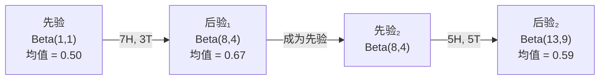

# 贝叶斯定理

> 概率关乎你的预期。贝叶斯定理关乎你学到了什么。

**类型：** 构建
**语言：** Python
**前置要求：** 第一阶段，第 06 课（概率基础）
**时间：** 约 75 分钟

## 学习目标

- 使用贝叶斯定理，从先验、似然和证据计算出后验概率
- 从零构建一个朴素贝叶斯文本分类器，包含拉普拉斯平滑和对数空间计算
- 对比 MLE 和 MAP 估计，并解释 MAP 如何对应 L2 正则化
- 使用 Beta-二项共轭先验实现序列贝叶斯更新，用于 A/B 测试

## 问题

一项医学检测准确率为 99%。你检测出阳性。你真的患病的概率有多大？

大多数人会说 99%。真实答案取决于这种病有多罕见。如果每 10,000 人中只有 1 人患病，阳性结果只会给你大约 1% 的患病概率。其余 99% 的阳性结果都是健康人的假警报。

这不是一道脑筋急转弯。这就是贝叶斯定理。每一个垃圾邮件过滤器、每一个医学诊断、每一个量化不确定性的机器学习模型，都使用完全相同的推理。你从一个信念出发，看到证据，然后更新。

如果你在不懂这一点的情况下去构建 ML 系统，你会误读模型输出、设置错误的阈值、并上线过度自信的预测。

## 概念

### 从联合概率到贝叶斯

从第 06 课你已经知道条件概率是：

```
P(A|B) = P(A and B) / P(B)
```

对称地：

```
P(B|A) = P(A and B) / P(A)
```

两个式子的分子相同：都是 P(A and B)。令它们相等并整理：

```
P(A and B) = P(A|B) * P(B) = P(B|A) * P(A)

因此：

P(A|B) = P(B|A) * P(A) / P(B)
```

这就是贝叶斯定理。四个量，一个等式。

### 四个组成部分

| 部分 | 名称 | 含义 |
|------|------|------|
| P(A\|B) | 后验概率 | 看到证据 B 之后，你对 A 的更新信念 |
| P(B\|A) | 似然 | 如果 A 为真，证据 B 出现的概率 |
| P(A) | 先验概率 | 看到任何证据之前，你对 A 的信念 |
| P(B) | 证据 | 在所有可能情况下 B 出现的总概率 |

证据项 P(B) 起归一化作用。你可以用全概率公式展开它：

```
P(B) = P(B|A) * P(A) + P(B|not A) * P(not A)
```

### 医学检测的例子

某种疾病在 10,000 人中影响 1 人。检测准确率为 99%（能查出 99% 的患者，对健康人有 1% 的假阳性）。

```
P(患病)          = 0.0001     (先验：疾病很罕见)
P(阳性|患病)     = 0.99       (似然：检测能查出)
P(阳性|健康)     = 0.01       (假阳性率)

P(阳性) = P(阳性|患病) * P(患病) + P(阳性|健康) * P(健康)
        = 0.99 * 0.0001 + 0.01 * 0.9999
        = 0.000099 + 0.009999
        = 0.010098

P(患病|阳性) = P(阳性|患病) * P(患病) / P(阳性)
            = 0.99 * 0.0001 / 0.010098
            = 0.0098
            = 0.98%
```

不到 1%。先验主导了结果。当一种情况很罕见时，即使检测很准确，大多数阳性也是假阳性。这就是为什么医生要下确认检测。

### 垃圾邮件过滤的例子

你收到一封含"中奖"字样的邮件。它是垃圾邮件吗？

```
P(垃圾)                = 0.3      (30% 的邮件是垃圾)
P("中奖"|垃圾)         = 0.05     (5% 的垃圾邮件含"中奖")
P("中奖"|非垃圾)       = 0.001    (0.1% 的正常邮件含"中奖")

P("中奖") = 0.05 * 0.3 + 0.001 * 0.7
          = 0.015 + 0.0007
          = 0.0157

P(垃圾|"中奖") = 0.05 * 0.3 / 0.0157
               = 0.955
               = 95.5%
```

一个词就让概率从 30% 跳到了 95.5%。真正的垃圾邮件过滤器同时对几百个词应用贝叶斯。

### 朴素贝叶斯：独立性假设

朴素贝叶斯将上述推理扩展到多个特征，通过假设给定类别时所有特征条件独立：

```
P(类别 | 特征₁, 特征₂, ..., 特征ₙ)
  = P(类别) * P(特征₁|类别) * P(特征₂|类别) * ... * P(特征ₙ|类别)
    / P(特征₁, 特征₂, ..., 特征ₙ)
```

"朴素"指的就是这个独立性假设。在文本中，词的出现并不独立（"New" 和 "York" 是相关的）。但这个假设在实践中出奇地好用，因为分类器只需要对类别排序，不需要输出校准后的概率。

既然分母对所有类别都相同，你可以跳过它，只比较分子：

```
分数(类别) = P(类别) * P(特征ᵢ|类别) 的乘积
```

选分数最高的类别。

### 最大似然估计 (MLE)

如何从训练数据中得到 P(特征|类别)？数就行了。

```
P("免费"|垃圾) = (含"免费"的垃圾邮件数量) / (垃圾邮件总数)
```

这就是 MLE：选择使观测数据最可能出现的参数值。你最大化的是似然函数，在离散计数下它退化为相对频率。

问题：如果某个词在训练时从未在垃圾邮件中出现，MLE 会给出概率零。一个未见过的词就能把整个乘积归零。用拉普拉斯平滑解决这个问题：

```
P(词|类别) = (该词在该类中的计数 + 1) / (该类总词数 + 词汇表大小)
```

给每个计数加 1，确保没有任何概率为零。

### 最大后验估计 (MAP)

MLE 问：什么参数能使 P(数据|参数) 最大？

MAP 问：什么参数能使 P(参数|数据) 最大？

根据贝叶斯定理：

```
P(参数|数据) 正比于 P(数据|参数) * P(参数)
```

MAP 在参数本身上加了一个先验。如果你认为参数应该很小，你就用一个惩罚大值的先验来编码这个信念。这与 ML 中的 L2 正则化完全相同。岭回归中的"ridge"惩罚，本质就是权重上的一个高斯先验。

| 估计方法 | 优化目标 | ML 等价物 |
|----------|----------|-----------|
| MLE | P(数据\|参数) | 无正则化训练 |
| MAP | P(数据\|参数) * P(参数) | L2 / L1 正则化 |

### 贝叶斯 vs 频率学派：实际区别

频率学派把参数视为固定未知量。他们问："如果我把这个实验重复很多次，会怎样？"

贝叶斯学派把参数视为分布。他们问："给定我已观测到的数据，我对参数的信念是什么？"

对构建 ML 系统的实际区别：

| 方面 | 频率学派 | 贝叶斯学派 |
|------|----------|------------|
| 输出 | 点估计 | 值上的分布 |
| 不确定性 | 置信区间（关于实验流程） | 可信区间（关于参数本身） |
| 小数据 | 可能过拟合 | 先验起到正则化作用 |
| 计算 | 通常更快 | 常需采样（MCMC） |

大多数生产环境的 ML 是频率学派的（SGD，点估计）。贝叶斯方法在你需要校准后的不确定性（医疗决策、安全关键系统）或数据稀缺（小样本学习、冷启动）时发光。

### 为什么贝叶斯思维对 ML 很重要

这些联系比类比更深：

**先验就是正则化。** 权重上的高斯先验就是 L2 正则化。拉普拉斯先验就是 L1。每次你加一个正则化项，你都在做一个贝叶斯声明：你预期参数值应该落在什么范围。

**后验就是不确定性。** 单个预测概率不能告诉你模型对这个估计有多自信。贝叶斯方法给你一个分布："我认为 P(垃圾) 在 0.8 到 0.95 之间。"

**贝叶斯更新就是在线学习。** 今天的后验就是明天的先验。当模型看到新数据时，它增量地更新信念，而不需要从头重新训练。

**模型比较是贝叶斯的。** 贝叶斯信息准则 (BIC)、边际似然和贝叶斯因子都使用贝叶斯推理来选择模型，避免过拟合。

### 共轭先验

当先验和后验属于同一个分布族时，这个先验就叫"共轭先验"。这让贝叶斯更新在代数上非常干净 —— 你能得到闭式后验，无需数值积分。

| 似然 | 共轭先验 | 后验 | 例子 |
|------|----------|------|------|
| 伯努利 | Beta(a, b) | Beta(a + 成功次数, b + 失败次数) | 硬币偏差估计 |
| 正态（方差已知） | Normal(μ₀, σ₀) | Normal(加权均值, 更小方差) | 传感器校准 |
| 泊松 | Gamma(a, b) | Gamma(a + 计数和, b + n) | 到达率建模 |
| 多项 | Dirichlet(α) | Dirichlet(α + 计数) | 主题建模、语言模型 |

为什么这很重要：没有共轭先验，你就需要蒙特卡洛采样或变分推断来近似后验。有共轭先验的话，你只需要更新两个数。

Beta 分布是实践中最常用的共轭先验。Beta(a, b) 表示你对一个概率参数的信念。均值为 a/(a+b)。a+b 越大，分布越集中（越确信）。

Beta 先验的特例：
- Beta(1, 1) = 均匀分布。你对参数没有看法。
- Beta(10, 10) = 峰值在 0.5。你强烈相信参数接近 0.5。
- Beta(1, 10) = 偏向 0。你认为参数很小。

更新规则极其简单：

```
先验：     Beta(a, b)
数据：     s 次成功，f 次失败
后验：     Beta(a + s, b + f)
```

不需要积分。不需要采样。只是加法。

### 序列贝叶斯更新

贝叶斯推断天然是序列化的。今天的后验成为明天的先验。这就是真实系统如何在不重新处理全部历史数据的情况下增量学习的。

具体例子：估计一枚硬币是否公平。

**第 1 天：还没有数据。**
从 Beta(1, 1) 开始 —— 均匀先验。你没有看法。
- 先验均值：0.5
- 先验在 [0, 1] 上是平坦的

**第 2 天：观测到 7 次正面，3 次反面。**
后验 = Beta(1 + 7, 1 + 3) = Beta(8, 4)
- 后验均值：8/12 = 0.667
- 证据表明硬币偏向正面

**第 3 天：再观测到 5 次正面，5 次反面。**
用昨天的后验作为今天的先验。
后验 = Beta(8 + 5, 4 + 5) = Beta(13, 9)
- 后验均值：13/22 = 0.591
- 新数据的平衡把估计拉回接近 0.5



观测的顺序无关紧要。Beta(1,1) 一次性用全部 12 次正面和 8 次反面更新，同样得到 Beta(13, 9) —— 同样的结果。序列更新和批量更新在数学上是等价的。但序列更新让你能在每一步做出决策，而无需存储原始数据。

这是生产 ML 系统中在线学习的基础。用于老虎机的 Thompson 采样、增量推荐系统和流式异常检测器都使用这个模式。

### 与 A/B 测试的联系

A/B 测试就是披着外衣的贝叶斯推断。

场景：你在测试两种按钮颜色。方案 A（蓝色）和方案 B（绿色）。你想知道哪个点击率更高。

贝叶斯 A/B 测试：

1. **先验。** 两个方案都从 Beta(1, 1) 开始。没有先验偏好。
2. **数据。** 方案 A：1000 次浏览中 50 次点击。方案 B：1000 次浏览中 65 次点击。
3. **后验。**
   - A：Beta(1 + 50, 1 + 950) = Beta(51, 951)。均值 = 0.051
   - B：Beta(1 + 65, 1 + 935) = Beta(66, 936)。均值 = 0.066
4. **决策。** 计算 P(B > A) —— B 的真实转化率高于 A 的概率。

解析计算 P(B > A) 很难。但蒙特卡洛让这件事变得简单：

```
1. 从 Beta(51, 951) 抽取 100,000 个样本  -> samples_A
2. 从 Beta(66, 936) 抽取 100,000 个样本  -> samples_B
3. P(B > A) = B 大于 A 的样本比例
```

如果 P(B > A) > 0.95，上线方案 B。如果在 0.05 到 0.95 之间，继续收集数据。如果 P(B > A) < 0.05，上线方案 A。

相比频率学派 A/B 测试的优势：
- 你得到的是直接的概率陈述："B 更好的概率是 97%"
- 没有 p 值困惑。没有"未能拒绝原假设"这种绕弯子的说法
- 你可以随时查看结果，不会抬高假阳性率（不存在"偷看问题"）
- 你可以融入先验知识（比如，之前的测试表明转化率通常在 3-8%）

| 方面 | 频率学派 A/B | 贝叶斯 A/B |
|------|-------------|------------|
| 输出 | p 值 | P(B > A) |
| 解读 | "如果 A=B，这数据有多令人惊讶？" | "B 比 A 好的可能性有多大？" |
| 提前停止 | 抬高假阳性 | 任何时间点都安全（给定合理先验和正确指定的模型） |
| 先验知识 | 不使用 | 编码为 Beta 先验 |
| 决策规则 | p < 0.05 | P(B > A) > 阈值 |

## 动手实现

### 第 1 步：贝叶斯定理函数

```python
def bayes(prior, likelihood, false_positive_rate):
    evidence = likelihood * prior + false_positive_rate * (1 - prior)
    posterior = likelihood * prior / evidence
    return posterior

result = bayes(prior=0.0001, likelihood=0.99, false_positive_rate=0.01)
print(f"P(sick|positive) = {result:.4f}")
```

### 第 2 步：朴素贝叶斯分类器

```python
import math
from collections import defaultdict

class NaiveBayes:
    def __init__(self, smoothing=1.0):
        self.smoothing = smoothing
        self.class_counts = defaultdict(int)
        self.word_counts = defaultdict(lambda: defaultdict(int))
        self.class_word_totals = defaultdict(int)
        self.vocab = set()

    def train(self, documents, labels):
        for doc, label in zip(documents, labels):
            self.class_counts[label] += 1
            words = doc.lower().split()
            for word in words:
                self.word_counts[label][word] += 1
                self.class_word_totals[label] += 1
                self.vocab.add(word)

    def predict(self, document):
        words = document.lower().split()
        total_docs = sum(self.class_counts.values())
        vocab_size = len(self.vocab)
        best_class = None
        best_score = float("-inf")
        for cls in self.class_counts:
            score = math.log(self.class_counts[cls] / total_docs)
            for word in words:
                count = self.word_counts[cls].get(word, 0)
                total = self.class_word_totals[cls]
                score += math.log((count + self.smoothing) / (total + self.smoothing * vocab_size))
            if score > best_score:
                best_score = score
                best_class = cls
        return best_class
```

使用对数概率防止下溢。把很多小概率相乘会产生浮点数无法表示的极小数字。对对数概率求和是数值稳定的，并且在数学上等价。

### 第 3 步：在垃圾邮件数据上训练

```python
train_docs = [
    "win free money now",
    "free lottery ticket winner",
    "claim your prize today free",
    "urgent offer free cash",
    "congratulations you won free",
    "meeting tomorrow at noon",
    "project update attached",
    "can we schedule a call",
    "quarterly report review",
    "lunch on thursday sounds good",
    "team standup notes attached",
    "please review the pull request",
]

train_labels = [
    "spam", "spam", "spam", "spam", "spam",
    "ham", "ham", "ham", "ham", "ham", "ham", "ham",
]

classifier = NaiveBayes()
classifier.train(train_docs, train_labels)

test_messages = [
    "free money waiting for you",
    "meeting rescheduled to friday",
    "you won a free prize",
    "please review the attached report",
]

for msg in test_messages:
    print(f"  '{msg}' -> {classifier.predict(msg)}")
```

### 第 4 步：检查学习到的概率

```python
def show_top_words(classifier, cls, n=5):
    vocab_size = len(classifier.vocab)
    total = classifier.class_word_totals[cls]
    probs = {}
    for word in classifier.vocab:
        count = classifier.word_counts[cls].get(word, 0)
        probs[word] = (count + classifier.smoothing) / (total + classifier.smoothing * vocab_size)
    sorted_words = sorted(probs.items(), key=lambda x: x[1], reverse=True)
    for word, prob in sorted_words[:n]:
        print(f"    {word}: {prob:.4f}")

print("\nTop spam words:")
show_top_words(classifier, "spam")
print("\nTop ham words:")
show_top_words(classifier, "ham")
```

## 实际使用

Scikit-learn 提供了可直接上线的朴素贝叶斯实现：

```python
from sklearn.feature_extraction.text import CountVectorizer
from sklearn.naive_bayes import MultinomialNB
from sklearn.metrics import classification_report

vectorizer = CountVectorizer()
X_train = vectorizer.fit_transform(train_docs)
clf = MultinomialNB()
clf.fit(X_train, train_labels)

X_test = vectorizer.transform(test_messages)
predictions = clf.predict(X_test)
for msg, pred in zip(test_messages, predictions):
    print(f"  '{msg}' -> {pred}")
```

同样的算法。CountVectorizer 处理分词和词汇表构建。MultinomialNB 内部处理平滑和对数概率。你从零写的版本用 40 行代码做了同样的事。

## 交付物

本课产出一个完整的朴素贝叶斯分类器，包含分词、拉普拉斯平滑和对数空间预测。代码见 `code/bayes.py`，零外部依赖（仅使用 Python 标准库），可端到端运行。

本课还产出：
- `outputs/prompt-bayes-intuition.md` —— 一个用直观方式教授贝叶斯定理的 AI 提示词

## 联系

本课的所有概念都与现代 AI 的具体部分相连接：

| 概念 | 出现在哪里 |
|------|-----------|
| 贝叶斯定理 | 垃圾邮件过滤、医学诊断、所有概率模型的推理基础 |
| 先验与后验 | 正则化（L1/L2）、模型参数的先验信念编码 |
| 朴素贝叶斯 | 文本分类、情感分析、文档归类 —— 小数据下仍然有效 |
| 拉普拉斯平滑 | 处理未见词、防止零概率、所有计数型模型的标配 |
| MLE vs MAP | 无正则化 vs 有正则化训练；MAP = 带先验的 MLE |
| 共轭先验 (Beta-二项) | A/B 测试、Thompson 采样、在线学习中的增量更新 |
| 序列贝叶斯更新 | 流式学习、推荐系统的在线更新、异常检测 |
| 对数概率 | 所有生产级概率模型的数值稳定性基础 |
| 贝叶斯 A/B 测试 | 随时可查看结果、不需要固定样本量、给出直接的概率结论 |

朴素贝叶斯值得专门说一说。尽管它的"条件独立"假设在现实中几乎总是错的，但它在文本分类上出奇地好用。原因在于：分类器只需要正确排序，不需要精确校准概率。只要 P(垃圾|词₁,...,词ₙ) 对真正的垃圾邮件给出更高分数，即使具体数值不准也没关系。这种"错的假设 + 对的结果"的组合，是 ML 中一个值得记住的模式。

## 练习

1. **多次检测。** 一位患者两次独立检测均为阳性（两项检测的准确率都是 99%，疾病流行率 10,000 分之 1）。两次检测后 P(患病) 是多少？把第一次检测的后验作为第二次的先验。

2. **平滑的影响。** 分别用平滑值 0.01、0.1、1.0 和 10.0 运行垃圾邮件分类器。高频词概率如何变化？平滑=0 时，一个只出现在正常邮件中的词会发生什么？

3. **添加特征。** 扩展 NaiveBayes 类，除了词计数外，也把邮件长度（短/长）作为一个特征。从训练数据中估计 P(短|垃圾) 和 P(短|正常)，并把它纳入预测分数。

4. **手动计算 MAP。** 给定观测数据（抛 10 次硬币，7 次正面），用 Beta(2,2) 先验计算偏差的 MAP 估计。与 MLE 估计 (7/10) 对比。

## 关键术语

| 术语 | 大家怎么说的 | 实际含义 |
|------|-------------|----------|
| 先验 | "我最初的猜测" | P(假设)，在观测证据之前。在 ML 中：正则化项。 |
| 似然 | "数据拟合得多好" | P(证据\|假设)。在特定假设下观测数据出现的概率。 |
| 后验 | "我更新后的信念" | P(假设\|证据)。先验乘以似然，然后归一化。 |
| 证据 | "归一化常数" | 在所有假设下的 P(数据)。保证后验之和为 1。 |
| 朴素贝叶斯 | "那个简单的文本分类器" | 假设给定类别后特征独立的分类器。尽管假设错误，实践中效果很好。 |
| 拉普拉斯平滑 | "加一平滑" | 给每个特征加一个小计数，防止未见数据导致零概率。 |
| MLE | "直接用频率" | 选择使 P(数据\|参数) 最大的参数。没有先验。小数据下可能过拟合。 |
| MAP | "带先验的 MLE" | 选择使 P(数据\|参数) * P(参数) 最大的参数。等价于正则化 MLE。 |
| 对数概率 | "在对数空间算" | 用 log(P) 代替 P，避免多个小数相乘时的浮点下溢。 |
| 假阳性 | "错误的警报" | 检测说阳性，但真实状态是阴性。是基础率谬误的来源。 |

## 进一步阅读

- [3Blue1Brown: Bayes' theorem](https://www.youtube.com/watch?v=HZGCoVF3YvM) - 用医学检测例子的可视化讲解
- [Stanford CS229: Generative Learning Algorithms](https://cs229.stanford.edu/notes2022fall/cs229-notes2.pdf) - 朴素贝叶斯及其与判别模型的联系
- [Think Bayes](https://greenteapress.com/wp/think-bayes/) - 免费书籍，带 Python 代码的贝叶斯统计
- [scikit-learn Naive Bayes](https://scikit-learn.org/stable/modules/naive_bayes.html) - 生产级实现及各变体的使用场景
