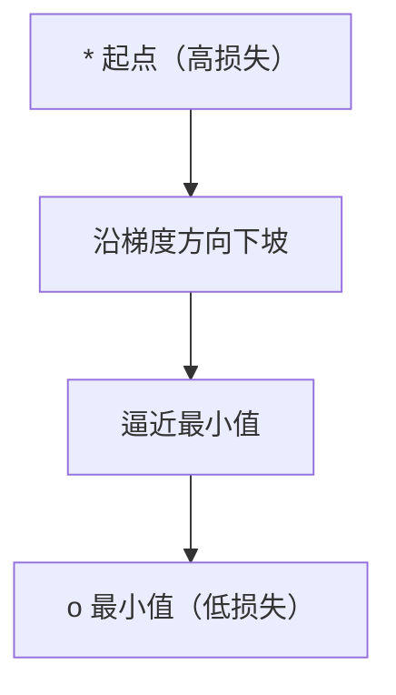
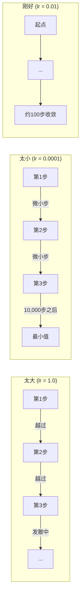
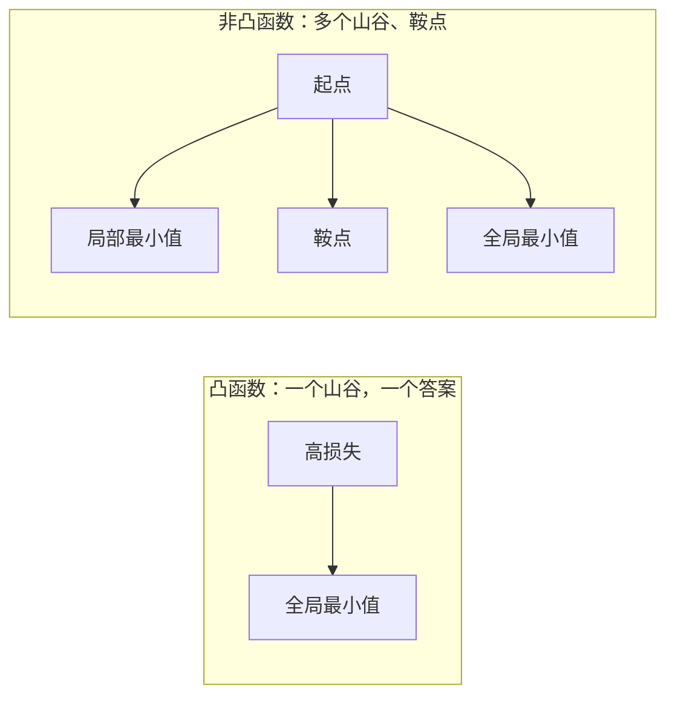
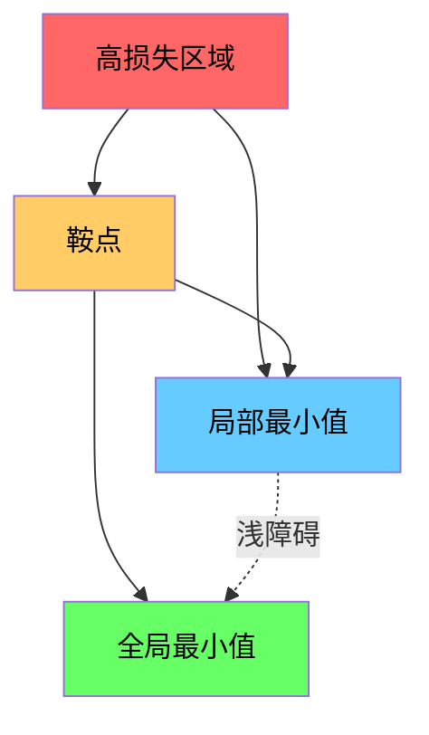

# 优化

> 训练一个神经网络，无非是在山谷里找到最低点。

**类型：** 构建
**语言：** Python
**前置要求：** 第一阶段，第 04-05 课（导数与梯度）
**时间：** 约 75 分钟

## 学习目标

- 从零实现普通梯度下降、带动量的 SGD 和 Adam
- 在 Rosenbrock 函数上对比各优化器的收敛表现，并解释 Adam 为何能为每个权重自适应调整学习率
- 区分凸与非凸损失地形，并解释高维空间中鞍点的作用
- 配置学习率调度策略（阶梯衰减、余弦退火、预热）以稳定训练

## 问题

你有一个损失函数。它告诉你模型错得有多离谱。你有梯度。它们告诉你哪个方向会让损失变得更糟。现在你需要一个策略来走下坡路。

最朴素的方案很简单：沿着梯度的反方向移动。用某个叫"学习率"的数来缩放步长。重复。这就是梯度下降，而且它确实有效。但"有效"是有条件的。学习率太大会直接越过山谷，在两面墙之间来回弹跳。太小的话你会以龟速爬向答案，白白浪费几千步。遇到鞍点你会原地停下，哪怕还没找到最小值。

深度学习里的每一种优化器，都是在回答同一个问题：如何更快、更可靠地抵达山谷底部？

## 概念

### 优化到底是什么

优化就是找到使函数最小（或最大）的输入值。在机器学习中，这个函数就是损失函数。输入就是模型的权重。训练就是优化。

```
最小化 L(w)，其中：
  L = 损失函数
  w = 模型权重（可能有数百万个参数）
```

### 梯度下降（普通版）

最朴素的优化器。对每个权重计算损失的梯度。把每个权重沿其梯度的反方向移动。步长由学习率缩放。

```
w = w - lr * gradient
```

这就是整个算法。一行代码。



### 学习率：最重要的超参数

学习率控制步长。它决定着收敛的一切。



并不存在一个计算学习率的公式。你通过实验来找。常见起点：Adam 用 0.001，带动量 SGD 用 0.01。

### SGD vs 批量 vs 小批量

普通梯度下降在走一步之前，要在整个数据集上计算梯度。这叫批量梯度下降。它稳定但慢。

随机梯度下降 (SGD) 在单个随机样本上计算梯度，然后立即走一步。它噪声大但快。

小批量梯度下降折中了二者。在一个小批量（32、64、128、256 个样本）上计算梯度，然后走一步。这才是实际中所有人都在用的。

| 变体 | 批量大小 | 梯度质量 | 每步速度 | 噪声 |
|------|---------|---------|---------|------|
| 批量 GD | 整个数据集 | 精确 | 慢 | 无 |
| SGD | 1 个样本 | 噪声很大 | 快 | 高 |
| 小批量 | 32-256 | 良好估计 | 均衡 | 中等 |

SGD 和小批量中的噪声不是 bug。它有助于逃出浅的局部极小值和鞍点。

### 动量：滚下山的球

普通梯度下降只看当前梯度。如果梯度 zigzag 振荡（在狭窄山谷中很常见），进展就会很慢。动量通过把过去梯度累积成一个速度项来解决这个问题。

```
v = beta * v + gradient
w = w - lr * v
```

打个比方：一颗滚下山的球。它不会在每一个坑洼处停下来重新起步。它在一致的方向上积累速度，并抑制振荡。


`beta`（通常为 0.9）控制保留多少历史信息。beta 越大，动量越大，路径越平滑，但对方向变化的响应越慢。

### Adam：自适应学习率

不同权重需要不同的学习率。一个很少遇到大梯度的权重，当它终于来一个大梯度时，应该迈更大的步子。一个持续收到巨大梯度的权重，步子应该小一点。

Adam（自适应矩估计）为每个权重追踪两个量：

1. 一阶矩 (m)：梯度的滑动平均（类似动量）
2. 二阶矩 (v)：梯度平方的滑动平均（梯度幅值）

```
m = beta1 * m + (1 - beta1) * gradient
v = beta2 * v + (1 - beta2) * gradient^2

m_hat = m / (1 - beta1^t)    偏差校正
v_hat = v / (1 - beta2^t)    偏差校正

w = w - lr * m_hat / (sqrt(v_hat) + epsilon)
```

除以 `sqrt(v_hat)` 是关键洞见。梯度大的权重被一个大的数除（有效步长变小）。梯度小的权重被一个小的数除（有效步长变大）。每个权重都得到了自己的自适应学习率。

默认超参数：`lr=0.001, beta1=0.9, beta2=0.999, epsilon=1e-8`。这些默认值在大多数问题上都表现良好。

### 学习率调度

固定的学习率是一种妥协。训练早期，你需要大步来快速推进。训练后期，你需要小步来在最小值附近精调。

常见调度策略：

| 调度 | 公式 | 使用场景 |
|------|------|---------|
| 阶梯衰减 | 每 N 个 epoch 将 lr 乘以一个因子 | 简单、手动控制 |
| 指数衰减 | lr = lr₀ * decay^t | 平滑缩减 |
| 余弦退火 | lr = lr_min + 0.5 * (lr_max - lr_min) * (1 + cos(π * t / T)) | Transformer、现代训练流程 |
| 预热 + 衰减 | 线性上升，然后衰减 | 大模型，防止早期不稳定 |

### 凸 vs 非凸

凸函数只有一个最小值。梯度下降总能找到它。像 `f(x) = x^2` 这样的二次函数是凸的。

神经网络的损失函数是非凸的。它们有很多局部极小值、鞍点和平坦区域。



实践中，高维神经网络中的局部极小值很少成为问题。大多数局部极小值的损失值都接近全局最小值。鞍点（某些方向平坦、其他方向弯曲）才是真正的障碍。动量和小批量的噪声有助于逃出鞍点。

### 损失地形可视化

损失是所有权重的函数。对于一个有 100 万个权重的模型，损失地形存在于 1,000,001 维空间中。我们通过在权重空间中选两个随机方向，沿这两个方向画出损失，从而得到一个 2D 曲面来可视化它。



尖锐的极小值泛化能力差。平坦的极小值泛化能力好。这就是为什么带动量 SGD 在最终测试准确率上常常优于 Adam 的一个原因：它的噪声阻止了模型陷入尖锐极小值。

## 动手实现

### 第 1 步：定义测试函数

Rosenbrock 函数是一个经典的优化基准。它的最小值在 (1, 1)，位于一个狭窄弯曲的山谷内 —— 这个山谷容易找到但很难沿着走下去。

```
f(x, y) = (1 - x)^2 + 100 * (y - x^2)^2
```

```python
def rosenbrock(params):
    x, y = params
    return (1 - x) ** 2 + 100 * (y - x ** 2) ** 2

def rosenbrock_gradient(params):
    x, y = params
    df_dx = -2 * (1 - x) + 200 * (y - x ** 2) * (-2 * x)
    df_dy = 200 * (y - x ** 2)
    return [df_dx, df_dy]
```

### 第 2 步：普通梯度下降

```python
class GradientDescent:
    def __init__(self, lr=0.001):
        self.lr = lr

    def step(self, params, grads):
        return [p - self.lr * g for p, g in zip(params, grads)]
```

### 第 3 步：带动量的 SGD

```python
class SGDMomentum:
    def __init__(self, lr=0.001, momentum=0.9):
        self.lr = lr
        self.momentum = momentum
        self.velocity = None

    def step(self, params, grads):
        if self.velocity is None:
            self.velocity = [0.0] * len(params)
        self.velocity = [
            self.momentum * v + g
            for v, g in zip(self.velocity, grads)
        ]
        return [p - self.lr * v for p, v in zip(params, self.velocity)]
```

### 第 4 步：Adam

```python
class Adam:
    def __init__(self, lr=0.001, beta1=0.9, beta2=0.999, epsilon=1e-8):
        self.lr = lr
        self.beta1 = beta1
        self.beta2 = beta2
        self.epsilon = epsilon
        self.m = None
        self.v = None
        self.t = 0

    def step(self, params, grads):
        if self.m is None:
            self.m = [0.0] * len(params)
            self.v = [0.0] * len(params)

        self.t += 1

        self.m = [
            self.beta1 * m + (1 - self.beta1) * g
            for m, g in zip(self.m, grads)
        ]
        self.v = [
            self.beta2 * v + (1 - self.beta2) * g ** 2
            for v, g in zip(self.v, grads)
        ]

        m_hat = [m / (1 - self.beta1 ** self.t) for m in self.m]
        v_hat = [v / (1 - self.beta2 ** self.t) for v in self.v]

        return [
            p - self.lr * mh / (vh ** 0.5 + self.epsilon)
            for p, mh, vh in zip(params, m_hat, v_hat)
        ]
```

### 第 5 步：运行并对比

```python
def optimize(optimizer, func, grad_func, start, steps=5000):
    params = list(start)
    history = [params[:]]
    for _ in range(steps):
        grads = grad_func(params)
        params = optimizer.step(params, grads)
        history.append(params[:])
    return history

start = [-1.0, 1.0]

gd_history = optimize(GradientDescent(lr=0.0005), rosenbrock, rosenbrock_gradient, start)
sgd_history = optimize(SGDMomentum(lr=0.0001, momentum=0.9), rosenbrock, rosenbrock_gradient, start)
adam_history = optimize(Adam(lr=0.01), rosenbrock, rosenbrock_gradient, start)

for name, history in [("GD", gd_history), ("SGD+M", sgd_history), ("Adam", adam_history)]:
    final = history[-1]
    loss = rosenbrock(final)
    print(f"{name:6s} -> x={final[0]:.6f}, y={final[1]:.6f}, loss={loss:.8f}")
```

预期输出：Adam 收敛最快。带动量的 SGD 路径更平滑。普通梯度下降在狭窄山谷中进展缓慢。

## 实际使用

实践中，使用 PyTorch 或 JAX 的优化器。它们处理参数分组、权重衰减、梯度裁剪和 GPU 加速。

```python
import torch

model = torch.nn.Linear(784, 10)

sgd = torch.optim.SGD(model.parameters(), lr=0.01, momentum=0.9)
adam = torch.optim.Adam(model.parameters(), lr=0.001)
adamw = torch.optim.AdamW(model.parameters(), lr=0.001, weight_decay=0.01)

scheduler = torch.optim.lr_scheduler.CosineAnnealingLR(adam, T_max=100)
```

经验法则：

- 从 Adam (lr=0.001) 开始。大多数问题无需调参就能跑。
- 当你需要最好的最终精度并且能承受更多调参时，切换到带动量的 SGD (lr=0.01, momentum=0.9)。
- 对 Transformer 使用 AdamW（解耦权重衰减的 Adam）。
- 训练超过几个 epoch 时，务必使用学习率调度。
- 训练不稳定？降低学习率。训练太慢？提高学习率。

## 交付物

本课产出一个选择优化器的 AI 提示词，见 `outputs/prompt-optimizer-guide.md`。

本课构建的优化器类（GradientDescent、SGDMomentum、Adam）将在第三阶段从零训练神经网络时再次出现。

## 联系

本课的所有概念都与现代 AI 的具体部分相连接：

| 概念 | 出现在哪里 |
|------|-----------|
| 梯度下降 | 所有神经网络训练的基础 —— 每一个 `optimizer.step()` 调用 |
| 学习率 | 训练中最重要的超参数；调参时第一个要动的值 |
| 动量 | SGD 的标配；几乎所有生产级训练的默认选项 |
| Adam | 深度学习默认优化器；无需手动调参就能在大多数任务上工作 |
| 自适应学习率 | Adam/RMSprop/AdaGrad —— 每个权重有自己的步长 |
| 小批量 | 所有 GPU 训练的基础；批量大小受显存限制 |
| 学习率调度 | Transformer 训练的关键（余弦退火 + 预热几乎是强制要求） |
| 偏差校正 | Adam 早期步骤的稳定性保障；防止冷启动发散 |
| 凸 vs 非凸 | NN 损失函数非凸，但实践中局部极小值很少是问题 |
| 鞍点 | 高维优化中真正的障碍；动量和噪声帮你逃出去 |
| 损失地形 | 平坦极小值泛化更好；SGD 的噪声天然倾向于平坦区域 |

Adam 值得专门说一说。它追踪梯度的滑动平均（一阶矩）和梯度平方的滑动平均（二阶矩），为每个权重算出独立的步长。经常收到大梯度的权重会自动缩小步长，梯度稀疏的权重会自动放大步长。这种"逐权重自适应"意味着你不必为每一层单独设置学习率。但代价是：Adam 有时会陷入比 SGD 更尖锐的极小值，导致测试集上泛化略差。这也是为什么有些论文在最前沿结果中仍然使用带动量的 SGD。

## 练习

1. **学习率扫描。** 对 Rosenbrock 函数使用学习率 [0.0001, 0.0005, 0.001, 0.005, 0.01] 运行普通梯度下降。输出每个学习率在 5000 步后的最终损失。找出仍然能收敛的最大学习率。

2. **动量对比。** 对 Rosenbrock 函数使用动量值 [0.0, 0.5, 0.9, 0.99] 运行带动量 SGD。跟踪每一步的损失。哪个动量值收敛最快？哪个会冲过头？

3. **逃离鞍点。** 定义函数 `f(x, y) = x^2 - y^2`（原点是一个鞍点）。从 (0.01, 0.01) 开始。对比普通 GD、带动量 SGD 和 Adam 的表现。哪个能逃出鞍点？

4. **实现学习率衰减。** 给 GradientDescent 类添加指数衰减调度：`lr = lr₀ * 0.999^step`。在 Rosenbrock 函数上对比有衰减和无衰减的收敛表现。

## 关键术语

| 术语 | 大家怎么说的 | 实际含义 |
|------|-------------|----------|
| 梯度下降 | "往山下走" | 减去按学习率缩放的梯度来更新权重。最基础的优化器。 |
| 学习率 | "步长" | 一个标量，控制每次更新时权重移动多远。太大会导致发散，太小浪费算力。 |
| 动量 | "继续滚" | 把过去的梯度累积成一个速度向量。抑制振荡，加速一致方向的移动。 |
| SGD | "随机采样" | 随机梯度下降。在随机子集上算梯度而非完整数据集。实践中几乎总是指小批量 SGD。 |
| 小批量 | "一小撮数据" | 用于估计梯度的训练数据的一小部分（32-256 样本）。在速度和梯度精度之间取得平衡。 |
| Adam | "默认优化器" | 自适应矩估计。追踪每个权重的梯度和梯度平方的滑动平均，给每个权重分配自己的学习率。 |
| 偏差校正 | "修复冷启动" | Adam 的一阶和二阶矩初始化为零。偏差校正通过除以 (1 - beta^t) 在早期步骤中进行补偿。 |
| 学习率调度 | "随时间改变 lr" | 训练期间调整学习率的函数。早期大步走，后期小步精调。 |
| 凸函数 | "只有一个山谷" | 任意局部最小值就是全局最小值的函数。梯度下降总能找到它。神经网络损失不是凸的。 |
| 鞍点 | "平坦但不是最小值" | 梯度为零，但在某些方向是最小值、其他方向是最大值的点。高维空间中很常见。 |
| 损失地形 | "地形图" | 损失函数在权重空间上的图像。通过沿两个随机方向切片来可视化。 |
| 收敛 | "到了" | 优化器到达了一个后续步骤不再有意义降低损失的点。 |

## 进一步阅读

- [Sebastian Ruder: An overview of gradient descent optimization algorithms](https://ruder.io/optimizing-gradient-descent/) - 所有主流优化器的全面综述
- [Why Momentum Really Works (Distill)](https://distill.pub/2017/momentum/) - 动量动力学的交互式可视化
- [Adam: A Method for Stochastic Optimization (Kingma & Ba, 2014)](https://arxiv.org/abs/1412.6980) - Adam 原论文，易读且短
- [Visualizing the Loss Landscape of Neural Nets (Li et al., 2018)](https://arxiv.org/abs/1712.09913) - 揭示了尖锐 vs 平坦极小值的论文
