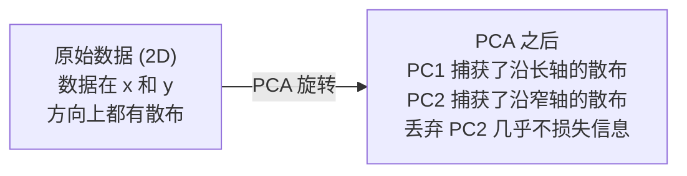

# 降维

> 高维数据有结构。从正确的角度看，你就能找到它。

**类型：** 构建型
**语言：** Python
**前置条件：** 阶段 1，第 01 课（线性代数直觉）、第 02 课（向量、矩阵与运算）、第 03 课（特征值与特征向量）、第 06 课（概率与分布）
**时间：** 约 90 分钟

## 学习目标

- 从零实现 PCA：中心化数据、计算协方差矩阵、特征分解、投影
- 使用解释方差比率和肘部法则选择主成分数量
- 在 MNIST 数字 2D 可视化上比较 PCA、t-SNE 和 UMAP，并解释各自的权衡
- 使用 RBF 核的核 PCA 来分离标准 PCA 无法处理的非线性数据结构

## 问题

你有一个每个样本 784 维特征的数据集。可能是手写数字的像素值，可能是基因表达水平，也可能是用户行为信号。你无法可视化 784 维。你画不出图，甚至无法在脑中想象。

但这 784 个特征中大多数是冗余的。真正的信息住在一个小得多的曲面上。一个手写数字"7"不需要 784 个独立数字来描述它，只需要几个：笔画的角度、横杠的长度、倾斜多少。剩下的全是噪声。

降维就是要找到那个更小的曲面。它把你的 784 维数据压缩到 2 维、10 维或 50 维，同时保留真正重要的结构。

## 概念

### 维度灾难

高维空间是反直觉的。维度增长时，三件事会崩溃。

**距离变得无意义。** 在高维中，任意两个随机点之间的距离会收敛到相同的值。如果每个点到其他每个点的距离都差不多，最近邻搜索就失效了。

```
维度    随机点之间的平均距离比（最大值/最小值）
2            ~5.0
10           ~1.8
100          ~1.2
1000         ~1.02
```

**体积集中在角落。** d 维超立方体有 2^d 个角。在 100 维中，几乎全部体积都在角落，远离中心。数据点散落到边缘，你的模型在内部区域严重缺少数据。

**你需要指数级更多的数据。** 要保持空间中样本密度不变，从 2D 升到 20D 意味着需要 10^18 倍的数据。你永远不够。降维把数据密度拉回到可用的状态。

### PCA：找到真正重要的方向

主成分分析（PCA）找到数据变化最大的那些轴。它旋转你的坐标系，让第一个轴捕获最多方差，第二个捕获次多，以此类推。

算法步骤：

```
1. 中心化数据          （每个特征减去其均值）
2. 计算协方差矩阵      （特征之间如何一起变动）
3. 特征分解            （找到主方向）
4. 按特征值排序        （方差最大的排最前）
5. 投影                （保留前 k 个特征向量，丢弃其余）
```

为什么用特征分解？协方差矩阵是对称半正定的。它的特征向量是特征空间中互相正交的方向。特征值告诉你每个方向捕获了多少方差。特征值最大的特征向量指向方差最大的方向。



- **PCA 之前：** 数据云斜穿 x 和 y 两个轴
- **PCA 之后：** 坐标系被旋转，使 PC1 对齐方差最大的方向（沿长轴的散布），PC2 对齐方差最小的方向（沿窄轴的散布）
- **降维：** 丢弃 PC2 将数据投影到 PC1 上，丢失的信息微乎其微

### 解释方差比率

每个主成分捕获了总方差的一部分。解释方差比率告诉你这一部分有多大。

```
成分     特征值     解释比率     累积
PC1      4.73       0.473        0.473
PC2      2.51       0.251        0.724
PC3      1.12       0.112        0.836
PC4      0.89       0.089        0.925
...
```

当累积解释方差达到 0.95 时，你就知道这么多成分捕获了 95% 的信息。之后的基本都是噪声。

### 选择成分数量

三种策略：

1. **阈值法。** 保留足够多的成分来解释 90-95% 的方差。
2. **肘部法则。** 画出每个成分的解释方差，寻找急剧下降的拐点。
3. **下游性能法。** 把 PCA 作为预处理步骤。扫描 k 值，测量模型准确率。准确率不再提升的那个 k 就是最优值。

### t-SNE：保留邻域结构

t-分布随机邻域嵌入（t-SNE）专为可视化设计。它把高维数据映射到 2D（或 3D），同时保留哪些点彼此靠近的结构。

直觉：在原始空间中，基于距离计算点对的概率分布。近的点高概率，远的点低概率。然后在 2D 中找一个排布，使同样的概率分布成立。在 784 维中是邻居的点，在 2D 中仍然是邻居。

t-SNE 的关键特性：
- 非线性。它能展开 PCA 无法处理的复杂流形。
- 随机性。每次运行产生不同的布局。
- 困惑度参数控制考虑多少邻居（典型范围：5-50）。
- 输出中簇之间的距离没有意义。只有簇本身有意义。
- 大数据集上很慢。默认 O(n²)。

### UMAP：更快，全局结构更好

均匀流形近似与投影（UMAP）工作方式与 t-SNE 类似，但有两个优势：
- 更快。它使用近似最近邻图，而不是计算所有点对距离。
- 全局结构更好。输出中簇之间的相对位置通常比 t-SNE 更有意义。

UMAP 在高维空间中构建一个加权图（"模糊拓扑表示"），然后找一个尽可能保留这个图的低维布局。

关键参数：
- `n_neighbors`：多少邻居定义局部结构（类似困惑度）。值越大，保留的全局结构越多。
- `min_dist`：输出中点之间挤得多紧。值越小，簇越密集。

### 什么时候用哪个

| 方法 | 使用场景 | 保留什么 | 速度 |
|--------|----------|-----------|-------|
| PCA | 训练前预处理 | 全局方差 | 快（精确解），百万级样本可用 |
| PCA | 快速探索性可视化 | 线性结构 | 快 |
| t-SNE | 发表级别的 2D 图 | 局部邻域 | 慢（理想 < 1 万样本） |
| UMAP | 大规模 2D 可视化 | 局部 + 部分全局结构 | 中等（百万级可用） |
| PCA | 模型的特征降维 | 按方差排序的特征 | 快 |
| t-SNE / UMAP | 理解聚类结构 | 簇的分离 | 中等到慢 |

经验法则：PCA 用于预处理和数据压缩。需要 2D 可视化结构时用 t-SNE 或 UMAP。

### 核 PCA

标准 PCA 找到的是线性子空间。它旋转你的坐标系然后丢弃轴。但如果数据落在一个非线性流形上呢？2D 中的一个圆无法用任何直线分开，标准 PCA 无能为力。

核 PCA 在核函数引入的高维特征空间中做 PCA，而无需显式地计算该空间中的坐标。这就是核技巧 —— 支撑 SVM 的同一思路。

算法：
1. 计算核矩阵 K，其中 K_ij = k(x_i, x_j)
2. 在特征空间中对核矩阵进行中心化
3. 对中心化后的核矩阵做特征分解
4. 前几个特征向量（按 1/sqrt(特征值) 缩放）就是投影结果

常见核函数：

| 核函数 | 公式 | 适用场景 |
|--------|---------|----------|
| RBF（高斯核） | exp(-gamma * \|\|x - y\|\|^2) | 大多数非线性数据、光滑流形 |
| 多项式核 | (x . y + c)^d | 多项式关系 |
| Sigmoid 核 | tanh(alpha * x . y + c) | 类似神经网络的映射 |

何时用核 PCA vs 标准 PCA：

| 判据 | 标准 PCA | 核 PCA |
|-----------|-------------|------------|
| 数据结构 | 线性子空间 | 非线性流形 |
| 速度 | O(min(n²d, d²n)) | O(n²d + n³) |
| 可解释性 | 成分是特征的线性组合 | 成分缺少直接的特征解释 |
| 可扩展性 | 百万级样本可用 | 核矩阵是 n×n 的，受内存限制 |
| 重构 | 可直接逆变换 | 需要 pre-image 近似 |

经典示例：2D 中的同心圆。两圈点，一圈套一圈。标准 PCA 把两者投影到同一条线上 —— 对分类毫无用处。带 RBF 核的核 PCA 把内圈和外圈映射到不同区域，使它们线性可分。

### 重构误差

你的降维做得好不好？你把 784 维压缩到了 50 维，丢掉了什么？

度量重构误差：
1. 将数据投影到 k 维：X_reduced = X @ W_k
2. 重构：X_hat = X_reduced @ W_k^T
3. 计算 MSE：mean((X - X_hat)²)

对 PCA 而言，重构误差与解释方差有一个干净的关系：

```
重构误差 = 未被包含的特征值之和
总方差   = 所有特征值之和
丢失比例 = (被丢弃的特征值之和) / (所有特征值之和)
```

每个成分的解释方差比率为：

```
explained_ratio_k = eigenvalue_k / sum(所有特征值)
```

将累积解释方差随成分数量绘制出来，就得到"肘部"曲线。成分数量的正确选择是：
- 曲线趋于平坦的地方（边际收益递减）
- 累积方差越过你的阈值（通常 0.90 或 0.95）
- 下游任务性能不再提升的地方

重构误差不止用于选择 k。你还可以用它做异常检测：重构误差高的样本是离群点，它们不符合学到的子空间。这是生产系统中基于 PCA 做异常检测的基础。

## 动手实现

### 第 1 步：从零实现 PCA

```python
import numpy as np

class PCA:
    def __init__(self, n_components):
        self.n_components = n_components
        self.components = None
        self.mean = None
        self.eigenvalues = None
        self.explained_variance_ratio_ = None

    def fit(self, X):
        self.mean = np.mean(X, axis=0)
        X_centered = X - self.mean

        cov_matrix = np.cov(X_centered, rowvar=False)

        eigenvalues, eigenvectors = np.linalg.eigh(cov_matrix)

        sorted_idx = np.argsort(eigenvalues)[::-1]
        eigenvalues = eigenvalues[sorted_idx]
        eigenvectors = eigenvectors[:, sorted_idx]

        self.components = eigenvectors[:, :self.n_components].T
        self.eigenvalues = eigenvalues[:self.n_components]
        total_var = np.sum(eigenvalues)
        self.explained_variance_ratio_ = self.eigenvalues / total_var

        return self

    def transform(self, X):
        X_centered = X - self.mean
        return X_centered @ self.components.T

    def fit_transform(self, X):
        self.fit(X)
        return self.transform(X)
```

### 第 2 步：在合成数据上测试

```python
np.random.seed(42)
n_samples = 500

t = np.random.uniform(0, 2 * np.pi, n_samples)
x1 = 3 * np.cos(t) + np.random.normal(0, 0.2, n_samples)
x2 = 3 * np.sin(t) + np.random.normal(0, 0.2, n_samples)
x3 = 0.5 * x1 + 0.3 * x2 + np.random.normal(0, 0.1, n_samples)

X_synthetic = np.column_stack([x1, x2, x3])

pca = PCA(n_components=2)
X_reduced = pca.fit_transform(X_synthetic)

print(f"Original shape: {X_synthetic.shape}")
print(f"Reduced shape:  {X_reduced.shape}")
print(f"Explained variance ratios: {pca.explained_variance_ratio_}")
print(f"Total variance captured: {sum(pca.explained_variance_ratio_):.4f}")
```

### 第 3 步：MNIST 数字的 2D 可视化

```python
from sklearn.datasets import fetch_openml

mnist = fetch_openml("mnist_784", version=1, as_frame=False, parser="auto")
X_mnist = mnist.data[:5000].astype(float)
y_mnist = mnist.target[:5000].astype(int)

pca_mnist = PCA(n_components=50)
X_pca50 = pca_mnist.fit_transform(X_mnist)
print(f"50 components capture {sum(pca_mnist.explained_variance_ratio_):.2%} of variance")

pca_2d = PCA(n_components=2)
X_pca2d = pca_2d.fit_transform(X_mnist)
print(f"2 components capture {sum(pca_2d.explained_variance_ratio_):.2%} of variance")
```

### 第 4 步：与 sklearn 对比

```python
from sklearn.decomposition import PCA as SklearnPCA
from sklearn.manifold import TSNE

sklearn_pca = SklearnPCA(n_components=2)
X_sklearn_pca = sklearn_pca.fit_transform(X_mnist)

print(f"\nOur PCA explained variance:     {pca_2d.explained_variance_ratio_}")
print(f"Sklearn PCA explained variance: {sklearn_pca.explained_variance_ratio_}")

diff = np.abs(np.abs(X_pca2d) - np.abs(X_sklearn_pca))
print(f"Max absolute difference: {diff.max():.10f}")

tsne = TSNE(n_components=2, perplexity=30, random_state=42)
X_tsne = tsne.fit_transform(X_mnist)
print(f"\nt-SNE output shape: {X_tsne.shape}")
```

### 第 5 步：UMAP 对比

```python
try:
    from umap import UMAP

    reducer = UMAP(n_components=2, n_neighbors=15, min_dist=0.1, random_state=42)
    X_umap = reducer.fit_transform(X_mnist)
    print(f"UMAP output shape: {X_umap.shape}")
except ImportError:
    print("Install umap-learn: pip install umap-learn")
```

## 实际使用

PCA 作为分类器之前的预处理步骤：

```python
from sklearn.decomposition import PCA as SklearnPCA
from sklearn.linear_model import LogisticRegression
from sklearn.model_selection import train_test_split
from sklearn.metrics import accuracy_score

X_train, X_test, y_train, y_test = train_test_split(
    X_mnist, y_mnist, test_size=0.2, random_state=42
)

results = {}
for k in [10, 30, 50, 100, 200]:
    pca_k = SklearnPCA(n_components=k)
    X_tr = pca_k.fit_transform(X_train)
    X_te = pca_k.transform(X_test)

    clf = LogisticRegression(max_iter=1000, random_state=42)
    clf.fit(X_tr, y_train)
    acc = accuracy_score(y_test, clf.predict(X_te))
    var_captured = sum(pca_k.explained_variance_ratio_)
    results[k] = (acc, var_captured)
    print(f"k={k:>3d}  accuracy={acc:.4f}  variance={var_captured:.4f}")
```

性能在到达 784 维之前就已经趋于稳定。那个稳定点就是你的工作点。

## 交付物

本课产出：
- `outputs/skill-dimensionality-reduction.md` —— 一份技能指南：如何为给定任务选择合适的降维技术

## 联系

本课的所有概念都与现代 AI 的具体部分相连接：

| 概念 | 出现在哪里 |
|---------|------------------|
| PCA | 数据预处理管道、特征压缩、去噪、异常检测 |
| 协方差矩阵 | 金融风险模型、马氏距离、白化变换 |
| 解释方差比率 | 选择模型输入维度、评估信息损失 |
| t-SNE | 论文中的可视化、embedding 质量检查、聚类探索 |
| UMAP | 大规模数据可视化、单细胞 RNA 测序、高维传感器数据 |
| 核 PCA | 非线性数据压缩、图像去噪、生物信息学中的非线性模式提取 |
| 重构误差 | PCA 异常检测、自编码器损失函数、生成模型评估 |
| 流形假设 | 自编码器、GAN、扩散模型 —— 都假设数据落在一个低维流形上 |

降维不仅是可视化工具。在生产系统中，PCA 被用于在训练前压缩特征以加速模型、去除相关特征之间的冗余、在数据管道中检测离群点。t-SNE 和 UMAP 被研究人员日常用来检查学习到的表示是否形成了有意义的聚类。流形假设（数据落在一个低维曲面上）是整个深度生成模型领域的基础。

## 练习

1. 修改 PCA 类以支持 `inverse_transform`。分别用 10、50 和 200 个成分重构 MNIST 数字。输出每种情况的重构误差（与原始数据的均方误差）。

2. 在同样的 MNIST 子集上运行 t-SNE，困惑度分别取 5、30 和 100。描述输出如何变化。为什么困惑度会影响簇的紧密度？

3. 用一个 50 维特征但只有 5 维是信息性的数据集（用 `sklearn.datasets.make_classification` 生成）。应用 PCA，检查解释方差曲线是否正确识别出数据实际上是 5 维的。

## 关键术语

| 术语 | 大家怎么说的 | 实际含义 |
|------|----------------|----------------------|
| 维度灾难 | "特征太多了" | 距离、体积和数据密度在维度增长时全部以反直觉的方式变化。模型需要指数级更多的数据来弥补。 |
| PCA | "降维" | 旋转坐标系使轴对齐方差最大的方向，然后丢弃低方差轴。 |
| 主成分 | "一个重要的方向" | 协方差矩阵的特征向量。数据在特征空间中变化最大的方向。 |
| 解释方差比率 | "这个成分包含多少信息" | 一个主成分捕获的方差占总方差的比例。把前 k 个比率加起来就知道 k 个成分保留了多少信息。 |
| 协方差矩阵 | "特征之间的相关程度" | 一个对称矩阵，其中 (i,j) 项度量特征 i 和特征 j 一起变动的程度。对角线项是各特征自身的方差。 |
| t-SNE | "那张聚类图" | 一种通过保留成对邻域概率来将高维数据映射到 2D 的非线性方法。适合可视化，不适合做预处理。 |
| UMAP | "更快的 t-SNE" | 一种基于拓扑数据分析的非线性方法。同时保留局部和部分全局结构。比 t-SNE 扩展性更好。 |
| 困惑度 | "t-SNE 的调节旋钮" | 控制每个点考虑的有效邻居数量。低困惑度聚焦于非常局部的结构，高困惑度捕获更宏观的模式。 |
| 流形 | "数据所在的曲面" | 嵌入高维空间中的低维曲面。一张在 3D 中被揉皱的纸是一个 2D 流形。 |

## 进一步阅读

- [A Tutorial on Principal Component Analysis](https://arxiv.org/abs/1404.1100) (Shlens) —— 从头清晰推导 PCA
- [How to Use t-SNE Effectively](https://distill.pub/2016/misread-tsne/) (Wattenberg 等) —— t-SNE 的陷阱和参数选择的交互式指南
- [UMAP 文档](https://umap-learn.readthedocs.io/) —— UMAP 作者给出的理论和实践指导
