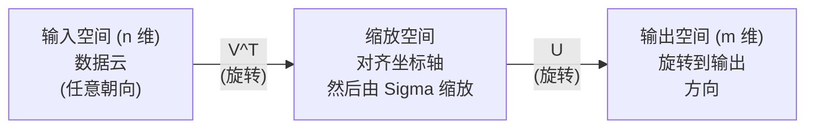
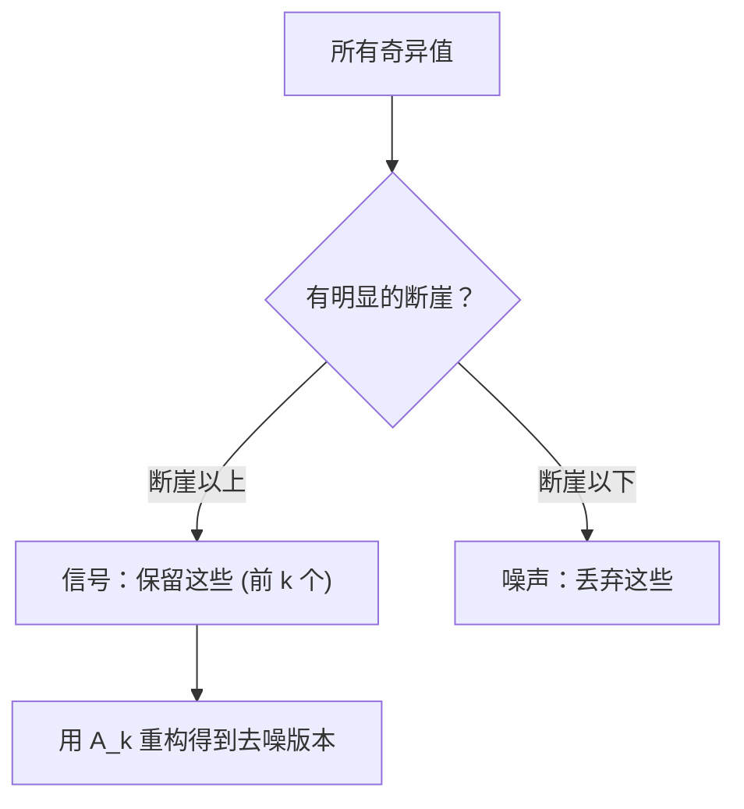

# 奇异值分解

> SVD 是线性代数的瑞士军刀。每个矩阵都有 SVD，每个数据科学家都需要它。

**类型：** 构建型
**语言：** Python、Julia
**前置条件：** 阶段 1，第 01 课（线性代数直觉）、第 02 课（向量与矩阵运算）、第 03 课（矩阵变换）
**时间：** 约 120 分钟

## 学习目标

- 通过幂迭代从零实现 SVD，并解释 U、Sigma 和 V^T 的几何含义
- 应用截断 SVD 做图像压缩，并度量压缩比与重构误差的关系
- 通过 SVD 计算 Moore-Penrose 伪逆来求解超定最小二乘方程组
- 将 SVD 与 PCA、推荐系统（隐因子）和 NLP 中的潜在语义分析建立联系

## 问题

你有一个 1000×2000 的矩阵。可能是用户-电影评分，可能是文档-词项频率表，也可能是图像的像素值。你需要压缩它、去噪、发现其中隐藏的结构，或者用它求解一个最小二乘方程组。特征分解只适用于方阵，而且要求矩阵有完整的线性无关的特征向量集。

SVD 适用于任意矩阵。任意形状，任意秩，无条件限制。它把矩阵分解为三个因子，揭示了矩阵对空间做了什么几何操作。它是整个线性代数中最通用、最有用的分解。

## 概念

### SVD 在几何上做了什么

每个矩阵，无论形状如何，都依次执行三个操作：旋转、缩放、旋转。SVD 把这种分解显式地写了出来。

```
A = U * Sigma * V^T

      m × n     m × m    m × n    n × n
     (任意)    (旋转)   (缩放)   (旋转)
```

给定任意矩阵 A，SVD 把它分解为：
- V^T 在输入空间（n 维）中旋转向量
- Sigma 沿各轴做缩放（拉伸或压缩）
- U 把结果旋转到输出空间（m 维）



可以这样理解。你把一个矩阵交给 SVD，它告诉你："这个矩阵拿到一个由输入向量构成的球，首先用 V^T 旋转它，然后用 Sigma 把它拉伸成一个椭球，最后用 U 把这个椭球再旋转一次。"奇异值就是椭球各轴的长度。

### 完整分解

对一个形状为 m×n 的矩阵 A：

```
A = U * Sigma * V^T

其中：
  U     是 m×m，正交阵 (U^T U = I)
  Sigma 是 m×n，对角阵（对角线上是奇异值）
  V     是 n×n，正交阵 (V^T V = I)

奇异值 sigma_1 >= sigma_2 >= ... >= sigma_r > 0
其中 r = rank(A)
```

U 的列称为左奇异向量，V 的列称为右奇异向量，Sigma 的对角线元素称为奇异值。它们始终非负，并按降序排列。

### 左奇异向量、奇异值、右奇异向量

SVD 的每个分量都有明确的几何含义。

**右奇异向量（V 的列）：** 它们构成输入空间 (R^n) 的一组标准正交基。它们是输入空间中矩阵会映射到输出空间中正交方向的方向。把它们看作定义域的自然坐标系。

**奇异值（Sigma 的对角线）：** 这些是缩放因子。第 i 个奇异值告诉你矩阵沿第 i 个右奇异向量把向量拉伸了多少。奇异值为零意味着矩阵把那个方向完全压扁了。

**左奇异向量（U 的列）：** 它们构成输出空间 (R^m) 的一组标准正交基。第 i 个左奇异向量是第 i 个右奇异向量（经缩放后）在输出空间中落到的方向。

它们之间的关系：

```
A * v_i = sigma_i * u_i

矩阵 A 取第 i 个右奇异向量 v_i，
用 sigma_i 缩放它，然后映射到第 i 个左奇异向量 u_i。
```

这给了你一个逐坐标精确理解任意矩阵在做什么的画面。

### 外积形式

SVD 可以写成秩-1 矩阵之和：

```
A = sigma_1 * u_1 * v_1^T + sigma_2 * u_2 * v_2^T + ... + sigma_r * u_r * v_r^T

每一项 sigma_i * u_i * v_i^T 是一个秩-1 矩阵（一个外积）。
完整矩阵是 r 个这种矩阵的和，其中 r 是秩。
```

这种形式是低秩近似的基础。每一项增加一层结构。第一项捕获最重要的一种模式，第二项捕获次重要的，以此类推。截断这个求和式就能得到给定秩下的最优近似。

```
秩-1 近似：    A_1 = sigma_1 * u_1 * v_1^T
               （捕获主导模式）

秩-2 近似：    A_2 = sigma_1 * u_1 * v_1^T + sigma_2 * u_2 * v_2^T
               （捕获两个最重要的模式）

秩-k 近似：    A_k = 前 k 项之和
               （由 Eckart-Young 定理保证最优）
```

### 与特征分解的关系

SVD 与特征分解有深刻联系。A 的奇异值和奇异向量直接来自 A^T A 和 A A^T 的特征值和特征向量。

```
A^T A = V * Sigma^T * U^T * U * Sigma * V^T
      = V * Sigma^T * Sigma * V^T
      = V * D * V^T

其中 D = Sigma^T * Sigma 是对角阵，对角线上为 sigma_i^2。

因此：
- 右奇异向量 (V) 是 A^T A 的特征向量
- 奇异值的平方 (sigma_i^2) 是 A^T A 的特征值

类似地：
A A^T = U * Sigma * V^T * V * Sigma^T * U^T
      = U * Sigma * Sigma^T * U^T

因此：
- 左奇异向量 (U) 是 A A^T 的特征向量
- A A^T 的特征值也是 sigma_i^2
```

这个联系告诉了你三件事：
1. 奇异值始终是实数且非负（它们是半正定矩阵特征值的平方根）。
2. 你可以通过对 A^T A 做特征分解来计算 SVD，但这会把条件数平方，损失数值精度。专用的 SVD 算法会避免这一点。
3. 当 A 是方阵且对称半正定时，SVD 和特征分解是同一回事。

### 截断 SVD：低秩近似

Eckart-Young-Mirsky 定理指出，A 的最优秩-k 近似（在 Frobenius 范数和谱范数下）只需保留前 k 个奇异值及其对应的向量即可得到：

```
A_k = U_k * Sigma_k * V_k^T

其中：
  U_k     是 m×k  (U 的前 k 列)
  Sigma_k 是 k×k  (Sigma 的左上 k×k 块)
  V_k     是 n×k  (V 的前 k 列)

近似误差 = sigma_{k+1}             （谱范数下）
         = sqrt(sigma_{k+1}^2 + ... + sigma_r^2)  （Frobenius 范数下）
```

这不仅仅是"一个不错的"近似。它是可证明的最优秩-k 近似。没有任何其他秩-k 矩阵比它更接近 A。

| 分量 | 相对大小 | 秩-3 近似中保留？ |
|-----------|-------------------|------------------------|
| sigma_1 | 最大 | 是 |
| sigma_2 | 大 | 是 |
| sigma_3 | 中大 | 是 |
| sigma_4 | 中 | 否（误差） |
| sigma_5 | 中小 | 否（误差） |
| sigma_6 | 小 | 否（误差） |
| sigma_7 | 很小 | 否（误差） |
| sigma_8 | 微小 | 否（误差） |

保留前 3 项：A_3 捕获三个最大的奇异值。误差 = 剩余值 (sigma_4 到 sigma_8)。

如果奇异值衰减很快，很小的 k 就能捕获矩阵的绝大部分。如果衰减很慢，矩阵就没有低秩结构。

### 用 SVD 做图像压缩

灰度图像是一个像素强度矩阵。一张 800×600 的图像有 480,000 个值。SVD 让你用远少于它的数值来近似它。

```
原始图像：800 × 600 = 480,000 个值

秩-k 的 SVD：
  U_k:      800 × k 个值
  Sigma_k:  k 个值
  V_k:      600 × k 个值
  总计：    k × (800 + 600 + 1) = k × 1401 个值

  k=10:   14,010 个值   （原始的 2.9%）
  k=50:   70,050 个值   （原始的 14.6%）
  k=100: 140,100 个值   （原始的 29.2%）

  k 越小压缩比越高，但视觉质量会下降。
```

关键洞察：自然图像的奇异值衰减很快。前几个奇异值捕获大结构（形状、渐变），后面的捕获细节和噪声。截断到秩 50 通常能产生几乎与原图一致的图像，同时减少 85% 的存储。

### SVD 用于推荐系统

Netflix Prize 让它出了名。你有一个用户-电影评分矩阵，大部分条目缺失。

```
             电影1  电影2  电影3  电影4  电影5
  用户1      [  5      ?      3      ?      1  ]
  用户2      [  ?      4      ?      2      ?  ]
  用户3      [  3      ?      5      ?      ?  ]
  用户4      [  ?      ?      ?      4      3  ]

  ? = 未知评分
```

思路：这个评分矩阵秩很低。用户的口味并非完全独立。存在少数几个隐因子（动作 vs 剧情、老片 vs 新片、烧脑 vs 爽片）能解释大部分偏好。

对（填充后的）评分矩阵做 SVD，得到：
- U：隐因子空间中的用户画像
- Sigma：每个隐因子的重要性
- V^T：隐因子空间中的电影画像

用户对某部电影的预测评分是其用户画像与电影画像的点积（按奇异值加权）。低秩近似会自动填充缺失条目。

实践中，你会使用变体方法，如 Simon Funk 的增量 SVD 或 ALS（交替最小二乘），它们直接处理缺失数据。但核心思想是一样的：通过 SVD 做隐因子分解。

### SVD 在 NLP 中：潜在语义分析

潜在语义分析（LSA），也称潜在语义索引（LSI），是对词项-文档矩阵应用 SVD。

```
             文档1  文档2  文档3  文档4
  "猫"       [  3      0      1      0  ]
  "狗"       [  2      0      0      1  ]
  "鱼"       [  0      4      1      0  ]
  "宠物"     [  1      1      1      1  ]
  "海洋"     [  0      3      0      0  ]

秩 k=2 的 SVD 之后：

  每篇文档变成 2D "概念空间"中的一个点。
  每个词项变成同一个 2D 空间中的点。
  相似主题的文档聚在一起。
  相似含义的词项聚在一起。

  "猫"和"狗"靠得很近（陆地宠物）。
  "鱼"和"海洋"靠得很近（水域概念）。
  文档1 和文档3 如果主题相似就会聚在一起。
```

LSA 是最早成功从原始文本中捕获语义相似性的方法之一。它之所以有效，是因为同义词往往出现在相似的文档中，SVD 因此将它们归入同一个隐维度。现代词嵌入方法（Word2Vec、GloVe）可以看作这一思想的后代。

### SVD 用于降噪

噪声数据中，信号集中在前面几个奇异值上，而噪声散布在所有奇异值上。截断就去除了噪声基底。

**干净信号的奇异值：**

| 分量 | 大小 | 类型 |
|-----------|-----------|------|
| sigma_1 | 非常大 | 信号 |
| sigma_2 | 大 | 信号 |
| sigma_3 | 中 | 信号 |
| sigma_4 | 接近零 | 可忽略 |
| sigma_5 | 接近零 | 可忽略 |

**含噪信号的奇异值（噪声使所有值都增加）：**

| 分量 | 大小 | 类型 |
|-----------|-----------|------|
| sigma_1 | 非常大 | 信号 |
| sigma_2 | 大 | 信号 |
| sigma_3 | 中 | 信号 |
| sigma_4 | 小 | 噪声 |
| sigma_5 | 小 | 噪声 |
| sigma_6 | 小 | 噪声 |
| sigma_7 | 小 | 噪声 |



这被用于信号处理、科学测量和数据清洗。任何时候你有一个被加性噪声污染的矩阵，截断 SVD 就是一种有理论依据的、把信号和噪声分开的方法。

### 通过 SVD 求伪逆

Moore-Penrose 伪逆 A⁺ 把矩阵求逆推广到了非方阵和奇异矩阵。SVD 让它变得简单到只需几步操作。

```
若 A = U * Sigma * V^T，则：

A⁺ = V * Sigma⁺ * U^T

其中 Sigma⁺ 的形成方式是：
  1. 转置 Sigma（交换行和列）
  2. 将每个非零对角元素 sigma_i 替换为 1/sigma_i
  3. 零保持为零

对 A (m×n)：      A⁺ 是 (n×m)
对 Sigma (m×n)：  Sigma⁺ 是 (n×m)
```

伪逆可以求解最小二乘问题。如果 Ax = b 没有精确解（超定方程组），那么 x = A⁺ b 就是最小二乘解（最小化 ||Ax - b||）。

```
超定方程组（方程数多于未知数）：

  [1  1]         [3]
  [2  1] x   =   [5]       没有精确解存在。
  [3  1]         [6]

  x_ls = A⁺ b = V * Sigma⁺ * U^T * b

  这给出了最小化残差平方和的 x。
  结果与正规方程 (A^T A)^{-1} A^T b 相同，
  但数值上更稳定。
```

### 数值稳定性的优势

对 A^T A 做特征分解会把奇异值平方（A^T A 的特征值是 sigma_i²），从而将条件数平方，放大数值误差。

```
示例：
  A 的奇异值为 [1000, 1, 0.001]
  A 的条件数：1000 / 0.001 = 10^6

  A^T A 的特征值为 [10^6, 1, 10^{-6}]
  A^T A 的条件数：10^6 / 10^{-6} = 10^{12}

  直接计算 SVD：条件数为 10^6
  通过 A^T A 计算：条件数为 10^{12}
                   （损失 6 位额外精度）
```

现代 SVD 算法（Golub-Kahan 双对角化）直接在 A 上工作，从不构造 A^T A。这就是为什么你应始终使用 `np.linalg.svd(A)` 而非 `np.linalg.eig(A.T @ A)`。

### 与 PCA 的联系

PCA 就是对中心化数据做 SVD。这不是类比，而是字面上的同一个计算。

```
给定数据矩阵 X (n_samples × n_features)，已中心化（减去了均值）：

协方差矩阵：C = (1/(n-1)) * X^T X

PCA 找到 C 的特征向量。但是：

  X = U * Sigma * V^T    (对 X 做 SVD)

  X^T X = V * Sigma^2 * V^T

  C = (1/(n-1)) * V * Sigma^2 * V^T

所以主成分恰好是右奇异向量 V。
每个成分的解释方差为 sigma_i^2 / (n-1)。

sklearn 中的 PCA 是用 SVD 实现的，不是特征分解。
这样更快，数值上也更稳定。
```

这意味着你在第 10 课学到的所有降维知识，底层都是 SVD。PCA 是 SVD 在机器学习中最常见的应用。

## 动手实现

### 第 1 步：通过幂迭代从零实现 SVD

思路：要找到最大的奇异值及其向量，对 A^T A（或 A A^T）使用幂迭代。然后对矩阵做收缩（deflate），接着找下一个奇异值。

```python
import numpy as np

def power_iteration(M, num_iters=100):
    n = M.shape[1]
    v = np.random.randn(n)
    v = v / np.linalg.norm(v)

    for _ in range(num_iters):
        Mv = M @ v
        v = Mv / np.linalg.norm(Mv)

    eigenvalue = v @ M @ v
    return eigenvalue, v

def svd_from_scratch(A, k=None):
    m, n = A.shape
    if k is None:
        k = min(m, n)

    sigmas = []
    us = []
    vs = []

    A_residual = A.copy().astype(float)

    for _ in range(k):
        AtA = A_residual.T @ A_residual
        eigenvalue, v = power_iteration(AtA, num_iters=200)

        if eigenvalue < 1e-10:
            break

        sigma = np.sqrt(eigenvalue)
        u = A_residual @ v / sigma

        sigmas.append(sigma)
        us.append(u)
        vs.append(v)

        A_residual = A_residual - sigma * np.outer(u, v)

    U = np.column_stack(us) if us else np.empty((m, 0))
    S = np.array(sigmas)
    V = np.column_stack(vs) if vs else np.empty((n, 0))

    return U, S, V
```

### 第 2 步：测试并与 NumPy 比较

```python
np.random.seed(42)
A = np.random.randn(5, 4)

U_ours, S_ours, V_ours = svd_from_scratch(A)
U_np, S_np, Vt_np = np.linalg.svd(A, full_matrices=False)

print("Our singular values:", np.round(S_ours, 4))
print("NumPy singular values:", np.round(S_np, 4))

A_reconstructed = U_ours @ np.diag(S_ours) @ V_ours.T
print(f"Reconstruction error: {np.linalg.norm(A - A_reconstructed):.8f}")
```

### 第 3 步：图像压缩演示

```python
def compress_image_svd(image_matrix, k):
    U, S, Vt = np.linalg.svd(image_matrix, full_matrices=False)
    compressed = U[:, :k] @ np.diag(S[:k]) @ Vt[:k, :]
    return compressed

image = np.random.seed(42)
rows, cols = 200, 300
image = np.random.randn(rows, cols)

for k in [1, 5, 10, 20, 50]:
    compressed = compress_image_svd(image, k)
    error = np.linalg.norm(image - compressed) / np.linalg.norm(image)
    original_size = rows * cols
    compressed_size = k * (rows + cols + 1)
    ratio = compressed_size / original_size
    print(f"k={k:>3d}  error={error:.4f}  storage={ratio:.1%}")
```

### 第 4 步：去噪

```python
np.random.seed(42)
clean = np.outer(np.sin(np.linspace(0, 4*np.pi, 100)),
                 np.cos(np.linspace(0, 2*np.pi, 80)))
noise = 0.3 * np.random.randn(100, 80)
noisy = clean + noise

U, S, Vt = np.linalg.svd(noisy, full_matrices=False)
denoised = U[:, :5] @ np.diag(S[:5]) @ Vt[:5, :]

print(f"Noisy error:    {np.linalg.norm(noisy - clean):.4f}")
print(f"Denoised error: {np.linalg.norm(denoised - clean):.4f}")
print(f"Improvement:    {(1 - np.linalg.norm(denoised - clean) / np.linalg.norm(noisy - clean)):.1%}")
```

### 第 5 步：伪逆

```python
A = np.array([[1, 1], [2, 1], [3, 1]], dtype=float)
b = np.array([3, 5, 6], dtype=float)

U, S, Vt = np.linalg.svd(A, full_matrices=False)
S_inv = np.diag(1.0 / S)
A_pinv = Vt.T @ S_inv @ U.T

x_svd = A_pinv @ b
x_lstsq = np.linalg.lstsq(A, b, rcond=None)[0]
x_pinv = np.linalg.pinv(A) @ b

print(f"SVD pseudoinverse solution:  {x_svd}")
print(f"np.linalg.lstsq solution:   {x_lstsq}")
print(f"np.linalg.pinv solution:    {x_pinv}")
```

## 实际使用

完整可运行的演示在 `code/svd.py` 中。运行它可以看到 SVD 在图像压缩、推荐系统、潜在语义分析和去噪上的应用。

```bash
python svd.py
```

Julia 版本在 `code/svd.jl` 中，用 Julia 原生的 `svd()` 函数和 `LinearAlgebra` 包演示了相同的概念。

```bash
julia svd.jl
```

## 交付物

本课产出：
- `outputs/skill-svd.md` —— 一份技能指南：在实际项目中何时以及如何应用 SVD

## 联系

本课的所有概念都与现代 AI 的具体部分相连接：

| 概念 | 出现在哪里 |
|---------|------------------|
| 截断 SVD / 低秩近似 | PCA、图像压缩、推荐系统、LoRA 微调 |
| 奇异值 | 衡量矩阵各"方向"的重要性、去噪的信号/噪声判据 |
| 左/右奇异向量 | 用户/物品隐向量（推荐）、文档/词项向量（LSA） |
| 伪逆 | 最小二乘回归、超定方程求解、线性回归的解析解 |
| 外积和（秩-1 分解） | 低秩矩阵分解、协同过滤、LoRA 的核心机制 |
| Eckart-Young 定理 | 保证 SVD 截断是最优近似 —— 有噪声时最节省信息的压缩方式 |
| 条件数 | 判断矩阵是否病态、选择数值稳定算法的依据 |

SVD 在 AI 中无处不在。PCA（sklearn 内部用 SVD 实现）可能是最常见的降维方法。LoRA 通过对权重更新做低秩分解来微调大语言模型 —— 截断 SVD 的思想直接用在参数高效微调上。推荐系统使用 SVD 变体把用户和物品映射到隐因子空间。NLP 中的 LSA 是最早从文本中提取语义的 SVD 应用。图像压缩和去噪本质上就是奇异值截断。每当你需要压缩、去噪、发现隐藏结构或求解方程组时，SVD 就是你的首选工具。

## 练习

1. 不用幂迭代，实现完整 SVD。改为对 A^T A 做特征分解得到 V 和奇异值，再计算 U = A V Sigma^{-1}。与你的幂迭代版本和 NumPy 比较数值精度。

2. 加载一张真实灰度图像（或将图像转为灰度）。在秩为 1、5、10、25、50、100 下压缩它。对每个秩，计算压缩比和相对误差。找到图像视觉上可接受的那个秩。

3. 搭建一个微型推荐系统。创建一个 10×8 的用户-电影评分矩阵，部分条目已知。用行均值填充缺失条目。计算 SVD 并重构秩-3 近似。用重构矩阵预测缺失评分，验证预测是否合理。

4. 创建一个 100×50 的文档-词项矩阵，包含 3 个合成主题。每个主题关联 5 个词项。加入噪声。应用 SVD，验证前 3 个奇异值远大于其余。将文档投影到 3D 隐空间中，检查同一主题的文档是否聚在了一起。

5. 生成一个干净的秩-3 矩阵（50×40），加入不同级别的 Gaussian 噪声（sigma = 0.1, 0.5, 1.0, 2.0）。对每个噪声级别，通过扫描 k 从 1 到 40 并测量与干净矩阵的重构误差，找到最优截断秩。绘制最优 k 随噪声级别如何变化。

## 关键术语

| 术语 | 大家怎么说的 | 实际含义 |
|------|----------------|----------------------|
| SVD | "分解任意矩阵" | 将 A 分解为 U Sigma V^T，其中 U 和 V 是正交阵，Sigma 是对角阵且非负。适用于任意形状的矩阵。 |
| 奇异值 | "这个分量有多重要" | Sigma 对角线上第 i 个元素。度量矩阵沿第 i 个主方向拉伸了多少。始终非负，按降序排列。 |
| 左奇异向量 | "输出方向" | U 的列向量。第 i 个右奇异向量（经 sigma_i 缩放后）在输出空间中映射到的方向。 |
| 右奇异向量 | "输入方向" | V 的列向量。输入空间中矩阵会映射到第 i 个左奇异向量的方向（经 sigma_i 缩放后）。 |
| 截断 SVD | "低秩近似" | 仅保留前 k 个奇异值及其向量。由 Eckart-Young 定理保证是原矩阵可证明的最优秩-k 近似。 |
| 秩 | "真实维度" | 非零奇异值的个数。告诉你矩阵实际上使用了多少个独立方向。 |
| 伪逆 | "广义逆" | V Sigma⁺ U^T。将非零奇异值取倒数，零保持为零。为非方阵或奇异矩阵求解最小二乘问题。 |
| 条件数 | "对误差有多敏感" | sigma_max / sigma_min。条件数大意味着输入的微小变化会导致输出的巨大变化。SVD 直接暴露这一点。 |
| 隐因子 | "隐藏变量" | SVD 发现的低秩空间中的一个维度。在推荐中，一个隐因子可能对应类型偏好。在 NLP 中，可能对应一个主题。 |
| Frobenius 范数 | "矩阵的总体大小" | 所有元素平方和的平方根。等于所有奇异值平方和的平方根。用于度量近似误差。 |
| Eckart-Young 定理 | "SVD 给出最优压缩" | 对任意目标秩 k，截断 SVD 在所有可能的秩-k 矩阵中最小化近似误差。 |
| 幂迭代 | "找到最大的特征向量" | 重复用矩阵乘一个随机向量并归一化，最终收敛到最大特征值对应的特征向量。是许多 SVD 算法的构建模块。 |

## 进一步阅读

- [Gilbert Strang: Linear Algebra and Its Applications, 第 7 章](https://math.mit.edu/~gs/linearalgebra/) —— SVD 及其应用的详尽论述
- [3Blue1Brown: But what is the SVD?](https://www.youtube.com/watch?v=vSczTbgc8Rc) —— SVD 的几何直觉
- [We Recommend a Singular Value Decomposition](https://www.ams.org/publicoutreach/feature-column/fcarc-svd) —— 美国数学学会的通俗概述
- [Netflix Prize and Matrix Factorization](https://sifter.org/~simon/journal/20061211.html) —— Simon Funk 关于用 SVD 做推荐的原始博客文章
- [潜在语义分析](https://en.wikipedia.org/wiki/Latent_semantic_analysis) —— SVD 在 NLP 中的原始应用
- [Numerical Linear Algebra (Trefethen and Bau)](https://people.maths.ox.ac.uk/trefethen/text.html) —— 理解 SVD 算法及其数值性质的权威参考
