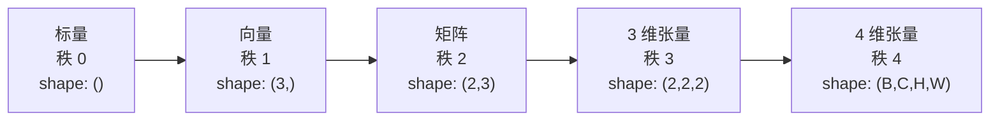
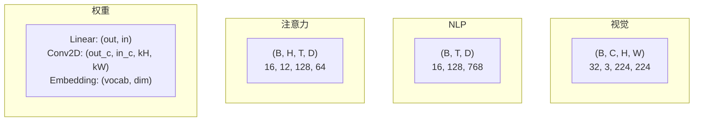
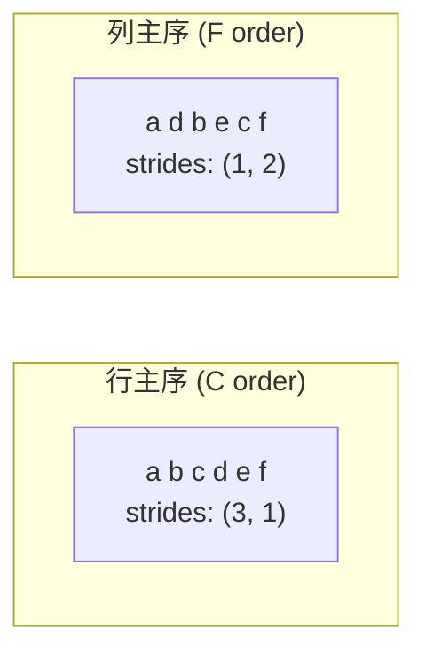
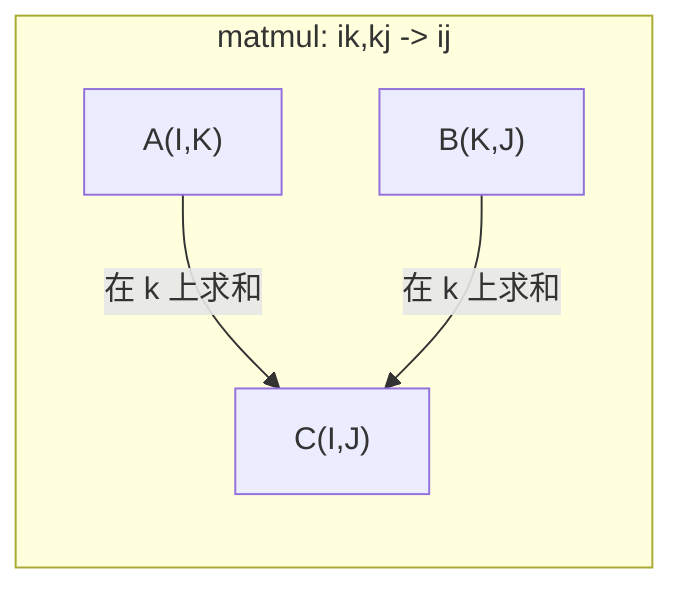

# 张量运算

> 张量是数据与深度学习之间的通用语言。每张图、每个句子、每个梯度，都从它这里流过。

**类型：** 构建型
**语言：** Python
**前置条件：** 阶段 1，第 01 课（线性代数直觉）、第 02 课（向量、矩阵与运算）
**时间：** 约 90 分钟

## 学习目标

- 从零实现张量类：shape、strides、reshape、transpose 以及逐元素运算
- 用广播规则在不复制数据的前提下对不同形状的张量进行运算
- 为点积、矩阵乘法、外积和批量运算写出 einsum 表达式
- 在多头注意力的每一步中追踪张量的精确形状变化

## 问题

你搭了一个 Transformer。前向传播看起来没问题。运行后得到：`RuntimeError: mat1 and mat2 shapes cannot be multiplied (32x768 and 512x768)`。你盯着这些形状。你尝试转置一下。现在它又报 `Expected 4D input (got 3D input)`。你加了一个 unsqueeze。别的又坏了。

形状错误是深度学习代码中最常见的 bug。概念上它们并不难——每个运算都有形状契约——但问题在于它们繁殖得极快。一个 Transformer 里串联着几十个 reshape、transpose 和广播。一个轴错了，错误就像多米诺骨牌。更糟的是，有些形状错误根本不报错。它们在错误的维度上广播、或在错误的轴上求和，悄无声息地算出垃圾结果。

矩阵处理的是两组事物之间的两两关系。但真实数据用两个维度根本装不下。一批 32 张 224x224 的 RGB 图像是一个 4 维张量：`(32, 3, 224, 224)`。带 12 个头的自注意力也是 4 维：`(batch, heads, seq_len, head_dim)`。你需要一种可以泛化到任意维度的数据结构，以及能在所有维度上优雅组合的运算。这种结构就是张量。掌握了张量运算，形状错误就会变得极易排查。

## 概念

### 张量是什么

张量是一个统一数据类型组成的多维数组。维度数叫**秩**（rank，或 order）。每个维度是一个**轴**（axis）。**形状**（shape）是一个元组，列出每个轴上的尺寸。



元素总数 = 所有尺寸的乘积。形状 `(2, 3, 4)` 包含 `2 * 3 * 4 = 24` 个元素。

### 深度学习中的张量形状

不同数据类型按惯例映射到特定的张量形状。



PyTorch 使用 NCHW（通道在前）。TensorFlow 默认 NHWC（通道在后）。布局不匹配会导致性能悄悄下降或直接报错。

### 内存布局如何工作

内存中的 2 维数组实际上是一个一维字节序列。**stride** 告诉你沿着每个轴移动一个位置需要跳过多少个元素。



转置不会移动数据。它只是交换了 stride，使张量变为**非连续**（non-contiguous）——一行里的元素在内存中不再相邻。

### 广播规则

广播让你在不复制数据的前提下对不同形状的张量进行运算。从右侧对齐两个形状。当两个维度相等或其中一个为 1 时，它们就是兼容的。维度较少的那个在左边补 1。

```
张量 A:        (8, 1, 6, 1)
张量 B:           (7, 1, 5)
B 补齐后:      (1, 7, 1, 5)
结果:          (8, 7, 6, 5)
```

### Einsum：通用的张量运算

爱因斯坦求和约定用字母标记每个轴。输入中出现了但输出中没有的轴会被求和消失。输入和输出中都出现的轴被保留。



核心模式：`i,i->`（点积）、`i,j->ij`（外积）、`ii->`（迹）、`ij->ji`（转置）、`bij,bjk->bik`（批量矩阵乘）、`bhtd,bhsd->bhts`（注意力分数）。

## 动手实现

代码位于 `code/tensors.py`。每一步都引用该实现。

### 第 1 步：张量存储与 stride

张量存储一个扁平的数值列表加上形状元数据。stride 告诉索引逻辑如何把多维索引映射到扁平位置。

```python
class Tensor:
    def __init__(self, data, shape=None):
        if isinstance(data, (list, tuple)):
            self._data, self._shape = self._flatten_nested(data)
        elif isinstance(data, np.ndarray):
            self._data = data.flatten().tolist()
            self._shape = tuple(data.shape)
        else:
            self._data = [data]
            self._shape = ()

        if shape is not None:
            total = reduce(lambda a, b: a * b, shape, 1)
            if total != len(self._data):
                raise ValueError(
                    f"Cannot reshape {len(self._data)} elements into shape {shape}"
                )
            self._shape = tuple(shape)

        self._strides = self._compute_strides(self._shape)

    @staticmethod
    def _compute_strides(shape):
        if len(shape) == 0:
            return ()
        strides = [1] * len(shape)
        for i in range(len(shape) - 2, -1, -1):
            strides[i] = strides[i + 1] * shape[i + 1]
        return tuple(strides)
```

对于形状 `(3, 4)`，stride 为 `(4, 1)`——前进一行跳过 4 个元素，前进一列跳过 1 个元素。

### 第 2 步：Reshape、squeeze、unsqueeze

Reshape 改变形状，不改变元素顺序。元素总数必须保持不变。用 `-1` 表示让系统自动推断该维度大小。

```python
t = Tensor(list(range(12)), shape=(2, 6))
r = t.reshape((3, 4))
r = t.reshape((-1, 3))
```

Squeeze 删除大小为 1 的轴。Unsqueeze 插入一个大小为 1 的轴。Unsqueeze 对广播至关重要——一个偏置向量 `(D,)` 要加到批次 `(B, T, D)` 上，需要 unsqueeze 成 `(1, 1, D)`。

```python
t = Tensor(list(range(6)), shape=(1, 3, 1, 2))
s = t.squeeze()
v = Tensor([1, 2, 3])
u = v.unsqueeze(0)
```

### 第 3 步：Transpose 与 permute

Transpose 交换两个轴。Permute 重排所有轴。这就是 NCHW 和 NHWC 之间互相转换的方法。

```python
mat = Tensor(list(range(6)), shape=(2, 3))
tr = mat.transpose(0, 1)

t4d = Tensor(list(range(24)), shape=(1, 2, 3, 4))
perm = t4d.permute((0, 2, 3, 1))
```

Transpose 或 permute 之后，张量在内存中是非连续的。在 PyTorch 中，对非连续张量调用 `view` 会报错——需要先调用 `reshape` 或 `.contiguous()`。

### 第 4 步：逐元素运算与规约

逐元素运算（加、乘、减）独立施加在每个元素上，形状保持不变。规约（sum、mean、max）折叠一个或多个轴。

```python
a = Tensor([[1, 2], [3, 4]])
b = Tensor([[10, 20], [30, 40]])
c = a + b
d = a * 2
s = a.sum(axis=0)
```

CNN 中的全局平均池化：`(B, C, H, W).mean(axis=[2, 3])` 产生 `(B, C)`。NLP 中的序列平均池化：`(B, T, D).mean(axis=1)` 产生 `(B, D)`。

### 第 5 步：用 NumPy 做广播

`tensors.py` 中的 `demo_broadcasting_numpy()` 函数展示了核心模式。

```python
activations = np.random.randn(4, 3)
bias = np.array([0.1, 0.2, 0.3])
result = activations + bias

images = np.random.randn(2, 3, 4, 4)
scale = np.array([0.5, 1.0, 1.5]).reshape(1, 3, 1, 1)
result = images * scale

a = np.array([1, 2, 3]).reshape(-1, 1)
b = np.array([10, 20, 30, 40]).reshape(1, -1)
outer = a * b
```

通过广播计算两两距离：将 `(M, 2)` reshape 为 `(M, 1, 2)`，将 `(N, 2)` reshape 为 `(1, N, 2)`，相减、平方、沿最后一个轴求和、开方。结果：`(M, N)`。

### 第 6 步：Einsum 运算

`demo_einsum()` 和 `demo_einsum_gallery()` 函数遍历了每一种常见模式。

```python
a = np.array([1.0, 2.0, 3.0])
b = np.array([4.0, 5.0, 6.0])
dot = np.einsum("i,i->", a, b)

A = np.array([[1, 2], [3, 4], [5, 6]], dtype=float)
B = np.array([[7, 8, 9], [10, 11, 12]], dtype=float)
matmul = np.einsum("ik,kj->ij", A, B)

batch_A = np.random.randn(4, 3, 5)
batch_B = np.random.randn(4, 5, 2)
batch_mm = np.einsum("bij,bjk->bik", batch_A, batch_B)
```

一个缩并运算的计算代价是所有索引尺寸（保留的和求和的）的乘积。对于 `bij,bjk->bik`，B=32, I=128, J=64, K=128：`32 * 128 * 64 * 128 = 33,554,432` 次乘加运算。

### 第 7 步：用 einsum 实现注意力机制

`demo_attention_einsum()` 函数端到端实现了多头注意力。

```python
B, H, T, D = 2, 4, 8, 16
E = H * D

X = np.random.randn(B, T, E)
W_q = np.random.randn(E, E) * 0.02

Q = np.einsum("bte,ek->btk", X, W_q)
Q = Q.reshape(B, T, H, D).transpose(0, 2, 1, 3)

scores = np.einsum("bhtd,bhsd->bhts", Q, K) / np.sqrt(D)
weights = softmax(scores, axis=-1)
attn_output = np.einsum("bhts,bhsd->bhtd", weights, V)

concat = attn_output.transpose(0, 2, 1, 3).reshape(B, T, E)
output = np.einsum("bte,ek->btk", concat, W_o)
```

每一步都是张量运算：投影（通过 einsum 的矩阵乘）、头拆分（reshape + transpose）、注意力分数（通过 einsum 的批量矩阵乘）、加权求和（通过 einsum 的批量矩阵乘）、头合并（transpose + reshape）、输出投影（通过 einsum 的矩阵乘）。

## 实际使用

### Scratch 与 NumPy 对照

| 操作 | Scratch（Tensor 类） | NumPy |
|---|---|---|
| 创建 | `Tensor([[1,2],[3,4]])` | `np.array([[1,2],[3,4]])` |
| Reshape | `t.reshape((3,4))` | `a.reshape(3,4)` |
| Transpose | `t.transpose(0,1)` | `a.T` 或 `a.transpose(0,1)` |
| Squeeze | `t.squeeze(0)` | `np.squeeze(a, 0)` |
| Sum | `t.sum(axis=0)` | `a.sum(axis=0)` |
| Einsum | N/A | `np.einsum("ij,jk->ik", a, b)` |

### Scratch 与 PyTorch 对照

```python
import torch

t = torch.tensor([[1, 2, 3], [4, 5, 6]], dtype=torch.float32)
t.shape
t.stride()
t.is_contiguous()

t.reshape(3, 2)
t.unsqueeze(0)
t.transpose(0, 1)
t.transpose(0, 1).contiguous()

torch.einsum("ik,kj->ij", A, B)
```

PyTorch 额外提供了自动求导、GPU 支持和优化过的 BLAS 内核。但形状语义是完全相同的。如果你理解了 scratch 版本，PyTorch 的形状错误就一目了然。

### 每个神经网络层都是一个张量运算

| 运算 | 张量形式 | Einsum |
|---|---|---|
| 线性层 | `Y = X @ W.T + b` | `"bd,od->bo"` + bias |
| 注意力 QKV | `Q = X @ W_q` | `"btd,dh->bth"` |
| 注意力分数 | `Q @ K.T / sqrt(d)` | `"bhtd,bhsd->bhts"` |
| 注意力输出 | `softmax(scores) @ V` | `"bhts,bhsd->bhtd"` |
| 批归一化 | `(X - mu) / sigma * gamma` | element-wise + broadcast |
| Softmax | `exp(x) / sum(exp(x))` | element-wise + reduction |

## 交付物

本课产出两个可复用的提示词：

1. **`outputs/prompt-tensor-shapes.md`** ——一个系统化的提示词，用于排查张量形状不匹配问题。包含每种常见操作（matmul、broadcast、cat、Linear、Conv2d、BatchNorm、softmax）的决策表和修复查找表。

2. **`outputs/prompt-tensor-debugger.md`** ——一个逐步排查的提示词，当形状错误卡住你时，贴到任意 AI 助手即可使用。输入错误信息和你的张量形状，就能得到精确的修复方案。

## 联系

本课的所有概念都与现代 AI 的具体部件相连接：

| 概念 | 出现在哪里 |
|---------|------------------|
| 张量 shape/strides | 所有深度学习框架的底层存储机制（PyTorch、JAX、TF） |
| Reshape/Transpose | 将数据输入模型、切换 NCHW/NHWC 布局、多头注意力的拆分合并 |
| 广播 | 偏置加法、批归一化、缩放因子逐通道乘 |
| Einsum | 注意力分数计算、批量矩阵乘、自定义损失函数中的复杂缩并 |
| 规约 (sum/mean/max) | 池化层、损失函数聚合、softmax 归一化 |
| Tensor 非连续性 | `view()`/`reshape()` 报错的根本原因，转置后的性能陷阱 |

为什么多头注意力离不开张量运算？因为输入先被投影成 Q/K/V，然后拆分成多个头 `(B, T, E) → (B, H, T, D)`，计算注意力分数是在头维度上批量进行的，最后再合并回来。全程没有一次涉及"扁平"的二维矩阵。如果你不理解 4 维张量的 reshape 和 transpose，注意力代码就无法看懂。

## 练习

1. **简单——Reshape 往返。** 取一个形状为 `(2, 3, 4)` 的张量。将它 reshape 为 `(6, 4)`，然后到 `(24,)`，再回到 `(2, 3, 4)`。每一步打印扁平数据，验证元素顺序保持不变。

2. **中等——实现广播。** 为 `Tensor` 类扩展一个 `broadcast_to(shape)` 方法，将大小为 1 的维扩展到目标形状。然后修改 `_elementwise_op` 在运算前自动广播。用形状 `(3, 1)` 和 `(1, 4)` 测试，结果形状应为 `(3, 4)`。

3. **困难——从零实现 einsum。** 实现一个基本的 `einsum(subscripts, *tensors)` 函数，至少支持：点积 (`i,i->`)、矩阵乘 (`ij,jk->ik`)、外积 (`i,j->ij`) 和转置 (`ij->ji`)。解析下标字符串，识别缩并轴，遍历所有索引组合。与 `np.einsum` 对比结果。

4. **困难——注意力形状追踪器。** 写一个函数，接收 `batch_size`、`seq_len`、`embed_dim` 和 `num_heads` 作为输入，打印多头注意力每一步的精确形状：输入、Q/K/V 投影、头拆分、注意力分数、softmax 权重、加权求和、头合并、输出投影。与 `demo_attention_einsum()` 的输出对比验证。

## 关键术语

| 术语 | 大家怎么说的 | 实际含义 |
|---|---|---|
| 张量 (Tensor) | "一个多几维的矩阵" | 统一类型的多维数组，有定义的 shape、stride 和运算 |
| 秩 (Rank) | "维度的数量" | 轴的个数。张量秩 2 指的是 2 个轴，不是线性代数里矩阵的秩 |
| 形状 (Shape) | "张量有多大" | 列出每个轴上尺寸的元组。`(2, 3)` 表示 2 行 3 列 |
| Stride | "内存怎么排的" | 沿着每个轴前进一个位置需要跳过的元素数 |
| 广播 (Broadcasting) | "形状不同也能直接算" | 一套严格规则：从右对齐，维度必须相等或其中一个为 1 |
| 连续 (Contiguous) | "张量是正常的" | 元素在内存中按逻辑布局顺序无缝排列，没有重排或间隙 |
| Einsum | "一种很花哨的矩阵乘写法" | 通用记号，一行就能表达任意张量缩并、外积、迹或转置 |
| View | "和 reshape 一样" | 共享同一块内存缓冲但 shape/stride 元数据不同的张量。对非连续数据会失败 |
| 缩并 (Contraction) | "在一个轴上求和" | 两个张量的公共轴上的元素相乘再求和，生成一个秩更低的结果 |
| NCHW / NHWC | "PyTorch 和 TF 的格式区别" | 图像张量的内存布局惯例。NCHW 通道在前，NHWC 通道在后 |

## 进一步阅读

- [NumPy Broadcasting](https://numpy.org/doc/stable/user/basics.broadcasting.html) —— 权威规则与可视化示例
- [PyTorch Tensor Views](https://pytorch.org/docs/stable/tensor_view.html) —— view 什么时候能用，什么时候必须复制
- [einops](https://github.com/arogozhnikov/einops) —— 让张量 reshape 变得可读且安全的库
- [The Illustrated Transformer](https://jalammar.github.io/illustrated-transformer/) —— 可视化注意力中张量形状的流动
- [Einstein Summation in NumPy](https://numpy.org/doc/stable/reference/generated/numpy.einsum.html) —— 完整的 einsum 文档与示例
