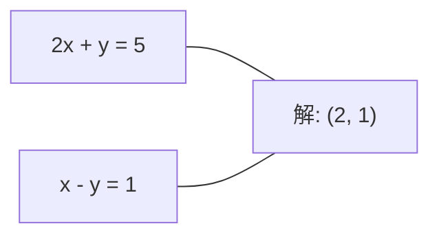
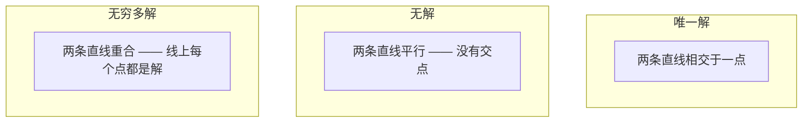

# 线性方程组

> 求解 Ax = b 是数学中最古老的问题，但它至今仍在驱动你的神经网络。

**类型：** 构建
**语言：** Python
**前置条件：** 阶段 1，第 01 课（线性代数直觉）、第 02 课（向量与矩阵运算）、第 03 课（矩阵变换）
**时间：** 约 120 分钟

## 学习目标

- 使用部分选主元的高斯消元法（Gaussian elimination）配合回代求解 Ax = b
- 用 LU、QR 和 Cholesky 分解对矩阵进行因式分解，并能解释每种方法的适用场景
- 推导最小二乘的正规方程，并将其与线性回归和岭回归联系起来
- 使用条件数诊断病态系统，并通过正则化使其稳定

## 问题

每当你训练一个线性回归，你就在解一个线性方程组。每当你计算最小二乘拟合，你就在解一个线性方程组。每当你写 `y = Wx + b` 这个神经网络层，你就在计算方程组的一端。当你加正则化，你是在修改这个方程组。当你使用高斯过程，你是在分解矩阵。当你为马氏距离求协方差矩阵的逆，你是在解一个线性方程组。

等式 Ax = b 无处不在。A 是已知系数的矩阵，b 是已知输出的向量，x 是你想求的未知向量。在线性回归中，A 是你的数据矩阵，b 是目标向量，x 是权重向量。整个模型归结为一句话：找到一个 x，使得 Ax 尽可能接近 b。

本课从零构建求解这个等式的每一种主要方法。你将理解为什么有些方法快、有些方法稳定，为什么有些只适用于方阵而另一些能处理超定系统，以及矩阵的条件数如何决定你的答案到底有没有意义。

## 概念

### Ax = b 的几何含义

线性方程组有几何解释。每一个方程定义一个超平面。解就是所有超平面相交的那个点（或点集）。

```
2x + y = 5          二维空间中的两条直线。
x - y  = 1          它们相交于 x=2, y=1。
```



可能出现三种情况：



用矩阵语言来说，"唯一解"意味着 A 可逆。"无解"意味着方程组不相容。"无穷多解"意味着 A 有零空间。大多数 ML 问题属于"没有精确解"这一类，因为你的方程数（数据点）远多于未知数（参数）。这正是最小二乘法要解决的问题。

### 行图像 vs 列图像

有两种方式理解 Ax = b。

**行图像。** A 的每一行定义一个方程，每个方程是一个超平面。解就是它们全部相交的地方。

**列图像。** A 的每一列是一个向量。问题变成：A 的列的哪种线性组合能得到 b？

```
A = | 2  1 |    b = | 5 |
    | 1 -1 |        | 1 |

行图像：同时求解 2x + y = 5 和 x - y = 1。

列图像：找到 x1, x2 使得：
  x1 * [2, 1] + x2 * [1, -1] = [5, 1]
  2 * [2, 1] + 1 * [1, -1] = [4+1, 2-1] = [5, 1]   验证通过。
```

列图像更为根本。如果 b 落在 A 的列空间中，方程组就有解。如果不落，你就找列空间里离 b 最近的那个点。那个最近的点就是最小二乘解。

### 高斯消元法

高斯消元法将 Ax = b 变换为上三角系统 Ux = c，然后通过回代求解。这是最直接的方法。

算法：

```
1. 对每一列 k（主元列）：
   a. 在第 k 列中，从第 k 行往下找到绝对值最大的元素（部分选主元）。
   b. 将该行与第 k 行交换。
   c. 对第 k 行之下的每一行 i：
      - 计算乘数 m = A[i][k] / A[k][k]
      - 从第 i 行中减去 m 乘以第 k 行。
2. 回代：从最后一个方程向上求解。
```

示例：

```
原始：
| 2  1  1 | 8 |       R2 = R2 - (2)R1     | 2  1   1 |  8 |
| 4  3  3 |20 |  -->  R3 = R3 - (1)R1 --> | 0  1   1 |  4 |
| 2  3  1 |12 |                            | 0  2   0 |  4 |

                       R3 = R3 - (2)R2     | 2  1   1 |  8 |
                                       --> | 0  1   1 |  4 |
                                           | 0  0  -2 | -4 |

回代：
  -2 * x3 = -4    -->  x3 = 2
  x2 + 2  = 4     -->  x2 = 2
  2*x1 + 2 + 2 = 8 --> x1 = 2
```

高斯消元法的计算量为 O(n³)。对于一个 1000×1000 的方程组，大约需要十亿次浮点运算。这很快，但如果你需要用同一个 A 求解多个方程组，还可以做得更好。

### 部分选主元：为什么重要

如果不选主元，高斯消元可能失败或产生错误结果。如果主元为零，你会除以零。如果主元很小，你会放大舍入误差。

```
坏主元：                          使用部分选主元：
| 0.001  1 | 1.001 |            先交换行：
| 1      1 | 2     |            | 1      1 | 2     |
                                 | 0.001  1 | 1.001 |
m = 1/0.001 = 1000              m = 0.001/1 = 0.001
R2 = R2 - 1000*R1               R2 = R2 - 0.001*R1
| 0.001  1     | 1.001   |      | 1      1     | 2     |
| 0     -999   | -999.0  |      | 0      0.999 | 0.999 |

x2 = 1.000 (正确)               x2 = 1.000 (正确)
x1 = (1.001 - 1)/0.001          x1 = (2 - 1)/1 = 1.000 (正确)
   = 0.001/0.001 = 1.000        稳定，因为乘数很小。
```

在精度有限的浮点运算中，不选主元的版本可能丢失有效数字。部分选主元总是选取可用的最大主元，以最小化误差放大。

### LU 分解

LU 分解将 A 分解为一个下三角矩阵 L 和一个上三角矩阵 U：A = LU。L 矩阵存储高斯消元过程中的乘数，U 矩阵是消元后的结果。

```
A = L @ U

| 2  1  1 |   | 1  0  0 |   | 2  1   1 |
| 4  3  3 | = | 2  1  0 | @ | 0  1   1 |
| 2  3  1 |   | 1  2  1 |   | 0  0  -2 |
```

为什么做分解而不直接消元？因为一旦有了 L 和 U，对任何新的 b 求解 Ax = b 只需要 O(n²)：

```
Ax = b
LUx = b
令 y = Ux：
  Ly = b    (前向代入，O(n²))
  Ux = y    (回代，O(n²))
```

O(n³) 的代价在分解时一次性支付。之后的每一次求解都是 O(n²)。如果你需要用同一个 A 解决 1000 个不同 b 的方程组，LU 能节省大约 1000/3 倍的总工作量。

加上部分选主元后，你得到 PA = LU，其中 P 是记录行交换的置换矩阵。

### QR 分解

QR 分解将 A 分解为一个正交矩阵 Q 和一个上三角矩阵 R：A = QR。

正交矩阵满足 QᵀQ = I。它的列是标准正交向量。用 Q 相乘保持长度和角度不变。

```
A = Q @ R

Q 的列是标准正交的：QᵀQ = I
R 是上三角矩阵

求解 Ax = b：
  QRx = b
  Rx = Qᵀb    （只需乘以 Qᵀ，不需要求逆）
  回代得到 x。
```

对于最小二乘问题，QR 在数值上比 LU 更稳定。Gram-Schmidt 过程逐列构建 Q：

```
给定 A 的列 a1, a2, ...：

q1 = a1 / ||a1||

q2 = a2 - (a2 · q1) * q1        （减去在 q1 上的投影）
q2 = q2 / ||q2||                （归一化）

q3 = a3 - (a3 · q1) * q1 - (a3 · q2) * q2
q3 = q3 / ||q3||

R[i][j] = qi · aj    当 i <= j
```

每一步都去掉在所有之前 q 向量方向上的分量，只留下新的正交方向。

### Cholesky 分解

当 A 是对称的（A = Aᵀ）且正定的（所有特征值为正）时，你可以将其分解为 A = LLᵀ，其中 L 是下三角矩阵。这就是 Cholesky 分解。

```
A = L @ Lᵀ

| 4  2 |   | 2  0 |   | 2  1 |
| 2  5 | = | 1  2 | @ | 0  2 |

L[i][i] = sqrt(A[i][i] - sum(L[i][k]² for k < i))
L[i][j] = (A[i][j] - sum(L[i][k]*L[j][k] for k < j)) / L[j][j]    当 i > j
```

Cholesky 比 LU 快一倍，且只需要一半的存储空间。它只适用于对称正定矩阵，但这种矩阵无处不在：

- 协方差矩阵是对称半正定的（加正则化后正定）。
- 高斯过程中的核矩阵是对称正定的。
- 凸函数在极小值点的黑塞矩阵是对称正定的。
- AᵀA 总是对称半正定的。

在高斯过程中，你用 Cholesky 分解核矩阵 K，然后求解 Kα = y 得到预测均值。Cholesky 因子还能给你边际似然的 log 行列式：log det(K) = 2 * sum(log(diag(L)))。

### 最小二乘法：当 Ax = b 没有精确解时

如果 A 是 m×n 且 m > n（方程多于未知数），系统就是超定的（overdetermined）。没有精确解存在。你要做的是最小化平方误差：

```
minimize ||Ax - b||²

这就是残差平方和：
  sum((A[i,:] @ x - b[i])² for i in range(m))
```

极小值点满足正规方程（normal equations）：

```
AᵀA x = Aᵀb
```

推导：展开 ||Ax - b||² = (Ax - b)ᵀ(Ax - b) = xᵀAᵀA x - 2 xᵀAᵀb + bᵀb。对 x 求梯度并设为零：2AᵀA x - 2Aᵀb = 0。

```
原始系统（超定，4 个方程，2 个未知数）：
| 1  1 |         | 3 |
| 1  2 | x     = | 5 |       没有任何 x 能精确满足全部 4 个方程。
| 1  3 |         | 6 |
| 1  4 |         | 8 |

正规方程：
AᵀA = | 4  10 |    Aᵀb = | 22 |
      | 10 30 |            | 63 |

求解：x = [1.5, 1.7]

这就是线性回归。x[0] 是截距，x[1] 是斜率。
```

### 正规方程 = 线性回归

这种联系是精确的。在线性回归中，你的数据矩阵 X 每行一个样本，每列一个特征。目标向量 y 每个样本一个值。权重向量 w 满足：

```
XᵀX w = Xᵀy
w = (XᵀX)⁻¹ Xᵀy
```

这就是线性回归的闭式解。每次调用 `sklearn.linear_model.LinearRegression.fit()`，都在计算这个解（或通过 QR 或 SVD 的等价形式）。

在矩阵上加一个 λ·I 的正则化项，就得到岭回归（ridge regression）：

```
(XᵀX + λ·I) w = Xᵀy
w = (XᵀX + λ·I)⁻¹ Xᵀy
```

正则化使矩阵条件更好（更容易精确求逆），并通过将权重向零收缩来防止过拟合。当 λ > 0 时，矩阵 XᵀX + λ·I 总是对称正定的，因此可以用 Cholesky 求解。

### 伪逆（Moore-Penrose）

伪逆 A⁺ 将矩阵求逆推广到非方阵和奇异矩阵。对任意矩阵 A：

```
x = A⁺ b

其中 A⁺ = V Σ⁺ Uᵀ    （通过 SVD 计算）
```

Σ⁺ 是取每个非零奇异值的倒数并转置结果得到的。若 A = U Σ Vᵀ，则 A⁺ = V Σ⁺ Uᵀ。

```
A = U Σ Vᵀ        (SVD)

Σ = | 5  0 |       Σ⁺ = | 1/5  0  0 |
    | 0  2 |             | 0  1/2  0 |
    | 0  0 |

A⁺ = V Σ⁺ Uᵀ
```

伪逆给出最小范数最小二乘解。当系统有：
- 唯一解时：A⁺b 给出该解。
- 无解时：A⁺b 给出最小二乘解。
- 无穷多解时：A⁺b 给出 ||x|| 最小的那一个。

NumPy 的 `np.linalg.lstsq` 和 `np.linalg.pinv` 内部都使用了 SVD。

### 条件数

条件数（condition number）衡量解对输入微小变化的敏感程度。对矩阵 A，条件数为：

```
κ(A) = ||A|| · ||A⁻¹|| = σ_max / σ_min
```

其中 σ_max 和 σ_min 分别是最大和最小奇异值。

```
良态 (κ ~ 1)：                       病态 (κ ~ 10¹⁵)：
b 的微小变化 →                        b 的微小变化 →
x 的微小变化                          x 的剧烈变化

| 2  0 |   κ = 2/1 = 2              | 1   1          |   κ ~ 10¹⁵
| 0  1 |   可以安全求解              | 1   1+10⁻¹⁵    |   解是垃圾
```

经验法则：
- κ < 100：安全，解是精确的。
- κ ~ 10ᵏ：你会损失大约 k 位浮点精度。
- κ ~ 10¹⁶（对 float64 而言）：解毫无意义。矩阵事实上是奇异的。

在 ML 中，当特征几乎共线时就会出现病态。正则化（加上 λ·I）将条件数从 σ_max / σ_min 改善为 (σ_max + λ) / (σ_min + λ)。

### 迭代法：共轭梯度

对于非常大的稀疏系统（数百万未知数），像 LU 或 Cholesky 这样的直接法代价太高。迭代法通过多轮迭代不断改进猜测值来逼近解。

共轭梯度法（conjugate gradient, CG）在 A 对称正定时求解 Ax = b。它最多在 n 步内找到精确解（在精确算术下），但如果 A 的特征值聚集在一起，收敛通常快得多。

```
算法概要：
  x₀ = 初始猜测（通常为零）
  r₀ = b - A x₀           （残差）
  p₀ = r₀                 （搜索方向）

  For k = 0, 1, 2, ...:
    α = (rₖ · rₖ) / (pₖ · A pₖ)
    xₖ₊₁ = xₖ + α * pₖ
    rₖ₊₁ = rₖ - α * A pₖ
    β = (rₖ₊₁ · rₖ₊₁) / (rₖ · rₖ)
    pₖ₊₁ = rₖ₊₁ + β * pₖ
    如果 ||rₖ₊₁|| < 容差：停止
```

共轭梯度用于：
- 大规模优化（Newton-CG 方法）
- 求解偏微分方程离散化
- 核矩阵太大无法分解的核方法
- 其他迭代求解器的预处理

收敛速度取决于条件数。条件越好的系统收敛越快，这也是正则化有帮助的另一个原因。

### 全景图：什么方法在什么场景使用

| 方法 | 要求 | 代价 | 使用场景 |
|--------|-------------|------|----------|
| 高斯消元法 | 方阵，非奇异 A | O(n³) | 对方阵的一次性求解 |
| LU 分解 | 方阵，非奇异 A | O(n³) 分解 + O(n²) 求解 | 同一 A 的多次求解 |
| QR 分解 | 任意 A (m ≥ n) | O(mn²) | 最小二乘，数值稳定 |
| Cholesky | 对称正定 A | O(n³/3) | 协方差矩阵、高斯过程、岭回归 |
| 正规方程 | 超定 (m > n) | O(mn² + n³) | 线性回归（n 较小时） |
| SVD / 伪逆 | 任意 A | O(mn²) | 秩亏系统、最小范数解 |
| 共轭梯度 | 对称正定，稀疏 A | O(n · k · nnz) | 大规模稀疏系统，k = 迭代次数 |

## 动手实现

### 第 1 步：带部分选主元的高斯消元法

```python
import numpy as np

def gaussian_elimination(A, b):
    n = len(b)
    Ab = np.hstack([A.astype(float), b.reshape(-1, 1).astype(float)])

    for k in range(n):
        max_row = k + np.argmax(np.abs(Ab[k:, k]))
        Ab[[k, max_row]] = Ab[[max_row, k]]

        if abs(Ab[k, k]) < 1e-12:
            raise ValueError(f"Matrix is singular or nearly singular at pivot {k}")

        for i in range(k + 1, n):
            m = Ab[i, k] / Ab[k, k]
            Ab[i, k:] -= m * Ab[k, k:]

    x = np.zeros(n)
    for i in range(n - 1, -1, -1):
        x[i] = (Ab[i, -1] - Ab[i, i+1:n] @ x[i+1:n]) / Ab[i, i]

    return x
```

### 第 2 步：LU 分解

```python
def lu_decompose(A):
    n = A.shape[0]
    L = np.eye(n)
    U = A.astype(float).copy()
    P = np.eye(n)

    for k in range(n):
        max_row = k + np.argmax(np.abs(U[k:, k]))
        if max_row != k:
            U[[k, max_row]] = U[[max_row, k]]
            P[[k, max_row]] = P[[max_row, k]]
            if k > 0:
                L[[k, max_row], :k] = L[[max_row, k], :k]

        for i in range(k + 1, n):
            L[i, k] = U[i, k] / U[k, k]
            U[i, k:] -= L[i, k] * U[k, k:]

    return P, L, U

def lu_solve(P, L, U, b):
    n = len(b)
    Pb = P @ b.astype(float)

    y = np.zeros(n)
    for i in range(n):
        y[i] = Pb[i] - L[i, :i] @ y[:i]

    x = np.zeros(n)
    for i in range(n - 1, -1, -1):
        x[i] = (y[i] - U[i, i+1:] @ x[i+1:]) / U[i, i]

    return x
```

### 第 3 步：Cholesky 分解

```python
def cholesky(A):
    n = A.shape[0]
    L = np.zeros_like(A, dtype=float)

    for i in range(n):
        for j in range(i + 1):
            s = A[i, j] - L[i, :j] @ L[j, :j]
            if i == j:
                if s <= 0:
                    raise ValueError("Matrix is not positive definite")
                L[i, j] = np.sqrt(s)
            else:
                L[i, j] = s / L[j, j]

    return L
```

### 第 4 步：通过正规方程做最小二乘

```python
def least_squares_normal(A, b):
    AtA = A.T @ A
    Atb = A.T @ b
    return gaussian_elimination(AtA, Atb)

def ridge_regression(A, b, lam):
    n = A.shape[1]
    AtA = A.T @ A + lam * np.eye(n)
    Atb = A.T @ b
    L = cholesky(AtA)
    y = np.zeros(n)
    for i in range(n):
        y[i] = (Atb[i] - L[i, :i] @ y[:i]) / L[i, i]
    x = np.zeros(n)
    for i in range(n - 1, -1, -1):
        x[i] = (y[i] - L.T[i, i+1:] @ x[i+1:]) / L.T[i, i]
    return x
```

### 第 5 步：条件数

```python
def condition_number(A):
    U, S, Vt = np.linalg.svd(A)
    return S[0] / S[-1]
```

## 实际使用

将各组件组合起来，在真实数据上做线性回归和岭回归：

```python
np.random.seed(42)
X_raw = np.random.randn(100, 3)
w_true = np.array([2.0, -1.0, 0.5])
y = X_raw @ w_true + np.random.randn(100) * 0.1

X = np.column_stack([np.ones(100), X_raw])

w_ols = least_squares_normal(X, y)
print(f"OLS weights (ours):    {w_ols}")

w_np = np.linalg.lstsq(X, y, rcond=None)[0]
print(f"OLS weights (numpy):   {w_np}")
print(f"Max difference: {np.max(np.abs(w_ols - w_np)):.2e}")

w_ridge = ridge_regression(X, y, lam=1.0)
print(f"Ridge weights (ours):  {w_ridge}")

from sklearn.linear_model import Ridge
ridge_sk = Ridge(alpha=1.0, fit_intercept=False)
ridge_sk.fit(X, y)
print(f"Ridge weights (sklearn): {ridge_sk.coef_}")
```

## 交付物

本课产出：
- `code/linear_systems.py` —— 包含从零实现的高斯消元法、LU 分解、Cholesky 分解、最小二乘和岭回归
- 一个可运行的演示，验证正规方程与 sklearn 的 LinearRegression 产生相同的权重

## 联系

本课的每个方法都直接对接到生产级 ML 中：

| 方法 | 在 AI 中的应用 |
|--------|------------------|
| 高斯消元法 | 小型方阵的一次性求解 |
| LU 分解 | 同一系数矩阵多个右端项的批量求解、数值模拟 |
| QR 分解 | 神经网络的正交权重初始化、最小二乘回归的稳定求解 |
| Cholesky 分解 | 高斯过程核矩阵分解、岭回归、协方差矩阵求逆 |
| 正规方程 | 线性回归的闭式解 —— `sklearn.linear_model.LinearRegression` 的核心 |
| SVD / 伪逆 | 秩亏系统的最小范数解、特征去相关（白化） |
| 条件数 | 特征共线性诊断 —— κ 大则丢弃特征或加正则化 |
| 共轭梯度法 | 大规模稀疏系统的预处理迭代求解、Newton-CG 优化 |
| 岭回归 | 正则化最小二乘 —— 改善条件数，防止过拟合 |

线性回归值得专门展开。`sklearn.linear_model.LinearRegression.fit()` 内部通过 SVD 或 QR 求解 XᵀX w = Xᵀy。岭回归在此基础上加了 λI，使得正规定阵总是对称正定，可以用 Cholesky 高效求解。条件数告诉你这些计算在数值上是否可信 —— 如果 κ 达到 10¹⁵，你的权重小数点后可能全都是噪声。

## 练习

1. 分别用你的高斯消元法、LU 求解器和 `np.linalg.solve` 求解 `[[1,2,3],[4,5,6],[7,8,10]] x = [6, 15, 27]`。验证三者在浮点容差范围内给出相同答案。

2. 生成一个 50×5 的随机矩阵 X 和目标 y = X @ w_true + noise。分别用正规方程、QR（通过 `np.linalg.qr`）、SVD（通过 `np.linalg.svd`）和 `np.linalg.lstsq` 求解 w。比较四种解。测量 XᵀX 的条件数，并解释它如何影响你对方法的信任。

3. 构造一个近奇异矩阵：让两列几乎相同（如第 2 列 = 第 1 列 + 1e-10 * 噪声）。计算它的条件数。分别在有正则化（加 0.01 * I）和无正则化的情况下求解 Ax = b。比较解和残差。解释为什么正则化有帮助。

4. 为一个 100×100 的随机对称正定矩阵实现共轭梯度算法。统计收敛到容差 1e-8 所需的迭代次数。与理论上限 n 次迭代进行比较。

5. 在大小分别为 10、50、200、500 的对称正定矩阵上，对比你的 Cholesky 求解器 vs 你的 LU 求解器 vs `np.linalg.solve` 的耗时。画出结果图。验证 Cholesky 比 LU 快约 2 倍。

## 关键术语

| 术语 | 大家怎么说的 | 实际含义 |
|------|----------------|----------------------|
| 线性方程组 (Linear system) | "求解 x" | 一组线性方程 Ax = b。找到 x 就是找到在变换 A 下产生输出 b 的那个输入。 |
| 高斯消元法 (Gaussian elimination) | "行化简" | 利用行操作系统地将对角线以下的元素消为零，得到可通过回代求解的上三角系统。O(n³)。 |
| 部分选主元 (Partial pivoting) | "换行使计算稳定" | 在第 k 列消元前，将该列绝对值最大的行交换到主元位置。防止除以小数。 |
| LU 分解 (LU decomposition) | "分解成两个三角阵" | 将 A 写为 A = LU，其中 L 是下三角阵（存储乘数），U 是上三角阵（消元后的矩阵）。将 O(n³) 代价分摊到多次求解中。 |
| QR 分解 (QR decomposition) | "正交分解" | 将 A 写为 A = QR，其中 Q 的列是标准正交的，R 是上三角阵。对最小二乘比 LU 更稳定。 |
| Cholesky 分解 (Cholesky decomposition) | "矩阵的平方根" | 对于对称正定 A，写为 A = LLᵀ。代价是 LU 的一半。用于协方差矩阵、核矩阵和岭回归。 |
| 最小二乘法 (Least squares) | "精确无解时的最佳拟合" | 当系统超定（方程多于未知数）时，最小化残差平方和 \|\|Ax - b\|\|²。 |
| 正规方程 (Normal equations) | "微积分捷径" | AᵀA x = Aᵀb。将 \|\|Ax - b\|\|² 的梯度设为零。这**就是**线性回归的闭式解。 |
| 伪逆 (Pseudoinverse) | "非方阵的求逆" | A⁺ = V Σ⁺ Uᵀ，通过 SVD 计算。为任意矩阵（方阵或长方阵，奇异或非奇异）给出最小范数最小二乘解。 |
| 条件数 (Condition number) | "这个答案有多可信" | κ = σ_max / σ_min。衡量解对输入扰动的敏感度。大约会丢失 log₁₀(κ) 位精度。 |
| 岭回归 (Ridge regression) | "正则化最小二乘" | 求解 (XᵀX + λI) w = Xᵀy。加 λI 改善条件数，同时将权重向零收缩。防止过拟合。 |
| 共轭梯度法 (Conjugate gradient) | "大矩阵的迭代 Ax=b" | 针对对称正定系统的迭代求解器。最多 n 步收敛。在分解代价太高的大规模稀疏系统中使用。 |
| 超定系统 (Overdetermined system) | "数据比参数多" | m×n 系统中 m > n。不存在精确解。最小二乘找到最佳近似。这就是每个回归问题。 |
| 回代 (Back substitution) | "从下往上解" | 给定上三角系统，先解最后一个方程，再向上代入。O(n²)。 |
| 前向代入 (Forward substitution) | "从上往下解" | 给定下三角系统，先解第一个方程，再向下代入。O(n²)。在 LU 求解的 L 阶段使用。 |

## 进一步阅读

- [MIT 18.06: Linear Algebra](https://ocw.mit.edu/courses/18-06-linear-algebra-spring-2010/) (Gilbert Strang) —— 线性方程组和矩阵分解的权威课程
- [Numerical Linear Algebra](https://people.maths.ox.ac.uk/trefethen/text.html) (Trefethen & Bau) —— 理解数值稳定性、条件数以及算法为何失效的标准参考资料
- [Matrix Computations](https://www.cs.cornell.edu/cv/GolubVanLoan4/golubandvanloan.htm) (Golub & Van Loan) —— 每种矩阵算法的百科全书式参考
- [3Blue1Brown: Inverse Matrices](https://www.3blue1brown.com/lessons/inverse-matrices) —— 求解 Ax = b 几何含义的视觉直觉
