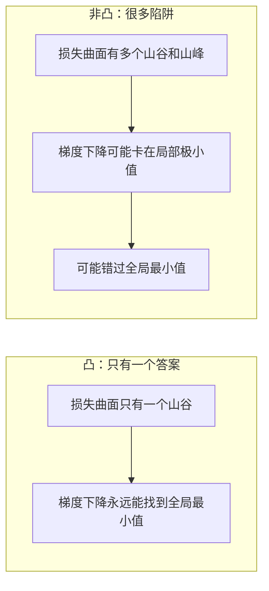
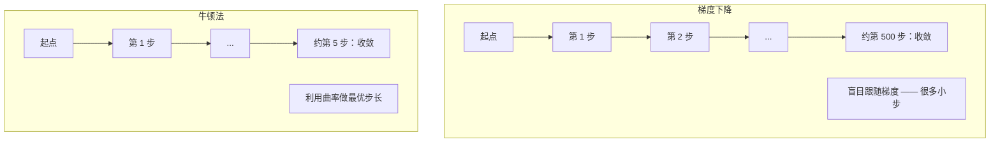
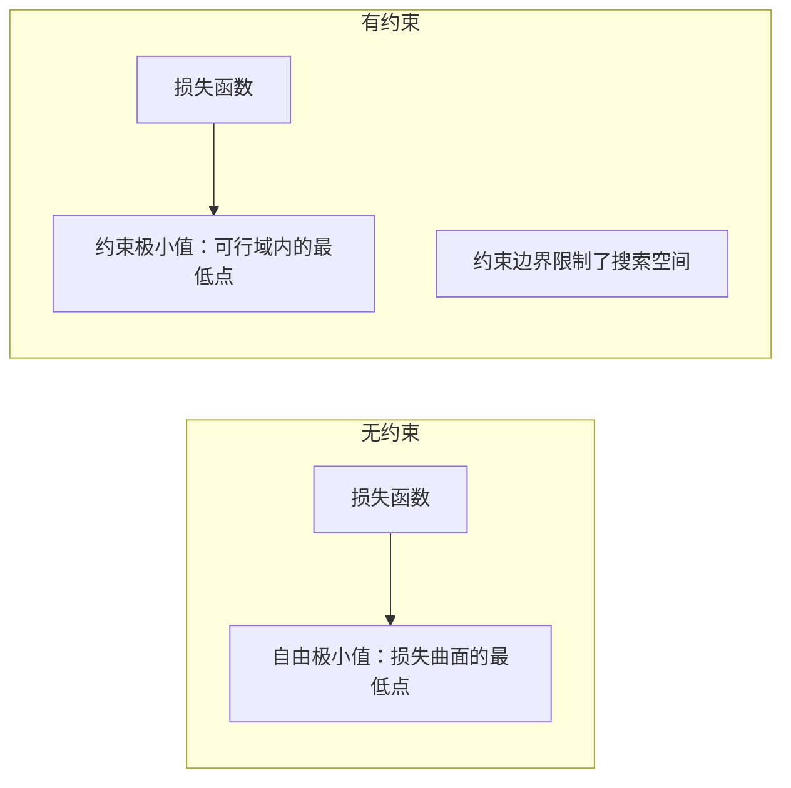
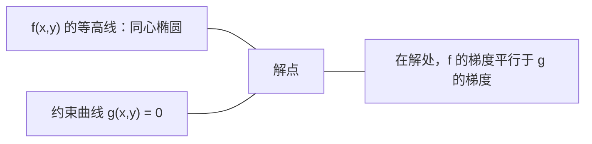

# 凸优化

> 凸问题只有一个山谷。神经网络有上百万个。知道两者的区别很重要。

**类型：** 构建
**语言：** Python
**前置条件：** 阶段 1，第 04 课（机器学习中的微积分）、第 08 课（优化）
**时间：** 约 90 分钟

## 学习目标

- 使用定义、二阶导数和黑塞矩阵判据测试一个函数是否为凸函数
- 实现牛顿法，并将其二次收敛速度与梯度下降进行对比
- 使用拉格朗日乘子法求解带约束的优化问题，并能解释 KKT 条件
- 解释为什么神经网络损失景观是非凸的，但 SGD 仍能找到好的解

## 问题

第 08 课教了梯度下降、动量和 Adam。这些优化器能在任何曲面上沿下坡走。但它们不提供任何保证。在非凸景观上做梯度下降，可能掉进坏的局部极小值、卡在鞍点上，或者永无止境地振荡。你还是用了它，因为神经网络是非凸的，没有其他选择。

但机器学习中有很多问题是凸的。线性回归、逻辑回归、SVM、LASSO、岭回归。对于这些问题，存在更强力的工具：带数学保证的优化。凸问题恰好只有一个山谷。任何沿下坡走的算法都会到达全局最小值。不需要多次重启，不需要学习率调度，不需要祈祷。

理解凸性能做三件事。第一，让你知道什么时候问题是简单的（凸） vs 困难的（非凸）。第二，给你更快的工具，比如适用于凸问题的牛顿法。第三，解释那些贯穿 ML 的概念：正则化本质上是约束、SVM 中的对偶、以及为什么深度学习在违反凸性提供的所有优良性质后仍然有效。

## 概念

### 凸集

一个集合 S 是凸集（convex set），当其中任意两点之间的线段完全落在 S 内。

| 凸集 | 非凸集 |
|---|---|
| **矩形**：内部任意两点都可以用一条完全留在内部的线段相连 | **星形/月牙形**：两个内部点之间的线段可能穿出集合 |
| **三角形**：对所有内部点具有相同性质 | **甜甜圈/圆环**：中间的洞意味着某些线段会离开集合 |
| 任意两点之间的线段始终留在集合内 | 某些点对之间的线段会穿出集合 |

形式化检验：对 S 中任意点 x, y 和任意 t ∈ [0, 1]，点 tx + (1-t)y 也在 S 中。

凸集的例子：
- 一条直线、一个平面、整个 Rⁿ
- 一个球（圆、球体、超球体）
- 一个半空间：{x : aᵀx ≤ b}
- 任意多个凸集的交集

非凸集的例子：
- 一个甜甜圈（圆环）
- 两个不相交圆的并集
- 任何有"凹陷"或"洞"的集合

### 凸函数

一个函数 f 是凸函数（convex function），当它的定义域是凸集，且对定义域中任意两点 x, y 和任意 t ∈ [0, 1]：

```
f(tx + (1-t)y) ≤ t·f(x) + (1-t)·f(y)
```

几何含义：图上任意两点之间的线段落在图形之上或之上。

| 性质 | 凸函数 | 非凸函数 |
|---|---|---|
| **线段测试** | 图上任意两点之间的线段落在曲线**之上或之上** | 图上某些点之间的线段**掉到**曲线**下方** |
| **形状** | 单个碗/山谷，向上弯曲 | 多个山峰和山谷，曲率混合 |
| **局部极小值** | 每个局部极小值都是全局极小值 | 可能存在多个高度不同的局部极小值 |

常见的凸函数：
- f(x) = x²（抛物线）
- f(x) = |x|（绝对值）
- f(x) = eˣ（指数函数）
- f(x) = max(0, x)（ReLU，虽然是分段线性的）
- f(x) = -log(x)，x > 0（负对数）
- 任意线性函数 f(x) = aᵀx + b（既是凸的也是凹的）

### 凸性检验

三种实用检验方法，从最简单到最严格。

**检验 1：二阶导数检验（一维）。** 如果对所有 x 都有 f''(x) ≥ 0，则 f 是凸的。

- f(x) = x²：f''(x) = 2 ≥ 0。凸的。
- f(x) = x³：f''(x) = 6x。当 x < 0 时为负。不是凸的。
- f(x) = eˣ：f''(x) = eˣ > 0。凸的。

**检验 2：黑塞矩阵检验（多元）。** 如果黑塞矩阵（Hessian matrix）H(x) 对所有 x 都是半正定的，则 f 是凸的。黑塞矩阵是全部二阶偏导数组成的矩阵。

**检验 3：定义检验。** 直接检查不等式 f(tx + (1-t)y) ≤ t·f(x) + (1-t)·f(y)。适用于难以求导的函数。

### 为什么凸性很重要

凸优化的核心定理：

**对凸函数，每个局部极小值都是全局极小值。**

这意味着梯度下降不会被困住。任何沿下坡走的路径都通向同一个答案。算法保证收敛到最优解。



推论：
- 不需要随机重启
- 不需要复杂的学习率调度
- 收敛性可以得到证明（收敛速度取决于函数的性质）
- 解是唯一的（在平坦区域的意义上）

### ML 中的凸 vs 非凸

| 问题 | 凸？ | 原因 |
|---------|---------|-----|
| 线性回归 (MSE) | 是 | 损失关于权重是二次的 |
| 逻辑回归 | 是 | 对数损失关于权重是凸的 |
| SVM (合页损失) | 是 | 线性函数的最大值 |
| LASSO (L1 回归) | 是 | 凸函数之和仍是凸的 |
| 岭回归 (L2) | 是 | 二次 + 二次 = 凸 |
| 神经网络 (任意损失) | 否 | 非线性激活函数创建非凸景观 |
| k-means 聚类 | 否 | 离散的分配步骤 |
| 矩阵分解 | 否 | 未知数的乘积 |

带凸损失的线性模型是凸的。一旦你加上带非线性激活函数的隐藏层，凸性就被打破。

### 黑塞矩阵

函数 f: Rⁿ → R 的黑塞矩阵 H 是 n×n 的二阶偏导数矩阵。

```
H[i][j] = ∂²f / (∂x_i ∂x_j)
```

对 f(x, y) = x² + 3xy + y²：

```
∂f/∂x = 2x + 3y       ∂²f/∂x² = 2      ∂²f/∂x∂y = 3
∂f/∂y = 3x + 2y       ∂²f/∂y∂x = 3      ∂²f/∂y² = 2

H = [ 2  3 ]
    [ 3  2 ]
```

黑塞矩阵告诉你曲率信息：
- 所有特征值为正：函数沿每个方向向上弯曲（在该点处是凸的）
- 所有特征值为负：沿每个方向向下弯曲（凹的，局部极大值）
- 特征值有正有负：鞍点（某些方向向上弯，某些方向向下弯）
- 特征值为零：沿该方向是平坦的（退化）

要判断凸性，黑塞矩阵必须在**处处**半正定（所有特征值 ≥ 0），而不只是在某一点。

### 牛顿法

梯度下降使用一阶信息（梯度）。牛顿法（Newton's method）使用二阶信息（黑塞矩阵）。它在当前点拟合一个二次近似，然后直接跳到该二次函数的极小值点。

```
更新规则：
  x_new = x - H⁻¹ · 梯度

对比梯度下降：
  x_new = x - lr · 梯度
```

牛顿法用逆黑塞矩阵替代了标量学习率。这会根据局部曲率自动调整步长和方向。



优点：
- 在极小值点附近具有二次收敛速度（每步误差平方）
- 无需调整学习率
- 尺度不变（无论你如何参数化问题都能工作）

缺点：
- 计算黑塞矩阵需要 O(n²) 内存，求逆需要 O(n³)
- 对有 100 万个权重的神经网络，那是 10¹² 个元素和 10¹⁸ 次运算
- 对深度学习不可行

### 约束优化

无约束优化：在所有 x 上最小化 f(x)。
约束优化（constrained optimization）：在满足约束的条件下最小化 f(x)。

实际问题都有约束。你想最小化成本但预算有限。你想最小化误差但模型复杂度有上限。



### 拉格朗日乘子法

拉格朗日乘子法（Lagrange multipliers）将有约束问题转化为无约束问题。

问题：在满足 g(x) = 0 的条件下最小化 f(x)。

解法：引入一个新变量（拉格朗日乘子 λ）并求解无约束问题：

```
L(x, λ) = f(x) + λ · g(x)
```

在解处，L 的梯度为零：

```
∂L/∂x = ∂f/∂x + λ · ∂g/∂x = 0
∂L/∂λ = g(x) = 0
```

几何直觉：在有约束的极小值点处，f 的梯度必须与约束函数 g 的梯度平行。如果它们不平行，你就能沿约束曲面移动，进一步减小 f。



示例：在满足 x + y = 1 的条件下最小化 f(x,y) = x² + y²。

```
L = x² + y² + λ(x + y - 1)

∂L/∂x = 2x + λ = 0  =>  x = -λ/2
∂L/∂y = 2y + λ = 0  =>  y = -λ/2
∂L/∂λ = x + y - 1 = 0

由前两式：x = y
代入：2x = 1，所以 x = y = 0.5，λ = -1
```

直线 x + y = 1 上离原点最近的点是 (0.5, 0.5)。

### KKT 条件

KKT 条件（Karush-Kuhn-Tucker conditions）将拉格朗日乘子法推广到不等式约束。

问题：在满足 g_i(x) ≤ 0（i = 1, ..., m）的条件下最小化 f(x)。

KKT 条件（最优解的必要条件）：

```
1. 驻点条件：    ∂f/∂x + Σ(λ_i · ∂g_i/∂x) = 0
2. 原始可行性：  g_i(x) ≤ 0  对所有 i
3. 对偶可行性：  λ_i ≥ 0  对所有 i
4. 互补松弛：    λ_i · g_i(x) = 0  对所有 i
```

互补松弛（complementary slackness）是关键洞察：要么约束是起作用的（g_i = 0，解落在边界上），要么乘子为零（约束不产生影响）。不影响解的约束，其 λ = 0。

KKT 条件是 SVM 的核心。支持向量就是那些约束起作用（λ > 0）的数据点。所有其他数据点的 λ = 0，不影响决策边界。

### 正则化即约束优化

L1 和 L2 正则化不是随意的技巧。它们本质上是有约束优化问题。

**L2 正则化（岭回归）：**

```
minimize  Loss(w)  subject to  ||w||² ≤ t

等价的无约束形式：
minimize  Loss(w) + λ · ||w||²
```

约束 ||w||² ≤ t 定义了一个球（二维是圆，三维是球面）。解就是损失等高线第一次碰到这个球边界的点。

**L1 正则化（LASSO）：**

```
minimize  Loss(w)  subject to  ||w||₁ ≤ t

等价的无约束形式：
minimize  Loss(w) + λ · ||w||₁
```

约束 ||w||₁ ≤ t 定义了一个菱形（二维中是旋转的正方形）。

| 性质 | L2 约束（圆） | L1 约束（菱形） |
|---|---|---|
| **约束形状** | 圆（高维中是球面） | 菱形（二维中是旋转的正方形） |
| **损失等高线触碰位置** | 光滑边界 —— 圆上任意点 | 角点 —— 对齐坐标轴 |
| **解的行为** | 权重小但非零 | 部分权重精确为零（稀疏） |
| **结果** | 权重收缩 | 特征选择 |

这解释了为什么 L1 产生稀疏模型（特征选择），而 L2 只是收缩权重。菱形有对齐坐标轴的角点。损失等高线更容易碰到角点，从而将一个或多个权重精确设为零。

### 对偶性

每个有约束优化问题（原始问题）都有一个伴随问题（对偶问题）。对凸问题，原始问题和对偶问题具有相同的最优值。这就是强对偶性（strong duality）。

拉格朗日对偶函数：

```
原始问题：minimize f(x)  subject to  g(x) ≤ 0
拉格朗日函数：L(x, λ) = f(x) + λ · g(x)
对偶函数：d(λ) = min_x L(x, λ)
对偶问题：maximize d(λ)  subject to  λ ≥ 0
```

对偶性为什么重要：
- 对偶问题有时比原始问题更容易求解
- SVM 在其对偶形式下求解，问题取决于数据点之间的点积（从而启用核技巧）
- 对偶给出原始最优值的下界，可用于检查解的质量

以 SVM 为例：

```
原始问题：找到 w, b，最大化间隔 2/||w||，满足
          y_i(wᵀx_i + b) ≥ 1  对所有 i

对偶问题：maximize  Σα_i - 0.5 · Σ_ij(α_i · α_j · y_i · y_j · x_iᵀx_j)
          subject to  α_i ≥ 0  且  Σ(α_i · y_i) = 0

对偶问题只涉及点积 x_iᵀx_j。
将 x_iᵀx_j 替换为 K(x_i, x_j) 就得到了核技巧。
```

### 为什么深度学习在非凸的情况下仍能工作

神经网络损失函数是极度非凸的。按照所有经典标准，优化它们注定失败。然而随机梯度下降却可靠地找到了好的解。有几个因素可以解释这一点。

**大多数局部极小值已经足够好。** 在高维空间中，随机的临界点（梯度为零的点）绝大多数是鞍点，而不是局部极小值。少数存在的局部极小值，其损失值通常接近全局最小值。当参数空间有数百万维时，掉进一个糟糕的局部极小值的概率极低。

**鞍点才是真正的障碍，而非局部极小值。** 在有 n 个参数的函数中，鞍点具有正曲率和负曲率混合的方向。对高维中的一个随机临界点，n 个特征值全部为正（局部极小值）的概率大约为 2⁻ⁿ。几乎所有临界点都是鞍点。SGD 的噪声有助于从中逃脱。

**过参数化使景观平滑。** 参数多于训练样本的网络，其损失曲面更平滑、更连通。更宽的网络有更少的坏局部极小值。这违反直觉，但在经验上是一致的。

**损失景观结构：**

| 性质 | 低维空间 | 高维空间 |
|---|---|---|
| **景观** | 许多孤立的山峰和山谷 | 平滑连通的山谷 |
| **极小值** | 许多孤立的局部极小值 | 坏局部极小值很少；大多数接近最优 |
| **导航** | 很难找到全局最小值 | 许多路径通向好的解 |
| **临界点** | 局部极小值和鞍点混合 | 绝大多数是鞍点，而非局部极小值 |

**随机噪声充当隐式正则化。** 小批量 SGD 加入的噪声阻止了优化陷入尖锐极小值。尖锐极小值会过拟合；平坦极小值能泛化。这种噪声将优化偏向损失景观的平坦区域。

### 二阶方法在实践中的使用

纯牛顿法对大型模型不可行。有几种近似方法使二阶信息变得可用。

**L-BFGS（有限内存 BFGS）：** 使用最近 m 个梯度差来近似逆黑塞矩阵。需要 O(mn) 内存而非 O(n²)。对最多约 10,000 个参数的问题效果良好。用于经典 ML（逻辑回归、CRF），但不用于深度学习。

**自然梯度：** 使用费舍尔信息矩阵（对数似然的期望黑塞矩阵）替代标准黑塞矩阵。这考虑了概率分布的几何结构。K-FAC（Kronecker 因子近似曲率）将费舍尔矩阵近似为 Kronecker 乘积，使其对神经网络可行。

**无黑塞优化：** 使用共轭梯度法求解 Hx = g 而从不显式构造 H。只需要黑塞-向量乘积，这可以通过自动微分在 O(n) 时间内计算。

**对角近似：** Adam 的二阶矩是黑塞矩阵对角线的对角近似。AdaHessian 通过 Hutchinson 估计器使用黑塞矩阵的实际对角元素，扩展了这一思路。

| 方法 | 内存 | 每步代价 | 使用场景 |
|--------|--------|--------------|-------------|
| 梯度下降 | O(n) | O(n) | 基线，大型模型 |
| 牛顿法 | O(n²) | O(n³) | 小型凸问题 |
| L-BFGS | O(mn) | O(mn) | 中型凸问题 |
| Adam | O(n) | O(n) | 深度学习默认 |
| K-FAC | O(n) | O(n) 每层 | 研究，大批量训练 |

## 动手实现

### 第 1 步：凸性检查器

构建一个函数，通过采样点并检查定义来经验性地检验凸性。

```python
import random
import math

def check_convexity(f, dim, bounds=(-5, 5), samples=1000):
    violations = 0
    for _ in range(samples):
        x = [random.uniform(*bounds) for _ in range(dim)]
        y = [random.uniform(*bounds) for _ in range(dim)]
        t = random.uniform(0, 1)
        mid = [t * xi + (1 - t) * yi for xi, yi in zip(x, y)]
        lhs = f(mid)
        rhs = t * f(x) + (1 - t) * f(y)
        if lhs > rhs + 1e-10:
            violations += 1
    return violations == 0, violations
```

### 第 2 步：二维牛顿法

使用显式黑塞矩阵实现牛顿法。与梯度下降比较收敛速度。

```python
def newtons_method(f, grad_f, hessian_f, x0, steps=50, tol=1e-12):
    x = list(x0)
    history = [x[:]]
    for _ in range(steps):
        g = grad_f(x)
        H = hessian_f(x)
        det = H[0][0] * H[1][1] - H[0][1] * H[1][0]
        if abs(det) < 1e-15:
            break
        H_inv = [
            [H[1][1] / det, -H[0][1] / det],
            [-H[1][0] / det, H[0][0] / det],
        ]
        dx = [
            H_inv[0][0] * g[0] + H_inv[0][1] * g[1],
            H_inv[1][0] * g[0] + H_inv[1][1] * g[1],
        ]
        x = [x[0] - dx[0], x[1] - dx[1]]
        history.append(x[:])
        if sum(gi ** 2 for gi in g) < tol:
            break
    return history
```

### 第 3 步：拉格朗日乘子求解器

在拉格朗日函数上使用梯度下降来求解约束优化。

```python
def lagrange_solve(f_grad, g_val, g_grad, x0, lr=0.01,
                   lr_lambda=0.01, steps=5000):
    x = list(x0)
    lam = 0.0
    history = []
    for _ in range(steps):
        fg = f_grad(x)
        gv = g_val(x)
        gg = g_grad(x)
        x = [
            xi - lr * (fgi + lam * ggi)
            for xi, fgi, ggi in zip(x, fg, gg)
        ]
        lam = lam + lr_lambda * gv
        history.append((x[:], lam, gv))
    return history
```

### 第 4 步：比较一阶与二阶方法

在同一个二次函数上运行梯度下降和牛顿法。统计收敛所需的步数。

```python
def quadratic(x):
    return 5 * x[0] ** 2 + x[1] ** 2

def quadratic_grad(x):
    return [10 * x[0], 2 * x[1]]

def quadratic_hessian(x):
    return [[10, 0], [0, 2]]
```

牛顿法将 1 步收敛（对二次函数是精确的）。梯度下降需要数百步，因为黑塞矩阵的特征值相差 5 倍，形成了一个狭长的山谷。

## 实际使用

凸性分析在选择 ML 模型和求解器时有直接指导意义。

对凸问题（逻辑回归、SVM、LASSO）：
- 使用专用求解器（liblinear、CVXPY、scipy.optimize.minimize，method='L-BFGS-B'）
- 预期有一个唯一的全局解
- 二阶方法是可行且快速的

对非凸问题（神经网络）：
- 使用一阶方法（SGD、Adam）
- 接受解依赖于初始化和随机性
- 将过参数化、噪声和学习率调度作为隐式正则化
- 不要浪费时间去寻找全局最小值。一个好的局部极小值就足够了。

```python
from scipy.optimize import minimize

result = minimize(
    fun=lambda w: sum((y - X @ w) ** 2) + 0.1 * sum(w ** 2),
    x0=np.zeros(d),
    method='L-BFGS-B',
    jac=lambda w: -2 * X.T @ (y - X @ w) + 0.2 * w,
)
```

对 SVM，对偶形式允许你使用核技巧：

```python
from sklearn.svm import SVC

svm = SVC(kernel='rbf', C=1.0)
svm.fit(X_train, y_train)
print(f"Support vectors: {svm.n_support_}")
```

## 交付物

本课产出：
- `code/convex_optimization.py` —— 包含从零实现的凸性检查器、牛顿法、拉格朗日乘子求解器，以及一阶 vs 二阶方法的对比实验
- 一个可运行的演示，验证牛顿法在二次函数上 1 步收敛，而梯度下降需要数百步

## 联系

本课的每个概念都直接对接到生产级 ML：

| 概念 | 在 AI 中的应用 |
|---------|------------------|
| 凸函数 | 线性回归、逻辑回归、SVM、LASSO、岭回归的损失函数 —— 保证收敛到全局最优 |
| 黑塞矩阵 | 损失景观曲率分析、牛顿法和自然梯度的核心 |
| 牛顿法 | 中小型凸问题（逻辑回归等）的快速精确求解 |
| 拉格朗日乘子 | 将带约束问题转为无约束问题 —— SVM 推导的基础 |
| KKT 条件 | SVM 支持向量的理论基础 —— 互补松弛决定哪些数据点影响决策边界 |
| L1/L2 正则化 | 约束优化视角解释稀疏性：L1 的菱形约束天然产生零权重，实现特征选择 |
| 对偶性 | SVM 核技巧的理论基础 —— 对偶问题只涉及点积，可用核函数替代 |
| L-BFGS | 中小规模凸问题的实用二阶优化器，scipy.optimize.minimize 的默认选择 |
| 过参数化 | 解释深度学习为何在极度非凸的损失景观下仍能找到好解 |
| 鞍点 | 高维优化中的真正障碍 —— SGD 的噪声有助于逃离 |

SVM 值得专门展开。原始问题是在特征空间中找一个最大间隔超平面。转换到对偶形式后，目标函数只涉及数据点之间的点积 x_iᵀx_j。把点积换成核函数 K(x_i, x_j)，你就能隐式地在无限维空间中工作，而从不显式计算这些坐标。KKT 条件告诉你只有支持向量（λ > 0 的点）定义了这个边界 —— 其余数据点根本不影响结果。

## 练习

1. **凸性图鉴。** 用检查器检验以下函数的凸性：f(x) = x⁴、f(x) = sin(x)、f(x,y) = x² + y²、f(x,y) = x·y、f(x) = max(x, 0)。解释每个结果为什么合理。

2. **牛顿法 vs 梯度下降竞速。** 从起点 (10, 10) 在 f(x,y) = 50·x² + y² 上运行两种方法。各自需要多少步才能达到 loss < 1e-10？当条件数（黑塞矩阵最大与最小特征值之比）增大时，梯度下降会发生什么？

3. **拉格朗日乘子的几何意义。** 在满足 x + 2y = 4 的条件下最小化 f(x,y) = (x-3)² + (y-3)²。通过验证在解处 f 的梯度平行于 g 的梯度来确认解的正确性。

4. **正则化约束。** 实现 L1 约束优化：在满足 |x| + |y| ≤ 1 的条件下最小化 (x-3)² + (y-2)²。展示解有一个坐标恰好为零（来自菱形约束的稀疏性）。

5. **黑塞矩阵特征值分析。** 分别计算 Rosenbrock 函数在 (1,1) 和 (-1,1) 处的黑塞矩阵。计算两点处的特征值。特征值告诉你极小值点处和远离极小值点处的曲率有什么不同？

## 关键术语

| 术语 | 实际含义 |
|------|---------------|
| 凸集 (Convex set) | 集合中任意两点之间的线段完全留在集合内部 |
| 凸函数 (Convex function) | 图上任意两点之间的线段落在图形之上或之上。等价地，黑塞矩阵处处半正定 |
| 局部极小值 (Local minimum) | 比附近所有点都低的点。对凸函数，每个局部极小值都是全局极小值 |
| 全局极小值 (Global minimum) | 函数在整个定义域上的最低点 |
| 黑塞矩阵 (Hessian matrix) | 全部二阶偏导数组成的矩阵。编码曲率信息 |
| 半正定 (Positive semidefinite) | 所有特征值都非负的矩阵。"二阶导数 ≥ 0" 的多元类比 |
| 条件数 (Condition number) | 黑塞矩阵最大与最小特征值之比。高条件数意味着狭长山谷和缓慢的梯度下降 |
| 牛顿法 (Newton's method) | 使用逆黑塞矩阵确定步长和方向的二阶优化器。在极小值点附近具有二次收敛速度 |
| 拉格朗日乘子 (Lagrange multiplier) | 为将有约束优化问题转化为无约束问题而引入的变量 |
| KKT 条件 (KKT conditions) | 带不等式约束的最优性必要条件。是拉格朗日乘子法的推广 |
| 互补松弛 (Complementary slackness) | 在解处，要么约束起作用，要么其乘子为零。两者不会同时非零 |
| 对偶性 (Duality) | 每个有约束问题都有一个伴随的对偶问题。对凸问题，两者有相同的最优值 |
| 强对偶性 (Strong duality) | 原始最优值等于对偶最优值。对满足 Slater 条件的凸问题成立 |
| L-BFGS | 存储最近 m 个梯度差而非完整黑塞矩阵的近似二阶方法 |
| 鞍点 (Saddle point) | 梯度为零，但在某些方向是极小值、另一些方向是极大值的点 |
| 过参数化 (Overparameterization) | 使用比训练样本更多的参数。平滑损失景观，减少坏局部极小值 |

## 进一步阅读

- [Boyd & Vandenberghe: Convex Optimization](https://web.stanford.edu/~boyd/cvxbook/) —— 标准教材，在线免费获取
- [Bottou, Curtis, Nocedal: Optimization Methods for Large-Scale Machine Learning (2018)](https://arxiv.org/abs/1606.04838) —— 在凸优化理论与深度学习实践之间架起桥梁
- [Choromanska et al.: The Loss Surfaces of Multilayer Networks (2015)](https://arxiv.org/abs/1412.0233) —— 为什么非凸神经网络损失景观没有看起来那么糟
- [Nocedal & Wright: Numerical Optimization](https://link.springer.com/book/10.1007/978-0-387-40065-5) —— 牛顿法、L-BFGS 和约束优化的全面参考资料
