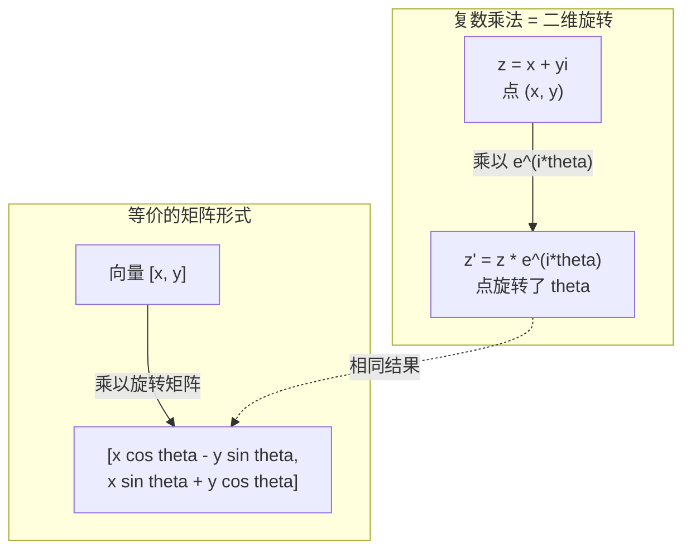
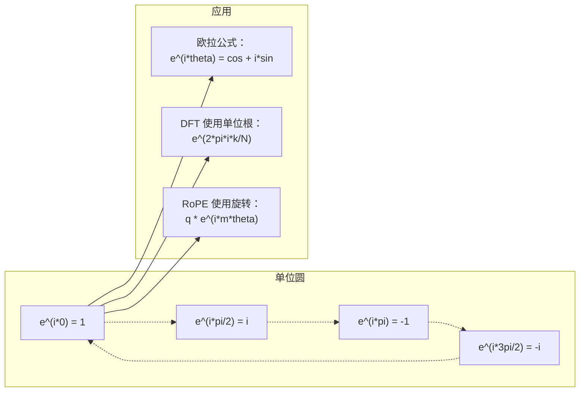

# AI 中的复数

> -1 的平方根并不"虚"。它是旋转、频率和信号处理半壁江山的钥匙。

**类型：** 学习型
**语言：** Python
**前置条件：** 阶段 1，第 01-04 课（线性代数、微积分）
**时间：** 约 60 分钟

## 学习目标

- 在直角坐标形式和极坐标形式下进行复数（Complex Number）的四则运算（加、乘、除、共轭）
- 应用欧拉公式（Euler's Formula）在复指数与三角函数之间互相转换
- 使用复单位根（Roots of Unity）实现离散傅里叶变换（DFT）
- 解释复旋转如何构成 RoPE 和 Transformer 中正弦位置编码的数学基础

## 问题

你翻开一篇关于傅里叶变换的论文，到处都是 `i`。你去看 Transformer 的位置编码，看到不同频率的 `sin` 和 `cos` —— 那正是复指数的实部和虚部。你读到量子计算，发现一切都在复向量空间中表达。

复数看起来很抽象。一个建立在对 -1 开平方上的数字体系，听起来像数学把戏。但它不是把戏。它是描述旋转和振荡的自然语言。每当有东西在旋转、振动或振荡，复数就是正确的工具。

不理解复数，你就无法理解离散傅里叶变换。你无法理解 FFT。你无法理解现代语言模型中的 RoPE（旋转位置编码）是如何工作的。你无法理解为什么原始 Transformer 论文中的正弦位置编码要使用那些特定的频率。

本课从零构建复数运算，将其与几何连接起来，并准确展示复数在机器学习中出现的位置。

## 概念

### 什么是复数？

一个复数由两部分组成：实部（Real Part）和虚部（Imaginary Part）。

```
z = a + bi

其中：
  a 是实部
  b 是虚部
  i 是虚数单位（Imaginary Unit），定义为 i^2 = -1
```

仅此而已。你把数轴扩展成了一个平面。实数坐在一条轴上，虚数坐在另一条轴上。每一个复数都是这个平面上的一个点。

### 复数四则运算

**加法。** 实部加实部，虚部加虚部。

```
(a + bi) + (c + di) = (a + c) + (b + d)i

示例：(3 + 2i) + (1 + 4i) = 4 + 6i
```

**乘法。** 使用分配律，并记住 i^2 = -1。

```
(a + bi)(c + di) = ac + adi + bci + bdi^2
                 = ac + adi + bci - bd
                 = (ac - bd) + (ad + bc)i

示例：(3 + 2i)(1 + 4i) = 3 + 12i + 2i + 8i^2
                       = 3 + 14i - 8
                       = -5 + 14i
```

**共轭（Conjugate）。** 翻转虚部的符号。

```
(a + bi) 的共轭 = a - bi
```

一个复数与其共轭的乘积永远是实数：

```
(a + bi)(a - bi) = a^2 + b^2
```

**除法。** 分子分母同时乘以分母的共轭。

```
(a + bi) / (c + di) = (a + bi)(c - di) / (c^2 + d^2)
```

这消去了分母中的虚部，得到一个干净的复数。

### 复平面（Complex Plane）

复平面将每个复数映射到一个二维点。水平轴是实轴，垂直轴是虚轴。

```
z = 3 + 2i  对应点 (3, 2)
z = -1 + 0i 对应实轴上的点 (-1, 0)
z = 0 + 4i  对应虚轴上的点 (0, 4)
```

一个复数同时是一个点和一个从原点出发的向量。这种双重解释正是复数对几何有用的原因。

### 极坐标形式（Polar Form）

平面上的任何点都可以用其到原点的距离和从正实轴起的角度来描述。

```
z = r * (cos(theta) + i*sin(theta))

其中：
  r = |z| = sqrt(a^2 + b^2)     （模长，Magnitude 或 Modulus）
  theta = atan2(b, a)             （辐角，Phase 或 Argument）
```

直角坐标形式（a + bi）适合加法。极坐标形式（r, theta）适合乘法。

**极坐标形式的乘法。** 模长相乘，辐角相加。

```
z1 = r1 * e^(i*theta1)
z2 = r2 * e^(i*theta2)

z1 * z2 = (r1 * r2) * e^(i*(theta1 + theta2))
```

这就是为什么复数是描述旋转的完美工具。乘以一个模长为 1 的复数就是一次纯粹的旋转。

### 欧拉公式

复指数与三角学之间的桥梁：

```
e^(i*theta) = cos(theta) + i*sin(theta)
```

这是本课最重要的公式。当 theta = pi 时：

```
e^(i*pi) = cos(pi) + i*sin(pi) = -1 + 0i = -1

因此：e^(i*pi) + 1 = 0
```

五个基本常数（e, i, pi, 1, 0）被一个等式联系在一起。

### 为什么欧拉公式对 ML 重要

欧拉公式表明，`e^(i*theta)` 在 theta 变化时沿单位圆（Unit Circle）运动。theta = 0 时，你在 (1, 0)。theta = pi/2 时，你在 (0, 1)。theta = pi 时，你在 (-1, 0)。theta = 3*pi/2 时，你在 (0, -1)。一整圈是 theta = 2*pi。

这意味着复指数本身就是旋转。而旋转在信号处理和 ML 中无处不在。

### 与二维旋转的联系

将复数 (x + yi) 乘以 e^(i*theta)，就是将点 (x, y) 绕原点旋转角度 theta。

```
通过复数乘法的旋转：
  (x + yi) * (cos(theta) + i*sin(theta))
  = (x*cos(theta) - y*sin(theta)) + (x*sin(theta) + y*cos(theta))i

通过矩阵乘法的旋转：
  [cos(theta)  -sin(theta)] [x]   [x*cos(theta) - y*sin(theta)]
  [sin(theta)   cos(theta)] [y] = [x*sin(theta) + y*cos(theta)]
```

两者产生相同的结果。复数乘法就是二维旋转。旋转矩阵不过是用矩阵记号写出来的复数乘法。



### 相量（Phasor）与旋转信号

复指数 e^(i*omega*t) 是以角频率 omega 绕单位圆旋转的点。随着 t 增加，该点沿圆周运动。

这个旋转点的实部是 cos(omega*t)，虚部是 sin(omega*t)。正弦信号是旋转复数的"影子"。

```
e^(i*omega*t) = cos(omega*t) + i*sin(omega*t)

实部：cos(omega*t)    —— 余弦波
虚部：sin(omega*t)    —— 正弦波
```

这就是相量表示法。你不用追踪一条扭来扭去的正弦曲线，而是追踪一个平滑旋转的箭头。相位偏移变成角度偏移。振幅变化变成模长变化。信号相加变成向量相加。

### 单位根（Roots of Unity）

N 次单位根是等距分布在单位圆上的 N 个点：

```
w_k = e^(2*pi*i*k/N)    其中 k = 0, 1, 2, ..., N-1
```

当 N = 4 时，单位根为：1, i, -1, -i（四个罗盘方位）。
当 N = 8 时，你会得到四个罗盘方位加上四个对角线方向。

单位根是离散傅里叶变换的基础。DFT 将信号分解为这 N 个等距频率上的分量。

### 与 DFT 的联系

信号 x[0], x[1], ..., x[N-1] 的离散傅里叶变换为：

```
X[k] = sum_{n=0}^{N-1} x[n] * e^(-2*pi*i*k*n/N)
```

每个 X[k] 度量信号与第 k 个单位根——即频率为 k 的复正弦波——的相关程度。DFT 将信号拆分为 N 个旋转相量，并告诉你每个相量的振幅和相位。

### 为什么 i 并不"虚"

"虚数（Imaginary）"这个词是历史的偶然。笛卡尔用这个词时带有贬义。但 i 并不比负数刚出现时人们拒绝接受它们更"虚"。负数回答的是"3 减 5 等于多少？"虚数单位回答的是"什么数的平方等于 -1？"

更有用的理解是：i 是一个 90 度旋转算子。将实数乘以 i 一次，你旋转 90 度到虚轴。再乘以 i 一次（i^2），你再旋转 90 度——现在你指向负实轴方向。这就是为什么 i^2 = -1。这不是什么神秘的事情。这是由两次四分之一转构成的一次半转。

这就是复数在工程中无处不在的原因。任何会旋转的东西——电磁波、量子态、信号振荡、位置编码——都可以自然地用复数来描述。

### 复指数与三角函数

在欧拉公式之前，工程师将信号写成 A*cos(omega*t + phi)——振幅 A，频率 omega，相位 phi。这可行，但让运算变得痛苦。两个不同相位的余弦相加需要一堆三角恒等式。

有了复指数，同样的信号是 A*e^(i*(omega*t + phi))。两个信号相加不过是两个复数相加。乘法（调制）不过是模长相乘、辐角相加。相位偏移变成角度加法。频率偏移变成乘以相量。

信号处理整个领域都切换到了复指数记号，因为数学更干净。"真实信号"始终只是复数表示的实部。虚部则作为"账本"一并携带，让所有代数运算自然成立。

### 与 Transformer 的联系

**正弦位置编码（Sinusoidal Positional Encoding）**（原始 Transformer 论文）：

```
PE(pos, 2i) = sin(pos / 10000^(2i/d))
PE(pos, 2i+1) = cos(pos / 10000^(2i/d))
```

sin 和 cos 对是不同频率下复指数的实部和虚部。每个频率提供一种不同的位置编码"分辨率"。低频变化慢（粗粒度位置），高频变化快（细粒度位置）。它们共同为每个位置赋予一个独一无二的频率指纹。

**RoPE（旋转位置编码，Rotary Position Embedding）** 更进一步。它显式地将 query 和 key 向量乘以复旋转矩阵。两个 token 之间的相对位置变成一个旋转角度。注意力使用这些旋转后的向量来计算，使模型通过复数乘法对相对位置变得敏感。

| 运算 | 代数形式 | 几何含义 |
|-----------|---------------|-------------------|
| 加法 | (a+c) + (b+d)i | 平面上的向量加法 |
| 乘法 | (ac-bd) + (ad+bc)i | 旋转并缩放 |
| 共轭 | a - bi | 关于实轴的镜像反射 |
| 模长 | sqrt(a^2 + b^2) | 到原点的距离 |
| 辐角 | atan2(b, a) | 从正实轴起的角度 |
| 除法 | 乘以共轭 | 反向旋转并重新缩放 |
| 幂 | r^n * e^(i*n*theta) | 旋转 n 次，缩放 r^n 倍 |



## 动手实现

### 第 1 步：Complex 类

构建一个支持四则运算、模长、辐角以及直角坐标与极坐标互转的 Complex 数类。

```python
import math

class Complex:
    def __init__(self, real, imag=0.0):
        self.real = real
        self.imag = imag

    def __add__(self, other):
        return Complex(self.real + other.real, self.imag + other.imag)

    def __mul__(self, other):
        r = self.real * other.real - self.imag * other.imag
        i = self.real * other.imag + self.imag * other.real
        return Complex(r, i)

    def __truediv__(self, other):
        denom = other.real ** 2 + other.imag ** 2
        r = (self.real * other.real + self.imag * other.imag) / denom
        i = (self.imag * other.real - self.real * other.imag) / denom
        return Complex(r, i)

    def magnitude(self):
        return math.sqrt(self.real ** 2 + self.imag ** 2)

    def phase(self):
        return math.atan2(self.imag, self.real)

    def conjugate(self):
        return Complex(self.real, -self.imag)
```

### 第 2 步：极坐标转换与欧拉公式

```python
def to_polar(z):
    return z.magnitude(), z.phase()

def from_polar(r, theta):
    return Complex(r * math.cos(theta), r * math.sin(theta))

def euler(theta):
    return Complex(math.cos(theta), math.sin(theta))
```

验证：`euler(theta).magnitude()` 应始终为 1.0。`euler(0)` 应给出 (1, 0)。`euler(pi)` 应给出 (-1, 0)。

### 第 3 步：旋转

将点 (x, y) 旋转角度 theta，一次复数乘法即可：

```python
point = Complex(3, 4)
rotated = point * euler(math.pi / 4)
```

模长保持不变，只有角度改变。

### 第 4 步：用复数运算实现 DFT

```python
def dft(signal):
    N = len(signal)
    result = []
    for k in range(N):
        total = Complex(0, 0)
        for n in range(N):
            angle = -2 * math.pi * k * n / N
            total = total + Complex(signal[n], 0) * euler(angle)
        result.append(total)
    return result
```

这是 O(N^2) 的 DFT。每个输出 X[k] 是信号采样点乘以单位根之后的总和。

### 第 5 步：逆 DFT

逆 DFT 从频谱重建原始信号。与正向 DFT 的唯一区别：指数中的符号取反，并除以 N。

```python
def idft(spectrum):
    N = len(spectrum)
    result = []
    for n in range(N):
        total = Complex(0, 0)
        for k in range(N):
            angle = 2 * math.pi * k * n / N
            total = total + spectrum[k] * euler(angle)
        result.append(Complex(total.real / N, total.imag / N))
    return result
```

这给出完美的重建。先做 DFT，再做 IDFT，你会以机器精度找回原始信号。没有任何信息丢失。

### 第 6 步：单位根

```python
def roots_of_unity(N):
    return [euler(2 * math.pi * k / N) for k in range(N)]
```

验证两个性质：
- 每个根的模长恰好为 1。
- 所有 N 个根的和为零（对称性使它们互相抵消）。

这些性质正是 DFT 可逆的原因。单位根构成频域的一组正交基。

## 实际使用

Python 内置了复数支持。字面量 `j` 表示虚数单位。

```python
z = 3 + 2j
w = 1 + 4j

print(z + w)
print(z * w)
print(abs(z))

import cmath
print(cmath.phase(z))
print(cmath.exp(1j * cmath.pi))
```

对于数组，numpy 原生支持复数：

```python
import numpy as np

z = np.array([1+2j, 3+4j, 5+6j])
print(np.abs(z))
print(np.angle(z))
print(np.conj(z))
print(np.real(z))
print(np.imag(z))

signal = np.sin(2 * np.pi * 5 * np.linspace(0, 1, 128))
spectrum = np.fft.fft(signal)
freqs = np.fft.fftfreq(128, d=1/128)
```

## 交付物

运行 `code/complex_numbers.py` 生成 `outputs/skill-complex-arithmetic.md`。

## 联系

本课的所有概念都与现代 AI 的具体部分相连接：

| 概念 | 出现在哪里 |
|---------|------------------|
| 复平面与极坐标 | 2D 旋转的几何表示，所有旋转运算的基础 |
| 欧拉公式 | 正弦位置编码的数学根源，连接指数与三角 |
| 单位根 | DFT/FFT 的正交基，频谱分析的数学核心 |
| 相量表示 | 信号处理中将振荡信号转化为旋转向量的标准方法 |
| 复旋转 | RoPE 的核心机制 —— 通过复数乘法编码 token 间的相对位置 |
| 共轭对称 | 确保实信号的 DFT 输出是对称的，实用频谱只用前半部分 |
| 模长与辐角 | 频谱分析中提取振幅谱和相位谱的基本运算 |

RoPE 值得专门说一说。在 Transformer 的注意力计算中，RoPE 将 query 和 key 向量乘以 e^(i*m*theta)，其中 m 是 token 的位置。两个 token 之间的相对位置 m - n 自然出现在旋转角度中。这使得注意力分数天然具备相对位置感知能力 —— 不需要额外的位置参数，不需要学习位置嵌入，只需利用复数乘法的几何性质。这就是复数在真正干活。

## 练习

1. **手算复数运算。** 计算 (2 + 3i) * (4 - i) 并用代码验证。然后计算 (5 + 2i) / (1 - 3i)。在复平面上画出两个结果，验证乘法对第一个数进行了旋转和缩放。

2. **旋转序列。** 从点 (1, 0) 开始。乘以 e^(i*pi/6) 十二次。验证 12 次乘法后你回到了 (1, 0)。打印每一步的坐标，确认它们描出了一个正十二边形。

3. **已知信号的 DFT。** 创建一个信号，它是 sin(2*pi*3*t) 和 0.5*sin(2*pi*7*t) 的和，以 32 个点采样。运行你的 DFT。验证幅度谱在频率 3 和 7 处有峰值，且频率 7 处的峰值高度是频率 3 处的一半。

4. **单位根可视化。** 计算 8 次单位根。验证它们的和为零。验证将任意一个根乘以本原根 e^(2*pi*i/8) 得到下一个根。

5. **旋转矩阵等价性。** 对 10 个随机角度和 10 个随机点，验证复数乘法与 2x2 旋转矩阵的矩阵-向量乘法给出相同结果。打印最大数值差异。

## 关键术语

| 术语 | 含义 |
|------|---------------|
| 复数（Complex Number） | 形如 a + bi 的数，其中 a 是实部，b 是虚部，i^2 = -1 |
| 虚数单位（Imaginary Unit） | 数 i，定义为 i^2 = -1。在哲学意义上并不"虚"——它是一个旋转算子 |
| 复平面（Complex Plane） | 以 x 轴为实轴、y 轴为虚轴的二维平面，也称 Argand 平面 |
| 模长（Magnitude/Modulus） | 到原点的距离：sqrt(a^2 + b^2)，记作 \|z\| |
| 辐角（Phase/Argument） | 从正实轴起的角度：atan2(b, a)，记作 arg(z) |
| 共轭（Conjugate） | 关于实轴的镜像：a + bi 的共轭是 a - bi |
| 极坐标形式（Polar Form） | 将 z 表示为 r * e^(i*theta) 而非 a + bi。让乘法变得简单 |
| 欧拉公式（Euler's Formula） | e^(i*theta) = cos(theta) + i*sin(theta)。将指数与三角学连接起来 |
| 相量（Phasor） | 一个旋转的复数 e^(i*omega*t)，表示一个正弦信号 |
| 单位根（Roots of Unity） | N 个复数 e^(2*pi*i*k/N)，k = 0 到 N-1。单位圆上 N 个等距点 |
| DFT（离散傅里叶变换） | 使用单位根将信号分解为复正弦分量的变换 |
| RoPE（旋转位置编码） | 使用复数乘法在 Transformer 注意力中编码相对位置 |

## 进一步阅读

- [Visual Introduction to Euler's Formula](https://betterexplained.com/articles/intuitive-understanding-of-eulers-formula/) - 用几何直觉而不是沉重记号来理解欧拉公式
- [Su et al.: RoFormer (2021)](https://arxiv.org/abs/2104.09864) - 引入使用复旋转的旋转位置编码的论文
- [Vaswani et al.: Attention Is All You Need (2017)](https://arxiv.org/abs/1706.03762) - 包含正弦位置编码的原始 Transformer 论文
- [3Blue1Brown: Euler's formula with introductory group theory](https://www.youtube.com/watch?v=mvmuCPvRoWQ) - 用可视化解释为什么 e^(i*pi) = -1
- [Needham: Visual Complex Analysis](https://global.oup.com/academic/product/visual-complex-analysis-9780198534464) - 最好的复数可视化教材，充满几何洞见
- [Strang: Introduction to Linear Algebra, Ch. 10](https://math.mit.edu/~gs/linearalgebra/) - 在线性代数与特征值的语境中讲解复数
