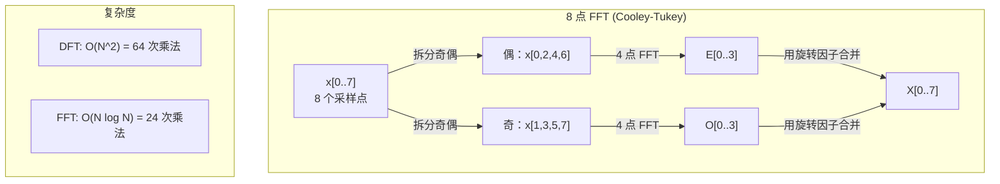
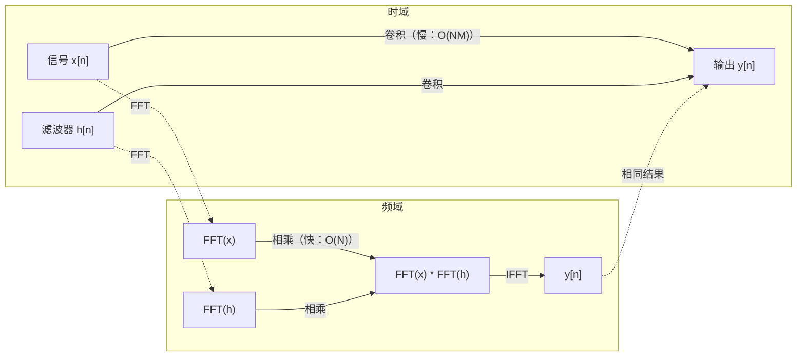

# 傅里叶变换

> 任何信号都是正弦波的和。傅里叶变换告诉你有哪些。

**类型：** 构建型
**语言：** Python
**前置条件：** 阶段 1，第 01-04 课，第 19 课（复数）
**时间：** 约 90 分钟

## 学习目标

- 从零实现 DFT，并用 O(N log N) 的 Cooley-Tukey FFT 验证其正确性
- 解读频率系数：从信号中提取振幅、相位和功率谱（Power Spectrum）
- 应用卷积定理（Convolution Theorem），通过 FFT 乘法实现卷积
- 将傅里叶频率分解与 Transformer 位置编码及 CNN 卷积层连接起来

## 问题

一段音频录音是随时间变化的压强测量序列。股票价格是随天数变化的价值序列。一张图像是随空间变化的像素强度网格。这些都处于时域（Time Domain）或空域（Space Domain）——你看到的是数值随某个索引变化。

但许多模式在时域中是看不到的。这段音频信号是单音还是和弦？这个股票价格有周周期吗？这张图像有重复的纹理吗？这些问题涉及的是频率内容，而时域隐藏了这些信息。

傅里叶变换将数据从时域转换到频域（Frequency Domain）。它接收一个信号，将其分解为不同频率的正弦波。每个正弦波有一个振幅（Amplitude）——它有多强——和一个相位（Phase）——它从哪里开始。傅里叶变换告诉你两者。

这对 ML 很重要，因为频域思维无处不在。卷积神经网络执行的是卷积，而卷积在频域中就是乘法。Transformer 的位置编码使用频率分解来表示位置。音频模型（语音识别、音乐生成）在频谱图（Spectrogram）——声音的频率表示——上运行。时间序列模型寻找周期性模式。理解傅里叶变换，你就获得了与所有这些打交道的基本语言。

## 概念

### DFT 的定义

给定 N 个采样点 x[0], x[1], ..., x[N-1]，离散傅里叶变换（DFT）产生 N 个频率系数 X[0], X[1], ..., X[N-1]：

```
X[k] = sum_{n=0}^{N-1} x[n] * e^(-2*pi*i*k*n/N)

其中 k = 0, 1, ..., N-1
```

每个 X[k] 是一个复数。其模长 |X[k]| 告诉你频率 k 的振幅，其辐角 angle(X[k]) 告诉你该频率的相位偏移。

关键洞见：`e^(-2*pi*i*k*n/N)` 是一个以频率 k 旋转的相量。DFT 计算信号与 N 个等距频率之间的相关性。如果信号在频率 k 处有能量，相关性就大；如果没有，就接近零。

### 每个系数的含义

**X[0]：直流分量（DC Component）。** 这是所有采样点的和——与均值成正比。它表示信号的恒定（零频率）偏移。

```
X[0] = sum_{n=0}^{N-1} x[n] * e^0 = 所有采样点的和
```

**X[k]，1 <= k <= N/2：正频率。** X[k] 表示每 N 个采样点中 k 个周期的频率。k 越大，频率越高（振荡越快）。

**X[N/2]：奈奎斯特频率（Nyquist Frequency）。** N 个采样点能表示的最高频率。超过这个频率会出现混叠（Aliasing）——高频伪装成低频。

**X[k]，N/2 < k < N：负频率。** 对于实值信号，X[N-k] = conj(X[k])。负频率是正频率的镜像。这就是为什么有用信息在前 N/2 + 1 个系数中。

### 逆 DFT（Inverse DFT）

逆 DFT 从频率系数中重建原始信号：

```
x[n] = (1/N) * sum_{k=0}^{N-1} X[k] * e^(2*pi*i*k*n/N)

其中 n = 0, 1, ..., N-1
```

与正向 DFT 的唯一区别：指数中的符号为正（而非负），并且有一个 1/N 的归一化因子。

逆 DFT 是完美重建。没有任何信息丢失。你可以从时域到频域再返回，不产生任何误差。DFT 是基变换——它将同样的信息重新表达在不同的坐标系中。

### FFT：让它变快

上述定义的 DFT 是 O(N^2)：对每个输出系数，你都要遍历 N 个输入采样点。对于 N = 1 百万，那是 10^12 次运算。

快速傅里叶变换（FFT，Fast Fourier Transform）以 O(N log N) 算出相同结果。对于 N = 1 百万，大约是 2 千万次运算，而不是 1 万亿次。这让频率分析变得实际可行。

Cooley-Tukey 算法（最常用的 FFT）使用分治法：

1. 将信号拆分为偶数索引和奇数索引的采样点。
2. 递归计算每一半的 DFT。
3. 使用"旋转因子（Twiddle Factor）" e^(-2*pi*i*k/N) 将两个半尺寸 DFT 合并。

```
X[k] = E[k] + e^(-2*pi*i*k/N) * O[k]          其中 k = 0, ..., N/2 - 1
X[k + N/2] = E[k] - e^(-2*pi*i*k/N) * O[k]    其中 k = 0, ..., N/2 - 1

其中 E = 偶数索引采样点的 DFT
     O = 奇数索引采样点的 DFT
```

对称性意味着每层递归做 O(N) 的工作，共有 log2(N) 层。总计：O(N log N)。



FFT 要求信号长度为 2 的幂。实践中，信号会被补零（Zero-pad）到下一个 2 的幂。

### 频谱分析（Spectral Analysis）

**功率谱** 是 |X[k]|^2 —— 每个频率系数模长的平方。它显示每个频率处有多少能量。

**相位谱** 是 angle(X[k]) —— 每个频率的相位偏移。在大多数分析任务中，你关心的是功率谱，可以忽略相位。

```
频率 k 处的功率：P[k] = |X[k]|^2 = X[k].real^2 + X[k].imag^2
频率 k 处的相位：phi[k] = atan2(X[k].imag, X[k].real)
```

### 频率分辨率

DFT 的频率分辨率取决于采样点数 N 和采样率 fs。

```
频率 bin k 对应的频率：f_k = k * fs / N
频率分辨率：           delta_f = fs / N
最大频率：             f_max = fs / 2  （奈奎斯特频率）
```

要分辨两个靠得很近的频率，你需要更多的采样点。要捕捉高频，你需要更高的采样率。

### 卷积定理

这是信号处理中最重要的结论之一，且与 CNN 直接相关。

**时域中的卷积等于频域中的逐点相乘。**

```
x * h = IFFT(FFT(x) . FFT(h))

其中 * 是卷积，. 是逐元素乘法
```

这为什么重要：

- 两个长度分别为 N 和 M 的信号的直接卷积需要 O(N*M) 次运算。
- 基于 FFT 的卷积需要 O(N log N)：变换两个信号，相乘，再逆变换回来。
- 对于大卷积核，基于 FFT 的卷积显著更快。
- 这正是大感受野卷积层中发生的事情。

注意：DFT 计算的是循环卷积（Circular Convolution）——信号会绕回。对于线性卷积（Linear Convolution，无绕回），在计算前将两个信号都补零到长度 N + M - 1。



### 加窗（Windowing）

DFT 假设信号是周期的——它将 N 个采样点视为一个无限重复信号的一个周期。如果信号的起点和终点不在相同的值上，这会在边界处产生不连续性，表现为虚假的高频内容。这称为频谱泄漏（Spectral Leakage）。

加窗通过在计算 DFT 之前将信号两端逐渐衰减到零来减少泄漏。

常用窗函数：

| 窗函数 | 形状 | 主瓣宽度 | 旁瓣水平 | 使用场景 |
|--------|-------|----------------|-----------------|----------|
| 矩形窗（Rectangular） | 平面（无窗） | 最窄 | 最高（-13 dB） | 信号恰好在 N 个采样点内是周期的 |
| Hann 窗 | 升余弦 | 中等 | 低（-31 dB） | 通用频谱分析 |
| Hamming 窗 | 修正余弦 | 中等 | 更低（-42 dB） | 音频处理、语音分析 |
| Blackman 窗 | 三重余弦 | 宽 | 非常低（-58 dB） | 旁瓣抑制至关重要的情况 |

```
Hann 窗：    w[n] = 0.5 * (1 - cos(2*pi*n / (N-1)))
Hamming 窗： w[n] = 0.54 - 0.46 * cos(2*pi*n / (N-1))
```

通过将窗函数逐元素与信号相乘来施加窗：`X = DFT(x * w)`。

### DFT 的性质

| 性质 | 时域 | 频域 |
|----------|-------------|-----------------|
| 线性 | a*x + b*y | a*X + b*Y |
| 时移 | x[n - k] | X[f] * e^(-2*pi*i*f*k/N) |
| 频移 | x[n] * e^(2*pi*i*f0*n/N) | X[f - f0] |
| 卷积 | x * h | X * H（逐点） |
| 乘法 | x * h（逐点） | X * H（循环卷积，缩放 1/N） |
| 帕塞瓦尔定理 | sum \|x[n]\|^2 | (1/N) * sum \|X[k]\|^2 |
| 共轭对称（实输入） | x[n] 为实数 | X[k] = conj(X[N-k]) |

帕塞瓦尔定理（Parseval's Theorem）表明总能量在两个域中相同。能量在变换过程中守恒。

### 与位置编码的联系

原始 Transformer 使用正弦位置编码：

```
PE(pos, 2i)   = sin(pos / 10000^(2i/d_model))
PE(pos, 2i+1) = cos(pos / 10000^(2i/d_model))
```

每个维度对 (2i, 2i+1) 以不同的频率振荡。频率从高（维度 0, 1）到低（最后几维）按几何级数分布。这给每个位置在所有频带上赋予一个独一无二的模式——类似于傅里叶系数唯一标识一个信号。

这带来的关键性质：

- **唯一性：** 没有两个位置有相同的编码。
- **有界值：** sin 和 cos 始终在 [-1, 1] 之间。
- **相对位置：** 位置 p+k 的编码可以表示为位置 p 处编码的线性函数。模型可以学会关注相对位置。

### 与 CNN 的联系

一个卷积层通过在信号或图像上滑动一个学习到的滤波器（卷积核）来作用于输入。数学上，这就是卷积运算。

根据卷积定理，这等价于：
1. 对输入做 FFT
2. 对卷积核做 FFT
3. 在频域中相乘
4. 对结果做 IFFT

标准 CNN 实现使用直接卷积（对小 3×3 核更快）。但对于大卷积核或全局卷积，基于 FFT 的方法显著更快。一些架构（如 FNet）完全用 FFT 替换了注意力机制，以 O(N log N) 复杂度达到有竞争力的精度，而不是 O(N^2)。

### 频谱图与短时傅里叶变换（STFT）

单次 FFT 给出整个信号的频率内容，但无法告诉你这些频率何时出现。一个啁啾信号（频率随时间增加）和一个和弦信号（所有频率同时存在）可以有相同的幅度谱。

短时傅里叶变换（STFT，Short-Time Fourier Transform）通过对信号的重叠窗口计算 FFT 来解决这个问题。结果是一个频谱图：时间在一个轴上、频率在另一个轴上的二维表示。每个点的强度显示该频率在该时间的能量。

```
STFT 过程：
1. 选择一个窗大小（如 1024 个采样点）
2. 选择一个跳跃大小（如 256 个采样点——75% 重叠）
3. 对每个窗位置：
   a. 提取加窗后的片段
   b. 施加 Hann/Hamming 窗
   c. 计算 FFT
   d. 将幅度谱存储为频谱图的一列
```

频谱图是音频 ML 模型的标准输入表示。语音识别模型（Whisper、DeepSpeech）在 mel 频谱图（Mel-Spectrogram）上运行——频率被映射到 mel 刻度的频谱图，这种刻度更好地匹配了人类音高感知。

### 混叠（Aliasing）

如果信号包含高于 fs/2（奈奎斯特频率）的频率，以采样率 fs 采样会产生混叠副本。以 100 Hz 采样的 90 Hz 信号看起来与 10 Hz 信号一模一样。仅从采样点无法区分它们。

```
示例：
  真实信号：90 Hz 正弦波
  采样率：100 Hz
  表观频率：100 - 90 = 10 Hz

  以 100 Hz 采样率采样的 90 Hz 信号
  与 10 Hz 信号的采样点完全相同。
  任何数学手段都无法恢复原始的 90 Hz 信号。
```

这就是为什么模数转换器在采样前包含抗混叠滤波器（Anti-Aliasing Filter），去除奈奎斯特频率以上的频率。在 ML 中，当对特征图做下采样而没有适当的低通滤波时，混叠就会出现——一些架构通过抗混叠池化层来解决这个问题。

### 补零不会提高分辨率

一个常见误解：在 FFT 之前对信号补零可以提高频率分辨率。不会。补零在现有频率 bin 之间做插值，给出一个看起来更平滑的频谱。但它无法揭示原始采样点中不存在的频率细节。

真正的频率分辨率仅取决于观测时间 T = N / fs。要分辨两个相隔 delta_f 的频率，你至少需要 T = 1 / delta_f 秒的数据。多少补零都无法改变这个基本限制。

## 动手实现

### 第 1 步：从零实现 DFT

O(N^2) 的 DFT 直接从定义出发。

```python
import math

class Complex:
    ...

def dft(x):
    N = len(x)
    result = []
    for k in range(N):
        total = Complex(0, 0)
        for n in range(N):
            angle = -2 * math.pi * k * n / N
            w = Complex(math.cos(angle), math.sin(angle))
            xn = x[n] if isinstance(x[n], Complex) else Complex(x[n])
            total = total + xn * w
        result.append(total)
    return result
```

### 第 2 步：逆 DFT

相同结构，正指数，除以 N。

```python
def idft(X):
    N = len(X)
    result = []
    for n in range(N):
        total = Complex(0, 0)
        for k in range(N):
            angle = 2 * math.pi * k * n / N
            w = Complex(math.cos(angle), math.sin(angle))
            total = total + X[k] * w
        result.append(Complex(total.real / N, total.imag / N))
    return result
```

### 第 3 步：FFT (Cooley-Tukey)

递归 FFT 要求长度为 2 的幂。拆分为奇偶，递归，用旋转因子合并。

```python
def fft(x):
    N = len(x)
    if N <= 1:
        return [x[0] if isinstance(x[0], Complex) else Complex(x[0])]
    if N % 2 != 0:
        return dft(x)

    even = fft([x[i] for i in range(0, N, 2)])
    odd = fft([x[i] for i in range(1, N, 2)])

    result = [Complex(0)] * N
    for k in range(N // 2):
        angle = -2 * math.pi * k / N
        twiddle = Complex(math.cos(angle), math.sin(angle))
        t = twiddle * odd[k]
        result[k] = even[k] + t
        result[k + N // 2] = even[k] - t
    return result
```

### 第 4 步：频谱分析辅助函数

```python
def power_spectrum(X):
    return [xk.real ** 2 + xk.imag ** 2 for xk in X]

def convolve_fft(x, h):
    N = len(x) + len(h) - 1
    padded_N = 1
    while padded_N < N:
        padded_N *= 2

    x_padded = x + [0.0] * (padded_N - len(x))
    h_padded = h + [0.0] * (padded_N - len(h))

    X = fft(x_padded)
    H = fft(h_padded)

    Y = [xk * hk for xk, hk in zip(X, H)]

    y = idft(Y)
    return [y[n].real for n in range(N)]
```

## 实际使用

在实际工作中，使用 numpy 的 FFT，它背后是高度优化的 C 库。

```python
import numpy as np

signal = np.sin(2 * np.pi * 5 * np.arange(256) / 256)
spectrum = np.fft.fft(signal)
freqs = np.fft.fftfreq(256, d=1/256)

power = np.abs(spectrum) ** 2

positive_freqs = freqs[:len(freqs)//2]
positive_power = power[:len(power)//2]
```

加窗和更高级的频谱分析：

```python
from scipy.signal import windows, stft

window = windows.hann(256)
windowed = signal * window
spectrum = np.fft.fft(windowed)
```

卷积：

```python
from scipy.signal import fftconvolve

result = fftconvolve(signal, kernel, mode='full')
```

频谱图：

```python
from scipy.signal import stft

frequencies, times, Zxx = stft(signal, fs=sample_rate, nperseg=256)
spectrogram = np.abs(Zxx) ** 2
```

频谱图矩阵的形状为 (n_frequencies, n_time_frames)。每一列是某一时间窗的功率谱。这就是音频 ML 模型消费的输入格式。

## 交付物

运行 `code/fourier.py` 生成 `outputs/prompt-spectral-analyzer.md`。

## 联系

本课的所有概念都与现代 AI 的具体部分相连接：

| 概念 | 出现在哪里 |
|---------|------------------|
| DFT/FFT | 音频模型的频谱分析、FNet 中替换注意力的 FFT 层 |
| 功率谱 | 语音识别中的特征提取、振动分析、周期性检测 |
| 卷积定理 | CNN 的理论基础——时域卷积 = 频域乘法 |
| FFT 卷积 | 大卷积核的高效实现、全局卷积层 |
| 频谱图 / STFT | Whisper 等语音识别模型的输入表示 |
| 频谱泄漏与加窗 | 频谱分析的预处理步骤，确保频率系数不被边界效应污染 |
| 频率分解 | Transformer 正弦位置编码的核心思想 |
| 奈奎斯特频率与混叠 | 下采样时防止信息丢失，抗混叠池化层 |

Transformer 的位置编码从傅里叶思想中获益良多。原始正弦编码本质上是按几何级数间距排列的多个频率的 cos/sin 采样——这与 DFT 将信号分解为不同频率分量的思路一脉相承。FNet 走得更远，直接用 FFT 替换了自注意力：在 token 维度上做 FFT，在频域中对 token 做"混合"，再做逆 FFT。复杂度从 O(N^2) 降到 O(N log N)，同时保持了有竞争力的精度。这就是频域思维在 AI 架构中的实际应用。

## 练习

1. **识别纯音。** 创建一个频率未知（1 到 50 Hz 之间）的单正弦波信号，以 128 Hz 采样 1 秒。用你的 DFT 识别该频率。验证答案匹配。然后加入标准差为 0.5 的高斯噪声，重复实验。噪声如何影响频谱？

2. **FFT 与 DFT 验证。** 生成长度为 64 的随机信号。同时计算 DFT (O(N^2)) 和 FFT。验证所有系数在 1e-10 以内匹配。对长度为 256、512、1024 和 2048 的信号分别计时。画出 DFT 时间与 FFT 时间的比值。

3. **用实例证明卷积定理。** 创建信号 x = [1, 2, 3, 4, 0, 0, 0, 0] 和滤波器 h = [1, 1, 1, 0, 0, 0, 0, 0]。用直接方法（嵌套循环）计算它们的循环卷积。然后用 FFT 计算（变换、相乘、逆变换）。验证结果匹配。再通过适当补零计算线性卷积。

4. **加窗效果。** 创建一个包含 10 Hz 和 12 Hz（非常接近）两个正弦波的信号。以 128 Hz 采样 1 秒。分别用无窗、Hann 窗和 Hamming 窗计算功率谱。哪种窗最容易分辨两个峰值？为什么？

5. **位置编码分析。** 为 d_model = 128 和 max_pos = 512 生成正弦位置编码。对每对位置 (p1, p2)，计算其编码的点积。证明点积仅取决于 |p1 - p2|，而非绝对位置。随着距离增加，点积会发生什么变化？

## 关键术语

| 术语 | 含义 |
|------|---------------|
| DFT（离散傅里叶变换） | 将 N 个时域采样点转换为 N 个频域系数。每个系数是与该频率复正弦波的相关性 |
| FFT（快速傅里叶变换） | 计算 DFT 的 O(N log N) 算法。Cooley-Tukey 算法递归拆分奇偶索引 |
| 逆 DFT（Inverse DFT） | 从频率系数重建时域信号。公式与 DFT 相同，指数符号取反并除以 1/N |
| 频率 bin（Frequency Bin） | DFT 输出中的每个索引 k 表示频率 k*fs/N Hz。"bin"即离散的频率槽位 |
| 直流分量（DC Component） | X[0]，零频率系数。与信号均值成正比 |
| 奈奎斯特频率（Nyquist Frequency） | fs/2，在采样率 fs 下能表示的最高频率。超过此频率会混叠 |
| 功率谱（Power Spectrum） | \|X[k]\|^2，每个频率系数模长的平方。显示能量在各频率上的分布 |
| 相位谱（Phase Spectrum） | angle(X[k])，每个频率分量的相位偏移。在分析中常被忽略 |
| 频谱泄漏（Spectral Leakage） | 将非周期信号当作周期信号处理而产生的虚假频率内容。通过加窗减少 |
| 窗函数（Window Function） | 在 DFT 前施加的渐弱函数（Hann、Hamming、Blackman），用于减少频谱泄漏 |
| 旋转因子（Twiddle Factor） | 复指数 e^(-2*pi*i*k/N)，在 FFT 蝶形计算中用于合并子 DFT |
| 卷积定理（Convolution Theorem） | 时域中的卷积等于频域中的逐点相乘。信号处理和 CNN 的基础 |
| 循环卷积（Circular Convolution） | 信号绕回的卷积。这是 DFT 自然计算的卷积类型 |
| 线性卷积（Linear Convolution） | 无绕回的标准卷积。通过在 DFT 前补零实现 |
| 帕塞瓦尔定理（Parseval's Theorem） | 总能量在傅里叶变换中守恒。sum \|x[n]\|^2 = (1/N) sum \|X[k]\|^2 |
| 混叠（Aliasing） | 因采样率不足，奈奎斯特频率以上的频率表现为低频 |

## 进一步阅读

- [Cooley & Tukey: An Algorithm for the Machine Calculation of Complex Fourier Series (1965)](https://www.ams.org/journals/mcom/1965-19-090/S0025-5718-1965-0178586-1/) - 改变了计算领域的原始 FFT 论文
- [3Blue1Brown: But what is the Fourier Transform?](https://www.youtube.com/watch?v=spUNpyF58BY) - 最好的傅里叶变换可视化入门
- [Lee-Thorp et al.: FNet: Mixing Tokens with Fourier Transforms (2021)](https://arxiv.org/abs/2105.03824) - 在 Transformer 中用 FFT 替换自注意力
- [Smith: The Scientist and Engineer's Guide to Digital Signal Processing](http://www.dspguide.com/) - 免费在线教材，深入涵盖 FFT、加窗和频谱分析
- [Vaswani et al.: Attention Is All You Need (2017)](https://arxiv.org/abs/1706.03762) - 基于傅里叶频率分解的正弦位置编码
- [Radford et al.: Whisper (2022)](https://arxiv.org/abs/2212.04356) - 使用 mel 频谱图作为输入表示的语音识别模型
