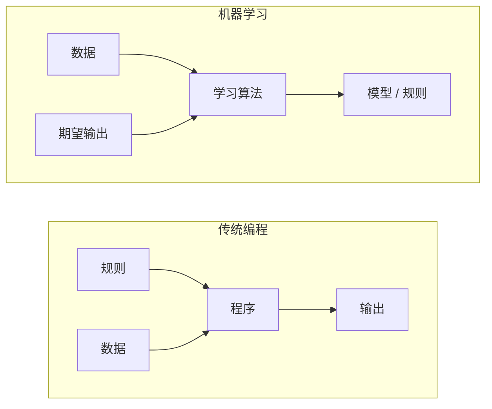
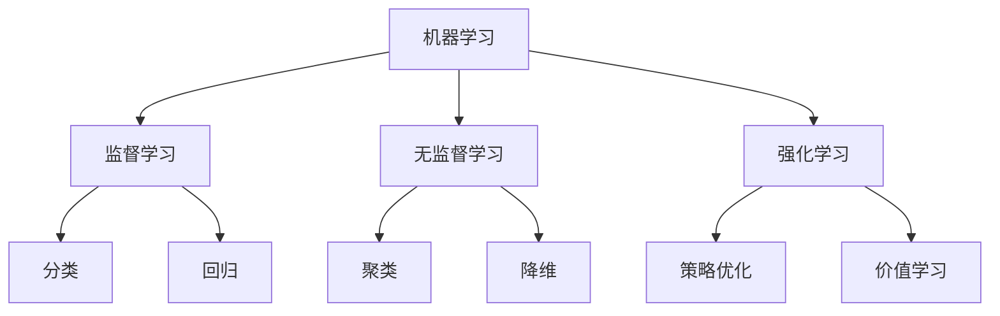
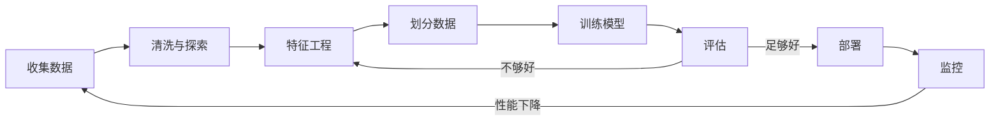
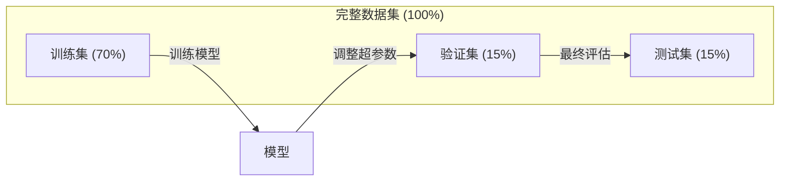
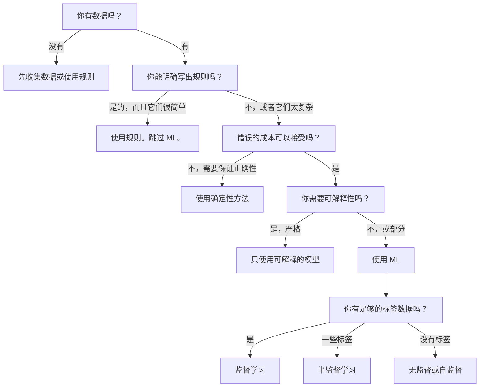

# 什么是机器学习

> 机器学习是教计算机从数据中寻找模式，而不是手工编写规则。

**类型：** 学习型
**语言：** Python
**前置条件：** 第一阶段（数学基础）
**时间：** 约 45 分钟

## 学习目标

- 解释监督学习、无监督学习和强化学习之间的区别，并判断给定问题属于哪种类型
- 从零实现最近质心分类器，并用它与随机基准进行对比
- 区分分类任务和回归任务，并为每种任务选择合适的损失函数
- 评估某个业务问题是否适合用机器学习解决，或者更适合用确定性规则

## 问题

你想构建一个垃圾邮件过滤器。传统方法是：坐下来写上百条规则。"如果邮件包含 'FREE MONEY'，标记为垃圾邮件。如果有超过 3 个感叹号，标记为垃圾邮件。"你花了几周写规则。然后spam发送者改变了措辞。你的规则失效了。你又写了更多规则。这个循环永远不会结束。

机器学习翻转了这一切。不再编写规则，而是给计算机成千上万封带标签的邮件（"垃圾邮件"或"非垃圾邮件"），让它自己找出规则。计算机会发现你从未想到过的模式。当 spam 发送者改变策略时，你在新的数据上重新训练，而不是重写代码。

从"编程规则"到"从数据中学习"这种转变，是机器学习的核心。每个推荐引擎、语音助手、自动驾驶汽车和语言模型都是这样工作的。

## 概念

### 从数据中学习，而非从规则中学习

传统编程和机器学习以相反的方向解决问题。



传统编程：你编写规则。程序将规则应用于数据以产生输出。

机器学习：你提供数据和期望输出。算法发现规则。

训练得到的"模型"就是规则本身，以数字（权重、参数）的形式编码。它从见过的例子中泛化，对从未见过的数据做出预测。

### 机器学习的三种类型



**监督学习**：你有输入-输出对。模型学习将输入映射到输出。
- "这里有 10,000 张标有猫或狗的照片。学会区分它们。"
- "这里有房屋特征和价格。学会预测价格。"

**无监督学习**：你只有输入。没有标签。模型自行发现结构。
- "这里有 10,000 个客户的购买历史。找出自然分组。"
- "这里有 1,000 个高维数据点。在保持结构的同时降到 2 维。"

**强化学习**：智能体在环境中采取行动并获得奖励或惩罚。它学习一种策略（政策）以最大化总奖励。
- "玩这个游戏。赢了 +1 分，输了 -1 分。想出一个策略。"
- "控制这个机械臂。拿起物体 +1 分，每浪费一秒 -0.01 分。"

你在实践中构建的大部分内容使用的是监督学习。无监督学习常用于预处理和探索。强化学习为游戏 AI、机器人和语言模型的 RLHF 提供动力。

### 三种类型之外

上述三个类别很清晰，但现实世界中的 ML 常常模糊边界。

**半监督学习**使用少量带标签的数据和大量无标签的数据。你可能有 100 张带标签的医学图像和 100,000 张无标签的图像。技术包括：

- **标签传播：** 构建一个连接相似数据点的图。标签通过图从带标签的节点传播到无标签的邻居。
- **伪标签：** 在带标签的数据上训练一个模型，用它为无标签的数据预测标签，然后用所有数据重新训练。模型引导自己的训练集。
- **一致性正则化：** 模型对同一个输入及其轻微扰动版本应给出相同的预测。这在没有标签的情况下也能工作。

**自监督学习**从数据本身创造监督信号。完全不需要人类标签。模型从数据的结构中创建自己的预测任务。

- **掩码语言建模（BERT）：** 隐藏句子中 15% 的词，训练模型预测缺失的词。"标签"来自原始文本。
- **对比学习（SimCLR）：** 取一张图像，创建两个增强版本。训练模型识别它们来自同一张图像，同时区分来自其他图像的增强版本。
- **下一个 token 预测（GPT）：** 给定所有前面的词，预测下一个词。每个文本文档都成为一个训练样本。

这些不是独立于三大类的新类别。它们是结合监督和无监督想法的策略。自监督学习在技术上也是监督的（模型预测某个东西），但标签是自动生成的，不是由人类提供的。

### 分类 vs 回归

这是两种主要的监督学习任务。

| 方面 | 分类 | 回归 |
|--------|---------------|------------|
| 输出 | 离散类别 | 连续数值 |
| 示例 | "这封邮件是垃圾邮件吗？" | "房价会是多少？" |
| 输出空间 | {猫, 狗, 鸟} | 任意实数 |
| 损失函数 | 交叉熵、准确率 | 均方误差、MAE |
| 决策边界 | 类别之间的边界 | 拟合数据的曲线 |

分类回答"哪个类别？"回归回答"多少？"

有些问题可以用两种方式构建。预测股票上涨或下跌是分类。预测确切价格是回归。

### ML 工作流程

每个机器学习项目都遵循相同的流程，无论使用什么算法。



**收集数据**：收集原始数据。数据越多几乎总是越好，但质量比数量更重要。

**清洗与探索**：处理缺失值、去除重复、可视化分布、发现异常。这一步往往占总项目时间的 60-80%。

**特征工程**：将原始数据转换为模型可用的特征。把日期转换成星期几。归一化数值列。对分类变量进行编码。好的特征比花哨的算法更重要。

**划分数据**：分为训练集、验证集和测试集。模型在训练数据上学习，你在验证数据上调整超参数，你在测试数据上报告最终性能。

**训练模型**：将训练数据输入算法。算法调整内部参数以最小化损失函数。

**评估**：在验证/测试数据上测量性能。如果性能不可接受，回去尝试不同的特征、算法或超参数。

**部署**：将模型投入生产，在新数据上做出预测。

**监控**：随时间跟踪性能。数据分布会变化（数据漂移），模型会退化。当性能下降时，重新训练。

### 训练集、验证集和测试集

这是初学者最容易搞错的概念。你必须在模型在训练期间从未见过的数据上评估它。否则你测量的就是记忆，而不是学习。



| 划分 | 用途 | 何时使用 | 典型大小 |
|-------|---------|-----------|-------------|
| 训练 | 模型从中学习 | 训练期间 | 60-80% |
| 验证 | 调整超参数、比较模型 | 每次训练后 | 10-20% |
| 测试 | 最终无偏性能估计 | 只一次，在最后 | 10-20% |

测试集是神圣的。你只看它一次。如果你不断根据测试性能调整模型，你实际上是在测试集上训练，你报告的数字毫无意义。

对于小数据集，使用 k 折交叉验证：将数据分成 k 份，在 k-1 份上训练，在剩下的那份上验证，轮换，最后取平均结果。

### 过拟合 vs 欠拟合


**欠拟合**：模型太简单，无法捕捉数据中的模式。用一条直线去拟合曲线关系。训练误差高，测试误差高。

**过拟合**：模型太复杂，记住了训练数据，包括它的噪声。一条弯曲的曲线穿过每个训练点，但在新数据上失败。训练误差低，测试误差高。

**良好拟合**：模型捕捉到了真实模式，没有记忆噪声。训练误差和测试误差都很低。

过拟合的迹象：
- 训练准确率远高于验证准确率
- 模型在训练数据上表现好，但在新数据上表现差
- 添加更多训练数据可以提高性能（模型在记忆，不是在学习）

解决过拟合的方法：
- 获取更多训练数据
- 降低模型复杂度（更少的参数、更简单的架构）
- 正则化（对大权重添加惩罚）
- Dropout（训练期间随机将神经元置零）
- 早停（当验证误差开始上升时停止训练）

解决欠拟合的方法：
- 使用更复杂的模型
- 添加更多特征
- 减少正则化
- 更长时间训练

### 偏差-方差权衡

这是过拟合和欠拟合的数学框架。

**偏差**：模型中错误假设带来的误差。当真实关系是非线性的时候，线性模型具有高偏差。高偏差导致欠拟合。

**方差**：对训练数据中小波动的敏感性带来的误差。具有高方差的模型在不同数据子集上训练时会给出非常不同的预测。高方差导致过拟合。

| 模型复杂度 | 偏差 | 方差 | 结果 |
|-----------------|------|----------|--------|
| 太低（对曲线数据用线性模型） | 高 | 低 | 欠拟合 |
| 正好 | 中 | 中 | 良好泛化 |
| 太高（对 10 个点用 20 阶多项式） | 低 | 高 | 过拟合 |

总误差 = 偏差² + 方差 + 不可约噪声

你无法减少不可约噪声（它是数据本身的随机性）。你想找到偏差² + 方差最小化的最佳点。

### 没有免费午餐定理

没有任何单一算法对所有问题都有效。在一类问题上表现良好的算法在另一类问题上会表现很差。这就是为什么数据科学家尝试多种算法并比较结果。

在实践中， choice 取决于：
- 你有多少数据
- 有多少特征
- 关系是线性的还是非线性的
- 是否需要可解释性
- 你能负担多少计算资源

### 何时不使用机器学习

ML 很强大，但不是总是正确的工具。在使用模型之前，问问自己是否真的需要一个。

**不要使用 ML 当：**

- **规则简单且定义明确。** 税务计算、排序算法、单位转换。如果你能用几个 if 语句写出逻辑，模型只会增加复杂性而没有好处。
- **你没有数据或数据非常少。** ML 需要例子来学习。用 10 个数据点，你无法训练任何有意义的东西。先收集数据。
- **错误的后果是灾难性的，你需要保证正确性。** 医学剂量计算、核反应堆控制、加密验证。ML 模型是概率性的。它们有时候会出错。如果"有时候出错"不可接受，使用确定性方法。
- **查找表或启发式方法可以解决问题。** 如果一个简单的阈值或表覆盖了 99% 的情况，添加 ML 会增加维护成本而没有有意义的改进。
- **你无法解释决策且需要可解释性。** 受监管行业（贷款、保险、刑事司法）有时要求每个决策都完全可解释。一些 ML 模型是可解释的（线性回归、小决策树）。大多数不是。
- **问题变化速度快于你重新训练的速度。** 如果规则每天变化而重新训练需要一周，模型总是过时的。

使用此决策流程图：



## 构建

`code/ml_intro.py` 中的代码从零实现了一个最近质心分类器，这是最简单的 ML 算法。它展示了核心思想：从数据中学习，然后在新数据上预测。

### 第 1 步：从零实现最近质心分类器

最近质心分类器计算训练数据中每个类的中心（均值）。要预测时，它将每个新点分配到其中心最近的类。

```python
class NearestCentroid:
    def fit(self, X, y):
        self.classes = np.unique(y)
        self.centroids = np.array([
            X[y == c].mean(axis=0) for c in self.classes
        ])

    def predict(self, X):
        distances = np.array([
            np.sqrt(((X - c) ** 2).sum(axis=1))
            for c in self.centroids
        ])
        return self.classes[distances.argmin(axis=0)]
```

这就是整个算法。fit 计算两个均值。predict 计算距离。没有梯度下降，没有迭代，没有超参数。

### 第 2 步：在合成数据上训练

我们生成一个二维分类数据集，两个类略有重叠。质心分类器在类中心之间画出一条线性决策边界。

```python
rng = np.random.RandomState(42)
X_class0 = rng.randn(100, 2) + np.array([1.0, 1.0])
X_class1 = rng.randn(100, 2) + np.array([-1.0, -1.0])
X = np.vstack([X_class0, X_class1])
y = np.array([0] * 100 + [1] * 100)
```

### 第 3 步：与基准对比

每个 ML 模型都应该与一个平凡的基准进行比较。这里，基准预测一个随机类。如果你的 ML 模型没有打败随机猜测，说明有问题。

```python
baseline_preds = rng.choice([0, 1], size=len(y_test))
baseline_acc = np.mean(baseline_preds == y_test)
```

质心分类器在这个干净的数据集上应该达到 90%+ 的准确率。随机基准大约 50%。

### 这为什么重要

最近质心分类器非常简单。它没有超参数，没有迭代，没有梯度下降。然而它捕捉到了基本的 ML 模式：

1. **学习**从训练数据中学习一种表示（质心）
2. **预测**用该表示在新数据上预测（最近距离）
3. **评估**与基准对比（随机猜测）

每个 ML 算法，从逻辑回归到 transformer，都遵循这个相同的三步模式。表示变得更复杂，但工作流程保持不变。

### 第 4 步：质心分类器做不到的事

最近质心分类器假设每个类形成一个单一的斑点。它画出线性决策边界。当以下情况时它会失败：

- 类有多个簇（例如，数字"1"可以用几种不同的方式书写）
- 决策边界是非线性的（例如，一个类环绕另一个类）
- 特征尺度非常不同（距离被最大尺度的特征主导）

这些局限性推动了每个其他算法的产生。K 近邻处理多个簇。决策树处理非线性边界。特征缩放修复尺度问题。每一课都建立在前一课的局限性之上。

## 使用

sklearn 提供了 `NearestCentroid` 和合成数据生成器：

```python
from sklearn.neighbors import NearestCentroid
from sklearn.datasets import make_classification
from sklearn.model_selection import train_test_split

X, y = make_classification(
    n_samples=500, n_features=2, n_redundant=0,
    n_clusters_per_class=1, random_state=42
)
X_train, X_test, y_train, y_test = train_test_split(X, y, test_size=0.3)

clf = NearestCentroid()
clf.fit(X_train, y_train)
print(f"Accuracy: {clf.score(X_test, y_test):.3f}")
```

## 交付

本课产出 `outputs/prompt-ml-problem-framer.md` —— 一个将模糊的业务问题转化为具体 ML 任务的提示词。给它一个问题的描述（"我们想减少流失"或"预测下个季度的需求"），它会识别学习类型、定义预测目标、列出候选特征、选择成功指标、建立基准，并标记数据泄漏或类别不平衡等陷阱。在任何 ML 项目开始时使用它，以避免构建错误的东西。

## 关键术语

| 术语 | 人们怎么说 | 实际含义 |
|------|----------------|----------------------|
| 模型 | "AI" | 一个具有可学习参数的数学函数，将输入映射到输出 |
| 训练 | "教 AI" | 运行优化算法以调整模型参数，使预测匹配已知输出 |
| 特征 | "输入列" | 数据的一个可测量属性，模型用它来做预测 |
| 标签 | "答案" | 训练样本的已知输出，用于计算误差信号 |
| 超参数 | "你调整的设置" | 训练前设置的参数，控制学习过程（学习率、层数） |
| 损失函数 | "模型有多错" | 测量预测输出和实际输出之间差距的函数，训练试图最小化它 |
| 过拟合 | "它记住了测试" | 模型学习了训练特定的噪声而不是通用模式，所以在新的数据上失败 |
| 欠拟合 | "它什么都没学到" | 模型太简单，无法捕捉数据中的真实模式 |
| 泛化 | "它在新数据上有效" | 模型对它没有训练过的数据做出准确预测的能力 |
| 交叉验证 | "在不同数据块上测试" | 反复将数据分成训练/测试折，取平均结果，给出更稳健的性能估计 |
| 正则化 | "保持权重小" | 在损失函数中添加惩罚项，阻止过于复杂的模型 |
| 数据漂移 | "世界变了" | 传入数据的统计分布随时间变化，导致模型性能下降 |

## 练习

1. 取任何数据集（例如 Iris、Titanic）。将其 70/15/15 分割为训练/验证/测试。解释为什么你不应该在测试集上调整超参数。
2. 列出三个现实世界的问题。对每个问题，指出它是分类、回归还是聚类，以及它是监督还是无监督。
3. 一个模型在训练数据上得到 99% 的准确率，但在测试数据上得到 60%。诊断问题并列出你会尝试的三件事来修复它。

## 延伸阅读

- [统计学习导论](https://www.statlearning.com/) - 免费教科书，包含所有经典 ML 方法的实用示例
- [谷歌机器学习速成课程](https://developers.google.com/machine-learning/crash-course) - ML 概念的简明视觉介绍
- [Scikit-learn 用户指南](https://scikit-learn.org/stable/user_guide.html) - 在 Python 中实现 ML 的实用参考