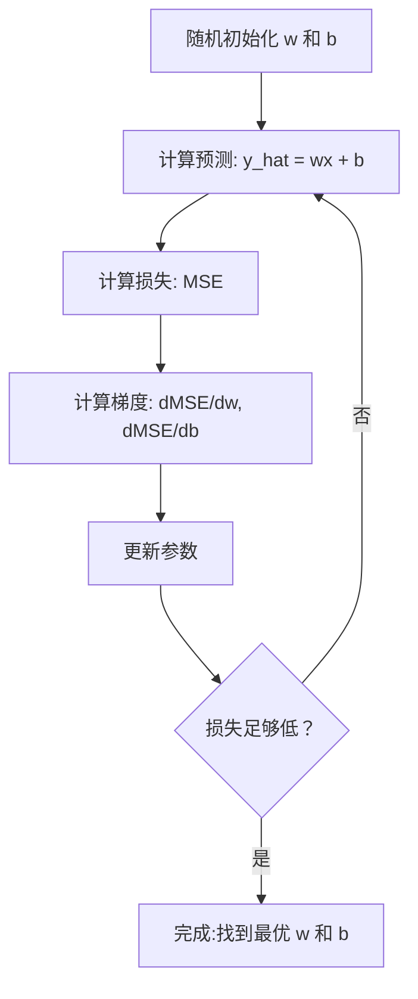

# 线性回归

> 线性回归通过数据拟合出一条最佳直线。它是机器学习的"hello world"。

**类型：** 构建
**语言：** Python
**前置条件：** 第一阶段（线性代数、 calculus、优化）、第二阶段第 1 课
**时间：** 约 90 分钟

## 学习目标

- 推导均方误差的梯度下降更新规则，从零实现线性回归
- 从计算复杂度和适用场景两个角度，比较梯度下降与正规方程
- 构建带有特征标准化的多元线性回归模型，并解释学习到的权重
- 解释岭回归（L2 正则化）如何通过惩罚大权重来防止过拟合

## 问题

你有一些数据：房屋面积和它们的售价。你想根据面积预测一个新房屋的价格。在散点图上你可以目测，但需要一个公式。你需要一条最拟合数据的直线，这样就可以输入任意面积得到价格预测。

线性回归给了你这条直线。更重要的是，它引入了完整的 ML 训练循环：定义模型、定义损失函数、优化参数。每个 ML 算法都遵循同样的模式。先在最简单的情况下掌握它，你就能在任何地方认出它。

这不仅仅适用于简单问题。线性回归在生产系统中用于需求预测、A/B 测试分析、金融建模，以及作为每个回归任务的基线。

## 概念

### 模型

线性回归假设输入（x）和输出（y）之间存在线性关系：

```
y = wx + b
```

- `w`（权重/斜率）：x 增加 1 时 y 变化多少
- `b`（偏置/截距）：x = 0 时 y 的值

对于多个输入（特征），这扩展为：

```
y = w1*x1 + w2*x2 + ... + wn*xn + b
```

或向量形式：`y = w^T * x + b`

目标：找到 w 和 b 的值，使预测的 y 与所有训练样本的实际 y 尽可能接近。

### 损失函数（均方误差）

如何衡量"尽可能接近"？你需要用一个数字来概括预测的错误程度。最常见的选择是均方误差（MSE）：

```
MSE = (1/n) * sum((y_predicted - y_actual)^2)
```

为什么是平方？有两个原因。第一，它对大误差的惩罚比小误差更重（10 的误差比 1 的误差糟糕100 倍，而不是 10 倍）。第二，平方函数处处光滑可导，这使得优化 straightforward。

损失函数创建一个曲面。对于单个权重 w 和偏置 b，MSE 曲面看起来像一个碗（凸抛物面）。碗底是 MSE 最小化的地方。训练就是找到那个底部。

### 梯度下降

梯度下降通过下山步来找到碗底。



梯度告诉你两件事：每个参数向哪个方向移动，以及移动多少。

对于 y_hat = wx + b 的 MSE：

```
dMSE/dw = (2/n) * sum((y_hat - y) * x)
dMSE/db = (2/n) * sum(y_hat - y)
```

更新规则：

```
w = w - learning_rate * dMSE/dw
b = b - learning_rate * dMSE/db
```

学习率控制步长。太大会：越过最小值导致发散。太小的训练时间太长。典型初始值：0.01、0.001 或 0.0001。

### 正规方程（闭式解）

对于线性回归，有一个直接公式可以给出最优权重，无需任何迭代：

```
w = (X^T * X)^(-1) * X^T * y
```

这通过对一个矩阵求逆来一步求解 w。对于小数据集效果很好。对于大数据集（数百万行或数千个特征），首选梯度下降，因为矩阵求逆在特征数量上是 O(n^3)。

### 多元线性回归

对于多个特征，模型变为：

```
y = w1*x1 + w2*x2 + ... + wn*xn + b
```

一切运作方式相同：MSE 是损失函数，梯度下降同时更新所有权重。唯一的区别是你拟合的是一个超平面而不是一条直线。

特征缩放在这里很重要。如果一个特征范围是 0 到 1，另一个范围是 0 到 1,000,000，梯度下降会受到影响，因为损失曲面变得拉长。训练前对特征进行标准化（减去均值，除以标准差）。

### 多项式回归

如果关系不是线性的怎么办？你仍然可以通过创建多项式特征来使用线性回归：

```
y = w1*x + w2*x^2 + w3*x^3 + b
```

这仍然是"线性"回归，因为模型在权重（w1, w2, w3）是线性的。你只是使用了 x 的非线性特征。

更高阶的多项式可以拟合更复杂的曲线，但有过拟合的风险。10 阶多项式会穿过10 点数据集中的每个点，但在新数据上预测很差。

### R 方得分

MSE告诉你错了多少，但数字依赖于 y 的规模。R 方（R^2）给出了一个与规模无关的度量：

```
R^2 = 1 - (残差平方和) / (离均值平方和)
    = 1 - SS_res / SS_tot
```

- R^2 = 1.0：完美预测
- R^2 = 0.0：模型并不比每次预测均值好
- R^2 < 0.0：模型比预测均值更差

### 正则化预览（岭回归）

当你有许多特征时，模型可以通过分配大权重来过拟合。岭回归（L2 正则化）添加一个惩罚项：

```
Cost = MSE + lambda * sum(w_i^2)
```

惩罚项阻止大权重。超参数 lambda 控制权衡：lambda 越高意味着权重越小、正则化越强。这在后续课程中会深入讲解。现在只需要知道它的存在和它为什么有帮助。

## 构建

### 第 1 步：生成样本数据

```python
import random
import math

random.seed(42)

TRUE_W = 3.0
TRUE_B = 7.0
N_SAMPLES = 100

X = [random.uniform(0, 10) for _ in range(N_SAMPLES)]
y = [TRUE_W * x + TRUE_B + random.gauss(0, 2.0) for x in X]

print(f"生成了 {N_SAMPLES} 个样本")
print(f"真实关系: y = {TRUE_W}x + {TRUE_B} (+噪声)")
print(f"前 5 个点: {[(round(X[i], 2), round(y[i], 2)) for i in range(5)]}")
```

### 第 2 步：从零实现带梯度下降的线性回归

```python
class LinearRegression:
    def __init__(self, learning_rate=0.01):
        self.w = 0.0
        self.b = 0.0
        self.lr = learning_rate
        self.cost_history = []

    def predict(self, X):
        return [self.w * x + self.b for x in X]

    def compute_cost(self, X, y):
        predictions = self.predict(X)
        n = len(y)
        cost = sum((pred - actual) ** 2 for pred, actual in zip(predictions, y)) / n
        return cost

    def compute_gradients(self, X, y):
        predictions = self.predict(X)
        n = len(y)
        dw = (2 / n) * sum((pred - actual) * x for pred, actual, x in zip(predictions, y, X))
        db = (2 / n) * sum(pred - actual for pred, actual in zip(predictions, y))
        return dw, db

    def fit(self, X, y, epochs=1000, print_every=200):
        for epoch in range(epochs):
            dw, db = self.compute_gradients(X, y)
            self.w -= self.lr * dw
            self.b -= self.lr * db
            cost = self.compute_cost(X, y)
            self.cost_history.append(cost)
            if epoch % print_every == 0:
                print(f"  Epoch {epoch:4d} | Cost: {cost:.4f} | w: {self.w:.4f} | b: {self.b:.4f}")
        return self

    def r_squared(self, X, y):
        predictions = self.predict(X)
        y_mean = sum(y) / len(y)
        ss_res = sum((actual - pred) ** 2 for actual, pred in zip(y, predictions))
        ss_tot = sum((actual - y_mean) ** 2 for actual in y)
        return 1 - (ss_res / ss_tot)


print("=== 训练线性回归（梯度下降）===")
model = LinearRegression(learning_rate=0.005)
model.fit(X, y, epochs=1000, print_every=200)
print(f"\n学习结果: y = {model.w:.4f}x + {model.b:.4f}")
print(f"真实值:    y = {TRUE_W}x + {TRUE_B}")
print(f"R 方: {model.r_squared(X, y):.4f}")
```

### 第 3 步：正规方程（闭式解）

```python
class LinearRegressionNormal:
    def __init__(self):
        self.w = 0.0
        self.b = 0.0

    def fit(self, X, y):
        n = len(X)
        x_mean = sum(X) / n
        y_mean = sum(y) / n
        numerator = sum((X[i] - x_mean) * (y[i] - y_mean) for i in range(n))
        denominator = sum((X[i] - x_mean) ** 2 for i in range(n))
        self.w = numerator / denominator
        self.b = y_mean - self.w * x_mean
        return self

    def predict(self, X):
        return [self.w * x + self.b for x in X]

    def r_squared(self, X, y):
        predictions = self.predict(X)
        y_mean = sum(y) / len(y)
        ss_res = sum((actual - pred) ** 2 for actual, pred in zip(y, predictions))
        ss_tot = sum((actual - y_mean) ** 2 for actual in y)
        return 1 - (ss_res / ss_tot)


print("\n=== 正规方程（闭式解）===")
model_normal = LinearRegressionNormal()
model_normal.fit(X, y)
print(f"学习结果: y = {model_normal.w:.4f}x + {model_normal.b:.4f}")
print(f"R 方: {model_normal.r_squared(X, y):.4f}")
```

### 第 4 步：多元线性回归

```python
class MultipleLinearRegression:
    def __init__(self, n_features, learning_rate=0.01):
        self.weights = [0.0] * n_features
        self.bias = 0.0
        self.lr = learning_rate
        self.cost_history = []

    def predict_single(self, x):
        return sum(w * xi for w, xi in zip(self.weights, x)) + self.bias

    def predict(self, X):
        return [self.predict_single(x) for x in X]

    def compute_cost(self, X, y):
        predictions = self.predict(X)
        n = len(y)
        return sum((pred - actual) ** 2 for pred, actual in zip(predictions, y)) / n

    def fit(self, X, y, epochs=1000, print_every=200):
        n = len(y)
        n_features = len(X[0])
        for epoch in range(epochs):
            predictions = self.predict(X)
            errors = [pred - actual for pred, actual in zip(predictions, y)]
            for j in range(n_features):
                grad = (2 / n) * sum(errors[i] * X[i][j] for i in range(n))
                self.weights[j] -= self.lr * grad
            grad_b = (2 / n) * sum(errors)
            self.bias -= self.lr * grad_b
            cost = self.compute_cost(X, y)
            self.cost_history.append(cost)
            if epoch % print_every == 0:
                print(f"  Epoch {epoch:4d} | Cost: {cost:.4f}")
        return self

    def r_squared(self, X, y):
        predictions = self.predict(X)
        y_mean = sum(y) / len(y)
        ss_res = sum((actual - pred) ** 2 for actual, pred in zip(y, predictions))
        ss_tot = sum((actual - y_mean) ** 2 for actual in y)
        return 1 - (ss_res / ss_tot)


random.seed(42)
N = 100
X_multi = []
y_multi = []
for _ in range(N):
    size = random.uniform(500, 3000)
    bedrooms = random.randint(1, 5)
    age = random.uniform(0, 50)
    price = 50 * size + 10000 * bedrooms - 1000 * age + 50000 + random.gauss(0, 20000)
    X_multi.append([size, bedrooms, age])
    y_multi.append(price)


def standardize(X):
    n_features = len(X[0])
    means = [sum(X[i][j] for i in range(len(X))) / len(X) for j in range(n_features)]
    stds = []
    for j in range(n_features):
        variance = sum((X[i][j] - means[j]) ** 2 for i in range(len(X))) / len(X)
        stds.append(variance ** 0.5)
    X_scaled = []
    for i in range(len(X)):
        row = [(X[i][j] - means[j]) / stds[j] if stds[j] > 0 else 0 for j in range(n_features)]
        X_scaled.append(row)
    return X_scaled, means, stds


y_mean_val = sum(y_multi) / len(y_multi)
y_std_val = (sum((yi - y_mean_val) ** 2 for yi in y_multi) / len(y_multi)) ** 0.5
y_scaled = [(yi - y_mean_val) / y_std_val for yi in y_multi]

X_scaled, x_means, x_stds = standardize(X_multi)

print("\n=== 多元线性回归（3 个特征）===")
print("特征: 房屋面积、卧室数量、房龄")
multi_model = MultipleLinearRegression(n_features=3, learning_rate=0.01)
multi_model.fit(X_scaled, y_scaled, epochs=1000, print_every=200)

print(f"\n权重（标准化后）: {[round(w, 4) for w in multi_model.weights]}")
print(f"偏置（标准化后）: {multi_model.bias:.4f}")
print(f"R 方: {multi_model.r_squared(X_scaled, y_scaled):.4f}")
```

### 第 5 步：多项式回归

```python
class PolynomialRegression:
    def __init__(self, degree, learning_rate=0.01):
        self.degree = degree
        self.weights = [0.0] * degree
        self.bias = 0.0
        self.lr = learning_rate

    def make_features(self, X):
        return [[x ** (d + 1) for d in range(self.degree)] for x in X]

    def predict(self, X):
        features = self.make_features(X)
        return [sum(w * f for w, f in zip(self.weights, row)) + self.bias for row in features]

    def fit(self, X, y, epochs=1000, print_every=200):
        features = self.make_features(X)
        n = len(y)
        for epoch in range(epochs):
            predictions = [sum(w * f for w, f in zip(self.weights, row)) + self.bias for row in features]
            errors = [pred - actual for pred, actual in zip(predictions, y)]
            for j in range(self.degree):
                grad = (2 / n) * sum(errors[i] * features[i][j] for i in range(n))
                self.weights[j] -= self.lr * grad
            grad_b = (2 / n) * sum(errors)
            self.bias -= self.lr * grad_b
            if epoch % print_every == 0:
                cost = sum(e ** 2 for e in errors) / n
                print(f"  Epoch {epoch:4d} | Cost: {cost:.6f}")
        return self

    def r_squared(self, X, y):
        predictions = self.predict(X)
        y_mean = sum(y) / len(y)
        ss_res = sum((actual - pred) ** 2 for actual, pred in zip(y, predictions))
        ss_tot = sum((actual - y_mean) ** 2 for actual in y)
        return 1 - (ss_res / ss_tot)


random.seed(42)
X_poly = [x / 10.0 for x in range(0, 50)]
y_poly = [0.5 * x ** 2 - 2 * x + 3 + random.gauss(0, 1.0) for x in X_poly]

x_max = max(abs(x) for x in X_poly)
X_poly_norm = [x / x_max for x in X_poly]
y_poly_mean = sum(y_poly) / len(y_poly)
y_poly_std = (sum((yi - y_poly_mean) ** 2 for yi in y_poly) / len(y_poly)) ** 0.5
y_poly_norm = [(yi - y_poly_mean) / y_poly_std for yi in y_poly]

print("\n=== 多项式回归（2 阶 vs 5 阶）===")
print("真实关系: y = 0.5x^2 - 2x + 3")

print("\n2 阶:")
poly2 = PolynomialRegression(degree=2, learning_rate=0.1)
poly2.fit(X_poly_norm, y_poly_norm, epochs=2000, print_every=500)
print(f"  R 方: {poly2.r_squared(X_poly_norm, y_poly_norm):.4f}")

print("\n5 阶:")
poly5 = PolynomialRegression(degree=5, learning_rate=0.1)
poly5.fit(X_poly_norm, y_poly_norm, epochs=2000, print_every=500)
print(f"  R 方: {poly5.r_squared(X_poly_norm, y_poly_norm):.4f}")

print("\n2 阶很好地拟合了真实曲线。5 阶在训练数据上拟合稍好")
print("但在新数据上有过拟合风险。")
```

### 第 6 步：岭回归（L2 正则化）

```python
class RidgeRegression:
    def __init__(self, n_features, learning_rate=0.01, alpha=1.0):
        self.weights = [0.0] * n_features
        self.bias = 0.0
        self.lr = learning_rate
        self.alpha = alpha

    def predict_single(self, x):
        return sum(w * xi for w, xi in zip(self.weights, x)) + self.bias

    def predict(self, X):
        return [self.predict_single(x) for x in X]

    def fit(self, X, y, epochs=1000, print_every=200):
        n = len(y)
        n_features = len(X[0])
        for epoch in range(epochs):
            predictions = self.predict(X)
            errors = [pred - actual for pred, actual in zip(predictions, y)]
            mse = sum(e ** 2 for e in errors) / n
            reg_term = self.alpha * sum(w ** 2 for w in self.weights)
            cost = mse + reg_term
            for j in range(n_features):
                grad = (2 / n) * sum(errors[i] * X[i][j] for i in range(n))
                grad += 2 * self.alpha * self.weights[j]
                self.weights[j] -= self.lr * grad
            grad_b = (2 / n) * sum(errors)
            self.bias -= self.lr * grad_b
            if epoch % print_every == 0:
                print(f"  Epoch {epoch:4d} | Cost: {cost:.4f} | L2惩罚项: {reg_term:.4f}")
        return self


print("\n=== 岭回归（L2 正则化）===")
print("数据与多元回归相同，alpha=0.1")
ridge = RidgeRegression(n_features=3, learning_rate=0.01, alpha=0.1)
ridge.fit(X_scaled, y_scaled, epochs=1000, print_every=200)
print(f"\n岭回归权重: {[round(w, 4) for w in ridge.weights]}")
print(f"普通权重: {[round(w, 4) for w in multi_model.weights]}")
print("岭回归权重更小（向零收缩），这是 L2 惩罚项的作用。")
```

## 使用

现在用 scikit-learn 实现同样的功能，这才是生产中实际使用的。

```python
from sklearn.linear_model import LinearRegression as SklearnLR
from sklearn.linear_model import Ridge
from sklearn.preprocessing import PolynomialFeatures, StandardScaler
from sklearn.model_selection import train_test_split
from sklearn.metrics import mean_squared_error, r2_score
import numpy as np

np.random.seed(42)
X_sk = np.random.uniform(0, 10, (100, 1))
y_sk = 3.0 * X_sk.squeeze() + 7.0 + np.random.normal(0, 2.0, 100)

X_train, X_test, y_train, y_test = train_test_split(X_sk, y_sk, test_size=0.2, random_state=42)

lr = SklearnLR()
lr.fit(X_train, y_train)
y_pred = lr.predict(X_test)

print("=== Scikit-learn 线性回归 ===")
print(f"系数 (w): {lr.coef_[0]:.4f}")
print(f"截距 (b): {lr.intercept_:.4f}")
print(f"R 方（测试集）: {r2_score(y_test, y_pred):.4f}")
print(f"MSE（测试集）: {mean_squared_error(y_test, y_pred):.4f}")

poly = PolynomialFeatures(degree=2, include_bias=False)
X_poly_sk = poly.fit_transform(X_train)
X_poly_test = poly.transform(X_test)

lr_poly = SklearnLR()
lr_poly.fit(X_poly_sk, y_train)
print(f"\n2 阶多项式 R 方: {r2_score(y_test, lr_poly.predict(X_poly_test)):.4f}")

scaler = StandardScaler()
X_train_scaled = scaler.fit_transform(X_train)
X_test_scaled = scaler.transform(X_test)

ridge = Ridge(alpha=1.0)
ridge.fit(X_train_scaled, y_train)
print(f"岭回归 R 方: {r2_score(y_test, ridge.predict(X_test_scaled)):.4f}")
print(f"岭回归系数: {ridge.coef_[0]:.4f}")
```

从零实现和 scikit-learn 产生相同的结果。区别在于：scikit-learn 处理边界情况、数值稳定性和性能优化。生产用库，从零实现用于理解原理。

## 交付

本课产出：
- `outputs/skill-regression.md` —— 根据问题选择正确回归方法的技能

## 练习

1. 实现批量梯度下降、随机梯度下降（SGD）和小批量梯度下降。在同一数据集上比较收敛速度。哪个收敛最快？哪个的损失曲线最平滑？

2. 从三次函数生成数据（y = ax^3 + bx^2 + cx + d + 噪声）。拟合 1 阶、3 阶和 10 阶多项式。比较训练 R^2 和测试 R^2。在什么阶数时过拟合变得明显？

3. 实现 Lasso 回归（L1 正则化：惩罚项 = alpha * sum(|w_i|)）。在多特征房价数据上训练。比较哪些权重变为零与岭回归的差异。为什么 L1 产生稀疏解而 L2 不是？

## 关键术语

| 术语 | 大家怎么说的 | 实际含义 |
|------|----------------|----------------------|
| 线性回归 | "画一条穿过数据的直线" | 找到使 wx+b 与实际 y 值之间平方差之和最小的权重 w 和偏置 b |
| 损失函数 | "模型有多差" | 将模型参数映射到衡量预测误差的单一一数字的函数，优化过程使其最小化 |
| 均方误差 | "误差平方的平均值" | (1/n) * sum of (predicted - actual)^2，对大误差的惩罚不成比例 |
| 梯度下降 | "走下山" | 使用偏导数迭代调整参数，使损失函数值沿下降方向变化 |
| 学习率 | "步长" | 控制每次梯度下降步骤中参数变化量的标量 |
| 正规方程 | "直接求解" |闭式解 w = (X^T X)^-1 X^T y，无需迭代即可给出最优权重 |
| R 方 | "拟合有多好" | 模型解释的 y 方差比例，范围从负无穷到 1.0 |
| 特征缩放 | "让特征可比" | 将特征变换到相似范围（例如零均值、单位方差），使梯度下降收敛更快 |
| 正则化 | "惩罚复杂性" | 在损失函数中添加一项来收缩权重，防止过拟合 |
| 岭回归 | "L2 正则化" |线性回归加上 MSE + lambda * sum(w_i^2) 惩罚项 |
| 多项式回归 | "用线性数学拟合曲线" | 在多项式特征（x, x^2, x^3, ...）上的线性回归，在权重上仍是线性的 |
| 过拟合 | "记忆训练数据" | 使用过于复杂的模型拟合训练数据中的噪声，在新数据上失败 |

## 延伸阅读

- [统计学习导论（ISLR）](https://www.statlearning.com/) —— 免费 PDF，第 3 和第 6 章涵盖线性回归和正则化，带有实用的 R 示例
- [统计学习要素（ESL）](https://hastie.su.domains/ElemStatLearn/) —— 免费 PDF，比 ISLR 更数学化的配套书籍，对岭回归和 Lasso 有更深层次的处理
- [斯坦福 CS229 线性回归讲义](https://cs229.stanford.edu/main_notes.pdf) —— Andrew Ng 的笔记，从第一性原理推导正规方程和梯度下降
- [scikit-learn 线性回归文档](https://scikit-learn.org/stable/modules/linear_model.html) —— LinearRegression、Ridge、Lasso 和 ElasticNet 的实用参考，带有代码示例