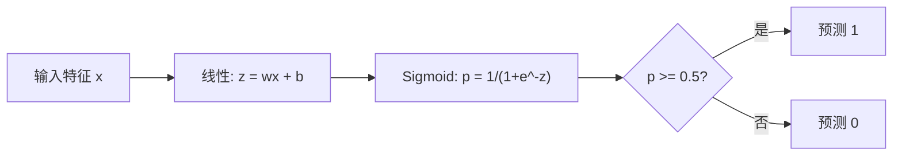

# 逻辑回归

> 逻辑回归将一条直线弯成 S 曲线，用概率来回答是非问题。

**类型：** 实战型
**语言：** Python
**前置条件：** 阶段 2 第 1-2 课（什么是机器学习、线性回归）
**时间：** 约 90 分钟

## 学习目标

- 从零实现逻辑回归，使用 sigmoid 函数和二元交叉熵损失
- 计算并解释二元分类的精确率、召回率、F1 分数和混淆矩阵
- 解释为什么 MSE 对分类任务失效，以及为什么二元交叉熵能产生凸损失面
- 构建 Softmax 回归模型用于多分类，并评估阈值调整的权衡

## 问题

你想根据肿瘤大小来预测它是恶性还是良性。你尝试用线性回归。它输出 0.3、1.7 或 -0.5 这样的数字。这些是什么意思？1.7 是"很恶性"吗？-0.5 是"很良性"吗？线性回归输出的是无界数值。分类需要的是 0 到 1 之间的有界概率，以及一个明确的决策：是或否。

逻辑回归解决了这个问题。它取相同的线性组合（wx + b），然后通过 sigmoid 函数，把任意数值压缩到 (0, 1) 区间。输出是一个概率。你设定一个阈值（通常是 0.5），然后做出决策。

这是实际应用中最广泛使用的算法之一。尽管名字里带着"回归"，逻辑回归其实是一个分类算法，而不是回归算法。这个名字来源于它所使用的 logistic（S 形）函数。

## 概念

### 为什么线性回归不适用于分类

想象根据学习小时数来预测通过/不通过（1/0）。线性回归在数据上拟合一条直线：

```
小时数:   1   2   3   4   5   6   7   8   9   10
实际值:   0   0   0   0   1   1   1   1   1   1
```

线性拟合可能在第 1 小时产生 -0.2 的预测，在第 10 小时产生 1.3 的预测。这些值不是概率，它们低于 0 或高于 1。更糟糕的是，一个离群点（某个学了 50 小时的人）会拉动整条直线，改变所有人的预测。

分类需要一个函数，它能：
- 输出 0 到 1 之间的值（概率）
- 创建一个急剧的转变（决策边界）
- 不被远离边界的离群点扭曲

### Sigmoid 函数

Sigmoid 函数正好能做到这一点：

```
sigmoid(z) = 1 / (1 + e^(-z))
```

性质：
- 当 z 为大正数时，sigmoid(z) 趋近于 1
- 当 z 为大负数时，sigmoid(z) 趋近于 0
- 当 z = 0 时，sigmoid(z) = 0.5
- 输出始终在 0 和 1 之间
- 函数处处光滑可导

导数有一个简洁的形式：sigmoid'(z) = sigmoid(z) * (1 - sigmoid(z))。这使得梯度计算非常高效。

### 逻辑回归 = 线性模型 + Sigmoid

模型计算 z = wx + b（与线性回归相同），然后应用 sigmoid：



输出 p 被解释为 P(y=1 | x)，即输入属于类别 1 的概率。决策边界是 wx + b = 0 的位置，此时 sigmoid 输出恰好为 0.5。

### 二元交叉熵损失

你不能对逻辑回归使用 MSE。MSE 配合 sigmoid 会产生非凸损失面，存在许多局部最小值。应该使用二元交叉熵（对数损失）：

```
损失 = -(1/n) * sum(y * log(p) + (1-y) * log(1-p))
```

为什么这样有效：
- 当 y=1 且 p 接近 1 时：log(1) = 0，所以损失接近 0（正确，低成本）
- 当 y=1 且 p 接近 0 时：log(0) 趋近负无穷，所以损失巨大（错误，高成本）
- 当 y=0 且 p 接近 0 时：log(1) = 0，所以损失接近 0（正确，低成本）
- 当 y=0 且 p 接近 1 时：log(0) 趋近负无穷，所以损失巨大（错误，高成本）

对于逻辑回归，这个损失函数是凸的，保证有唯一的全局最小值。

### 逻辑回归的梯度下降

二元交叉熵配合 sigmoid 的梯度有一个简洁的形式：

```
dL/dw = (1/n) * sum((p - y) * x)
dL/db = (1/n) * sum(p - y)
```

这些公式看起来与线性回归的梯度完全相同。区别在于 p = sigmoid(wx + b) 而不是 p = wx + b。Sigmoid 引入了非线性，但梯度更新规则保持不变。

```mermaid
flowchart TD
    A[初始化 w=0, b=0] --> B[前向传播: z = wx+b, p = sigmoid z]
    B --> C[计算损失: 二元交叉熵]
    C --> D["计算梯度: dw = (1/n) * sum((p-y)*x)"]
    D --> E[更新: w = w - lr*dw, b = b - lr*db]
    E --> F{收敛了吗？]
    F -->|否| B
    F -->|是| G[模型训练完成]
```

### 决策边界

对于二维输入（两个特征），决策边界是以下方程对应的直线：

```
w1*x1 + w2*x2 + b = 0
```

一侧的点被归类为 1，另一侧的为 0。逻辑回归始终产生线性决策边界。如果你需要曲线边界，可以添加多项式特征或使用非线性模型。

### 使用 Softmax 的多分类

二元逻辑回归处理两个类别。对于 k 个类别，使用 softmax 函数：

```
softmax(z_i) = e^(z_i) / sum(e^(z_j) for all j)
```

每个类别都有自己的权重向量。模型为每个类别计算一个分数 z_i，然后 softmax 将分数转换为概率，所有概率之和为 1。预测的类别是概率最高的那个。

损失函数变为分类交叉熵：

```
损失 = -(1/n) * sum(sum(y_k * log(p_k)))
```

其中 y_k 在真实类别处为 1，其他地方为 0（独热编码）。

### 评估指标

仅看准确率是不够的。对于一个 95% 负类、5% 正类的数据集，一个总是预测负类的模型可以得到 95% 的准确率，但它毫无用处。

**混淆矩阵**：

| | 预测为正类 | 预测为负类 |
|---|---|---|
| 实际为正类 | 真阳性 (TP) | 假阴性 (FN) |
| 实际为负类 | 假阳性 (FP) | 真阴性 (TN) |

**精确率**：在所有预测为正类的样本中，实际为正类的有多少？
```
精确率 = TP / (TP + FP)
```

**召回率**（灵敏度）：在所有实际为正类的样本中，我们捕获了多少？
```
召回率 = TP / (TP + FN)
```

**F1 分数**：精确率和召回率的调和平均。平衡两个指标。
```
F1 = 2 * (精确率 * 召回率) / (精确率 + 召回率)
```

何时优先考虑：
- **精确率**：当假阳性成本高昂时（垃圾邮件过滤器，你不想拦截正常邮件）
- **召回率**：当假阴性成本高昂时（癌症筛查，你不想漏掉肿瘤）
- **F1**：当你需要一个单一的平衡指标时

## 动手实现

### 第 1 步：Sigmoid 函数与数据生成

```python
import random
import math

def sigmoid(z):
    z = max(-500, min(500, z))
    return 1.0 / (1.0 + math.exp(-z))


random.seed(42)
N = 200
X = []
y = []

for _ in range(N // 2):
    X.append([random.gauss(2, 1), random.gauss(2, 1)])
    y.append(0)

for _ in range(N // 2):
    X.append([random.gauss(5, 1), random.gauss(5, 1)])
    y.append(1)

combined = list(zip(X, y))
random.shuffle(combined)
X, y = zip(*combined)
X = list(X)
y = list(y)

print(f"生成了 {N} 个样本（2 个类别，2 个特征）")
print(f"类别 0 中心: (2, 2), 类别 1 中心: (5, 5)")
print(f"前 5 个样本：")
for i in range(5):
    print(f"  特征: [{X[i][0]:.2f}, {X[i][1]:.2f}], 标签: {y[i]}")
```

### 第 2 步：从零实现逻辑回归

```python
class LogisticRegression:
    def __init__(self, n_features, learning_rate=0.01):
        self.weights = [0.0] * n_features
        self.bias = 0.0
        self.lr = learning_rate
        self.loss_history = []

    def predict_proba(self, x):
        z = sum(w * xi for w, xi in zip(self.weights, x)) + self.bias
        return sigmoid(z)

    def predict(self, x, threshold=0.5):
        return 1 if self.predict_proba(x) >= threshold else 0

    def compute_loss(self, X, y):
        n = len(y)
        total = 0.0
        for i in range(n):
            p = self.predict_proba(X[i])
            p = max(1e-15, min(1 - 1e-15, p))
            total += y[i] * math.log(p) + (1 - y[i]) * math.log(1 - p)
        return -total / n

    def fit(self, X, y, epochs=1000, print_every=200):
        n = len(y)
        n_features = len(X[0])
        for epoch in range(epochs):
            dw = [0.0] * n_features
            db = 0.0
            for i in range(n):
                p = self.predict_proba(X[i])
                error = p - y[i]
                for j in range(n_features):
                    dw[j] += error * X[i][j]
                db += error
            for j in range(n_features):
                self.weights[j] -= self.lr * (dw[j] / n)
            self.bias -= self.lr * (db / n)
            loss = self.compute_loss(X, y)
            self.loss_history.append(loss)
            if epoch % print_every == 0:
                print(f"  轮次 {epoch:4d} | 损失: {loss:.4f} | w: [{self.weights[0]:.3f}, {self.weights[1]:.3f}] | b: {self.bias:.3f}")
        return self

    def accuracy(self, X, y):
        correct = sum(1 for i in range(len(y)) if self.predict(X[i]) == y[i])
        return correct / len(y)


split = int(0.8 * N)
X_train, X_test = X[:split], X[split:]
y_train, y_test = y[:split], y[split:]

print("\n=== 训练逻辑回归 ===")
model = LogisticRegression(n_features=2, learning_rate=0.1)
model.fit(X_train, y_train, epochs=1000, print_every=200)

print(f"\n训练集准确率: {model.accuracy(X_train, y_train):.4f}")
print(f"测试集准确率:  {model.accuracy(X_test, y_test):.4f}")
print(f"权重: [{model.weights[0]:.4f}, {model.weights[1]:.4f}]")
print(f"偏置: {model.bias:.4f}")
```

### 第 3 步：从零实现混淆矩阵与指标

```python
class ClassificationMetrics:
    def __init__(self, y_true, y_pred):
        self.tp = sum(1 for t, p in zip(y_true, y_pred) if t == 1 and p == 1)
        self.tn = sum(1 for t, p in zip(y_true, y_pred) if t == 0 and p == 0)
        self.fp = sum(1 for t, p in zip(y_true, y_pred) if t == 0 and p == 1)
        self.fn = sum(1 for t, p in zip(y_true, y_pred) if t == 1 and p == 0)

    def accuracy(self):
        total = self.tp + self.tn + self.fp + self.fn
        return (self.tp + self.tn) / total if total > 0 else 0

    def precision(self):
        denom = self.tp + self.fp
        return self.tp / denom if denom > 0 else 0

    def recall(self):
        denom = self.tp + self.fn
        return self.tp / denom if denom > 0 else 0

    def f1(self):
        p = self.precision()
        r = self.recall()
        return 2 * p * r / (p + r) if (p + r) > 0 else 0

    def print_confusion_matrix(self):
        print(f"\n  混淆矩阵：")
        print(f"                  预测")
        print(f"                  正   负")
        print(f"  实际 正       {self.tp:4d}  {self.fn:4d}")
        print(f"  实际 负       {self.fp:4d}  {self.tn:4d}")

    def print_report(self):
        self.print_confusion_matrix()
        print(f"\n  准确率:  {self.accuracy():.4f}")
        print(f"  精确率: {self.precision():.4f}")
        print(f"  召回率:    {self.recall():.4f}")
        print(f"  F1 分数:  {self.f1():.4f}")


y_pred_test = [model.predict(x) for x in X_test]
print("\n=== 分类报告（测试集）===")
metrics = ClassificationMetrics(y_test, y_pred_test)
metrics.print_report()
```

### 第 4 步：决策边界分析

```python
print("\n=== 决策边界 ===")
w1, w2 = model.weights
b = model.bias
print(f"决策边界: {w1:.4f}*x1 + {w2:.4f}*x2 + {b:.4f} = 0")
if abs(w2) > 1e-10:
    print(f"解出 x2:     x2 = {-w1/w2:.4f}*x1 + {-b/w2:.4f}")

print("\n边界附近的样本预测：")
test_points = [
    [3.0, 3.0],
    [3.5, 3.5],
    [4.0, 4.0],
    [2.5, 2.5],
    [5.0, 5.0],
]
for point in test_points:
    prob = model.predict_proba(point)
    pred = model.predict(point)
    print(f"  [{point[0]}, {point[1]}] -> prob={prob:.4f}, class={pred}")
```

### Step 5: Multi-class with softmax

```python
class SoftmaxRegression:
    def __init__(self, n_features, n_classes, learning_rate=0.01):
        self.n_features = n_features
        self.n_classes = n_classes
        self.lr = learning_rate
        self.weights = [[0.0] * n_features for _ in range(n_classes)]
        self.biases = [0.0] * n_classes

    def softmax(self, scores):
        max_score = max(scores)
        exp_scores = [math.exp(s - max_score) for s in scores]
        total = sum(exp_scores)
        return [e / total for e in exp_scores]

    def predict_proba(self, x):
        scores = [
            sum(self.weights[k][j] * x[j] for j in range(self.n_features)) + self.biases[k]
            for k in range(self.n_classes)
        ]
        return self.softmax(scores)

    def predict(self, x):
        probs = self.predict_proba(x)
        return probs.index(max(probs))

    def fit(self, X, y, epochs=1000, print_every=200):
        n = len(y)
        for epoch in range(epochs):
            grad_w = [[0.0] * self.n_features for _ in range(self.n_classes)]
            grad_b = [0.0] * self.n_classes
            total_loss = 0.0
            for i in range(n):
                probs = self.predict_proba(X[i])
                for k in range(self.n_classes):
                    target = 1.0 if y[i] == k else 0.0
                    error = probs[k] - target
                    for j in range(self.n_features):
                        grad_w[k][j] += error * X[i][j]
                    grad_b[k] += error
                true_prob = max(probs[y[i]], 1e-15)
                total_loss -= math.log(true_prob)
            for k in range(self.n_classes):
                for j in range(self.n_features):
                    self.weights[k][j] -= self.lr * (grad_w[k][j] / n)
                self.biases[k] -= self.lr * (grad_b[k] / n)
            if epoch % print_every == 0:
                print(f"  Epoch {epoch:4d} | Loss: {total_loss / n:.4f}")
        return self

    def accuracy(self, X, y):
        correct = sum(1 for i in range(len(y)) if self.predict(X[i]) == y[i])
        return correct / len(y)


random.seed(42)
X_3class = []
y_3class = []

centers = [(1, 1), (5, 1), (3, 5)]
for label, (cx, cy) in enumerate(centers):
    for _ in range(50):
        X_3class.append([random.gauss(cx, 0.8), random.gauss(cy, 0.8)])
        y_3class.append(label)

combined = list(zip(X_3class, y_3class))
random.shuffle(combined)
X_3class, y_3class = zip(*combined)
X_3class = list(X_3class)
y_3class = list(y_3class)

split_3 = int(0.8 * len(X_3class))
X_train_3 = X_3class[:split_3]
y_train_3 = y_3class[:split_3]
X_test_3 = X_3class[split_3:]
y_test_3 = y_3class[split_3:]

print("\n=== Multi-class Softmax Regression (3 classes) ===")
softmax_model = SoftmaxRegression(n_features=2, n_classes=3, learning_rate=0.1)
softmax_model.fit(X_train_3, y_train_3, epochs=1000, print_every=200)
print(f"\nTrain accuracy: {softmax_model.accuracy(X_train_3, y_train_3):.4f}")
print(f"Test accuracy:  {softmax_model.accuracy(X_test_3, y_test_3):.4f}")

print("\nSample predictions:")
for i in range(5):
    probs = softmax_model.predict_proba(X_test_3[i])
    pred = softmax_model.predict(X_test_3[i])
    print(f"  True: {y_test_3[i]}, Predicted: {pred}, Probs: [{', '.join(f'{p:.3f}' for p in probs)}]")
```

### Step 6: Threshold tuning

```python
print("\n=== Threshold Tuning ===")
print("Default threshold: 0.5. Adjusting the threshold trades precision for recall.\n")

thresholds = [0.3, 0.4, 0.5, 0.6, 0.7]
print(f"{'Threshold':>10} {'Accuracy':>10} {'Precision':>10} {'Recall':>10} {'F1':>10}")
print("-" * 52)

for t in thresholds:
    y_pred_t = [1 if model.predict_proba(x) >= t else 0 for x in X_test]
    m = ClassificationMetrics(y_test, y_pred_t)
    print(f"{t:>10.1f} {m.accuracy():>10.4f} {m.precision():>10.4f} {m.recall():>10.4f} {m.f1():>10.4f}")
```

## Use It

Now the same thing with scikit-learn.

```python
from sklearn.linear_model import LogisticRegression as SklearnLR
from sklearn.metrics import accuracy_score, precision_score, recall_score, f1_score
from sklearn.metrics import confusion_matrix, classification_report
from sklearn.model_selection import train_test_split
from sklearn.preprocessing import StandardScaler
import numpy as np

np.random.seed(42)
X_0 = np.random.randn(100, 2) + [2, 2]
X_1 = np.random.randn(100, 2) + [5, 5]
X_sk = np.vstack([X_0, X_1])
y_sk = np.array([0] * 100 + [1] * 100)

X_tr, X_te, y_tr, y_te = train_test_split(X_sk, y_sk, test_size=0.2, random_state=42)

scaler = StandardScaler()
X_tr_sc = scaler.fit_transform(X_tr)
X_te_sc = scaler.transform(X_te)

lr = SklearnLR()
lr.fit(X_tr_sc, y_tr)
y_pred = lr.predict(X_te_sc)

print("=== Scikit-learn Logistic Regression ===")
print(f"Accuracy:  {accuracy_score(y_te, y_pred):.4f}")
print(f"Precision: {precision_score(y_te, y_pred):.4f}")
print(f"Recall:    {recall_score(y_te, y_pred):.4f}")
print(f"F1:        {f1_score(y_te, y_pred):.4f}")
print(f"\nConfusion Matrix:\n{confusion_matrix(y_te, y_pred)}")
print(f"\nClassification Report:\n{classification_report(y_te, y_pred)}")
```

Your from-scratch implementation produces the same decision boundary and metrics. Scikit-learn adds solver options (liblinear, lbfgs, saga), automatic regularization, multi-class strategies (one-vs-rest, multinomial), and numerical stability optimizations.

## Ship It

This lesson produces:
- `code/logistic_regression.py` - logistic regression from scratch with metrics

## Exercises

1. Generate a dataset that is NOT linearly separable (e.g., two concentric circles). Train logistic regression and observe its failure. Then add polynomial features (x1^2, x2^2, x1*x2) and train again. Show that the accuracy improves.
2. Implement a multi-class confusion matrix for the 3-class softmax model. Compute per-class precision and recall. Which class is hardest to classify?
3. Build an ROC curve from scratch. For 100 threshold values from 0 to 1, compute the true positive rate and false positive rate. Calculate the AUC (area under the curve) using the trapezoidal rule.

## Key Terms

| Term | What people say | What it actually means |
|------|----------------|----------------------|
| Logistic regression | "Regression for classification" | A linear model followed by a sigmoid function that outputs class probabilities |
| Sigmoid function | "The S-curve" | The function 1/(1+e^(-z)) that maps any real number to the range (0, 1) |
| Binary cross-entropy | "Log loss" | The loss function -[y*log(p) + (1-y)*log(1-p)] that penalizes confident wrong predictions severely |
| Decision boundary | "The dividing line" | The surface where the model's output probability equals 0.5, separating predicted classes |
| Softmax | "Multi-class sigmoid" | A function that converts a vector of scores into probabilities that sum to 1 |
| Precision | "How many selected are relevant" | TP / (TP + FP), the fraction of positive predictions that are actually positive |
| Recall | "How many relevant are selected" | TP / (TP + FN), the fraction of actual positives that the model correctly identifies |
| F1 score | "Balanced accuracy" | The harmonic mean of precision and recall: 2*P*R / (P+R) |
| Confusion matrix | "The error breakdown" | A table showing TP, TN, FP, FN counts for each class pair |
| Threshold | "The cutoff" | The probability value above which the model predicts class 1 (default 0.5, tunable) |
| One-hot encoding | "Binary columns for categories" | Representing class k as a vector of zeros with a 1 at position k |
| Categorical cross-entropy | "Multi-class log loss" | The extension of binary cross-entropy to k classes using one-hot encoded labels |
