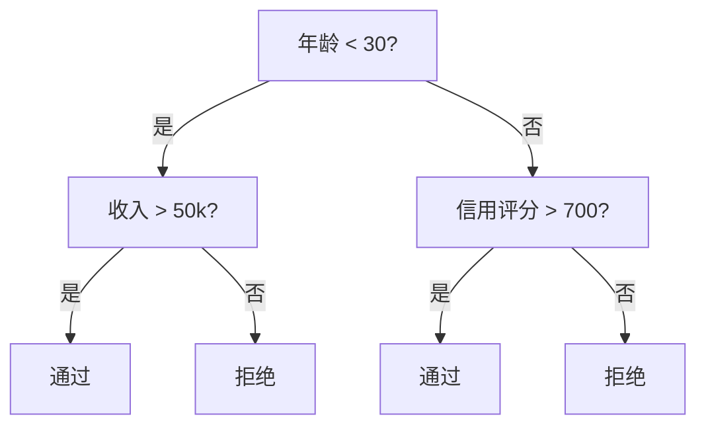
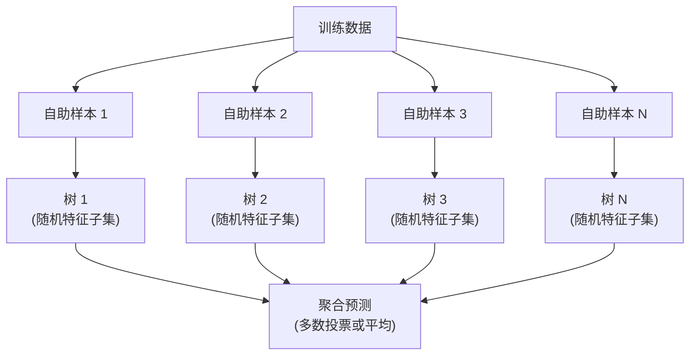

# 决策树与随机森林

> 决策树就是一张流程图。但一片森林，却是 ML 中最强大的工具之一。

**类型：** 动手构建
**语言：** Python
**前置条件：** 阶段 1（第 09 课 信息论、第 06 课 概率）
**时间：** 约 90 分钟

## 学习目标

- 实现基尼不纯度、信息熵与信息增益的计算，用以寻找最优的决策树分裂点
- 从零构建一个支持预剪枝控制（最大深度、最小样本数）的决策树分类器
- 使用自助采样与特征随机化构建随机森林，并解释其为何能降低方差
- 比较 MDI 特征重要性与排列重要性，并识别 MDI 在何时存在偏差

## 问题

你有一些表格数据。行是样本，列是特征，还有一列你希望预测的目标。你也可以用神经网络。但对于表格数据，基于树的方法（决策树、随机森林、梯度提升树）始终优于深度学习。Kaggle 上结构化数据的竞赛被 XGBoost 和 LightGBM 主导，而非 Transformer。

为什么？树模型能原生处理混合特征类型（数值型与类别型），无需预处理。它们能处理非线性关系而无需特征工程。它们可解释性强：你可以查看树的结构，准确了解每个预测是如何做出的。而随机森林对多棵树取平均，在中等规模数据集上高度抗过拟合。

本节课从零开始用递归分裂构建决策树，然后在之上构建随机森林。你将实现分裂准则背后的数学（基尼不纯度、信息熵、信息增益），并理解弱学习器的集成如何变成强学习器。

## 概念

### 决策树做什么

决策树通过一系列是非问答，将特征空间划分成矩形区域。



每个内部节点对一个特征与阈值进行比较。每个叶节点做出一个预测。要分类一个新数据点，你从根节点开始，沿着分支一直走到叶节点。

树是自顶向下构建的：在每个节点上，选择能将数据最好分离的特征和阈值。"最好"由分裂准则来定义。

### 分裂准则：度量不纯度

在每个节点上，我们有一组样本。我们希望将它们分裂，使得子节点尽可能"纯"，即每个子节点主要包含某一类样本。

**基尼不纯度**度量的是：如果一个随机选择的样本按照该节点的类别分布被标注，它被误分类的概率。

```
Gini(S) = 1 - sum(p_k^2)

其中 p_k 是集合 S 中类别 k 的比例。
```

对于纯节点（只有一类），基尼值 = 0。对于 50/50 的二分类分裂，基尼值 = 0.5。越低越好。

```
示例：6 只猫，4 只狗

Gini = 1 - (0.6^2 + 0.4^2) = 1 - (0.36 + 0.16) = 0.48
```

**熵**度量一个节点中的信息含量（混乱程度）。详见阶段 1 第 09 课。

```
Entropy(S) = -sum(p_k * log2(p_k))
```

对于纯节点，熵 = 0。对于 50/50 的二分类分裂，熵 = 1.0。越低越好。

```
示例：6 只猫，4 只狗

Entropy = -(0.6 * log2(0.6) + 0.4 * log2(0.4))
        = -(0.6 * -0.737 + 0.4 * -1.322)
        = 0.442 + 0.529
        = 0.971 bits
```

**信息增益**是分裂后不纯度（熵或基尼）的减少量。

```
IG(S, feature, threshold) = Impurity(S) - weighted_avg(Impurity(S_left), Impurity(S_right))

其中权重是每个子节点中的样本比例。
```

每个节点的贪心算法：尝试每个特征和每个可能的阈值。选择信息增益最大的（特征，阈值）组合。

### 分裂如何工作

对于当前节点上 n 个特征和 m 个样本的数据集：

1. 对每个特征 j（j = 1 到 n）：
   - 按特征 j 对样本排序
   - 尝试每对相邻不同值之间的中点作为阈值
   - 计算每个阈值的信息增益
2. 选择信息增益最高的特征和阈值
3. 将数据分裂为左（特征 <= 阈值）和右（特征 > 阈值）
4. 递归处理每个子节点

这种贪心方法不能保证得到全局最优的树。寻找最优树是 NP 难问题。但贪心分裂在实践中效果很好。

### 停止条件

没有停止条件的话，树会一直生长直到每个叶节点都是纯的（每个叶一个样本）。这会完美记住训练数据，但泛化能力极差。

**预剪枝**在树完全生长之前就停止它：
- 最大深度：当树达到设定深度时停止分裂
- 叶节点最小样本数：当节点样本数少于 k 时停止
- 最小信息增益：当最佳分裂带来的不纯度改善小于阈值时停止
- 最大叶节点数：限制叶节点总数

**后剪枝**先让树完全生长，然后修剪：
- 代价复杂度剪枝（scikit-learn 所用）：加入与叶节点数量成正比的惩罚。增大惩罚得到更小的树
- 误差降低剪枝：如果移除一个子树不导致验证误差上升，则移除它

预剪枝更简单快速。后剪枝通常产生更好的树，因为它不会过早停止可能产生有用后续分裂的分裂。

### 用于回归的决策树

对于回归，叶节点的预测是该叶中目标值的均值。分裂准则也要改变：

**方差缩减**取代了信息增益：

```
VR(S, feature, threshold) = Var(S) - weighted_avg(Var(S_left), Var(S_right))
```

选择方差缩减最大的分裂。树将输入空间划分为多个区域，并在每个区域预测一个常数（均值）。

### 随机森林：集成的力量

单棵决策树是高方差的。数据的微小变化可能产生完全不同的树。随机森林通过对多棵树取平均来解决这个问题。



两种随机性来源使树具有多样性：

**Bagging（自助聚合）：** 每棵树在自助样本上训练，即从训练数据中有放回地随机抽样。每个自助样本约包含原样本的 63%（其余是袋外样本，可用于验证）。

**特征随机化：** 在每个分裂点，只考虑一个随机特征子集。对于分类，默认是 sqrt(n_features)。对于回归，是 n_features/3。这防止所有树都在同一个主导特征上分裂。

关键洞察：平均多个不相关的树可以降低方差而不增加偏差。每棵单独的树可能表现一般。但集成之后就很强大。

### 特征重要性

随机森林天然提供特征重要性分数。最常用的方法是：

**平均不纯度减少（MDI）：** 对于每个特征，累加所有树和所有使用该特征的所有节点上的不纯度总减少量。在较早分裂点产生更大不纯度减少的特征更重要。

```
importance(feature_j) = 对所有使用 feature_j 的节点求和：
    (n_samples_at_node / n_total_samples) * impurity_decrease
```

这很快（在训练时计算），但对高基数特征和有更多可能分裂点的特征有偏差。

**排列重要性**是另一种方法：打乱一个特征的值，测量模型准确率下降了多少。更可靠但更慢。

### 何时树模型优于神经网络

在表格数据上，树和森林主导神经网络。原因如下：

| 因素 | 树模型 | 神经网络 |
|--------|-------|----------------|
| 混合类型（数值 + 类别） | 原生支持 | 需要编码 |
| 小数据集（< 1 万行） | 效果好 | 容易过拟合 |
| 特征交互 | 通过分裂发现 | 需要架构设计 |
| 可解释性 | 完全透明 | 黑箱 |
| 训练时间 | 分钟级 | 小时级 |
| 超参数敏感性 | 低 | 高 |

当数据具有空间或序列结构（图像、文本、音频）时，神经网络胜出。对于扁平的表格特征，树模型是默认选择。

## 动手构建

### 第 1 步：基尼不纯度与熵

从零构建两种分裂准则，并验证它们对好的分裂意见一致。

```python
import math

def gini_impurity(labels):
    n = len(labels)
    if n == 0:
        return 0.0
    counts = {}
    for label in labels:
        counts[label] = counts.get(label, 0) + 1
    return 1.0 - sum((c / n) ** 2 for c in counts.values())

def entropy(labels):
    n = len(labels)
    if n == 0:
        return 0.0
    counts = {}
    for label in labels:
        counts[label] = counts.get(label, 0) + 1
    return -sum(
        (c / n) * math.log2(c / n) for c in counts.values() if c > 0
    )
```

### 第 2 步：找到最佳分裂

尝试每个特征和每个阈值。返回信息增益最高的那个。

```python
def information_gain(parent_labels, left_labels, right_labels, criterion="gini"):
    measure = gini_impurity if criterion == "gini" else entropy
    n = len(parent_labels)
    n_left = len(left_labels)
    n_right = len(right_labels)
    if n_left == 0 or n_right == 0:
        return 0.0
    parent_impurity = measure(parent_labels)
    child_impurity = (
        (n_left / n) * measure(left_labels) +
        (n_right / n) * measure(right_labels)
    )
    return parent_impurity - child_impurity
```

### 第 3 步：构建 DecisionTree 类

递归分裂、预测与特征重要性跟踪。

```python
class DecisionTree:
    def __init__(self, max_depth=None, min_samples_split=2,
                 min_samples_leaf=1, criterion="gini",
                 max_features=None):
        self.max_depth = max_depth
        self.min_samples_split = min_samples_split
        self.min_samples_leaf = min_samples_leaf
        self.criterion = criterion
        self.max_features = max_features
        self.tree = None
        self.feature_importances_ = None

    def fit(self, X, y):
        self.n_features = len(X[0])
        self.feature_importances_ = [0.0] * self.n_features
        self.n_samples = len(X)
        self.tree = self._build(X, y, depth=0)
        total = sum(self.feature_importances_)
        if total > 0:
            self.feature_importances_ = [
                fi / total for fi in self.feature_importances_
            ]

    def predict(self, X):
        return [self._predict_one(x, self.tree) for x in X]
```

### 第 4 步：构建 RandomForest 类

自助采样、特征随机化与多数投票。

```python
class RandomForest:
    def __init__(self, n_trees=100, max_depth=None,
                 min_samples_split=2, max_features="sqrt",
                 criterion="gini"):
        self.n_trees = n_trees
        self.max_depth = max_depth
        self.min_samples_split = min_samples_split
        self.max_features = max_features
        self.criterion = criterion
        self.trees = []

    def fit(self, X, y):
        n = len(X)
        for _ in range(self.n_trees):
            indices = [random.randint(0, n - 1) for _ in range(n)]
            X_boot = [X[i] for i in indices]
            y_boot = [y[i] for i in indices]
            tree = DecisionTree(
                max_depth=self.max_depth,
                min_samples_split=self.min_samples_split,
                max_features=self.max_features,
                criterion=self.criterion,
            )
            tree.fit(X_boot, y_boot)
            self.trees.append(tree)

    def predict(self, X):
        all_preds = [tree.predict(X) for tree in self.trees]
        predictions = []
        for i in range(len(X)):
            votes = {}
            for preds in all_preds:
                v = preds[i]
                votes[v] = votes.get(v, 0) + 1
            predictions.append(max(votes, key=votes.get))
        return predictions
```

完整实现及所有辅助方法见 `code/trees.py`。

## 实际使用

用 scikit-learn，训练一个随机森林只需三行代码：

```python
from sklearn.ensemble import RandomForestClassifier
from sklearn.datasets import load_iris
from sklearn.model_selection import train_test_split

X, y = load_iris(return_X_y=True)
X_train, X_test, y_train, y_test = train_test_split(X, y, random_state=42)

rf = RandomForestClassifier(n_estimators=100, random_state=42)
rf.fit(X_train, y_train)
print(f"准确率: {rf.score(X_test, y_test):.4f}")
print(f"特征重要性: {rf.feature_importances_}")
```

实践中，梯度提升树（XGBoost、LightGBM、CatBoost）通常比随机森林更强，因为它们顺序地构建树，每棵树纠正前序树的错误。但随机森林更难配置错，也几乎不需要调超参数。

## 交付物

本课产出 `outputs/prompt-tree-interpreter.md`—— 一个用于向业务利益相关者解释决策树分裂的提示词。输入一个训练好树的结构（深度、特征、分裂阈值、准确率），它会将模型翻译成通俗易懂的规则，排序特征重要性，标记过拟合或数据泄露，并推荐后续步骤。每当需要向不懂代码的人解释基于树的模型时，都可以使用它。

## 练习

1. 在一个 2D 数据集上训练单棵决策树（3 类）。手动跟踪分裂过程并画出矩形决策边界。比较 max_depth=2 与 max_depth=10 时的边界。
2. 实现用于回归树的方差缩减分裂。生成 y = sin(x) + noise 的 200 个点，拟合你的回归树。绘制树的分段常数预测与真实曲线的对比图。
3. 构建包含 1、5、10、50 和 200 棵树的随机森林。绘制训练准确率和测试准确率随树数量变化的曲线。观察测试准确率会趋于平稳但不会下降（森林抗过拟合）。
4. 在 5 个不同数据集上比较基尼不纯度与熵作为分裂准则。测量准确率和树的深度。大多数情况下，它们产生几乎相同的结果。解释原因。
5. 实现排列重要性。在一个特征是随机噪声但具有高基数的数据集上，将其与 MDI 重要性进行比较。MDI 会给噪声特征很高的排名。排列重要性则不会。

## 关键术语

| 术语 | 大家怎么说的 | 实际含义 |
|------|----------------|----------------------|
| 决策树 | "预测的流程图" | 一种通过学习一系列 if/else 分裂来将特征空间划分为矩形区域的模型 |
| 基尼不纯度 | "节点有多混合" | 在一个节点上误分类随机样本的概率。0 = 纯，0.5 = 二分类时的最大不纯度 |
| 熵 | "节点的混乱程度" | 一个节点的信息含量。0 = 纯，1.0 = 二分类时的最大不确定性。来源于信息论 |
| 信息增益 | "分裂有多好" | 分裂后不纯度的减少。用于选择分裂的贪心准则 |
| 预剪枝 | "尽早停止树" | 通过设置最大深度、最小样本数或最小增益阈值来提前停止树生长 |
| 后剪枝 | "之后修剪树" | 先让树完全生长，然后删除不能提升验证性能的子树 |
| Bagging | "在随机子集上训练" | 自助聚合。在不同有放回随机样本上训练每个模型 |
| 随机森林 | "一堆树" | 决策树的集成，每棵树在自助样本上训练，并在每个分裂点使用随机特征子集 |
| 特征重要性（MDI） | "哪些特征重要" | 每个特征贡献的总不纯度减少，累加跨所有树和所有节点 |
| 排列重要性 | "打乱并检查" | 当一个特征的值被随机打乱时准确率的下降。对有噪声的特征比 MDI 更可靠 |
| 方差缩减 | "回归版的信息增益" | 信息增益在回归树中的类比。选择使目标方差减少最多的分裂 |
| 自助样本 | "有重复的随机样本" | 从原始数据集有放回地随机抽取的样本。大小相同，但包含重复 |

## 延伸阅读

- [Breiman: Random Forests (2001)](https://link.springer.com/article/10.1023/A:1010933404324) - 随机森林的原始论文
- [Grinsztajn et al.: Why do tree-based models still outperform deep learning on tabular data? (2022)](https://arxiv.org/abs/2207.08815) - 树模型与神经网络在表格任务上比较的严谨研究
- [scikit-learn Decision Trees 文档](https://scikit-learn.org/stable/modules/tree.html) - 含可视化工具的实用指南
- [XGBoost: A Scalable Tree Boosting System (Chen & Guestrin, 2016)](https://arxiv.org/abs/1603.02754) - 在 Kaggle 上占据主导地位的梯度提升论文
