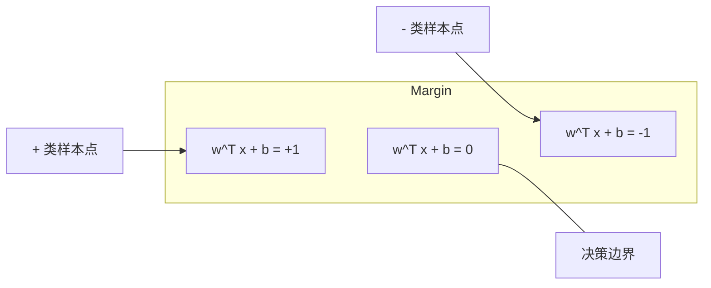
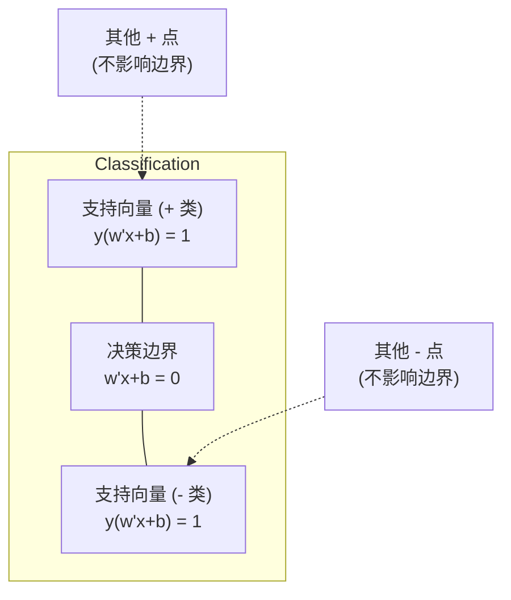
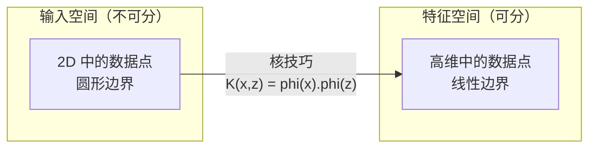

# 支持向量机

> 在两类之间找到最宽的街道。这就是全部思想。

**类型：** 动手构建
**语言：** Python
**前置条件：** 阶段 1（第 08 课 优化、第 14 课 范数与距离、第 18 课 凸优化）
**时间：** 约 90 分钟

## 学习目标

- 使用合页损失和对偶 formulation（原问题）的梯度下降从零实现线性 SVM
- 解释最大间隔原则，从训练好的模型中识别支持向量
- 比较线性核、多项式核和 RBF 核，解释核技巧如何避免显式的高维映射
- 评估由 C 参数控制的间隔宽度与分类错误之间的权衡

## 问题

你有两类数据点，需要画一条线（或超平面）将它们分开。可以做到的分隔线有无数条。你应该选哪一条？

选间隔最大的那条。间隔是决策边界与每侧最近数据点之间的距离。间隔越宽，分类器越有信心，对未见数据的泛化能力越好。

这一直觉引出了支持向量机——ML 中数学上最优雅的算法之一。在深度学习之前，SVM 是主导的分类方法，至今仍然是小型数据集、高维数据以及需要原则性、可解释且有理论保证的模型场景下的最佳选择。

SVM 与阶段 1 直接相连：优化问题是凸的（第 18 课），间隔用范数来度量（第 14 课），核技巧利用点积来处理非线性边界，而无需在高维空间中计算。

## 概念

### 最大间隔分类器

给定标签 y_i ∈ {-1, +1} 和特征向量 x_i 的线性可分数据，我们想要一个分离两类的超平面 w^T x + b = 0。

点到超平面的距离为：

```
distance = |w^T x_i + b| / ||w||
```

对于正确分类的点：y_i * (w^T x_i + b) > 0。间隔是超平面到两侧最近点距离的两倍。



优化问题：

```
maximize    2 / ||w||     （间隔宽度）
subject to  y_i * (w^T x_i + b) >= 1  对所有 i
```

等价地（最小化 ||w||^2 更易于优化）：

```
minimize    (1/2) ||w||^2
subject to  y_i * (w^T x_i + b) >= 1  对所有 i
```

这是一个凸二次规划。它有唯一的全局解。恰好落在间隔边界上的数据点（满足 y_i * (w^T x_i + b) = 1）是支持向量。它们是唯一决定决策边界的点。移动或移除任何非支持向量点，边界都不会改变。

### 支持向量：关键少数



大多数训练点是无关的。只有支持向量重要。这就是为什么 SVM 在预测时是内存高效的：你只需要存储支持向量，而不需要存储整个训练集。

支持向量的数量也对泛化误差给出了一个界。相对于数据集大小，支持向量越少，泛化效果越好。

### 软间隔：用 C 参数处理噪声

真实数据很少完全可分。有些点可能位于边界的错误一侧，或者在间隔内部。软间隔 formulation 通过引入松弛变量来允许违规。

```
minimize    (1/2) ||w||^2 + C * sum(xi_i)
subject to  y_i * (w^T x_i + b) >= 1 - xi_i
            xi_i >= 0  对所有 i
```

松弛变量 xi_i 衡量点 i 对间隔的违反程度。C 控制权衡：

| C 值 | 行为 |
|---------|----------|
| C 大 | 严重惩罚违规。窄间隔，少误分类。过拟合 |
| C 小 | 允许更多违规。宽间隔，更多误分类。欠拟合 |

C 是正则化强度的倒数。C 大 = 正则化少。C 小 = 正则化多。

### 合页损失：SVM 的损失函数

软间隔 SVM 可以重写为无约束优化：

```
minimize    (1/2) ||w||^2 + C * sum(max(0, 1 - y_i * (w^T x_i + b)))
```

项 max(0, 1 - y_i * f(x_i)) 就是合页损失。当点被正确分类且在间隔之外时为零。当点在间隔内部或被误分类时，是线性的。

```
单个点的合页损失：

loss
  |
  | \
  |  \
  |   \
  |    \
  |     \_______________
  |
  +-----|-----|-------->  y * f(x)
       0     1

当 y*f(x) >= 1 时损失为零（正确分类，在间隔外）。
当 y*f(x) < 1 时线性惩罚。
```

与 logistic 回归的 logistic 损失比较：

```
合页:     max(0, 1 - y*f(x))          在间隔处有硬截止
Logistic:  log(1 + exp(-y*f(x)))        平滑，永远不会恰好为零
```

合页损失产生稀疏解（只有支持向量的贡献非零）。Logistic 损失使用所有数据点。这使得 SVM 在预测时更节省内存。

### 用梯度下降训练线性 SVM

你可以通过对合页损失加上 L2 正则化使用梯度下降来训练线性 SVM，而不需要求解约束 QP：

```
L(w, b) = (lambda/2) * ||w||^2 + (1/n) * sum(max(0, 1 - y_i * (w^T x_i + b)))

对 w 的梯度：
  若 y_i * (w^T x_i + b) >= 1:  dL/dw = lambda * w
  若 y_i * (w^T x_i + b) < 1:   dL/dw = lambda * w - y_i * x_i

对 b 的梯度：
  若 y_i * (w^T x_i + b) >= 1:  dL/db = 0
  若 y_i * (w^T x_i + b) < 1:   dL/db = -y_i
```

这叫做原问题 formulation。每次迭代 O(n * d)，n 是样本数，d 是特征数。对于大型稀疏高维数据（文本分类），这很快。

### 对偶 formulation 与核技巧

SVM 问题的拉格朗日对偶（来自阶段 1 第 18 课，KKT 条件）为：

```
maximize    sum(alpha_i) - (1/2) * sum_ij(alpha_i * alpha_j * y_i * y_j * (x_i . x_j))
subject to  0 <= alpha_i <= C
            sum(alpha_i * y_i) = 0
```

对偶问题只涉及数据点之间的点积 x_i . x_j。这是关键洞察。用核函数 K(x_i, x_j) 替换每个点积，SVM 就能学习非线性边界，而无需显式计算变换。

```
线性核:      K(x, z) = x . z
多项式核:  K(x, z) = (x . z + c)^d
RBF (高斯):     K(x, z) = exp(-gamma * ||x - z||^2)
```

RBF 核将数据映射到无限维空间。在输入空间中相近的点核值接近 1。相距较远的点核值接近 0。它可以学习任意平滑的决策边界。



核技巧在高维空间中计算点积，却从未真正去那里。对于 D 维中 d 次多项式核，显式特征空间有 O(D^d) 维。但 K(x, z) 在 O(D) 时间内就能计算。

### 用于回归的 SVM（SVR）

支持向量回归在数据周围拟合一个宽度为 epsilon 的管道。管道内的点损失为零。管道外的点按线性惩罚。

```
minimize    (1/2) ||w||^2 + C * sum(xi_i + xi_i*)
subject to  y_i - (w^T x_i + b) <= epsilon + xi_i
            (w^T x_i + b) - y_i <= epsilon + xi_i*
            xi_i, xi_i* >= 0
```

epsilon 参数控制管道宽度。更宽的管道 = 更少的支持向量 = 更平滑的拟合。更窄的管道 = 更多的支持向量 = 更紧密的拟合。

### 为什么 SVM 输给了深度学习（以及何时它仍然胜出）

SVM 从 1990 年代末到 2010 年代初主导了 ML。深度学习在多个方面超越了它：

| 因素 | SVM | 深度学习 |
|--------|------|---------------|
| 特征工程 | 需要手动做 | 自动学习特征 |
| 可扩展性 | 核函数 O(n^2) 到 O(n^3) | SGD 每次迭代 O(n) |
| 图像/文本/音频 | 需要手工特征 | 从原始数据学习 |
| 大数据集（> 10 万） | 速度慢 | 扩展性好 |
| GPU 加速 | 受益有限 | 巨大加速 |

SVM 在以下场景仍然胜出：
- 小数据集（数百到低数千样本）
- 高维稀疏数据（TF-IDF 特征的文本）
- 需要数学保证时（间隔界）
- 训练时间必须极短时（线性 SVM 很快）
- 有清晰间隔结构的二分类
- 异常检测（单类 SVM）

## 动手构建

### 第 1 步：合页损失与梯度

基础：计算一批样本的合页损失及其梯度。

```python
def hinge_loss(X, y, w, b):
    n = len(X)
    total_loss = 0.0
    for i in range(n):
        margin = y[i] * (dot(w, X[i]) + b)
        total_loss += max(0.0, 1.0 - margin)
    return total_loss / n
```

### 第 2 步：通过梯度下降的线性 SVM

通过最小化正则化合页损失来训练。无需 QP 求解器。

```python
class LinearSVM:
    def __init__(self, lr=0.001, lambda_param=0.01, n_epochs=1000):
        self.lr = lr
        self.lambda_param = lambda_param
        self.n_epochs = n_epochs
        self.w = None
        self.b = 0.0

    def fit(self, X, y):
        n_features = len(X[0])
        self.w = [0.0] * n_features
        self.b = 0.0

        for epoch in range(self.n_epochs):
            for i in range(len(X)):
                margin = y[i] * (dot(self.w, X[i]) + self.b)
                if margin >= 1:
                    self.w = [wj - self.lr * self.lambda_param * wj
                              for j, wj in enumerate(self.w)]
                else:
                    self.w = [wj - self.lr * (self.lambda_param * wj - y[i] * X[i][j])
                              for j, wj in enumerate(self.w)]
                    self.b -= self.lr * (-y[i])

    def predict(self, X):
        return [1 if dot(self.w, x) + self.b >= 0 else -1 for x in X]
```

### 第 3 步：核函数

实现线性、多项式和 RBF 核。

```python
def linear_kernel(x, z):
    return dot(x, z)

def polynomial_kernel(x, z, degree=3, c=1.0):
    return (dot(x, z) + c) ** degree

def rbf_kernel(x, z, gamma=0.5):
    diff = [xi - zi for xi, zi in zip(x, z)]
    return math.exp(-gamma * dot(diff, diff))
```

### 第 4 步：间隔与支持向量识别

训练后，识别哪些点是支持向量，并计算间隔宽度。

```python
def find_support_vectors(X, y, w, b, tol=1e-3):
    support_vectors = []
    for i in range(len(X)):
        margin = y[i] * (dot(w, X[i]) + b)
        if abs(margin - 1.0) < tol:
            support_vectors.append(i)
    return support_vectors
```

完整实现及所有演示见 `code/svm.py`。

## 实际使用

用 scikit-learn：

```python
from sklearn.svm import SVC, LinearSVC, SVR
from sklearn.preprocessing import StandardScaler
from sklearn.pipeline import Pipeline

clf = Pipeline([
    ("scaler", StandardScaler()),
    ("svm", SVC(kernel="rbf", C=1.0, gamma="scale")),
])
clf.fit(X_train, y_train)
print(f"准确率: {clf.score(X_test, y_test):.4f}")
print(f"支持向量数: {clf['svm'].n_support_}")
```

重要提示：训练 SVM 前始终要缩放特征。SVM 对特征量级敏感，因为间隔取决于 ||w||，未缩放的特征会扭曲几何。

对于大型数据集，用 `LinearSVC`（原问题 formulation，每次迭代 O(n)）而不是 `SVC`（对偶 formulation，O(n^2) 到 O(n^3)）：

```python
from sklearn.svm import LinearSVC

clf = Pipeline([
    ("scaler", StandardScaler()),
    ("svm", LinearSVC(C=1.0, max_iter=10000)),
])
```

## 练习

1. 生成一个 2D 线性可分数据集。训练你的 LinearSVM 并识别支持向量。验证支持向量就是距离决策边界最近的点。
2. 在一个有噪声的数据集上将 C 从 0.001 变到 1000。为每个 C 值绘制决策边界。观察从宽间隔（欠拟合）到窄间隔（过拟合）的转变。
3. 创建一个类别边界是圆形（非线性）的数据集。证明线性 SVM 会失败。计算 RBF 核矩阵，并展示在核诱导的特征空间中两类变得可分。
4. 在同一数据集上比较合页损失与 logistic 损失。训练一个线性 SVM 和 logistic 回归。计算每个模型的决策边界各用了多少训练点（支持向量对比所有点）。
5. 实现 SVR（epsilon 不敏感损失）。拟合 y = sin(x) + noise。绘制 epsilon 管道围绕预测的图，并高亮支持向量（管道外的点）。

## 关键术语

| 术语 | 实际含义 |
|------|----------------------|
| 支持向量 | 距离决策边界最近的训练点。唯一决定超平面的点 |
| 间隔 | 决策边界到最近支持向量之间的距离。SVM 最大化这个值 |
| 合页损失 | max(0, 1 - y*f(x))。正确分类且在间隔外时为零，否则为线性惩罚 |
| C 参数 | 间隔宽度与分类错误之间的权衡。C 大 = 窄间隔，C 小 = 宽间隔 |
| 软间隔 | 通过松弛变量允许间隔违规的 SVM formulation。处理不可分数据 |
| 核技巧 | 在高维特征空间中计算点积，却无需显式映射到那个空间 |
| 线性核 | K(x, z) = x . z。等价于标准点积。用于线性可分数据 |
| RBF 核 | K(x, z) = exp(-gamma * \|\|x-z\|\|^2)。映射到无限维。能学习任意平滑边界 |
| 多项式核 | K(x, z) = (x . z + c)^d。映射到多项式组合的特征空间 |
| 对偶 formulation | SVM 问题的重新 formulation，只依赖于数据点之间的点积。使核方法成为可能 |
| SVR | 支持向量回归。在数据周围拟合一个 epsilon 管道。管道内的点损失为零 |
| 松弛变量 | xi_i：衡量一个点对间隔的违反程度。对于正确分类在间隔外的点为零 |
| 最大间隔 | 选择使各类最近点距离最大的超平面的原则 |

## 延伸阅读

- [Vapnik: The Nature of Statistical Learning Theory (1995)](https://link.springer.com/book/10.1007/978-1-4757-3264-1) - SVM 与统计学习理论的奠基性著作
- [Cortes & Vapnik: Support-vector networks (1995)](https://link.springer.com/article/10.1007/BF00994018) - 原始 SVM 论文
- [Platt: Sequential Minimal Optimization (1998)](https://www.microsoft.com/en-us/research/publication/sequential-minimal-optimization-a-fast-algorithm-for-training-support-vector-machines/) - 使 SVM 训练变得实用的 SMO 算法
- [scikit-learn SVM 文档](https://scikit-learn.org/stable/modules/svm.html) - 含实现细节的实用指南
- [LIBSVM: A Library for Support Vector Machines](https://www.csie.ntu.edu.tw/~cjlin/libsvm/) - 大多数 SVM 实现背后的 C++ 库
