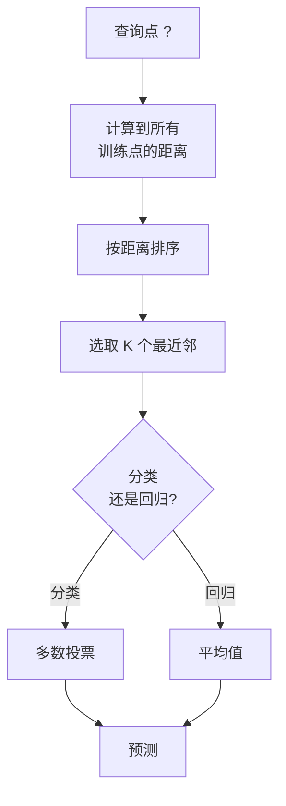
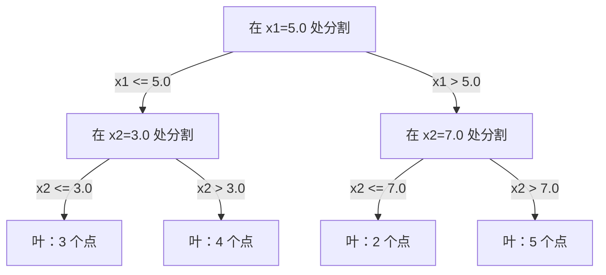

# K 近邻与距离

> 存储一切，通过查看邻居来预测。最简单但真正有效的算法。

**类型：** 构建
**语言：** Python
**前置条件：** 阶段 1（第 14 课 范数与距离）
**时间：** 约 90 分钟

## 学习目标

- 从零实现可配置 K 和距离加权投票的 KNN 分类与回归
- 比较 L1、L2、余弦和 Minkowski 距离度量，根据数据类型选择合适的度量
- 解释维度灾难，并展示为什么 KNN 在高维空间中性能下降
- 构建 KD 树以实现高效的最近邻搜索，分析其何时优于暴力搜索

## 问题

你有一个数据集。一个新的数据点到达。你需要分类它或预测它的值。与其从数据中学习参数（如线性回归或 SVM），不如直接找到与新点最接近的 K 个训练点，然后让它们投票。

这就是 K 近邻。没有训练阶段。没有要学习的参数。没有损失函数要最小化。你存储整个训练集，在预测时计算距离。

这听起来太简单了，不可能有效。但 KNN 在许多问题上出奇地有竞争力，尤其是中小型数据集，深入理解它能揭示基本概念：距离度量的选择（连接阶段 1 第 14 课）、维度灾难，以及惰性学习与 eager 学习的区别。

KNN 也以不同的名称出现在现代 AI 的各个角落。向量数据库对 embedding 做 KNN 搜索。检索增强生成（RAG）找到 K 个最相似的文档块。推荐系统找到相似的用户或物品。算法是一样的，只是规模和数据结构不同。

## 概念

### KNN 的工作原理

给定一个带标签点的数据集和一个新的查询点：

1. 计算查询点到数据集中每个点的距离
2. 按距离排序
3. 取最接近的 K 个点
4. 分类：K 个邻居多数投票
5. 回归：K 个邻居值的平均（或加权平均）



这就是全部算法。没有拟合。没有梯度下降。没有 epoch。

### 选择 K

K 是唯一的超参数。它控制偏差-方差权衡：

| K | 行为 |
|---|----------|
| K = 1 | 决策边界跟随每个点。训练误差为零。高方差。过拟合 |
| 小 K (3-5) | 对局部结构敏感。可以捕捉复杂边界 |
| 大 K | 更平滑的边界。对噪声更鲁棒。可能欠拟合 |
| K = N | 对每个点预测多数类。最大偏差 |

对于 N 个点的数据集，一个常见的起点是 K = sqrt(N)。二分类时使用奇数 K 以避免平局。


### 距离度量

距离函数定义了"近"的含义。不同的度量产生不同的邻居和不同的预测。

**L2（欧几里得）** 是默认值。直线距离。

```
d(a, b) = sqrt(sum((a_i - b_i)^2))
```

对特征尺度敏感。使用 L2 前务必标准化特征。

**L1（曼哈顿）** 求绝对值之和。比 L2 更鲁棒于离群值，因为它不对差值平方。

```
d(a, b) = sum(|a_i - b_i|)
```

**余弦距离** 测量向量之间的夹角，忽略大小。对于文本和 embedding 数据必不可少。

```
d(a, b) = 1 - (a . b) / (||a|| * ||b||)
```

**Minkowski** 用参数 p 泛化 L1 和 L2。

```
d(a, b) = (sum(|a_i - b_i|^p))^(1/p)

p=1: 曼哈顿
p=2: 欧几里得
p->inf: 切比雪夫（最大绝对差）
```

使用哪种度量取决于数据：

| 数据类型 | 最佳度量 | 原因 |
|-----------|------------|-----|
| 数值特征，尺度相似 | L2（欧几里得） | 默认，适用于空间数据 |
| 数值特征，有离群值 | L1（曼哈顿） | 鲁棒，不会放大较大差异 |
| 文本 embedding | 余弦 | 大小是噪声，方向是含义 |
| 高维稀疏 | 余弦或 L1 | L2 遭受维度灾难 |
| 混合类型 | 自定义距离 | 按特征类型组合度量 |

### 加权 KNN

标准 KNN 对所有 K 个邻居给予相同权重。但距离 0.1 的邻居应该比距离 5.0 的更重要。

**距离加权 KNN** 用距离的倒数对每个邻居加权：

```
weight_i = 1 / (distance_i + epsilon)

分类：加权投票
回归：加权平均 = sum(w_i * y_i) / sum(w_i)
```

epsilon 防止当查询点恰好匹配训练点时除以零。

加权 KNN 对 K 的选择不那么敏感，因为无论 K 多大，远距离邻居的贡献都非常小。

### 维度灾难

KNN 在高维空间中性能下降。这不是一个模糊的担忧，而是一个数学事实。

**问题 1：距离收敛。** 随着维度增加，最大距离与最小距离的比值趋近于 1。所有点到查询点的距离都变得同样"远"。

```
在 d 维中，对于随机均匀点：

d=2:    max_dist / min_dist = 差异很大
d=100:  max_dist / min_dist ~ 1.01
d=1000: max_dist / min_dist ~ 1.001

当所有距离几乎相等时，"最近"毫无意义。
```

**问题 2：体积爆炸。** 为了在数据的固定比例内捕获 K 个邻居，你需要扩展搜索半径以覆盖特征空间的更大比例。在高维中，"邻域"包含了大部分空间。

**问题 3：角落主导。** 在 d 维单位超立方体中，大部分体积集中在角落附近，而不是中心。内接于立方体的球体在 d 增长时只包含体积的极小一部分。

实际后果：KNN 在大约 20-50 个特征以内表现良好。超过这个范围，你需要先做降维（PCA、UMAP、t-SNE）再应用 KNN，或者使用利用数据内在低维结构的基于树的搜索结构。

### KD 树：快速最近邻搜索

暴力 KNN 计算查询点到每个训练点的距离。每个查询 O(n * d)。对于大数据集，这太慢了。

KD 树沿特征轴递归划分空间。在每一层，它按中位数沿一个维度分割。



要找最近邻，遍历树到包含查询点的叶子，然后回溯，仅在可能包含更近点的相邻分区中检查。

平均查询时间：低维下 O(log n)。但 KD 树在高维（d > 20）退化到 O(n)，因为回溯消除的分支越来越少。

### 球树：更适合中等维度

球树将数据划分成嵌套的超球面，而不是轴对齐的盒子。每个节点定义一个包含该子树下所有点的球（圆心 + 半径）。

相对于 KD 树的优点：
- 在中等维度（最高约 50）表现更好
- 处理非轴对齐结构
- 更紧密的边界体积意味着搜索过程中剪掉更多分支

KD 树和球树都是精确算法。对于真正大规模的搜索（数百万个点，数百维），使用近似最近邻方法（HNSW、IVF、乘积量化）。这些在阶段 1 第 14 课中介绍。

### 惰性学习 vs 主动学习

KNN 是惰性学习器：训练时不做功，预测时做所有功。大多数其他算法（线性回归、SVM、神经网络）是主动学习器：训练时做大量计算构建紧凑模型，然后预测很快。

| 方面 | 惰性（KNN） | 主动（SVM，神经网络） |
|--------|------------|------------------------|
| 训练时间 | O(1) 只存储数据 | O(n * epochs) |
| 预测时间 | 每次查询 O(n * d) | O(d) 或 O(参数) |
| 预测时内存 | 存储整个训练集 | 只存储模型参数 |
| 适应新数据 | 即时添加点 | 重新训练模型 |
| 决策边界 | 隐式，动态计算 | 显式，训练后固定 |

惰性学习在以下情况下理想：
- 数据集频繁变化（添加/删除点无需重新训练）
- 你只需要很少的预测查询
- 你想要零训练时间
- 数据集足够小，暴力搜索很快

### 用于回归的 KNN

KNN 回归不是多数投票，而是对 K 个邻居的目标值求平均。

```
prediction = (1/K) * sum(y_i for i in K nearest neighbors)

或带距离加权：
prediction = sum(w_i * y_i) / sum(w_i)
其中 w_i = 1 / distance_i
```

KNN 回归产生分段常数（或加权时分段平滑）的预测。它无法外推到训练数据范围之外。如果训练目标都在 0 到 100 之间，KNN 永远不会预测 200。

## 构建

### 第 1 步：距离函数

实现 L1、L2、余弦和 Minkowski 距离。这些直接连接阶段 1 第 14 课。

```python
import math

def l2_distance(a, b):
    return math.sqrt(sum((ai - bi) ** 2 for ai, bi in zip(a, b)))

def l1_distance(a, b):
    return sum(abs(ai - bi) for ai, bi in zip(a, b))

def cosine_distance(a, b):
    dot_val = sum(ai * bi for ai, bi in zip(a, b))
    norm_a = math.sqrt(sum(ai ** 2 for ai in a))
    norm_b = math.sqrt(sum(bi ** 2 for bi in b))
    if norm_a == 0 or norm_b == 0:
        return 1.0
    return 1.0 - dot_val / (norm_a * norm_b)

def minkowski_distance(a, b, p=2):
    if p == float('inf'):
        return max(abs(ai - bi) for ai, bi in zip(a, b))
    return sum(abs(ai - bi) ** p for ai, bi in zip(a, b)) ** (1 / p)
```

### 第 2 步：KNN 分类器和回归器

构建完整的 KNN，可配置 K、距离度量并可选距离加权。

```python
class KNN:
    def __init__(self, k=5, distance_fn=l2_distance, weighted=False,
                 task="classification"):
        self.k = k
        self.distance_fn = distance_fn
        self.weighted = weighted
        self.task = task
        self.X_train = None
        self.y_train = None

    def fit(self, X, y):
        self.X_train = X
        self.y_train = y

    def predict(self, X):
        return [self._predict_one(x) for x in X]
```

### 第 3 步：用于高效搜索的 KD 树

从零构建 KD 树，递归按每个维度的中位数分割。

```python
class KDTree:
    def __init__(self, X, indices=None, depth=0):
        # 递归划分数据
        self.axis = depth % len(X[0])
        # 按当前轴的中位数分割
        ...

    def query(self, point, k=1):
        # 遍历到叶子，然后回溯
        ...
```

参见 `code/knn.py` 获取包含所有辅助方法和演示的完整实现。

### 第 4 步：特征缩放

KNN 需要特征缩放，因为距离对特征量级敏感。从 0 到 1000 的特征将支配从 0 到 1 的特征。

```python
def standardize(X):
    n = len(X)
    d = len(X[0])
    means = [sum(X[i][j] for i in range(n)) / n for j in range(d)]
    stds = [
        max(1e-10, (sum((X[i][j] - means[j]) ** 2 for i in range(n)) / n) ** 0.5)
        for j in range(d)
    ]
    return [[((X[i][j] - means[j]) / stds[j]) for j in range(d)] for i in range(n)], means, stds
```

## 使用

使用 scikit-learn：

```python
from sklearn.neighbors import KNeighborsClassifier
from sklearn.preprocessing import StandardScaler
from sklearn.pipeline import Pipeline

clf = Pipeline([
    ("scaler", StandardScaler()),
    ("knn", KNeighborsClassifier(n_neighbors=5, metric="euclidean")),
])
clf.fit(X_train, y_train)
print(f"Accuracy: {clf.score(X_test, y_test):.4f}")
```

当数据集足够大且维度足够低时，scikit-learn 自动使用 KD 树或球树。对于高维数据，它回退到暴力搜索。你可以用 `algorithm` 参数控制这一点。

对于大规模最近邻搜索（数百万个向量），使用 FAISS、Annoy 或向量数据库：

```python
import faiss

index = faiss.IndexFlatL2(dimension)
index.add(embeddings)
distances, indices = index.search(query_vectors, k=5)
```

## 练习

1. 在有 3 个类的 2D 数据集上实现 KNN 分类。为 K=1、K=5、K=15 和 K=N 绘制决策边界。观察从过拟合到欠拟合的转变。

2. 在 2、5、10、50、100 和 500 维中生成 1000 个随机点。对于每个维度，计算最大成对距离与最小成对距离的比值。绘制比值 vs 维度以可视化维度灾难。

3. 在文本分类问题（使用 TF-IDF 向量）上比较 L1、L2 和余弦距离的 KNN。哪个度量给出最佳准确率？为什么余弦在文本上往往胜出？

4. 实现 KD 树，测量在 2D、10D 和 50D 中 1k、10k 和 100k 点数据集上查询时间 vs 暴力搜索。在什么维度上 KD 树不再比暴力搜索快？

5. 为 y = sin(x) + noise 构建加权 KNN 回归器。与 K=3、10、30 的非加权 KNN 进行比较。展示加权产生更平滑的预测，尤其是对于大 K。

## 关键术语

| 术语 | 实际含义 |
|------|----------------------|
| K 近邻 | 非参数算法，通过找到查询点最近的 K 个训练点来预测 |
| 惰性学习 | 训练时无计算。所有工作发生在预测时。KNN 是典型例子 |
| 主动学习 | 训练时做大量计算构建紧凑模型。大多数 ML 算法是主动的 |
| 维度灾难 | 在高维中，距离收敛，邻域扩展覆盖大部分空间，使 KNN 无效 |
| KD 树 | 二叉树，沿特征轴递归划分空间。低维 O(log n) 查询 |
| 球树 | 嵌套超球的树。在中等维度（最高约 50）比 KD 树表现更好 |
| 加权 KNN | 邻居按距离的倒数加权。近邻对预测影响更大 |
| 特征缩放 | 将特征归一化到可比范围。基于距离的方法（如 KNN）所必需 |
| 多数投票 | 通过计算 K 个邻居中最常见的类来进行分类 |
| 暴力搜索 | 计算到每个训练点的距离。每次查询 O(n*d)。精确但大 n 时慢 |
| 近似最近邻 | 算法（HNSW、LSH、IVF）比精确搜索快得多地找到近似最近点 |
| Voronoi 图 | 空间的划分，其中每个区域包含所有比任何其他点更接近一个训练点的点。K=1 KNN 产生 Voronoi 边界 |

## 延伸阅读

- [Cover & Hart: 最近邻模式分类 (1967)](https://ieeexplore.ieee.org/document/1053964) - 奠基性 KNN 论文，证明其错误率最多是贝叶斯最优的两倍
- [Friedman, Bentley, Finkel: 一种以对数期望时间寻找最佳匹配的算法 (1977)](https://dl.acm.org/doi/10.1145/355744.355745) - 原始 KD 树论文
- [Beyer et al.: "最近邻"何时有意义？(1999)](https://link.springer.com/chapter/10.1007/3-540-49257-7_15) - 最近邻维度灾难的正式分析
- [scikit-learn 最近邻文档](https://scikit-learn.org/stable/modules/neighbors.html) - 含算法选择实用指南
- [FAISS: 高效相似性搜索库](https://github.com/facebookresearch/faiss) - Meta 的十亿规模近似最近邻搜索库
