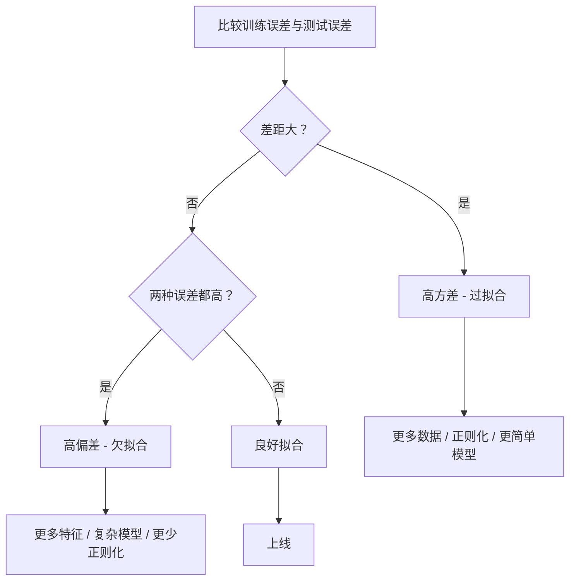
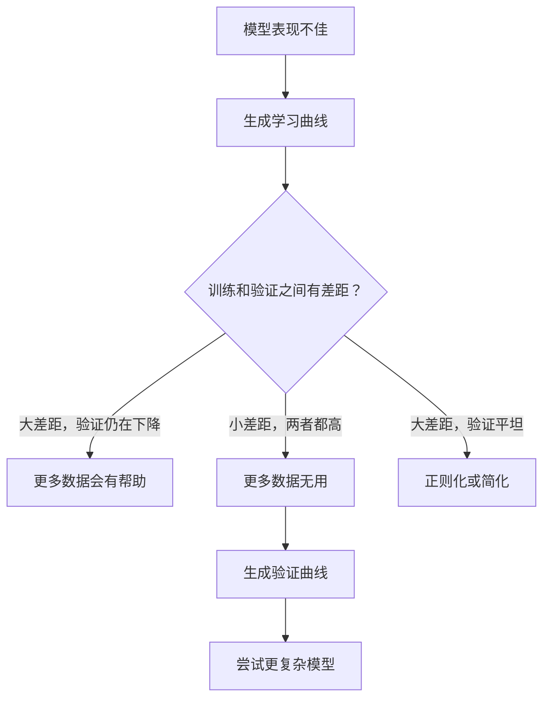

# 偏差-方差权衡

> 模型误差来自三个来源之一：偏差、方差或噪声。前两个你可以控制。

**类型：** 学习型
**语言：** Python
**前置条件：** 阶段 2，第 01-09 课（ML 基础、回归、分类、评估）
**时间：** 约 75 分钟

## 学习目标

- 推导期望预测误差的偏差-方差分解，解释不可约噪声的作用
- 通过训练误差和测试误差的模式，诊断模型是高偏差还是高方差
- 解释正则化技术（L1、L2、Dropout、早停）如何用偏差换方差
- 实现实验，可视化模型复杂度增加时的偏差-方差权衡

## 问题

你训练了一个模型。它在测试数据上有一些误差。这个误差从何而来？

如果你的模型太简单（曲线数据上用线性回归），它会始终错过真实模式。这就是偏差。如果你的模型太复杂（15 个数据点用 20 阶多项式），它会完美拟合训练数据，但对新数据的预测却大相径庭。这就是方差。

在固定的模型容量下，你无法同时最小化两者。压低偏差，方差就上升；压低方差，偏差就上升。理解这个权衡是机器学习中最有用的诊断技能。它告诉你应该增加还是减少模型复杂度，应该获取更多数据还是工程化更好的特征，应该加强还是减弱正则化。

## 概念

### 偏差：系统性误差

偏差衡量的是模型平均预测值离真实值的距离。如果你用从同一分布中抽取的许多不同训练集训练同一个模型，然后取预测的平均值，偏差就是这个平均值与真实值之间的差距。

高偏差意味着模型太过僵化，无法捕捉真实模式。一条直线去拟合抛物线，无论给多少数据，都会错过曲线。这就是欠拟合。

```
高偏差（欠拟合）：
  模型始终预测大致相同的错误结果。
  训练误差：高
  测试误差：高
  差距：小
```

### 方差：对训练数据的敏感性

方差衡量的是当你用不同子集的数据训练时，预测会变化多少。如果训练集的微小变化导致模型的大幅变化，方差就很高。

高方差意味着模型在拟合训练数据中的噪声，而不是底层信号。20 阶多项式会穿过每个训练点，但在它们之间剧烈振荡。这就是过拟合。

```
高方差（过拟合）：
  模型完美拟合训练数据但在新数据上失败。
  训练误差：低
  测试误差：高
  差距：大
```

### 分解

对于任意点 x，期望预测误差在平方损失下可以精确分解：

```
期望误差 = 偏差² + 方差 + 不可约噪声

其中：
  偏差²   = (E[f̂(x)] - f(x))²
  方差    = E[(f̂(x) - E[f̂(x)])²]
  噪声    = E[(y - f(x))²]             (σ²)
```

- `f(x)` 是真实函数
- `f̂(x)` 是模型的预测
- `E[...]` 是对不同训练集的期望
- `y` 是观测标签（真实函数加噪声）

噪声项是不可约的。在有噪声的数据上，没有任何模型能做得比 σ² 更好。你的工作是找到偏差² 和方差之间的正确平衡。

### 模型复杂度 vs 误差


经典的 U 形曲线：

| 复杂度 | 偏差 | 方差 | 总误差 |
|-----------|------|----------|-------------|
| 太低 | 高 | 低 | 高（欠拟合） |
| 刚好 | 中等 | 中等 | 最低 |
| 太高 | 低 | 高 | 高（过拟合） |

### 正则化作为偏差-方差控制

正则化故意增加偏差来降低方差。它约束模型，使其无法追逐噪声。

- **L2（Ridge）：** 将所有权重收缩到零。保留所有特征但降低其影响。
- **L1（Lasso）：** 将一些权重精确推到零。执行特征选择。
- **Dropout：**训练期间随机禁用神经元。强制冗余表示。
- **早停：** 在模型完全拟合训练数据之前停止训练。

正则化强度（lambda、Dropout 率、轮数）直接控制你在偏差-方差曲线上的位置。正则化越多，偏差越大，方差越小。

### 双重下降：现代视角

经典理论认为：过了最佳点，更高的复杂度总是有害的。但自 2019 年以来的研究揭示了一些意想不到的现象。如果你持续增加模型容量，远超过插值阈值（模型有足够参数完美拟合训练数据的点），测试误差可能会再次下降。


这种"双重下降"现象解释了为什么大量过参数化的神经网络（参数远多于训练样本）仍然能很好地泛化。经典的偏差-方差权衡没有错，但对现代场景来说不够完整。

关于双重下降的关键观察：
- 它发生在线性模型、决策树和神经网络中
- 在插值区域，更多数据实际上可能有害（样本级双重下降）
- 更多训练轮数也可能导致它（轮级双重下降）
- 正则化会平滑峰值但不会消除它

为什么会这样？在插值阈值处，模型刚好有足够容量拟合所有训练点。它被迫进入一个非常特定的解，穿过每一个点，数据的微小扰动会导致拟合的大幅变化。这就是方差达到峰值的地方。过了阈值，模型有许多可能的解都能完美拟合数据。学习算法（如带隐式正则化的梯度下降）倾向于选择其中最简单的解。这种对简单解的隐式偏好是过参数化模型能够泛化的原因。

| 阶段 | 参数 vs 样本 | 行为 |
|--------|----------------------|----------|
| 欠参数化 | p << n | 经典权衡适用 |
| 插值阈值 | p ~ n | 方差峰值，测试误差飙升 |
| 过参数化 | p >> n | 隐式正则化介入，测试误差下降 |

实际意义：如果你使用神经网络或大型树集成，不要在插值阈值处停止。要么保持在远低于它的地方（带显式正则化），要么远超过它。最糟糕的位置正好在阈值处。

### 诊断你的模型



| 症状 | 诊断 | 解决方法 |
|---------|-----------|-----|
| 训练误差高，测试误差高 | 偏差 | 更多特征、复杂模型、更少正则化 |
| 训练误差低，测试误差高 | 方差 | 更多数据、正则化、更简单模型、Dropout |
| 训练误差低，测试误差低 | 良好拟合 | 上线 |
| 训练误差下降，测试误差上升 | 正在进行过拟合 | 早停 |

### 实用策略

**当偏差是问题时：**
- 添加多项式或交互特征
- 使用更灵活的模型（树集成代替线性模型）
- 降低正则化强度
- 训练更长时间（如果尚未收敛）

**当方差是问题时：**
- 获取更多训练数据
- 使用 Bagging（随机森林）
- 增加正则化（更高的 lambda、更多 Dropout）
- 特征选择（移除噪声特征）
- 使用交叉验证尽早发现

### 集成方法与方差缩减

集成方法是抗击方差最实用的工具。

**Bagging（Bootstrap 聚合）** 在训练数据的不同 bootstrap 样本上训练多个模型，然后平均它们的预测。每个单独模型都有高方差，但平均值方差低得多。随机森林就是 Bagging 应用于决策树。

数学原理：如果平均 N 个独立预测，每个预测方差为 σ²，则平均值的方差为 σ²/N。模型并非真正独立（它们都看到相似数据），所以缩减小于 1/N，但仍然很显著。

**Boosting** 通过顺序构建模型来降低偏差，每个新模型专注于集成目前的误差。梯度提升和 AdaBoost 是主要例子。Boosting 如果添加太多模型可能会过拟合，所以需要早停或正则化。

| 方法 | 主要效果 | 偏差变化 | 方差变化 |
|--------|---------------|-------------|-----------------|
| Bagging | 降低方差 | 无变化 | 下降 |
| Boosting | 降低偏差 | 下降 | 可能增加 |
| Stacking | 两者都降低 | 取决于元学习器 | 取决于基础模型 |
| Dropout | 隐式 Bagging | 略微增加 | 下降 |

**实用规则：** 如果你的基础模型有高方差（深树、高阶多项式），用 Bagging。如果你的基础模型有高偏差（浅树桩、简单线性模型），用 Boosting。

### 学习曲线

学习曲线将训练和验证误差绘制为训练集大小的函数。它们是你拥有的最实用的诊断工具。与单一的 train/test 比较不同，学习曲线向你展示模型的轨迹，并告诉你更多数据是否有帮助。


如何阅读它们：

| 场景 | 训练误差 | 验证误差 | 差距 | 含义 | 怎么做 |
|----------|---------------|-----------------|-----|---------------|------------|
| 高偏差 | 高 | 高 | 小 | 模型无法捕捉模式 | 更多特征、复杂模型、更少正则化 |
| 高方差 | 低 | 高 | 大 | 模型记忆训练数据 | 更多数据、正则化、更简单模型 |
| 良好拟合 | 中等 | 中等 | 小 | 模型泛化良好 | 上线 |
| 高方差，正在改善 | 低 | 随更多数据下降 | 缩小 | 数据可以解决方差问题 | 收集更多数据 |
| 高偏差，平坦 | 高 | 高且平坦 | 小且平坦 | 更多数据无用 | 改变模型架构 |

关键洞察：如果两条曲线都趋于平稳，差距很小但两种误差都很高，更多数据是无用的。你需要一个更好的模型。如果差距很大且仍在缩小，更多数据会有帮助。

### 如何生成学习曲线

有两种方法：

**方法 1：变化训练集大小，固定模型。** 保持模型和超参数不变。在越来越大的训练数据子集上训练。在每个大小上测量训练误差和验证误差。这是标准的学习曲线。

**方法 2：变化模型复杂度，固定数据。** 保持数据不变。扫描复杂度参数（多项式阶数、树深度、层数）。在每个复杂度上测量训练误差和验证误差。这是一个验证曲线，直接显示偏差-方差权衡。

两种方法互补。第一个告诉你更多数据是否有帮助。第二个告诉你不同的模型是否有帮助。在对下一步做出决定之前，两个都运行。



##动手实现

`code/bias_variance.py` 中的代码运行完整的偏差-方差分解实验。以下是逐步的方法。

### 第 1 步：从已知函数生成合成数据

我们使用 `f(x) = sin(1.5x) + 0.5x` 加高斯噪声。知道真实函数使我们能够计算精确的偏差和方差。

```python
def true_function(x):
    return np.sin(1.5 * x) + 0.5 * x

def generate_data(n_samples=30, noise_std=0.5, x_range=(-3, 3), seed=None):
    rng = np.random.RandomState(seed)
    x = rng.uniform(x_range[0], x_range[1], n_samples)
    y = true_function(x) + rng.normal(0, noise_std, n_samples)
    return x, y
```

### 第 2 步：Bootstrap 采样与多项式拟合

对于每个多项式阶数，我们抽取许多 bootstrap 训练集，拟合多项式，并在固定的测试网格上记录预测。这给了我们每个测试点上预测的分布。

```python
def fit_polynomial(x_train, y_train, degree, lam=0.0):
    X = np.column_stack([x_train ** d for d in range(degree + 1)])
    if lam > 0:
        penalty = lam * np.eye(X.shape[1])
        penalty[0, 0] = 0
        w = np.linalg.solve(X.T @ X + penalty, X.T @ y_train)
    else:
        w = np.linalg.lstsq(X, y_train, rcond=None)[0]
    return w
```

我们在 200 个不同的 bootstrap 样本上拟合。每个 bootstrap 样本从相同的底层分布中抽取但包含不同的点。

### 第 3 步：计算偏差²、方差分解

在每个测试点有 200 组预测后，我们可以直接从定义计算分解：

```python
mean_pred = predictions.mean(axis=0)
bias_sq = np.mean((mean_pred - y_true) ** 2)
variance = np.mean(predictions.var(axis=0))
total_error = np.mean(np.mean((predictions - y_true) ** 2, axis=1))
```

- `mean_pred` 是从 bootstrap 样本估计的 E[f̂(x)]
- `bias_sq` 是平均预测与真实值之间的平方差距
- `variance` 是跨 bootstrap 样本的预测平均散布
- `total_error` 应该大约等于偏差² + 方差 + 噪声

### 第 4 步：学习曲线

学习曲线在保持模型复杂度固定的同时扫描训练集大小。它们显示你的模型是受数据限制还是受容量限制。

```python
def demo_learning_curves():
    sizes = [10, 15, 20, 30, 50, 75, 100, 150, 200, 300]
    degree = 5

    for n in sizes:
        train_errors = []
        test_errors = []
        for seed in range(50):
            x_train, y_train = generate_data(n_samples=n, seed=seed * 100)
            w = fit_polynomial(x_train, y_train, degree)
            train_pred = predict_polynomial(x_train, w)
            train_mse = np.mean((train_pred - y_train) ** 2)
            test_pred = predict_polynomial(x_test, w)
            test_mse = np.mean((test_pred - y_test) ** 2)
            train_errors.append(train_mse)
            test_errors.append(test_mse)
        #跨运行平均给出学习曲线点
```

对于高方差模型（小数据下的 5 阶多项式），你会看到：
- 训练误差开始很低，随着更多数据使记忆变得更难，误差增加
- 测试误差开始很高，随着模型获得更多信号，误差下降
- 差距随更多数据缩小

对于高偏差模型（1 阶），两种误差都很快收敛到相同的高值，更多数据没有帮助。

### 第 5 步：正则化扫描

代码还包括 `demo_regularization_sweep()`，它固定一个高阶多项式（15 阶）并将 Ridge 正则化强度从 0.001 扫描到 100。这从另一个角度显示偏差-方差权衡：不是变化模型复杂度，而是变化约束强度。

```python
def demo_regularization_sweep():
    alphas = [0.001, 0.005, 0.01, 0.05, 0.1, 0.5, 1.0, 5.0, 10.0, 50.0, 100.0]
    for alpha in alphas:
        results = bias_variance_decomposition([15], lam=alpha)
        r = results[15]
        print(f"alpha={alpha:.3f}  bias={r['bias_sq']:.4f}  var={r['variance']:.4f}")
```

在低 alpha 时，15 阶多项式几乎不受约束。方差占主导，因为模型在每个 bootstrap 样本中追逐噪声。在高 alpha 时，惩罚如此之强，以至于模型实际上变成了近常数函数。偏差占主导。最佳 alpha 位于这些极端之间。

这与变化多项式阶数时的相同 U 形曲线，但由连续旋钮而不是离散旋钮控制。在实践中，正则化是控制权衡的首选方式，因为它允许细粒度控制而无需更改特征集。

## 实际使用

sklearn 提供 `learning_curve` 和 `validation_curve` 来自动化这些诊断，无需编写 bootstrap 循环。

### 验证曲线：扫描模型复杂度

```python
from sklearn.model_selection import validation_curve
from sklearn.pipeline import make_pipeline
from sklearn.preprocessing import PolynomialFeatures
from sklearn.linear_model import Ridge

degrees = list(range(1, 16))
train_scores_all = []
val_scores_all = []

for d in degrees:
    pipe = make_pipeline(PolynomialFeatures(d), Ridge(alpha=0.01))
    train_scores, val_scores = validation_curve(
        pipe, X, y, param_name="polynomialfeatures__degree",
        param_range=[d], cv=5, scoring="neg_mean_squared_error"
    )
    train_scores_all.append(-train_scores.mean())
    val_scores_all.append(-val_scores.mean())
```

这直接给你偏差-方差权衡曲线。验证分数相对于训练分数最差的地方，方差占主导。两者都差的地方，偏差占主导。

### 学习曲线：扫描训练集大小

```python
from sklearn.model_selection import learning_curve

pipe = make_pipeline(PolynomialFeatures(5), Ridge(alpha=0.01))
train_sizes, train_scores, val_scores = learning_curve(
    pipe, X, y, train_sizes=np.linspace(0.1, 1.0, 10),
    cv=5, scoring="neg_mean_squared_error"
)
train_mse = -train_scores.mean(axis=1)
val_mse = -val_scores.mean(axis=1)
```

将 `train_mse` 和 `val_mse` 对 `train_sizes` 绘图。形状告诉你关于模型的一切。

### 带正则化扫描的交叉验证

```python
from sklearn.model_selection import cross_val_score

alphas = [0.001, 0.01, 0.1, 1.0, 10.0, 100.0]
for alpha in alphas:
    pipe = make_pipeline(PolynomialFeatures(10), Ridge(alpha=alpha))
    scores = cross_val_score(pipe, X, y, cv=5, scoring="neg_mean_squared_error")
    print(f"alpha={alpha:>7.3f}  MSE={-scores.mean():.4f} +/- {scores.std():.4f}")
```

这扫描固定模型复杂度的正则化强度。你会看到相同的偏差-方差权衡：低 alpha意味着高方差，高 alpha 意味着高偏差。

### 综合：完整的诊断工作流程

在实践中，你按顺序运行这些诊断：

1. 训练你的模型。计算训练和测试误差。
2. 如果两者都高：你有偏差问题。跳到第 4 步。
3. 如果训练低但测试高：你有方差问题。生成学习曲线看更多数据是否有帮助。如果没有，正则化。
4. 生成验证曲线，扫描你的主要复杂度参数。找到最佳点。
5. 在最佳点，生成学习曲线。如果差距仍然很大，你需要更多数据或正则化。
6. 使用 `cross_val_score` 尝试不同的 alpha 值使用 Ridge/Lasso。选择交叉验证误差最低的 alpha。

对于大多数表格数据集，这需要10-15 分钟的计算，并节省数小时的猜测。

## 交付物

本课产出：`outputs/prompt-model-diagnostics.md`

## 练习

1. 用 `noise_std=0`（无噪声）运行分解。不可约误差项会发生什么？最佳复杂度会改变吗？

2. 将训练集大小从30 增加到 300。这如何影响方差分量？最佳多项式阶数会移动吗？

3. 在实验中添加 L2 正则化（Ridge 回归）。对于固定的高阶多项式（15 阶），将 lambda 从 0 扫描到 100。绘制偏差² 和方差作为 lambda 的函数。

4. 将真实函数从多项式改为 `sin(x)`。偏差-方差分解如何变化？是否仍然有明确的最佳阶数？

5. 实现一个简单的 bootstrap 聚合（Bagging）包装器：在 bootstrap 样本上训练 10 个模型并平均预测。证明这可以降低方差而不会大幅增加偏差。

## 关键术语

| 术语 | 大家怎么说的 | 实际含义 |
|------|----------------|----------------------|
| 偏差 (Bias) | "模型太简单" | 来自错误假设的系统性误差。平均模型预测与真实值之间的差距。 |
| 方差 (Variance) | "模型过拟合" | 来自对训练数据敏感性的误差。预测在不同训练集之间变化多少。 |
| 不可约误差 | "数据中的噪声" | 来自真实数据生成过程中随机性的误差。没有模型能消除它。 |
| 欠拟合 | "学习不够" | 模型有高偏差。它即使在训练数据上也错过真实模式。 |
| 过拟合 | "记忆数据" | 模型有高方差。它拟合训练数据中不能泛化的噪声。 |
| 正则化 | "约束模型" | 添加惩罚以降低模型复杂度，用偏差换取更低的方差。 |
| 双重下降 | "更多参数可能有帮助" | 当模型容量远超过插值阈值时，测试误差再次下降。 |
| 模型复杂度 | "模型有多灵活" | 模型拟合任意模式的容量。由架构、特征或正则化控制。 |

## 延伸阅读

- [Hastie, Tibshirani, Friedman: Elements of Statistical Learning, Ch. 7](https://hastie.su.domains/ElemStatLearn/) -- 偏差-方差分解的权威论述
- [Belkin et al., Reconciling modern machine learning practice and the bias-variance trade-off (2019)](https://arxiv.org/abs/1812.11118) -- 双重下降论文
- [Nakkiran et al., Deep Double Descent (2019)](https://arxiv.org/abs/1912.02292) -- 轮级和样本级双重下降
- [Scott Fortmann-Roe: Understanding the Bias-Variance Tradeoff](http://scott.fortmann-roe.com/docs/BiasVariance.html) -- 清晰的视觉解释