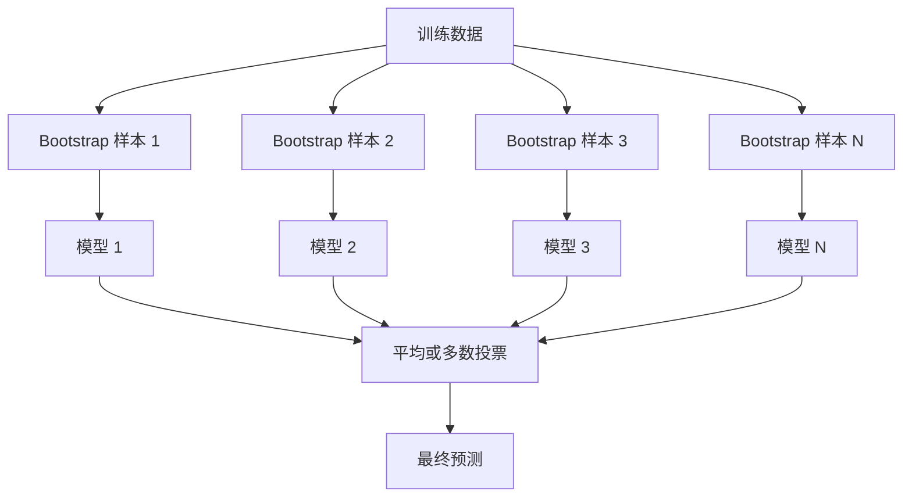
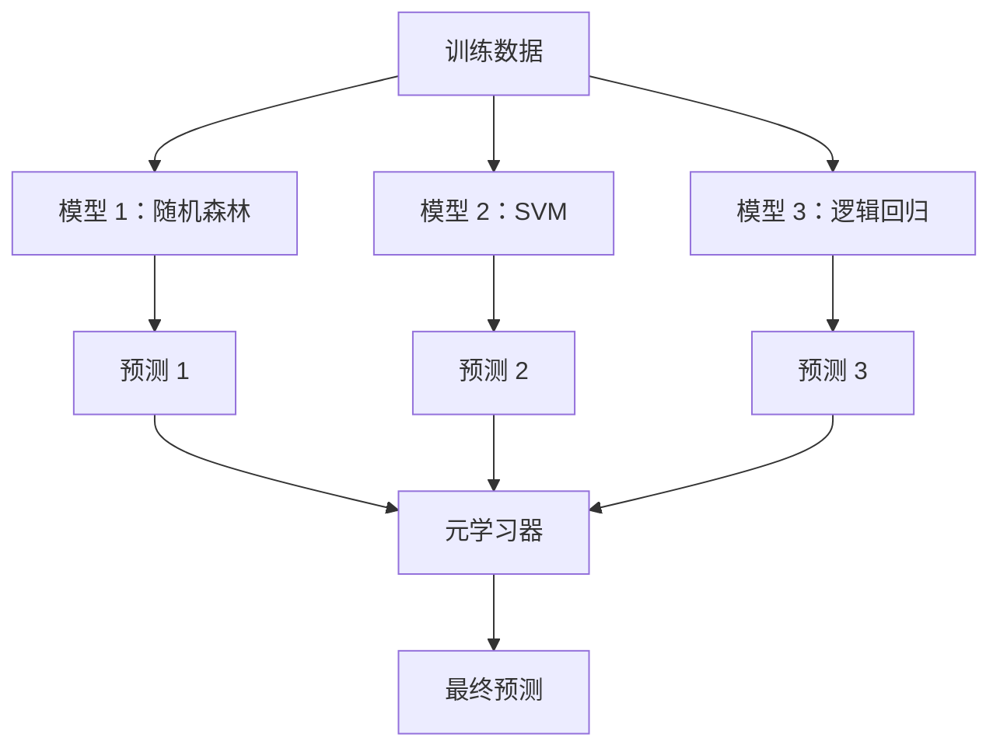

# 集成方法

> 一组弱学习器，如果组合得当，就能变成一个强学习器。这不是比喻，而是一个定理。

**类型：** 学习型
**语言：** Python
**前置条件：** 阶段 2，第 10 课（偏差-方差权衡）
**时间：** 约 120 分钟

## 学习目标

- 从零实现 AdaBoost 和梯度提升，并解释提升如何逐步降低偏差
- 构建 Bagging 集成，并演示如何通过平均去相关模型来降低方差而不增加偏差
- 比较 Bagging、提升和堆叠在各自针对的误差成分方面的差异
- 评估集成多样性，并解释为何多数投票的准确率会随着更多独立弱学习器而提高

## 问题

单棵决策树训练快、好解释，但容易过拟合。单条线性模型在复杂边界上又欠拟合。你可以用好几天来设计一个完美的模型架构。或者，你可以把一堆不完美的模型组合起来，得到比任何一个单独模型都更好的结果。

集成方法正是这样做的。它们是在表格数据上赢得 Kaggle 竞赛最可靠的技术，支撑着大多数生产级 ML 系统，并且完美地展示了偏差-方差权衡。Bagging 降低方差。提升降低偏差。堆叠学习在哪些输入上该信任哪些模型。

## 概念

### 为什么集成有效

假设你有 N 个独立分类器，每个的准确率为 p > 0.5。多数投票的准确率为：

```
P(多数正确) = sum over k > N/2 of C(N,k) * p^k * (1-p)^(N-k)
```

对于 21 个分类器，每个准确率 60%，多数投票准确率约为 74%。101 个分类器时，上升到 84%。当模型犯下不同错误时，误差会相互抵消。

关键要求是**多样性**。如果所有模型犯相同的错误，组合起来毫无帮助。集成之所以有效，是因为它们通过以下方式产生多样化模型：

-不同的训练子集（Bagging）
- 不同的特征子集（随机森林）
- 顺序误差纠正（提升）
- 不同的模型家族（堆叠）

### Bagging（Bootstrap 聚合）

Bagging 通过在不同的 bootstrap 样本上训练每个模型来创造多样性。



Bootstrap 样本是从原始数据中有放回抽取的，大小与原始数据相同。每个 bootstrap 中大约有 63.2% 的独特样本。剩下的 36.8%（袋外样本）提供了一个免费的验证集。

Bagging 在不大幅增加偏差的情况下降低方差。每棵树都过拟合自己的 bootstrap 样本，但每棵树的过拟合不同，所以平均后会抵消噪声。

**随机森林**是 Bagging 的增强版：在每次分裂时，只考虑特征的随机子集。这强制树之间产生更多多样性。典型的候选特征数为：分类时 `sqrt(n_features)`，回归时 `n_features / 3`。

### Boosting（顺序误差纠正）

Boosting 按顺序训练模型。每个新模型专注于前一个模型错误分类的样本。


Boosting 降低偏差。每个新模型纠正截止目前的集成系统的系统误差。最终预测是所有模型的加权和，其中表现更好的模型获得更高权重。

权衡点：Boosting 如果轮数过多会过拟合，因为它不断拟合越来越难的样本，其中一些可能是噪声。

### AdaBoost

AdaBoost（自适应提升）是最早的实用提升算法。它适用于任何基础学习器，通常是决策桩（深度为 1 的树）。

算法：

```
1. 初始化样本权重：对所有 i，令 w_i = 1/N

2. 对于 t = 1 到 T：
   a. 在带权重的数据上训练弱学习器 h_t
   b. 计算加权误差：
      err_t = sum(w_i * I(h_t(x_i) != y_i)) / sum(w_i)
   c. 计算模型权重：
      alpha_t = 0.5 * ln((1 - err_t) / err_t)
   d. 更新样本权重：
      w_i = w_i * exp(-alpha_t * y_i * h_t(x_i))
   e. 归一化权重使其和为 1

3. 最终预测：H(x) = sign(sum(alpha_t * h_t(x)))
```

误差更低的模型获得更高的 alpha。被错误分类的样本获得更高权重，以便下一个模型聚焦于它们。

### 梯度提升

梯度提升将提升泛化到任意损失函数。它不是对样本重新加权，而是让每个新模型拟合当前集成的残差（损失的负梯度）。

```
1. 初始化：F_0(x) = argmin_c sum(L(y_i, c))

2. 对于 t = 1 到 T：
   a. 计算伪残差：
      r_i = -dL(y_i, F_{t-1}(x_i)) / dF_{t-1}(x_i)
   b. 用残差 r_i 拟合一棵树 h_t
   c. 找到最优步长：
      gamma_t = argmin_gamma sum(L(y_i, F_{t-1}(x_i) + gamma * h_t(x_i)))
   d. 更新：
      F_t(x) = F_{t-1}(x) + learning_rate * gamma_t * h_t(x)

3. 最终预测：F_T(x)
```

对于平方误差损失，伪残差就是实际残差：`r_i = y_i - F_{t-1}(x_i)`。每棵树实际上都在拟合前一个集成的错误。

学习率（收缩率）控制每棵树的贡献程度。学习率越小需要更多树，但泛化能力更强。典型值：0.01 到 0.3。

### XGBoost：为何它主导表格数据

XGBoost（极端梯度提升）是梯度提升加上工程优化，使其快速、准确且抗过拟合：

- **正则化目标：** 对叶子权重施加 L1 和 L2 惩罚，防止单棵树过于自信
- **二阶近似：** 使用损失函数的一阶和二阶导数，给出更好的分裂决策
- **稀疏感知分裂：** 原生处理缺失值，在每个分裂点学习缺失数据的最佳方向
- **列采样：** 像随机森林一样，在每次分裂时采样特征以增加多样性
- **加权分位数草图：** 在分布式数据上高效寻找连续特征的分界点
- **缓存感知的块结构：** 针对 CPU 缓存行优化的内存布局

对于表格数据，XGBoost（及其后继者 LightGBM）始终优于神经网络。这种情况短期内不会改变。如果你的数据可以用行和列的表格表示，先用梯度提升。

### 堆叠（元学习）

堆叠使用多个基础模型的预测作为元学习器的特征。



元学习器学习对于哪些输入该信任哪个基础模型。如果随机森林在某些区域表现更好，SVM 在其他区域更好，元学习器会学习相应的路由。

为避免数据泄露，基础模型预测必须通过对训练集进行交叉验证来生成。永远不要在同一数据上训练基础模型并生成元特征。

### 投票

最简单的集成。直接组合预测。

- **硬投票：** 对类别标签进行多数投票。
- **软投票：** 平均预测概率，选择平均概率最高的类别。通常更好，因为它使用了置信度信息。

## 动手实现

### 第 1 步：决策桩（基础学习器）

`code/ensembles.py` 中的代码从头实现了一切。我们从决策桩开始：一棵只有一次分裂的树。

```python
class DecisionStump:
    def __init__(self):
        self.feature_idx = None
        self.threshold = None
        self.polarity = 1
        self.alpha = None

    def fit(self, X, y, weights):
        n_samples, n_features = X.shape
        best_error = float("inf")

        for f in range(n_features):
            thresholds = np.unique(X[:, f])
            for thresh in thresholds:
                for polarity in [1, -1]:
                    pred = np.ones(n_samples)
                    pred[polarity * X[:, f] < polarity * thresh] = -1
                    error = np.sum(weights[pred != y])
                    if error < best_error:
                        best_error = error
                        self.feature_idx = f
                        self.threshold = thresh
                        self.polarity = polarity

    def predict(self, X):
        n = X.shape[0]
        pred = np.ones(n)
        idx = self.polarity * X[:, self.feature_idx] < self.polarity * self.threshold
        pred[idx] = -1
        return pred
```

### 第 2 步：从零实现 AdaBoost

```python
class AdaBoostScratch:
    def __init__(self, n_estimators=50):
        self.n_estimators = n_estimators
        self.stumps = []
        self.alphas = []

    def fit(self, X, y):
        n = X.shape[0]
        weights = np.full(n, 1 / n)

        for _ in range(self.n_estimators):
            stump = DecisionStump()
            stump.fit(X, y, weights)
            pred = stump.predict(X)

            err = np.sum(weights[pred != y])
            err = np.clip(err, 1e-10, 1 - 1e-10)

            alpha = 0.5 * np.log((1 - err) / err)
            weights *= np.exp(-alpha * y * pred)
            weights /= weights.sum()

            stump.alpha = alpha
            self.stumps.append(stump)
            self.alphas.append(alpha)

    def predict(self, X):
        total = sum(a * s.predict(X) for a, s in zip(self.alphas, self.stumps))
        return np.sign(total)
```

### 第 3 步：从零实现梯度提升

```python
class GradientBoostingScratch:
    def __init__(self, n_estimators=100, learning_rate=0.1, max_depth=3):
        self.n_estimators = n_estimators
        self.lr = learning_rate
        self.max_depth = max_depth
        self.trees = []
        self.initial_pred = None

    def fit(self, X, y):
        self.initial_pred = np.mean(y)
        current_pred = np.full(len(y), self.initial_pred)

        for _ in range(self.n_estimators):
            residuals = y - current_pred
            tree = SimpleRegressionTree(max_depth=self.max_depth)
            tree.fit(X, residuals)
            update = tree.predict(X)
            current_pred += self.lr * update
            self.trees.append(tree)

    def predict(self, X):
        pred = np.full(X.shape[0], self.initial_pred)
        for tree in self.trees:
            pred += self.lr * tree.predict(X)
        return pred
```

### 第 4 步：与 sklearn 对比

代码验证我们的从头实现产生了与 sklearn 的 `AdaBoostClassifier` 和 `GradientBoostingClassifier` 相似的准确率，并将所有方法并排比较。

## 实际使用

### 何时使用哪种方法

| 方法 | 降低 | 最佳场景 | 注意事项 |
|--------|---------|----------|---------------|
| Bagging / 随机森林 | 方差 | 噪声数据、特征多 | 对偏差没有帮助 |
| AdaBoost | 偏差 | 干净数据、简单基础学习器 | 对异常值和噪声敏感 |
| 梯度提升 | 偏差 | 表格数据、竞赛 |训练慢，不调参容易过拟合 |
| XGBoost / LightGBM | 两者 | 生产级表格 ML | 超参数多 |
| 堆叠 | 两者 | 追求最后 1-2% 准确率 | 复杂，元学习器有而过拟合风险 |
| 投票 | 方差 | 快速组合多样模型 | 仅在模型多样时有效 |

### 表格数据的生产堆栈

对于大多数表格预测问题，按以下顺序尝试：

1. **LightGBM 或 XGBoost**，使用默认参数
2. 调优 n_estimators、learning_rate、max_depth、min_child_weight
3. 如果需要最后 0.5%，用 3-5 个多样模型构建堆叠集成
4. 全程使用交叉验证

尽管持续有研究尝试，表格数据上的神经网络几乎总是比梯度提升差。TabNet、NODE 及类似架构偶尔能持平，但很少能打败调优良好的 XGBoost。

## 交付物

本课产出 `outputs/prompt-ensemble-selector.md` —— 一个帮助你为给定数据集选择正确集成方法的提示词。描述你的数据（大小、特征类型、噪声水平、类别平衡）和你要解决的问题。提示词引导你完成决策清单，推荐一种方法，建议起始超参数，并警告该方法的常见错误。还产出 `outputs/skill-ensemble-builder.md`，包含完整的选型指南。

## 练习

1. 修改 AdaBoost 实现，跟踪每轮后的训练准确率。绘制准确率 vs. 估计器数量的图。它何时收敛？

2. 通过添加随机特征子采样从头实现随机森林。用 `max_features=sqrt(n_features)` 训练 100 棵树并平均预测。将方差降低与单棵树进行比较。

3. 在梯度提升实现中添加早停：跟踪每轮后的验证损失，当连续 10 轮没有改善时停止。它实际需要多少棵树？

4. 构建一个堆叠集成，包含三个基础模型（逻辑回归、决策树、k 近邻）和一个逻辑回归元学习器。使用 5 折交叉验证生成元特征。与各基础模型单独进行比较。

5. 用默认参数在同一数据集上运行 XGBoost。将准确率与从头实现的梯度提升进行比较。计时两者。速度差异有多大？

## 关键术语

| 术语 | 大家怎么说的 | 实际含义 |
|------|----------------|----------------------|
| Bagging | "在随机子集上训练" | Bootstrap 聚合：在 bootstrap 样本上训练模型，平均预测以降低方差 |
| Boosting | "聚焦于难样本" | 顺序训练模型，每个纠正截止目前的集成的误差，以降低偏差 |
| AdaBoost | "对数据重新加权" | 通过样本权重更新进行提升；错误分类的点为下一个学习器获得更高权重 |
| 梯度提升 | "拟合残差" | 通过让每个新模型拟合损失函数的负梯度来进行提升 |
| XGBoost | "Kaggle 武器" | 带正则化、二阶优化和系统级加速技巧的梯度提升 |
| 堆叠 | "模型之上的模型" | 使用基础模型的预测作为元学习器的输入特征 |
| 随机森林 | "许多随机化的树" | 用决策树进行 Bagging，在每次分裂时添加随机特征子采样以增加多样性 |
| 集成多样性 | "犯不同的错误" | 模型必须在误差上不相关，集成才能优于个体模型 |
| 袋外误差 | "免费验证" | 未出现在 bootstrap 抽取中的样本（约 36.8%）作为验证集，无需留出法 |

## 扩展阅读

- [Schapire & Freund: Boosting: Foundations and Algorithms](https://mitpress.mit.edu/9780262526036/) —— AdaBoost 创作者写的书
- [Friedman: Greedy Function Approximation: A Gradient Boosting Machine (2001)](https://statweb.stanford.edu/~jhf/ftp/trebst.pdf) —— 原始梯度提升论文
- [Chen & Guestrin: XGBoost (2016)](https://arxiv.org/abs/1603.02754) —— XGBoost 论文
- [Wolpert: Stacked Generalization (1992)](https://www.sciencedirect.com/science/article/abs/pii/S0893608005800231) —— 原始堆叠论文
- [scikit-learn Ensemble Methods](https://scikit-learn.org/stable/modules/ensemble.html) —— 实践参考