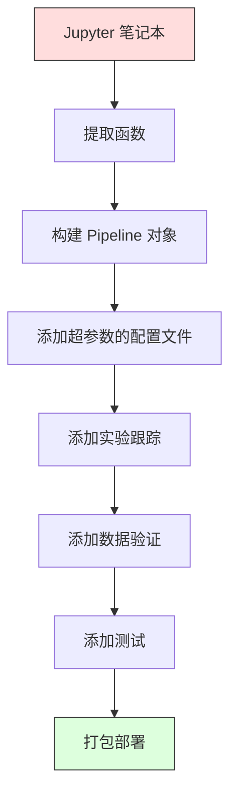

# ML 流水线

> 模型不是产品，流水线才是。流水线是从原始数据到部署预测的整个过程，每一步都必须可复现。

**类型：** 构建型
**语言：** Python
**前置条件：** 阶段 2，第 12 课（超参数调优）
**时间：** 约 120 分钟

## 学习目标

- 从零构建一个将插补、缩放、编码和模型训练链接成单一可复现对象的 ML 流水线
- 识别数据泄漏场景并解释流水线如何通过仅在训练数据上拟合转换器来防止泄漏
- 构建一个对数值和分类特征应用不同预处理的 ColumnTransformer
- 实现流水线序列化并演示相同的拟合流水线在训练和生产中产生相同结果

## 问题

你有一个笔记本，加载数据、用中位数填充缺失值、缩放特征、训练模型并打印准确率。它能工作。你发布了它。

一个月后，有人重新训练模型得到了不同的结果。中位数是在包括测试数据的完整数据集上计算的（数据泄漏）。缩放参数没有保存，所以推理使用了不同的统计量。特征工程代码在训练和服务之间被复制粘贴，副本产生了分歧。分类列在生产中出现了编码器从未见过的新值。

这些不是假设。它们是 ML 系统在生产中失败的最常见原因。流水线通过将每个转换步骤打包成单一、有序、可复现的对象来解决所有这些问题。

## 概念

### 什么是流水线

流水线是数据转换的有序序列，后跟模型。每一步将前一步的输出作为输入。整个流水线在训练数据上一次拟合。在推理时，相同的拟合流水线转换新数据并产生预测。


流水线保证：
- 转换仅在训练数据上拟合（无泄漏）
- 在推理时应用相同的转换
- 整个对象可以序列化为一个工件部署
- 交叉验证对每个折应用流水线，防止微妙的泄漏

### 数据泄漏：沉默的杀手

数据泄漏发生在来自测试集或未来世界的数据污染训练时。流水线防止最常见的形式。

**泄漏的（错误）：**
```python
X = df.drop("target", axis=1)
y = df["target"]

scaler = StandardScaler()
X_scaled = scaler.fit_transform(X)

X_train, X_test = X_scaled[:800], X_scaled[800:]
y_train, y_test = y[:800], y[800:]
```

缩放器看到了测试数据。均值和标准差包含测试样本。这会夸大准确率估计。

**正确的：**
```python
X_train, X_test = X[:800], X[800:]

scaler = StandardScaler()
X_train_scaled = scaler.fit_transform(X_train)
X_test_scaled = scaler.transform(X_test)
```

使用流水线，你不需要考虑这个。流水线自动处理。

### sklearn Pipeline

sklearn 的 `Pipeline` 链接转换器和估计器。它暴露 `.fit()`、`.predict()` 和 `.score()`，按顺序应用所有步骤。

```python
from sklearn.pipeline import Pipeline
from sklearn.preprocessing import StandardScaler
from sklearn.linear_model import LogisticRegression

pipe = Pipeline([
    ("scaler", StandardScaler()),
    ("model", LogisticRegression()),
])

pipe.fit(X_train, y_train)
predictions = pipe.predict(X_test)
```

当你调用 `pipe.fit(X_train, y_train)` 时：
1. 缩放器对 X_train 调用 `fit_transform`
2. 模型对缩放后的 X_train 调用 `fit`

当你调用 `pipe.predict(X_test)` 时：
1. 缩放器对 X_test 调用 `transform`（不是 fit_transform）
2. 模型对缩放后的 X_test 调用 `predict`

缩放器在拟合时从不看到测试数据。这就是全部意义所在。

### ColumnTransformer：不同列的不同流水线

真实数据集有需要不同预处理的数值和分类列。`ColumnTransformer` 处理这个。

```python
from sklearn.compose import ColumnTransformer
from sklearn.preprocessing import StandardScaler, OneHotEncoder
from sklearn.impute import SimpleImputer

numeric_pipe = Pipeline([
    ("impute", SimpleImputer(strategy="median")),
    ("scale", StandardScaler()),
])

categorical_pipe = Pipeline([
    ("impute", SimpleImputer(strategy="most_frequent")),
    ("encode", OneHotEncoder(handle_unknown="ignore")),
])

preprocessor = ColumnTransformer([
    ("num", numeric_pipe, ["age", "income", "score"]),
    ("cat", categorical_pipe, ["city", "gender", "plan"]),
])

full_pipeline = Pipeline([
    ("preprocess", preprocessor),
    ("model", GradientBoostingClassifier()),
])
```

OneHotEncoder 中的 `handle_unknown="ignore"` 对生产至关重要。当出现新类别（模型从未见过的城市）时，它产生一个零向量而不是崩溃。

### 实验跟踪

流水线使训练可复现，但你还需要跟踪跨实验发生了什么：使用了哪些超参数、哪个数据集版本、哪些指标、运行的是哪个代码。

**MLflow** 是最常见的开源解决方案：

```python
import mlflow

with mlflow.start_run():
    mlflow.log_param("max_depth", 5)
    mlflow.log_param("n_estimators", 100)
    mlflow.log_param("learning_rate", 0.1)

    pipe.fit(X_train, y_train)
    accuracy = pipe.score(X_test, y_test)

    mlflow.log_metric("accuracy", accuracy)
    mlflow.sklearn.log_model(pipe, "model")
```

每次运行都记录了参数、指标、工件和完整模型。你可以比较运行、重现任何实验、部署任何模型版本。

**Weights & Biases (wandb)** 提供相同的功能与托管仪表板：

```python
import wandb

wandb.init(project="my-pipeline")
wandb.config.update({"max_depth": 5, "n_estimators": 100})

pipe.fit(X_train, y_train)
accuracy = pipe.score(X_test, y_test)

wandb.log({"accuracy": accuracy})
```

### 模型版本控制

在实验跟踪之后，你需要管理模型版本。哪个模型在生产中？哪个在 staging？上周的是哪个？

MLflow 的模型注册表提供：
- **版本跟踪：** 每个保存的模型获得一个版本号
- **阶段转换：** "Staging"、"Production"、"Archived"
- **审批工作流：** 模型必须被明确提升到生产
- **回滚：** 即时切换回之前的版本

### 使用 DVC 进行数据版本控制

代码用 git 版本化。数据也应该版本化，但 git 无法处理大文件。DVC（数据版本控制）解决这个问题。

```
dvc init
dvc add data/training.csv
git add data/training.csv.dvc data/.gitignore
git commit -m "Track training data"
dvc push
```

DVC 将实际数据存储在远程存储（S3、GCS、Azure）中，并在 git 中保留一个小的 `.dvc` 文件来记录哈希。当你 checkout 一个 git 提交时，`dvc checkout` 恢复精确使用的数据。

这意味着每个 git 提交同时固定了代码和数据。完全可复现。

### 可复现实验

可复现实验需要四件事：

1. **固定随机种子：** 为 numpy、random 和框架（torch、sklearn）设置种子
2. **固定依赖：** requirements.txt 或 poetry.lock 与精确版本
3. **版本化数据：** DVC 或类似工具
4. **配置文件：** 所有超参数在配置中，而不是硬编码

```python
import numpy as np
import random

def set_seed(seed=42):
    random.seed(seed)
    np.random.seed(seed)
    try:
        import torch
        torch.manual_seed(seed)
        torch.cuda.manual_seed_all(seed)
        torch.backends.cudnn.deterministic = True
    except ImportError:
        pass
```

### 从笔记本到生产流水线



典型演进：

1. **笔记本探索：** 快速实验、可视化、特征想法
2. **提取函数：** 将预处理、特征工程、评估移入模块
3. **构建 Pipeline：** 将转换链接成 sklearn Pipeline 或自定义类
4. **配置管理：** 将所有超参数移入 YAML/JSON 配置
5. **实验跟踪：** 添加 MLflow 或 wandb 日志
6. **数据验证：** 训练前检查 schema、分布和缺失值模式
7. **测试：** 对转换器的单元测试，对完整流水线的集成测试
8. **部署：** 序列化流水线，用 API 包装（FastAPI、Flask），容器化

### 常见流水线错误

| 错误 | 为什么糟糕 | 修复 |
|---------|-------------|-----|
| 在分割前对完整数据拟合 | 数据泄漏 | 使用带 cross_val_score 的 Pipeline |
| 流水线外的特征工程 | 训练和服务时转换不同 | 将所有转换放在 Pipeline 中 |
| 不处理未知类别 | 生产中遇到新值崩溃 | OneHotEncoder(handle_unknown="ignore") |
| 硬编码列名 | schema 变化时崩溃 | 从配置中使用列名列表 |
| 无数据验证 | 糟糕数据上悄悄产生错误预测 | 预测前添加 schema 检查 |
| 训练/服务 skew | 模型在生产中看到不同特征 | 训练和服务使用同一个 Pipeline 对象 |

## 构建

`code/pipeline.py` 中的代码从头构建完整的 ML 流水线：

### 第 1 步：自定义转换器

```python
class CustomTransformer:
    def __init__(self):
        self.means = None
        self.stds = None

    def fit(self, X):
        self.means = np.mean(X, axis=0)
        self.stds = np.std(X, axis=0)
        self.stds[self.stds == 0] = 1.0
        return self

    def transform(self, X):
        return (X - self.means) / self.stds

    def fit_transform(self, X):
        return self.fit(X).transform(X)
```

### 第 2 步：从零实现 Pipeline

```python
class PipelineFromScratch:
    def __init__(self, steps):
        self.steps = steps

    def fit(self, X, y=None):
        X_current = X.copy()
        for name, step in self.steps[:-1]:
            X_current = step.fit_transform(X_current)
        name, model = self.steps[-1]
        model.fit(X_current, y)
        return self

    def predict(self, X):
        X_current = X.copy()
        for name, step in self.steps[:-1]:
            X_current = step.transform(X_current)
        name, model = self.steps[-1]
        return model.predict(X_current)
```

### 第 3 步：带 Pipeline 的交叉验证

代码演示了带流水线的交叉验证如何防止数据泄漏：缩放器在每个折的训练数据上单独拟合。

### 第 4 步：使用 sklearn 的完整生产流水线

一个完整的流水线，带有 `ColumnTransformer`、多条预处理路径和一个模型，使用适当的交叉验证和实验日志进行训练。

## 交付

本课产出：
- `outputs/prompt-ml-pipeline.md` -- 用于构建和调试 ML 流水线的技能
- `code/pipeline.py` -- 从头到 sklearn 的完整流水线

## 练习

1. 构建一个处理有 3 个数值列和 2 个分类列的数据集的流水线。使用 `ColumnTransformer` 对数值应用中位数插补 + 缩放，对分类应用最频繁插补 + 独热编码。用 5 折交叉验证训练。

2. 故意引入数据泄漏：在分割前对完整数据集拟合缩放器。比较交叉验证分数（泄漏的）到流水线交叉验证分数（干净的）。差异有多大？

3. 用 `joblib.dump` 序列化你的流水线。在单独脚本中加载并运行预测。验证预测是相同的。

4. 添加一个自定义转换器到流水线，为两个最重要的数值列创建多项式特征（2 次）。它应该放在流水线的哪个位置？

5. 为流水线设置 MLflow 跟踪。用不同超参数运行 5 个实验。使用 MLflow UI（`mlflow ui`）比较运行并选择最佳模型。

## 关键术语

| 术语 | 大家怎么说的 | 实际含义 |
|------|----------------|----------------------|
| Pipeline | "转换链 + 模型" | 有序的拟合转换器和模型序列，作为一个单元应用以防止泄漏 |
| 数据泄漏 | "测试信息泄漏到训练中" | 使用来自训练集外的信息构建模型，夸大性能估计 |
| ColumnTransformer | "每列不同的预处理" | 对不同列子集应用不同流水线，合并结果 |
| 实验跟踪 | "记录你的运行" | 记录每次训练运行的参数、指标、工件和代码版本 |
| MLflow | "跟踪和部署模型" | 用于实验跟踪、模型注册表和部署的开源平台 |
| DVC | "数据的 git" | 大数据文件的版本控制系统，在 git 中存储哈希，在远程存储中存储数据 |
| 模型注册表 | "模型版本目录" | 跟踪带有阶段标签（staging、production、archived）的模型版本的系统 |
| 训练/服务 skew | "笔记本里能工作" | 训练和推理时数据处理方式的差异，导致静默错误 |
| 可复现性 | "相同代码，相同结果" | 从相同代码、数据和配置获得相同结果的能力 |

## 延伸阅读

- [scikit-learn Pipeline docs](https://scikit-learn.org/stable/modules/compose.html) -- 官方流水线参考
- [MLflow documentation](https://mlflow.org/docs/latest/index.html) -- 实验跟踪和模型注册表
- [DVC documentation](https://dvc.org/doc) -- 数据版本控制
- [Sculley et al., Hidden Technical Debt in Machine Learning Systems (2015)](https://papers.nips.cc/paper/2015/hash/86df7dcfd896fcaf2674f757a2463eba-Abstract.html) -- ML 系统复杂性的开创性论文
- [Google ML Best Practices: Rules of ML](https://developers.google.com/machine-learning/guides/rules-of-ml) -- 实用生产 ML 建议