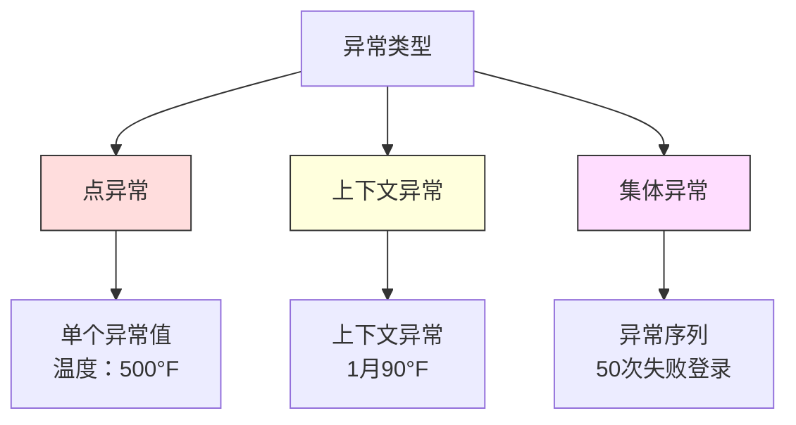
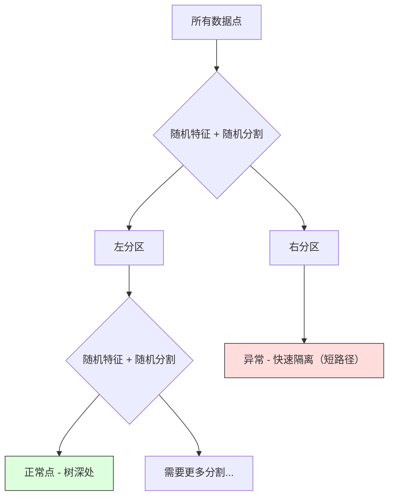

# 异常检测

> 正常容易定义。异常就是一切不符合正常的东西。

**类型：** 构建型
**语言：** Python
**前置条件：** 阶段 2，第 01-09 课
**时间：** 约 75 分钟

## 学习目标

- 从零实现 Z-score、IQR 和 Isolation Forest 异常检测方法
- 区分点异常、上下文异常和集体异常，并为每种类型选择合适的检测方法
- 解释为什么异常检测被表述为学习正常数据而非对异常进行分类
- 比较无监督异常检测与有监督分类，评估新型异常覆盖率和精确率之间的权衡

## 问题

一张信用卡在下午 2 点于纽约使用，5分钟后又出现在东京。一台工厂传感器的读数是 150 度，而正常范围是 80-120。一台服务器每秒发送 50,000 个请求，而日均只有 200 个。

这些都是异常。发现它们至关重要。欺诈造成数十亿美元的损失。设备故障导致停机。网络入侵窃取数据。

挑战在于：你很少有标注好的异常样本。欺诈仅占交易的 0.1%。设备故障每年只发生几次。你无法训练一个标准的分类器，因为"异常"类几乎没有什么可以学习的。即使你有一些标签，你见过的异常也不是你会遇到的所有类型。明天的欺诈手法与今天不同。

异常检测翻转了问题。与其学习什么是异常的，不如学习什么是正常的。任何偏离正常的东西都值得怀疑。这不需要标签就能工作，能适应新型异常，并可扩展到海量数据集。

## 概念

### 异常的类型

并非所有异常都是一样的：

- **点异常。** 一个独立的数据点，无论上下文如何都很异常。500 度的温度读数。一笔50,000 美元的交易，而该账户通常只消费 50 美元。
- **上下文异常。** 一个数据点在其上下文中很异常。90度的温度在夏天是正常的，在冬天则是异常的。同一个值，不同的上下文。
- **集体异常。** 一系列数据点作为整体是异常的，即使每个单独的点可能是正常的。五次登录失败是正常的。连续五十次则是一次暴力破解攻击。

大多数方法检测点异常。上下文异常需要时间或位置特征。集体异常需要序列感知方法。



### 无监督框架

在标准分类中，你有两个类的标签。在异常检测中，你通常面临三种情况之一：

1. **完全无监督。** 完全没有标签。你在所有数据上拟合检测器，并希望异常足够罕见，不会破坏"正常"模型。
2. **半监督。** 你有一个只包含正常数据的干净数据集。你在这个干净集上拟合，然后对所有其他数据进行评分。如果可能的话，这是最强的设置。
3. **弱监督。** 你有一些标注好的异常。用它们进行评估，而非训练。在无监督情况下训练，然后在标注子集上测量精确率/召回率。

关键洞察：异常检测与分类有本质区别。你是在对正常数据的分布进行建模，而不是在两个类之间建立决策边界。

### 有监督 vs 无监督：权衡

如果你确实有标注好的异常，应该用它们进行训练（有监督分类）还是仅用于评估（无监督检测）？

**有监督（当作分类处理）：**
- 捕获你之前见过的确切类型的异常
- 对已知异常类型有更高的精确率
- 完全遗漏新型异常类型
- 当新型异常类型出现时需要重新训练
- 需要足够的异常样本（通常太少）

**无监督（学习正常，标记偏差）：**
- 捕获任何偏离正常的情况，包括新型类型
- 不需要标注的异常
- 更高的假阳性率（并非所有异常事物都是坏的）
- 对分布偏移更鲁棒

实际上，最好的系统结合了两者：无监督检测用于广泛覆盖，有监督模型用于已知的高优先级异常类型，人类审查用于模糊案例。

### Z-Score 方法

最简单的方法。计算每个特征的均值和标准差。标记超过 k 个标准差的任何点。

```text
z_score = (x - mean) / std
如果 |z_score| > threshold 则为异常
```

默认阈值是 3.0（对于高斯分布，99.7% 的正常数据落在 3 个标准差以内）。

**优势：** 简单。快速。可解释（"该值比正常值偏离 4.5 个标准差"）。

**劣势：** 假设数据呈正态分布。对训练数据中的异常值敏感（异常值会移动均值并膨胀标准差，使它们更难被检测）。在多峰分布上失效。

**何时有效：** 数据大致呈钟形分布的单特征监控。服务器响应时间、制造公差、基线稳定的传感器读数。

**何时失效：** 多簇数据（两个不同基线温度的办公室位置）、偏斜数据（交易金额中 1000 美元很少见但并非异常）、训练集中包含异常值的数据。

### IQR 方法

比 Z-score 更鲁棒。使用四分位距而不是均值和标准差。

```
Q1 = 第25百分位
Q3 = 第75百分位
IQR = Q3 - Q1
lower_bound = Q1 - factor * IQR
upper_bound = Q3 + factor * IQR
如果 x < lower_bound 或 x > upper_bound 则为异常
```

默认 factor 是 1.5。

**优势：** 对异常值鲁棒（百分位数不受极端值影响）。适用于偏斜分布。不需要正态分布假设。

**劣势：** 仅限单变量（独立应用于每个特征）。无法检测仅在特征联合考虑时才异常的异常（一个点可能在每个单独特征上都正常，但在联合空间中异常）。

**实践注意：** IQR 中的 1.5 factor 对应于箱线图中的须。须外的点是潜在的异常值。使用 3.0 而不是 1.5 会使检测器更保守（更少的标记，更少的假阳性）。正确的 factor取决于你对误报的可容忍程度。

### Isolation Forest

关键洞察：异常数据少且不同。在随机划分数据时，异常更容易被隔离——它们需要更少的随机分割就能与其余数据分开。



**工作原理：**
1. 构建许多随机树（一个 isolation forest）
2. 在每个节点，选择一个随机特征和该特征 min 和 max 之间的随机分割值
3. 持续分割，直到每个点都被隔离（在自己的叶子中）
4. 异常在所有树上的平均路径长度更短

**为什么有效：** 正常点位于密集区域。需要许多随机分割才能将一个点与其邻居隔离。异常位于稀疏区域。一两个随机分割就足以将它们隔离。

异常分数基于所有树的平均路径长度，按随机二叉搜索树的预期路径长度归一化：

```
score(x) = 2^(-average_path_length(x) / c(n))
```

其中 `c(n)` 是 n 个样本的预期路径长度。分数接近 1 表示异常。分数接近 0.5 表示正常。分数接近 0 表示非常正常（在密集簇深处）。

**优势：** 无分布假设。在高维情况下工作良好。扩展性好（样本大小的次线性，因为每棵树使用子采样）。处理混合特征类型。

**劣势：** 在密集区域中的异常难以检测（遮蔽效应）。当许多特征不相关时，随机分割效果较差。

**关键超参数：**
- `n_estimators`：树的数量。100 通常就足够了。更多的树给出更稳定的分数，但计算更慢。
- `max_samples`：每棵树的样本数量。原始论文的默认值是 256。较小的值使单棵树不太准确，但增加了多样性。次采样使 Isolation Forest 快速——每棵树只看到数据的一小部分。
- `contamination`：预期的异常比例。仅用于设置阈值。不影响分数本身。

### 局部离群因子（LOF）

LOF 比较一个点周围的局部密度与其邻居周围的密度。一个被密集区域包围的稀疏区域中的点是异常的。

**工作原理：**
1. 对于每个点，找到其 k 个最近邻居
2. 计算局部可达密度（邻域有多密集）
3. 将每个点的密度与其邻居的密度进行比较
4. 如果一个点的密度远低于其邻居，则是离群点

**LOF 分数：**
- LOF 接近 1.0 表示与邻居密度相似（正常）
- LOF 大于 1.0 表示密度低于邻居（潜在异常）
- LOF 远大于 1.0（例如 2.0+）表示密度显著更低（可能是异常）

"局部"部分至关重要。考虑一个有两个簇的数据集：一个有 1000 个点的密集簇和一个有 50 个点的稀疏簇。稀疏簇边缘的一个点并非全局异常——它有 50 个邻居。但如果它的直接邻居比它更密集，它是局部异常的。LOF 捕获了全局方法遗漏的这种细微差别。

**优势：** 检测局部异常（在其邻域中异常的点，即使它们不是全局异常的）。适用于不同密度的簇。

**劣势：** 在大型数据集上慢（朴素实现为 O(n²)）。对 k 的选择敏感。在非常高维的情况下效果不好（维数灾难影响距离计算）。

### 比较

| 方法 | 假设 | 速度 | 处理高维 | 检测局部异常 |
|--------|------------|-------|-------------------|------------------------|
| Z-score | 正态分布 | 非常快 | 是（按特征） | 否 |
| IQR | 无（按特征） | 非常快 | 是（按特征） | 否 |
| Isolation Forest | 无 | 快 | 是 | 部分 |
| LOF | 距离有意义 | 慢 | 差 | 是 |

### 评估挑战

评估异常检测器比评估分类器更难：

- **极端类别不平衡。** 0.1% 的异常，预测所有为"正常"给出 99.9% 的准确率。准确率无用。
- **AUROC 具有误导性。** 在严重不平衡时，AUROC 可能看起来很好，即使模型在实际阈值下遗漏了大多数异常。
- **更好的指标：** Precision@k（在前 k 个被标记的项目中，有多少是真正的异常）、AUPRC（精确率-召回率曲线下面积）以及在固定假阳性率下的召回率。


### 异常检测流程

实际上，异常检测遵循此工作流程：

1. **收集基线数据。** 理想情况下是一段你知道没有（或很少）异常的时期。
2. **特征工程。** 原始特征加上派生特征（滚动统计、时间特征、比值）。
3. **训练检测器。** 在基线数据上拟合。模型学习什么是"正常"。
4. **对新数据评分。** 每个新观察获得一个异常分数。
5. **阈值选择。** 选择分数截止点。这是一个业务决策：更高的阈值意味着更少的误报，但遗漏更多异常。
6. **警报和调查。** 标记的点进入人工审查或自动响应。
7. **反馈收集。** 记录被标记的项目是真正的异常还是误报。用这些数据来评估检测器并随时间调整阈值。

流程永远不会"完成"。数据分布会偏移，新的异常类型会出现，阈值需要调整。把异常检测当作一个活系统，而不是一次性的模型。

## 构建

`code/anomaly_detection.py` 中的代码从零实现 Z-score、IQR 和 Isolation Forest。

### Z-Score 检测器

```python
def zscore_detect(X, threshold=3.0):
    mean = X.mean(axis=0)
    std = X.std(axis=0)
    std[std == 0] = 1.0
    z = np.abs((X - mean) / std)
    return z.max(axis=1) > threshold
```

简单且向量化。如果任何特征超过阈值，则标记该点。

### IQR 检测器

```python
def iqr_detect(X, factor=1.5):
    q1 = np.percentile(X, 25, axis=0)
    q3 = np.percentile(X, 75, axis=0)
    iqr = q3 - q1
    iqr[iqr == 0] = 1.0
    lower = q1 - factor * iqr
    upper = q3 + factor * iqr
    outside = (X < lower) | (X > upper)
    return outside.any(axis=1)
```

### 从零实现 Isolation Forest

从零实现的版本构建随机划分特征空间的隔离树：

```python
class IsolationTree:
    def __init__(self, max_depth):
        self.max_depth = max_depth

    def fit(self, X, depth=0):
        n, p = X.shape
        if depth >= self.max_depth or n <= 1:
            self.is_leaf = True
            self.size = n
            return self
        self.is_leaf = False
        self.feature = np.random.randint(p)
        x_min = X[:, self.feature].min()
        x_max = X[:, self.feature].max()
        if x_min == x_max:
            self.is_leaf = True
            self.size = n
            return self
        self.threshold = np.random.uniform(x_min, x_max)
        left_mask = X[:, self.feature] < self.threshold
        self.left = IsolationTree(self.max_depth).fit(X[left_mask], depth + 1)
        self.right = IsolationTree(self.max_depth).fit(X[~left_mask], depth + 1)
        return self
```

隔离一个点所需的路径长度决定了其异常分数。路径越短，异常程度越高。

`IsolationForest` 类包装多棵树：

```python
class IsolationForest:
    def __init__(self, n_estimators=100, max_samples=256, seed=42):
        self.n_estimators = n_estimators
        self.max_samples = max_samples

    def fit(self, X):
        sample_size = min(self.max_samples, X.shape[0])
        max_depth = int(np.ceil(np.log2(sample_size)))
        for _ in range(self.n_estimators):
            idx = rng.choice(X.shape[0], size=sample_size, replace=False)
            tree = IsolationTree(max_depth=max_depth)
            tree.fit(X[idx])
            self.trees.append(tree)

    def anomaly_score(self, X):
        avg_path = 所有树的平均路径长度
        scores = 2.0 ** (-avg_path / c(max_samples))
        return scores
```

归一化因子 `c(n)` 是具有 n 个元素的二叉搜索树中不成功搜索的预期路径长度。它等于 `2 * H(n-1) - 2*(n-1)/n`，其中 `H` 是调和数。这种归一化确保分数在不同大小的数据集之间具有可比性。

### 演示场景

代码生成多个测试场景：

1. **带异常值的单个簇。** 一个 2D 高斯簇，异常值注入在远离中心的位置。所有方法在这里都应该有效。
2. **多模态数据。** 三个不同大小和密度的簇。簇之间的点是异常的。Z-score 表现吃力，因为每个特征的范围很宽。
3. **高维数据。** 50 个特征，但异常仅在 5 个特征中有差异。测试方法是否能在特征子集中找到异常。

每个演示使用精确率、召回率、F1 和 Precision@k 比较所有方法。

## 使用

使用 sklearn（使用库实现，而非从零实现）：

```python
from sklearn.ensemble import IsolationForest
from sklearn.neighbors import LocalOutlierFactor

iso = IsolationForest(n_estimators=100, contamination=0.05, random_state=42)
iso.fit(X_train)
predictions = iso.predict(X_test)

lof = LocalOutlierFactor(n_neighbors=20, contamination=0.05, novelty=True)
lof.fit(X_train)
predictions = lof.predict(X_test)
```

注意 `contamination` 设置预期的异常比例。正确设置它很重要——太低会遗漏异常，太高会产生误报。

`anomaly_detection.py` 中的代码在同一数据上将从零实现的版本与 sklearn 进行比较。

### sklearn 的 Contamination 参数

sklearn 中的 `contamination` 参数决定将连续异常分数转换为二元预测的阈值。它不会改变底层分数。

```python
iso_5 = IsolationForest(contamination=0.05)
iso_10 = IsolationForest(contamination=0.10)
```

两者产生相同的异常分数。但 `iso_5` 标记前 5%，而 `iso_10` 标记前 10%。如果你不知道真实的异常率（通常不知道），将 contamination 设置为"auto"并直接使用原始分数。根据假阳性和假阴性之间的成本权衡设置你自己的阈值。

### 单类 SVM

另一个值得了解的无监督异常检测器。单类 SVM 在高维特征空间（使用核技巧）中围绕正常数据拟合边界。

```python
from sklearn.svm import OneClassSVM

oc_svm = OneClassSVM(kernel="rbf", gamma="auto", nu=0.05)
oc_svm.fit(X_train)
predictions = oc_svm.predict(X_test)
```

`nu` 参数近似于异常比例。单类 SVM 在中小型数据集上效果良好，但无法扩展到非常大的数据（核矩阵增长是二次的）。

### 自编码器方法（预览）

自编码器是学习压缩和重建数据的神经网络。在正常数据上训练。在测试时，异常具有高重建误差，因为网络只学习了重建正常模式。

这在第 3 阶段（深度学习）中涵盖，但原理相同：对正常事物建模，标记偏离的事物。

### 集成异常检测

就像集成方法改进分类（第 11 课）一样，结合多个异常检测器可以改进检测。最简单的方法：

1. 运行多个检测器（Z-score、IQR、Isolation Forest、LOF）
2. 将每个检测器的分数归一化到 [0, 1]
3. 平均归一化分数
4. 在平均分数上标记超过阈值的点

这减少了误报，因为不同的方法有不同的失败模式。被所有四种方法标记的点几乎肯定是异常的。只被一种方法标记的点可能是该方法的 quirk。

更复杂的集成根据每个检测器的估计可靠性（如果在具有已知异常的验证集上测量）为它们加权。

### 生产注意事项

1. **阈值漂移。** 随着数据分布偏移，固定阈值会过时。监控异常分数的分布并定期调整。
2. **警报疲劳。** 太多的误报会让操作员停止关注。从高阈值开始（更少、更可靠的警报），随着信任建立而降低。
3. **集成方法。** 在生产中，结合多个检测器。只有当多种方法一致认为某个点异常时才标记它。这显著减少了误报。
4. **特征工程。** 原始特征很少够用。添加滚动统计、比值、上次事件后的时间以及特定领域的特征。好的特征集比检测器的选择更重要。
5. **反馈循环。** 当操作员调查被标记的项目并确认或Dismiss它们时，将其反馈到系统中。随着时间积累标注数据来评估和改进检测器。

## 交付

本课程产生：
- `outputs/skill-anomaly-detector.md` -- 选择正确检测器的决策技能
- `code/anomaly_detection.py` -- 从零实现的 Z-score、IQR 和 Isolation Forest，带有 sklearn 比较

### 选择阈值

异常分数是连续的。你需要阈值来做出二元决策。这是一个业务决策，而非技术决策。

考虑两个场景：
- **欺诈检测。** 遗漏欺诈代价高昂（退单、客户信任）。误报需要人工分析师花 5 分钟调查。设置低阈值以捕获更多欺诈，接受更多误报。
- **设备维护。** 误报意味着一次不必要的停机，成本50,000 美元。遗漏故障意味着 500,000 美元的维修。设置阈值以平衡这些成本。

在这两种情况下，最优阈值取决于假阳性与假阴性之间的成本比率。在不同阈值上绘制精确率和召回率，覆盖成本函数，选择最小成本点。

### 扩展到生产

对于生产中的实时异常检测：

1. **批量训练，在线评分。** 定期（每天、每周）在最近的正常数据上训练模型。对每个新到达的观察进行评分。
2. **特征计算必须匹配。** 如果你使用 30 天的滚动统计数据进行训练，你需要 30 天的历史数据来为新观察计算特征。缓冲所需的历史。
3. **分数分布监控。** 跟踪异常分数随时间的分布。如果中位数分数向上漂移，要么数据在变化，要么模型过时了。
4. **可解释性。** 当你标记一个异常时，说明原因。Z-score："特征 X 比正常值高 4.2 个标准差。"Isolation Forest："这个点平均在 3.1 次分割中被隔离（正常点需要 8.5 次）。"

## 练习

1. **阈值调整。** 使用从 1.0 到 5.0、步长为 0.5 的阈值运行 Z-score 检测器。在每个阈值上绘制精确率和召回率。你的数据的最佳点在哪里？

2. **多变量异常。** 创建 2D 数据，其中每个特征单独看起来正常，但组合是异常的（例如，远离主簇对角线的点）。展示按特征的 Z-score 遗漏了这些，但 Isolation Forest 捕获了它们。

3. **从零实现 LOF。** 使用 k 近邻实现局部离群因子。在同一数据上与 sklearn 的 LocalOutlierFactor 进行比较。使用 k=10 和 k=50——k 的选择如何影响结果？

4. **流式异常检测。** 修改 Z-score 检测器以在流式设置中工作：在新点到达时更新运行均值和方差（Welford 在线算法）。在同一数据上与批量 Z-score 进行比较。

5. **真实世界评估。** 使用具有已知异常的数据集（例如来自 Kaggle 的信用卡欺诈）。使用 precision@100、precision@500 和 AUPRC 评估所有四种方法。哪种方法效果最好？为什么？

## 关键术语

| 术语 | 人们怎么说 | 实际含义 |
|------|----------------|----------------------|
| 异常 | "离群点、异常点" | 显著偏离正常数据预期模式的数据点 |
| 点异常 | "单个异常值" | 无论上下文如何都异常的个别观察 |
| 上下文异常 | "正常值，错误上下文" | 在其上下文（时间、地点等）中异常的观察，但在另一种上下文中可能是正常的 |
| Isolation Forest | "随机分割寻找离群点" |随机树集成，用比正常点更少的分割隔离异常 |
| 局部离群因子 | "与邻居比较密度" | 标记局部密度远低于其邻居的点的方法 |
| Z-score | "与均值的标准差" | (x - mean) / std，以标准差单位测量一个点离中心有多远 |
| IQR | "四分位距" | Q3 - Q1，测量中间 50% 数据的离散程度，用于鲁棒的离群点检测 |
| Contamination | "预期的异常比例" |告诉检测器应该将数据的哪一部分标记为异常的超参数 |
| Precision@k | "前 k 个标记中有多少是真实的" | 仅在最可疑的 k 个点计算的精确率，用于不平衡的异常检测 |
| AUPRC | "精确率-召回率曲线下面积" | 跨所有阈值汇总精确率-召回率性能的指标，在不平衡数据上优于 AUROC |

## 扩展阅读

- [Liu et al., Isolation Forest (2008)](https://cs.nju.edu.cn/zhouzh/zhouzh.files/publication/icdm08b.pdf) -- 原始 Isolation Forest 论文
- [Breunig et al., LOF: Identifying Density-Based Local Outliers (2000)](https://dl.acm.org/doi/10.1145/342009.335388) -- 原始 LOF 论文
- [scikit-learn Outlier Detection 文档](https://scikit-learn.org/stable/modules/outlier_detection.html) -- 所有 sklearn 异常检测器概述
- [Chandola et al., Anomaly Detection: A Survey (2009)](https://dl.acm.org/doi/10.1145/1541880.1541882) -- 异常检测方法的综合调查
- [Goldstein and Uchida, A Comparative Evaluation of Unsupervised Anomaly Detection Algorithms (2016)](https://journals.plos.org/plosone/article?id=10.1371/journal.pone.0152173) -- 10 种方法在真实数据集上的经验比较
