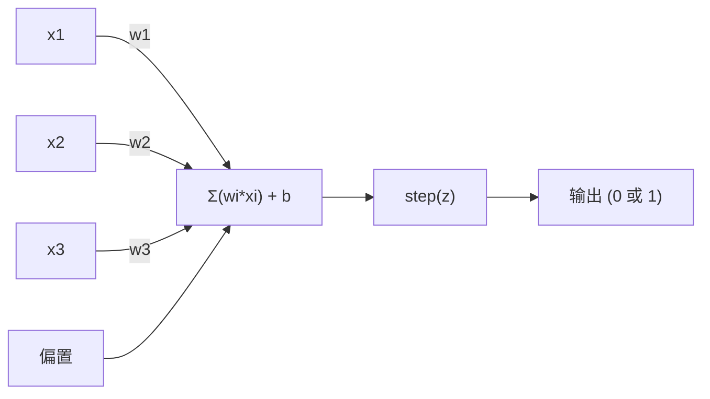
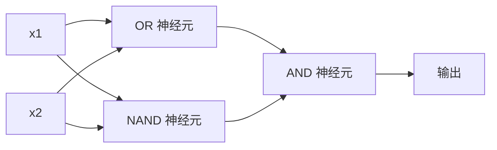

# 感知机

> 感知机是神经网络的原子。把它拆开，你会看到权重、偏置和一个决策。

**类型：** 构建
**语言：** Python
**前置要求：** 第一阶段（线性代数直觉）
**时间：** 约 60 分钟

## 学习目标

- 从零实现一个感知机，包括权重更新规则和阶跃激活函数
- 解释为什么单个感知机只能解决线性可分问题，并演示 XOR 失败案例
- 通过组合 OR、NAND 和 AND 门构建多层感知机来解决 XOR
- 训练一个双层网络，使用 sigmoid 激活和反向传播自动学习 XOR

## 问题

你已经知道向量和点积。你知道矩阵可以将输入转换为输出。但机器是如何*学习*使用哪种变换的？

感知机回答了这个问题。这是最简单的学习机器：取一些输入，乘以权重，加一个偏置，做一个二元决策。然后调整。就这样。每一个构建过的神经网络都是将这个思想层层堆叠在一起。

理解感知机意味着理解"学习"在代码中实际意味着什么：不断调整数值，直到输出与现实匹配。

## 概念

### 一个神经元，一个决策

感知机接收 n 个输入，每个输入乘以一个权重，求和，加一个偏置，然后通过激活函数传递结果。



阶跃函数很粗暴：如果加权和加上偏置 >= 0，输出 1。否则，输出 0。

```
step(z) = 1  若 z >= 0
           0  若 z < 0
```

这是一个线性分类器。权重和偏置定义了一条线（在更高维度是超平面），将输入空间分成两个区域。

### 决策边界

对于两个输入，感知机在二维空间中画一条线：

```
  x2
  ┤
  │  类别 1        /
  │    (0)          /
  │                /
  │               / w1·x1 + w2·x2 + b = 0
  │              /
  │             /     类别 2
  │            /        (1)
  ┼───────────/──────────── x1
```

线一侧的所有内容输出 0，另一侧输出 1。训练移动这条线，直到它正确分离了两个类别。

### 学习规则

感知机的学习规则很简单：

```
对于每个训练样本 (x, y_true):
    y_pred = predict(x)
    error = y_true - y_pred

    对于每个权重:
        w_i = w_i + learning_rate * error * x_i
    bias = bias + learning_rate * error
```

如果预测正确，error = 0，什么都不变。如果它预测 0 但应该是 1，权重增加。如果它预测 1 但应该是 0，权重减少。学习率控制每次调整的幅度。

### XOR 问题

这就是它失效的地方。看看这些逻辑门：

```
AND 门:           OR 门:            XOR 门:
x1  x2  out         x1  x2  out         x1  x2  out
0   0   0           0   0   0           0   0   0
0   1   0           0   1   1           0   1   1
1   0   0           1   0   1           1   0   1
1   1   1           1   1   1           1   1   0
```

AND 和 OR 是线性可分的：你可以画一条单独的线把 0 和 1 分开。XOR 不是。没有一条单独的线可以把 [0,1] 和 [1,0] 从 [0,0] 和 [1,1] 中分开。

```
AND (可分):        XOR (不可分):

  x2                      x2
  1 ┤  0     1            1 ┤  1     0
    │     /                 │
  0 ┤  0 / 0              0 ┤  0     1
    ┼──/──────── x1         ┼──────────── x1
       这条线有效!           没有单独的线能工作!
```

这是一个根本性的限制。单个感知机只能解决线性可分问题。Minsky 和 Papert 在 1969 年证明了这一点，它几乎扼杀了神经网络研究长达十年。

解决方法是：将感知机堆叠成层。多层感知机可以通过将两个线性决策组合成一个非线性决策来解决 XOR。

## 从零构建

### 第 1 步：Perceptron 类

```python
class Perceptron:
    def __init__(self, n_inputs, learning_rate=0.1):
        self.weights = [0.0] * n_inputs
        self.bias = 0.0
        self.lr = learning_rate

    def predict(self, inputs):
        total = sum(w * x for w, x in zip(self.weights, inputs))
        total += self.bias
        return 1 if total >= 0 else 0

    def train(self, training_data, epochs=100):
        for epoch in range(epochs):
            errors = 0
            for inputs, target in training_data:
                prediction = self.predict(inputs)
                error = target - prediction
                if error != 0:
                    errors += 1
                    for i in range(len(self.weights)):
                        self.weights[i] += self.lr * error * inputs[i]
                    self.bias += self.lr * error
            if errors == 0:
                print(f"在第 {epoch + 1} 轮收敛")
                return
        print(f"{epochs} 轮后未收敛")
```

### 第 2 步：在逻辑门上训练

```python
and_data = [
    ([0, 0], 0),
    ([0, 1], 0),
    ([1, 0], 0),
    ([1, 1], 1),
]

or_data = [
    ([0, 0], 0),
    ([0, 1], 1),
    ([1, 0], 1),
    ([1, 1], 1),
]

not_data = [
    ([0], 1),
    ([1], 0),
]

print("=== AND 门 ===")
p_and = Perceptron(2)
p_and.train(and_data)
for inputs, _ in and_data:
    print(f"  {inputs} -> {p_and.predict(inputs)}")

print("\n=== OR 门 ===")
p_or = Perceptron(2)
p_or.train(or_data)
for inputs, _ in or_data:
    print(f"  {inputs} -> {p_or.predict(inputs)}")

print("\n=== NOT 门 ===")
p_not = Perceptron(1)
p_not.train(not_data)
for inputs, _ in not_data:
    print(f"  {inputs} -> {p_not.predict(inputs)}")
```

### 第 3 步：观察 XOR 失败

```python
xor_data = [
    ([0, 0], 0),
    ([0, 1], 1),
    ([1, 0], 1),
    ([1, 1], 0),
]

print("\n=== XOR 门（单个感知机）===")
p_xor = Perceptron(2)
p_xor.train(xor_data, epochs=1000)
for inputs, expected in xor_data:
    result = p_xor.predict(inputs)
    status = "OK" if result == expected else "错误"
    print(f"  {inputs} -> {result} (期望 {expected}) {status}")
```

它永远不会收敛。这是单个感知机无法学习 XOR 的硬证明。

### 第 4 步：用两层解决 XOR

诀窍是：XOR = (x1 OR x2) AND NOT (x1 AND x2)。组合三个感知机：



```python
def xor_network(x1, x2):
    or_neuron = Perceptron(2)
    or_neuron.weights = [1.0, 1.0]
    or_neuron.bias = -0.5

    nand_neuron = Perceptron(2)
    nand_neuron.weights = [-1.0, -1.0]
    nand_neuron.bias = 1.5

    and_neuron = Perceptron(2)
    and_neuron.weights = [1.0, 1.0]
    and_neuron.bias = -1.5

    hidden1 = or_neuron.predict([x1, x2])
    hidden2 = nand_neuron.predict([x1, x2])
    output = and_neuron.predict([hidden1, hidden2])
    return output


print("\n=== XOR 门（多层网络）===")
for inputs, expected in xor_data:
    result = xor_network(inputs[0], inputs[1])
    print(f"  {inputs} -> {result} (期望 {expected})")
```

全部四个案例正确。将感知机堆叠成层可以创建单个感知机无法产生的决策边界。

### 第 5 步：训练双层网络

第 4 步手工连接了权重。这对 XOR 有效，但对实际问题无效，因为你不知道正确的权重是多少。解决方法是：用 sigmoid 替换阶跃函数，通过反向传播自动学习权重。

```python
class TwoLayerNetwork:
    def __init__(self, learning_rate=0.5):
        import random
        random.seed(0)
        self.w_hidden = [[random.uniform(-1, 1), random.uniform(-1, 1)] for _ in range(2)]
        self.b_hidden = [random.uniform(-1, 1), random.uniform(-1, 1)]
        self.w_output = [random.uniform(-1, 1), random.uniform(-1, 1)]
        self.b_output = random.uniform(-1, 1)
        self.lr = learning_rate

    def sigmoid(self, x):
        import math
        x = max(-500, min(500, x))
        return 1.0 / (1.0 + math.exp(-x))

    def forward(self, inputs):
        self.inputs = inputs
        self.hidden_outputs = []
        for i in range(2):
            z = sum(w * x for w, x in zip(self.w_hidden[i], inputs)) + self.b_hidden[i]
            self.hidden_outputs.append(self.sigmoid(z))
        z_out = sum(w * h for w, h in zip(self.w_output, self.hidden_outputs)) + self.b_output
        self.output = self.sigmoid(z_out)
        return self.output

    def train(self, training_data, epochs=10000):
        for epoch in range(epochs):
            total_error = 0
            for inputs, target in training_data:
                output = self.forward(inputs)
                error = target - output
                total_error += error ** 2

                d_output = error * output * (1 - output)

                saved_w_output = self.w_output[:]
                hidden_deltas = []
                for i in range(2):
                    h = self.hidden_outputs[i]
                    hd = d_output * saved_w_output[i] * h * (1 - h)
                    hidden_deltas.append(hd)

                for i in range(2):
                    self.w_output[i] += self.lr * d_output * self.hidden_outputs[i]
                self.b_output += self.lr * d_output

                for i in range(2):
                    for j in range(len(inputs)):
                        self.w_hidden[i][j] += self.lr * hidden_deltas[i] * inputs[j]
                    self.b_hidden[i] += self.lr * hidden_deltas[i]
```

```python
net = TwoLayerNetwork(learning_rate=2.0)
net.train(xor_data, epochs=10000)
for inputs, expected in xor_data:
    result = net.forward(inputs)
    predicted = 1 if result >= 0.5 else 0
    print(f"  {inputs} -> {result:.4f} (四舍五入: {predicted}, 期望 {expected})")
```

与第 4 步有两个关键区别。首先，sigmoid 替换了阶跃函数——它是光滑的，所以存在梯度。其次，`train` 方法将误差从输出反向传播到隐藏层，按每个权重对误差的贡献比例调整它们。这就是 20 行代码中的反向传播。

这是第 03 课的桥梁。`d_output` 和 `hidden_deltas` 背后的数学是链式法则在网络图上的应用。我们将在那里正确地推导它。

## 使用框架

你从零构建的所有东西只需一个导入：

```python
from sklearn.linear_model import Perceptron as SkPerceptron
import numpy as np

X = np.array([[0,0],[0,1],[1,0],[1,1]])
y = np.array([0, 0, 0, 1])

clf = SkPerceptron(max_iter=100, tol=1e-3)
clf.fit(X, y)
print([clf.predict([x])[0] for x in X])
```

五行。你的 30 行 `Perceptron` 类做的是同样的事情。sklearn 版本增加了收敛检查、多种损失函数和稀疏输入支持——但核心循环是相同的：加权和、阶跃函数、误差时的权重更新。

真正的差距体现在规模上。生产网络中的变化：

- 阶跃函数变成 sigmoid、ReLU 或其他平滑激活函数
- 权重通过反向传播自动学习（第 03 课）
- 层数更深：3、10、100+ 层
- 同样的原理：每一层从前一层的输出中创建新特征

单个感知机只能画直线。堆叠它们，你就可以画任意形状。

## 交付物

本课产出：
- `outputs/skill-perceptron.md` - 一个技能文档，涵盖何时需要单层与多层架构

## 练习

1. 在 NAND 门上训练感知机（通用门——任何逻辑电路都可以由 NAND 构建）。验证其权重和偏置形成一个有效的决策边界。
2. 修改 Perceptron 类以跟踪每一轮的决策边界（w1*x1 + w2*x2 + b = 0）。在 AND 门上训练时打印线是如何移动的。
3. 构建一个 3 输入感知机，只有当 3 个输入中至少 2 个为 1 时才输出 1（多数投票函数）。这是线性可分的吗？为什么？

## 关键术语

| 术语 | 人们怎么说 | 实际含义 |
|------|----------------|----------------------|
| 感知机 (Perceptron) | "一个假神经元" | 一个线性分类器：输入和权重的点积，加偏置，通过阶跃函数 |
| 权重 (Weight) | "一个输入有多重要" | 一个乘数，缩放每个输入对决策的贡献 |
| 偏置 (Bias) | "阈值" | 一个常数，移动决策边界，让感知机即使在零输入时也能激活 |
| 激活函数 (Activation function) | "压缩数值的东西" | 在加权和之后应用的函数——感知机用阶跃函数，现代网络用 sigmoid/ReLU |
| 线性可分 (Linearly separable) | "你能在它们之间画一条线" | 一个数据集，其中单个超平面可以完美分离两个类别 |
| XOR 问题 (XOR problem) | "感知机做不到的事" | 证明单层网络无法学习非线性可分函数 |
| 决策边界 (Decision boundary) | "分类器切换的地方" | 超平面 w*x + b = 0，将输入空间划分为两个类别 |
| 多层感知机 (Multi-layer perceptron) | "真正的神经网络" | 感知机按层堆叠，每一层的输出作为下一层的输入 |

## 延伸阅读

- Frank Rosenblatt, "The Perceptron: A Probabilistic Model for Information Storage and Organization in the Brain" (1958) -- 开创一切的原始论文
- Minsky & Papert, "Perceptrons" (1969) -- 证明了 XOR 单层网络无法解决并扼杀感知机研究十年的书
- Michael Nielsen, "Neural Networks and Deep Learning", Chapter 1 (http://neuralnetworksanddeeplearning.com/) -- 免费在线，对感知机如何组合成网络提供了最好的可视化解释