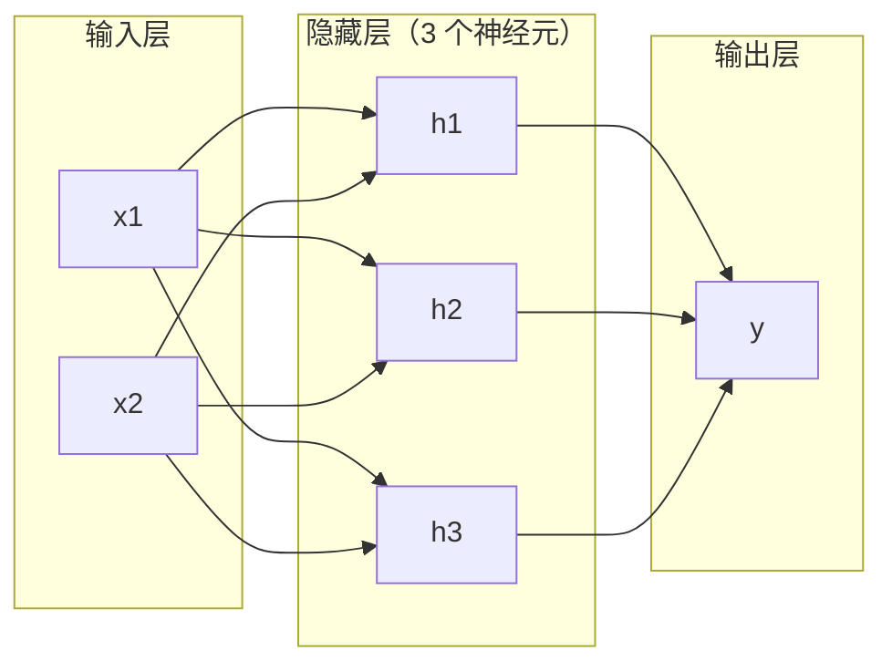
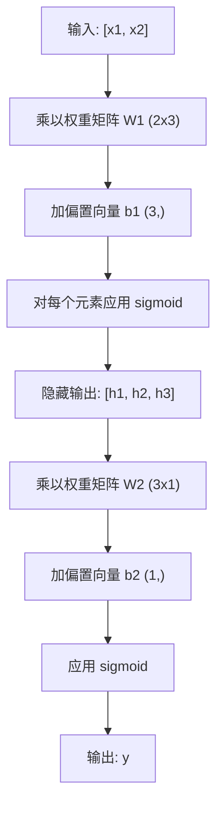

# 多层网络与前向传播

> 一个神经元画一条线。堆叠它们，你就能画任何形状。

**类型：** 构建
**语言：** Python
**前置要求：** 第一阶段（数学基础），第 03.01 课（感知机）
**时间：** 约 90 分钟

## 学习目标

- 构建一个多层网络，包含 Layer 和 Network 类，执行完整的前向传播
- 跟踪网络每一层的矩阵维度，识别维度不匹配问题
- 解释堆叠非线性激活如何使网络学习弯曲的决策边界
- 使用手工调参的 sigmoid 权重通过 2-2-1 架构解决 XOR 问题

## 问题

单个神经元是一个画线器。就这样。一条穿过数据的直线。AI 中的每一个实际问题——图像识别、语言理解、下围棋——都需要曲线。将神经元堆叠成层就是你获得曲线的方式。

1969 年，Minsky 和 Papert 证明了这一限制是致命的：单层网络无法学习 XOR。不是"努力学习"——而是数学上不可能。XOR 真值表将 [0,1] 和 [1,0] 放在一边，[0,0] 和 [1,1] 放在另一边。没有一条单独的线能分开它们。

这导致神经网络研究资金停滞了十多年。解决方法后来看显而易见：别再用一层了。把神经元堆叠成层。让第一层将输入空间雕刻成新的特征，让第二层将这些特征组合成单个线无法做出的决策。

那个堆叠就是多层网络。它是当今生产中每一个深度学习模型的基础。前向传播——数据从输入流经隐藏层到输出——是在其他任何东西工作之前你需要构建的第一个东西。

## 概念

### 层：输入层、隐藏层、输出层

多层网络有三种类型的层：

**输入层**——其实不是一层。它保存你的原始数据。两个特征意味着两个输入节点。这里不发生计算。

**隐藏层**——这是工作发生的地方。每个神经元取前一层的每个输出，应用权重和偏置，然后将结果通过激活函数。"隐藏"是因为你从不直接在训练数据中看到这些值。

**输出层**——最终的答案。对于二分类，一个带 sigmoid 的神经元。对于多分类，每个类别一个神经元。



这是一个 2-3-1 网络。两个输入，三个隐藏神经元，一个输出。每条连接都带有一个权重。每个神经元（除了输入）都带有一个偏置。

每一层产生一个称为隐藏状态的数字向量。对于文本，隐藏状态增加维度——将一个词编码为 768 个数字以捕捉语义含义。对于图像，它们减少维度——将数百万像素压缩成可管理的表示。隐藏状态就是学习存在的地方。

### 神经元与激活

每个神经元做三件事：

1. 将每个输入乘以对应的权重
2. 将所有乘积求和并加一个偏置
3. 将和通过激活函数

目前，激活函数是 sigmoid：

```
sigmoid(z) = 1 / (1 + e^(-z))
```

Sigmoid 将任何数字压缩到 (0, 1) 范围。大正输入推向 1。大负输入推向 0。零映射到 0.5。这个平滑曲线使学习成为可能——与感知机的硬阶跃不同，sigmoid 处处都有梯度。

### 前向传播：数据如何流动

前向传播将输入数据推送通过网络，一层一层，直到到达输出。前向传播过程中不发生学习。它是纯计算：乘、加、激活、重复。



在每一层，三个操作按顺序发生：

```
z = W * input + b       (线性变换)
a = sigmoid(z)           (激活)
```

一层的输出成为下一层的输入。这就是整个前向传播。

### 矩阵维度

跟踪维度是深度学习中最重要的调试技能。这里是 2-3-1 网络：

| 步骤 | 操作 | 维度 | 结果形状 |
|------|-----------|------------|-------------|
| 输入 | x | -- | (2,) |
| 隐藏线性 | W1 * x + b1 | W1: (3, 2), b1: (3,) | (3,) |
| 隐藏激活 | sigmoid(z1) | -- | (3,) |
| 输出线性 | W2 * h + b2 | W2: (1, 3), b2: (1,) | (1,) |
| 输出激活 | sigmoid(z2) | -- | (1,) |

规则：第 k 层的权重矩阵 W 的形状为（当前层神经元数，前一层神经元数）。行匹配当前层。列匹配前一层。如果形状不对齐，就有 bug。

### 万有逼近定理

1989 年，George Cybenko 证明了一个了不起的结论：具有单个隐藏层和足够多神经元的神经网络可以以任意精度逼近任何连续函数。

这并不意味着一个隐藏层总是最好的。它意味着该架构在理论上是可行的。在实践中，更深的网络（更多层，每层更少神经元）用比浅而宽的网络少得多的总参数学习相同的函数。这就是深度学习有效的原因。

直觉：隐藏层中的每个神经元学习一个"凸起"或特征。足够多的凸起放在正确的位置可以逼近任何平滑曲线。更多神经元，更多凸起，更好的逼近。


### 可组合性

神经网络是可组合的。你可以堆叠它们、链接它们、并行运行它们。Whisper 模型使用一个编码器网络处理音频，一个独立的解码器网络生成文本。现代 LLM 是纯解码器的。BERT 是纯编码器的。T5 是编码器-解码器。架构选择决定了模型能做什么。

## 从零构建

纯 Python。不用 numpy。每个矩阵操作都从零编写。

### 第 1 步：Sigmoid 激活

```python
import math

def sigmoid(x):
    x = max(-500.0, min(500.0, x))
    return 1.0 / (1.0 + math.exp(-x))
```

夹紧到 [-500, 500] 防止溢出。`math.exp(500)` 是大的但有限的。`math.exp(1000)` 是无穷大。

### 第 2 步：Layer 类

整个深度学习中最重要的操作是矩阵乘法。每一层，每一个注意力头，每一次前向传播——都是矩阵乘法。一个线性层取一个输入向量，乘以一个权重矩阵，加一个偏置向量：y = Wx + b。这一个方程是神经网络中 90% 的计算量。

一层持有一个权重矩阵和一个偏置向量。它的 forward 方法取一个输入向量，返回激活后的输出。

```python
class Layer:
    def __init__(self, n_inputs, n_neurons, weights=None, biases=None):
        if weights is not None:
            self.weights = weights
        else:
            import random
            self.weights = [
                [random.uniform(-1, 1) for _ in range(n_inputs)]
                for _ in range(n_neurons)
            ]
        if biases is not None:
            self.biases = biases
        else:
            self.biases = [0.0] * n_neurons

    def forward(self, inputs):
        self.last_input = inputs
        self.last_output = []
        for neuron_idx in range(len(self.weights)):
            z = sum(
                w * x for w, x in zip(self.weights[neuron_idx], inputs)
            )
            z += self.biases[neuron_idx]
            self.last_output.append(sigmoid(z))
        return self.last_output
```

权重矩阵的形状为 (n_neurons, n_inputs)。每一行是一个神经元在所有输入上的权重。forward 方法遍历神经元，计算加权和加偏置，应用 sigmoid，收集结果。

### 第 3 步：Network 类

网络是一个层的列表。前向传播将它们链接起来：第 k 层的输出送到第 k+1 层。

```python
class Network:
    def __init__(self, layers):
        self.layers = layers

    def forward(self, inputs):
        current = inputs
        for layer in self.layers:
            current = layer.forward(current)
        return current
```

这就是整个前向传播。四行逻辑。数据进去，流过每一层，从另一端出来。

### 第 4 步：用手工调参的权重做 XOR

在第 01 课中，我们通过组合 OR、NAND 和 AND 感知机解决了 XOR。现在用我们的 Layer 和 Network 类做同样的事情。2-2-1 架构：两个输入，两个隐藏神经元，一个输出。

```python
hidden = Layer(
    n_inputs=2,
    n_neurons=2,
    weights=[[20.0, 20.0], [-20.0, -20.0]],
    biases=[-10.0, 30.0],
)

output = Layer(
    n_inputs=2,
    n_neurons=1,
    weights=[[20.0, 20.0]],
    biases=[-30.0],
)

xor_net = Network([hidden, output])

xor_data = [
    ([0, 0], 0),
    ([0, 1], 1),
    ([1, 0], 1),
    ([1, 1], 0),
]

for inputs, expected in xor_data:
    result = xor_net.forward(inputs)
    predicted = 1 if result[0] >= 0.5 else 0
    print(f"  {inputs} -> {result[0]:.6f} (四舍五入: {predicted}, 期望: {expected})")
```

大权重（20, -20）使 sigmoid 像阶跃函数一样工作。第一个隐藏神经元逼近 OR。第二个逼近 NAND。输出神经元将它们组合成 AND，也就是 XOR。

### 第 5 步：圆分类

一个更难的问题：将二维点分类为在圆内或圆外，圆心在原点，半径为 0.5。这需要弯曲的决策边界——单个感知机不可能做到。

```python
import random
import math

random.seed(42)

data = []
for _ in range(200):
    x = random.uniform(-1, 1)
    y = random.uniform(-1, 1)
    label = 1 if (x * x + y * y) < 0.25 else 0
    data.append(([x, y], label))

circle_net = Network([
    Layer(n_inputs=2, n_neurons=8),
    Layer(n_inputs=8, n_neurons=1),
])
```

用随机权重，网络不会分类得很好。但前向传播仍然能运行。重点在这里——前向传播只是计算。学习正确的权重是反向传播，在第 03 课中介绍。

```python
correct = 0
for inputs, expected in data:
    result = circle_net.forward(inputs)
    predicted = 1 if result[0] >= 0.5 else 0
    if predicted == expected:
        correct += 1

print(f"随机权重准确率: {correct}/{len(data)} ({100*correct/len(data):.1f}%)")
```

随机权重给出很差的准确率——通常比猜测多数类还差。训练之后（第 03 课），同样的架构用 8 个隐藏神经元会画出一条弯曲的边界，将内部和外部分开。

## 使用框架

PyTorch 用四行代码完成以上所有：

```python
import torch
import torch.nn as nn

model = nn.Sequential(
    nn.Linear(2, 8),
    nn.Sigmoid(),
    nn.Linear(8, 1),
    nn.Sigmoid(),
)

x = torch.tensor([[0.0, 0.0], [0.0, 1.0], [1.0, 0.0], [1.0, 1.0]])
output = model(x)
print(output)
```

`nn.Linear(2, 8)` 就是你的 Layer 类：形状为 (8, 2) 的权重矩阵，形状为 (8,) 的偏置向量。`nn.Sigmoid()` 就是你的 sigmoid 函数，逐元素应用。`nn.Sequential` 就是你的 Network 类：按顺序链接层。

区别在于速度和规模。PyTorch 在 GPU 上运行，处理数百万样本的批次，自动计算反向传播的梯度。但前向传播的逻辑和你从零构建的完全相同。

## 交付物

本课产出一个用于设计网络架构的可复用提示词：

- `outputs/prompt-network-architect.md`

当你需要决定给定问题需要多少层、每层多少神经元、以及使用哪些激活函数时使用它。

## 练习

1. 构建一个 2-4-2-1 网络（两个隐藏层），用随机权重在 XOR 数据上运行前向传播。打印中间隐藏层输出，观察每层的表示如何转换。

2. 将圆分类器的隐藏层大小从 8 改为 2，然后再改为 32。每次用随机权重运行前向传播。隐藏神经元的数量是否改变了输出范围或分布？为什么？

3. 在 Network 类上实现一个 `count_parameters` 方法，返回可训练权重和偏置的总数。在 784-256-128-10 网络（经典的 MNIST 架构）上测试它。它有多少参数？

4. 为 3-4-4-2 网络构建前向传播。输入 RGB 颜色值（归一化到 0-1），观察两个输出。这是一个简单颜色分类器的架构，有两个类别。

5. 用"泄漏阶跃"函数替换 sigmoid：如果 z < 0 返回 0.01 * z，否则返回 1.0。用第 4 步相同的手工调参权重在 XOR 上运行前向传播。它还能工作吗？为什么平滑的 sigmoid 比硬截断更受欢迎？

## 关键术语

| 术语 | 人们怎么说 | 实际含义 |
|------|----------------|----------------------|
| 前向传播 (Forward pass) | "运行模型" | 将输入推送通过每一层——乘以权重，加偏置，激活——产生输出 |
| 隐藏层 (Hidden layer) | "中间部分" | 输入层和输出层之间的任何一层，其值不在数据中直接观察 |
| 多层网络 (Multi-layer network) | "深度神经网络" | 神经元按顺序堆叠的层，每一层的输出作为下一层的输入 |
| 激活函数 (Activation function) | "非线性部分" | 在线型变换之后应用的函数，将曲线引入决策边界 |
| Sigmoid | "S 曲线" | sigma(z) = 1/(1+e^(-z))，将任何实数压缩到 (0,1)，处处光滑且可微 |
| 权重矩阵 (Weight matrix) | "参数" | 形状为（当前层神经元数，前一层神经元数）的矩阵 W，包含可学习的连接强度 |
| 偏置向量 (Bias vector) | "偏移量" | 矩阵乘法之后加上的向量，让神经元即使所有输入为零时也能激活 |
| 万有逼近 (Universal approximation) | "神经网络能学习任何东西" | 具有足够多神经元的单隐藏层可以逼近任何连续函数——但"足够多"可能意味着数十亿 |
| 线性变换 (Linear transformation) | "矩阵乘法步骤" | z = W * x + b，激活前的计算，将输入映射到新空间 |
| 决策边界 (Decision boundary) | "分类器切换的地方" | 网络输出跨越分类阈值的输入空间中的曲面 |

## 延伸阅读

- Michael Nielsen, "Neural Networks and Deep Learning", Chapter 1-2 (http://neuralnetworksanddeeplearning.com/) -- 对前向传播和网络结构最清晰免费解释，带有交互式可视化
- Cybenko, "Approximation by Superpositions of a Sigmoidal Function" (1989) -- 原始万有逼近定理论文，出乎意料地易读
- 3Blue1Brown, "But what is a neural network?" (https://www.youtube.com/watch?v=aircAruvnKk) -- 20 分钟的可视化演练，讲解层、权重和前向传播，建立正确的心理模型
- Goodfellow, Bengio, Courville, "Deep Learning", Chapter 6 (https://www.deeplearningbook.org/) -- 多层网络的标准参考，免费在线