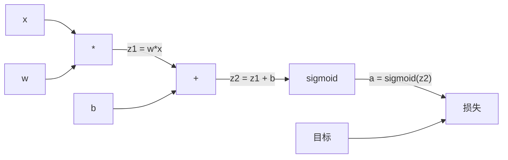
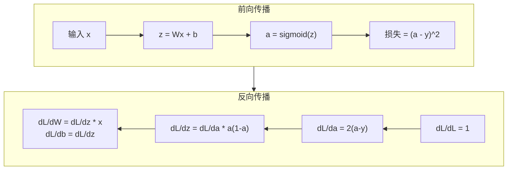

# 从零实现反向传播

> 反向传播是使学习成为可能的算法。没有它，神经网络只是昂贵的随机数生成器。

**类型：** 构建
**语言：** Python
**前置条件：** 第 03.02 课（多层网络）
**时间：** 约 120 分钟

## 学习目标

- 实现一个基于 Value 的自动求导引擎，通过计算图和拓扑排序来计算梯度
- 利用链式法则推导加法、乘法和 sigmoid 的反向传播过程
- 仅使用从零构建的反向传播引擎，在 XOR 和圆分类任务上训练多层网络
- 识别深度 sigmoid 网络中的梯度消失问题，并解释梯度为何会指数级缩小

## 问题

你的网络有一个隐藏层，包含 768 个输入和 3072 个输出。共有 2,359,296 个权重。它产生了一个错误的预测。哪些权重导致了误差？逐一测试每个权重意味着 230 万次前向传播。反向传播在一次反向传播中计算出全部 230 万个梯度。这不是优化。这是"可训练"与"不可能"之间的差别。

朴素的方法：取一个权重，微调一下，再跑一次前向传播，测量损失是上升还是下降。这样你就得到了该权重的梯度。然后对网络中的每个权重重复上述操作。乘以数千个训练步骤和数百万个数据点。你需要地质年代的时间来训练任何有用的东西。

反向传播解决了这个问题。一次前向传播，一次反向传播，所有梯度全部算出。诀窍在于系统化地应用微积分中的链式法则到计算图上。这正是使深度学习变得实用的算法。没有它，我们仍会困在玩具问题上。

## 概念

### 链式法则在网络中的应用

你在第一阶段的第 05 课见过链式法则。简要回顾：如果 y = f(g(x))，则 dy/dx = f'(g(x)) * g'(x)。你沿着链把导数相乘。

在神经网络中，"链"是从输入到损失的运算序列。每一层应用权重，加上偏置，通过激活函数。损失函数将最终输出与目标进行比较。反向传播沿这条链反向追溯，计算每个运算对误差的贡献。

### 计算图

每一次前向传播都会构建一张图。每个节点是一个运算（乘法、加法、sigmoid）。每条边向前携带值，向后携带梯度。



前向传播：值从左向右流动。x 和 w 生成 z1 = w*x。加上 b 得到 z2。Sigmoid 输出激活值 a。用损失函数将 a 与目标 y 比较。

反向传播：梯度从右向左流动。从 dL/da（损失如何随激活值变化）开始。乘以 da/dz2（sigmoid 的导数）。这给出 dL/dz2。然后分成 dL/db（等于 dL/dz2，因为 z2 = z1 + b）和 dL/dz1。接着 dL/dw = dL/dz1 * x，dL/dx = dL/dz1 * w。

图中每个节点在反向传播时有一项工作：接收来自上方的梯度，乘以其局部导数，然后向下传递。

### 前向传播与反向传播



前向传播存储每个中间值：z、a、每一层的输入。反向传播需要这些存储的值来计算梯度。这就是反向传播的核心——内存与计算的权衡。你用内存（存储激活值）换取速度（一次传播代替数百万次）。

### 梯度在网络中的流动

对于一个3 层网络，梯度穿过每一层链式传播：


在每一层，梯度都乘以 sigmoid 的导数。Sigmoid 的导数是 a * (1 - a)，最大值是 0.25（当 a = 0.5 时）。三层之后，梯度最多被乘以 0.25³ = 0.0156。十层之后：0.25¹⁰ = 0.000001。

### 梯度消失

这就是梯度消失问题。Sigmoid 将输出压缩到 0 和 1 之间。它的导数始终小于 0.25。堆叠足够多的 sigmoid 层，梯度就会缩小到零。早期的层几乎学不到东西，因为它们接收到接近于零的梯度。

```
sigmoid(z):     输出范围 [0, 1]
sigmoid'(z):    最大值 0.25（当 z = 0 时）

5 层之后：      梯度 * 0.25^5 = 0.001 倍原始值
10 层之后：     梯度 * 0.25^10 = 0.000001 倍原始值
```

这就是深度 sigmoid 网络几乎无法训练的原因。解决方案——ReLU 及其变体——是第 04 课的主题。现在要理解的是反向传播本身是完美工作的。问题在于它所经过的路径。

### 推导两层网络的梯度

具体数学：一个网络，包含输入 x、sigmoid 隐藏层、sigmoid 输出层和 MSE 损失。

前向传播：
```
z1 = W1 * x + b1
a1 = sigmoid(z1)
z2 = W2 * a1 + b2
a2 = sigmoid(z2)
L = (a2 - y)^2
```

反向传播（逐步应用链式法则）：
```
dL/da2 = 2(a2 - y)
da2/dz2 = a2 * (1 - a2)
dL/dz2 = dL/da2 * da2/dz2 = 2(a2 - y) * a2 * (1 - a2)

dL/dW2 = dL/dz2 * a1
dL/db2 = dL/dz2

dL/da1 = dL/dz2 * W2
da1/dz1 = a1 * (1 - a1)
dL/dz1 = dL/da1 * da1/dz1

dL/dW1 = dL/dz1 * x
dL/db1 = dL/dz1
```

每个梯度都是从损失回溯的局部导数的乘积。这就是反向传播的全部。

## 动手实现

### 第 1 步：Value 节点

我们计算中的每个数都成为一个 Value。它存储自己的数据、梯度和创建方式（以便知道如何反向计算梯度）。

```python
class Value:
    def __init__(self, data, children=(), op=''):
        self.data = data
        self.grad = 0.0
        self._backward = lambda: None
        self._children = set(children)
        self._op = op

    def __repr__(self):
        return f"Value(data={self.data:.4f}, grad={self.grad:.4f})"
```

尚无梯度（0.0）。尚无反向函数（空操作）。`_children` 追踪哪些 Value 产生了这个 Value，以便后续对图进行拓扑排序。

### 第 2 步：带有反向函数的运算

每个运算创建一个新的 Value，并定义梯度如何反向流经它。

```python
def __add__(self, other):
    other = other if isinstance(other, Value) else Value(other)
    out = Value(self.data + other.data, (self, other), '+')

    def _backward():
        self.grad += out.grad
        other.grad += out.grad

    out._backward = _backward
    return out

def __mul__(self, other):
    other = other if isinstance(other, Value) else Value(other)
    out = Value(self.data * other.data, (self, other), '*')

    def _backward():
        self.grad += other.data * out.grad
        other.grad += self.data * out.grad

    out._backward = _backward
    return out
```

对于加法：d(a+b)/da = 1，d(a+b)/db = 1。因此两个输入直接获得输出的梯度。

对于乘法：d(a*b)/da = b，d(a*b)/db = a。每个输入获得另一个的值乘以输出梯度。

`+=` 是关键。一个 Value 可能在多个运算中被使用。它的梯度是所有路径的梯度之和。

### 第 3 步：Sigmoid 和损失

```python
import math

def sigmoid(self):
    x = self.data
    x = max(-500, min(500, x))
    s = 1.0 / (1.0 + math.exp(-x))
    out = Value(s, (self,), 'sigmoid')

    def _backward():
        self.grad += (s * (1 - s)) * out.grad

    out._backward = _backward
    return out
```

Sigmoid 导数：sigmoid(x) * (1 - sigmoid(x))。我们在前向传播时已经计算了 sigmoid(x) = s。复用它。不需要额外计算。

```python
def mse_loss(predicted, target):
    diff = predicted + Value(-target)
    return diff * diff
```

单个输出的 MSE：(predicted - target)²。我们用加上一个取反的 Value 来表示减法。

### 第 4 步：反向传播

拓扑排序确保我们按正确顺序处理节点——一个节点的梯度在被传播之前已完全累积。

```python
def backward(self):
    topo = []
    visited = set()

    def build_topo(v):
        if v not in visited:
            visited.add(v)
            for child in v._children:
                build_topo(child)
            topo.append(v)

    build_topo(self)
    self.grad = 1.0
    for v in reversed(topo):
        v._backward()
```

从损失开始（梯度 = 1.0，因为 dL/dL = 1）。沿排好序的图向后遍历。每个节点的 `_backward` 将梯度向下传递给它的子节点。

### 第 5 步：层与网络

```python
import random

class Neuron:
    def __init__(self, n_inputs):
        scale = (2.0 / n_inputs) ** 0.5
        self.weights = [Value(random.uniform(-scale, scale)) for _ in range(n_inputs)]
        self.bias = Value(0.0)

    def __call__(self, x):
        act = sum((wi * xi for wi, xi in zip(self.weights, x)), self.bias)
        return act.sigmoid()

    def parameters(self):
        return self.weights + [self.bias]


class Layer:
    def __init__(self, n_inputs, n_outputs):
        self.neurons = [Neuron(n_inputs) for _ in range(n_outputs)]

    def __call__(self, x):
        out = [n(x) for n in self.neurons]
        return out[0] if len(out) == 1 else out

    def parameters(self):
        params = []
        for n in self.neurons:
            params.extend(n.parameters())
        return params


class Network:
    def __init__(self, sizes):
        self.layers = []
        for i in range(len(sizes) - 1):
            self.layers.append(Layer(sizes[i], sizes[i + 1]))

    def __call__(self, x):
        for layer in self.layers:
            x = layer(x)
            if not isinstance(x, list):
                x = [x]
        return x[0] if len(x) == 1 else x

    def parameters(self):
        params = []
        for layer in self.layers:
            params.extend(layer.parameters())
        return params

    def zero_grad(self):
        for p in self.parameters():
            p.grad = 0.0
```

一个 Neuron 接收输入，计算加权和 +偏置，然后应用 sigmoid。权重初始化按 sqrt(2/n_inputs) 缩放，以防止在更深的网络中 sigmoid 饱和。一个 Layer 是多个 Neuron 的列表。一个 Network 是多个 Layer 的列表。`parameters()` 方法收集所有可学习的 Value 以便更新。

### 第 6 步：在 XOR 上训练

```python
random.seed(42)
net = Network([2, 4, 1])

xor_data = [
    ([0.0, 0.0], 0.0),
    ([0.0, 1.0], 1.0),
    ([1.0, 0.0], 1.0),
    ([1.0, 1.0], 0.0),
]

learning_rate = 1.0

for epoch in range(1000):
    total_loss = Value(0.0)
    for inputs, target in xor_data:
        x = [Value(i) for i in inputs]
        pred = net(x)
        loss = mse_loss(pred, target)
        total_loss = total_loss + loss

    net.zero_grad()
    total_loss.backward()

    for p in net.parameters():
        p.data -= learning_rate * p.grad

    if epoch % 100 == 0:
        print(f"Epoch {epoch:4d} | Loss: {total_loss.data:.6f}")

print("\nXOR Results:")
for inputs, target in xor_data:
    x = [Value(i) for i in inputs]
    pred = net(x)
    print(f"  {inputs} -> {pred.data:.4f} (expected {target})")
```

观察损失下降。从随机预测到正确的 XOR 输出，完全由反向传播计算梯度和向正确方向调整权重所驱动。

### 第 7 步：圆分类

在第 02 课中，你手动调整了圆分类的权重。现在让网络自己学习它们。

```python
random.seed(7)

def generate_circle_data(n=100):
    data = []
    for _ in range(n):
        x1 = random.uniform(-1.5, 1.5)
        x2 = random.uniform(-1.5, 1.5)
        label = 1.0 if x1 * x1 + x2 * x2 < 1.0 else 0.0
        data.append(([x1, x2], label))
    return data

circle_data = generate_circle_data(80)

circle_net = Network([2, 8, 1])
learning_rate = 0.5

for epoch in range(2000):
    random.shuffle(circle_data)
    total_loss_val = 0.0
    for inputs, target in circle_data:
        x = [Value(i) for i in inputs]
        pred = circle_net(x)
        loss = mse_loss(pred, target)
        circle_net.zero_grad()
        loss.backward()
        for p in circle_net.parameters():
            p.data -= learning_rate * p.grad
        total_loss_val += loss.data

    if epoch % 200 == 0:
        correct = 0
        for inputs, target in circle_data:
            x = [Value(i) for i in inputs]
            pred = circle_net(x)
            predicted_class = 1.0 if pred.data > 0.5 else 0.0
            if predicted_class == target:
                correct += 1
        accuracy = correct / len(circle_data) * 100
        print(f"Epoch {epoch:4d} | Loss: {total_loss_val:.4f} | Accuracy: {accuracy:.1f}%")
```

这里使用在线 SGD——在每个样本之后更新权重，而不是累积整个批次。这能更快地打破对称性，并避免在整个损失曲面上出现 sigmoid 饱和。每个 epoch 打乱数据可以防止网络记忆顺序。

没有手动调整。网络自己发现了圆形决策边界。这就是反向传播的力量：你来定义架构、损失函数和数据。算法自己找出权重。

## 实际使用

PyTorch 只需几行代码就能完成上述所有操作。核心思想完全相同——自动求导在前向传播时构建计算图，然后反向追溯计算梯度。

```python
import torch
import torch.nn as nn

model = nn.Sequential(
    nn.Linear(2, 4),
    nn.Sigmoid(),
    nn.Linear(4, 1),
    nn.Sigmoid(),
)
optimizer = torch.optim.SGD(model.parameters(), lr=1.0)
criterion = nn.MSELoss()

X = torch.tensor([[0,0],[0,1],[1,0],[1,1]], dtype=torch.float32)
y = torch.tensor([[0],[1],[1],[0]], dtype=torch.float32)

for epoch in range(1000):
    pred = model(X)
    loss = criterion(pred, y)
    optimizer.zero_grad()
    loss.backward()
    optimizer.step()

print("PyTorch XOR Results:")
with torch.no_grad():
    for i in range(4):
        pred = model(X[i])
        print(f"  {X[i].tolist()} -> {pred.item():.4f} (expected {y[i].item()})")
```

`loss.backward()` 就是你的 `total_loss.backward()`。`optimizer.step()` 就是你手动写的 `p.data -= lr * p.grad`。`optimizer.zero_grad()` 就是你的 `net.zero_grad()`。相同的算法，工业级实现。PyTorch 处理 GPU 加速、混合精度、梯度检查点以及数百种层类型。但反向传播依旧是相同的链式法则应用在相同的计算图上。

训练流程：前向传播，然后反向传播，然后更新权重。推理只跑前向传播。不需要梯度，不需要更新。这个区别很重要，因为推理才是生产环境中的实际场景。当你调用 Claude 或 GPT这样的 API 时，你就是在做推理——你的提示词向前流经网络，token 从另一端出来。权重不会改变。理解反向传播很重要，因为它塑造了那个网络中每个权重。

## 交付物

本课产出：
- `outputs/prompt-gradient-debugger.md` —— 一个可复用的提示词，用于诊断任意神经网络中的梯度问题（消失、爆炸、NaN）

## 练习

1. 为 Value 类添加 `__sub__` 方法（a - b = a + (-1 * b)）。然后实现 `__neg__` 方法。通过与手动计算 (a - b)² 这样简单表达式的梯度进行比较来验证正确性。

2. 为 Value 添加 `relu` 方法（输出 max(0, x)，导数在 x > 0 时为 1，否则为 0）。在隐藏层中用 relu 替换 sigmoid，再次在 XOR 上训练。比较收敛速度。你应该会看到训练更快——这是第 04 课的预览。

3. 在 Value 上实现整数的 `__pow__` 方法。用它用正确的 `(predicted - target) ** 2` 表达式替换 `mse_loss`。验证梯度与原始实现一致。

4. 在训练循环中添加梯度裁剪：调用 `backward()` 后，将所有梯度裁剪到 [-1, 1]。训练一个更深的网络（4+ 层，使用 sigmoid）并比较有裁剪和无裁剪时的损失曲线。这是你防止梯度爆炸的第一道防线。

5. 构建一个可视化：在 XOR 训练完成后，打印网络中每个参数的梯度。找出哪一层的梯度最小。这展示了你之前在概念部分读到的梯度消失问题。

## 关键术语

| 术语 | 大家怎么说的 | 实际含义 |
|------|----------------|----------------------|
| 反向传播 (Backpropagation) | "网络在学习" | 通过链式法则沿计算图反向应用来计算每个权重的 dL/dw 的算法 |
| 计算图 (Computational graph) | "网络结构" | 有向无环图，节点是运算，边向前携带值（正向）向后携带梯度（反向） |
| 链式法则 (Chain rule) | "把导数乘起来" | 如果 y = f(g(x))，则 dy/dx = f'(g(x)) * g'(x) —— 反向传播的数学基础 |
| 梯度 (Gradient) | "最速上升方向" | 损失相对于参数的偏导数——告诉你如何改变该参数来减少损失 |
| 梯度消失 (Vanishing gradient) | "深层网络学不动" | 梯度在通过带有饱和激活（如 sigmoid）的层传播时指数级缩小 |
| 前向传播 (Forward pass) | "跑网络" | 通过顺序应用每一层的运算并存储中间值来计算输入对应的输出 |
| 反向传播 (Backward pass) | "计算梯度" | 沿计算图反向遍历，使用链式法则在每个节点累积梯度 |
| 学习率 (Learning rate) | "学得多快" | 更新权重时控制步长的标量：w_new = w_old - lr * gradient |
| 拓扑排序 (Topological sort) | "正确的顺序" | 图节点的一种排序，每个节点出现在它依赖的所有节点之后——确保在传播前梯度完全累积 |
| 自动求导 (Autograd) | "自动微分" | 在前向计算时构建计算图并自动计算梯度的系统——PyTorch 引擎所做的 |

## 延伸阅读

- Rumelhart, Hinton & Williams，"通过反向传播误差学习表示"（1986）——使反向传播成为主流并解锁多层网络训练的开创性论文
- 3Blue1Brown，"神经网络"系列（https://www.youtube.com/playlist?list=PLZHQObOWTQDNU6R1_67000Dx_ZCJB-3pi）——关于反向传播和梯度在网络中流动的最佳可视化解释