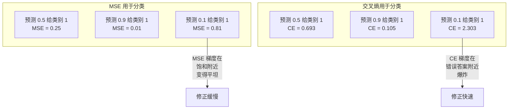
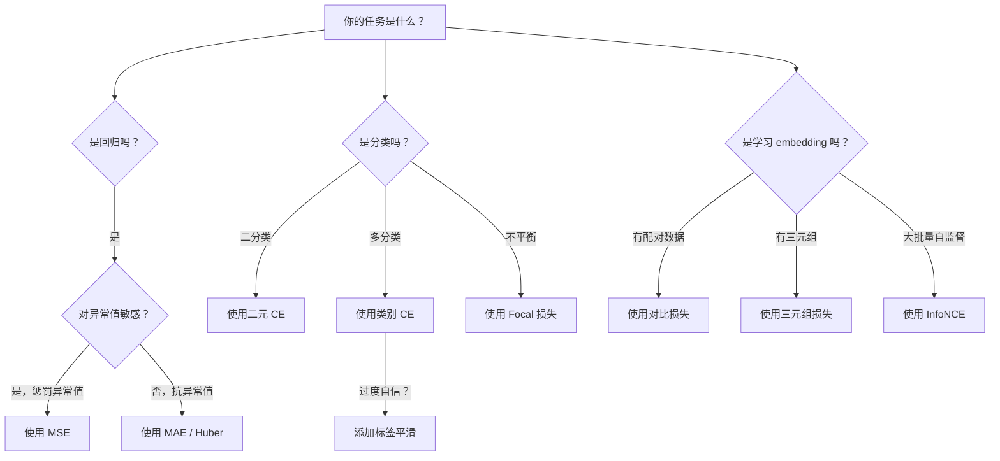
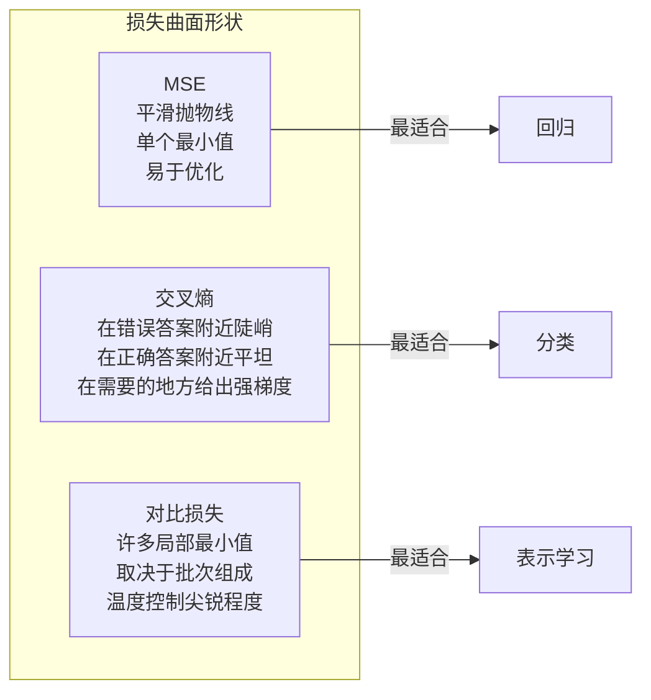

# 损失函数

> 你的网络做了一个预测。真实标签说是另一个答案。它错得有多离谱？这个数字就是损失。选错了损失函数，你的模型就会完全优化到错误的目标上。

**类型：** 构建型
**语言：** Python
**前置条件：** 第 03.04 课（激活函数）
**时间：** 约 75 分钟

## 学习目标

- 从零实现 MSE、二元交叉熵、类别交叉熵和对比损失（InfoNCE），附带梯度计算
- 通过演示"对所有输入都预测 0.5"的失败模式，解释为什么 MSE 无法用于分类
- 将标签平滑应用于交叉熵，并描述它如何防止过度自信的预测
- 为回归、二分类、多分类和 embedding 学习任务选择正确的损失函数

## 问题

一个在分类问题上最小化 MSE 的模型，会对所有输入都自信地预测 0.5。它在最小化损失。它同时也是无用的。

损失函数是模型实际优化的唯一对象。不是准确率，不是 F1 分数，也不是你向老板汇报的指标。优化器取损失函数的梯度，然后调整权重使这个数字变小。如果损失函数没有捕获你真正关心的东西，模型就会找到数学上最偷懒的方式来满足它，而这种方式几乎从来不是你想要的。

来看一个具体例子。你有一个二分类任务。两个类别，50/50 分布。你用 MSE 作为损失函数。模型对每个输入都预测 0.5。平均 MSE 是 0.25，在不真正学习任何东西的前提下，这是可能的最小值。模型没有任何判别能力，但它在技术上已经最小化了你的损失函数。换成交叉熵，同样的模型就被迫把预测推向 0 或 1，因为 -log(0.5) = 0.693 是一个很差的损失，而 -log(0.99) = 0.01 则奖励了自信的正确预测。损失函数的选择，是模型学会学习和模型玩弄指标之间的分水岭。

这还没完。在自监督学习中，你甚至没有标签。对比损失完全定义了学习信号：什么算相似，什么算不同，以及模型应该把正负样本推多远。对比损失选错了，你的 embedding 会坍缩到一个点上 —— 所有输入都映射到同一个向量。技术上损失为 0。完全没用。

## 概念

### 均方误差（MSE）

回归的默认选择。计算预测值与目标值的平方差，然后对所有样本取平均。

```
MSE = (1/n) * sum((y_pred - y_true)^2)
```

为什么要平方：它对大误差进行二次方惩罚。误差为 2 的代价是误差为 1 的 4 倍。误差为 10 的代价是 100 倍。这使得 MSE 对异常值很敏感 —— 一个严重错误的预测会主导整个损失。

具体数字：假如你的模型预测房价，对大多数房子偏差 $10,000，但在一栋豪宅上偏差了 $200,000，MSE 会拼命去修正那栋豪宅，可能会损害其他 99 栋房子上的表现。

MSE 相对于预测值的梯度是：

```
dMSE/dy_pred = (2/n) * (y_pred - y_true)
```

误差的线性函数。误差越大，梯度越大。这对回归是一个特性（大误差需要大修正），对分类却是一个缺陷（你需要指数级地惩罚自信的错误预测，而不是线性地）。

### 交叉熵损失

分类的损失函数。根植于信息论 —— 它度量预测概率分布与真实分布之间的散度。

**二元交叉熵（BCE）：**

```
BCE = -(y * log(p) + (1 - y) * log(1 - p))
```

其中 y 是真实标签（0 或 1），p 是预测概率。

为什么 -log(p) 有效：当真实标签是 1 时，你预测 p = 0.99，损失是 -log(0.99) = 0.01。当预测 p = 0.01 时，损失是 -log(0.01) = 4.6。460 倍的差距就是交叉熵有效的关键。它严酷地惩罚自信的错误预测，同时几乎不惩罚自信的正确预测。

梯度讲述的是同一个故事：

```
dBCE/dp = -(y/p) + (1-y)/(1-p)
```

当 y = 1 且 p 接近 0 时，梯度是 -1/p，趋向负无穷。模型收到一个巨大的信号来修正错误。当 p 接近 1 时，梯度很小。已经正确了，没什么要修正的。

**类别交叉熵：**

用于多分类任务，目标标签是 one-hot 编码的。

```
CCE = -sum(y_i * log(p_i))
```

只有真实类别对损失有贡献（因为其他所有 y_i 都是零）。如果有 10 个类别，正确类别获得概率 0.1（随机猜测），损失是 -log(0.1) = 2.3。如果正确类别获得概率 0.9，损失是 -log(0.9) = 0.105。模型学习把概率质量集中在正确答案上。

### 为什么 MSE 无法用于分类



MSE 的梯度在预测接近 0 或 1 时会变平（由于 sigmoid 饱和）。交叉熵的梯度则弥补了这一点 —— -log 抵消了 sigmoid 的平坦区域，在最需要强梯度的地方给出强梯度。

### 标签平滑

标准的 one-hot 标签说"这是 100% 类别 3，其他都是 0%"。这是一个强断言。标签平滑把它软化了：

```
smooth_label = (1 - alpha) * one_hot + alpha / num_classes
```

当 alpha = 0.1 且有 10 个类别时：目标从 [0, 0, 1, 0, ...] 变成 [0.01, 0.01, 0.91, 0.01, ...]。模型以 0.91 为目标而不是 1.0。

为什么有效：一个模型试图通过 softmax 输出恰好 1.0，需要把 logit 推到无穷大。这会导致过度自信，损害泛化能力，并使模型对分布偏移变得脆弱。标签平滑把目标上限设在 0.9（alpha=0.1 时），让 logit 保持在合理范围内。GPT 和大多数现代模型都使用标签平滑或其等价形式。

### 对比损失

没有标签。没有类别。只有输入对和一个问题：它们相似还是不同？

**SimCLR 风格的对比损失（NT-Xent / InfoNCE）：**

取一张图片。为它创建两个增强视图（裁剪、旋转、颜色抖动）。这是"正样本对"—— 它们的 embedding 应该相似。批次中的每张其他图片构成"负样本对"—— 它们的 embedding 应该不同。

```
L = -log(exp(sim(z_i, z_j) / tau) / sum(exp(sim(z_i, z_k) / tau)))
```

其中 sim() 是余弦相似度，z_i 和 z_j 是正样本对，求和遍历所有负样本，tau（温度）控制分布的尖锐程度。温度越低 = 越难的负样本 = 越激进的分离。

具体数字：批次大小 256 意味着每个正样本对有 255 个负样本。温度 tau = 0.07（SimCLR 默认值）。损失看起来像一个相似度上的 softmax —— 它希望正样本对的相似度在所有 256 个选项中最高。

**三元组损失：**

接受三个输入：锚点、正样本（同类）、负样本（不同类）。

```
L = max(0, d(anchor, positive) - d(anchor, negative) + margin)
```

margin（通常 0.2-1.0）强制正负样本距离之间有一个最小差距。如果负样本已经足够远，损失为 0 —— 没有梯度，没有更新。这使得训练高效，但需要仔细的三元组挖掘（选择接近锚点的硬负样本）。

### Focal 损失

用于不平衡数据集。标准交叉熵对所有正确分类的样本一视同仁。Focal 损失降低简单样本的权重：

```
FL = -alpha * (1 - p_t)^gamma * log(p_t)
```

其中 p_t 是真实类别的预测概率，gamma 控制聚焦程度。当 gamma = 0 时，这就是标准交叉熵。当 gamma = 2（默认值）时：

- 简单样本（p_t = 0.9）：权重 = (0.1)^2 = 0.01。几乎被忽略。
- 困难样本（p_t = 0.1）：权重 = (0.9)^2 = 0.81。完整梯度信号。

Focal 损失由 Lin 等人引入用于目标检测，那里 99% 的候选区域是背景（简单负样本）。没有 Focal 损失，模型会被简单的背景样本淹没，永远学不会检测目标。有了它，模型把容量集中在重要的困难、模糊的案例上。

### 损失函数决策树



### 损失曲面



## 构建

### 第 1 步：MSE 及其梯度

```python
def mse(predictions, targets):
    n = len(predictions)
    total = 0.0
    for p, t in zip(predictions, targets):
        total += (p - t) ** 2
    return total / n

def mse_gradient(predictions, targets):
    n = len(predictions)
    grads = []
    for p, t in zip(predictions, targets):
        grads.append(2.0 * (p - t) / n)
    return grads
```

### 第 2 步：二元交叉熵

log(0) 的问题是真实存在的。如果模型恰好为正样本预测了 0，log(0) = 负无穷。裁剪可以防止这个问题。

```python
import math

def binary_cross_entropy(predictions, targets, eps=1e-15):
    n = len(predictions)
    total = 0.0
    for p, t in zip(predictions, targets):
        p_clipped = max(eps, min(1 - eps, p))
        total += -(t * math.log(p_clipped) + (1 - t) * math.log(1 - p_clipped))
    return total / n

def bce_gradient(predictions, targets, eps=1e-15):
    grads = []
    for p, t in zip(predictions, targets):
        p_clipped = max(eps, min(1 - eps, p))
        grads.append(-(t / p_clipped) + (1 - t) / (1 - p_clipped))
    return grads
```

### 第 3 步：带 Softmax 的类别交叉熵

Softmax 把原始 logit 转换为概率。然后我们根据 one-hot 目标计算交叉熵。

```python
def softmax(logits):
    max_val = max(logits)
    exps = [math.exp(x - max_val) for x in logits]
    total = sum(exps)
    return [e / total for e in exps]

def categorical_cross_entropy(logits, target_index, eps=1e-15):
    probs = softmax(logits)
    p = max(eps, probs[target_index])
    return -math.log(p)

def cce_gradient(logits, target_index):
    probs = softmax(logits)
    grads = list(probs)
    grads[target_index] -= 1.0
    return grads
```

Softmax + 交叉熵的梯度有一个漂亮的简化：对于真实类别就是（预测概率 - 1），对于其他所有类别就是（预测概率）。这个优雅的简化不是巧合 —— 这就是为什么 softmax 和交叉熵要配对使用。

### 第 4 步：标签平滑

```python
def label_smoothed_cce(logits, target_index, num_classes, alpha=0.1, eps=1e-15):
    probs = softmax(logits)
    loss = 0.0
    for i in range(num_classes):
        if i == target_index:
            smooth_target = 1.0 - alpha + alpha / num_classes
        else:
            smooth_target = alpha / num_classes
        p = max(eps, probs[i])
        loss += -smooth_target * math.log(p)
    return loss
```

### 第 5 步：对比损失（简化版 InfoNCE）

```python
def cosine_similarity(a, b):
    dot = sum(x * y for x, y in zip(a, b))
    norm_a = math.sqrt(sum(x * x for x in a))
    norm_b = math.sqrt(sum(x * x for x in b))
    if norm_a < 1e-10 or norm_b < 1e-10:
        return 0.0
    return dot / (norm_a * norm_b)

def contrastive_loss(anchor, positive, negatives, temperature=0.07):
    sim_pos = cosine_similarity(anchor, positive) / temperature
    sim_negs = [cosine_similarity(anchor, neg) / temperature for neg in negatives]

    max_sim = max(sim_pos, max(sim_negs)) if sim_negs else sim_pos
    exp_pos = math.exp(sim_pos - max_sim)
    exp_negs = [math.exp(s - max_sim) for s in sim_negs]
    total_exp = exp_pos + sum(exp_negs)

    return -math.log(max(1e-15, exp_pos / total_exp))
```

### 第 6 步：MSE 与交叉熵在分类上的比较

用两种损失函数训练第 04 课中的同一个网络（圆形数据集）。观察交叉熵收敛更快。

```python
import random

def sigmoid(x):
    x = max(-500, min(500, x))
    return 1.0 / (1.0 + math.exp(-x))

def make_circle_data(n=200, seed=42):
    random.seed(seed)
    data = []
    for _ in range(n):
        x = random.uniform(-2, 2)
        y = random.uniform(-2, 2)
        label = 1.0 if x * x + y * y < 1.5 else 0.0
        data.append(([x, y], label))
    return data


class LossComparisonNetwork:
    def __init__(self, loss_type="bce", hidden_size=8, lr=0.1):
        random.seed(0)
        self.loss_type = loss_type
        self.lr = lr
        self.hidden_size = hidden_size

        self.w1 = [[random.gauss(0, 0.5) for _ in range(2)] for _ in range(hidden_size)]
        self.b1 = [0.0] * hidden_size
        self.w2 = [random.gauss(0, 0.5) for _ in range(hidden_size)]
        self.b2 = 0.0

    def forward(self, x):
        self.x = x
        self.z1 = []
        self.h = []
        for i in range(self.hidden_size):
            z = self.w1[i][0] * x[0] + self.w1[i][1] * x[1] + self.b1[i]
            self.z1.append(z)
            self.h.append(max(0.0, z))

        self.z2 = sum(self.w2[i] * self.h[i] for i in range(self.hidden_size)) + self.b2
        self.out = sigmoid(self.z2)
        return self.out

    def backward(self, target):
        if self.loss_type == "mse":
            d_loss = 2.0 * (self.out - target)
        else:
            eps = 1e-15
            p = max(eps, min(1 - eps, self.out))
            d_loss = -(target / p) + (1 - target) / (1 - p)

        d_sigmoid = self.out * (1 - self.out)
        d_out = d_loss * d_sigmoid

        for i in range(self.hidden_size):
            d_relu = 1.0 if self.z1[i] > 0 else 0.0
            d_h = d_out * self.w2[i] * d_relu
            self.w2[i] -= self.lr * d_out * self.h[i]
            for j in range(2):
                self.w1[i][j] -= self.lr * d_h * self.x[j]
            self.b1[i] -= self.lr * d_h
        self.b2 -= self.lr * d_out

    def compute_loss(self, pred, target):
        if self.loss_type == "mse":
            return (pred - target) ** 2
        else:
            eps = 1e-15
            p = max(eps, min(1 - eps, pred))
            return -(target * math.log(p) + (1 - target) * math.log(1 - p))

    def train(self, data, epochs=200):
        losses = []
        for epoch in range(epochs):
            total_loss = 0.0
            correct = 0
            for x, y in data:
                pred = self.forward(x)
                self.backward(y)
                total_loss += self.compute_loss(pred, y)
                if (pred >= 0.5) == (y >= 0.5):
                    correct += 1
            avg_loss = total_loss / len(data)
            accuracy = correct / len(data) * 100
            losses.append((avg_loss, accuracy))
            if epoch % 50 == 0 or epoch == epochs - 1:
                print(f"    Epoch {epoch:3d}: loss={avg_loss:.4f}, accuracy={accuracy:.1f}%")
        return losses
```

## 使用

PyTorch 提供了所有标准损失函数，且内置数值稳定性：

```python
import torch
import torch.nn as nn
import torch.nn.functional as F

predictions = torch.tensor([0.9, 0.1, 0.7], requires_grad=True)
targets = torch.tensor([1.0, 0.0, 1.0])

mse_loss = F.mse_loss(predictions, targets)
bce_loss = F.binary_cross_entropy(predictions, targets)

logits = torch.randn(4, 10)
labels = torch.tensor([3, 7, 1, 9])
ce_loss = F.cross_entropy(logits, labels)
ce_smooth = F.cross_entropy(logits, labels, label_smoothing=0.1)
```

使用 `F.cross_entropy`（而不是 `F.nll_loss` 加上手动 softmax）。它把 log-softmax 和负对数似然结合在一次数值稳定的操作中。分别应用 softmax 然后取 log 稳定性更差 —— 你会在大指数的减法中丢失精度。

对于对比学习，大多数团队使用自定义实现或 `lightly`、`pytorch-metric-learning` 这样的库。核心循环始终相同：计算成对相似度，在正负样本上创建 softmax，反向传播。

## 交付

本课产出：
- `outputs/prompt-loss-function-selector.md` —— 一个可复用的提示词，用于选择正确的损失函数
- `outputs/prompt-loss-debugger.md` —— 一个诊断提示词，用于损失曲线看起来不对劲时排查问题

## 练习

1. 实现 Huber 损失（平滑 L1 损失），它对小误差用 MSE，对大误差用 MAE。用 MSE vs Huber 训练一个预测 y = sin(x) 的回归网络，其中 5% 的训练目标加了随机噪声（异常值）。比较最终测试误差。

2. 将 focal 损失添加到二分类训练循环中。创建一个不平衡数据集（90% 类别 0，10% 类别 1）。比较标准 BCE vs focal 损失（gamma=2）在 200 个 epoch 后对少数类别的召回率。

3. 实现带半硬负样本挖掘的三元组损失。为 5 个类别生成 2D embedding 数据。对于每个锚点，找到仍比正样本远的 hardest 负样本（半硬）。比较与随机三元组选择的收敛情况。

4. 运行 MSE vs 交叉熵比较，但在训练过程中追踪每层的梯度幅度。绘制每个 epoch 的平均梯度范数。验证交叉熵在模型最不确定的早期 epoch 产生更大的梯度。

5. 实现 KL 散度损失，并验证当真实分布是 one-hot 时，最小化 KL(true || predicted) 与交叉熵产生相同的梯度。然后尝试软目标（如知识蒸馏），其中"真实"分布来自教师模型的 softmax 输出。

## 关键术语

| 术语 | 大家怎么说的 | 实际含义 |
|------|----------------|----------------------|
| 损失函数 | "模型错得有多离谱" | 一个可微函数，将预测值和目标值映射为一个标量，供优化器最小化 |
| MSE | "平均平方误差" | 预测值与目标值之差的平方的均值；对大误差进行二次方惩罚 |
| 交叉熵 | "分类损失" | 用 -log(p) 度量预测概率分布与真实分布之间的散度 |
| 二元交叉熵 | "BCE" | 两个类别的交叉熵：-(y*log(p) + (1-y)*log(1-p)) |
| 标签平滑 | "软化目标" | 用软值（如 0.1/0.9）替代硬 0/1 目标，以防止过度自信并改善泛化 |
| 对比损失 | "拉近，推远" | 一种通过让相似样本在 embedding 空间中靠近、不相似样本远离来学习表示的损失 |
| InfoNCE | "CLIP/SimCLR 损失" | 在相似度分数上归一化温度缩放的交叉熵；把对比学习当作分类问题处理 |
| Focal 损失 | "不平衡数据修正" | 用 (1-p_t)^gamma 加权的交叉熵，以降低简单样本权重并聚焦于困难样本 |
| 三元组损失 | "锚点-正样本-负样本" | 在 embedding 空间中让锚点比负样本更接近正样本至少一个 margin |
| 温度 | "尖锐程度旋钮" | 一个在 logit/相似度上的标量除数，控制结果分布有多尖锐；越低越尖锐 |

## 延伸阅读

- Lin 等，《Focal Loss for Dense Object Detection》（2017）—— 引入 focal 损失来处理目标检测中的极端类别不平衡（RetinaNet）
- Chen 等，《A Simple Framework for Contrastive Learning of Visual Representations》（SimCLR，2020）—— 用 NT-Xent 损失定义了现代对比学习流程
- Szegedy 等，《Rethinking the Inception Architecture》（2016）—— 引入标签平滑作为正则化技术，现已成为大多数大模型的标配
- Hinton 等，《Distilling the Knowledge in a Neural Network》（2015）—— 用软目标和 KL 散度进行知识蒸馏，是模型压缩的基础