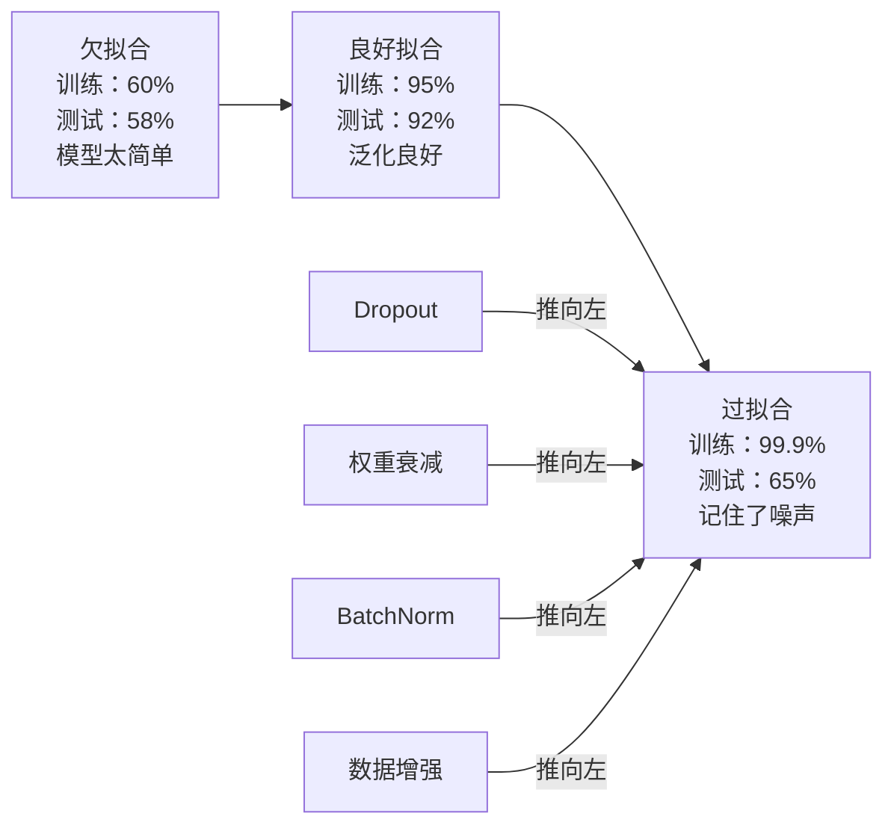
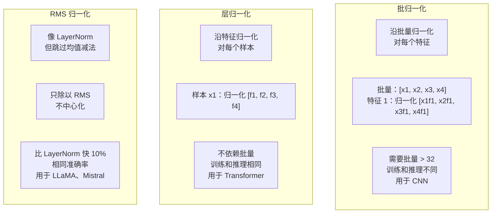
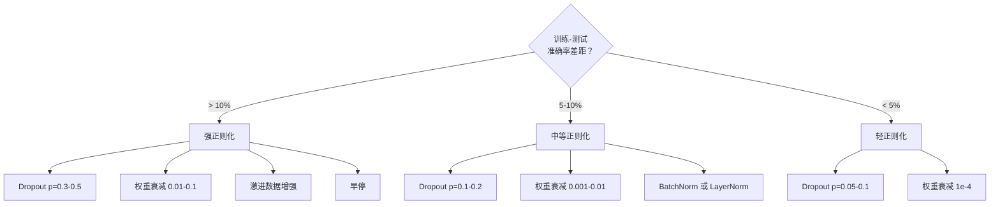

# 正则化

> 你的模型在训练数据上得到 99%，在测试数据上得到 60%。它记住了而不是学习了。正则化是你对复杂性施加的税，以强制泛化。

**类型：** 建构型
**语言：** Python
**前置条件：** 第 03.06 课（优化器）
**时间：** 约 75 分钟

## 学习目标

- 从零实现带倒置缩放的 dropout、L2 权重衰减、批归一化、层归一化和 RMSNorm
- 通过正则化实验测量训练-测试准确率差距并诊断过拟合
- 解释为什么 Transformer 使用 LayerNorm 而不是 BatchNorm，以及为什么现代 LLM 更喜欢 RMSNorm
- 根据过拟合的严重程度应用正确的正则化技术组合

## 问题

具有足够参数的神经网络可以记住任何数据集。这不是假设——Zhang 等人（2017）通过在带随机标签的 ImageNet 上训练标准网络证明了这一点。网络在完全随机的标签分配上达到了接近零的训练损失。他们记住了一百万个没有学习模式的随机输入-输出对。训练损失完美。测试准确率为零。

这就是过拟合问题，随着模型变大情况会变糟。GPT-3 有 1750 亿个参数。训练集有大约 5000 亿个 token。有了这么多参数，模型有足够的容量直接记住训练数据的很大一部分。如果没有正则化，它只会反刍训练样本而不是学习可泛化的模式。

训练表现和测试表现之间的差距就是过拟合差距。本课中的每种技术都从不同角度攻击这个差距。Dropout 强制网络不依赖任何单个神经元。权重衰减防止任何单个权重变得太大。批归一化平滑损失地貌，使优化器找到更平坦、更可泛化的最小值。层归一化做同样的事情，但在批归一化失效的地方工作（小批量、可变长度序列）。RMSNorm 通过丢弃均值计算快了 10%。每种技术都很简单。加在一起，就是记忆模型和泛化模型之间的区别。

## 概念

### 过拟合光谱

每个模型都处于从欠拟合（太简单，无法捕捉模式）到过拟合（太复杂，捕捉了噪声）的光谱上的某个位置。最佳点在中间，正则化将模型从过拟合一侧推向它。



### Dropout

最简单但解释最优雅的正则化技术。在训练期间，随机将每个神经元的输出设置为零，概率为 p。

```
output = activation(z) * mask    其中 mask[i] ~ Bernoulli(1 - p)
```

当 p = 0.5 时，一半的神经元在每次前向传播中被置零。网络必须学习冗余表示，因为它无法预测哪些神经元可用。这防止了共适应——神经元学习依赖特定其他神经元存在。

集成解释：具有 N 个神经元和 dropout 的网络创建了 2^N 个可能的子网络（每个神经元的开/关组合）。用 dropout 训练大约同时训练所有 2^N 个子网络，每个子网络在不同的小批量上。在测试时，你使用所有神经元（没有 dropout）并将输出按 (1 - p) 缩放以匹配训练期间的期望值。这等价于平均 2^N 个子网络的预测——一个来自单个模型的大型集成。

在实践中，缩放在训练期间应用而不是测试期间（倒置 dropout）：

```
训练期间：  output = activation(z) * mask / (1 - p)
测试期间：   output = activation(z)   （无需更改）
```

这更干净，因为测试代码不需要知道 dropout 的任何信息。

默认比率：Transformer 为 p = 0.1，MLP 为 p = 0.5，CNN 为 p = 0.2-0.3。更高的 dropout = 更强的正则化 = 更大的欠拟合风险。

### 权重衰减 (L2 正则化)

将所有权重的平方幅值加入损失：

```
total_loss = task_loss + (lambda / 2) * sum(w_i^2)
```

正则化项的梯度是 lambda * w。这意味着在每一步，每个权重按其幅值的比例向零收缩。大权重受到更多惩罚。模型被推向没有单个权重占主导地位的解。

这为什么帮助泛化：过拟合模型往往有大权重，放大训练数据中的噪声。权重衰减保持权重小，这限制了模型的有效容量，迫使它依赖鲁棒、可泛化的特征而不是记忆的古怪模式。

Lambda 超参数控制强度。典型值：

- Transformer 上 AdamW：0.01
- CNN 上 SGD：1e-4
- 严重过拟合模型：0.1

如第 06 课所讨论的：权重衰减和 L2 正则化在 SGD 中等价但在 Adam 中不等价。使用 Adam（解耦权重衰减）训练时始终使用 AdamW。

### 批归一化

在传递给下一层之前，沿小批量对每层的输出进行归一化。

对于某层激活的小批量：

```
mu = (1/B) * sum(x_i)           （批量均值）
sigma^2 = (1/B) * sum((x_i - mu)^2)   （批量方差）
x_hat = (x_i - mu) / sqrt(sigma^2 + eps)   （归一化）
y = gamma * x_hat + beta        （缩放和移位）
```

Gamma 和 beta 是可学习参数，让网络在最优时撤销归一化。没有它们，你会强制每层输出为零均值单位方差，这可能不是网络想要的。

**训练与推理的区分：** 训练期间，mu 和 sigma 来自当前小批量。推理期间，使用训练期间积累的运行平均值（指数移动平均，momentum = 0.1，意味着 90% 旧值 + 10% 新值）。

BatchNorm 为何有效仍有争议。原始论文声称它减少了"内部协变量偏移"（层输入分布随早期层更新而变化）。Santurkar 等人（2018）证明这个解释是错误的。真正的原因：BatchNorm 使损失地貌更平滑。梯度更可预测，Lipschitz 常数更小，优化器可以更安全地采取更大的步长。这就是 BatchNorm 允许你使用更高学习率并更快收敛的原因。

BatchNorm 有一个根本限制：它依赖批量统计量。批量大小为 1 时，均值和方差没有意义。批量较小（< 32）时，统计数据有噪声并损害性能。这对目标检测（内存限制批量大小）和语言建模（序列长度可变）等任务很重要。

### 层归一化

沿特征而不是沿批量进行归一化。对于单个样本：

```
mu = (1/D) * sum(x_j)           （特征均值）
sigma^2 = (1/D) * sum((x_j - mu)^2)   （特征方差）
x_hat = (x_j - mu) / sqrt(sigma^2 + eps)
y = gamma * x_hat + beta
```

D 是特征维度。每个样本独立归一化——不依赖批量大小。这就是 Transformer 使用 LayerNorm 而不是 BatchNorm 的原因。序列有可变长度，批量大小通常很小（或生成时为 1），训练和推理的计算相同。

Transformer 中的 LayerNorm 应用于每个自注意力块和每个前馈块之后（Post-LN），或之前（Pre-LN，后者更稳定）。

### RMSNorm

没有均值减法的 LayerNorm。由 Zhang & Sennrich（2019）提出。

```
rms = sqrt((1/D) * sum(x_j^2))
y = gamma * x / rms
```

就这样。没有均值计算，没有 beta 参数。观察：LayerNorm 中的重中心化（均值减法）对模型性能的贡献很小，但消耗计算量。去掉它以约 10% 更少的开销获得相同的准确率。

LLaMA、LLaMA 2、LLaMA 3、Mistral 和大多数现代 LLM 使用 RMSNorm 而不是 LayerNorm。在数十亿参数和数万亿 token 的规模上，10% 的节省是显著的。

### 归一化对比



### 数据增强作为正则化

不是模型修改而是数据修改。在保留标签的同时转换训练输入：

- 图像：随机裁剪、翻转、旋转、颜色抖动、cutout
- 文本：同义词替换、回译、随机删除
- 音频：时间拉伸、音高移动、噪声添加

效果与正则化相同：它增加了训练集的有效大小，使模型更难记住特定样本。一个只看到每张图像原始形式的模型可以记住它。一个看到每张图像 50 个增强版本的模型被迫学习不变结构。

### 早停

最简单的正则化器：当验证损失开始增加时停止训练。在那一点模型还没有过拟合。实际上，你每个 epoch 跟踪验证损失，保存最佳模型，并继续训练一个"耐心"窗口（通常 5-20 个 epoch）。如果验证损失在耐心窗口内没有改善，你就停止并加载最佳保存模型。

### 何时应用什么



## 动手实现

### 第 1 步：Dropout（训练和评估模式）

```python
import random
import math


class Dropout:
    def __init__(self, p=0.5):
        self.p = p
        self.training = True
        self.mask = None

    def forward(self, x):
        if not self.training:
            return list(x)
        self.mask = []
        output = []
        for val in x:
            if random.random() < self.p:
                self.mask.append(0)
                output.append(0.0)
            else:
                self.mask.append(1)
                output.append(val / (1 - self.p))
        return output

    def backward(self, grad_output):
        grads = []
        for g, m in zip(grad_output, self.mask):
            if m == 0:
                grads.append(0.0)
            else:
                grads.append(g / (1 - self.p))
        return grads
```

### 第 2 步：L2 权重衰减

```python
def l2_regularization(weights, lambda_reg):
    penalty = 0.0
    for w in weights:
        penalty += w * w
    return lambda_reg * 0.5 * penalty

def l2_gradient(weights, lambda_reg):
    return [lambda_reg * w for w in weights]
```

### 第 3 步：批归一化

```python
class BatchNorm:
    def __init__(self, num_features, momentum=0.1, eps=1e-5):
        self.gamma = [1.0] * num_features
        self.beta = [0.0] * num_features
        self.eps = eps
        self.momentum = momentum
        self.running_mean = [0.0] * num_features
        self.running_var = [1.0] * num_features
        self.training = True
        self.num_features = num_features

    def forward(self, batch):
        batch_size = len(batch)
        if self.training:
            mean = [0.0] * self.num_features
            for sample in batch:
                for j in range(self.num_features):
                    mean[j] += sample[j]
            mean = [m / batch_size for m in mean]

            var = [0.0] * self.num_features
            for sample in batch:
                for j in range(self.num_features):
                    var[j] += (sample[j] - mean[j]) ** 2
            var = [v / batch_size for v in var]

            for j in range(self.num_features):
                self.running_mean[j] = (1 - self.momentum) * self.running_mean[j] + self.momentum * mean[j]
                self.running_var[j] = (1 - self.momentum) * self.running_var[j] + self.momentum * var[j]
        else:
            mean = list(self.running_mean)
            var = list(self.running_var)

        self.x_hat = []
        output = []
        for sample in batch:
            normalized = []
            out_sample = []
            for j in range(self.num_features):
                x_h = (sample[j] - mean[j]) / math.sqrt(var[j] + self.eps)
                normalized.append(x_h)
                out_sample.append(self.gamma[j] * x_h + self.beta[j])
            self.x_hat.append(normalized)
            output.append(out_sample)
        return output
```

### 第 4 步：层归一化

```python
class LayerNorm:
    def __init__(self, num_features, eps=1e-5):
        self.gamma = [1.0] * num_features
        self.beta = [0.0] * num_features
        self.eps = eps
        self.num_features = num_features

    def forward(self, x):
        mean = sum(x) / len(x)
        var = sum((xi - mean) ** 2 for xi in x) / len(x)

        self.x_hat = []
        output = []
        for j in range(self.num_features):
            x_h = (x[j] - mean) / math.sqrt(var + self.eps)
            self.x_hat.append(x_h)
            output.append(self.gamma[j] * x_h + self.beta[j])
        return output
```

### 第 5 步：RMSNorm

```python
class RMSNorm:
    def __init__(self, num_features, eps=1e-6):
        self.gamma = [1.0] * num_features
        self.eps = eps
        self.num_features = num_features

    def forward(self, x):
        rms = math.sqrt(sum(xi * xi for xi in x) / len(x) + self.eps)
        output = []
        for j in range(self.num_features):
            output.append(self.gamma[j] * x[j] / rms)
        return output
```

### 第 6 步：带正则化和不带正则化的训练

```python
def sigmoid(x):
    x = max(-500, min(500, x))
    return 1.0 / (1.0 + math.exp(-x))


def make_circle_data(n=200, seed=42):
    random.seed(seed)
    data = []
    for _ in range(n):
        x = random.uniform(-2, 2)
        y = random.uniform(-2, 2)
        label = 1.0 if x * x + y * y < 1.5 else 0.0
        data.append(([x, y], label))
    return data


class RegularizedNetwork:
    def __init__(self, hidden_size=16, lr=0.05, dropout_p=0.0, weight_decay=0.0):
        random.seed(0)
        self.hidden_size = hidden_size
        self.lr = lr
        self.dropout_p = dropout_p
        self.weight_decay = weight_decay
        self.dropout = Dropout(p=dropout_p) if dropout_p > 0 else None

        self.w1 = [[random.gauss(0, 0.5) for _ in range(2)] for _ in range(hidden_size)]
        self.b1 = [0.0] * hidden_size
        self.w2 = [random.gauss(0, 0.5) for _ in range(hidden_size)]
        self.b2 = 0.0

    def forward(self, x, training=True):
        self.x = x
        self.z1 = []
        self.h = []
        for i in range(self.hidden_size):
            z = self.w1[i][0] * x[0] + self.w1[i][1] * x[1] + self.b1[i]
            self.z1.append(z)
            self.h.append(max(0.0, z))

        if self.dropout and training:
            self.dropout.training = True
            self.h = self.dropout.forward(self.h)
        elif self.dropout:
            self.dropout.training = False
            self.h = self.dropout.forward(self.h)

        self.z2 = sum(self.w2[i] * self.h[i] for i in range(self.hidden_size)) + self.b2
        self.out = sigmoid(self.z2)
        return self.out

    def backward(self, target):
        eps = 1e-15
        p = max(eps, min(1 - eps, self.out))
        d_loss = -(target / p) + (1 - target) / (1 - p)
        d_sigmoid = self.out * (1 - self.out)
        d_out = d_loss * d_sigmoid

        for i in range(self.hidden_size):
            d_relu = 1.0 if self.z1[i] > 0 else 0.0
            d_h = d_out * self.w2[i] * d_relu
            self.w2[i] -= self.lr * (d_out * self.h[i] + self.weight_decay * self.w2[i])
            for j in range(2):
                self.w1[i][j] -= self.lr * (d_h * self.x[j] + self.weight_decay * self.w1[i][j])
            self.b1[i] -= self.lr * d_h
        self.b2 -= self.lr * d_out

    def evaluate(self, data):
        correct = 0
        total_loss = 0.0
        for x, y in data:
            pred = self.forward(x, training=False)
            eps = 1e-15
            p = max(eps, min(1 - eps, pred))
            total_loss += -(y * math.log(p) + (1 - y) * math.log(1 - p))
            if (pred >= 0.5) == (y >= 0.5):
                correct += 1
        return total_loss / len(data), correct / len(data) * 100

    def train_model(self, train_data, test_data, epochs=300):
        history = []
        for epoch in range(epochs):
            total_loss = 0.0
            correct = 0
            for x, y in train_data:
                pred = self.forward(x, training=True)
                self.backward(y)
                eps = 1e-15
                p = max(eps, min(1 - eps, pred))
                total_loss += -(y * math.log(p) + (1 - y) * math.log(1 - p))
                if (pred >= 0.5) == (y >= 0.5):
                    correct += 1
            train_loss = total_loss / len(train_data)
            train_acc = correct / len(train_data) * 100
            test_loss, test_acc = self.evaluate(test_data)
            history.append((train_loss, train_acc, test_loss, test_acc))
            if epoch % 75 == 0 or epoch == epochs - 1:
                gap = train_acc - test_acc
                print(f"    Epoch {epoch:3d}: train_acc={train_acc:.1f}%, test_acc={test_acc:.1f}%, gap={gap:.1f}%")
        return history
```

## Use It

PyTorch provides all normalization and regularization as modules:

```python
import torch
import torch.nn as nn

model = nn.Sequential(
    nn.Linear(784, 256),
    nn.BatchNorm1d(256),
    nn.ReLU(),
    nn.Dropout(0.3),
    nn.Linear(256, 128),
    nn.BatchNorm1d(128),
    nn.ReLU(),
    nn.Dropout(0.3),
    nn.Linear(128, 10),
)

model.train()
out_train = model(torch.randn(32, 784))

model.eval()
out_test = model(torch.randn(1, 784))
```

The `model.train()` / `model.eval()` toggle is critical. It switches dropout on/off and tells BatchNorm to use batch statistics vs running statistics. Forgetting `model.eval()` before inference is one of the most common bugs in deep learning. Your test accuracy will fluctuate randomly because dropout is still active and BatchNorm is using mini-batch statistics.

For transformers, the pattern is different:

```python
class TransformerBlock(nn.Module):
    def __init__(self, d_model=512, nhead=8, dropout=0.1):
        super().__init__()
        self.attention = nn.MultiheadAttention(d_model, nhead, dropout=dropout)
        self.norm1 = nn.LayerNorm(d_model)
        self.ff = nn.Sequential(
            nn.Linear(d_model, d_model * 4),
            nn.GELU(),
            nn.Linear(d_model * 4, d_model),
            nn.Dropout(dropout),
        )
        self.norm2 = nn.LayerNorm(d_model)
        self.dropout = nn.Dropout(dropout)

    def forward(self, x):
        attended, _ = self.attention(x, x, x)
        x = self.norm1(x + self.dropout(attended))
        x = self.norm2(x + self.ff(x))
        return x
```

LayerNorm, not BatchNorm. Dropout p=0.1, not p=0.5. These are the transformer defaults.

## Ship It

This lesson produces:
- `outputs/prompt-regularization-advisor.md` -- a prompt that diagnoses overfitting and recommends the right regularization strategy

## Exercises

1. Implement spatial dropout for 2D data: instead of dropping individual neurons, drop entire feature channels. Simulate this by treating groups of consecutive features as channels and dropping whole groups. Compare the train-test gap to standard dropout on the circle dataset with hidden_size=32.

2. Implement label smoothing from lesson 05 combined with dropout from this lesson. Train with four configurations: neither, dropout only, label smoothing only, both. Measure the final train-test accuracy gap for each. Which combination gives the smallest gap?

3. Add a BatchNorm layer between the hidden layer and the activation in your circle-dataset network. Train with and without BatchNorm at learning rates 0.01, 0.05, and 0.1. BatchNorm should allow stable training at higher learning rates where the vanilla network diverges.

4. Implement early stopping: track test loss each epoch, save the best weights, and stop if test loss hasn't improved for 20 epochs. Run the regularized network for 1000 epochs. Report which epoch had the best test accuracy and how many epochs of computation you saved.

5. Compare LayerNorm vs RMSNorm on a 4-layer network (not just 2). Initialize both with the same weights. Train for 200 epochs and compare final accuracy, training speed (time per epoch), and gradient magnitudes at the first layer. Verify that RMSNorm is faster with the same accuracy.

## Key Terms

| Term | What people say | What it actually means |
|------|----------------|----------------------|
| Overfitting | "Model memorized the data" | When a model's training performance significantly exceeds its test performance, indicating it learned noise rather than signal |
| Regularization | "Preventing overfitting" | Any technique that constrains model complexity to improve generalization: dropout, weight decay, normalization, augmentation |
| Dropout | "Random neuron deletion" | Zeroing random neurons during training with probability p, forcing redundant representations; equivalent to training an ensemble |
| Weight decay | "L2 penalty" | Shrinking all weights toward zero by subtracting lambda * w at each step; penalizes complexity through weight magnitude |
| Batch normalization | "Normalize per batch" | Normalizing layer outputs across the batch dimension using batch statistics during training and running averages during inference |
| Layer normalization | "Normalize per sample" | Normalizing across features within each sample; batch-independent, used in transformers where batch size varies |
| RMSNorm | "LayerNorm without the mean" | Root mean square normalization; drops the mean subtraction from LayerNorm for 10% speedup with equal accuracy |
| Early stopping | "Stop before overfit" | Halting training when validation loss stops improving; the simplest regularizer, often used alongside others |
| Data augmentation | "More data from less" | Transforming training inputs (flip, crop, noise) to increase effective dataset size and force invariance learning |
| Generalization gap | "Train-test split" | The difference between training and test performance; regularization aims to minimize this gap |

## Further Reading

- Srivastava et al., "Dropout: A Simple Way to Prevent Neural Networks from Overfitting" (2014) -- the original dropout paper with the ensemble interpretation and extensive experiments
- Ioffe & Szegedy, "Batch Normalization: Accelerating Deep Network Training by Reducing Internal Covariate Shift" (2015) -- introduced BatchNorm and its training procedure, one of the most cited deep learning papers
- Zhang & Sennrich, "Root Mean Square Layer Normalization" (2019) -- showed RMSNorm matches LayerNorm accuracy with reduced computation; adopted by LLaMA and Mistral
- Zhang et al., "Understanding Deep Learning Requires Rethinking Generalization" (2017) -- the landmark paper showing neural networks can memorize random labels, challenging traditional views of generalization
