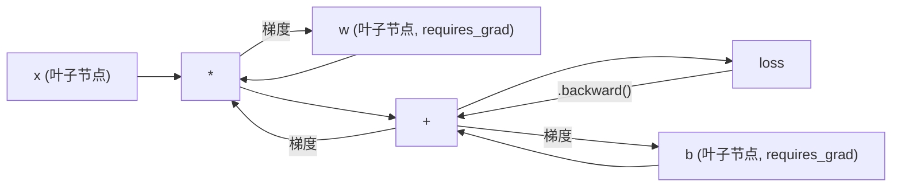
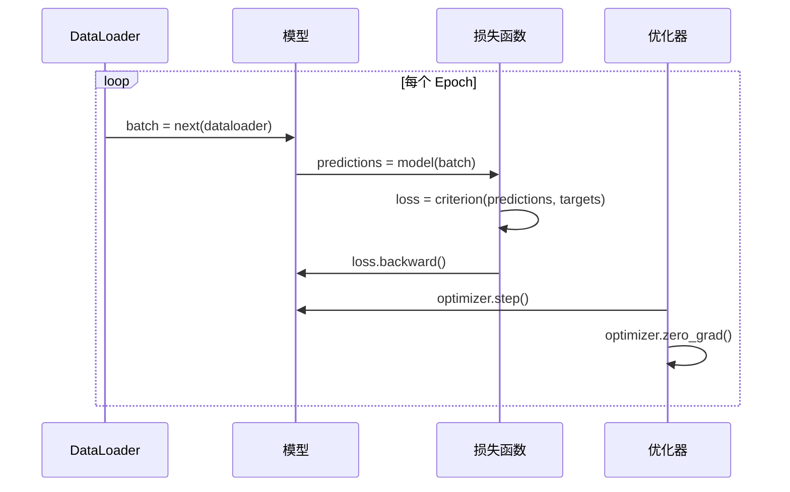

# PyTorch 入门

> 你已经用活塞和曲轴搭好了发动机。现在来学学大家实际都在用的那套。

**类型：** 学习型
**语言：** Python
**前置条件：** 第 3.10 课（从零构建一个迷你框架）
**时间：** 约 75 分钟

## 学习目标

- 使用 PyTorch 的 nn.Module、nn.Sequential 和 autograd 构建并训练神经网络
- 使用 PyTorch 张量、GPU 加速和标准训练循环（zero_grad、forward、loss、backward、step）
- 将从零实现的迷你框架组件转换为对应的 PyTorch 版本
- 在同一任务上对比纯 Python 框架与 PyTorch 的训练速度

## 问题

你有一个可用的迷你框架。Linear 层、ReLU、dropout、batch norm、Adam、DataLoader、训练循环。用纯 Python 训练一个 4 层网络做圆分类。

在同一个问题上，它比 PyTorch 慢 500 倍。

你的迷你框架每次用嵌套的 Python 循环处理一个样本。PyTorch 将同样的操作分发到优化的 C++/CUDA 内核上，在 GPU 上运行。在一张 NVIDIA A100 上，PyTorch 训练 ResNet-50（25.6M 参数）在 ImageNet（1.28M 图像）上大约需要 6 小时。你的框架在同一任务上大约需要 3,000 小时——如果它没有先内存溢出的话。

速度还不是唯一的差距。你的框架没有 GPU 支持。没有自动微分——你为每个模块手写了 backward()。没有序列化。没有分布式训练。没有混合精度。没有办法调试梯度流，只能靠 print 语句。

PyTorch 填补了所有这些空白。而且它保持了和你从零构建的完全相同的思维模型：Module、forward()、parameters()、backward()、optimizer.step()。概念一一对应。语法几乎一样。区别在于 PyTorch 在你从零设计的同一个接口背后封装了十年的系统工程。

## 概念

### 为什么 PyTorch 赢了

2015 年，TensorFlow 要求你在运行任何东西之前先定义一个静态计算图。你构建图、编译图，然后把数据喂进去。调试意味着盯着图可视化。改变架构意味着从头重建图。

PyTorch 在 2017 年以一种不同的理念推出： eager execution（ eager 模式）。你写 Python，它立即运行。`y = model(x)` 立即计算 y，而不是"添加一个节点到计算图中，以后再计算 y"。这意味着标准 Python 调试工具都能用。print() 能用。pdb 能用。forward pass 中的 if/else 也能用。

到 2020 年，市场已经给出了答案。PyTorch 在 ML 论文中的份额从 7%（2017）上升到 75% 以上（2022）。Meta、Google DeepMind、OpenAI、Anthropic 和 Hugging Face 都将 PyTorch 作为主要框架。TensorFlow 2.x 采用了 eager execution 作为回应——等于默认 PyTorch 的设计是正确的。

教训：开发者体验是复利的。一个慢 10% 但调试快 50% 的框架永远胜出。

### 张量

张量是一个多维数组，有三个关键属性：shape、dtype 和 device。

```python
import torch

x = torch.zeros(3, 4)           # shape: (3, 4), dtype: float32, device: cpu
x = torch.randn(2, 3, 224, 224) # batch of 2 RGB images, 224x224
x = torch.tensor([1, 2, 3])     # from a Python list
```

**Shape** 是维度。标量是 shape ()，向量是 (n,)，矩阵是 (m, n)，图像批次是 (batch, channels, height, width)。

**Dtype** 控制精度和内存。

| dtype | 位数 | 范围 | 用途 |
|-------|------|------|------|
| float32 | 32 | 约 7 位小数 | 默认训练 |
| float16 | 16 | 约 3.3 位小数 | 混合精度 |
| bfloat16 | 16 | 与 float32 相同范围，精度更低 | LLM 训练 |
| int8 | 8 | -128 到 127 | 量化推理 |

**Device** 决定计算发生在哪里。

```python
device = torch.device("cuda" if torch.cuda.is_available() else "cpu")
x = torch.randn(3, 4, device=device)
x = x.to("cuda")
x = x.cpu()
```

每个操作都要求所有张量在同一设备上。这是初学者遇到的第一个 PyTorch 错误：`RuntimeError: Expected all tensors to be on the same device`。修复方法是在计算前将所有张量移到同一设备。

**Reshaping（重塑）**是常数时间的——它只改变元数据，不改变数据。

```python
x = torch.randn(2, 3, 4)
x.view(2, 12)      # reshape to (2, 12) -- must be contiguous
x.reshape(6, 4)    # reshape to (6, 4) -- works always
x.permute(2, 0, 1) # reorder dimensions
x.unsqueeze(0)     # add dimension: (1, 2, 3, 4)
x.squeeze()        # remove size-1 dimensions
```

### 自动微分

你的迷你框架要求你为每个模块实现 backward()。PyTorch 不是这样做的。它将张量上的每个操作记录到一个有向无环图（计算图）中，然后反向遍历该图来自动计算梯度。



与你的框架的关键区别：PyTorch 使用基于"磁带"的自动微分。每个操作在 forward pass 时追加到一条"磁带"上。调用 `.backward()` 时反向重放磁带。

```python
x = torch.randn(3, requires_grad=True)
y = x ** 2 + 3 * x
z = y.sum()
z.backward()
print(x.grad)  # dz/dx = 2x + 3
```

自动微分的三个规则：

1. 只有叶子张量且 `requires_grad=True` 才会累积梯度
2. 梯度默认累积——在每次 backward 前调用 `optimizer.zero_grad()`
3. `torch.no_grad()` 禁用梯度跟踪（用于评估阶段）

### nn.Module

`nn.Module` 是 PyTorch 中每个神经网络组件的基类。你在第 10 课已经构建过这个抽象。PyTorch 版本增加了自动参数注册、递归模块发现、设备管理和 state dict 序列化。

```python
import torch.nn as nn

class MLP(nn.Module):
    def __init__(self, input_dim, hidden_dim, output_dim):
        super().__init__()
        self.layer1 = nn.Linear(input_dim, hidden_dim)
        self.relu = nn.ReLU()
        self.layer2 = nn.Linear(hidden_dim, output_dim)

    def forward(self, x):
        x = self.layer1(x)
        x = self.relu(x)
        x = self.layer2(x)
        return x
```

当你在 `__init__` 中将 `nn.Module` 或 `nn.Parameter` 赋值为属性时，PyTorch 会自动注册它。`model.parameters()` 递归收集每个注册的参数。这就是为什么你不必像迷你框架那样手动收集权重。

关键构建模块：

| 模块 | 功能 | 参数数量 |
|--------|-------------|------------|
| nn.Linear(in, out) | Wx + b | in*out + out |
| nn.Conv2d(in_ch, out_ch, k) | 2D 卷积 | in_ch*out_ch*k*k + out_ch |
| nn.BatchNorm1d(features) | 归一化激活值 | 2 * features |
| nn.Dropout(p) | 随机置零 | 0 |
| nn.ReLU() | max(0, x) | 0 |
| nn.GELU() | 高斯误差线性 | 0 |
| nn.Embedding(vocab, dim) | 查找表 | vocab * dim |
| nn.LayerNorm(dim) | 逐样本归一化 | 2 * dim |

### 损失函数与优化器

PyTorch 附带了所有你构建过的东西的生产级版本。

**损失函数**（来自 `torch.nn`）：

| 损失函数 | 任务 | 输入 |
|------|------|-------|
| nn.MSELoss() | 回归 | 任意形状 |
| nn.CrossEntropyLoss() | 多分类 | Logits（不是 softmax） |
| nn.BCEWithLogitsLoss() | 二分类 | Logits（不是 sigmoid） |
| nn.L1Loss() | 回归（鲁棒） | 任意形状 |
| nn.CTCLoss() | 序列对齐 | 对数概率 |

注意：`CrossEntropyLoss` 在内部组合了 `LogSoftmax` + `NLLLoss`。传入原始 logits，不是 softmax 输出。这是一个常见错误，会静默产生错误的梯度。

**优化器**（来自 `torch.optim`）：

| 优化器 | 使用场景 | 典型学习率 |
|-----------|-------------|-----------|
| SGD(params, lr, momentum) | CNN、调优好的流程 | 0.01--0.1 |
| Adam(params, lr) | 默认起点 | 1e-3 |
| AdamW(params, lr, weight_decay) | Transformer、微调 | 1e-4--1e-3 |
| LBFGS(params) | 小规模、二阶 | 1.0 |

### 训练循环

每个 PyTorch 训练循环都遵循相同的 5 步模式。你在第 10 课已经学过这个。



标准模式：

```python
for epoch in range(num_epochs):
    model.train()
    for inputs, targets in train_loader:
        inputs, targets = inputs.to(device), targets.to(device)
        optimizer.zero_grad()
        outputs = model(inputs)
        loss = criterion(outputs, targets)
        loss.backward()
        optimizer.step()
```

batch 循环里就这五行。这五行训练了 GPT-4、Stable Diffusion 和 LLaMA。架构变了，数据变了。这五行不变。

### Dataset 与 DataLoader

PyTorch 的 `Dataset` 是一个抽象类，有两个方法：`__len__` 和 `__getitem__`。`DataLoader` 用它包装了批处理、打乱和多进程数据加载。

```python
from torch.utils.data import Dataset, DataLoader

class MNISTDataset(Dataset):
    def __init__(self, images, labels):
        self.images = images
        self.labels = labels

    def __len__(self):
        return len(self.labels)

    def __getitem__(self, idx):
        return self.images[idx], self.labels[idx]

loader = DataLoader(dataset, batch_size=64, shuffle=True, num_workers=4)
```

`num_workers=4` 生成 4 个进程，在 GPU 训练当前 batch 的同时并行加载数据。在磁盘受限的工作负载（大图像、音频）上，这 alone 就能让训练速度翻倍。

### GPU 训练

将模型移到 GPU：

```python
device = torch.device("cuda" if torch.cuda.is_available() else "cpu")
model = model.to(device)
```

这递归地将每个参数和 buffer 移到 GPU。然后在训练时移动每个 batch：

```python
inputs, targets = inputs.to(device), targets.to(device)
```

**混合精度**在现代 GPU（A100、H100、RTX 4090）上通过在前向/反向传播中使用 float16、同时在 float32 中保持主权重，将内存减半并将吞吐量翻倍：

```python
from torch.amp import autocast, GradScaler

scaler = GradScaler()
for inputs, targets in loader:
    with autocast(device_type="cuda"):
        outputs = model(inputs)
        loss = criterion(outputs, targets)
    scaler.scale(loss).backward()
    scaler.step(optimizer)
    scaler.update()
    optimizer.zero_grad()
```

### 对比：迷你框架 vs PyTorch vs JAX

| 特性 | 迷你框架（第 10 课） | PyTorch | JAX |
|---------|---------------------|---------|-----|
| 自动微分 | 手动 backward() | 基于磁带的 autograd | 函数式变换 |
| 执行方式 | Eager（Python 循环） | Eager（C++ 内核） | Traced + JIT 编译 |
| GPU 支持 | 无 | 有（CUDA、ROCm、MPS） | 有（CUDA、TPU） |
| 速度（MNIST MLP） | ~300秒/epoch | ~0.5秒/epoch | ~0.3秒/epoch |
| 模块系统 | 自定义 Module 类 | nn.Module | 无状态函数（Flax/Equinox） |
| 调试 | print() | print()、pdb、breakpoint() | 更难（JIT 追踪会打断 print） |
| 生态 | 无 | Hugging Face、Lightning、timm | Flax、Optax、Orbax |
| 学习曲线 | 你自己构建的 | 中等 | 陡峭（函数式范式） |
| 生产使用 | 玩具问题 | Meta、OpenAI、Anthropic、HF | Google DeepMind、Midjourney |

## 构建它

用纯 PyTorch 原语训练 MNIST 的 3 层 MLP。没有高级封装。没有 `torchvision.datasets`。我们自己去下载和解析原始数据。

### 第 1 步：从原始文件加载 MNIST

MNIST 以 4 个 gzip 文件分发：训练图像（60,000 x 28 x 28）、训练标签、测试图像（10,000 x 28 x 28）、测试标签。我们下载并解析二进制格式。

```python
import torch
import torch.nn as nn
import struct
import gzip
import urllib.request
import os

def download_mnist(path="./mnist_data"):
    base_url = "https://storage.googleapis.com/cvdf-datasets/mnist/"
    files = [
        "train-images-idx3-ubyte.gz",
        "train-labels-idx1-ubyte.gz",
        "t10k-images-idx3-ubyte.gz",
        "t10k-labels-idx1-ubyte.gz",
    ]
    os.makedirs(path, exist_ok=True)
    for f in files:
        filepath = os.path.join(path, f)
        if not os.path.exists(filepath):
            urllib.request.urlretrieve(base_url + f, filepath)

def load_images(filepath):
    with gzip.open(filepath, "rb") as f:
        magic, num, rows, cols = struct.unpack(">IIII", f.read(16))
        data = f.read()
        images = torch.frombuffer(bytearray(data), dtype=torch.uint8)
        images = images.reshape(num, rows * cols).float() / 255.0
    return images

def load_labels(filepath):
    with gzip.open(filepath, "rb") as f:
        magic, num = struct.unpack(">II", f.read(8))
        data = f.read()
        labels = torch.frombuffer(bytearray(data), dtype=torch.uint8).long()
    return labels
```

### 第 2 步：定义模型

3 层 MLP：784 -> 256 -> 128 -> 10。ReLU 激活。Dropout 正则化。为了简洁没有 batch norm。

```python
class MNISTModel(nn.Module):
    def __init__(self):
        super().__init__()
        self.net = nn.Sequential(
            nn.Linear(784, 256),
            nn.ReLU(),
            nn.Dropout(0.2),
            nn.Linear(256, 128),
            nn.ReLU(),
            nn.Dropout(0.2),
            nn.Linear(128, 10),
        )

    def forward(self, x):
        return self.net(x)
```

输出层产生 10 个原始 logits（每个数字一个）。没有 softmax——`CrossEntropyLoss` 在内部处理。

参数数量：784*256 + 256 + 256*128 + 128 + 128*10 + 10 = 235,146。按现代标准来看很小。GPT-2 small 有 124M。这个训练只需几秒。

### 第 3 步：训练循环

标准的前向-损失-反向-步进模式。

```python
def train_one_epoch(model, loader, criterion, optimizer, device):
    model.train()
    total_loss = 0
    correct = 0
    total = 0
    for images, labels in loader:
        images, labels = images.to(device), labels.to(device)
        optimizer.zero_grad()
        outputs = model(images)
        loss = criterion(outputs, labels)
        loss.backward()
        optimizer.step()
        total_loss += loss.item() * images.size(0)
        _, predicted = outputs.max(1)
        correct += predicted.eq(labels).sum().item()
        total += labels.size(0)
    return total_loss / total, correct / total


def evaluate(model, loader, criterion, device):
    model.eval()
    total_loss = 0
    correct = 0
    total = 0
    with torch.no_grad():
        for images, labels in loader:
            images, labels = images.to(device), labels.to(device)
            outputs = model(images)
            loss = criterion(outputs, labels)
            total_loss += loss.item() * images.size(0)
            _, predicted = outputs.max(1)
            correct += predicted.eq(labels).sum().item()
            total += labels.size(0)
    return total_loss / total, correct / total
```

注意评估时用 `torch.no_grad()`。这会禁用 autograd，减少内存使用并加速推理。没有它，PyTorch 会构建一个你永远不会用的计算图。

### 第 4 步：将所有内容连接起来

```python
def main():
    device = torch.device("cuda" if torch.cuda.is_available() else "cpu")

    download_mnist()
    train_images = load_images("./mnist_data/train-images-idx3-ubyte.gz")
    train_labels = load_labels("./mnist_data/train-labels-idx1-ubyte.gz")
    test_images = load_images("./mnist_data/t10k-images-idx3-ubyte.gz")
    test_labels = load_labels("./mnist_data/t10k-labels-idx1-ubyte.gz")

    train_dataset = torch.utils.data.TensorDataset(train_images, train_labels)
    test_dataset = torch.utils.data.TensorDataset(test_images, test_labels)
    train_loader = torch.utils.data.DataLoader(
        train_dataset, batch_size=64, shuffle=True
    )
    test_loader = torch.utils.data.DataLoader(
        test_dataset, batch_size=256, shuffle=False
    )

    model = MNISTModel().to(device)
    criterion = nn.CrossEntropyLoss()
    optimizer = torch.optim.Adam(model.parameters(), lr=1e-3)

    num_params = sum(p.numel() for p in model.parameters())
    print(f"Device: {device}")
    print(f"Parameters: {num_params:,}")
    print(f"Train samples: {len(train_dataset):,}")
    print(f"Test samples: {len(test_dataset):,}")
    print()

    for epoch in range(10):
        train_loss, train_acc = train_one_epoch(
            model, train_loader, criterion, optimizer, device
        )
        test_loss, test_acc = evaluate(
            model, test_loader, criterion, device
        )
        print(
            f"Epoch {epoch+1:2d} | "
            f"Train Loss: {train_loss:.4f} | Train Acc: {train_acc:.4f} | "
            f"Test Loss: {test_loss:.4f} | Test Acc: {test_acc:.4f}"
        )

    torch.save(model.state_dict(), "mnist_mlp.pt")
    print(f"\nModel saved to mnist_mlp.pt")
    print(f"Final test accuracy: {test_acc:.4f}")
```

10 个 epoch 后的预期输出：约 97.8% 的测试准确率。CPU 训练时间：约 30 秒。GPU 上：约 5 秒。用同样架构的迷你框架：约 45 分钟。

## 使用它

### 快速对比：迷你框架 vs PyTorch

| 迷你框架（第 10 课） | PyTorch |
|---------------------------|---------|
| `model = Sequential(Linear(784, 256), ReLU(), ...)` | `model = nn.Sequential(nn.Linear(784, 256), nn.ReLU(), ...)` |
| `pred = model.forward(x)` | `pred = model(x)` |
| `optimizer.zero_grad()` | `optimizer.zero_grad()` |
| `grad = criterion.backward()` 然后 `model.backward(grad)` | `loss.backward()` |
| `optimizer.step()` | `optimizer.step()` |
| 没有 GPU | `model.to("cuda")` |
| 每个模块手动 backward | Autograd 处理一切 |

接口几乎一样。区别在于底下的所有细节。

### 保存和加载模型

```python
torch.save(model.state_dict(), "model.pt")

model = MNISTModel()
model.load_state_dict(torch.load("model.pt", weights_only=True))
model.eval()
```

总是保存 `state_dict()`（参数字典），而不是模型对象。保存模型对象使用 pickle，在你重构代码时会坏掉。State dict 是可移植的。

### 学习率调度

```python
scheduler = torch.optim.lr_scheduler.CosineAnnealingLR(
    optimizer, T_max=10
)
for epoch in range(10):
    train_one_epoch(model, train_loader, criterion, optimizer, device)
    scheduler.step()
```

PyTorch 附带 15+ 个调度器：StepLR、ExponentialLR、CosineAnnealingLR、OneCycleLR、ReduceLROnPlateau。全部插入同一个优化器接口。

## 交付它

本课产出两个产物：

- `outputs/prompt-pytorch-debugger.md` —— 用于诊断常见 PyTorch 训练失败的提示词
- `outputs/skill-pytorch-patterns.md` —— PyTorch 训练模式技能参考

## 练习

1. **添加 batch normalization。** 在每个线性层后（激活函数前）插入 `nn.BatchNorm1d`。对比测试准确率和训练速度与仅用 dropout 版本的差异。Batch norm 应该在更少的 epoch 内达到 98%+。

2. **实现学习率查找器。** 用指数增长的学习率（从 1e-7 到 1.0）训练一个 epoch。绘制 loss vs LR 曲线。最优 LR 在 loss 开始上升之前。用这个为 MNIST 模型选择一个更好的 LR。

3. **用混合精度移植到 GPU。** 在训练循环中加入 `torch.amp.autocast` 和 `GradScaler`。在 GPU 上测量有/无混合精度的吞吐量（samples/second）。在 A100 上，期望约 2x 加速。

4. **构建自定义 Dataset。** 下载 Fashion-MNIST（格式与 MNIST 相同但是服装项目）。实现一个 `FashionMNISTDataset(Dataset)` 类，带 `__getitem__` 和 `__len__`。训练同样的 MLP 并对比准确率。Fashion-MNIST 更难——期望约 88% vs 约 98%。

5. **用 SGD + momentum 替换 Adam。** 用 `SGD(params, lr=0.01, momentum=0.9)` 训练。对比收敛曲线。然后加上 `CosineAnnealingLR` 调度器，看看 SGD 到第 10 个 epoch 能否追上 Adam。

## 关键术语

| 术语 | 大家怎么说的 | 实际含义 |
|------|----------------|----------------------|
| 张量 (Tensor) | "一个多维数组" | 一个带类型的、设备感知的数组，每个操作都内置自动微分支持 |
| 自动微分 (Autograd) | "自动反向传播" | 一种基于磁带的系统，在前向传播时记录操作，然后反向重放以计算精确梯度 |
| nn.Module | "一个层" | 任何可微分计算块的基类——注册参数、支持嵌套、处理训练/评估模式 |
| state_dict | "模型权重" | 将参数名称映射到张量的有序字典——训练模型的可移植、可序列化表示 |
| .backward() | "计算梯度" | 反向遍历计算图，为每个 `requires_grad=True` 的叶子张量计算并累积梯度 |
| .to(device) | "移到 GPU" | 递归地将所有参数和 buffer 传输到指定设备（CPU、CUDA、MPS） |
| DataLoader | "数据管道" | 从 Dataset 批量、打乱并可选并行加载数据的迭代器 |
| 混合精度 (Mixed precision) | "用 float16" | 为了速度在前向/反向用 float16，同时为了数值稳定性保持 float32 主权重 |
| Eager execution | "立即运行" | 操作在调用时立即执行，而不是推迟到后续编译步骤——使 PyTorch 区别于 TF 1.x 的核心设计选择 |
| zero_grad | "重置梯度" | 在下一次反向传播前将所有参数梯度设为零，因为 PyTorch 默认会累积梯度 |

## 延伸阅读

- Paszke et al., "PyTorch: An Imperative Style, High-Performance Deep Learning Library" (2019) —— 解释 PyTorch 设计权衡的原始论文
- PyTorch 教程："Learning PyTorch with Examples" (https://pytorch.org/tutorials/beginner/pytorch_with_examples.html) —— 从张量到 nn.Module 的官方路径
- PyTorch 性能调优指南 (https://pytorch.org/tutorials/recipes/recipes/tuning_guide.html) —— 混合精度、DataLoader workers、pinned memory 及其他生产优化
- Horace He, "Making Deep Learning Go Brrrr" (https://horace.io/brrr_intro.html) —— 为什么 GPU 训练很快，以及 PyTorch 特定的优化策略