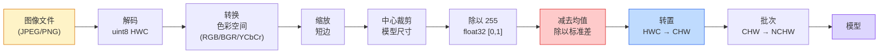
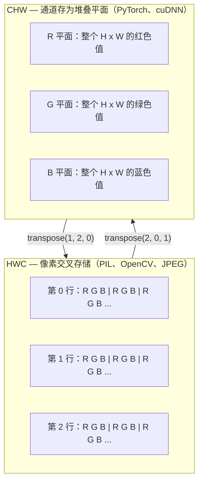

# 图像基础 — 像素、通道与色彩空间

> 一张图像就是一组光样本的张量。你以后用到的每一个视觉模型，都从这一个事实开始。

**类型：** 构建型
**语言：** Python
**前置条件：** 阶段 1 第 12 课（张量运算），阶段 3 第 11 课（PyTorch 入门）
**时间：** 约 45 分钟

## 学习目标

- 解释连续场景如何被离散化为像素，以及采样/量化决策如何为所有下游模型设定上限
- 将图像作为 NumPy 数组进行读取、切片和检查，并在 HWC 和 CHW 布局之间流畅切换
- 在 RGB、灰度、HSV 和 YCbCr 之间转换，并说明每种色彩空间存在的原因
- 按照 torchvision 的期望，精确应用像素级预处理（归一化、标准化、缩放、通道优先）

## 问题

你阅读的每一篇论文、下载的每一个预训练权重、调用的每一个视觉 API，都假设输入遵循特定的编码方式。如果在模型需要 `float32` 的地方传入 `uint8` 图像，模型仍然会运行——但会静默地产生垃圾结果。把 BGR 输入给在 RGB 上训练的模型，准确率会直接下降十几点。把通道靠后的输入交给期望通道优先的模型，第一层卷积会把高度当做一个特征通道。这些都不会抛出错误，只是悄悄毁掉你的指标，然后你花一周时间去找一个藏在"文件加载方式"里的 bug。

一旦知道卷积在"滑动"什么，它就不复杂了。难的是"一张图像"对相机、JPEG 解码器、PIL、OpenCV、torchvision 和 CUDA kernel 来说意味着完全不同的东西。每个技术栈都有自己的轴顺序、字节范围和通道约定。一个搞不清这些的视觉工程师，做出的流水线必然是坏的。

本课修复这个基础，这样本阶段的其余课程就能建立在它的上面。学完以后，你会知道什么是像素、为什么每个像素是三个数字而不是一个、"用 ImageNet 统计量标准化"实际上做了什么，以及如何在其他所有课程都会用到的两三种布局之间切换。

## 概念

### 完整预处理流水线一览

每个生产级视觉系统都是同一串可逆变换。有一个步骤出错，模型看到的输入就与训练时不同。



红色和蓝色框里藏着 80% 的静默失败：缺少标准化和错误的布局。

### 像素是样本，不是方块

相机传感器统计落在微型探测器网格上的光子。每个探测器积分一小段时间的光，然后发射一个与击中它的光子数量成比例的电压。传感器再把这个电压离散化为一个整数。一个探测器成为一个像素。

```
连续场景                 传感器网格                    数字图像
（无限细节）            （H x W 个探测器）              （H x W 个整数）

    ~~~~~                   +--+--+--+--+--+                 210 198 180 155 120
   ~   ~   ~                  |  |  |  |  |  |                 205 195 178 152 118
  ~ light ~       ---->       +--+--+--+--+--+     ---->       200 190 175 150 115
   ~~~~~                        |  |  |  |  |  |                 195 185 170 148 112
                                +--+--+--+--+--+                 188 180 165 145 108
```

在这一步做了两个选择，它们决定了所有下游工作的上限：

- **空间采样**决定每度场景有多少个探测器。太少，边缘就会变得锯齿状（混叠）。太多，存储和计算就会爆炸。
- **强度量化**决定电压被分成多少个桶。8 位给出 256 个级别，是显示的标准。10、12、16 位给出更平滑的渐变，对医学成像、HDR 和原始传感器流水线很重要。

像素不是一个有面积的有色方块。它是一个单一的测量值。当你调整大小或旋转时，你实际上是在对这个测量网格进行重新采样。

### 为什么是三个通道

一个探测器统计整个可见光谱上的光子——那就是灰度。要获得颜色，传感器用一个红、绿、蓝滤镜的马赛克覆盖网格。去马赛梅后，每个空间位置有三个整数：红滤镜探测器的响应、绿滤镜的响应，以及附近蓝滤镜的响应。这三个整数就是一个像素的 RGB 三元组。

```
内存中的一个像素：

    (R, G, B) = (210, 140, 30)   <- 红橙色

一个 H x W 的 RGB 图像：

    shape (H, W, 3)     存储为   H 行，每行 W 个像素，每个像素 3 个值
                                    每个值在 uint8 下位于 [0, 255]
```

三个不是魔法。深度相机添加一个 Z 通道。卫星添加红外和紫外波段。医学扫描通常只有一个通道（X 光、CT）或者很多通道（高光谱）。通道数是最后一个轴；卷积层学习在它上面混合。

### 两种布局约定：HWC 和 CHW

同一个张量，两种排序方式。每个库选择一个。

```
HWC（高度、宽度、通道）                    CHW（通道、高度、宽度）

   W ->                                     H ->
  +-----+-----+-----+                      +-----+-----+
H |R G B|R G B|R G B|                    C |R R R R R R|
| +-----+-----+-----+                    | +-----+-----+
v |R G B|R G B|R G B|                    v |G G G G G G|
  +-----+-----+-----+                      +-----+-----+
                                          |B B B B B B|
                                          +-----+-----+

   PIL、OpenCV、matplotlib、               PyTorch、大多数深度学习
   几乎所有磁盘上的图像文件                  框架、cuDNN kernel
```

CHW 存在是因为卷积核在 H 和 W 上滑动。把通道轴放在最前面，意味着每个核看到每个通道的一个连续 2D 平面，这能向量化地干净处理。磁盘格式保留 HWC，因为这样匹配传感器输出的扫描线顺序。

你会输入一千次的一行转换代码：

```
img_chw = img_hwc.transpose(2, 0, 1)      # NumPy
img_chw = img_hwc.permute(2, 0, 1)        # PyTorch 张量
```

内存布局可视化：



### 字节范围与 dtype

三种约定占主导：

| 约定 | dtype | 范围 | 你在哪里看到它 |
|------------|-------|-------|------------------|
| 原始 | `uint8` | [0, 255] | 磁盘上的文件、PIL、OpenCV 输出 |
| 归一化 | `float32` | [0.0, 1.0] | `img.astype('float32') / 255` 之后 |
| 标准化 | `float32` | 大致 [-2, +2] | 减去均值并除以标准差之后 |

卷积网络的训练输入是标准化过的。ImageNet 统计量 `mean=[0.485, 0.456, 0.406]`、`std=[0.229, 0.224, 0.225]` 是整个 ImageNet 训练集上三个通道的算术均值和标准差，是在 [0, 1] 归一化像素上计算的。把原始 `uint8` 喂给期望标准化 float 的模型，是应用视觉中最常见的静默失败。

### 色彩空间及其存在的原因

RGB 是捕获格式，但对模型来说不总是最有用的表示。

```
 RGB               HSV                       YCbCr / YUV

 R red（红）        H hue（色相，0-360 度）    Y luminance（亮度）
 G green（绿）      S saturation（饱和度 0-1） Cb chroma blue-yellow（蓝色色度）
 B blue（蓝）       V value/brightness（明度 0-1） Cr chroma red-green（红色色度）

 传感器输出的        把颜色与                 把亮度从
 线性表示           亮度分开。对颜色           颜色中分离。JPEG 和大多数
                  阈值分割、UI               视频编解码器对色度
                  滑块、简单滤镜              通道压缩得更狠，因为
                  有用                       人眼对色度细节的
                                              敏感度不如对 Y 的
```

对于大多数现代 CNN，你输入 RGB。其他空间出现在这些场景：

- **HSV** — 传统 CV 代码、基于颜色的分割、白平衡。
- **YCbCr** — 读取 JPEG 内部结构、视频流水线、只操作 Y 的超分辨率模型。
- **灰度** — OCR、文档模型，任何颜色是干扰变量而非信号的情况。

从 RGB 到灰度是加权求和，不是平均，因为人眼对绿色的敏感度高于红色或蓝色：

```
Y = 0.299 R + 0.587 G + 0.114 B       （ITU-R BT.601，经典权重）
```

### 长宽比、缩放与插值

每个模型都有固定的输入尺寸（大多数 ImageNet 分类器是 224x224，现代检测器是 384x384 或 512x512）。你的图像很少正好匹配。三个重要的缩放选择：

- **缩放短边，然后中心裁剪** — 标准 ImageNet 方法。保持长宽比，丢弃边缘像素条。
- **缩放并填充** — 保持长宽比和每个像素，添加黑边。检测和 OCR 的标准做法。
- **直接缩放到目标尺寸** — 拉伸图像。便宜，会扭曲几何形状，对很多分类任务足够。

插值方法决定当新网格与旧网格不对齐时，中间像素如何计算：

```
最近邻              最快，有锯齿，只用于 mask/标签
双线性              快，平滑，大多数图像缩放的默认选项
双三次              较慢，放大时更锐利
Lanczos             最慢，质量最好，用于最终显示
```

经验法则：训练用双线性，你要看的素材用双三次或 Lanczos，任何包含整数类 ID 的东西用最近邻。

## 构建

### 第 1 步：加载图像并检查其形状

用 Pillow 加载任意 JPEG 或 PNG，转换为 NumPy 并打印结果。对于能离线运行的确定性示例，合成一个。

```python
import numpy as np
from PIL import Image

def synthetic_rgb(h=128, w=192, seed=0):
    rng = np.random.default_rng(seed)
    yy, xx = np.meshgrid(np.linspace(0, 1, h), np.linspace(0, 1, w), indexing="ij")
    r = (np.sin(xx * 6) * 0.5 + 0.5) * 255
    g = yy * 255
    b = (1 - yy) * xx * 255
    rgb = np.stack([r, g, b], axis=-1) + rng.normal(0, 6, (h, w, 3))
    return np.clip(rgb, 0, 255).astype(np.uint8)

arr = synthetic_rgb()
# 或者从磁盘加载：
# arr = np.asarray(Image.open("your_image.jpg").convert("RGB"))

print(f"type:   {type(arr).__name__}")
print(f"dtype:  {arr.dtype}")
print(f"shape:  {arr.shape}     # (H, W, C)")
print(f"min:    {arr.min()}")
print(f"max:    {arr.max()}")
print(f"pixel at (0, 0): {arr[0, 0]}")
```

期望输出：`shape: (H, W, 3)`、`dtype: uint8`、范围 `[0, 255]`。这是磁盘上的规范表示，无论字节来自相机、JPEG 解码器还是合成生成器。

### 第 2 步：分离通道并重新排序布局

分别取出 R、G、B，然后从 HWC 转换为 PyTorch 的 CHW。

```python
R = arr[:, :, 0]
G = arr[:, :, 1]
B = arr[:, :, 2]
print(f"R shape: {R.shape}, mean: {R.mean():.1f}")
print(f"G shape: {G.shape}, mean: {G.mean():.1f}")
print(f"B shape: {B.shape}, mean: {B.mean():.1f}")

arr_chw = arr.transpose(2, 0, 1)
print(f"\nHWC shape: {arr.shape}")
print(f"CHW shape: {arr_chw.shape}")
```

三个灰度平面，每通道一个。CHW 只是重排轴；当内存布局允许时，严格来说不需要复制数据。

### 第 3 步：灰度和 HSV 转换

加权求和的灰度，然后手动 RGB 到 HSV。

```python
def rgb_to_grayscale(rgb):
    weights = np.array([0.299, 0.587, 0.114], dtype=np.float32)
    return (rgb.astype(np.float32) @ weights).astype(np.uint8)

def rgb_to_hsv(rgb):
    rgb_f = rgb.astype(np.float32) / 255.0
    r, g, b = rgb_f[..., 0], rgb_f[..., 1], rgb_f[..., 2]
    cmax = np.max(rgb_f, axis=-1)
    cmin = np.min(rgb_f, axis=-1)
    delta = cmax - cmin

    h = np.zeros_like(cmax)
    mask = delta > 0
    rmax = mask & (cmax == r)
    gmax = mask & (cmax == g)
    bmax = mask & (cmax == b)
    h[rmax] = ((g[rmax] - b[rmax]) / delta[rmax]) % 6
    h[gmax] = ((b[gmax] - r[gmax]) / delta[gmax]) + 2
    h[bmax] = ((r[bmax] - g[bmax]) / delta[bmax]) + 4
    h = h * 60.0

    s = np.where(cmax > 0, delta / cmax, 0)
    v = cmax
    return np.stack([h, s, v], axis=-1)

gray = rgb_to_grayscale(arr)
hsv = rgb_to_hsv(arr)
print(f"gray shape: {gray.shape}, range: [{gray.min()}, {gray.max()}]")
print(f"hsv   shape: {hsv.shape}")
print(f"hue range: [{hsv[..., 0].min():.1f}, {hsv[..., 0].max():.1f}] degrees")
print(f"sat range: [{hsv[..., 1].min():.2f}, {hsv[..., 1].max():.2f}]")
print(f"val range: [{hsv[..., 2].min():.2f}, {hsv[..., 2].max():.2f}]")
```

Hue 以度为单位输出，饱和度和明度在 [0, 1]。这与 OpenCV 的 `hsv_full` 约定一致。

### 第 4 步：归一化、标准化及其逆操作

从原始字节到预训练 ImageNet 模型期望的精确张量，然后反向操作。

```python
mean = np.array([0.485, 0.456, 0.406], dtype=np.float32)
std = np.array([0.229, 0.224, 0.225], dtype=np.float32)

def preprocess_imagenet(rgb_uint8):
    x = rgb_uint8.astype(np.float32) / 255.0
    x = (x - mean) / std
    x = x.transpose(2, 0, 1)
    return x

def deprocess_imagenet(chw_float32):
    x = chw_float32.transpose(1, 2, 0)
    x = x * std + mean
    x = np.clip(x * 255.0, 0, 255).astype(np.uint8)
    return x

x = preprocess_imagenet(arr)
print(f"preprocessed shape: {x.shape}     # (C, H, W)")
print(f"preprocessed dtype: {x.dtype}")
print(f"preprocessed mean per channel:  {x.mean(axis=(1, 2)).round(3)}")
print(f"preprocessed std  per channel:  {x.std(axis=(1, 2)).round(3)}")

roundtrip = deprocess_imagenet(x)
max_diff = np.abs(roundtrip.astype(int) - arr.astype(int)).max()
print(f"roundtrip max pixel diff: {max_diff}    # should be 0 or 1")
```

每个通道的均值应该接近零，标准差接近一。preprocess/deprocess 对正是每个 `torchvision.transforms.Normalize` 调用在幕后做的事情。

### 第 5 步：三种插值方法的缩放

比较最近邻、双线和双三次在上采样上的差异，使差异可见。

```python
target = (arr.shape[0] * 3, arr.shape[1] * 3)

nearest = np.asarray(Image.fromarray(arr).resize(target[::-1], Image.NEAREST))
bilinear = np.asarray(Image.fromarray(arr).resize(target[::-1], Image.BILINEAR))
bicubic = np.asarray(Image.fromarray(arr).resize(target[::-1], Image.BICUBIC))

def local_roughness(x):
    gy = np.diff(x.astype(float), axis=0)
    gx = np.diff(x.astype(float), axis=1)
    return float(np.abs(gy).mean() + np.abs(gx).mean())

for name, out in [("nearest", nearest), ("bilinear", bilinear), ("bicubic", bicubic)]:
    print(f"{name:>8}  shape={out.shape}  roughness={local_roughness(out):6.2f}")
```

最近邻在粗糙度上得分最高，因为它保留了硬边缘。双线性是最平滑的。双三次介于两者之间，在保留感知锐度同时没有阶梯伪影。

## 使用

`torchvision.transforms` 把上面的所有内容打包成一条可组合的流水线。下面的代码精确重现了 `preprocess_imagenet` 的功能，加上缩放和裁剪。

```python
import torch
from torchvision import transforms
from PIL import Image

img = Image.fromarray(synthetic_rgb(256, 256))

pipeline = transforms.Compose([
    transforms.Resize(256),
    transforms.CenterCrop(224),
    transforms.ToTensor(),
    transforms.Normalize(mean=[0.485, 0.456, 0.406], std=[0.229, 0.224, 0.225]),
])

x = pipeline(img)
print(f"tensor type:  {type(x).__name__}")
print(f"tensor dtype: {x.dtype}")
print(f"tensor shape: {tuple(x.shape)}      # (C, H, W)")
print(f"per-channel mean: {x.mean(dim=(1, 2)).tolist()}")
print(f"per-channel std:  {x.std(dim=(1, 2)).tolist()}")

batch = x.unsqueeze(0)
print(f"\nbatched shape: {tuple(batch.shape)}   # (N, C, H, W) — ready for a model")
```

四步，精确按这个顺序：`Resize(256)` 把短边缩放到 256；`CenterCrop(224)` 从中间取一个 224x224 块；`ToTensor()` 除以 255 并把 HWC 换成 CHW；`Normalize` 减去 ImageNet 均值并除以标准差。颠倒这个顺序会悄悄改变到达模型的内容。

## 交付

本课产出：

- `outputs/prompt-vision-preprocessing-audit.md` — 一个提示词，能把任意模型卡或数据集卡转化为一组团队必须遵守的精确预处理不变量清单。
- `outputs/skill-image-tensor-inspector.md` — 一个技能，给定任意图像形状的张量或数组，报告 dtype、布局、范围，以及它是原始的、归一化的还是标准化的。

## 练习

1. **(简单)** 用 OpenCV（`cv2.imread`）和 Pillow 加载同一个 JPEG。打印两者的形状和 `(0, 0)` 处的像素。解释通道顺序的差异，然后写一行代码来使 OpenCV 数组与 Pillow 数组一致。
2. **(中等)** 写 `standardize(img, mean, std)` 及其逆函数，使它们在任意 uint8 图像上通过 `roundtrip_max_diff <= 1` 测试。你的函数必须在 HWC 的单张图像和 NCHW 的批次上用相同的调用都能工作。
3. **(困难)** 取一个 3 通道、ImageNet 标准化的张量，用一个 1x1 卷积处理它，学习一个 RGB 到单个灰度通道的加权混合。权重初始化为 `[0.299, 0.587, 0.114]`，冻结它们，验证输出与你的手动 `rgb_to_grayscale` 在浮点误差范围内一致。还有哪些经典的色彩空间变换可以写成 1x1 卷积？

## 关键术语

| 术语 | 大家怎么说 | 实际含义 |
|------|----------------|----------------------|
| 像素 (Pixel) | "一个有色方块" | 一个网格位置上光强度的一个样本——彩色三个数字，灰度一个 |
| 通道 (Channel) | "那个颜色" | 堆叠成图像张量的并行空间网格之一；在 HWC 中是最后一个轴，在 CHW 中是第一个 |
| HWC / CHW | "那个形状" | 图像张量的轴排序；磁盘和 PIL 用 HWC，PyTorch 和 cuDNN 用 CHW |
| 归一化 (Normalize) | "缩放图像" | 除以 255 使像素位于 [0, 1]——必要但不充分 |
| 标准化 (Standardize) | "零中心化" | 每通道减去均值并除以标准差，使输入分布与模型训练时的分布一致 |
| 灰度转换 (Grayscale conversion) | "对通道取平均" | 加权求和，系数 0.299/0.587/0.114，符合人眼亮度感知 |
| 插值 (Interpolation) | "resize 如何选像素" | 当新网格与旧网格不对齐时决定输出值的规则——标签用最近邻，训练用双线性，显示用双三次 |
| 长宽比 (Aspect ratio) | "宽高比" | 区分"缩放并填充"与"缩放并拉伸"的比率 |

## 延伸阅读

- [Charles Poynton — A Guided Tour of Color Space](https://poynton.ca/PDFs/Guided_tour.pdf) — 关于为什么有这么多色彩空间以及每个何时重要的最清晰技术论述
- [PyTorch Vision Transforms Docs](https://pytorch.org/vision/stable/transforms.html) — 你在实际生产中会组合的完整 transform 流水线
- [How JPEG Works (Colt McAnlis)](https://www.youtube.com/watch?v=F1kYBnY6mwg) — 关于色度子采样、DCT 以及为什么 JPEG 编码 YCbCr 而不是 RGB 的清晰视觉导览
- [ImageNet Preprocessing Conventions (torchvision models)](https://pytorch.org/vision/stable/models.html) — `mean=[0.485, 0.456, 0.406]` 的来源，也是为什么每个模型都期望它的原因