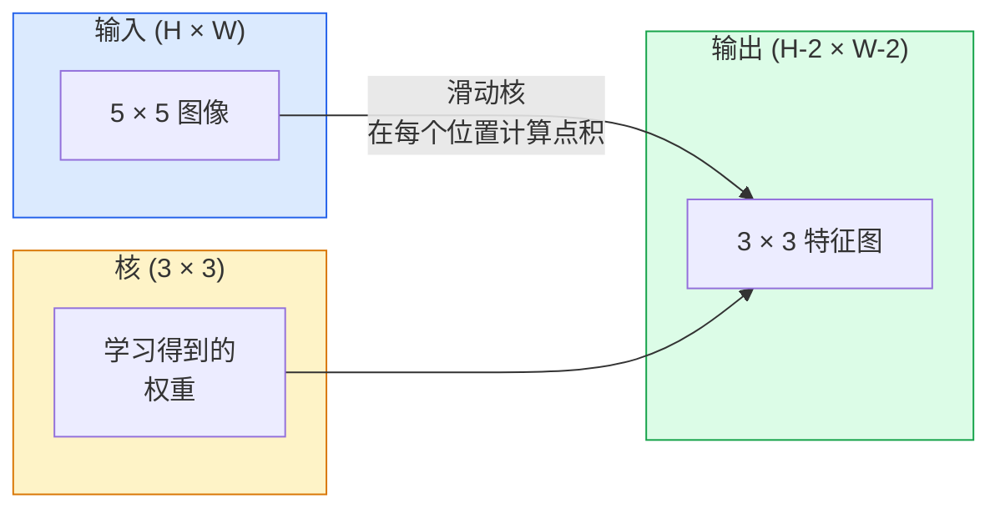
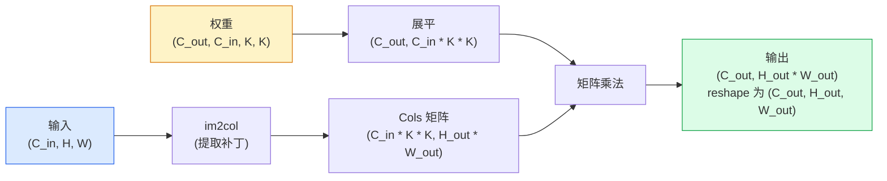

# 从零实现卷积

> 卷积就是一个你在图像上滑动的小型全连接层，在每个位置共享同样的权重。

**类型：** 动手构建
**语言：** Python
**前置条件：** 阶段 3（深度学习核心）、阶段 4 第 1 课（图像基础）
**时间：** 约 75 分钟

## 学习目标

- 仅用 NumPy 从零实现二维卷积，包括嵌套循环版本和向量化的 `im2col` 版本
- 计算任意输入尺寸、核尺寸、填充和步长组合下的输出空间尺寸，并解释 `(H - K + 2P) / S + 1` 公式的依据
- 手工设计核（边缘、模糊、锐化、Sobel）并解释每个核为何产生特定的激活模式
- 将多个卷积堆叠成特征提取器，理解堆叠深度与感受野大小之间的关系

## 问题

一个全连接层处理 224×224 的 RGB 图像，每个神经元需要 224 × 224 × 3 = 150,528 个输入权重。仅一个包含 1,000 个单元的隐藏层就已经有 1.5 亿个参数——而你还没有学到任何有用的东西。更糟糕的是，这个层无法感知左上角的狗和右下角的狗是同一个模式。它把每个像素位置当作独立的，这对图像来说完全错误：把一只猫平移三个像素不应该迫使网络重新学习这个概念。

图像模型需要的两个特性是**平移等变性**（输入平移时输出也跟着平移）和**参数共享**（同一个特征检测器在各处运行）。稠密层两者都给不了。卷积让这两个特性免费获得。

卷积并非为深度学习而发明。它与 JPEG 压缩、Photoshop 中的高斯模糊、工业视觉中的边缘检测以及所有音频滤波器的原理相同。CNN 在 2012 年到 2020 年统治 ImageNet 的原因是：卷积是nearby values are related 且同一模式可以出现在任何位置的数据的正确先验。

## 概念

### 一个核，滑动

二维卷积接受一个叫做核（或滤波器）的小权重矩阵，将它在输入上滑动，在每个位置计算逐元素乘积的和。这个和成为一个输出像素。



一个在 5×5 输入上的具体 3×3 示例（无填充，步长 1）：

```
输入 X (5 × 5):                核 W (3 × 3):

  1  2  0  1  2                   1  0 -1
  0  1  3  1  0                   2  0 -2
  2  1  0  2  1                   1  0 -1
  1  0  2  1  3
  2  1  1  0  1

核在每个有效的 3 × 3 窗口上滑动。输出 Y 是 3 × 3：

 Y[0,0] = sum( W * X[0:3, 0:3] )
 Y[0,1] = sum( W * X[0:3, 1:4] )
 Y[0,2] = sum( W * X[0:3, 2:5] )
 Y[1,0] = sum( W * X[1:4, 0:3] )
 ... 以此类推
```

这一个公式——**共享权重、局部性、滑动窗口**——就是全部思想。其他都是细节。

### 输出尺寸公式

给定输入空间尺寸 `H`、核尺寸 `K`、填充 `P`、步长 `S`：

```
H_out = floor( (H - K + 2P) / S ) + 1
```

记住这个。你在每个架构中会计算它几十次。

| 场景 | H | K | P | S | H_out |
|----------|---|---|---|---|-------|
| Valid 卷积，无填充 | 32 | 3 | 0 | 1 | 30 |
| Same 卷积（保持尺寸） | 32 | 3 | 1 | 1 | 32 |
| 下采样 2 倍 | 32 | 3 | 1 | 2 | 16 |
| 2×2 池化 | 32 | 2 | 0 | 2 | 16 |
| 大感受野 | 32 | 7 | 3 | 2 | 16 |

"Same 填充"意味着选择 P 使得当 S == 1 时 H_out == H。对于奇数 K，P = (K - 1) / 2。这就是为什么 3×3 核占主导地位——它们是最小的有中心点的奇数核。

### 填充

没有填充，每个卷积都会缩小特征图。堆叠 20 个这样的卷积，你的 224×224 图像会变成 184×184，这既浪费了边界上的计算，又使需要匹配形状的残差连接变得复杂。

```
在 5 × 5 输入上做零填充 (P = 1):

  0  0  0  0  0  0  0
  0  1  2  0  1  2  0
  0  0  1  3  1  0  0
  0  2  1  0  2  1  0       现在核可以以像素
  0  1  0  2  1  3  0       (0, 0) 为中心，并仍然有
  0  2  1  1  0  1  0       三行三列的值进行乘法运算。
  0  0  0  0  0  0  0
```

实践中遇到的填充模式：`zero`（最常用）、`reflect`（镜像边缘，避免生成模型中的硬边界）、`replicate`（复制边缘）、`circular`（环绕，用于环形问题）。

### 步长

步长是滑动的步距。`stride=1` 是默认值。`stride=2` 使空间尺寸减半，是 CNN 内经典的下采样方式，无需单独的池化层——每个现代架构（ResNet、ConvNeXt、MobileNet）都在某个地方用步长卷积替代最大池化。

```
在 5 × 5 输入上，3 × 3 核，步长 1:

  起始: (0,0) (0,1) (0,2)        -> 输出第 0 行
          (1,0) (1,1) (1,2)        -> 输出第 1 行
          (2,0) (2,1) (2,2)        -> 输出第 2 行

  输出: 3 × 3

在同一输入上步长 2:

  起始: (0,0) (0,2)              -> 输出第 0 行
          (2,0) (2,2)              -> 输出第 1 行

  输出: 2 × 2
```

### 多输入通道

真实图像有三个通道。在 RGB 输入上做 3×3 卷积实际上是一个 3×3×3 的体积：每个输入通道一个 3×3 切片。在每个空间位置，你将所有三个切片逐元素相乘并求和，再加上一个偏置。

```
输入:   (C_in,  H,  W)        3 × 5 × 5
核:     (C_in,  K,  K)        3 × 3 × 3 （一个核）
输出:   (1,     H', W')       2D 特征图

对于产生 C_out 个输出通道的层，你需要堆叠 C_out 个核：

权重:   (C_out, C_in, K, K)   例如 64 × 3 × 3 × 3
输出:   (C_out, H', W')       64 × 3 × 3

参数量: C_out * C_in * K * K + C_out   （+ C_out 是偏置）
```

最后这一行是你在规划模型时需要计算的。64 个通道的 3×3 卷积作用在 3 通道输入上有 `64 * 3 * 3 * 3 + 64 = 1,792` 个参数。很便宜。

### im2col 技巧

嵌套循环容易阅读但速度慢。GPU 需要大的矩阵乘法。技巧是：将输入的每个感受野窗口展平为大矩阵的一列，将核展平为一行，整个卷积就变成一次矩阵乘法。



每个生产级卷积实现都是这个技巧的变体加上缓存平铺技巧（直接卷积、Winograd、大核的 FFT 卷积）。理解了 im2col 就理解了核心。

### 感受野

单个 3×3 卷积查看 9 个输入像素。堆叠两个 3×3 卷积，第二层的一个神经元查看 5×5 输入像素。三个 3×3 卷积给出 7×7。一般来说：

```
L 个堆叠的 K × K 卷积（步长 1）后的感受野 = 1 + L * (K - 1)

有步长时：感受野沿每层步长成倍增长。
```

"3×3 一直到底"（VGG、ResNet、ConvNeXt）可行的全部原因是：两个 3×3 卷积看到的输入区域与一个 5×5 卷积相同，但参数更少，而且中间多了一次非线性。

## 动手实现

### 第 1 步：填充数组

从最小的原语开始：一个在 H × W 数组周围填充零的函数。

```python
import numpy as np

def pad2d(x, p):
    if p == 0:
        return x
    h, w = x.shape[-2:]
    out = np.zeros(x.shape[:-2] + (h + 2 * p, w + 2 * p), dtype=x.dtype)
    out[..., p:p + h, p:p + w] = x
    return out

x = np.arange(9).reshape(3, 3)
print(x)
print()
print(pad2d(x, 1))
```

`x.shape[:-2]` 这个尾轴技巧意味着同一函数无需修改就能处理 `(H, W)`、`(C, H, W)` 或 `(N, C, H, W)`。

### 第 2 步：嵌套循环的二维卷积

参考实现——慢，但明确。这就是 `torch.nn.functional.conv2d` 原则上做的事。

```python
def conv2d_naive(x, w, b=None, stride=1, padding=0):
    c_in, h, w_in = x.shape
    c_out, c_in_w, kh, kw = w.shape
    assert c_in == c_in_w

    x_pad = pad2d(x, padding)
    h_out = (h + 2 * padding - kh) // stride + 1
    w_out = (w_in + 2 * padding - kw) // stride + 1

    out = np.zeros((c_out, h_out, w_out), dtype=np.float32)
    for oc in range(c_out):
        for i in range(h_out):
            for j in range(w_out):
                hs = i * stride
                ws = j * stride
                patch = x_pad[:, hs:hs + kh, ws:ws + kw]
                out[oc, i, j] = np.sum(patch * w[oc])
        if b is not None:
            out[oc] += b[oc]
    return out
```

四个嵌套循环（输出通道、行、列，加上 C_in、kh、kw 上的隐式求和）。这是你检验每个更快实现的标准答案。

### 第 3 步：用手工设计的核验证

构建一个垂直 Sobel 核，将其应用到合成阶梯图像上，观察垂直边缘亮起。

```python
def synthetic_step_image():
    img = np.zeros((1, 16, 16), dtype=np.float32)
    img[:, :, 8:] = 1.0
    return img

sobel_x = np.array([
    [[-1, 0, 1],
     [-2, 0, 2],
     [-1, 0, 1]]
], dtype=np.float32)[None]

x = synthetic_step_image()
y = conv2d_naive(x, sobel_x, padding=1)
print(y[0].round(1))
```

预期在第 7 列（从左到右亮度增加）上有大的正值，其他地方为零。仅仅这一行打印就是你的正确性检查。

### 第 4 步：im2col

将输入中每个核大小的窗口转换为矩阵的一列。对于 `C_in=3, K=3`，每列是 27 个数字。

```python
def im2col(x, kh, kw, stride=1, padding=0):
    c_in, h, w = x.shape
    x_pad = pad2d(x, padding)
    h_out = (h + 2 * padding - kh) // stride + 1
    w_out = (w + 2 * padding - kw) // stride + 1

    cols = np.zeros((c_in * kh * kw, h_out * w_out), dtype=x.dtype)
    col = 0
    for i in range(h_out):
        for j in range(w_out):
            hs = i * stride
            ws = j * stride
            patch = x_pad[:, hs:hs + kh, ws:ws + kw]
            cols[:, col] = patch.reshape(-1)
            col += 1
    return cols, h_out, w_out
```

这仍然是 Python 循环，但现在重活是一次向量化的矩阵乘法。

### 第 5 步：通过 im2col + 矩阵乘法实现快速卷积

用一次矩阵乘法替换四重循环。

```python
def conv2d_im2col(x, w, b=None, stride=1, padding=0):
    c_out, c_in, kh, kw = w.shape
    cols, h_out, w_out = im2col(x, kh, kw, stride, padding)
    w_flat = w.reshape(c_out, -1)
    out = w_flat @ cols
    if b is not None:
        out += b[:, None]
    return out.reshape(c_out, h_out, w_out)
```

正确性检查：运行两个实现并比较。

```python
rng = np.random.default_rng(0)
x = rng.normal(0, 1, (3, 16, 16)).astype(np.float32)
w = rng.normal(0, 1, (8, 3, 3, 3)).astype(np.float32)
b = rng.normal(0, 1, (8,)).astype(np.float32)

y_naive = conv2d_naive(x, w, b, padding=1)
y_im2col = conv2d_im2col(x, w, b, padding=1)

print(f"max abs diff: {np.max(np.abs(y_naive - y_im2col)):.2e}")
```

`max abs diff` 应该大约在 `1e-5`——差异来自浮点累积顺序，不是 bug。

### 第 6 步：一组手工设计的核

五个滤波器，展示单个卷积层在任何训练之前能表达什么。

```python
KERNELS = {
    "identity": np.array([[0, 0, 0], [0, 1, 0], [0, 0, 0]], dtype=np.float32),
    "blur_3x3": np.ones((3, 3), dtype=np.float32) / 9.0,
    "sharpen": np.array([[0, -1, 0], [-1, 5, -1], [0, -1, 0]], dtype=np.float32),
    "sobel_x": np.array([[-1, 0, 1], [-2, 0, 2], [-1, 0, 1]], dtype=np.float32),
    "sobel_y": np.array([[-1, -2, -1], [0, 0, 0], [1, 2, 1]], dtype=np.float32),
}

def apply_kernel(img2d, kernel):
    x = img2d[None].astype(np.float32)
    w = kernel[None, None]
    return conv2d_im2col(x, w, padding=1)[0]
```

应用到任何灰度图像上：模糊软化、锐化增强边缘、Sobel-x 突出垂直边缘、Sobel-y 突出水平边缘。这些正是 AlexNet 和 VGG 的*第一个*训练卷积层最终学习到的模式——因为一个好的图像模型无论后续任务是什么都需要边缘和斑点检测器。

## 实际使用

PyTorch 的 `nn.Conv2d` 包装了相同的操作，加上自动求导、CUDA 核和 cuDNN 优化。形状语义相同。

```python
import torch
import torch.nn as nn

conv = nn.Conv2d(in_channels=3, out_channels=64, kernel_size=3, stride=1, padding=1)
print(conv)
print(f"weight shape: {tuple(conv.weight.shape)}   # (C_out, C_in, K, K)")
print(f"bias shape:   {tuple(conv.bias.shape)}")
print(f"param count:  {sum(p.numel() for p in conv.parameters())}")

x = torch.randn(8, 3, 224, 224)
y = conv(x)
print(f"\ninput  shape: {tuple(x.shape)}")
print(f"output shape: {tuple(y.shape)}")
```

把 `padding=1` 换成 `padding=0` 输出就降到 222×222。把 `stride=1` 换成 `stride=2` 输出就降到 112×112。和你上面记住的公式一样。

## 交付物

本课产出：

- `outputs/prompt-cnn-architect.md` —— 一个提示词，给定输入尺寸、参数预算和目标感受野，设计一个在各层具有正确 K/S/P 的 `Conv2d` 堆栈。
- `outputs/skill-conv-shape-calculator.md` —— 一个技能，逐层遍历网络规格并返回每个块的输出尺寸、感受野和参数量。

## 练习

1. **(简单)** 给定 128×128 灰度输入和 `[Conv3x3(s=1,p=1), Conv3x3(s=2,p=1), Conv3x3(s=1,p=1), Conv3x3(s=2,p=1)]` 堆栈，手动计算每层的输出空间尺寸和感受野。用 PyTorch `nn.Sequential` 的虚拟卷积验证。
2. **(中等)** 扩展 `conv2d_naive` 和 `conv2d_im2col` 以接受 `groups` 参数。说明 `groups=C_in=C_out` 再现了深度可分离卷积，其参数量是 `C * K * K` 而不是 `C * C * K * K`。
3. **(困难)** 手工实现 `conv2d_im2col` 的反向传播：给定输出的梯度，计算 `x` 和 `w` 的梯度。用相同的输入和权重通过 `torch.autograd.grad` 验证。技巧：im2col 的梯度是 col2im，且必须累积重叠窗口。

## 关键术语

| 术语 | 大家怎么说的 | 实际含义 |
|------|----------------|----------------------|
| 卷积 (Convolution) | "滑动滤波器" | 一个在每个空间位置应用的可学习点积，权重共享；数学上是互相关，但大家都叫它卷积 |
| 核 / 滤波器 (Kernel / filter) | "特征检测器" | 一个形状为 (C_in, K, K) 的小权重张量，它与输入窗口的点积产生一个输出像素 |
| 步长 (Stride) | "你跳多远" | 连续核位置之间的步距；步长 2 使每个空间尺寸减半 |
| 填充 (Padding) | "边缘上的零" | 在输入周围添加的额外值，使核能够以边界像素为中心；`same` 填充保持输出尺寸等于输入尺寸 |
| 感受野 (Receptive field) | "神经元看到多少" | 给定输出激活所依赖的原始输入补丁，随深度和步长增长 |
| im2col | "GEMM 技巧" | 将每个感受野窗口重新排列成列，使卷积成为一次大矩阵乘法——每个快速卷积核的核心 |
| 深度可分离卷积 (Depthwise conv) | "每个通道一个核" | `groups == C_in` 的卷积，只从其对应的输入通道计算每个输出通道；MobileNet 和 ConvNeXt 的主干 |
| 平移等变性 (Translation equivariance) | "输入移、输出移" | 输入平移 k 个像素时输出也平移 k 个像素的特性；共享权重免费带来这个特性 |

## 延伸阅读

- [A guide to convolution arithmetic for deep learning (Dumoulin & Visin, 2016)](https://arxiv.org/abs/1603.07285) — 每个课程悄悄抄袭的填充/步长/膨胀的权威图解
- [CS231n: Convolutional Neural Networks for Visual Recognition](https://cs231n.github.io/convolutional-networks/) — 经典的讲义笔记，包括原始的 im2col 解释
- [The Annotated ConvNet (fast.ai)](https://nbviewer.org/github/fastai/fastbook/blob/master/13_convolutions.ipynb) — 从手动卷积到训练好的数字分类器的笔记
- [Receptive Field Arithmetic for CNNs (Dang Ha The Hien)](https://distill.pub/2019/computing-receptive-fields/) — 感受野计算的高质量交互式解释器
