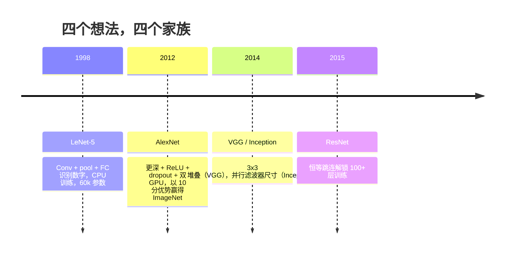
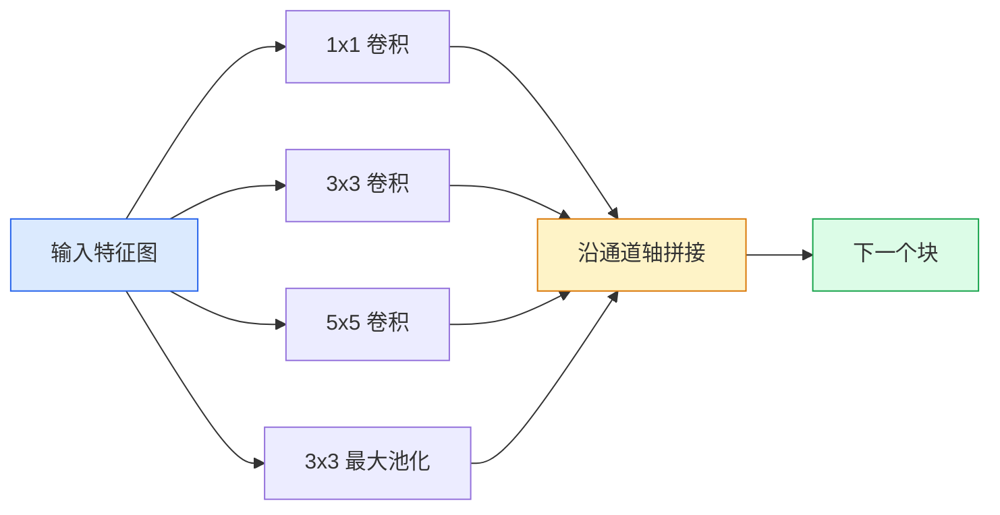
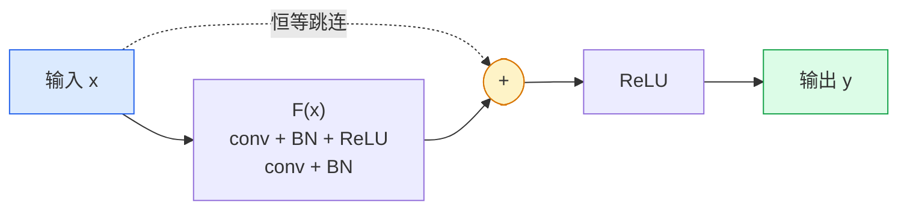

# CNN——从 LeNet 到 ResNet

> 过去三十年中，每一个主要的 CNN 都是同一套"卷积—非线性—下采样"配方加上一个新想法。依序学习这些想法。

**类型：** 学习型 + 构建型
**语言：** Python
**前置条件：** 阶段 3 第 11 课（PyTorch）、阶段 4 第 1 课（图像基础）、阶段 4 第 2 课（从零实现卷积）
**时间：** 约 75 分钟

## 学习目标

- 梳理 LeNet-5 -> AlexNet -> VGG -> Inception -> ResNet 的架构演进脉络，并指出每个家族贡献的单一新思想
- 在 PyTorch 中实现 LeNet-5、一个 VGG 风格块和一个 ResNet BasicBlock，每个不超过 40 行
- 解释残差连接如何将一个 1000 层的网络从不可训练变成 SOTA
- 阅读现代骨干网络（ResNet-18、ResNet-50），在查看源码之前预测其输出形状、感受野和参数量

## 问题

2011 年，ImageNet 最佳分类器 top-5 准确率约为 74%。2012 年 AlexNet 达到 85%。2015 年 ResNet 达到 96%。没有新数据，没有新一代 GPU。提升完全来自架构思路。一个工作的视觉工程师必须知道每个想法来自哪篇论文，因为 2026 年你交付的每一个生产骨干网络都是这些相同组件的重新组合——还因为这些想法不断迁移：分组卷积从 CNN 迁移到 Transformer，残差连接从 ResNet 迁移到每一个 LLM，批归一化存在于扩散模型中。

按顺序学习这些网络还能让你免疫一个常见错误：明明一个 LeNet 大小的网络就能解决问题，却去用最大的模型。MNIST 不需要 ResNet。了解每个家族的扩展曲线，能让你知道在该曲线上处于什么位置。

## 概念

### 改变视觉的四个想法



在经典视觉中，没有什么比这四次跳跃更重要。

### LeNet-5（1998）

Yann LeCun 的数字识别器。60,000 个参数。两个 conv-pool 块，两个全连接层，tanh 激活。它定义了每一个 CNN 继承的模板：

```
输入 (1, 32, 32)
  conv 5x5 -> (6, 28, 28)
  avg pool 2x2 -> (6, 14, 14)
  conv 5x5 -> (16, 10, 10)
  avg pool 2x2 -> (16, 5, 5)
  flatten -> 400
  dense -> 120
  dense -> 84
  dense -> 10
```

现代世界称为 CNN 的所有东西——交替的卷积和下采样馈入一个小分类头——都是层数更多、通道更宽、激活更好的 LeNet。

### AlexNet（2012）

三个变化共同突破了 ImageNet：

1. **ReLU** 替代 tanh。梯度停止消失。训练加速约六倍。
2. **Dropout** 用于全连接头。正则化成为一个层，而不是一个技巧。
3. **深度与宽度**。五个卷积层，三个密集层，60M 参数，在两块 GPU 上训练，模型在它们之间拆分。

论文的 Figure 2 仍然把 GPU 拆分显示为两条并行流。这种并行是硬件 workaround，不是架构洞察——但上面三个想法仍然在你使用的每一个模型中。

### VGG（2014）

VGG 问：如果只用 3x3 卷积并且往深做，会怎样？

```
堆叠：   conv 3x3 -> conv 3x3 -> pool 2x2
重复：   16 或 19 个卷积层
```

两个 3x3 卷积看到的 5x5 输入区域与一个 5x5 卷积相同，但参数更少（2*9*C² = 18C² vs 25*C²），而且中间多了一个 ReLU。VGG 把这个观察变成了一个完整的架构。简单性——一种块类型，重复——使它成为之后所有东西的参考点。

代价：138M 参数，训练慢，推理成本高。

### Inception（2014，同年）

Google 对"我应该用多大的卷积核？"的回答是：全部都用，并行。



每个分支专精——1x1 用于通道混合，3x3 用于局部纹理，5x5 用于更大模式，池化用于平移不变特征——拼接让下一层能选择哪个分支有用。Inception v1 在每个分支内部使用 1x1 卷积作为瓶颈，以保持参数数量合理。

### 退化问题

到 2015 年，VGG-19 可以工作而 VGG-32 不行。深度本应有帮助，但超过约 20 层后训练和测试损失都变差了。这不是过拟合。这是优化器无法找到有用的权重，因为梯度在每一层相乘地收缩。

```
普通深层网络：
  y = f_L( f_{L-1}( ... f_1(x) ... ) )

关于早期层的梯度：
  dL/dW_1 = dL/dy * df_L/df_{L-1} * ... * df_2/df_1 * df_1/dW_1

每个乘法项的幅度大约是（权重幅度）×（激活增益）。
堆叠 100 个增益 < 1 的项，梯度实际上为零。
```

VGG 在 19 层能工作是因为批归一化（同期发表）保持了激活值的良好缩放。但即使批归一化也无法在超过约 30 层后拯救深度。

### ResNet（2015）

He、Zhang、Ren、Sun 提出了一个改变一切的修改：

```
标准块：   y = F(x)
残差块：   y = F(x) + x
```

`+ x` 意味着该层总可以选择什么都不做——通过将 `F(x)` 推向零。一个 1000 层的 ResNet 最坏也不过像一个单层网络，因为每个额外的块都有一个简单的逃生通道。有了这个保证，优化器愿意让每个块*稍微*有用——稍微有用，堆叠 100 次，就是 SOTA。



这种块的两种变体到处出现：

- **BasicBlock**（ResNet-18、ResNet-34）：两个 3x3 卷积，跳连绕过两者。
- **Bottleneck**（ResNet-50、-101、-152）：1x1 缩减，3x3 中间，1x1 扩展，跳连绕过三者。在通道数高时更便宜。

当跳连必须跨越下采样（stride=2）时，恒等路径被 1x1 stride=2 卷积替换以匹配形状。

### 为什么残差在视觉之外也很重要

这个想法实际上与图像分类无关。它是要把深度网络从"祈祷梯度活下来"变成一个可靠的、可扩展的工程工具。下一个阶段你将读到的每一个 Transformer 在每个块中都有完全相同的跳连。没有 ResNet，就没有 GPT。

## 构建

### 第 1 步：LeNet-5

一个最小化、忠实的 LeNet。Tanh 激活，平均池化。对现代性的唯一让步是我们在下游使用 `nn.CrossEntropyLoss` 而不是原始的高斯连接。

```python
import torch
import torch.nn as nn
import torch.nn.functional as F

class LeNet5(nn.Module):
    def __init__(self, num_classes=10):
        super().__init__()
        self.conv1 = nn.Conv2d(1, 6, kernel_size=5)
        self.conv2 = nn.Conv2d(6, 16, kernel_size=5)
        self.pool = nn.AvgPool2d(2)
        self.fc1 = nn.Linear(16 * 5 * 5, 120)
        self.fc2 = nn.Linear(120, 84)
        self.fc3 = nn.Linear(84, num_classes)

    def forward(self, x):
        x = self.pool(torch.tanh(self.conv1(x)))
        x = self.pool(torch.tanh(self.conv2(x)))
        x = torch.flatten(x, 1)
        x = torch.tanh(self.fc1(x))
        x = torch.tanh(self.fc2(x))
        return self.fc3(x)

net = LeNet5()
x = torch.randn(1, 1, 32, 32)
print(f"output: {net(x).shape}")
print(f"params: {sum(p.numel() for p in net.parameters()):,}")
```

期望输出：`output: torch.Size([1, 10])`，`params: 61,706`。这就是开启了现代视觉的完整数字分类器。

### 第 2 步：一个 VGG 块

一个可复用块：两个 3x3 卷积、ReLU、批归一化、最大池化。

```python
class VGGBlock(nn.Module):
    def __init__(self, in_c, out_c):
        super().__init__()
        self.conv1 = nn.Conv2d(in_c, out_c, kernel_size=3, padding=1)
        self.bn1 = nn.BatchNorm2d(out_c)
        self.conv2 = nn.Conv2d(out_c, out_c, kernel_size=3, padding=1)
        self.bn2 = nn.BatchNorm2d(out_c)
        self.pool = nn.MaxPool2d(2)

    def forward(self, x):
        x = F.relu(self.bn1(self.conv1(x)))
        x = F.relu(self.bn2(self.conv2(x)))
        return self.pool(x)

class MiniVGG(nn.Module):
    def __init__(self, num_classes=10):
        super().__init__()
        self.stack = nn.Sequential(
            VGGBlock(3, 32),
            VGGBlock(32, 64),
            VGGBlock(64, 128),
        )
        self.head = nn.Sequential(
            nn.AdaptiveAvgPool2d(1),
            nn.Flatten(),
            nn.Linear(128, num_classes),
        )

    def forward(self, x):
        return self.head(self.stack(x))

net = MiniVGG()
x = torch.randn(1, 3, 32, 32)
print(f"output: {net(x).shape}")
print(f"params: {sum(p.numel() for p in net.parameters()):,}")
```

三个 VGG 块用于 CIFAR 尺寸的输入，一个自适应池化，一个线性层。约 290k 参数。对 CIFAR-10 来说足够。

### 第 3 步：一个 ResNet BasicBlock

ResNet-18 和 ResNet-34 的核心构建块。

```python
class BasicBlock(nn.Module):
    def __init__(self, in_c, out_c, stride=1):
        super().__init__()
        self.conv1 = nn.Conv2d(in_c, out_c, kernel_size=3, stride=stride, padding=1, bias=False)
        self.bn1 = nn.BatchNorm2d(out_c)
        self.conv2 = nn.Conv2d(out_c, out_c, kernel_size=3, stride=1, padding=1, bias=False)
        self.bn2 = nn.BatchNorm2d(out_c)
        if stride != 1 or in_c != out_c:
            self.shortcut = nn.Sequential(
                nn.Conv2d(in_c, out_c, kernel_size=1, stride=stride, bias=False),
                nn.BatchNorm2d(out_c),
            )
        else:
            self.shortcut = nn.Identity()

    def forward(self, x):
        out = F.relu(self.bn1(self.conv1(x)))
        out = self.bn2(self.conv2(out))
        out = out + self.shortcut(x)
        return F.relu(out)
```

卷积层上的 `bias=False` 是批归一化的约定——BN 的 beta 参数已经处理偏置，所以同时携带卷积偏置是浪费。只有当 stride 或通道数改变时 `shortcut` 才需要一个真正的卷积；否则它是一个空操作恒等映射。

### 第 4 步：一个小型 ResNet

堆叠四组 BasicBlock 以获得一个可用于 CIFAR 尺寸输入的 ResNet。

```python
class TinyResNet(nn.Module):
    def __init__(self, num_classes=10):
        super().__init__()
        self.stem = nn.Sequential(
            nn.Conv2d(3, 32, kernel_size=3, stride=1, padding=1, bias=False),
            nn.BatchNorm2d(32),
            nn.ReLU(inplace=True),
        )
        self.layer1 = self._make_group(32, 32, num_blocks=2, stride=1)
        self.layer2 = self._make_group(32, 64, num_blocks=2, stride=2)
        self.layer3 = self._make_group(64, 128, num_blocks=2, stride=2)
        self.layer4 = self._make_group(128, 256, num_blocks=2, stride=2)
        self.head = nn.Sequential(
            nn.AdaptiveAvgPool2d(1),
            nn.Flatten(),
            nn.Linear(256, num_classes),
        )

    def _make_group(self, in_c, out_c, num_blocks, stride):
        blocks = [BasicBlock(in_c, out_c, stride=stride)]
        for _ in range(num_blocks - 1):
            blocks.append(BasicBlock(out_c, out_c, stride=1))
        return nn.Sequential(*blocks)

    def forward(self, x):
        x = self.stem(x)
        x = self.layer1(x)
        x = self.layer2(x)
        x = self.layer3(x)
        x = self.layer4(x)
        return self.head(x)

net = TinyResNet()
x = torch.randn(1, 3, 32, 32)
print(f"output: {net(x).shape}")
print(f"params: {sum(p.numel() for p in net.parameters()):,}")
```

每组两个块。在第 2、3、4 组开始处 stride 为 2。每一次下采样通道数翻倍。约 2.8M 参数。这就是可干净扩展到 ResNet-152 的标准配方。

### 第 5 步：比较参数量与特征效率

用相同的输入运行所有三个网络并比较参数量。

```python
def summary(name, net, x):
    y = net(x)
    params = sum(p.numel() for p in net.parameters())
    print(f"{name:12s}  input {tuple(x.shape)} -> output {tuple(y.shape)}  params {params:>10,}")

x = torch.randn(1, 3, 32, 32)
summary("LeNet5",     LeNet5(),       torch.randn(1, 1, 32, 32))
summary("MiniVGG",    MiniVGG(),      x)
summary("TinyResNet", TinyResNet(),   x)
```

三个模型，三个时代，三个数量级的参数量。对于 CIFAR-10 准确率，你大约需要：LeNet 60%，MiniVGG 89%，TinyResNet 93%（训练几个 epoch 后）。

## 使用

`torchvision.models` 为以上所有模型提供预训练版本。调用签名在各家族间相同，这正是骨干网络抽象的意义。

```python
from torchvision.models import resnet18, ResNet18_Weights, vgg16, VGG16_Weights

r18 = resnet18(weights=ResNet18_Weights.IMAGENET1K_V1)
r18.eval()

print(f"ResNet-18 params: {sum(p.numel() for p in r18.parameters()):,}")
print(r18.layer1[0])
print()

v16 = vgg16(weights=VGG16_Weights.IMAGENET1K_V1)
v16.eval()
print(f"VGG-16   params: {sum(p.numel() for p in v16.parameters()):,}")
```

ResNet-18 有 11.7M 参数。VGG-16 有 138M。ImageNet top-1 准确率相近（69.8% vs 71.6%）。残差连接为你赢得了 12 倍的参数效率。这就是 ResNet 变体从 2016 年到 2021 年 ViT 出现期间主导地位的原因——在计算是约束的真实世界部署中仍然主导。

对于迁移学习，配方始终相同：加载预训练权重，冻结骨干网络，替换分类头。

```python
for p in r18.parameters():
    p.requires_grad = False
r18.fc = nn.Linear(r18.fc.in_features, 10)
```

三行代码。你现在有了一个继承 ImageNet 付费得到的表示的 10 类 CIFAR 分类器。

## 交付

本课产出：

- `outputs/prompt-backbone-selector.md`——一个提示词，根据任务、数据集大小和计算预算选择正确的 CNN 家族（LeNet/VGG/ResNet/MobileNet/ConvNeXt）。
- `outputs/skill-residual-block-reviewer.md`——一个技能，读取 PyTorch 模块并标记跳连错误（stride 变化时缺少 shortcut、shortcut 激活顺序、加法相对 BN 的位置）。

## 练习

1. **（简单）** 手算 `TinyResNet` 每层的参数量。与 `sum(p.numel() for p in net.parameters())` 比较。参数预算的主要部分去哪里了——卷积、BN，还是分类头？
2. **（中等）** 实现 Bottleneck 块（1x1 -> 3x3 -> 1x1 带跳连）并用它为 CIFAR 构建一个类 ResNet-50 的网络。与 `TinyResNet` 比较参数量。
3. **（困难）** 从 `BasicBlock` 移除跳连，在 CIFAR-10 上分别训练一个 34 块的"普通"网络和一个 34 块的 ResNet 各 10 个 epoch。绘制两者的训练损失 vs epoch 曲线。复现 He 等人 Figure 1 的结果，其中普通深层网络收敛到比其更浅的对等网络更高的损失。

## 关键术语

| 术语 | 大家怎么说的 | 实际含义 |
|------|----------------|----------------------|
| 骨干网络 (Backbone) | "模型" | 产生馈入任务头的特征图的卷积块堆叠 |
| 残差连接 (Residual connection) | "跳连" | `y = F(x) + x`；让优化器通过将 F 设为零来学习恒等，这使得任意深度都可训练 |
| BasicBlock | "两个 3x3 卷积带跳连" | ResNet-18/34 的构建块：conv-BN-ReLU-conv-BN-add-ReLU |
| Bottleneck | "1x1 缩减，3x3，1x1 扩展" | ResNet-50/101/152 的块；在高通道数时便宜，因为 3x3 运行在缩减后的宽度上 |
| 退化问题 (Degradation problem) | "更深反而更差" | 超过约 20 层普通卷积后，训练和测试误差都增加；用残差连接解决，而不是更多数据 |
| Stem | "第一层" | 将 3 通道输入转换为基本特征宽度的初始卷积；对 ImageNet 通常是 7x7 stride 2，对 CIFAR 是 3x3 stride 1 |
| Head | "分类头" | 最后一个骨干块之后的层：自适应池化、展平、线性层 |
| 迁移学习 (Transfer learning) | "预训练权重" | 加载在 ImageNet 上训练的骨干网络，只在任务头上微调 |

## 延伸阅读

- [Deep Residual Learning for Image Recognition (He et al., 2015)](https://arxiv.org/abs/1512.03385)——ResNet 论文；每一张图都值得研究
- [Very Deep Convolutional Networks (Simonyan & Zisserman, 2014)](https://arxiv.org/abs/1409.1556)——VGG 论文；仍然是"为什么用 3x3"的最佳参考
- [ImageNet Classification with Deep CNNs (Krizhevsky et al., 2012)](https://papers.nips.cc/paper_files/paper/2012/hash/c399862d3b9d6b76c8436e924a68c45b-Abstract.html)——AlexNet；终结手工特征时代的论文
- [Going Deeper with Convolutions (Szegedy et al., 2014)](https://arxiv.org/abs/1409.4842)——Inception v1；仍然出现在视觉 Transformer 中的并行滤波器想法
