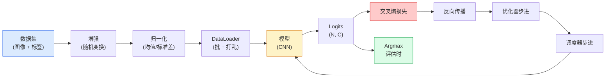

# 图像分类

> 分类器是一个从像素到类别概率分布的函数。其他一切都是管道工程。

**类型：** 构建型
**语言：** Python
**前置条件：** 阶段 2 第 09 课（模型评估）、阶段 3 第 10 课（迷你框架）、阶段 4 第 03 课（CNN）
**时间：** 约 75 分钟

## 学习目标

- 在 CIFAR-10 上构建端到端图像分类 pipeline：数据集、增强、模型、训练循环、评估
- 解释每个组件（DataLoader、损失函数、优化器、学习率调度器、增强）的作用，并预测破坏任何一个组件会在损失曲线上如何显现
- 从零实现 mixup、cutout 和标签平滑，并说明何时值得添加
- 阅读混淆矩阵和每类精确率/召回率表，诊断聚合准确率之外的数据集和模型问题

## 问题

每一个落地的视觉任务在某种程度上都归结为图像分类。检测是对区域进行分类，分割是对像素进行分类，检索是按与类中心的相似度排序。正确掌握分类——数据集循环、增强策略、损失函数、评估——是能够迁移到该阶段所有其他任务的技能。

大多数分类 bug 不在模型里，而在 pipeline 里：损坏的归一化、未打乱顺序的训练集、扭曲标签的数据增强、被训练数据污染的验证集、在第 30 轮之后悄然发散的学习率。一个在正确配置下能达到 93% 的 CNN，在配置损坏时往往只能达到 70-75%，而损失曲线全程看起来都很合理。

这节课手工连接整个 pipeline，使每个部分都可检查。你不会使用 `torchvision.datasets` 中任何可能隐藏 bug 的东西。

## 概念

### 分类 pipeline



这个循环中的每一行都可能藏有 bug。交叉熵接收原始 logits，而非 softmax 输出，所以在损失函数之前调用 `model(x).softmax()` 实际上在悄悄计算错误的梯度。增强只作用于输入，不作用于标签——mixup 除外，它同时混合两者。`optimizer.zero_grad()`必须在每步执行一次；跳过它会累积梯度，看起来就像学习率极度不稳定。这些 bug 中的每一个都会使学习曲线变得平缓，而不会抛出错误。

### 交叉熵、logits 和 softmax

分类器为每张图像生成 `C` 个数字，称为 logits。应用 softmax 将它们转换为概率分布：

```
softmax(z)_i = exp(z_i) / sum_j exp(z_j)
```

交叉熵衡量正确类的负对数概率：

```
CE(z, y) = -log( softmax(z)_y )
        = -z_y + log( sum_j exp(z_j) )
```

右边这个形式是数值稳定的（log-sum-exp）。PyTorch 的 `nn.CrossEntropyLoss` 将 softmax + NLL 融合为一个操作，并直接接收原始 logits。先自行应用 softmax 几乎总是一个 bug——你计算的是 log(softmax(softmax(z)))，一个毫无意义的量。

### 为什么增强有效

CNN 有对平移的归纳偏置（来自权重共享），但对裁剪、翻转、颜色抖动或遮挡没有内置的不变性。教它这些不变性的唯一方法是让它看到行使这些特性的像素。训练时每个随机变换都是在说："这两张图像有相同的标签；学习忽略差异的特征。"

```
原始裁剪：  "狗朝左"
翻转：      "狗朝右"            <-相同标签，不同像素
旋转(+15)： "狗，轻微倾斜"
颜色抖动：  "狗在暖光下"
随机擦除：  "狗缺了一块"
```

规则：增强必须保留标签。对数字进行 Cutout 和旋转可能把 "6" 变成 "9"；对于这类数据集，使用更小的旋转范围，并选择尊重数字特有不变性的增强。

### Mixup 和 Cutmix

普通增强变换像素但保持标签为 one-hot。**Mixup** 和 **Cutmix** 通过同时插值两者来打破这一点。

```
Mixup：
  lambda ~ Beta(a, a)
  x = lambda * x_i + (1 - lambda) * x_j
  y = lambda * y_i + (1 - lambda) * y_j

Cutmix：
  将 x_j 的随机矩形粘贴到 x_i 中
  y = 按面积加权的 y_i 和 y_j 的混合
```

它有效的原因：模型停止记忆尖锐的 one-hot 目标，开始学习类之间的插值。训练损失上升，测试准确率上升。这是任何分类器最便宜的鲁棒性升级。

### 标签平滑

mixup 的表亲。不以 `[0, 0, 1, 0, 0]` 训练，而是以 `[eps/C, eps/C, 1-eps, eps/C, eps/C]` 训练，其中 eps 是一个小值如 0.1。防止模型产生任意尖锐的 logits，并以极低成本改善校准。自 PyTorch 1.10 起内置于 `nn.CrossEntropyLoss(label_smoothing=0.1)`。

### 超越准确率的评估

聚合准确率会掩盖不平衡。一个始终预测多数类的 90-10 二分类器得分为 90%。真正能告诉你发生了什么的是这些工具：

- **每类准确率** — 每个类一个数字；立即暴露表现不佳的类别。
- **混淆矩阵** — C x C 网格，行 i 列 j = 真实类 i 被预测为类 j 的数量；对角线是正确的，非对角线是模型犯错的地方。
- **Top-1 / Top-5** — 正确类是否在前 1 或前 5 预测中；Top-5 对 ImageNet 很重要，因为像 "Norwich terrier" 和 "Norfolk terrier" 这样的类确实难以区分。
- **校准（ECE）** — 0.8 置信度的预测有80% 是对的吗？现代网络系统性地过度自信；用温度缩放或标签平滑来修复。

## 动手构建

### 第 1 步：确定性合成数据集

CIFAR-10 在磁盘上。为了使本课可复现且快速，我们构建一个看起来像 CIFAR 的合成数据集——32x32 RGB 图像，具有模型必须学习的类特定结构。完全相同的 pipeline 原封不动地适用于真实的 CIFAR-10。

```python
import numpy as np
import torch
from torch.utils.data import Dataset


def synthetic_cifar(num_per_class=1000, num_classes=10, seed=0):
    rng = np.random.default_rng(seed)
    X = []
    Y = []
    for c in range(num_classes):
        centre = rng.uniform(0, 1, (3,))
        freq = 2 + c
        for _ in range(num_per_class):
            yy, xx = np.meshgrid(np.linspace(0, 1, 32), np.linspace(0, 1, 32), indexing="ij")
            r = np.sin(xx * freq) * 0.5 + centre[0]
            g = np.cos(yy * freq) * 0.5 + centre[1]
            b = (xx + yy) * 0.5 * centre[2]
            img = np.stack([r, g, b], axis=-1)
            img += rng.normal(0, 0.08, img.shape)
            img = np.clip(img, 0, 1)
            X.append(img.astype(np.float32))
            Y.append(c)
    X = np.stack(X)
    Y = np.array(Y)
    idx = rng.permutation(len(X))
    return X[idx], Y[idx]


class ArrayDataset(Dataset):
    def __init__(self, X, Y, transform=None):
        self.X = X
        self.Y = Y
        self.transform = transform

    def __len__(self):
        return len(self.X)

    def __getitem__(self, i):
        img = self.X[i]
        if self.transform is not None:
            img = self.transform(img)
        img = torch.from_numpy(img).permute(2, 0, 1)
        return img, int(self.Y[i])
```

每个类获得自己的调色板和频率模式，外加高斯噪声，以迫使模型学习信号而不是记忆像素。10 个类，每类 1000 张图像，然后打乱。

### 第 2 步：归一化和增强

每个视觉 pipeline 都有的两个变换。

```python
def standardize(mean, std):
    mean = np.array(mean, dtype=np.float32)
    std = np.array(std, dtype=np.float32)
    def _fn(img):
        return (img - mean) / std
    return _fn


def random_hflip(p=0.5):
    def _fn(img):
        if np.random.random() < p:
            return img[:, ::-1, :].copy()
        return img
    return _fn


def random_crop(pad=4):
    def _fn(img):
        h, w = img.shape[:2]
        padded = np.pad(img, ((pad, pad), (pad, pad), (0, 0)), mode="reflect")
        y = np.random.randint(0, 2 * pad)
        x = np.random.randint(0, 2 * pad)
        return padded[y:y + h, x:x + w, :]
    return _fn


def compose(*fns):
    def _fn(img):
        for fn in fns:
            img = fn(img)
        return img
    return _fn
```

裁剪前使用反射填充而非零填充，因为黑色边框是模型会学会以一种无益的方式忽略的信号。

### 第 3 步：Mixup

在训练步骤内混合两张图像和两个标签。作为批变换实现，所以它位于前向传递旁边而不是数据集内部。

```python
def mixup_batch(x, y, num_classes, alpha=0.2):
    if alpha <= 0:
        return x, torch.nn.functional.one_hot(y, num_classes).float()
    lam = float(np.random.beta(alpha, alpha))
    idx = torch.randperm(x.size(0), device=x.device)
    x_mixed = lam * x + (1 - lam) * x[idx]
    y_onehot = torch.nn.functional.one_hot(y, num_classes).float()
    y_mixed = lam * y_onehot + (1 - lam) * y_onehot[idx]
    return x_mixed, y_mixed


def soft_cross_entropy(logits, soft_targets):
    log_probs = torch.log_softmax(logits, dim=-1)
    return -(soft_targets * log_probs).sum(dim=-1).mean()
```

`soft_cross_entropy` 是针对软标签分布的交叉熵。当目标恰好是 one-hot 时，它退化为通常的 one-hot 情况。

### 第 4 步：训练循环

完整配方：一次数据遍历，每批一次梯度，每轮一次调度器步进。

```python
import torch
import torch.nn as nn
from torch.utils.data import DataLoader
from torch.optim import SGD
from torch.optim.lr_scheduler import CosineAnnealingLR

def train_one_epoch(model, loader, optimizer, device, num_classes, use_mixup=True):
    model.train()
    total, correct, loss_sum = 0, 0, 0.0
    for x, y in loader:
        x, y = x.to(device), y.to(device)
        if use_mixup:
            x_m, y_soft = mixup_batch(x, y, num_classes)
            logits = model(x_m)
            loss = soft_cross_entropy(logits, y_soft)
        else:
            logits = model(x)
            loss = nn.functional.cross_entropy(logits, y, label_smoothing=0.1)
        optimizer.zero_grad()
        loss.backward()
        optimizer.step()
        loss_sum += loss.item() * x.size(0)
        total += x.size(0)
        # Training accuracy vs the un-mixed labels `y` is only an approximation
        # when mixup is on (the model saw soft targets, not y). Treat it as a
        # rough progress signal; rely on val accuracy for real performance.
        with torch.no_grad():
            pred = logits.argmax(dim=-1)
            correct += (pred == y).sum().item()
    return loss_sum / total, correct / total


@torch.no_grad()
def evaluate(model, loader, device, num_classes):
    model.eval()
    total, correct = 0, 0
    loss_sum = 0.0
    cm = torch.zeros(num_classes, num_classes, dtype=torch.long)
    for x, y in loader:
        x, y = x.to(device), y.to(device)
        logits = model(x)
        loss = nn.functional.cross_entropy(logits, y)
        pred = logits.argmax(dim=-1)
        for t, p in zip(y.cpu(), pred.cpu()):
            cm[t, p] += 1
        loss_sum += loss.item() * x.size(0)
        total += x.size(0)
        correct += (pred == y).sum().item()
    return loss_sum / total, correct / total, cm
```

每次写训练循环时检查的五个不变量：

1. 训练前 `model.train()`，评估前 `model.eval()` — 切换 dropout 和 batchnorm 行为。
2. `.backward()` 前 `.zero_grad()`。
3. 累积指标时使用 `.item()`，以保持计算图不存活。
4. 评估时使用 `@torch.no_grad()` — 节省内存和时间，防止微妙的事故。
5. 对原始 logits 而非 softmax 使用 argmax — 结果相同，少一个操作。

### 第 5 步：组合起来

使用上一课的 `TinyResNet`，训练几个轮次，然后评估。

```python
from main import synthetic_cifar, ArrayDataset
from main import standardize, random_hflip, random_crop, compose
from main import mixup_batch, soft_cross_entropy
from main import train_one_epoch, evaluate
# TinyResNet comes from the previous lesson (03-cnns-lenet-to-resnet).
# Adjust the import path to wherever you stored the previous lesson's code.
from cnns_lenet_to_resnet import TinyResNet  # example placeholder

X, Y = synthetic_cifar(num_per_class=500)
split = int(0.9 * len(X))
X_train, Y_train = X[:split], Y[:split]
X_val, Y_val = X[split:], Y[split:]

mean = [0.5, 0.5, 0.5]
std = [0.25, 0.25, 0.25]
train_tf = compose(random_hflip(), random_crop(pad=4), standardize(mean, std))
eval_tf = standardize(mean, std)

train_ds = ArrayDataset(X_train, Y_train, transform=train_tf)
val_ds = ArrayDataset(X_val, Y_val, transform=eval_tf)

train_loader = DataLoader(train_ds, batch_size=128, shuffle=True, num_workers=0)
val_loader = DataLoader(val_ds, batch_size=256, shuffle=False, num_workers=0)

device = "cuda" if torch.cuda.is_available() else "cpu"
model = TinyResNet(num_classes=10).to(device)
optimizer = SGD(model.parameters(), lr=0.1, momentum=0.9, weight_decay=5e-4, nesterov=True)
scheduler = CosineAnnealingLR(optimizer, T_max=10)

for epoch in range(10):
    tr_loss, tr_acc = train_one_epoch(model, train_loader, optimizer, device, 10, use_mixup=True)
    va_loss, va_acc, _ = evaluate(model, val_loader, device, 10)
    scheduler.step()
    print(f"epoch {epoch:2d}  lr {scheduler.get_last_lr()[0]:.4f}  "
          f"train {tr_loss:.3f}/{tr_acc:.3f}  val {va_loss:.3f}/{va_acc:.3f}")
```

在合成数据集上，这可以在五个轮次内达到接近完美的验证准确率，这就是重点：pipeline 是正确的，模型可以学习可学习的东西。将数据集换成真实的 CIFAR-10，相同的循环可以训练到约 90%，无需任何更改。

### 第 6 步：阅读混淆矩阵

仅靠准确率永远不会告诉你模型在哪里失败。混淆矩阵可以做到。

```python
def print_confusion(cm, labels=None):
    c = cm.shape[0]
    labels = labels or [str(i) for i in range(c)]
    print(f"{'':>6}" + "".join(f"{l:>5}" for l in labels))
    for i in range(c):
        row = cm[i].tolist()
        print(f"{labels[i]:>6}" + "".join(f"{v:>5}" for v in row))
    print()
    tp = cm.diag().float()
    fp = cm.sum(dim=0).float() - tp
    fn = cm.sum(dim=1).float() - tp
    prec = tp / (tp + fp).clamp_min(1)
    rec = tp / (tp + fn).clamp_min(1)
    f1 = 2 * prec * rec / (prec + rec).clamp_min(1e-9)
    for i in range(c):
        print(f"{labels[i]:>6}  prec {prec[i]:.3f}  rec {rec[i]:.3f}  f1 {f1[i]:.3f}")

_, _, cm = evaluate(model, val_loader, device, 10)
print_confusion(cm)
```

行是真实类别，列是预测。第3 和第 5 类之间的一组非对角线计数意味着模型混淆了这两个类，这为你提供了有针对性的数据收集或类特定增强的起点。

## 实际使用

`torchvision` 将上述所有内容包装成惯用组件。对于真实的 CIFAR-10，完整的 pipeline 是四行加一个训练循环。

```python
from torchvision.datasets import CIFAR10
from torchvision.transforms import Compose, RandomCrop, RandomHorizontalFlip, ToTensor, Normalize

mean = (0.4914, 0.4822, 0.4465)
std = (0.2470, 0.2435, 0.2616)
train_tf = Compose([
    RandomCrop(32, padding=4, padding_mode="reflect"),
    RandomHorizontalFlip(),
    ToTensor(),
    Normalize(mean, std),
])
eval_tf = Compose([ToTensor(), Normalize(mean, std)])

train_ds = CIFAR10(root="./data", train=True,  download=True, transform=train_tf)
val_ds   = CIFAR10(root="./data", train=False, download=True, transform=eval_tf)
```

两件需要注意的事：均值/标准差是**数据集特定的**——在 CIFAR-10 训练集上计算，而非 ImageNet——而反射填充是社区默认的裁剪策略。在这里复制粘贴 ImageNet 统计数据是一个约 1% 的准确率泄漏，没人发现，直到有人对模型进行性能分析。

## 交付物

本课产出：

- `outputs/prompt-classifier-pipeline-auditor.md` — 一个提示词，用于审计训练脚本是否符合上述五个不变量，并暴露第一个违规。
- `outputs/skill-classification-diagnostics.md` — 一个技能，给定混淆矩阵和类名列表，总结每类失败并提出最具影响力的单一修复方案。

## 练习

1. **(简单)** 在合成数据集上用 mixup 和不用 mixup 训练同一个模型五个轮次。绘制两者的训练损失和验证损失。解释为什么 mixup 的训练损失更高，但验证准确率相似或更好。
2. **(中等)** 实现 Cutout——将每张训练图像中的一个随机 8x8 方块置零——并进行消融实验：分别对比无增强、hflip+crop、hflip+crop+cutout、hflip+crop+mixup。报告每种的验证准确率。
3. **(困难)** 构建 CIFAR-100 pipeline（100 个类，相同输入大小），并重现 ResNet-34 训练运行，达到公开准确率的 1% 以内。附加任务：扫描三个学习率和两个权重衰减，记录到本地 CSV，生成最终的混淆矩阵-最高混淆表。

## 关键术语

| 术语 | 大家怎么说的 | 实际含义 |
|------|----------------|----------------------|
| Logits | "原始输出" | 每张图像 C 个数字的 pre-softmax 向量；交叉熵期望这些，而非 softmax 后的值 |
| 交叉熵 | "损失函数" | 正确类的负对数概率；将 log-softmax 和 NLL 融合为一个稳定操作 |
| DataLoader | "批处理器" | 用打乱、批处理和（可选）多工作进程加载来包装数据集；一半训练 bug 的替罪羊 |
| 增强 | "随机变换" | 训练时任何保留标签的像素级变换；教授 CNN 原生不具备的不变性 |
| Mixup / Cutmix | "混合两张图像" | 同时混合输入和标签，使分类器学习平滑插值而非硬边界 |
| 标签平滑 | "更软的目标" | 用 (1-eps, eps/(C-1), ...) 替换 one-hot；改善校准并略微提升准确率 |
| Top-k 准确率 | "Top-5" | 正确类是否在 k 个最高概率预测中；用于确实难以区分的类（如 ImageNet） |
| 混淆矩阵 | "错误在哪里" | C x C 表，条目 (i, j) 是真实类 i 被预测为 j 的图像数量；对角线正确，非对角线告诉你需要修复什么 |

## 延伸阅读

- [CS231n: Training Neural Networks](https://cs231n.github.io/neural-networks-3/) — 单页面上最清晰的学习 pipeline 导览
- [Bag of Tricks for Image Classification (He et al., 2019)](https://arxiv.org/abs/1812.01187) —每一个小技巧合在一起为 ImageNet 上的 ResNet 准确率增加了 3-4%
- [mixup: Beyond Empirical Risk Minimization (Zhang et al., 2017)](https://arxiv.org/abs/1710.09412) — 原始 mixup 论文；三页理论加上令人信服的实验
- [Why temperature scaling matters (Guo et al., 2017)](https://arxiv.org/abs/1706.04599) — 证明了现代网络校准不良并用一个标量参数修复了它的论文
