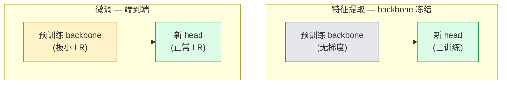

# 迁移学习与微调

> 某人在 GPU 上花了上百万小时，才教会一个网络识别边缘、纹理和物体部件。在训练你自己的模型之前，先借用这些特征。

**类型：** 构建型
**语言：** Python
**前置条件：** 阶段 4 第 03 课（CNN）、阶段 4 第 04 课（图像分类）
**时间：** 约 75 分钟

## 学习目标

- 区分特征提取与微调，根据数据集大小、领域距离和计算预算选择正确的方法
- 加载预训练 backbone，替换分类 head，用不到 20 行代码让 head 达到可用 baseline
- 用差异化学习率渐进解冻层，使早期通用特征获得比晚期任务特定特征更小的更新
- 诊断三种常见失败：解冻 block 上学习率过高导致特征漂移、小数据集上 BN 统计量崩溃、以及灾难性遗忘

## 问题

在 ImageNet 上训练一个 ResNet-50 需要约 2000 GPU 小时。很少有团队对每个上线任务都有这个预算。实际上几乎每个团队交付的都是一个预训练 backbone，加上在几百或几千张任务特定图像上训练的新 head。

这不是捷径。任何在 ImageNet 上训练的 CNN，第一个卷积 block 学到的是边缘和 Gabor 类滤波器。接下来的几个 block 学到纹理和简单图案。中层 block 学到物体部件。最后的 block 学到开始看起来像 1000 个 ImageNet 类别的组合。这个层级结构的前 90% 几乎原封不动地迁移到医学影像、工业检测、卫星数据和所有其他视觉任务——因为自然的边缘和纹理词汇量是有限的。你实际训练的是最后 10%。

正确实现迁移有三个坑等着你：用过高学习率破坏预训练特征、冻结太多导致模型信息匮乏、以及让 BatchNorm 的运行统计量漂移到一个网络其他部分从未学过的微小数据集。本课会逐一踩坑演示。

## 概念

### 特征提取 vs 微调

两种模式，根据你对预训练特征的信任程度和数据量来选择。



经验法则：

| 数据集大小 | 领域距离 | 方案 |
|------------|----------|------|
| < 1k 图片 | 接近 ImageNet | 冻结 backbone，只训练 head |
| 1k-10k | 接近 | 冻结前 2-3 个 stage，微调其余部分 |
| 10k-100k | 任意 | 用差异化 LR 端到端微调 |
| 100k+ | 远 | 微调全部；若领域足够远可考虑从头训练 |

"接近 ImageNet"大致意味着自然 RGB 照片，包含类似物体的内容。医学 CT 扫描、航拍卫星图像和显微镜是远领域——特征仍然有帮助，但你需要让更多层适应。

### 冻结为什么有效

CNN 在 ImageNet 上学到的特征并不是专门针对那 1000 个类别的。它们专门针对自然图像的统计特性：特定方向的边缘、纹理、对比度模式、形状基元。这些统计特性在人类能想到的几乎所有视觉领域中都是稳定的。这就是为什么一个在 ImageNet 上训练的模型，在 CIFAR-10 上做零样本评估时，仅用一个新线性 head（不微调 backbone）就能达到 80%+ 的准确率。Head 只是在学习为当前任务对已学特征进行加权。

### 差异化学习率

解冻时，早期层应该比晚期层训练得更慢。早期层编码的是你想保留的通用特征；晚期层编码的是你需要大幅移动的任务特定结构。

```
典型方案：

  stage 0 (stem + 第一个 group)：lr = base_lr / 100    （基本固定）
  stage 1：                       lr = base_lr / 10
  stage 2：                       lr = base_lr / 3
  stage 3 (最后一个 backbone group)：lr = base_lr
  head：                          lr = base_lr  （或略高）
```

在 PyTorch 中这只是传给优化器的一组参数组。一个模型，五种学习率，零额外代码。

### BatchNorm 问题

BN 层持有 `running_mean` 和 `running_var` 缓冲区，这些是在 ImageNet 上计算的。如果你的任务有不同的像素分布——不同的光照、不同的传感器、不同的色彩空间——那些缓冲区就是错的。三个选项，按优先级排序：

1. **BN 处于训练模式微调。** 让 BN 与其他所有部分一起更新其运行统计量。当任务数据集规模中等（>= 5k 样本）时的默认选择。
2. **BN 处于评估模式冻结。** 保留 ImageNet 统计量，只训练权重。当你的数据集小到 BN 的移动平均会产生噪声时这是正确的做法。
3. **用 GroupNorm 替换 BN。** 完全消除移动平均问题。用于检测和分割 backbone，那里每 GPU 的 batch size 很小。

做错了会在不知不觉中让准确率下降 5-15%。

### Head 设计

分类 head 是 1-3 个线性层加可选的 dropout。每个 torchvision backbone 都自带一个需要替换的默认 head：

```
backbone.fc = nn.Linear(backbone.fc.in_features, num_classes)          # ResNet
backbone.classifier[1] = nn.Linear(..., num_classes)                    # EfficientNet, MobileNet
backbone.heads.head = nn.Linear(..., num_classes)                       # torchvision ViT
```

对于小数据集，单个线性层通常就够了。当任务分布离 backbone 训练分布较远时，添加一个隐藏层（Linear -> ReLU -> Dropout -> Linear）会有帮助。

### 分层学习率衰减

现代微调（BEiT、DINOv2、ViT-B 微调）中使用的差异化 LR 的更平滑版本。不是把层分组到 stage，而是给每一层比上一层略小的 LR：

```
lr_layer_k = base_lr * decay^(L - k)
```

当 decay = 0.75，L = 12 个 transformer block 时，第一个 block 以 `0.75^11 ≈ 0.04x` head 的 LR 训练。这对 transformer 微调比对 CNN更重要，CNN 中 stage 分组 LR 通常就够了。

### 评估什么

迁移学习运行需要两个你在从头训练时不会追踪的数字：

- **仅预训练准确率** — backbone 冻结时 head 的准确率。这是你的下限。
- **微调后准确率** — 同一模型端到端训练后的准确率。这是你的上限。

如果微调后低于仅预训练，说明有学习率或 BN bug。两个数字都要打印。

## 构建

### 第 1 步：加载预训练 backbone 并检查

```python
import torch
import torch.nn as nn
from torchvision.models import resnet18, ResNet18_Weights

backbone = resnet18(weights=ResNet18_Weights.IMAGENET1K_V1)
print(backbone)
print()
print("classifier head:", backbone.fc)
print("feature dim:", backbone.fc.in_features)
```

`ResNet18` 有四个 stage（`layer1..layer4`）加一个 stem 和一个 `fc` head。每个 torchvision 分类 backbone 都有类似的结构。

### 第 2 步：特征提取——冻结所有层，替换 head

```python
def make_feature_extractor(num_classes=10):
    model = resnet18(weights=ResNet18_Weights.IMAGENET1K_V1)
    for p in model.parameters():
        p.requires_grad = False
    model.fc = nn.Linear(model.fc.in_features, num_classes)
    return model

model = make_feature_extractor(num_classes=10)
trainable = sum(p.numel() for p in model.parameters() if p.requires_grad)
frozen = sum(p.numel() for p in model.parameters() if not p.requires_grad)
print(f"trainable: {trainable:>10,}")
print(f"frozen:    {frozen:>10,}")
```

只有 `model.fc` 是可训练的。Backbone 是一个冻结的特征提取器。

### 第 3 步：差异化微调

一个用 stage 特定学习率构建参数组的工具。

```python
def discriminative_param_groups(model, base_lr=1e-3, decay=0.3):
    stages = [
        ["conv1", "bn1"],
        ["layer1"],
        ["layer2"],
        ["layer3"],
        ["layer4"],
        ["fc"],
    ]
    groups = []
    for i, names in enumerate(stages):
        lr = base_lr * (decay ** (len(stages) - 1 - i))
        params = [p for n, p in model.named_parameters()
                  if any(n.startswith(k) for k in names)]
        if params:
            groups.append({"params": params, "lr": lr, "name": "_".join(names)})
    return groups

model = resnet18(weights=ResNet18_Weights.IMAGENET1K_V1)
model.fc = nn.Linear(model.fc.in_features, 10)
for p in model.parameters():
    p.requires_grad = True

groups = discriminative_param_groups(model)
for g in groups:
    print(f"{g['name']:>10s}  lr={g['lr']:.2e}  params={sum(p.numel() for p in g['params']):>8,}")
```

`decay=0.3` 意味着每个 stage 以下一个 stage 30% 的速率训练。`fc` 获得 `base_lr`，`layer4` 获得 `0.3 * base_lr`，`conv1` 获得 `0.3^5 * base_lr ≈ 0.00243 * base_lr`。听起来很极端；实际上它是有效的。

### 第 4 步：BatchNorm 处理

冻结 BN 运行统计量但不冻结其权重的辅助函数。

```python
def freeze_bn_stats(model):
    for m in model.modules():
        if isinstance(m, (nn.BatchNorm1d, nn.BatchNorm2d, nn.BatchNorm3d)):
            m.eval()
            for p in m.parameters():
                p.requires_grad = False
    return model
```

在每个 epoch 开始时设置 `model.train()` 后调用它。`model.train()` 把所有层切换到训练模式；这会把它只逆转给 BN 层。

### 第 5 步：最小端到端微调循环

```python
from torch.optim import SGD
from torch.utils.data import DataLoader
from torch.optim.lr_scheduler import CosineAnnealingLR
import torch.nn.functional as F

def fine_tune(model, train_loader, val_loader, device, epochs=5, base_lr=1e-3, freeze_bn=False):
    model = model.to(device)
    groups = discriminative_param_groups(model, base_lr=base_lr)
    optimizer = SGD(groups, momentum=0.9, weight_decay=1e-4, nesterov=True)
    scheduler = CosineAnnealingLR(optimizer, T_max=epochs)

    for epoch in range(epochs):
        model.train()
        if freeze_bn:
            freeze_bn_stats(model)
        tr_loss, tr_correct, tr_total = 0.0, 0, 0
        for x, y in train_loader:
            x, y = x.to(device), y.to(device)
            logits = model(x)
            loss = F.cross_entropy(logits, y, label_smoothing=0.1)
            optimizer.zero_grad()
            loss.backward()
            optimizer.step()
            tr_loss += loss.item() * x.size(0)
            tr_total += x.size(0)
            tr_correct += (logits.argmax(-1) == y).sum().item()
        scheduler.step()

        model.eval()
        va_total, va_correct = 0, 0
        with torch.no_grad():
            for x, y in val_loader:
                x, y = x.to(device), y.to(device)
                pred = model(x).argmax(-1)
                va_total += x.size(0)
                va_correct += (pred == y).sum().item()
        print(f"epoch {epoch}  train {tr_loss/tr_total:.3f}/{tr_correct/tr_total:.3f}  "
              f"val {va_correct/va_total:.3f}")
    return model
```

在 CIFAR-10 上用上述配方训练五个 epoch，可以把 `ResNet18-IMAGENET1K_V1` 从约 70% 的零样本线性探针准确率提升到约 93% 的微调准确率。如果不碰 backbone，head 单独只能停留在约 86%。

### 第 6 步：渐进解冻

一个从末端向起点每 epoch 解冻一个 stage 的计划。以一些额外 epoch 为代价缓解特征漂移。

```python
def progressive_unfreeze_schedule(model):
    stages = ["layer4", "layer3", "layer2", "layer1"]
    yielded = set()

    def start():
        for p in model.parameters():
            p.requires_grad = False
        for p in model.fc.parameters():
            p.requires_grad = True

    def unfreeze(epoch):
        if epoch < len(stages):
            name = stages[epoch]
            yielded.add(name)
            for n, p in model.named_parameters():
                if n.startswith(name):
                    p.requires_grad = True
            return name
        return None

    return start, unfreeze
```

在第一个 epoch 前调用一次 `start()`。在每个 epoch 开始时调用 `unfreeze(epoch)`。每当可训练参数集合变化时重建优化器，否则冻结的参数仍持有缓存的动量，这会混淆它。

## 使用

对于大多数真实任务，`torchvision.models` + 三行代码就够了。当遇到库默认值无法解决的问题时，上面更重的工具才派上用场。

```python
from torchvision.models import resnet50, ResNet50_Weights

model = resnet50(weights=ResNet50_Weights.IMAGENET1K_V2)
model.fc = nn.Linear(model.fc.in_features, num_classes)
optimizer = torch.optim.AdamW(model.parameters(), lr=1e-4, weight_decay=1e-4)
```

另外两个生产级默认值：

- `timm` 提供了约 800 个预训练视觉 backbone，具有一致的 API（`timm.create_model("resnet50", pretrained=True, num_classes=10)`）。对于 torchvision 覆盖范围之外的任何微调，这是标准。
- 对于 transformer，`transformers.AutoModelForImageClassification.from_pretrained(name, num_labels=N)` 给你 ViT / BEiT / DeiT，具有与文本模型相同的加载语义。

## 交付

本课产出：

- `outputs/prompt-fine-tune-planner.md` — 一个根据数据集大小、领域距离和计算预算选择特征提取 vs 渐进 vs 端到端微调的提示词。
- `outputs/skill-freeze-inspector.md` — 一个给定 PyTorch 模型后，报告哪些参数可训练、哪些 BatchNorm 层处于评估模式、以及优化器是否实际收到了可训练参数的技能。

## 练习

1. **(简单)** 在同一个合成 CIFAR 数据集上，把 `ResNet18` 作为线性探针（backbone 冻结）和作为完整微调来训练。并排报告两个准确率。解释哪个差距告诉你特征迁移得好，哪个告诉你特征迁移得不好。
2. **(中等)** 故意引入一个 bug：在 backbone stage 上设置 `base_lr = 1e-1` 而不是 head 上。展示训练损失爆炸，然后用 `discriminative_param_groups` 辅助函数恢复。记录每个 stage 开始发散的学习率。
3. **(困难)** 拿一个医学影像数据集（如 CheXpert-small、PatchCamelyon 或 HAM10000）比较三种模式：(a) ImageNet 预训练冻结 backbone + 线性 head；(b) ImageNet 预训练端到端微调；(c) 从头训练。报告每个的准确率和计算成本。在什么数据集大小下从头训练开始有竞争力？

## 关键术语

| 术语 | 大家怎么说的 | 实际含义 |
|------|--------------|----------|
| 特征提取 (Feature extraction) | "冻结并训练 head" | Backbone 参数冻结，只有新分类 head 接收梯度 |
| 微调 (Fine-tuning) | "端到端重训练" | 所有参数可训练，通常比从头训练小得多的 LR |
| 差异化 LR (Discriminative LR) | "早期层用更小 LR" | 优化器参数组，其中早期 stage 的 LR 是晚期 stage LR 的一个分数 |
| 分层 LR 衰减 (Layer-wise LR decay) | "平滑 LR 梯度" | 每层 LR 乘以 decay^(L - k)；常见于 transformer 微调 |
| 灾难性遗忘 (Catastrophic forgetting) | "模型遗忘了 ImageNet" | 过高的 LR 在新任务信号被学到之前就覆盖了预训练特征 |
| BN 统计量漂移 (BN statistics drift) | "Running mean 是错的" | BatchNorm running_mean/var 计算自与当前任务不同的分布，悄悄损害准确率 |
| 线性探针 (Linear probe) | "冻结 backbone + 线性 head" | 预训练特征评估——冻结表示上最佳线性分类器的准确率 |
| 灾难性崩溃 (Catastrophic collapse) | "所有东西都预测同一个类" | 当微调 LR 高到在 head 的梯度稳定之前就破坏特征时发生 |

## 延伸阅读

- [How transferable are features in deep neural networks? (Yosinski et al., 2014)](https://arxiv.org/abs/1411.1792) — 量化了跨层特征迁移性的论文
- [Universal Language Model Fine-tuning (ULMFiT, Howard & Ruder, 2018)](https://arxiv.org/abs/1801.06146) — 原始的差异化 LR / 渐进解冻配方；这些想法直接迁移到视觉
- [timm 文档](https://huggingface.co/docs/timm) — 现代视觉 backbone 的参考，以及它们训练时使用的精确微调默认值
- [A Simple Framework for Linear-Probe Evaluation (Kornblith et al., 2019)](https://arxiv.org/abs/1805.08974) — 为什么线性探针准确率重要以及如何正确报告
