# 从零实现目标检测 —— YOLO

> 检测 = 分类 + 回归，在特征图的每个位置运行，然后用非极大值抑制做后处理。

**类型：** 构建
**语言：** Python
**前置条件：** 阶段 4 第 03 课（CNN）、阶段 4 第 04 课（图像分类）、阶段 4 第 05 课（迁移学习）
**时间：** 约 75 分钟

## 学习目标

- 解释将检测转化为密集预测的网格与锚框设计，并说明输出张量中每个数字的含义
- 计算两个框之间的交并比（IoU），并从零实现非极大值抑制
- 在预训练骨干网络之上构建一个极简 YOLO 检测头，包括分类、物体性评分和边界框回归损失
- 读懂检测指标行（precision@0.5、recall、mAP@0.5、mAP@0.5:0.95），并判断下一步该调哪个旋钮

## 问题

分类说"这张图里有一只狗"。检测说"狗在像素 (112, 40, 280, 210)，猫在 (400, 180, 560, 310)，画面里没有别的东西了。"这一个结构性变化 —— 预测数量可变的带标签框，而非每张图一个标签 —— 正是所有自动驾驶系统、所有监控产品、所有文档布局解析器和所有工厂视觉线所依赖的核心。

检测也是所有工程权衡在视觉中同时出现的地方。你想要准确的框（回归头），你想要每个框对应正确的类别（分类头），你想让模型知道什么时候什么都没有（物体性评分），你还想每个真实物体只有一个预测（非极大值抑制）。漏掉任何一个，流水线要么漏检目标，要么报告幻觉框，要么把同一物体预测十五次、位置略有偏差。

YOLO（You Only Look Once，Redmon 等人，2016）用一次卷积网络前向传播就完成了所有这些，从而让实时运行成为可能。其结构性决策至今仍是现代检测器的骨架（YOLOv8、YOLOv9、YOLO-NAS、RT-DETR）。学透核心，每个变体都只是同一套组件的重新排列。

## 概念

### 检测即密集预测

分类器每张图输出 C 个数字。YOLO 风格检测器每张图输出 `(S × S × (5 + C))` 个数字，其中 S 是空间网格大小。

```mermaid
flowchart LR
    IMG["输入 416×416 RGB"]
    BB["骨干网络<br/>(ResNet、DarkNet、...)"]
    FM["特征图<br/>(C_feat, 13, 13)"]
    HEAD["检测头<br/>(1×1 卷积)"]
    OUT["输出张量<br/>(13, 13, B × (5 + C))"]
    DEC["解码<br/>(网格 + sigmoid + exp)"]
    NMS["非极大值抑制"]
    RESULT["最终框"]

    IMG --> BB
    BB --> FM
    FM --> HEAD
    HEAD --> OUT
    OUT --> DEC
    DEC --> NMS
    NMS --> RESULT

    style IMG fill:#dbeafe,stroke:#2563eb
    style HEAD fill:#fef3c7,stroke:#d97706
    style NMS fill:#fecaca,stroke:#dc2626
    style RESULT fill:#dcfce7,stroke:#16a34a
```



`S × S` 个网格单元中的每一个预测 B 个框。每个框包含：

- 4 个数字描述几何：`tx、ty、tw、th`
- 1 个数字是物体性评分："是否有物体中心落在这个单元格里？"
- C 个数字是类别概率

每个单元总计：`B × (5 + C)`。以 VOC 为例，`S=13、B=2、C=20`，每个单元 50 个数字。

### 为什么用网格和锚框

普通回归会对每个物体预测绝对坐标的 `(x、y、w、h)`。这对于卷积网络来说很难，因为图像平移不应该让所有预测以相同量平移 —— 每个物体在空间上是有锚定位置的。网格通过将每个真实框分配给其中心所在的网格单元来回答这个问题；只有那个单元负责预测该物体。

锚框解决了第二个问题。3×3 卷积无法从一个 16 像素感受野的特征单元轻易回归出 500 像素宽的框。相反，我们预定义每个单元的 B 个先验框形状（锚框），然后从每个锚框预测小的偏移量。模型学习选择正确的锚框并微调它，而不是从零开始回归。

```
锚框先验（416×416 输入示例）：

  小尺寸：   (30,  60)
  中尺寸：   (75,  170)
  大尺寸：   (200, 380)

每个网格单元中，每个锚框输出 (tx, ty, tw, th, obj, c_1, ..., c_C)。
```

现代检测器通常使用 FPN，每种分辨率使用不同的锚框集合 —— 浅层高分辨率特征图用小锚框，深层低分辨率特征图用大锚框。同一个思路，更多尺度。

### 解码预测

原始的 `tx、ty、tw、th` 不是框坐标，而是回归目标，需要在绘制前做变换：

```
中心 x  = (sigmoid(tx) + cell_x) * stride
中心 y  = (sigmoid(ty) + cell_y) * stride
宽度    = anchor_w * exp(tw)
高度    = anchor_h * exp(th)
```

`sigmoid` 将中心偏移量限制在单元格内。`exp` 让宽度从锚框自由缩放，不会有符号翻转。`stride` 将网格坐标映射回像素。这个解码步骤在所有 YOLO 版本（从 v2 起）中都是相同的。

### IoU

检测中两个框之间的通用相似度度量：

```
IoU(A, B) = area(A ∩ B) / area(A ∪ B)
```

IoU = 1 表示完全重合；IoU = 0 表示无重叠。预测框与真实框之间的 IoU 决定该预测是否算作真阳性（通常 IoU ≥ 0.5）。两个预测之间的 IoU 是 NMS 用来去重的依据。

### 非极大值抑制

在相邻锚框上训练的卷积网络经常对同一物体预测重叠的框。NMS 保留置信度最高的预测，删除与它 IoU 超过阈值的任何其他预测。

```
NMS(boxes, scores, iou_threshold):
    按分数降序排列 boxes
    keep = []
    while boxes 不为空：
        选取分数最高的框，加入 keep
        删除所有与该框 IoU > iou_threshold 的框
    return keep
```

典型阈值：目标检测中为 0.45。近期检测器用 `soft-NMS`、`DIoU-NMS` 或直接学习抑制（RT-DETR）来替代标准 NMS，但结构性目的是相同的。

### 损失函数

YOLO 损失是三个损失的加权和：

```
L = lambda_coord * L_box(pred, target, where obj=1)
  + lambda_obj   * L_obj(pred, 1,     where obj=1)
  + lambda_noobj * L_obj(pred, 0,     where obj=0)
  + lambda_cls   * L_cls(pred, target, where obj=1)
```

只有包含物体的单元参与边界框回归和分类损失。没有物体的单元只参与物体性损失（教模型保持沉默）。`lambda_noobj` 通常很小（≈0.5），因为绝大多数单元是空的，否则会主导总损失。

现代变体将 MSE 框损失替换为 CIoU / DIoU（直接优化 IoU），用 Focal Loss 处理类别不平衡，用质量 Focal Loss 平衡物体性。三个组件的结构始终不变。

### 检测指标

准确率不适用于检测。以下四个数字才适用：

- **Precision@IoU=0.5** —— 被计为正例的预测中，实际正确的有多少。
- **Recall@IoU=0.5** —— 真实物体中，我们找到了多少。
- **AP@0.5** —— IoU 阈值 0.5 下的精确率-召回率曲线面积；每个类一个数字。
- **mAP@0.5:0.95** —— IoU 阈值 0.5、0.55、…、0.95 上 AP 的平均值。COCO 指标；最严格、信息量最大。

四个指标都要报告。在 mAP@0.5 上强但 mAP@0.5:0.95 上弱的检测器定位大致准确但不够精确；需要用更好的边界框回归损失来修复。精确率高但召回率低的检测器过于保守；降低置信度阈值或增加物体性权重。

## 构建

### 第 1 步：IoU

整课的工作马。基于 `(x1, y1, x2, y2)` 格式的两个框数组操作。

```python
import numpy as np

def box_iou(boxes_a, boxes_b):
    ax1, ay1, ax2, ay2 = boxes_a[:, 0], boxes_a[:, 1], boxes_a[:, 2], boxes_a[:, 3]
    bx1, by1, bx2, by2 = boxes_b[:, 0], boxes_b[:, 1], boxes_b[:, 2], boxes_b[:, 3]

    inter_x1 = np.maximum(ax1[:, None], bx1[None, :])
    inter_y1 = np.maximum(ay1[:, None], by1[None, :])
    inter_x2 = np.minimum(ax2[:, None], bx2[None, :])
    inter_y2 = np.minimum(ay2[:, None], by2[None, :])

    inter_w = np.clip(inter_x2 - inter_x1, 0, None)
    inter_h = np.clip(inter_y2 - inter_y1, 0, None)
    inter = inter_w * inter_h

    area_a = (ax2 - ax1) * (ay2 - ay1)
    area_b = (bx2 - bx1) * (by2 - by1)
    union = area_a[:, None] + area_b[None, :] - inter
    return inter / np.clip(union, 1e-8, None)
```

返回 `(N_a, N_b)` 的成对 IoU 矩阵。要针对单个真实框使用，将其中一个数组设为形状 `(1, 4)`。

### 第 2 步：非极大值抑制

```python
def nms(boxes, scores, iou_threshold=0.45):
    order = np.argsort(-scores)
    keep = []
    while len(order) > 0:
        i = order[0]
        keep.append(i)
        if len(order) == 1:
            break
        rest = order[1:]
        ious = box_iou(boxes[[i]], boxes[rest])[0]
        order = rest[ious <= iou_threshold]
    return np.array(keep, dtype=np.int64)
```

确定性，`O(N log N)` 来自排序，与 `torchvision.ops.nms` 在相同输入上的行为一致。

### 第 3 步：框的编码与解码

在像素坐标和网络实际回归的 `(tx, ty, tw, th)` 目标之间转换。

```python
def encode(box_xyxy, cell_x, cell_y, stride, anchor_wh):
    x1, y1, x2, y2 = box_xyxy
    cx = 0.5 * (x1 + x2)
    cy = 0.5 * (y1 + y2)
    w = x2 - x1
    h = y2 - y1
    tx = cx / stride - cell_x
    ty = cy / stride - cell_y
    tw = np.log(w / anchor_wh[0] + 1e-8)
    th = np.log(h / anchor_wh[1] + 1e-8)
    return np.array([tx, ty, tw, th])


def decode(tx_ty_tw_th, cell_x, cell_y, stride, anchor_wh):
    tx, ty, tw, th = tx_ty_tw_th
    cx = (sigmoid(tx) + cell_x) * stride
    cy = (sigmoid(ty) + cell_y) * stride
    w = anchor_wh[0] * np.exp(tw)
    h = anchor_wh[1] * np.exp(th)
    return np.array([cx - w / 2, cy - h / 2, cx + w / 2, cy + h / 2])


def sigmoid(x):
    return 1.0 / (1.0 + np.exp(-x))
```

测试：编码一个框然后解码 —— 应该得到与原始框非常接近的结果（由于 sigmoid 逆函数在 tx 不在 post-sigmoid 范围内时不是完美可逆的，会有微小误差）。

### 第 4 步：极简 YOLO 检测头

在特征图上做一个 1×1 卷积，reshape 为 `(B, S, S, num_anchors, 5 + C)`。

```python
import torch
import torch.nn as nn

class YOLOHead(nn.Module):
    def __init__(self, in_c, num_anchors, num_classes):
        super().__init__()
        self.num_anchors = num_anchors
        self.num_classes = num_classes
        self.conv = nn.Conv2d(in_c, num_anchors * (5 + num_classes), kernel_size=1)

    def forward(self, x):
        n, _, h, w = x.shape
        y = self.conv(x)
        y = y.view(n, self.num_anchors, 5 + self.num_classes, h, w)
        y = y.permute(0, 3, 4, 1, 2).contiguous()
        return y
```

输出形状：`(N, H, W, num_anchors, 5 + C)`。最后一维持有 `[tx, ty, tw, th, obj, cls_0, ..., cls_{C-1}]`。

### 第 5 步：真实标签分配

对每个真实框，决定哪个 `(cell, anchor)` 负责。

```python
def assign_targets(boxes_xyxy, classes, anchors, stride, grid_size, num_classes):
    num_anchors = len(anchors)
    target = np.zeros((grid_size, grid_size, num_anchors, 5 + num_classes), dtype=np.float32)
    has_obj = np.zeros((grid_size, grid_size, num_anchors), dtype=bool)

    for box, cls in zip(boxes_xyxy, classes):
        x1, y1, x2, y2 = box
        cx, cy = 0.5 * (x1 + x2), 0.5 * (y1 + y2)
        gx, gy = int(cx / stride), int(cy / stride)
        bw, bh = x2 - x1, y2 - y1

        ious = np.array([
            (min(bw, aw) * min(bh, ah)) / (bw * bh + aw * ah - min(bw, aw) * min(bh, ah))
            for aw, ah in anchors
        ])
        best = int(np.argmax(ious))
        aw, ah = anchors[best]

        target[gy, gx, best, 0] = cx / stride - gx
        target[gy, gx, best, 1] = cy / stride - gy
        target[gy, gx, best, 2] = np.log(bw / aw + 1e-8)
        target[gy, gx, best, 3] = np.log(bh / ah + 1e-8)
        target[gy, gx, best, 4] = 1.0
        target[gy, gx, best, 5 + cls] = 1.0
        has_obj[gy, gx, best] = True
    return target, has_obj
```

锚框选择策略是"与真实框形状 IoU 最大的那个" —— 一种廉价的代理，与 YOLOv2/v3 的分配方式一致。v5 及之后使用更复杂的策略（任务对齐匹配、dynamic k）来改进同一思路。

### 第 6 步：三个损失

```python
def yolo_loss(pred, target, has_obj, lambda_coord=5.0, lambda_obj=1.0, lambda_noobj=0.5, lambda_cls=1.0):
    has_obj_t = torch.from_numpy(has_obj).bool()
    target_t = torch.from_numpy(target).float()

    # 框回归损失：仅在有物体的单元上计算
    box_pred = pred[..., :4][has_obj_t]
    box_true = target_t[..., :4][has_obj_t]
    loss_box = torch.nn.functional.mse_loss(box_pred, box_true, reduction="sum")

    # 物体性损失
    obj_pred = pred[..., 4]
    obj_true = target_t[..., 4]
    loss_obj_pos = torch.nn.functional.binary_cross_entropy_with_logits(
        obj_pred[has_obj_t], obj_true[has_obj_t], reduction="sum")
    loss_obj_neg = torch.nn.functional.binary_cross_entropy_with_logits(
        obj_pred[~has_obj_t], obj_true[~has_obj_t], reduction="sum")

    # 分类损失：在有物体的单元上计算
    cls_pred = pred[..., 5:][has_obj_t]
    cls_true = target_t[..., 5:][has_obj_t]
    loss_cls = torch.nn.functional.binary_cross_entropy_with_logits(
        cls_pred, cls_true, reduction="sum")

    total = (lambda_coord * loss_box
             + lambda_obj * loss_obj_pos
             + lambda_noobj * loss_obj_neg
             + lambda_cls * loss_cls)
    return total, {"box": loss_box.item(), "obj_pos": loss_obj_pos.item(),
                   "obj_neg": loss_obj_neg.item(), "cls": loss_cls.item()}
```

五个超参数，每个 YOLO 教程要么硬编码要么扫参。比例很重要：`lambda_coord=5, lambda_noobj=0.5` 呼应了原始 YOLOv1 论文，仍是一个合理的默认值。

### 第 7 步：推理流水线

解码原始检测头输出，应用 sigmoid/exp，在物体性上阈值过滤，然后 NMS。

```python
def postprocess(pred_tensor, anchors, stride, img_size, conf_threshold=0.25, iou_threshold=0.45):
    pred = pred_tensor.detach().cpu().numpy()
    grid_h, grid_w = pred.shape[1], pred.shape[2]
    num_anchors = len(anchors)

    boxes, scores, classes = [], [], []
    for gy in range(grid_h):
        for gx in range(grid_w):
            for a in range(num_anchors):
                tx, ty, tw, th, obj, *cls = pred[0, gy, gx, a]
                score = sigmoid(obj) * sigmoid(np.array(cls)).max()
                if score < conf_threshold:
                    continue
                cls_idx = int(np.argmax(cls))
                cx = (sigmoid(tx) + gx) * stride
                cy = (sigmoid(ty) + gy) * stride
                w = anchors[a][0] * np.exp(tw)
                h = anchors[a][1] * np.exp(th)
                boxes.append([cx - w / 2, cy - h / 2, cx + w / 2, cy + h / 2])
                scores.append(float(score))
                classes.append(cls_idx)

    if not boxes:
        return np.zeros((0, 4)), np.zeros((0,)), np.zeros((0,), dtype=int)
    boxes = np.array(boxes)
    scores = np.array(scores)
    classes = np.array(classes)
    keep = nms(boxes, scores, iou_threshold)
    return boxes[keep], scores[keep], classes[keep]
```

这就是完整的评估路径：检测头 → 解码 → 阈值过滤 → NMS。

## 使用

`torchvision.models.detection` 提供了具有相同概念结构的生产级检测器。加载预训练模型只需三行代码。

```python
import torch
from torchvision.models.detection import fasterrcnn_resnet50_fpn_v2

model = fasterrcnn_resnet50_fpn_v2(weights="DEFAULT")
model.eval()
with torch.no_grad():
    predictions = model([torch.randn(3, 400, 600)])
print(predictions[0].keys())
print(f"boxes:  {predictions[0]['boxes'].shape}")
print(f"scores: {predictions[0]['scores'].shape}")
print(f"labels: {predictions[0]['labels'].shape}")
```

对于实时推理流水线，`ultralytics`（YOLOv8/v9）是标准：`from ultralytics import YOLO; model = YOLO('yolov8n.pt'); model(img)`。模型内部处理解码和 NMS，返回与上面构建的相同的 `boxes / scores / labels` 三元组。

## 交付

本课产出：

- `outputs/prompt-detection-metric-reader.md` —— 一个提示词，将 `precision, recall, AP, mAP@0.5:0.95` 这一行转化为一行诊断和最有用的下一个实验建议。
- `outputs/skill-anchor-designer.md` —— 一个技能，给定真实框数据集，对 `(w, h)` 做 k-means，返回每层 FPN 的锚框集合以及你需要用来选择正确锚框数量的覆盖率统计。

## 练习

1. **（简单）** 实现 `box_iou`，在 1000 个随机框对上与 `torchvision.ops.box_iou` 对比验证。最大绝对误差低于 `1e-6`。
2. **（中等）** 将 `yolo_loss` 移植到使用 CIoU 框损失（而非 MSE）的版本。在 100 张图像的合成数据集上展示 CIoU 在相同轮次下比 MSE 收敛到更好的最终 mAP@0.5:0.95。
3. **（困难）** 实现多尺度推理：将同一图像以三个分辨率送入模型，合并框预测，最后跑一次 NMS。在留出集上测量多尺度推理相比单尺度推理的 mAP 提升。

## 关键术语

| 术语 | 大家怎么说的 | 实际含义 |
|------|----------------|----------------------|
| 锚框 (Anchor) | "框先验" | 每个网格单元上的预定义框形状，模型从它预测偏移量而非绝对坐标 |
| IoU | "重叠率" | 两个框的交并比；检测中的通用相似度度量 |
| NMS | "去重" | 贪心算法，保留最高分预测，删除 IoU 超过阈值的重叠预测 |
| 物体性 (Objectness) | "这里有没有东西" | 每个锚框、每个单元的标量，预测是否有物体中心落在该单元 |
| 网格步长 (Grid stride) | "下采样因子" | 每个网格单元对应的像素数；416 输入、13 网格检测头对应 stride 32 |
| mAP | "平均精度均值" | 精确率-召回率曲线面积的均值，在类别间取平均，对于 COCO还在 IoU 阈值上取平均 |
| AP@0.5 | "PASCAL VOC AP" | IoU 阈值 0.5 下的平均精度；指标的宽松版本 |
| mAP@0.5:0.95 | "COCO AP" | IoU 阈值 0.5..0.95 步长 0.05 上的平均；严格版本，当前社区标准 |

## 延伸阅读

- [YOLOv1: You Only Look Once（Redmon 等，2016）](https://arxiv.org/abs/1506.02640) —— 创始论文；每个 YOLO 都是对此结构的改进
- [YOLOv3（Redmon & Farhadi，2018）](https://arxiv.org/abs/1804.02767) —— 引入多尺度 FPN 风格检测头的论文；图示最清晰
- [Ultralytics YOLOv8 文档](https://docs.ultralytics.com) —— 当前生产参考；涵盖数据集格式、增强策略、训练配方
- [目标检测图解指南（Jonathan Hui）](https://jonathan-hui.medium.com/object-detection-series-24d03a12f904) —— 最通俗易懂的检测器全景tour；理解 DETR、RetinaNet、FCOS 和 YOLO 的关系无价