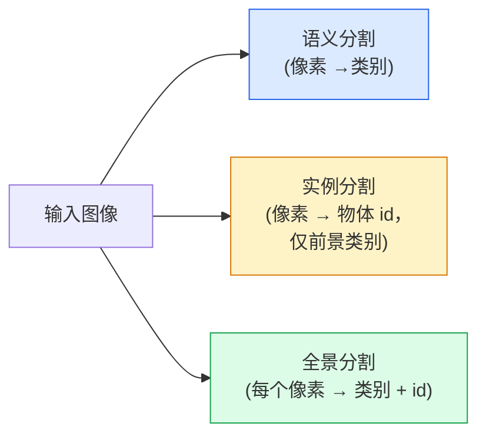
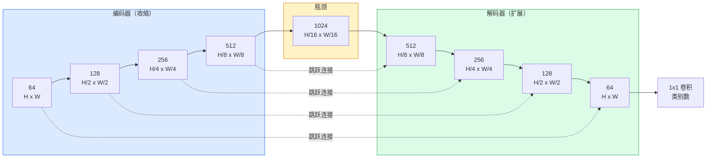

# 语义分割 — U-Net

> 分割就是在每个像素上做分类。U-Net 通过将一个下采样编码器与一个上采样解码器配对，并在它们之间连接跳跃连接来实现这一点。

**类型：** 构建型
**语言：** Python
**前置条件：** 阶段 4 第 03 课（CNN）、阶段 4 第 04 课（图像分类）
**时间：** 约 75 分钟

## 学习目标

- 区分语义分割、实例分割和全景分割，并为给定问题选择合适的任务
- 在 PyTorch 中从零构建 U-Net，包含编码器块、瓶颈、解码器（带转置卷积）和跳跃连接
- 实现像素级交叉熵、Dice 损失和组合损失——这是当前医学和工业分割的默认选择
- 读取每个类别的 IoU 和 Dice 指标，并诊断糟糕的分数是来自小目标召回率、边界精度还是类别不平衡

## 问题

分类每张图像输出一个标签。检测每张图像输出几个框。分割每个像素输出一个标签。对于 `H x W` 大小的输入，输出是形状为 `H x W`（语义分割）或 `H x W x N_instances`（实例分割）的张量。这相当于每张图像数百万个预测，而不是一个。

分割的结构使其成为几乎所有密集预测视觉产品的基础：医学成像（肿瘤 mask）、自动驾驶（道路、车道、障碍物）、卫星（建筑轮廓、农作物边界）、文档解析（布局区域）、机器人（可抓取区域）。这些任务中的任何一个都无法通过在物体周围放置一个框来解决；它们需要精确的轮廓。

这个架构问题描述起来很简单，但解决起来却不简单：你需要网络同时看到图像的全局上下文（这是什么场景）和局部像素细节（到底是哪个像素是道路 vs 人行道）。标准 CNN 通过空间压缩来获取上下文，但这会丢失细节。U-Net 是第一个同时获得两者的设计。

## 概念

### 语义分割 vs 实例分割 vs 全景分割



- **语义分割** 表示"这个像素是道路，那个像素是汽车。"两个相邻的汽车会融合成一个整体。
- **实例分割** 表示"这个像素是汽车 #3，那个像素是汽车 #5。"忽略背景事物（"事物"= 天空、道路、草地）。
- **全景分割** 统一了两者：每个像素获得一个类别标签，每个实例获得一个唯一 id，事物和物体都被分割。

本课涵盖语义分割。下一课（Mask R-CNN）涵盖实例分割。

### U-Net 的形状



编码器将空间分辨率减半四次，并将通道数翻倍。解码器则反向操作：将空间分辨率翻倍四次，并将通道数减半。跳跃连接在每个分辨率下将匹配的编码器特征与解码器特征拼接。最后的 1x1 卷积在完整分辨率下将 `64 -> num_classes` 映射。

为什么跳跃连接是必要的：解码器在尝试输出像素级预测时只见过小的特征图。没有跳跃连接，它无法准确定位边缘，因为这些信息在编码器中已被压缩。跳跃连接为它提供了编码器在下行过程中计算的高分辨率特征图。

### 转置卷积 vs 双线性上采样

解码器必须扩展空间维度。有两个选择：

- **转置卷积**（`nn.ConvTranspose2d`）—— 可学习的上采样。历史上 U-Net 的默认选择。如果步长和核大小不能整除，可能会产生棋盘格伪影。
- **双线性上采样 + 3x3 卷积** —— 平滑上采样后接卷积。更少伪影，更少参数，现在是现代默认选择。

两者都有使用。对于第一个 U-Net，双线性更安全。

### 像素网格上的交叉熵

对于 C 类别的语义分割，模型输出是 `(N, C, H, W)`。目标是 `(N, H, W)`，其中包含整数类别 ID。交叉熵与分类情况相同，只是应用在每个空间位置：

```
Loss = 在 (n, h, w) 上求均值 -log( softmax(logits[n, :, h, w])[target[n, h, w]] )
```

PyTorch 中的 `F.cross_entropy` 原生支持这种形状。不需要 reshape。

### Dice 损失及为什么需要它

交叉熵对每个像素一视同仁。当一个类别主导整个画面时，这是错误的（医学成像：99% 背景，1% 肿瘤）。网络可以通过始终预测背景来获得 99% 的准确率，但实际上毫无用处。

Dice 损失通过直接优化预测 mask 和真实 mask 之间的重叠来解决这个问题：

```
Dice(p, y) = 2 * sum(p * y) / (sum(p) + sum(y) + epsilon)
Dice_loss = 1 - Dice
```

其中 `p` 是一个类别的 sigmoid/softmax 概率图，`y` 是二值真实 mask。只有当重叠完美时损失才为零。因为它是有比率的，类别不平衡无关紧要。

实际上，使用**组合损失**：

```
L = L_cross_entropy + lambda * L_dice       (lambda ~ 1)
```

交叉熵在训练早期提供稳定梯度；Dice 在训练后期专注于实际匹配 mask 的形状。这种组合是医学成像的默认选择，在任何类别不平衡的数据集上都难以击败。

### 评估指标

- **像素准确率** —— 正确预测的像素百分比。廉价。但在不平衡数据上因与分类中准确率相同的原因而失效。
- **每个类别的 IoU** —— 每个类别 mask 的交集 over 并集；跨类别平均 = mIoU。
- **Dice（F1 on 像素）** —— 与 IoU 类似；`Dice = 2 * IoU / (1 + IoU)`。医学成像偏好 Dice，驾驶社区偏好 IoU；它们是单调相关的。
- **边界 F1** —— 衡量预测边界与真实边界的接近程度，即使很小的偏移也会受到惩罚。对于半导体检测等高精度任务很重要。

报告每个类别的 IoU，而不仅仅是 mIoU。当其他九个类别在 85% 时，平均 IoU 会掩盖一个 15% 的类别。

### 输入分辨率的权衡

U-Net 的编码器将分辨率减半四次，因此输入必须能被 16 整除。医学图像通常是 512x512 或 1024x1024。自动驾驶裁剪是 2048x1024。U-Net 的内存消耗与 `H * W * C_max` 成比例，在 1024x1024 且 1024 通道瓶颈的情况下，前向传播已经使用了数 GB 的 VRAM。

两个标准的变通方案：
1. 对输入进行分块 —— 用重叠处理256x256 的块并拼接。
2. 用膨胀卷积替换瓶颈，保持更高的空间分辨率但扩大感受野（DeepLab 系列）。

对于第一个模型，256x256 输入配合 64 通道基础 U-Net 可以在 8 GB VRAM 上舒适训练。

## 构建它

### 步骤 1：编码器块

两个 3x3 卷积，带批量归一化和 ReLU。第一个卷积改变通道数；第二个保持不变。

```python
import torch
import torch.nn as nn
import torch.nn.functional as F

class DoubleConv(nn.Module):
    def __init__(self, in_c, out_c):
        super().__init__()
        self.net = nn.Sequential(
            nn.Conv2d(in_c, out_c, kernel_size=3, padding=1, bias=False),
            nn.BatchNorm2d(out_c),
            nn.ReLU(inplace=True),
            nn.Conv2d(out_c, out_c, kernel_size=3, padding=1, bias=False),
            nn.BatchNorm2d(out_c),
            nn.ReLU(inplace=True),
        )

    def forward(self, x):
        return self.net(x)
```

这个块被重复使用。`bias=False` 因为 BN 的 beta 处理偏置。

### 步骤 2：下采样和上采样块

```python
class Down(nn.Module):
    def __init__(self, in_c, out_c):
        super().__init__()
        self.net = nn.Sequential(
            nn.MaxPool2d(2),
            DoubleConv(in_c, out_c),
        )

    def forward(self, x):
        return self.net(x)


class Up(nn.Module):
    def __init__(self, in_c, out_c):
        super().__init__()
        self.up = nn.Upsample(scale_factor=2, mode="bilinear", align_corners=False)
        self.conv = DoubleConv(in_c, out_c)

    def forward(self, x, skip):
        x = self.up(x)
        if x.shape[-2:] != skip.shape[-2:]:
            x = F.interpolate(x, size=skip.shape[-2:], mode="bilinear", align_corners=False)
        x = torch.cat([skip, x], dim=1)
        return self.conv(x)
```

仅空间维度的形状检查（`shape[-2:]`）处理不能被 16 整除的输入；安全的 `F.interpolate` 在 concat 前对齐张量。比较完整形状也会触发通道数差异，这不是静默的 interpolate，而应该是一个响亮的错误。

### 步骤 3：U-Net

```python
class UNet(nn.Module):
    def __init__(self, in_channels=3, num_classes=2, base=64):
        super().__init__()
        self.inc = DoubleConv(in_channels, base)
        self.d1 = Down(base, base * 2)
        self.d2 = Down(base * 2, base * 4)
        self.d3 = Down(base * 4, base * 8)
        self.d4 = Down(base * 8, base * 16)
        self.u1 = Up(base * 16 + base * 8, base * 8)
        self.u2 = Up(base * 8 + base * 4, base * 4)
        self.u3 = Up(base * 4 + base * 2, base * 2)
        self.u4 = Up(base * 2 + base, base)
        self.outc = nn.Conv2d(base, num_classes, kernel_size=1)

    def forward(self, x):
        x1 = self.inc(x)
        x2 = self.d1(x1)
        x3 = self.d2(x2)
        x4 = self.d3(x3)
        x5 = self.d4(x4)
        x = self.u1(x5, x4)
        x = self.u2(x, x3)
        x = self.u3(x, x2)
        x = self.u4(x, x1)
        return self.outc(x)

net = UNet(in_channels=3, num_classes=2, base=32)
x = torch.randn(1, 3, 256, 256)
print(f"output: {net(x).shape}")
print(f"params: {sum(p.numel() for p in net.parameters()):,}")
```

输出形状 `(1, 2, 256, 256)` —— 与输入空间大小相同，`num_classes` 通道。在 `base=32` 时约 7.7M 参数。

### 步骤 4：损失函数

```python
def dice_loss(logits, targets, num_classes, eps=1e-6):
    probs = F.softmax(logits, dim=1)
    targets_one_hot = F.one_hot(targets, num_classes).permute(0, 3, 1, 2).float()
    dims = (0, 2, 3)
    intersection = (probs * targets_one_hot).sum(dim=dims)
    denom = probs.sum(dim=dims) + targets_one_hot.sum(dim=dims)
    dice = (2 * intersection + eps) / (denom + eps)
    return 1 - dice.mean()


def combined_loss(logits, targets, num_classes, lam=1.0):
    ce = F.cross_entropy(logits, targets)
    dc = dice_loss(logits, targets, num_classes)
    return ce + lam * dc, {"ce": ce.item(), "dice": dc.item()}
```

Dice 按类别计算然后平均（宏 Dice）。`eps` 防止批量中不存在的类别出现除零。

### 步骤 5：IoU 指标

```python
@torch.no_grad()
def iou_per_class(logits, targets, num_classes):
    preds = logits.argmax(dim=1)
    ious = torch.zeros(num_classes)
    for c in range(num_classes):
        pred_c = (preds == c)
        true_c = (targets == c)
        inter = (pred_c & true_c).sum().float()
        union = (pred_c | true_c).sum().float()
        ious[c] = (inter / union) if union > 0 else torch.tensor(float("nan"))
    return ious
```

返回长度为 C 的向量。`nan` 标记批量中不存在的类别 —— 计算 mIoU 时不要对这些求平均。

### 步骤 6：用于端到端验证的合成数据集

在彩色背景上生成形状，这样网络需要学习形状，而不是像素颜色。

```python
import numpy as np
from torch.utils.data import Dataset, DataLoader

def synthetic_segmentation(num_samples=200, size=64, seed=0):
    rng = np.random.default_rng(seed)
    images = np.zeros((num_samples, size, size, 3), dtype=np.float32)
    masks = np.zeros((num_samples, size, size), dtype=np.int64)
    for i in range(num_samples):
        bg = rng.uniform(0, 1, (3,))
        images[i] = bg
        masks[i] = 0
        num_shapes = rng.integers(1, 4)
        for _ in range(num_shapes):
            cls = int(rng.integers(1, 3))
            color = rng.uniform(0, 1, (3,))
            cx, cy = rng.integers(10, size - 10, size=2)
            r = int(rng.integers(4, 12))
            yy, xx = np.meshgrid(np.arange(size), np.arange(size), indexing="ij")
            if cls == 1:
                mask = (xx - cx) ** 2 + (yy - cy) ** 2 < r ** 2
            else:
                mask = (np.abs(xx - cx) < r) & (np.abs(yy - cy) < r)
            images[i][mask] = color
            masks[i][mask] = cls
        images[i] += rng.normal(0, 0.02, images[i].shape)
        images[i] = np.clip(images[i], 0, 1)
    return images, masks


class SegDataset(Dataset):
    def __init__(self, images, masks):
        self.images = images
        self.masks = masks

    def __len__(self):
        return len(self.images)

    def __getitem__(self, i):
        img = torch.from_numpy(self.images[i]).permute(2, 0, 1).float()
        mask = torch.from_numpy(self.masks[i]).long()
        return img, mask
```

三个类别：背景 (0)、圆形 (1)、方形 (2)。网络必须学会区分形状。

### 步骤 7：训练循环

```python
def train_one_epoch(model, loader, optimizer, device, num_classes):
    model.train()
    loss_sum, total = 0.0, 0
    iou_sum = torch.zeros(num_classes)
    for x, y in loader:
        x, y = x.to(device), y.to(device)
        logits = model(x)
        loss, _ = combined_loss(logits, y, num_classes)
        optimizer.zero_grad()
        loss.backward()
        optimizer.step()
        loss_sum += loss.item() * x.size(0)
        total += x.size(0)
        iou_sum += iou_per_class(logits, y, num_classes).nan_to_num(0)
    return loss_sum / total, iou_sum / len(loader)
```

在合成数据集上运行 10-30 个 epoch，观察 shape 类别的 mIoU 攀升至 0.9 以上。注意 `nan_to_num(0)` 将批量中不存在的类别视为零；对于准确的每类别 IoU，按存在与否进行 mask，并在评估时使用 `torch.nanmean` 跨批量平均，而不是在这里求平均。

## 使用它

对于生产环境，`segmentation_models_pytorch`（"smp"）用任何 torchvision 或 timm 主干网络包装每个标准分割架构。三行代码：

```python
import segmentation_models_pytorch as smp

model = smp.Unet(
    encoder_name="resnet34",
    encoder_weights="imagenet",
    in_channels=3,
    classes=3,
)
```

对于实际工作还值得了解：
- **DeepLabV3+** 用膨胀卷积替换基于最大池化的下采样，使瓶颈保持分辨率；在卫星和驾驶数据上边界更快。
- **SegFormer** 用分层 transformer 替换卷积编码器；在许多基准测试上是当前 SOTA。
- **Mask2Former** / **OneFormer** 在单一架构中统一语义分割、实例分割和全景分割。

这三个都可以在 `smp` 或 `transformers` 中作为直接替代品，使用相同的数据加载器。

## 交付它

本课产出：

- `outputs/prompt-segmentation-task-picker.md` —— 一个提示，选择语义分割、实例分割和全景分割之间的任务，并为给定任务指定架构。
- `outputs/skill-segmentation-mask-inspector.md` —— 一个技能，报告类别分布、预测 mask 统计信息以及预测不足或边界模糊的类别。

## 练习

1. **(简单)** 为二值分割任务（前景 vs 背景）实现 `bce_dice_loss`。在合成二类数据集上验证，当前景占像素的 5% 时，组合损失比单独 BCE 收敛更快。
2. **(中等)** 将 `nn.Upsample + conv` 上采样块替换为 `nn.ConvTranspose2d` 上采样块。在合成数据集上训练两者并比较 mIoU。观察转置卷积版本中哪里出现棋盘格伪影。
3. **(困难)** 使用真实分割数据集（Oxford-IIIT Pets、Cityscapes mini split 或医学子集）训练 U-Net，使其 IoU 在 `smp.Unet` 参考值的 2 IoU 点以内。报告每个类别的 IoU 并确定哪些类别从向损失添加 Dice 中获益最多。

## 关键术语

| 术语 | 人们通常的说法 | 实际含义 |
|------|----------------|----------------------|
| 语义分割 | "标注每个像素" | 按 C 个类别进行逐像素分类；同类别的实例合并 |
| 实例分割 | "标注每个物体" | 分离同类别的不同实例；仅限前景 |
| 全景分割 | "语义 + 实例" | 每个像素获得一个类别；每个物体实例也获得一个唯一 id |
| 跳跃连接 | "U-Net 桥接" | 将编码器特征拼接到匹配分辨率的解码器特征；保留高频细节 |
| 转置卷积 | "反卷积" | 可学习的上采样；可能产生棋盘格伪影 |
| Dice 损失 | "重叠损失" | 1 - 2|A ∩ B| / (|A| + |B|)；直接优化 mask 重叠，对类别不平衡具有鲁棒性 |
| mIoU | "平均交集 over 并集" | 跨类别平均 IoU；分割的社区标准指标 |
| 边界 F1 | "边界精度" | 仅在边界像素上计算的 F1 分数；对于精度关键任务很重要 |

## 延伸阅读

- [U-Net: Convolutional Networks for Biomedical Image Segmentation (Ronneberger et al., 2015)](https://arxiv.org/abs/1505.04597) —— 原始论文；每个人都在复制其第 2 页的图
- [Fully Convolutional Networks (Long et al., 2015)](https://arxiv.org/abs/1411.4038) —— 首次将分割变成端到端卷积问题的论文
- [segmentation_models_pytorch](https://github.com/qubvel/segmentation_models.pytorch) —— 生产分割的参考；每个标准架构加上每个标准损失
- [Lessons learned from training SOTA segmentation (kaggle.com competitions)](https://www.kaggle.com/code/iafoss/carvana-unet-pytorch) —— 关于为什么 TTA、伪标签和类别权重在真实数据上很重要的详细讲解