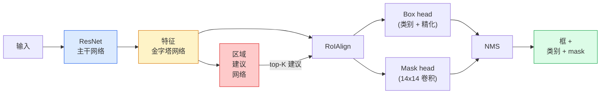

# 实例分割 — Mask R-CNN

> 在 Faster R-CNN 检测器上添加一个微小的 mask 分支，你就得到了实例分割。难点在于 RoIAlign，而且它比看起来更难。

**类型：** 构建 + 学习
**语言：** Python
**前置条件：** 阶段 4 第 06 课（YOLO）、阶段 4 第 07 课（U-Net）
**时间：** 约 75 分钟

## 学习目标

- 端到端追踪 Mask R-CNN 架构：主干网络、FPN、RPN、RoIAlign、box head、mask head
- 从零实现 RoIAlign 并解释为什么 RoIPool 不再被使用
- 使用 torchvision 预训练的 `maskrcnn_resnet50_fpn_v2` 模型进行生产级实例 mask，并正确读取其输出格式
- 通过替换 box 和 mask head 并保持主干网络冻结，在小型自定义数据集上微调 Mask R-CNN

## 问题

语义分割给你每个类别一个 mask。实例分割给你每个物体一个 mask，即使两个物体属于同一类别。计数个体、跨帧跟踪和测量物体（墙上每块砖、显微镜图像中每个细胞的外接框）都需要实例分割。

Mask R-CNN（He et al., 2017）通过将实例分割重新定义为检测 + mask 来解决这个问题。设计如此优雅，以至于在接下来的五年里，几乎每一篇实例分割论文都是 Mask R-CNN 的变体，而 torchvision 的实现仍然是中小型数据集的生产默认选择。

困难的工程问题是采样：如何从一个角落不与像素边界对齐的建议框中裁剪出固定大小的特征区域？做错了会在每个地方损失零点几个 mAP。RoIAlign 就是答案。

## 概念

### 架构



需要理解五个部分：

1. **主干网络** —— 在 ImageNet 上训练的 ResNet-50 或 ResNet-101。在步长 4、8、16、32 处产生特征图层次结构。
2. **FPN（特征金字塔网络）** —— 自上而下 + 横向连接，为每个级别提供 C 个通道的语义丰富特征。检测查询与物体大小匹配的 FPN 级别。
3. **RPN（区域建议网络）** —— 一个小的卷积 head，在每个锚点位置预测"这里有物体吗？"和"如何精化这个框？"产生每张图像约 1000 个建议。
4. **RoIAlign** —— 从任何 FPN 级别上的任何框中采样固定大小（例如 7x7）的特征块。双线性采样，无量化。
5. **Head** —— 两层 box head 精化框并选择类别，外加一个小的卷积 head 为每个建议输出 `28x28` 的二值 mask，`num_classes` 个输出通道。只保留与预测类别对应的通道；其他被忽略。

### 为什么是 RoIAlign 而不是 RoIPool

原始的 Fast R-CNN 使用 RoIPool，它将建议框分割成网格，取每个单元格中的最大特征，并将所有坐标四舍五入到整数。这种四舍五入使特征图与输入像素坐标对齐偏差达整整一个特征图像素 —— 在 224x224 图像上很小，但在步长 32 的特征图上是灾难性的。

```
RoIPool：
  框 (34.7, 51.3, 98.2, 142.9)
  四舍五入 -> (34, 51, 98, 142)
  分割网格 -> 四舍五入每个单元格边界
  错位在每一步累积

RoIAlign：
  框 (34.7, 51.3, 98.2, 142.9)
  使用双线性插值在精确的浮点坐标处采样
  到处都是四舍五入
```

RoIAlign 在 COCO 上免费将 mask AP 提高 3-4 个点。每个在乎定位的检测器现在都使用它 —— YOLOv7 seg、RT-DETR、Mask2Former 都一样。

### RPN 一段话总结

在特征图的每个位置，放置 K 个不同大小和形状的锚框。预测每个锚框的目标性分数，以及将锚框变成更贴合的框的回归偏移。按分数保留前约 1000 个框，在 IoU 0.7 处应用 NMS，然后将幸存者交给 head。RPN 用自己的迷你损失训练 —— 与第 6 课中的 YOLO 损失结构相同，只是两个类别（物体 / 无物体）。

### Mask head

对于每个建议（RoIAlign 之后），mask head 是一个微小的 FCN：四个 3x3 卷积，一个 2x 反卷积，一个最终的 1x1 卷积，在 `28x28` 分辨率下产生 `num_classes` 个输出通道。只保留与预测类别对应的通道；其他被忽略。这将 mask 预测与分类解耦。

将 28x28 mask 上采样到建议的原始像素大小以产生最终的二值 mask。

### 损失函数

Mask R-CNN 有四个损失相加：

```
L = L_rpn_cls + L_rpn_box + L_box_cls + L_box_reg + L_mask
```

- `L_rpn_cls`、`L_rpn_box` —— RPN 建议的目标性 +框回归。
- `L_box_cls` —— head 分类器上 (C+1) 个类别（包括背景）的交叉熵。
- `L_box_reg` —— head 框精化的 smooth L1。
- `L_mask` —— 28x28 mask 输出上逐像素的二值交叉熵。

每个损失都有自己的默认权重；torchvision 的实现将它们作为构造函数参数暴露。

### 输出格式

`torchvision.models.detection.maskrcnn_resnet50_fpn_v2` 返回一个字典列表，每张图像一个：

```
{
    "boxes":  (N, 4) 格式为 (x1, y1, x2, y2) 像素坐标,
    "labels": (N,) 类别 ID，0 = 背景，所以索引从 1 开始,
    "scores": (N,) 置信度分数,
    "masks":  (N, 1, H, W) [0, 1] 中的浮点 mask —— 阈值 0.5 得到二值,
}
```

mask已经是完整图像分辨率。28x28 head 输出已在内部上采样。

## 构建它

### 步骤 1：从零实现 RoIAlign

这是 Mask R-CNN 中唯一一个用代码比用文字更容易理解的组件。

```python
import torch
import torch.nn.functional as F

def roi_align_single(feature, box, output_size=7, spatial_scale=1 / 16.0):
    """
    feature: (C, H, W) 单张图像的特征图
    box: (x1, y1, x2, y2) 原始图像像素坐标
    output_size: 输出网格的边长（box head 为 7，mask head 为 14）
    spatial_scale: 特征图步长的倒数
    """
    C, H, W = feature.shape
    x1, y1, x2, y2 = [c * spatial_scale - 0.5 for c in box]
    bin_w = (x2 - x1) / output_size
    bin_h = (y2 - y1) / output_size

    grid_y = torch.linspace(y1 + bin_h / 2, y2 - bin_h / 2, output_size)
    grid_x = torch.linspace(x1 + bin_w / 2, x2 - bin_w / 2, output_size)
    yy, xx = torch.meshgrid(grid_y, grid_x, indexing="ij")

    gx = 2 * (xx + 0.5) / W - 1
    gy = 2 * (yy + 0.5) / H - 1
    grid = torch.stack([gx, gy], dim=-1).unsqueeze(0)
    sampled = F.grid_sample(feature.unsqueeze(0), grid, mode="bilinear",
                            align_corners=False)
    return sampled.squeeze(0)
```

每个数字都在双线性采样的位置。没有四舍五入，没有量化，没有梯度丢失。

### 步骤 2：与 torchvision 的 RoIAlign 比较

```python
from torchvision.ops import roi_align

feature = torch.randn(1, 16, 50, 50)
boxes = torch.tensor([[0, 10, 20, 100, 90]], dtype=torch.float32)  # (batch_idx, x1, y1, x2, y2)

ours = roi_align_single(feature[0], boxes[0, 1:].tolist(), output_size=7, spatial_scale=1/4)
theirs = roi_align(feature, boxes, output_size=(7, 7), spatial_scale=1/4, sampling_ratio=1, aligned=True)[0]

print(f"shape ours:   {tuple(ours.shape)}")
print(f"shape theirs: {tuple(theirs.shape)}")
print(f"max|diff|:    {(ours - theirs).abs().max().item():.3e}")
```

使用 `sampling_ratio=1` 和 `aligned=True`，两者在 `1e-5` 以内匹配。

### 步骤 3：加载预训练 Mask R-CNN

```python
import torch
from torchvision.models.detection import maskrcnn_resnet50_fpn_v2, MaskRCNN_ResNet50_FPN_V2_Weights

model = maskrcnn_resnet50_fpn_v2(weights=MaskRCNN_ResNet50_FPN_V2_Weights.DEFAULT)
model.eval()
print(f"params: {sum(p.numel() for p in model.parameters()):,}")
print(f"classes (including background): {len(model.roi_heads.box_predictor.cls_score.out_features * [0])}")
```

46M 参数，91 个类别（COCO）。第一个类别（id 0）是背景；模型实际检测的所有内容从 id 1 开始。

### 步骤 4：运行推理

```python
with torch.no_grad():
    x = torch.randn(3, 400, 600)
    predictions = model([x])
p = predictions[0]
print(f"boxes:  {tuple(p['boxes'].shape)}")
print(f"labels: {tuple(p['labels'].shape)}")
print(f"scores: {tuple(p['scores'].shape)}")
print(f"masks:  {tuple(p['masks'].shape)}")
```

mask 张量形状为 `(N, 1, H, W)`。阈值 0.5 得到每个物体的二值 mask：

```python
binary_masks = (p['masks'] > 0.5).squeeze(1)  # (N, H, W) 布尔值
```

### 步骤 5：为自定义类别数替换 head

常见的微调方案：重用主干网络、FPN 和 RPN；替换两个分类 head。

```python
from torchvision.models.detection.faster_rcnn import FastRCNNPredictor
from torchvision.models.detection.mask_rcnn import MaskRCNNPredictor

def build_custom_maskrcnn(num_classes):
    model = maskrcnn_resnet50_fpn_v2(weights=MaskRCNN_ResNet50_FPN_V2_Weights.DEFAULT)
    in_features = model.roi_heads.box_predictor.cls_score.in_features
    model.roi_heads.box_predictor = FastRCNNPredictor(in_features, num_classes)
    in_features_mask = model.roi_heads.mask_predictor.conv5_mask.in_channels
    hidden_layer = 256
    model.roi_heads.mask_predictor = MaskRCNNPredictor(in_features_mask, hidden_layer, num_classes)
    return model

custom = build_custom_maskrcnn(num_classes=5)
print(f"custom cls_score.out_features: {custom.roi_heads.box_predictor.cls_score.out_features}")
```

`num_classes` 必须包括背景类别，所以有 4 个物体类别的数据集使用 `num_classes=5`。

### 步骤 6：冻结不需要训练的部分

在小型数据集上，冻结主干网络和 FPN。只有 RPN 目标性 + 回归和两个 head 学习。

```python
def freeze_backbone_and_fpn(model):
    # torchvision Mask R-CNN 将 FPN 打包在 `model.backbone` 中（作为
    # `model.backbone.fpn`），所以迭代 `model.backbone.parameters()` 覆盖
    # ResNet 特征层和 FPN 横向/输出卷积。
    for p in model.backbone.parameters():
        p.requires_grad = False
    return model

custom = freeze_backbone_and_fpn(custom)
trainable = sum(p.numel() for p in custom.parameters() if p.requires_grad)
print(f"trainable after freeze: {trainable:,}")
```

在 500 张图像的数据集上，这是收敛与过拟合之间的差别。

## 使用它

torchvision 中 Mask R-CNN 的完整训练循环是 40 行，并且在任务之间没有实质性变化 —— 交换数据集然后开始。

```python
def train_step(model, images, targets, optimizer):
    model.train()
    loss_dict = model(images, targets)
    losses = sum(loss for loss in loss_dict.values())
    optimizer.zero_grad()
    losses.backward()
    optimizer.step()
    return {k: v.item() for k, v in loss_dict.items()}
```

`targets` 列表必须有每张图像的字典，包含 `boxes`、`labels` 和 `masks`（作为 `(num_instances, H, W)` 二值张量）。模型在训练时返回四个损失的字典，在评估时返回预测列表，按 `model.training` 键控。

`pycocotools` 评估器产生 box 和 mask 的 mAP@IoU=0.5:0.95；你需要两个数字来知道 box head 还是 mask head 是瓶颈。

## 交付它

本课产出：

- `outputs/prompt-instance-vs-semantic-router.md` —— 一个提示，提出三个问题并选择实例分割 vs 语义分割 vs 全景分割，以及开始的确切模型。
- `outputs/skill-mask-rcnn-head-swapper.md` —— 一个技能，给定新的 `num_classes`，生成交换任何 torchvision 检测模型 head 的 10 行代码。

## 练习

1. **(简单)** 在 100 个随机框上验证你的 RoIAlign 对阵 `torchvision.ops.roi_align`。报告最大绝对差异。同时运行 RoIPool（2017 年前的行为）并显示它在靠近边框的框上偏差约 1-2 个特征图像素。
2. **(中等)** 在 50 张图像的自定义数据集（任何两个类别：气球、鱼、坑洞、标志）上微调 `maskrcnn_resnet50_fpn_v2`。冻结主干网络，训练 20 个 epoch，报告 mask AP@0.5。
3. **(困难)** 将 Mask R-CNN 的 mask head 替换为预测 56x56 而不是 28x28 的 head。测量前后的 mAP@IoU=0.75。解释增益（或缺乏增益）如何符合预期的边界精度 / 内存权衡。

## 关键术语

| 术语 | 人们通常的说法 | 实际含义 |
|------|----------------|----------------------|
| Mask R-CNN | "检测 + mask" | Faster R-CNN + 一个小的 FCN head，为每个建议的每个类别预测 28x28 mask |
| FPN | "特征金字塔" | 自上而下 + 横向连接，为每个步长级别提供 C 个通道的语义丰富特征 |
| RPN | "区域建议器" | 一个小的卷积 head，每张图像产生约 1000 个物体/无物体建议 |
| RoIAlign | "无舍入裁剪" | 从任何浮点坐标框中双线性采样固定大小的特征网格 |
| RoIPool | "2017 年前的裁剪" | 与 RoIAlign 目的相同但四舍五入框坐标；已过时 |
| Mask AP | "实例 mAP" | 使用 mask IoU 而不是 box IoU 计算的平均精度；COCO 实例分割指标 |
| 二值 mask head | "每类别 mask" | 为每个建议预测每个类别的一个二值 mask；只保留预测类别的通道 |
| 背景类别 | "类别 0" | "无物体"的总类别；真实类别的索引从 1 开始 |

## 延伸阅读

- [Mask R-CNN (He et al., 2017)](https://arxiv.org/abs/1703.06870) —— 论文；第 3 节关于 RoIAlign 是关键阅读
- [FPN: Feature Pyramid Networks (Lin et al., 2017)](https://arxiv.org/abs/1612.03144) —— FPN 论文；每个现代检测器都使用它
- [torchvision Mask R-CNN 教程](https://pytorch.org/tutorials/intermediate/torchvision_tutorial.html) —— 微调循环的参考
- [Detectron2 模型库](https://github.com/facebookresearch/detectron2/blob/main/MODEL_ZOO.md) —— 几乎所有检测和分割变体的生产实现及训练权重