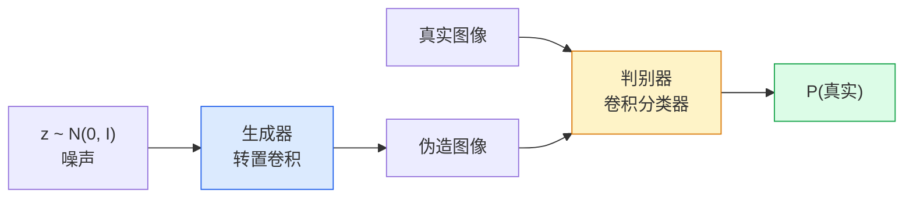
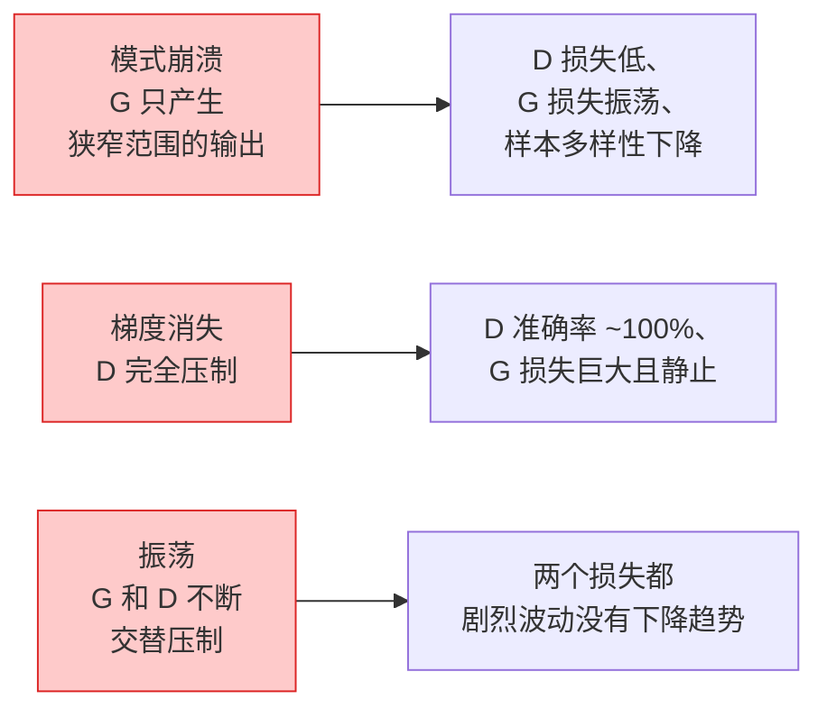

# 图像生成 —— GAN

> GAN 是两个神经网络之间的一场固定博弈。一个负责画，一个负责批。两者共同进步，直到画出来的东西能骗过评审。

**类型：** 学习型
**语言：** Python
**前置条件：** 阶段 4 第 03 课（CNN）、阶段 3 第 06 课（优化器）、阶段 3 第 07 课（正则化）
**时间：** 约 75 分钟

## 学习目标

- 解释生成器和判别器之间的最小最大博弈，以及为何均衡对应 p_model = p_data
- 在 PyTorch 中从零实现 DCGAN，用不到 60 行代码让它生成连贯的 32x32 合成图像
- 用三个标准技巧稳定 GAN 训练：非饱和损失、谱归一化、TTUR（双时间尺度更新规则）
- 读懂训练曲线，区分健康收敛与模式崩溃、振荡、判别器完全压制

## 问题

分类任务教网络把图像映射到标签。生成则把这个过程反过来：从相同分布中采样新的图像。没有"正确"输出可以 diff；只有一个你想模仿的分布。

标准损失函数（MSE、交叉熵）无法衡量"这个样本是否来自真实分布"。最小化逐像素误差会产生模糊的平均值，而不是逼真的样本。突破在于让损失可学习：训练第二个网络，它的工作是区分真实与伪造，并用它的判断来推动生成器。

GAN（Goodfellow 等，2014）定义了这个框架。到 2018 年，StyleGAN 已经能生成 1024x1024 的人脸，与照片无法区分。此后扩散模型在质量和可控性上夺得了王座，但让扩散变得实用的每一个技巧 —— 归一化选择、潜空间、特征损失 ——都是在 GAN 上首先被理解的。

## 概念

### 两个网络



**生成器** G 接收一个噪声向量 `z` 并输出一张图像。**判别器** D 接收一张图像并输出一个标量：该图像是真实图像的概率。

### 这场博弈

G 希望 D 犯错。D 希望自己正确。形式化地：

```
min_G max_D  E_x[log D(x)] + E_z[log(1 - D(G(z)))]
```

从右往左读：D 在最大化对真实图像（`log D(real)`）和伪造图像（`log (1 - D(fake))`）的准确率。G 在最小化 D 对伪造的准确率 —— 它希望 `D(G(z))` 很高。

Goodfellow 证明了，这个最小最大博弈有一个全局均衡：此时 `p_G = p_data`，D 在各处输出 0.5，生成分布与真实分布之间的 Jensen-Shannon 散度为零。难点在于如何达到这个均衡。

### 非饱和损失

上述形式在数值上不稳定。训练早期，`D(G(z))` 对每个伪造样本都接近零，所以 `log(1 - D(G(z)))` 对 G 的梯度趋于消失。修复方法：翻转 G 的损失。

```
L_D = -E_x[log D(x)] - E_z[log(1 - D(G(z)))]
L_G = -E_z[log D(G(z))]                          # 非饱和
```

现在当 `D(G(z))` 接近零时，G 的损失很大，它的梯度信息丰富。每个现代 GAN 都使用这个变体进行训练。

### DCGAN 架构规则

Radford、Metz、Chintala（2015）将多年失败实验的教训浓缩为五条规则，使 GAN 训练变得稳定：

1. 用步幅卷积替代池化（两个网络都用）。
2. 在生成器和判别器中都使用批归一化，但 G 的输出层和 D 的输入层除外。
3. 在更深的架构中移除全连接层。
4. G 在所有层使用 ReLU，输出层使用 tanh（输出范围 [-1, 1]）。
5. D 在所有层使用 LeakyReLU（negative_slope=0.2）。

每个现代基于卷积的 GAN（StyleGAN、BigGAN、GigaGAN）仍然从这些规则出发，逐步替换其中的组件。

### 失败模式及其特征



- **模式崩溃**：G 找到一张能骗过 D 的图像，然后就只生产这个。修复方法：添加小批量判别、谱归一化或标签条件化。
- **判别器压制**：D 变得太强太快，G 的梯度消失。修复方法：缩小 D、降低 D 的学习率，或对真实标签应用标签平滑。
- **振荡**：两个网络不断交替压制对方，从不接近均衡。修复方法：TTUR（D 比 G 学得快 2-4 倍），或切换到 Wasserstein 损失。

### 评估

GAN 没有 ground truth，怎么知道它是否在工作？

- **样本检查** ——简单地在每个 epoch 结束时查看 64 个样本。必不可少。
- **FID（Fréchet Inception Distance）** —— 真实集和生成集的 Inception-v3 特征分布之间的间距。越低越好。社区标准。
- **Inception Score** —— 更老练、更脆弱；优先用 FID。
- **生成模型的精确率/召回率** —— 分别度量质量（精确率）和覆盖率（召回率）。比单独的 FID 更有信息量。

对于小型合成数据运行，样本检查就足够了。

## 动手实现

### 第 1 步：生成器

一个小型 DCGAN 生成器，接收 64 维噪声并生成 32x32 图像。

```python
import torch
import torch.nn as nn

class Generator(nn.Module):
    def __init__(self, z_dim=64, img_channels=3, feat=64):
        super().__init__()
        self.net = nn.Sequential(
            nn.ConvTranspose2d(z_dim, feat * 4, kernel_size=4, stride=1, padding=0, bias=False),
            nn.BatchNorm2d(feat * 4),
            nn.ReLU(inplace=True),
            nn.ConvTranspose2d(feat * 4, feat * 2, kernel_size=4, stride=2, padding=1, bias=False),
            nn.BatchNorm2d(feat * 2),
            nn.ReLU(inplace=True),
            nn.ConvTranspose2d(feat * 2, feat, kernel_size=4, stride=2, padding=1, bias=False),
            nn.BatchNorm2d(feat),
            nn.ReLU(inplace=True),
            nn.ConvTranspose2d(feat, img_channels, kernel_size=4, stride=2, padding=1, bias=False),
            nn.Tanh(),
        )

    def forward(self, z):
        return self.net(z.view(z.size(0), -1, 1, 1))
```

四个转置卷积，每个都是 `kernel_size=4, stride=2, padding=1`，可以干净地翻倍空间尺寸。通过 tanh 将输出激活值缩放到 [-1, 1]。

### 第 2 步：判别器

生成器的镜像。LeakyReLU、步幅卷积，以标量对数结束。

```python
class Discriminator(nn.Module):
    def __init__(self, img_channels=3, feat=64):
        super().__init__()
        self.net = nn.Sequential(
            nn.Conv2d(img_channels, feat, kernel_size=4, stride=2, padding=1),
            nn.LeakyReLU(0.2, inplace=True),
            nn.Conv2d(feat, feat * 2, kernel_size=4, stride=2, padding=1, bias=False),
            nn.BatchNorm2d(feat * 2),
            nn.LeakyReLU(0.2, inplace=True),
            nn.Conv2d(feat * 2, feat * 4, kernel_size=4, stride=2, padding=1, bias=False),
            nn.BatchNorm2d(feat * 4),
            nn.LeakyReLU(0.2, inplace=True),
            nn.Conv2d(feat * 4, 1, kernel_size=4, stride=1, padding=0),
        )

    def forward(self, x):
        return self.net(x).view(-1)
```

最后一个卷积将 `4x4` 特征图缩减为 `1x1`。每张图像输出一个标量；只在损失计算时应用 sigmoid。

### 第 3 步：训练步

交替更新：每个 batch 先更新一次 D，再更新一次 G。

```python
import torch.nn.functional as F

def train_step(G, D, real, z, opt_g, opt_d, device):
    real = real.to(device)
    bs = real.size(0)

    # D 步
    opt_d.zero_grad()
    d_real = D(real)
    d_fake = D(G(z).detach())
    loss_d = (F.binary_cross_entropy_with_logits(d_real, torch.ones_like(d_real))
              + F.binary_cross_entropy_with_logits(d_fake, torch.zeros_like(d_fake)))
    loss_d.backward()
    opt_d.step()

    # G 步
    opt_g.zero_grad()
    d_fake = D(G(z))
    loss_g = F.binary_cross_entropy_with_logits(d_fake, torch.ones_like(d_fake))
    loss_g.backward()
    opt_g.step()

    return loss_d.item(), loss_g.item()
```

D 步中的 `G(z).detach()` 至关重要：在 D 的更新过程中，我们不希望梯度流向 G。忘记这一点是经典的初学者 bug。

### 第 4 步：在合成形状上的完整训练循环

```python
from torch.utils.data import DataLoader, TensorDataset
import numpy as np

def synthetic_images(num=2000, size=32, seed=0):
    rng = np.random.default_rng(seed)
    imgs = np.zeros((num, 3, size, size), dtype=np.float32) - 1.0
    for i in range(num):
        r = rng.uniform(6, 12)
        cx, cy = rng.uniform(r, size - r, size=2)
        yy, xx = np.meshgrid(np.arange(size), np.arange(size), indexing="ij")
        mask = (xx - cx) ** 2 + (yy - cy) **2 < r ** 2
        color = rng.uniform(-0.5, 1.0, size=3)
        for c in range(3):
            imgs[i, c][mask] = color[c]
    return torch.from_numpy(imgs)

device = "cuda" if torch.cuda.is_available() else "cpu"
data = synthetic_images()
loader = DataLoader(TensorDataset(data), batch_size=64, shuffle=True)

G = Generator(z_dim=64, img_channels=3, feat=32).to(device)
D = Discriminator(img_channels=3, feat=32).to(device)
opt_g = torch.optim.Adam(G.parameters(), lr=2e-4, betas=(0.5, 0.999))
opt_d = torch.optim.Adam(D.parameters(), lr=2e-4, betas=(0.5, 0.999))

for epoch in range(10):
    for (batch,) in loader:
        z = torch.randn(batch.size(0), 64, device=device)
        ld, lg = train_step(G, D, batch, z, opt_g, opt_d, device)
    print(f"epoch {epoch}  D {ld:.3f}  G {lg:.3f}")
```

`Adam(lr=2e-4, betas=(0.5, 0.999))` 是 DCGAN 的默认值 ——较低的 beta1 防止动量项过多地稳定这个对抗博弈。

### 第 5 步：采样

```python
@torch.no_grad()
def sample(G, n=16, z_dim=64, device="cpu"):
    G.eval()
    z = torch.randn(n, z_dim, device=device)
    imgs = G(z)
    imgs = (imgs + 1) / 2
    return imgs.clamp(0, 1)
```

采样前务必切换到评估模式。对 DCGAN 来说这很重要，因为使用的是批归一化的运行统计量而非该 batch 的统计量。

### 第 6 步：谱归一化

替换判别器中 BN 的即插即用方案，保证网络是 1-Lipschitz 的。能修复大多数"D 压制过狠"的失败。

```python
from torch.nn.utils import spectral_norm

def build_sn_discriminator(img_channels=3, feat=64):
    return nn.Sequential(
        spectral_norm(nn.Conv2d(img_channels, feat, 4, 2, 1)),
        nn.LeakyReLU(0.2, inplace=True),
        spectral_norm(nn.Conv2d(feat, feat * 2, 4, 2, 1)),
        nn.LeakyReLU(0.2, inplace=True),
        spectral_norm(nn.Conv2d(feat * 2, feat * 4, 4, 2, 1)),
        nn.LeakyReLU(0.2, inplace=True),
        spectral_norm(nn.Conv2d(feat * 4, 1, 4, 1, 0)),
    )
```

把 `Discriminator` 换成 `build_sn_discriminator()`，通常就不需要 TTUR 技巧了。谱归一化是你能应用的最简单的单一鲁棒性升级。

##实际使用

对于严肃的生成任务，使用预训练权重或切换到扩散模型。两个标准库：

- `torch_fidelity` 计算你的生成器的 FID / IS，无需编写自定义评估代码。
- `pytorch-gan-zoo`（旧版）和 `StudioGAN` 提供了 DCGAN、WGAN-GP、SN-GAN、StyleGAN 和 BigGAN 的经过测试的实现。

在 2026 年，GAN 仍然是以下场景的最佳选择：实时图像生成（延迟 <10 ms）、风格迁移、具有精确控制能力的图像到图像翻译（Pix2Pix、CycleGAN）。扩散模型在逼真感和文本条件化上胜出。

## 交付物

本课产出：

- `outputs/prompt-gan-training-triage.md` —— 一个提示词，读取训练曲线描述后判断失败模式（模式崩溃、D 压制、振荡）并给出单一推荐修复方案。
- `outputs/skill-dcgan-scaffold.md` —— 一个技能，从 `z_dim`、目标 `image_size` 和 `num_channels` 编写 DCGAN 脚手架，包括训练循环和样本保存器。

## 练习

1. **(简单)** 在合成圆数据集上训练上面的 DCGAN，在每个 epoch 结束时保存 16 个样本的网格。到第几个 epoch 时生成的圆明显是圆形的？
2. **(中等)** 将判别器的批归一化替换为谱归一化。并行训练两个版本。哪个收敛更快？哪个在三个随机种子上的方差更低？
3. **(困难)** 实现条件 DCGAN：把类别标签输入 G 和 D（在 G 中将 one-hot 与噪声拼接，在 D 中拼接类别嵌入通道）。在第 7 课的合成"圆 vs 方"数据集上训练，并通过特定标签采样来证明类别条件化有效。

## 关键术语

| 术语 | 大家怎么说的 | 实际含义 |
|------|----------------|----------------------|
| 生成器 (G) | "画东西的网络" | 把噪声映射到图像；训练目标是骗过判别器 |
| 判别器 (D) | "评审" | 二分类器；训练目标是区分真实图像和生成图像 |
| 最小最大 (Minimax) | "这场博弈" | 对抗损失在 G 上取 min、在 D 上取 max；均衡时 p_G = p_data |
| 非饱和损失 | "数值上合理的版本" | G 的损失是 -log(D(G(z))) 而非 log(1 - D(G(z)))，避免训练早期梯度消失 |
| 模式崩溃 | "生成器只出一种东西" | G 只产生数据分布的一个小子集；用 SN、小批量判别或更大 batch 修复 |
| TTUR | "两个学习率" | D 比 G 学得快，通常快 2-4 倍；稳定训练 |
| 谱归一化 | "1-Lipschitz 层" | 限制每层 Lipschitz 常数的权重归一化；阻止 D 变得任意陡峭 |
| FID | "Fréchet Inception Distance" | 真实集和生成集的 Inception-v3 特征分布之间的间距；标准评估指标 |

## 延伸阅读

- [Generative Adversarial Networks（Goodfellow 等，2014）](https://arxiv.org/abs/1406.2661) —— 开山之作
- [DCGAN（Radford、Metz、Chintala，2015）](https://arxiv.org/abs/1511.06434) —— 使 GAN 可训练的架构规则
- [Spectral Normalization for GANs（Miyato 等，2018）](https://arxiv.org/abs/1802.05957) —— 单个最有用的稳定化技巧
- [StyleGAN3（Karras 等，2021）](https://arxiv.org/abs/2106.12423) —— SOTA GAN；读起来像是过去十年所有技巧的精选专辑