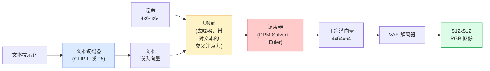

# Stable Diffusion — 架构与微调

> Stable Diffusion 是一个 DDPM，它在预训练 VAE 的潜空间中进行前向扩散，通过交叉注意力机制注入文本条件，使用快速确定性 ODE 采样器进行采样，并借助无分类器引导来控制生成方向。

**类型：** 学习 + 使用
**语言：** Python
**前置条件：** 阶段 4 第 10 课（扩散模型）、阶段 7 第 2 课（自注意力）
**时间：** 约 75 分钟

## 学习目标

- 追踪 Stable Diffusion 流水线的五个组成部分：VAE、文本编码器、U-Net、调度器、安全检查器——以及它们各自的作用
- 解释潜扩散的原理，以及为什么在 4x64x64 的潜空间（而非 3x512x512 的图像）中训练能节省 48 倍的计算量而不损失质量
- 使用 `diffusers` 生成图像、实现图生图、局部重绘（inpainting）和 ControlNet 引导生成
- 在小型自定义数据集上用 LoRA 微调 Stable Diffusion，并在推理时加载 LoRA 适配器

## 问题

直接在 512x512 RGB 图像上训练 DDPM 代价极高。每一次训练步都通过一个接收 3x512x512 = 786,432 个输入值的 U-Net 进行反向传播，而采样需要 50+ 次对该 U-Net 的前向传递。以 Stable Diffusion 1.5（2022 年发布）的质量水平，像素空间扩散需要约 256 GPU 月的训练时间和消费级 GPU 上每张图 10-30 秒的采样时间。

使开源权重的文生图变得实用的关键技巧是**潜扩散**（Rombach et al., CVPR 2022）。训练一个 VAE，将 3x512x512 的图像映射为 4x64x64 的潜张量并能再解码回来，然后在这个潜空间中进行扩散。计算量降为原来的 `(3*512*512)/(4*64*64) = 1/48`。采样时间从数十秒降至同一 GPU 上的两秒以内。

几乎所有现代图像生成模型——SDXL、SD3、FLUX、HunyuanDiT、Wan-Video——都是潜扩散模型，差异在于自编码器、去噪器（U-Net 或 DiT）和文本条件的不同实现。学会了 Stable Diffusion，就学会了模板。

## 概念

### 流水线



- **VAE** — 冻结的自编码器。编码器将图像转换为潜向量（用于图生图和训练）。解码器将潜向量转换回图像。
- **文本编码器** — CLIP 文本编码器（SD 1.x/2.x）、CLIP-L + CLIP-G（SDXL）或 T5-XXL（SD3/FLUX）。输出一系列 token 嵌入。
- **U-Net** — 去噪器。在每个分辨率层级都有交叉注意力层，从潜向量关注到文本嵌入。
- **调度器** — 采样算法（DDIM、Euler、DPM-Solver++）。选择 sigma 值，将预测的噪声混合回潜向量。
- **安全检查器** — 对输出图像进行可选的 NSFW/非法内容过滤。

### 无分类器引导（CFG）

普通文本条件对每个提示词 `c` 学习 `epsilon_theta(x_t, t, c)`。CFG 在 10% 的时间内将 `c` 丢弃（替换为空嵌入向量）来训练同一个网络，从而让一个模型同时预测条件噪声和无条件噪声。推理时：

```
eps = eps_uncond + w * (eps_cond - eps_uncond)
```

`w` 是引导强度。`w=0` 为无条件生成，`w=1` 为普通条件生成，`w>1` 会让输出更"遵从提示词"，代价是多样性降低。SD 默认值为 `w=7.5`。

CFG 是文生图达到生产质量的关键。没有它，提示词对输出的影响很弱；有了它，提示词占据主导地位。

### 潜空间几何

VAE 的 4 通道潜向量不仅仅是一张压缩图像。它是一个流形，在这个流形中，算术运算大致对应于语义编辑（提示词工程和插值都基于此），扩散 U-Net 的全部建模预算都花在了这个流形上。随机解码一个 4x64x64 的潜向量不会产生一张看起来随机的图像——它会产生乱码，因为只有潜空间的一个特定子流形才能解码为有效图像。

两个推论：

1. **图生图（Img2img）** = 将图像编码为潜向量，添加部分噪声，运行去噪器，解码。图像结构得以保留，因为编码几乎是可逆的；而内容根据提示词改变。
2. **局部重绘（Inpainting）** = 与图生图相同，但去噪器只更新被遮罩的区域；未遮罩区域保持在编码后的潜向量状态。

### U-Net 架构

SD 的 U-Net 是第 10 课中 TinyUNet 的放大版，增加了三样东西：

- **Transformer 块** 在每个空间分辨率层级，包含对文本嵌入的自注意力和交叉注意力。
- **时间嵌入** 通过正弦编码的 MLP 生成。
- **跳层连接** 在编码器和解码器的对应分辨率层级之间。

SD 1.5 的总参数量：约 860M。SDXL：约 2.6B。FLUX：约 12B。参数量跃升主要来自注意力层。

### LoRA 微调

完全微调 Stable Diffusion 需要 20+ GB 的显存，并更新 860M 个参数。LoRA（Low-Rank Adaptation，低秩适配）保持基础模型冻结，向注意力层注入小的秩分解矩阵。SD 的 LoRA 适配器通常只有 10-50 MB，在单块消费级 GPU 上 10-60 分钟即可完成训练，在推理时作为即插即用的修改量加载。

```
原始权重: W_q : (d_in, d_out)   冻结
LoRA:     W_q + alpha * (A @ B)   其中 A : (d_in, r), B : (r, d_out)

r 通常为 4-32。
```

LoRA 是几乎所有社区微调分发的方式。CivitAI 和 Hugging Face 上托管着数百万个 LoRA 适配器。

### 会遇到的调度器

- **DDIM** — 确定性，约 50 步，简单。
- **Euler ancestral** — 随机性，30-50 步，样本创意性稍强。
- **DPM-Solver++ 2M Karras** — 确定性，20-30 步，生产环境默认选择。
- **LCM / TCD / Turbo** — 一致性模型和蒸馏变体；1-4 步，代价是略微牺牲质量。

在 `diffusers` 中切换调度器只需一行代码，有时无需任何重训练就能解决采样问题。

## 动手实现

本课使用 `diffusers` 端到端完成，而非从零重建 Stable Diffusion。你需要重建的各个组件（VAE、文本编码器、U-Net、调度器）都有各自的专题课程；这里的目标是熟练掌握生产级 API。

### 第 1 步：文生图

```python
import torch
from diffusers import StableDiffusionPipeline

pipe = StableDiffusionPipeline.from_pretrained(
    "runwayml/stable-diffusion-v1-5",
    torch_dtype=torch.float16,
).to("cuda")

image = pipe(
    prompt="a dog riding a skateboard in tokyo, studio ghibli style",
    guidance_scale=7.5,
    num_inference_steps=25,
    generator=torch.Generator("cuda").manual_seed(42),
).images[0]
image.save("dog.png")
```

`float16` halves VRAM with no visible quality loss. `num_inference_steps=25` with the default DPM-Solver++ matches `num_inference_steps=50` with DDIM.

### Step 2: Swap the scheduler

```python
from diffusers import DPMSolverMultistepScheduler, EulerAncestralDiscreteScheduler

pipe.scheduler = DPMSolverMultistepScheduler.from_config(pipe.scheduler.config)
pipe.scheduler = EulerAncestralDiscreteScheduler.from_config(pipe.scheduler.config)
```

Scheduler state is decoupled from U-Net weights. You can train on DDPM and sample with any scheduler.

### Step 3: Image-to-image

```python
from diffusers import StableDiffusionImg2ImgPipeline
from PIL import Image

img2img = StableDiffusionImg2ImgPipeline.from_pretrained(
    "runwayml/stable-diffusion-v1-5",
    torch_dtype=torch.float16,
).to("cuda")

init_image = Image.open("dog.png").convert("RGB").resize((512, 512))
out = img2img(
    prompt="a dog riding a skateboard, oil painting",
    image=init_image,
    strength=0.6,
    guidance_scale=7.5,
).images[0]
```

`strength` is how much noise to add before denoising (0.0 = unchanged, 1.0 = full regeneration). 0.5-0.7 is the standard range for style transfer.

### Step 4: Inpainting

```python
from diffusers import StableDiffusionInpaintPipeline

inpaint = StableDiffusionInpaintPipeline.from_pretrained(
    "runwayml/stable-diffusion-inpainting",
    torch_dtype=torch.float16,
).to("cuda")

image = Image.open("dog.png").convert("RGB").resize((512, 512))
mask = Image.open("dog_mask.png").convert("L").resize((512, 512))

out = inpaint(
    prompt="a cat",
    image=image,
    mask_image=mask,
    guidance_scale=7.5,
).images[0]
```

White pixels in the mask are the area to regenerate. Black pixels are preserved.

### Step 5: LoRA loading

```python
pipe.load_lora_weights("sayakpaul/sd-lora-ghibli")
pipe.fuse_lora(lora_scale=0.8)

image = pipe(prompt="a village square in ghibli style").images[0]
```

`lora_scale` controls strength; 0.0 = no effect, 1.0 = full effect. `fuse_lora` bakes the adapter into the weights in place for speed, but prevents swapping. Call `pipe.unfuse_lora()` before loading a different adapter.

### Step 6: LoRA training (sketch)

Real LoRA training lives in `peft` or `diffusers.training`. The outline:

```python
# Pseudocode
for step, batch in enumerate(dataloader):
    images, prompts = batch
    latents = vae.encode(images).latent_dist.sample() * 0.18215

    t = torch.randint(0, num_train_timesteps, (batch_size,))
    noise = torch.randn_like(latents)
    noisy_latents = scheduler.add_noise(latents, noise, t)

    text_emb = text_encoder(tokenizer(prompts))

    pred_noise = unet(noisy_latents, t, text_emb)  # LoRA weights injected here

    loss = F.mse_loss(pred_noise, noise)
    loss.backward()
    optimizer.step()
```

Only the LoRA matrices receive gradient; the base U-Net, VAE, and text encoder are frozen. With a batch size of 1 and gradient checkpointing this fits in 8 GB of VRAM.

## Use It

In production, the decisions you actually make:

- **Model family**: SD 1.5 for open-source community fine-tunes, SDXL for higher fidelity, SD3 / FLUX for state of the art and strict licensing requirements.
- **Scheduler**: DPM-Solver++ 2M Karras for 20-30 steps, LCM-LoRA when latency is under 1s.
- **Precision**: `float16` on 4080/4090, `bfloat16` on A100 and newer, `int8` (via `bitsandbytes` or `compel`) when VRAM is tight.
- **Conditioning**: plain text works; for stronger control, add ControlNet (canny, depth, pose) on top of the base pipeline.

For batch generation, `AUTO1111` / `ComfyUI` are the community tools; for production APIs, `diffusers` + `accelerate` or `optimum-nvidia` with TensorRT compilation.

## Ship It

This lesson produces:

- `outputs/prompt-sd-pipeline-planner.md` — a prompt that picks SD 1.5 / SDXL / SD3 / FLUX plus scheduler and precision given a latency budget, fidelity target, and licensing constraint.
- `outputs/skill-lora-training-setup.md` — a skill that writes a full LoRA training config for a custom dataset including captions, rank, batch size, and learning rate.

## Exercises

1. **(Easy)** Generate the same prompt with `guidance_scale` in `[1, 3, 5, 7.5, 10, 15]`. Describe how the image changes. At what guidance value do artefacts appear?
2. **(Medium)** Take any real photograph, run it through `StableDiffusionImg2ImgPipeline` at `strength` in `[0.2, 0.4, 0.6, 0.8, 1.0]`. Which strength preserves composition while changing style? Why does 1.0 ignore the input entirely?
3. **(Hard)** Train a LoRA on 10-20 images of a single subject (a pet, a logo, a character) and generate novel scenes with that subject in them. Report the LoRA rank and training steps that produced the best identity preservation without overfitting to the input images.

## Key Terms

| Term | What people say | What it actually means |
|------|----------------|----------------------|
| Latent diffusion | "Diffuse in latents" | Run the entire DDPM in the VAE latent space (4x64x64) instead of pixel space (3x512x512); 48x compute saving |
| VAE scale factor | "0.18215" | Constant that rescales the VAE's raw latent to roughly unit variance; hardcoded in every SD pipeline |
| Classifier-free guidance | "CFG" | Mix conditional and unconditional noise predictions; the single most impactful inference knob |
| Scheduler | "Sampler" | The algorithm that turns noise + model predictions into a denoised latent trajectory |
| LoRA | "Low-rank adapter" | Small rank-decomposition matrices that fine-tune attention layers without touching base weights |
| Cross-attention | "Text-image attention" | Attention from latent tokens to text tokens; injects prompt information at every U-Net level |
| ControlNet | "Structure conditioning" | A separately-trained adapter that steers SD with an extra input (canny, depth, pose, segmentation) |
| DPM-Solver++ | "The default scheduler" | Second-order deterministic ODE solver; best quality at low step counts (20-30) in 2026 |

## Further Reading

- [High-Resolution Image Synthesis with Latent Diffusion (Rombach et al., 2022)](https://arxiv.org/abs/2112.10752) — the Stable Diffusion paper; includes every ablation that justifies the design
- [Classifier-Free Diffusion Guidance (Ho & Salimans, 2022)](https://arxiv.org/abs/2207.12598) — the CFG paper
- [LoRA: Low-Rank Adaptation of Large Language Models (Hu et al., 2021)](https://arxiv.org/abs/2106.09685) — LoRA was NLP-first; it transferred to SD with almost no changes
- [diffusers documentation](https://huggingface.co/docs/diffusers) — the reference for every SD / SDXL / SD3 / FLUX pipeline
