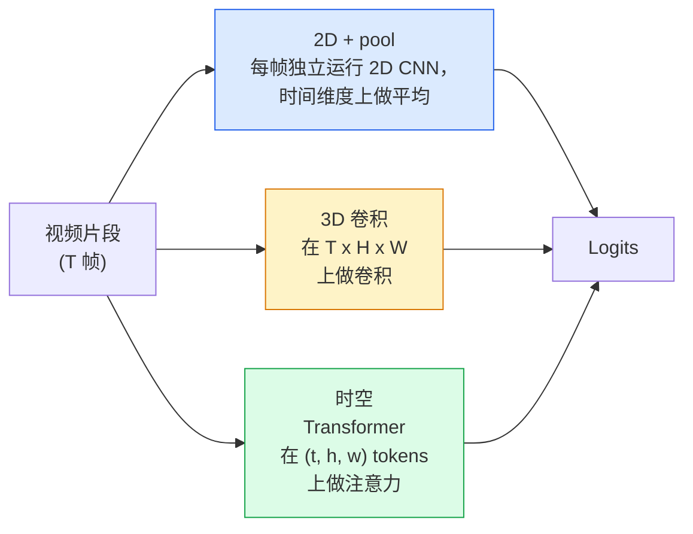

# 视频理解——时序建模

> 视频是一系列图像加上连接它们的物理规律。每一个视频模型要么把时间当作一条额外的轴（3D 卷积），要么当作一个需要 attend 过的序列（transformer），要么当作一次提取后做池化的特征（2D+pool）。

**类型：** 学习 + 构建
**语言：** Python
**前置条件：** 阶段 4 第 03 课（CNN）、阶段 4 第 04 课（图像分类）
**时间：** 约 45 分钟

## 学习目标

- 区分三种主要的视频建模方法（2D+pool、3D 卷积、时空 transformer），并预测它们的计算成本与精度权衡
- 在 PyTorch 中实现帧采样、时间池化，以及一个 2D+pool 基线分类器
- 解释 I3D 的"膨胀"3D 卷积核为何能很好地从 ImageNet 权重迁移，以及分解式 (2+1)D 卷积与普通 3D 卷积的不同之处
- 阅读标准的动作识别数据集和指标：Kinetics-400/600、UCF101、Something-Something V2；片段级和视频级的 top-1 准确率

## 问题

一段 30 秒 30 fps 的视频是 900 张图像。朴素地看，视频分类就是运行 900 次图像分类，然后做某种聚合。当动作在几乎每一帧都可见时（体育、烹饪、健身视频），这种方法可行；但当动作本身由运动定义时，它就会彻底失败："从左向右推某物"在每一帧中看起来都像两个静止的物体。

每个视频架构的核心问题是：时序结构是什么时候被建模的，以及如何建模？这个答案决定了其他一切——计算成本、预训练策略、是否能复用 ImageNet 权重，以及模型在什么数据集上训练。

本课比静态图像课程故意短一些。核心的图像 machinery 已经就位，视频理解主要是关于时序的故事：采样、建模和聚合。

## 概念

### 三大架构家族



### 2D + pool

取一个 2D CNN（ResNet、EfficientNet、ViT）。在每个采样帧上独立运行它。对每帧 embedding 做平均（或最大池化，或注意力池化）。将池化后的向量送入分类器。

优点：
- ImageNet 预训练直接迁移。
- 实现最简单。
- 便宜：T 帧 × 单图推理成本。

缺点：
- 无法建模运动。动作 = 外观的聚合。
- 时间池化是顺序不变的；"开门"和"关门"看起来一样。

何时使用：外观为主的任务、小型视频数据集上的迁移学习、初始基线。

### 3D 卷积

把 2D (H, W) 卷积核替换为 3D (T, H, W) 卷积核。网络在空间和时间上同时做卷积。早期家族：C3D、I3D、SlowFast。

I3D 技巧：取一个预训练的 2D ImageNet 模型，把每个 2D 卷积核"膨胀"到一个新的时间轴上。3x3 的 2D 卷积变成 3x3x3 的 3D 卷积。这让 3D 模型获得了强力的预训练权重，而不是从零开始训练。

优点：
- 直接建模运动。
- I3D 膨胀提供了免费的迁移学习。

缺点：
- 比 2D 对应物多 T/8 的 FLOPs（对于时间核为堆叠 3 次的 3D 卷积）。
- 时间卷积核很小；长程运动需要一个金字塔或双流方法。

何时使用：动作由运动作为信号的动作识别（Something-Something V2、Kinetics 中运动密集的类别）。

### 时空 Transformer

将视频 token 化为一个空间-时间 patches 网格，并在所有 patches 上做注意力。TimeSformer、ViViT、Video Swin、VideoMAE。

重要的注意力模式：
- **联合注意力** — 一个大的注意力作用于 (t, h, w)。对 `T*H*W` 是二次复杂度；昂贵。
- **分离注意力** — 每 block 两个注意力：一个在时间上，一个在空间上。接近线性扩展。
- **分解式** — 时间注意力和空间注意力在各个 block 之间交替。

优点：
- 在每个主要基准上达到 SOTA 精度。
- 通过 patch 膨胀从图像 transformer（ViT）迁移。
- 通过稀疏注意力支持长上下文视频。

缺点：
- 计算密集。
- 需要谨慎选择注意力模式，否则运行时开销会急剧膨胀。

何时使用：大型数据集、高保真视频理解、多模态视频+文本任务。

### 帧采样

一段 10 秒 30 fps 的视频有 300 帧；把全部 300 帧送给任何模型都是浪费。标准策略：

- **均匀采样** — 在片段中均匀选取 T 帧。2D+pool 的默认选项。
- **密集采样** — 随机选取一个连续的 T 帧窗口。3D 卷积的常见选择，因为运动需要相邻帧。
- **多片段** — 从同一视频中采样多个 T 帧窗口，分别分类，在测试时对预测做平均。

T 通常是 8、16、32 或 64。T 越高 = 更多的时序信号，但也更多的计算。

### 评估

两个层次：
- **片段级准确率** — 模型输入一个 T 帧片段，报告 top-k。
- **视频级准确率** — 在视频的多个片段上平均片段级预测；更高且更稳定。

请同时报告两者。片段 78% / 视频 82% 的模型严重依赖测试时平均；80% / 81% 的模型每片段更稳健。

### 你会遇见的常用数据集

- **Kinetics-400 / 600 / 700** — 通用动作数据集。40 万片段；YouTube 链接（很多已失效）。
- **Something-Something V2** — 由运动定义的动作（"把 X 从左向右移动"）。2D+pool 无法解决。
- **UCF-101**、**HMDB-51** — 更老、更小，但仍被报告。
- **AVA** — 在空间中和时间上的动作*定位*；比分类更难。

## 构建它

### 第 1 步：帧采样器

在帧列表（或视频张量）上工作的均匀和密集采样器。

```python
import numpy as np

def sample_uniform(num_frames_total, T):
    if num_frames_total <= T:
        return list(range(num_frames_total)) + [num_frames_total - 1] * (T - num_frames_total)
    step = num_frames_total / T
    return [int(i * step) for i in range(T)]


def sample_dense(num_frames_total, T, rng=None):
    rng = rng or np.random.default_rng()
    if num_frames_total <= T:
        return list(range(num_frames_total)) + [num_frames_total - 1] * (T - num_frames_total)
    start = int(rng.integers(0, num_frames_total - T + 1))
    return list(range(start, start + T))
```

两者都返回 T 个索引，用于对视频张量做切片。

### 第 2 步：2D+pool 基线

在每一帧上运行 2D ResNet-18，平均池化特征，分类。

```python
import torch
import torch.nn as nn
from torchvision.models import resnet18, ResNet18_Weights

class FramePool(nn.Module):
    def __init__(self, num_classes=400, pretrained=True):
        super().__init__()
        weights = ResNet18_Weights.IMAGENET1K_V1 if pretrained else None
        backbone = resnet18(weights=weights)
        self.features = nn.Sequential(*(list(backbone.children())[:-1]))  # 保留全局平均池化
        self.head = nn.Linear(512, num_classes)

    def forward(self, x):
        # x: (N, T, 3, H, W)
        N, T = x.shape[:2]
        x = x.view(N * T, *x.shape[2:])
        feats = self.features(x).view(N, T, -1)
        pooled = feats.mean(dim=1)
        return self.head(pooled)

model = FramePool(num_classes=10)
x = torch.randn(2, 8, 3, 224, 224)
print(f"output: {model(x).shape}")
print(f"params: {sum(p.numel() for p in model.parameters()):,}")
```

1100 万参数，ImageNet 预训练，逐帧运行，平均，分类。在外观为主的任务上，这个基线通常与正经的 3D 模型相差不到 5-10 个百分点——有时甚至更好，因为它复用了一个更强的 ImageNet 主干网络。

### 第 3 步：I3D 风格的膨胀 3D 卷积

通过沿新的时间轴重复权重，把一个 2D 卷积转换为一个 3D 卷积。

```python
def inflate_2d_to_3d(conv2d, time_kernel=3):
    out_c, in_c, kh, kw = conv2d.weight.shape
    weight_3d = conv2d.weight.data.unsqueeze(2)  # (out, in, 1, kh, kw)
    weight_3d = weight_3d.repeat(1, 1, time_kernel, 1, 1) / time_kernel
    conv3d = nn.Conv3d(in_c, out_c, kernel_size=(time_kernel, kh, kw),
                        padding=(time_kernel // 2, conv2d.padding[0], conv2d.padding[1]),
                        stride=(1, conv2d.stride[0], conv2d.stride[1]),
                        bias=False)
    conv3d.weight.data = weight_3d
    return conv3d

conv2d = nn.Conv2d(3, 64, kernel_size=3, padding=1, bias=False)
conv3d = inflate_2d_to_3d(conv2d, time_kernel=3)
print(f"2D weight shape:  {tuple(conv2d.weight.shape)}")
print(f"3D weight shape:  {tuple(conv3d.weight.shape)}")
x = torch.randn(1, 3, 8, 56, 56)
print(f"3D output shape:  {tuple(conv3d(x).shape)}")
```

除以 `time_kernel` 保持激活值 magnitude 大致不变——这对于不在第一次传递时破坏 batch-norm 统计量很重要。

### 第 4 步：分解式 (2+1)D 卷积

把一个 3D 卷积分解为一个 2D（空间）和一个 1D（时间）卷积。同样的感受野，更少的参数，在某些基准上更好的精度。

```python
class Conv2Plus1D(nn.Module):
    def __init__(self, in_c, out_c, kernel_size=3):
        super().__init__()
        mid_c = (in_c * out_c * kernel_size * kernel_size * kernel_size) \
                // (in_c * kernel_size * kernel_size + out_c * kernel_size)
        self.spatial = nn.Conv3d(in_c, mid_c, kernel_size=(1, kernel_size, kernel_size),
                                 padding=(0, kernel_size // 2, kernel_size // 2), bias=False)
        self.bn = nn.BatchNorm3d(mid_c)
        self.act = nn.ReLU(inplace=True)
        self.temporal = nn.Conv3d(mid_c, out_c, kernel_size=(kernel_size, 1, 1),
                                  padding=(kernel_size // 2, 0, 0), bias=False)

    def forward(self, x):
        return self.temporal(self.act(self.bn(self.spatial(x))))

c = Conv2Plus1D(3, 64)
x = torch.randn(1, 3, 8, 56, 56)
print(f"(2+1)D output: {tuple(c(x).shape)}")
```

一个完整的 R(2+1)D 网络与 ResNet-18 相同，只是每个 3x3 卷积都替换成了 `Conv2Plus1D`。

## 使用它

两个库覆盖生产级视频工作：

- `torchvision.models.video` — 带有预训练 Kinetics 权重的 R(2+1)D、MViT、Swin3D。与图像模型使用相同的 API。
- `pytorchvideo`（Meta）— 模型动物园、Kinetics / SSv2 / AVA 的数据加载器、标准数据增强。

对于视觉-语言视频模型（视频字幕、视频问答），使用 `transformers`（`VideoMAE`、`VideoLLaMA`、`InternVideo`）。

## 交付它

本课产出：

- `outputs/prompt-video-architecture-picker.md` — 一个提示词，根据外观 vs 运动、数据集大小和计算预算，选择 2D+pool / I3D / (2+1)D / transformer。
- `outputs/skill-frame-sampler-auditor.md` — 一个技能，检查视频 pipeline 的采样器并标记常见 bug：off-by-one 索引、当 `num_frames < T` 时的不均匀采样、缺少保持宽高比的裁剪等。

## 练习

1. **(简单)** 计算 FramePool（T=8）和 I3D 风格的 3D ResNet（T=8）的 FLOPs（近似值）。说明为什么 2D+pool 便宜 3-5 倍。
2. **(中等)** 生成一个合成视频数据集：随机方向的随机小球，按运动方向标记（"从左到右"、"从右到左"、"对角线向上"）。在上面训练 FramePool。展示它达到接近随机的准确率，证明仅靠外观不足以完成运动任务。
3. **(困难)** 通过将 ResNet-18 中的每个 Conv2d 替换为 `Conv2Plus1D` 来构建 R(2+1)D-18。从 ImageNet 预训练的 ResNet-18 膨胀第一个卷积的权重。在练习 2 的运动数据集上训练并超过 FramePool。

## 关键术语

| 术语 | 大家怎么说的 | 实际含义 |
|------|----------------|----------------------|
| 2D + pool | "逐帧分类器" | 在每个采样帧上运行 2D CNN，在时间维度上平均池化特征，然后分类 |
| 3D 卷积 | "时空卷积核" | 在 (T, H, W) 上做卷积的卷积核；能原生建模运动 |
| 膨胀 (Inflation) | "把 2D 权重升到 3D" | 通过沿新的时间轴重复 2D 卷积的权重来初始化 3D 卷积权重，然后除以 kernel_T 以保持激活值 scale |
| (2+1)D | "分解卷积" | 把 3D 分解为 2D 空间 + 1D 时间；更少的参数，两者之间多了一个非线性层 |
| 分离注意力 (Divided attention) | "先时间后空间" | 每个 layer 两个注意力的 Transformer block：一个在同帧的 tokens 上，一个在同位置的 tokens 上 |
| 片段 (Clip) | "T 帧窗口" | T 帧的采样子序列；视频模型消费的单元 |
| 片段 vs 视频准确率 | "两种评估设定" | 片段 = 每个视频一个样本，视频 = 在多个采样片段上做平均 |
| Kinetics | "视频的 ImageNet" | 400-700 个动作类别，30 万+ YouTube 片段，标准的视频预训练语料 |

## 延伸阅读

- [I3D: Quo Vadis, Action Recognition (Carreira & Zisserman, 2017)](https://arxiv.org/abs/1705.07750) — 引入了膨胀和 Kinetics 数据集
- [R(2+1)D: A Closer Look at Spatiotemporal Convolutions (Tran et al., 2018)](https://arxiv.org/abs/1711.11248) — 分解卷积，至今仍是强基线
- [TimeSformer: Is Space-Time Attention All You Need? (Bertasius et al., 2021)](https://arxiv.org/abs/2102.05095) — 第一个 strong video transformer
- [VideoMAE (Tong et al., 2022)](https://arxiv.org/abs/2203.12602) — 视频 masked autoencoder 预训练；当前主流的预训练方案