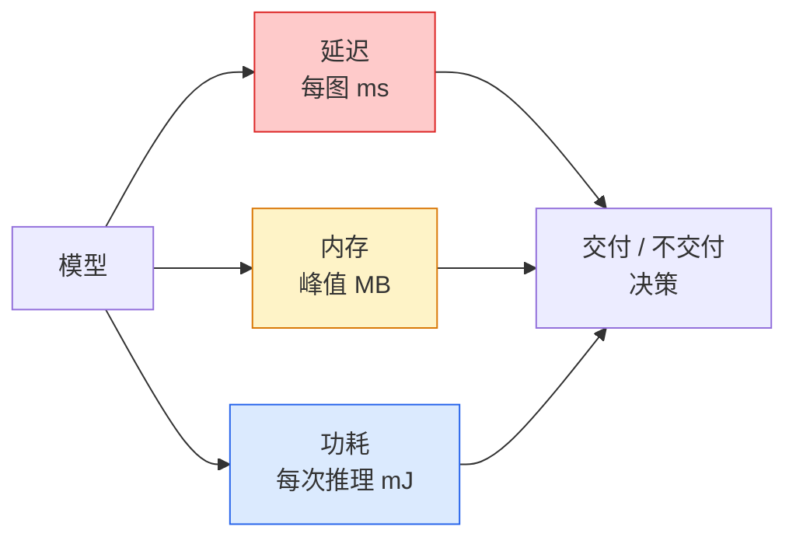

# 实时视觉 — 边缘部署

> 边缘推理是一门把一个 90% 准确率的模型，在只有 2 GB 内存的设备上跑出 30 fps 的学问。每一分准确率都要用毫秒级的延迟来交换。

**类型：** 学习 + 构建
**语言：** Python
**前置条件：** 阶段 4 第 4 课（图像分类）、阶段 10 第 11 课（量化）
**时间：** 约 75 分钟

## 学习目标

- 测量任意 PyTorch 模型的推理延迟、峰值内存和吞吐量，并读懂 FLOPs / 参数量 / 延迟之间的权衡
- 使用 PyTorch 的训练后量化将视觉模型量化到 INT8，并验证精度损失 < 1%
- 导出到 ONNX 并用 ONNX Runtime 或 TensorRT 编译；说出三种最常见的导出失败及其修复方法
- 解释在何种边缘约束下选择 MobileNetV3、EfficientNet-Lite、ConvNeXt-Tiny 或 MobileViT

## 问题

训练时的视觉模型是一个浮点怪物。1 亿参数，每次前向传递 10 GFLOPs，2 GB 显存。一个都塞不进手机、汽车信息娱乐单元、工业相机或无人机。交付一个视觉系统意味着把同样的预测塞进一个小了 100 倍的预算里。

有三个主要的旋钮：模型选择（同等配方下更小的架构）、量化（INT8 而非 FP32）和推理运行时（ONNX Runtime、TensorRT、Core ML、TFLite）。用对它们是 demo 和产品的分水岭 —— 前者跑在工作站上，后者跑在 30 美元的相机模组上。

本课先建立测量规范（你无法优化你无法测量的东西），然后走一遍三个旋钮。目标不是学会每一个边缘运行时，而是知道有哪些杠杆，以及如何验证每一个是否在按你的想法工作。

## 概念

### 三个预算



- **延迟**：p50、p95、p99。只看 p50 会掩盖对实时系统至关重要的尾部行为。
- **峰值内存**：设备曾经见到的最大值，不是稳态平均值。这很重要，因为在嵌入式设备上 OOM 是致命的。
- **功耗 / 能量**：电池供电设备上每次推理的毫焦耳。通常用 CPU/GPU 利用率 × 时间来代理。

一张（模型、延迟、内存、准确率）的表就是边缘决策的依据。每一个格子都是在目标设备上测量的，而不是工作站。

### 测量规范

每个边缘性能分析都应该遵循的三条规则：

1. **预热** —— 测量前用 5-10 次虚拟前向传递预热模型。冷缓存和 JIT 编译会产生不具代表性的首次数字。
2. **同步** —— 在计时代码块前后用 `torch.cuda.synchronize()` 同步 GPU 工作负载。不这样做你测量的是内核调度，而不是内核执行。
3. **固定输入尺寸** —— 使用生产分辨率。224x224 上的延迟不是 512x512 上的延迟。

### FLOPs 作为代理指标

FLOPs（每次推理的浮点运算次数）是一个廉价的、设备无关的延迟代理指标。对架构比较有用，作为绝对 wall-clock 时间则容易误导。一个 FLOPs 多 10% 的模型实际上可能快 2 倍，因为它使用了硬件友好的算子（depthwise conv 编译良好，大的 7x7 conv 则不然）。

规则：用 FLOPs 做架构搜索，用设备上的延迟做部署决策。

### 一段话说量化

把 FP32 权重和激活替换为 INT8。模型大小缩小 4 倍，内存带宽缩小 4 倍，在有 INT8 内核的硬件上计算缩小 2-4 倍（每一种现代移动 SoC、每一块带 Tensor Cores 的 NVIDIA GPU）。视觉任务的精度损失通常只有 0.1-1 个百分点，用训练后静态量化。

类型：

- **动态量化** —— 权重量化到 INT8，激活用 FP 计算。简单，加速较小。
- **静态（训练后）量化** —— 权重 + 在小校准集上校准激活范围。比动态快得多。
- **量化感知训练（QAT）** —— 在训练期间模拟量化，让模型在训练中适应它。精度最好，但需要标注数据。

对于视觉，训练后静态量化用 5% 的努力获得 95% 的收益。只有当 PTQ 的精度损失不可接受时才用 QAT。

### 剪枝和蒸馏

- **剪枝** —— 删除不重要的权重（基于幅值的）或通道（结构化的）。对过参数化模型效果好；对已经紧凑的架构用处较小。
- **蒸馏** —— 训练一个小模型去模仿大教师的 logits。通常能恢复因缩小模型而损失的大部分精度。对生产边缘模型是标准操作。

### 推理运行时

- **PyTorch eager** —— 慢，不适合部署。只用于开发。
- **TorchScript** —— 遗留的。被 `torch.compile` 和 ONNX 导出取代了。
- **ONNX Runtime** —— 中立的运行时。CPU、CUDA、CoreML、TensorRT、OpenVINO 都有 ONNX 提供者。从这里开始。
- **TensorRT** —— NVIDIA 的编译器。在 NVIDIA GPU（工作站和 Jetson）上延迟最低。可以与 ONNX Runtime 集成或独立使用。
- **Core ML** —— Apple 的 iOS/macOS 运行时。需要 `.mlmodel` 或 `.mlpackage`。
- **TFLite** —— Google 的 Android/ARM 运行时。需要 `.tflite`。
- **OpenVINO** —— Intel 的 CPU/VPU 运行时。需要 `.xml` + `.bin`。

实践：导出 PyTorch -> ONNX -> 为目标选择运行时。ONNX 是通用语言。

### 边缘架构选择器

| 预算 | 模型 | 为什么 |
|--------|-------|-----|
| < 3M 参数 | MobileNetV3-Small | 处处可编译，好的基线 |
| 3-10M | EfficientNet-Lite-B0 | TFLite 上每参数精度最好 |
| 10-20M | ConvNeXt-Tiny | 每参数精度最好，CPU 友好 |
| 20-30M | MobileViT-S 或 EfficientViT | 带 ImageNet 精度的 Transformer |
| 30-80M | Swin-V2-Tiny | 如果栈支持窗口注意力 |

除非有特定原因，否则全部量化到 INT8。

## 构建

### 第 1 步：正确测量延迟

```python
import time
import torch

def measure_latency(model, input_shape, device="cpu", warmup=10, iters=50):
    model = model.to(device).eval()
    x = torch.randn(input_shape, device=device)
    with torch.no_grad():
        for _ in range(warmup):
            model(x)
        if device == "cuda":
            torch.cuda.synchronize()
        times = []
        for _ in range(iters):
            if device == "cuda":
                torch.cuda.synchronize()
            t0 = time.perf_counter()
            model(x)
            if device == "cuda":
                torch.cuda.synchronize()
            times.append((time.perf_counter() - t0) * 1000)
    times.sort()
    return {
        "p50_ms": times[len(times) // 2],
        "p95_ms": times[int(len(times) * 0.95)],
        "p99_ms": times[int(len(times) * 0.99)],
        "mean_ms": sum(times) / len(times),
    }
```

预热、同步、使用 `time.perf_counter()`。报告百分位数，而不是只看均值。

### 第 2 步：参数和 FLOP 计数

```python
def parameter_count(model):
    return sum(p.numel() for p in model.parameters())

def flops_estimate(model, input_shape):
    """
    对纯卷积/线性模型的粗略 FLOP 计数。生产用途用 `fvcore` 或 `ptflops`。
    """
    total = 0
    def conv_hook(m, inp, out):
        nonlocal total
        c_out, c_in, kh, kw = m.weight.shape
        h, w = out.shape[-2:]
        total += 2 * c_in * c_out * kh * kw * h * w
    def linear_hook(m, inp, out):
        nonlocal total
        total += 2 * m.in_features * m.out_features
    hooks = []
    for m in model.modules():
        if isinstance(m, torch.nn.Conv2d):
            hooks.append(m.register_forward_hook(conv_hook))
        elif isinstance(m, torch.nn.Linear):
            hooks.append(m.register_forward_hook(linear_hook))
    model.eval()
    with torch.no_grad():
        model(torch.randn(input_shape))
    for h in hooks:
        h.remove()
    return total
```

真实项目用 `fvcore.nn.FlopCountAnalysis` 或 `ptflops`；它们能正确处理每一种模块类型。

### 第 3 步：训练后静态量化

```python
def quantise_ptq(model, calibration_loader, backend="x86"):
    import torch.ao.quantization as tq
    model = model.eval().cpu()
    model.qconfig = tq.get_default_qconfig(backend)
    tq.prepare(model, inplace=True)
    with torch.no_grad():
        for x, _ in calibration_loader:
            model(x)
    tq.convert(model, inplace=True)
    return model
```

三步：配置、准备（插入观察者）、用真实数据校准、转换（融合 + 量化）。需要模型被融合（`Conv -> BN -> ReLU` -> `ConvBnReLU`），`torch.ao.quantization.fuse_modules` 处理这个。

### 第 4 步：导出到 ONNX

```python
def export_onnx(model, sample_input, path="model.onnx"):
    model = model.eval()
    torch.onnx.export(
        model,
        sample_input,
        path,
        input_names=["input"],
        output_names=["output"],
        dynamic_axes={"input": {0: "batch"}, "output": {0: "batch"}},
        opset_version=17,
    )
    return path
```

`opset_version=17` 是 2026 年的安全默认值。`dynamic_axes` 让你用任意 batch 大小运行 ONNX 模型。

### 第 5 步：基准测试和比较各方案

```python
import torch.nn as nn
from torchvision.models import mobilenet_v3_small

def compare_regimes():
    model = mobilenet_v3_small(weights=None, num_classes=10)
    params = parameter_count(model)
    flops = flops_estimate(model, (1, 3, 224, 224))
    lat_fp32 = measure_latency(model, (1, 3, 224, 224), device="cpu")
    print(f"FP32 MobileNetV3-Small: {params:,} params  {flops/1e9:.2f} GFLOPs  "
          f"p50={lat_fp32['p50_ms']:.2f}ms  p95={lat_fp32['p95_ms']:.2f}ms")
```

对 `resnet50`、`efficientnet_v2_s` 和 `convnext_tiny` 运行同样的函数，你就有了部署决策所需的比较表。

## 使用

生产栈收敛到三条路径之一：

- **Web / 无服务器**：PyTorch -> ONNX -> ONNX Runtime（CPU 或 CUDA 提供者）。最简单，对大多数场景够用。
- **NVIDIA 边缘（Jetson、GPU 服务器）**：PyTorch -> ONNX -> TensorRT。延迟最低，工程量最大。
- **移动端**：PyTorch -> ONNX -> Core ML（iOS）或 TFLite（Android）。导出前量化。

测量方面，`torch-tb-profiler`、`nvprof` / `nsys` 和 macOS 上的 Instruments 给出逐层分解。`benchmark_app`（OpenVINO）和 `trtexec`（TensorRT）给出独立的 CLI 数字。

## 交付

本课产出：

- `outputs/prompt-edge-deployment-planner.md` —— 一个提示词，给定目标设备和延迟 SLA，能选择骨干网络、量化策略和运行时。
- `outputs/skill-latency-profiler.md` —— 一个技能，能写出完整的延迟基准测试脚本，包含预热、同步、百分位数和内存跟踪。

## 练习

1. **（简单）** 测量 `resnet18`、`mobilenet_v3_small`、`efficientnet_v2_s` 和 `convnext_tiny` 在 CPU 上 224x224 的 p50 延迟。报告表格，并指出哪个架构的每毫秒精度最好。
2. **（中等）** 对 `mobilenet_v3_small` 应用训练后静态量化。报告 FP32 vs INT8 延迟和在 CIFAR-10 保留子集上的精度损失。
3. **（困难）** 把 `convnext_tiny` 导出到 ONNX，用 `onnxruntime` 的 `CPUExecutionProvider` 运行，并与 PyTorch eager 基线比较延迟。找出 ONNX Runtime 第一次变快的层并解释原因。

## 关键术语

| 术语 | 大家怎么说的 | 实际含义 |
|------|----------------|----------------------|
| 延迟 | "有多快" | 从输入到输出的时间；p50/p95/p99 百分位数，不是均值 |
| FLOPs | "模型大小" | 每次前向传递的浮点运算次数；计算成本的粗略代理 |
| INT8 量化 | "8 位" | 用 8 位整数替换 FP32 权重/激活；小约 4 倍，快 2-4 倍 |
| PTQ | "训练后量化" | 不重训练就对已训练模型量化；简单，通常够用 |
| QAT | "量化感知训练" | 在训练期间模拟量化；精度最好，但需要标注数据 |
| ONNX | "中立格式" | 每个主流推理运行时都支持的模型交换格式 |
| TensorRT | "NVIDIA 编译器" | 把 ONNX 编译成 NVIDIA GPU 的优化引擎 |
| 蒸馏 | "教师 -> 学生" | 训练一个小模型模仿大模型的 logits；恢复大部分损失的精度 |

## 延伸阅读

- [EfficientNet（Tan & Le, 2019）](https://arxiv.org/abs/1905.11946) —— 高效架构的复合缩放
- [MobileNetV3（Howard et al., 2019）](https://arxiv.org/abs/1905.02244) —— 移动优先架构，带 h-swish 和 squeeze-excite
- [TensorRT 优化实用指南（NVIDIA）](https://developer.nvidia.com/blog/accelerating-model-inference-with-tensorrt-tips-and-best-practices-for-pytorch-users/) —— 如何真正获得论文中的吞吐量数字
- [ONNX Runtime 文档](https://onnxruntime.ai/docs/) —— 量化、图优化、提供者选择
