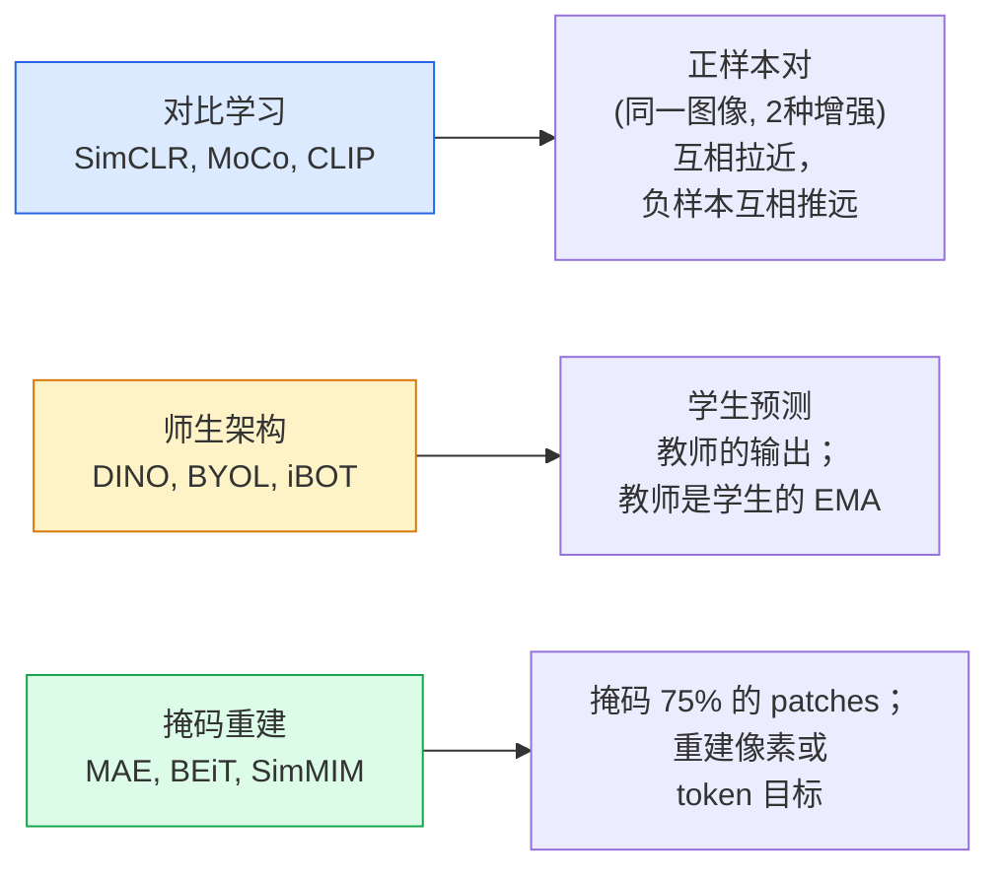

# 自监督视觉 — SimCLR、DINO、MAE

> 有标签数据是监督视觉的瓶颈。自监督预训练去掉了它：从 1 亿张无标签图像中学习视觉特征，在 1 万张有标签图像上微调。

**类型：** 学习型 + 构建型
**语言：** Python
**前置条件：** 阶段 4 第 4 课（图像分类）、阶段 4 第 14 课（ViT）
**时间：**约 75 分钟

## 学习目标

- 梳理三大自监督家族 —— 对比学习（SimCLR）、师生（DINO）、掩码重建（MAE）—— 并说明每个方法的优化目标
- 从零实现 InfoNCE 损失，并解释为什么 batch=512 能 work 而 batch=32 会失败
- 解释为什么 MAE 的 75% 掩码率不是任意设定的，以及它与 BERT 对文本的 15% 有何不同
- 使用 DINOv2 或 MAE 的 ImageNet 检查点进行线性探测和零样本检索

## 问题

有监督的 ImageNet 有 130 万张带标签图像，标注成本估计为 1000 万美元。医学和工业数据集更小，标注成本却更高。每个视觉团队都在问：能不能在廉价的无标签数据（YouTube 帧、网络爬取、摄像头画面、卫星扫描）上预训练，然后在少量带标签的数据上微调？

自监督学习就是答案。在 LAION 或 JFT 上训练的现代自监督 ViT，微调后能达到或超越有监督 ImageNet 的准确率。它向下游任务（检测、分割、深度）的迁移也比监督预训练更好。DINOv2（Meta，2023）和 MAE（Meta，2022）是目前迁移视觉特征的生产默认选择。

概念上的转变在于：代理任务（模型被训练去做的事）不必是下游任务。重要的是它迫使模型学习有用的特征。预测灰度图像的颜色、旋转图像并让模型识别旋转角度、掩码 patch 并重建它们——这些方法都有效过。真正能规模化的是三种方法：对比学习、师生蒸馏和掩码重建。

## 概念

### 三大家族



### 对比学习（SimCLR）

取一张图像，应用两种随机增强，得到两个视图。将两者通过同一个编码器加投影头。最小化一个损失：让"这两个嵌入应该相近"，同时"这个嵌入应该与 batch 中所有其他图像的嵌入远离"。

```
每个 batch 2N 个视图的正样本对 (z_i, z_j) 的损失：

   L_ij = -log( exp(sim(z_i, z_j) / tau) / sum_k in batch \ {i} exp(sim(z_i, z_k) / tau) )

sim = 余弦相似度
tau = 温度系数（标准值 0.1）
```

这就是 InfoNCE 损失。它要求每个正样本有大量负样本，所以 batch 大小很关键——SimCLR 需要 512-8192。MoCo 引入了过去 batch 的动量队列，将负样本数量与 batch 大小解耦。

### 师生架构（DINO）

两个网络结构相同：学生和教师。教师是学生权重的指数移动平均（EMA）。两者都看到图像的增强视图。学生的输出被训练去匹配教师的输出——没有显式的负样本。

```
loss = CE( student_output(view_1),  teacher_output(view_2) )
     + CE( student_output(view_2),  teacher_output(view_1) )

teacher_weights = m * teacher_weights + (1 - m) * student_weights   (m ≈ 0.996)
```

为什么不崩溃成"预测一个常数"：教师的输出做了中心化（减去每维均值）和锐化（除以小温度系数）。中心化防止某一维主导；锐化防止输出崩溃为均匀分布。

DINOv2 就是在 DINO 基础上用 142M 精筛图像放大规模的。生成的特征是 2026 年零样本视觉检索和密集预测的当前 SOTA。

### 掩码重建（MAE）

对 ViT 输入的 patches 掩码 75%。只将可见的 25% 通过编码器。一个小型解码器接收编码器的输出加上掩码位置的掩码 token，并被训练去重建掩码 patches 的像素。

```
编码器：可见的 25% patches -> 特征
解码器：特征 + 掩码位置上的掩码 token -> 重建的像素
损失：仅在掩码 patches 上重建像素与原始像素之间的 MSE
```

使 MAE 有效的关键设计选择：

- **75% 掩码率**——很高。迫使编码器学习语义特征；重建 25% 太简单了（相邻像素高度相关，CNN 就能搞定）。
- **非对称编码器/解码器**——大型 ViT 编码器只看到可见 patches；小型解码器（8 层，512 维）负责重建。比朴素 BEiT 快 3 倍的预训练。
- **像素空间重建目标**——比 BEiT 的 token 化目标更简单，在 ViT 上效果更好。

预训练后丢弃解码器。编码器就是特征提取器。

### 为什么是 75% 而不是 15%

BERT 掩码 15% 的 tokens。MAE 掩码 75%。区别在于信息密度。

- 自然语言每个 token 的熵很高。预测 15% 的 tokens 仍然很难，因为每个掩码位置有多种可能的补全。
- 图像 patches熵很低——未掩码的邻域往往几乎完全决定了掩码 patch 的像素。要让预测需要语义理解，必须激进地掩码。

75% 高到简单空间外推无法解决任务；编码器必须表示图像内容。

### 线性探测评估

自监督预训练之后，标准评估是**线性探测**：冻结编码器，在 ImageNet 标签上只训练一个线性分类器。报告 top-1 准确率。

- SimCLR ResNet-50：~71%（2020）
- DINO ViT-S/16：~77%（2021）
- MAE ViT-L/16：~76%（2022）
- DINOv2 ViT-g/14：~86%（2023）

线性探测是特征质量的纯粹度量；微调通常增加 2-5 个点，但也混入了头重训练的效果。

## 构建

### 第 1 步：双视图增强流水线

```python
import torch
import torchvision.transforms as T

two_view_train = lambda: T.Compose([
    T.RandomResizedCrop(96, scale=(0.2, 1.0)),
    T.RandomHorizontalFlip(),
    T.ColorJitter(0.4, 0.4, 0.4, 0.1),
    T.RandomGrayscale(p=0.2),
    T.ToTensor(),
])


class TwoViewDataset(torch.utils.data.Dataset):
    def __init__(self, base):
        self.base = base
        self.aug = two_view_train()

    def __len__(self):
        return len(self.base)

    def __getitem__(self, i):
        img, _ = self.base[i]
        v1 = self.aug(img)
        v2 = self.aug(img)
        return v1, v2
```

每个 __getitem__ 返回同一图像的两个增强视图；不需要标签。

### 第 2 步：InfoNCE 损失

```python
import torch.nn.functional as F

def info_nce(z1, z2, tau=0.1):
    """
    z1, z2: (N, D) L2-normalised embeddings of paired views
    """
    N, D = z1.shape
    z = torch.cat([z1, z2], dim=0)  # (2N, D)
    sim = z @ z.T / tau              # (2N, 2N)

    mask = torch.eye(2 * N, dtype=torch.bool, device=z.device)
    sim = sim.masked_fill(mask, float("-inf"))

    targets = torch.cat([torch.arange(N, 2 * N), torch.arange(0, N)]).to(z.device)
    return F.cross_entropy(sim, targets)
```

调用前先对嵌入做 L2 归一化。`tau=0.1` 是 SimCLR 默认值；更低会使损失更锐利，需要更多负样本。

### 第 3 步：InfoNCE 完整性检查

```python
z1 = F.normalize(torch.randn(16, 32), dim=-1)
z2 = z1.clone()
loss_same = info_nce(z1, z2, tau=0.1).item()
z2_random = F.normalize(torch.randn(16, 32), dim=-1)
loss_random = info_nce(z1, z2_random, tau=0.1).item()
print(f"InfoNCE with identical pairs:  {loss_same:.3f}")
print(f"InfoNCE with random pairs:     {loss_random:.3f}")
```

相同配对应该给出低损失（大批量加低温度下接近 0）。随机配对在 16 对 batch 下应该给出 log(2N-1) = ~log(31) = ~3.4。

### 第 4 步：MAE 式掩码

```python
def random_mask_indices(num_patches, mask_ratio=0.75, seed=0):
    g = torch.Generator().manual_seed(seed)
    n_keep = int(num_patches * (1 - mask_ratio))
    perm = torch.randperm(num_patches, generator=g)
    visible = perm[:n_keep]
    masked = perm[n_keep:]
    return visible.sort().values, masked.sort().values


num_patches = 196
visible, masked = random_mask_indices(num_patches, mask_ratio=0.75)
print(f"visible: {len(visible)} / {num_patches}")
print(f"masked:  {len(masked)} / {num_patches}")
```

简单、快速、对给定种子是确定性的。真正的 MAE 实现会批量化并保留每样本掩码。

## 使用

DINOv2 是 2026 年的生产标准：

```python
import torch
from transformers import AutoImageProcessor, AutoModel

processor = AutoImageProcessor.from_pretrained("facebook/dinov2-base")
model = AutoModel.from_pretrained("facebook/dinov2-base")
model.eval()

# Per-image embeddings for zero-shot retrieval
with torch.no_grad():
    inputs = processor(images=[pil_image], return_tensors="pt")
    outputs = model(**inputs)
    embedding = outputs.last_hidden_state[:, 0]  # CLS token
```

生成的 768 维嵌入是现代图像检索、密集对应和零样本迁移流水线的主干。下游任务微调很少需要超过一个线性头。

对于图像-文本嵌入，SigLIP 或 OpenCLIP 是等价选择；对于 MAE 式微调，`timm` 仓库提供了所有 MAE 检查点。

## 交付

本课产出：

- `outputs/prompt-ssl-pretraining-picker.md`——一个提示词，根据数据集大小、算力和下游任务选择 SimCLR / MAE / DINOv2。
- `outputs/skill-linear-probe-runner.md`——一个技能，为任意冻结编码器 + 带标签数据集编写线性探测评估。

## 练习

1. **（简单）**验证当嵌入对齐良好时降低温度会使 InfoNCE 损失下降，而嵌入随机时降低温度会使损失上升。画出 `tau in [0.05, 0.1, 0.2, 0.5]` 与损失的关系图。
2. **（中等）**实现一个 DINO 风格的中心缓冲。证明没有中心化，学生会在几个 epoch 内崩溃为一个常数向量。
3. **（困难）**用第 10 课的 TinyUNet 作为骨干在 CIFAR-100 上训练 MAE。报告 10、50 和 200 个 epoch 的线性探测准确率。证明 MAE 预训练的线性探测在同一1000 图像子集上胜过从头开始的有监督线性探测。

## 关键术语

| 术语 | 大家怎么说的 | 实际含义 |
|------|----------------|----------------------|
| 自监督（Self-supervised） | "无标签" | 一个代理任务，从无标签数据中产生有用的表示 |
| 代理任务（Pretext task） | "假任务" | SSL 期间使用的目标（重建 patches、匹配视图）；预训练后丢弃 |
| 线性探测（Linear probe） | "冻结编码器 + 线性头" | 标准 SSL 评估：只对冻结特征顶部的线性分类器进行训练 |
| InfoNCE | "对比损失" | 在余弦相似度上的 softmax；正样本对是目标类，其余都是负样本 |
| EMA 教师（EMA teacher） | "移动平均教师" | 权重是学生权重指数移动平均的教师；被 BYOL、MoCo、DINO 使用 |
| 掩码率（Mask ratio） | "隐藏的 patches 百分比" | MAE 期间掩码的 patches 比例；视觉 75%，文本 15% |
| 表征崩溃（Representation collapse） | "常数输出" | SSL 失败，编码器对所有输入输出常数向量；通过中心化、锐化或负样本防止 |
| DINOv2 | "生产级 SSL 主干" | Meta 的 2023 自监督 ViT；2026 年最强的通用图像特征 |

## 延伸阅读

- [SimCLR（Chen et al., 2020）](https://arxiv.org/abs/2002.05709)——对比学习参考文献
- [DINO（Caron et al., 2021）](https://arxiv.org/abs/2104.14294)——带动量、中心化、锐化的师生架构
- [MAE（He et al., 2022）](https://arxiv.org/abs/2111.06377)——用于 ViT 的掩码自编码器预训练
- [DINOv2（Oquab et al., 2023）](https://arxiv.org/abs/2304.07193)——将自监督 ViT 扩展到生产特征
