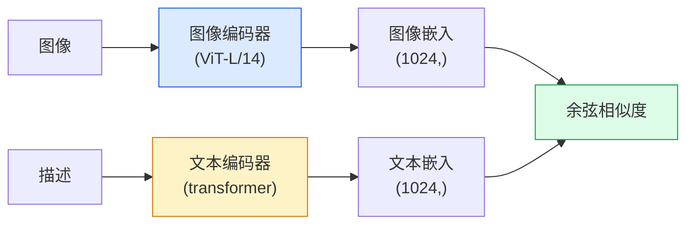

# 开放词汇视觉 — CLIP

> 将图像编码器和文本编码器联合训练，使匹配的（图像，描述）对落在共享空间的同一点上。这就是全部诀窍。

**类型：** 构建型 + 使用型
**语言：** Python
**前置条件：** 阶段 4 第 14 课（ViT）、阶段 4 第 17 课（自监督）
**时间：**约 45 分钟

## 学习目标

- 解释 CLIP 的双塔架构和对比训练目标
- 使用预训练的 CLIP（或 SigLIP）进行零样本分类，无需任何任务特定的训练
- 从零实现零样本分类：编码类别提示词，计算余弦相似度，取 argmax
- 区分 CLIP、SigLIP、OpenCLIP 和 LLaVA/LLaMA-vision 模型——2026 年各自用于什么

## 问题

传统分类器是封闭词汇的：1000 类 ImageNet 模型只能预测 1000 个标签。每个新类别都需要带标签的数据和重新训练的头。

CLIP（Radford et al., OpenAI 2021）表明，在从网络抓取的 4 亿对（图像，描述）对上训练，会产生一个可以在推理时分类到任意类别集合的模型，纯用自然语言描述。你可以通过写一个句子来给定一个新类别。

这种能力——零样本迁移——是为什么每个现代视觉系统都以 CLIP 家族检查点开头。检测（Grounding DINO、OWL-ViT）、分割（CLIPSeg、SAM）、检索、内容审核、VLMs 和文本到图像生成都建立在 CLIP 式联合嵌入之上。

## 概念

### 双塔



两个编码器末端都有一个线性投影到相同的嵌入维度（CLIP-B/32 为 512，CLIP-L/14 为 1024）。做 L2 归一化并计算余弦相似度。

### 目标

给定 N 个（图像，描述）对组成的 batch，构建一个 NxN 相似度矩阵。训练两个编码器，使对角线（匹配对）具有高相似度，非对角线（非匹配对）具有低相似度。

```
sim_matrix = image_embeddings @ text_embeddings.T / tau

loss_i2t = cross_entropy(sim_matrix,       targets=arange(N))
loss_t2i = cross_entropy(sim_matrix.T,     targets=arange(N))
loss = (loss_i2t + loss_t2i) / 2
```

是对称的，因为图像到文本和文本到图像检索都应该能 work。`tau`（温度）通常作为一个标量参数学习，初始化为 0.07。

### SigLIP：一个更好的损失

SigLIP（Zhai et al., 2023）用每对 sigmoid 替代了 softmax：

```
loss = mean over pairs of log(1 + exp(-y_ij * sim_ij))
y_ij = +1 if matching, -1 otherwise
```

每对损失去掉了 CLIP 所需的 batch 级归一化。SigLIP 在小 batch 大小时训练效果更好，在相同数据量时匹配或超越 CLIP。

### 零样本分类

给定一个训练好的 CLIP：

1. 对每个类别，组合一个提示词："a photo of a {class}"。
2. 用文本编码器编码所有类别提示词 -> `T` shape (C, d)。
3. 编码测试图像 -> `I` shape (1, d)。
4. 相似度 = `I @ T.T` shape (1, C)。
5. Argmax -> 预测类别。

提示词工程很重要。OpenAI 发布了 80 个 ImageNet 提示词模板（"a photo of a {}"、"a blurry photo of a {}"、"a sketch of a {}"……）。对每个类别的所有模板嵌入取平均，可以额外获得 1-3% 的 top-1 准确率。

### CLIP 式模型在 2026 年的使用场景

- **零样本分类**——直接使用。
- **图像检索**——一次性编码所有图像，推理时嵌入查询。
- **文本条件检测**——Grounding DINO、OWL-ViT 在检测器周围包裹一个 CLIP 文本塔。
- **文本条件分割**——CLIPSeg；SAM 通过 CLIP 使用文本提示输入。
- **VLMs**——LLaVA、Qwen-VL、InternVL 将 CLIP 家族视觉编码器接入 LLM。
- **文本到图像生成**——Stable Diffusion、DALL-E 3 以 CLIP 文本嵌入为条件。

一旦有了共享嵌入空间，每个视觉+语言任务都变成了距离计算。

## 构建

### 第 1 步：小型双塔模型

真正的 CLIP 是 ViT + transformer。在本课中，塔是在预提取特征上的小型 MLP，这样训练信号在 CPU 上就可见。

```python
import torch
import torch.nn as nn
import torch.nn.functional as F


class TwoTower(nn.Module):
    def __init__(self, img_in=128, txt_in=64, emb=64):
        super().__init__()
        self.image_proj = nn.Sequential(nn.Linear(img_in, 128), nn.ReLU(), nn.Linear(128, emb))
        self.text_proj = nn.Sequential(nn.Linear(txt_in, 128), nn.ReLU(), nn.Linear(128, emb))
        self.logit_scale = nn.Parameter(torch.ones([]) * 2.6592)  # ln(1/0.07)

    def forward(self, img_feats, txt_feats):
        i = F.normalize(self.image_proj(img_feats), dim=-1)
        t = F.normalize(self.text_proj(txt_feats), dim=-1)
        return i, t, self.logit_scale.exp()
```

两个投影、共享维输出、学习到的温度。与真实 CLIP API 形状相同。

### 第 2 步：对比损失

```python
def clip_loss(image_emb, text_emb, logit_scale):
    N = image_emb.size(0)
    sim = logit_scale * image_emb @ text_emb.T
    targets = torch.arange(N, device=sim.device)
    l_i = F.cross_entropy(sim, targets)
    l_t = F.cross_entropy(sim.T, targets)
    return (l_i + l_t) / 2
```

是对称的。logit_scale 越高 = softmax 越锐利 = 越自信但有不稳定风险。

### 第 3 步：零样本分类器

```python
@torch.no_grad()
def zero_shot_classify(model, image_feats, class_text_feats, class_names):
    """
    image_feats:      (N, img_in)
    class_text_feats: (C, txt_in)   one averaged embedding per class
    """
    i = F.normalize(model.image_proj(image_feats), dim=-1)
    t = F.normalize(model.text_proj(class_text_feats), dim=-1)
    sim = i @ t.T
    pred = sim.argmax(dim=-1)
    return [class_names[p] for p in pred.tolist()]
```

每步一行。这就是与生产 CLIP 检查点一起使用的零样本流程。

### 第 4 步：完整性检查

```python
torch.manual_seed(0)
model = TwoTower()

img = torch.randn(8, 128)
txt = torch.randn(8, 64)
i, t, scale = model(img, txt)
loss = clip_loss(i, t, scale)
print(f"batch size: {i.size(0)}   loss: {loss.item():.3f}")
```

损失应该接近 `log(N) = log(8) = 2.08`，对于随机初始化的模型——当还没有学到任何结构时的对称交叉熵目标。

## 使用

OpenCLIP 是 2026 年的社区默认：

```python
import open_clip
import torch
from PIL import Image

model, _, preprocess = open_clip.create_model_and_transforms("ViT-B-32", pretrained="laion2b_s34b_b79k")
tokenizer = open_clip.get_tokenizer("ViT-B-32")

image = preprocess(Image.open("dog.jpg")).unsqueeze(0)
text = tokenizer(["a photo of a dog", "a photo of a cat", "a photo of a car"])

with torch.no_grad():
    image_features = model.encode_image(image)
    text_features = model.encode_text(text)
    image_features = image_features / image_features.norm(dim=-1, keepdim=True)
    text_features = text_features / text_features.norm(dim=-1, keepdim=True)
    probs = (100.0 * image_features @ text_features.T).softmax(dim=-1)

print(probs)
```

SigLIP 是更新的，在小规模下训练效果更好，是新工作的首选：`google/siglip-base-patch16-224`。Hugging Face 同时提供两者。

## 交付

本课产出：

- `outputs/prompt-zero-shot-class-picker.md` — a prompt that designs class templates for zero-shot CLIP given a list of classes and a domain.
- `outputs/skill-image-text-retriever.md` — a skill that builds an image embedding index with any CLIP checkpoint, supports query-by-text and query-by-image.

## Exercises

1. **(Easy)** Use a pretrained OpenCLIP ViT-B/32 and do zero-shot classification on CIFAR-10 with the 80-template prompt set. Report top-1 accuracy; it should be around 85-90%.
2. **(Medium)** Compare single-template ("a photo of a {}") vs 80-template averaged embeddings on the same CIFAR-10 task. Quantify the gap and explain why templates help.
3. **(Hard)** Build a zero-shot image retrieval index: embed 1,000 images with CLIP, build a FAISS index, query with a natural language description. Report retrieval recall@5 for 20 held-out queries you write by hand.

## Key Terms

| Term | What people say | What it actually means |
|------|----------------|----------------------|
| Two-tower | "Dual encoder" | Separate image and text encoders ending in a shared-dim projection head |
| Zero-shot | "No task-specific training" | Classify into classes described only by text at inference; no labels touched |
| Temperature / logit_scale | "tau" | Learned scalar that scales the similarity matrix before softmax |
| Prompt template | "A photo of a {}" | Natural-language wrapper around class names; averaging many templates boosts zero-shot accuracy |
| CLIP | "Image+text model" | The 2021 OpenAI model; vocabulary of the field in 2026 |
| SigLIP | "Sigmoid CLIP" | Swaps softmax for per-pair sigmoid; trains better at small batches |
| OpenCLIP | "Open reproduction" | Community-trained CLIP variants on LAION; production default for open-source pipelines |
| VLM | "Vision-language model" | A CLIP-family encoder plus an LLM, trained to answer questions about images |

## Further Reading

- [CLIP: Learning Transferable Visual Models from Natural Language Supervision (Radford et al., 2021)](https://arxiv.org/abs/2103.00020)
- [SigLIP: Sigmoid Loss for Language-Image Pre-Training (Zhai et al., 2023)](https://arxiv.org/abs/2303.15343)
- [OpenCLIP](https://github.com/mlfoundations/open_clip) — the community codebase
- [DINOv2 vs CLIP vs MAE: a features comparison](https://huggingface.co/blog/dinov2) — HF guide with side-by-side use cases
