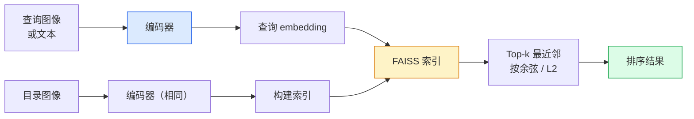

# 图像检索与度量学习

> 检索系统根据 embedding 空间中的距离对候选进行排序。度量学习就是塑造这个空间，使得距离反映你想要表达的相似度。

**类型：** 构建
**语言：** Python
**前置条件：** 阶段 4 第 14 课（ViT），阶段 4 第 18 课（CLIP）
**时间：** 约 45 分钟

## 学习目标

- 解释三元组、对比和代理-based 度量学习损失函数，并为给定数据集选择合适的损失
- 正确实现 L2 归一化和余弦相似度，并审计"同类物品"与"同类别"检索之间的差异
- 构建 FAISS 索引，通过文本和图像进行查询，并报告留出查询集的 recall@K
- 使用 DINOv2、CLIP 和 SigLIP 作为现成的 embedding 主干网络，并了解各自何时胜出

## 问题

检索在生产视觉中无处不在：重复检测、以图搜图、视觉搜索（"找相似商品"）、人脸重识别、行人重识别（监控）、电商实例级匹配。产品问题始终相同："给定这张查询图像，对我的目录进行排序。"

两个设计决策决定整个系统：embedding —— 什么模型产生向量；索引 —— 如何在大规模下找到最近邻。2026 年这两者都是commodity（DINOv2 做 embedding，FAISS 做索引），这提高了门槛：真正的难点在于为你的应用定义*什么算相似*，然后塑造 embedding空间使距离与之匹配。

这就是度量学习。一门小而高效的学科。

## 概念

### 检索概览



### 四种损失函数家族

| 损失函数 | 需要数据 | 优点 | 缺点 |
|------|----------|------|------|
| **对比损失** | （锚，正例）+ 负例 | 简单，任何成对标签都能用 | 没有大量负例时收敛慢 |
| **三元组损失** | （锚，正例，负例） | 直观；直接控制间隔 | 困难三元组挖掘代价高 |
| **NT-Xent / InfoNCE** | 成对 + 批次挖掘负例 | 可扩展到大批次 | 需要大批次或动量队列 |
| **代理-based（ProxyNCA）** | 只需类别标签 | 快、稳定、无需挖掘 | 在小数据集上可能对代理过拟合 |

对于大多数生产用例，从预训练主干网络开始，只有当现成 embedding 在测试集上表现不佳时，才添加度量学习微调。

### 三元组损失（形式化）

```
L = max(0, ||f(a) - f(p)||^2 - ||f(a) - f(n)||^2 + margin)
```

将锚 `a` 拉近正例 `p`，推远负例 `n`，并通过 `margin` 确保一个间隙。三图像结构泛化到任何相似度排序。

挖掘很重要：简单三元组（`n` 已经离 `a` 很远）贡献零损失；只有困难三元组才能教网络。半困难挖掘（`n` 比 `p` 更远但在间隔内）是2016 年 FaceNet 的配方，至今仍占主导。

### 余弦相似度 vs L2

两种度量，两种约定：

- **余弦**：向量间的夹角。需要 L2 归一化的 embedding。
- **L2**：欧氏距离。适用于原始或归一化的 embedding，但通常与 L2 归一化 + 平方 L2 配对使用。

对于大多数现代网络，两者等价：当 `||a|| = ||b|| = 1` 时，`||a - b||^2 = 2 - 2 cos(a, b)`。选择与你的 embedding 训练一致的约定；混用会悄悄改变"最近"的含义。

### Recall@K

标准检索指标：

```
recall@K = 至少有一个正确匹配出现在前 K 结果中的查询所占的比例
```

同时报告 recall@1、@5、@10。recall@10 高于 0.95 而 recall@1 低于 0.5 意味着 embedding 空间结构正确但排序有噪声 —— 尝试更长的微调或重排序步骤。

对于重复检测，precision@K 更重要，因为每个误报都是用户可见的错误。对于视觉搜索，recall@K 是产品信号。

### FAISS 一段话解释

Facebook AI Similarity Search。最近邻搜索的事实标准库。三种索引选择：

- `IndexFlatIP` / `IndexFlatL2` —— 暴力精确搜索，无需训练。最高约100 万向量。
- `IndexIVFFlat` —— 分成 K 个单元，只搜索最近的几个单元。近似、快速、需要训练数据。
- `IndexHNSW` —— 基于图，查询多时最快，索引尺寸大。

对于 10 万向量，你可能想要余弦相似度的 `IndexFlatIP`。对于 1000 万向量，想要 `IndexIVFFlat`。对于 1 亿以上，结合乘积量化（`IndexIVFPQ`）。

### 实例级 vs 类别级检索

两个同名但不同的问题：

- **类别级** —— "在我的目录里找猫。"类别条件相似；现成的 CLIP / DINOv2 embedding 效果很好。
- **实例级** —— "在我的目录里找*这 exact 产品*。" 需要在同类视觉相似物体之间进行细粒度区分；现成 embedding 表现不佳；需要用度量学习微调。

在选模型之前，先问自己解决的是哪一个。

##动手实现

### 第 1 步：三元组损失

```python
import torch
import torch.nn.functional as F

def triplet_loss(anchor, positive, negative, margin=0.2):
    d_ap = F.pairwise_distance(anchor, positive, p=2)
    d_an = F.pairwise_distance(anchor, negative, p=2)
    return F.relu(d_ap - d_an + margin).mean()
```

一行代码。适用于 L2 归一化或原始 embedding。

### 第 2 步：半困难挖掘

给定一批 embedding 和标签，为每个锚找到最难的半困难负例。

```python
def semi_hard_negatives(emb, labels, margin=0.2):
    dist = torch.cdist(emb, emb)
    same_class = labels[:, None] == labels[None, :]
    diff_class = ~same_class
    N = emb.size(0)

    positives = dist.clone()
    positives[~same_class] = float("-inf")
    positives.fill_diagonal_(float("-inf"))
    pos_idx = positives.argmax(dim=1)

    semi_hard = dist.clone()
    semi_hard[same_class] = float("inf")
    d_ap = dist[torch.arange(N), pos_idx].unsqueeze(1)
    semi_hard[dist <= d_ap] = float("inf")
    neg_idx = semi_hard.argmin(dim=1)

    fallback_mask = semi_hard[torch.arange(N), neg_idx] == float("inf")
    if fallback_mask.any():
        hardest = dist.clone()
        hardest[same_class] = float("inf")
        neg_idx = torch.where(fallback_mask, hardest.argmin(dim=1), neg_idx)
    return pos_idx, neg_idx
```

每个锚获得类内最难的正例，以及一个半困难负例 —— 比正例更远但在间隔内。

### 第 3 步：Recall@K

```python
def recall_at_k(query_emb, gallery_emb, query_labels, gallery_labels, k=1):
    sim = query_emb @ gallery_emb.T
    _, top_k = sim.topk(k, dim=-1)
    matches = (gallery_labels[top_k] == query_labels[:, None]).any(dim=-1)
    return matches.float().mean().item()
```

在 L2 归一化 embedding 上用内积取 Top-k 等价于用余弦取 Top-k。报告至少有一个正确最近邻的查询的平均比例。

### 第 4 步：整合

```python
import torch
import torch.nn as nn
from torch.optim import Adam

class Encoder(nn.Module):
    def __init__(self, in_dim=128, emb_dim=64):
        super().__init__()
        self.net = nn.Sequential(
            nn.Linear(in_dim, 128), nn.ReLU(),
            nn.Linear(128, emb_dim),
        )

    def forward(self, x):
        return F.normalize(self.net(x), dim=-1)

torch.manual_seed(0)
num_classes = 6
protos = F.normalize(torch.randn(num_classes, 128), dim=-1)

def sample_batch(bs=32):
    labels = torch.randint(0, num_classes, (bs,))
    x = protos[labels] + 0.15 * torch.randn(bs, 128)
    return x, labels

enc = Encoder()
opt = Adam(enc.parameters(), lr=3e-3)

for step in range(200):
    x, y = sample_batch(32)
    emb = enc(x)
    pos_idx, neg_idx = semi_hard_negatives(emb, y)
    loss = triplet_loss(emb, emb[pos_idx], emb[neg_idx])
    opt.zero_grad(); loss.backward(); opt.step()
```

几百步后，embedding 聚类形成每类一个簇。

## 使用它

2026 年的生产技术栈：

- **DINOv2 + FAISS** —— 通用视觉检索。开箱即用。
- **CLIP + FAISS** —— 当查询是文本时。
- **微调 DINOv2 + FAISS** —— 实例级检索、人脸重识别、时尚、电商。
- **Milvus / Weaviate / Qdrant** —— 托管向量数据库封装，基于 FAISS 或 HNSW。

对于 SOTA 实例检索，配方是：DINOv2 主干网络，添加 embedding head，用实例标注对上的三元组或 InfoNCE 损失微调，在 FAISS 中建索引。

## 交付物

本课产出：

- `outputs/prompt-retrieval-loss-picker.md` —— 一个提示词，为给定检索问题选择三元组 / InfoNCE / ProxyNCA。
- `outputs/skill-recall-at-k-runner.md` —— 一个技能，编写清晰的 recall@K 评估框架，包含训练/验证/库拆分和正确的数据契约。

## 练习

1. **（简单）** 运行上面的玩具示例。用 PCA 可视化训练前后的 embedding，观察六个簇的形成。
2. **（中等）** 添加 ProxyNCA 损失实现：每类一个学习到的"代理"，在余弦相似度上进行标准交叉熵。与三元组损失在玩具数据上的收敛速度对比。
3. **（困难）** 取 1000 张 ImageNet 验证图像，通过 HuggingFace 用 DINOv2 提取 embedding，构建 FAISS 平面索引，报告对同一图像作为查询（应为 1.0）和对留出拆分的 ImageNet 标签作为真值的 recall@{1, 5, 10}。

## 关键术语

| 术语 | 大家怎么说的 | 实际含义 |
|------|----------------|----------------------|
| 度量学习 | "塑造空间" | 训练编码器，使其输出空间中的距离反映目标相似度 |
| 三元组损失 | "拉近推远" | L = max(0, d(a, p) - d(a, n) + margin)；经典的度量学习损失 |
| 半困难挖掘 | "有用的负例" | 比正例离锚更远但在间隔内的负例；经验上信息量最大 |
| 代理-based 损失 | "类别原型" | 每类一个学习到的代理；在与代理的相似度上进行交叉熵；无需成对挖掘 |
| Recall@K | "Top-K 命中率" | 前 K 结果中至少有一个正确结果的查询所占的比例 |
| 实例检索 | "找这个 exact 东西" | 细粒度匹配；现成特征通常表现不佳 |
| FAISS | "NN 库" | Facebook 的最近邻库；支持精确和近似索引 |
| HNSW | "图索引" | 分层可导航小世界；小内存开销的快速近似 NN |

## 延伸阅读

- [FaceNet：人脸识别的统一 Embedding（Schroff 等，2015）](https://arxiv.org/abs/1503.03832) —— 三元组损失 / 半困难挖掘论文
- [为行人重识别辩护的三元组损失（Hermans 等，2017）](https://arxiv.org/abs/1703.07737) —— 三元组微调的实践指南
- [FAISS 文档](https://github.com/facebookresearch/faiss/wiki) —— 每种索引，每个权衡
- [SMoT：度量学习分类学（Kim 等，2021）](https://arxiv.org/abs/2010.06927) —— 现代损失函数及其联系的综述