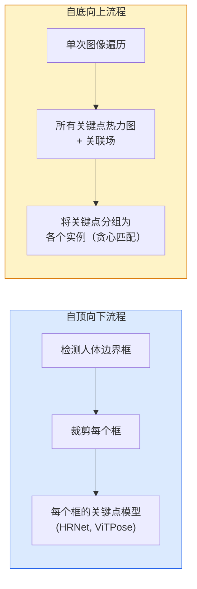

# 关键点检测与姿态估计

> 姿态是一组有序的关键点。关键点检测器就是一个热力图回归器。其余的都是些事务性工作。

**类型：** 构建型
**语言：** Python
**前置条件：** 阶段 4 第 06 课（目标检测）、阶段 4 第 07 课（U-Net）
**时间：** 约 45 分钟

## 学习目标

- 区分自顶向下和自底向上的姿态估计，并说明各自适用场景
- 用高斯-per-关键点目标回归 K 个关键点的热力图，并在推理时提取关键点坐标
- 解释部位亲和场（PAFs）以及自底向上流程如何将关键点关联到各个实例
- 使用 MediaPipe Pose 或 MMPose 进行生产级关键点估计，并理解其输出格式

## 问题

关键点任务有很多名字：人体姿态（17 个身体关节）、面部特征点（68 或 478 个点）、手部（21 个点）、动物姿态、机器人物体姿态、医学解剖学标志点。所有这些都共享同样的结构：检测物体上的 K 个离散点，并输出它们的 (x, y) 坐标。

姿态估计是动作捕捉、健身应用、体育分析、手势控制、动画、AR 试穿和机器人抓取的基础。2D 情况已经成熟；3D 姿态（从单个相机估计世界坐标中的关节位置）是当前的研究前沿。

工程问题是规模。单张图像单人姿态是一个 20ms 的问题。人群场景中 30fps 的多人姿态则是完全不同的问题，需要完全不同的架构。

## 概念

### 自顶向下 vs 自底向上



- **自顶向下（Top-down）** — 先检测人，然后对每个人物裁剪区域运行关键点模型。精度最高；随人数线性增长。
- **自底向上（Bottom-up）** — 一次前向传递预测所有关键点加上一个关联场；然后将它们分组。无论人群多大，时间复杂度恒定。

自顶向下（HRNet、ViTPose）是精度领导者；自底向上（OpenPose、HigherHRNet）是拥挤场景的吞吐量领导者。

### 热力图回归

不直接回归 `(x, y)`，而是为每个关键点预测一个 `H x W` 的热力图，在真实位置处有一个高斯 blob。

```
target[k, y, x] = exp(-((x - cx_k)^2 + (y - cy_k)^2) / (2 sigma^2))
```

推理时，每个热力图的 argmax 就是预测的关键点位置。

热力图比直接回归效果更好的原因：网络的空间结构（卷积特征图）与空间输出天然对齐。高斯目标也有正则化作用——小的定位误差产生小的损失，而不是零损失。

### 子像素定位

Argmax 给出整数坐标。要获得子像素精度，可以通过在 argmax 及其相邻点拟合抛物线来细化，或者使用著名的偏移量 `(dx, dy) = 0.25 * (heatmap[y, x+1] - heatmap[y, x-1], ...)` 方向。

### 部位亲和场（PAFs）

OpenPose 用于自底向上关联的技巧。对于每对连接的关键点（例如左肩到左肘），预测一个2 通道场，编码从其中一个指向另一个的单位向量。要将一个肩膀与其肘部关联，沿着连接候选对的线对 PAF 求积分；积分最高的配对被匹配。

```
对于每条连接（肢体）：
  PAF 通道：2（单位向量 x, y）
  线积分：沿采样点求和 (PAF . line_direction)
  积分越高 = 匹配越强
```

这个方法优雅且可扩展到任意人群规模，无需按人裁剪。

### COCO 关键点

标准人体姿态数据集：每人 17 个关键点，使用 PCK（正确关键点百分比）和 OKS（目标关键点相似度）作为指标。OKS 是关键点版的 IoU，也是 COCO mAP@OKS 报告的指标。

### 2D vs 3D

- **2D 姿态** — 图像坐标；已达到生产级质量（MediaPipe、HRNet、ViTPose）。
- **3D 姿态** — 世界/相机坐标；仍在积极研究中。常见方法：
  - 用小型 MLP 将 2D 预测提升到 3D（VideoPose3D）。
  - 从图像直接 3D 回归（PyMAF、MHFormer）。
  - 多视角方案（CMU Panoptic）获取真值。

## 动手实现

### 第 1 步：高斯热力图目标

```python
import numpy as np
import torch

def gaussian_heatmap(size, cx, cy, sigma=2.0):
    yy, xx = np.meshgrid(np.arange(size), np.arange(size), indexing="ij")
    return np.exp(-((xx - cx) ** 2 + (yy - cy) ** 2) / (2 * sigma ** 2)).astype(np.float32)

hm = gaussian_heatmap(64, 32, 32, sigma=2.0)
print(f"peak: {hm.max():.3f} at ({hm.argmax() % 64}, {hm.argmax() // 64})")
```

沿通道轴堆叠的每个关键点热力图给出完整的目标张量。

### 第 2 步：小型关键点头

一个输出 K 个热力图通道的 U-Net 风格模型。

```python
import torch.nn as nn
import torch.nn.functional as F

class TinyKeypointNet(nn.Module):
    def __init__(self, num_keypoints=4, base=16):
        super().__init__()
        self.down1 = nn.Sequential(nn.Conv2d(3, base, 3, 2, 1), nn.ReLU(inplace=True))
        self.down2 = nn.Sequential(nn.Conv2d(base, base * 2, 3, 2, 1), nn.ReLU(inplace=True))
        self.mid = nn.Sequential(nn.Conv2d(base * 2, base * 2, 3, 1, 1), nn.ReLU(inplace=True))
        self.up1 = nn.ConvTranspose2d(base * 2, base, 2, 2)
        self.up2 = nn.ConvTranspose2d(base, num_keypoints, 2, 2)

    def forward(self, x):
        h1 = self.down1(x)
        h2 = self.down2(h1)
        h3 = self.mid(h2)
        u1 = self.up1(h3)
        return self.up2(u1)
```

输入 `(N, 3, H, W)`，输出 `(N, K, H, W)`。损失是对高斯目标的逐像素 MSE。

### 第 3 步：推理 — 提取关键点坐标

```python
def heatmap_to_coords(heatmaps):
    """
    heatmaps: (N, K, H, W)
    returns:  (N, K, 2) 图像像素坐标的浮点数
    """
    N, K, H, W = heatmaps.shape
    hm = heatmaps.reshape(N, K, -1)
    idx = hm.argmax(dim=-1)
    ys = (idx // W).float()
    xs = (idx % W).float()
    return torch.stack([xs, ys], dim=-1)

coords = heatmap_to_coords(torch.randn(2, 4, 32, 32))
print(f"coords: {coords.shape}")  # (2, 4, 2)
```

推理只需一行代码。要做子像素细化，在 argmax 附近进行插值。

### 第 4 步：合成关键点数据集

很简单：在白色画布上画四个点，然后学习预测它们。

```python
def make_synthetic_sample(size=64):
    img = np.ones((3, size, size), dtype=np.float32)
    rng = np.random.default_rng()
    kps = rng.integers(8, size - 8, size=(4, 2))
    for cx, cy in kps:
        img[:, cy - 2:cy + 2, cx - 2:cx + 2] = 0.0
    hms = np.stack([gaussian_heatmap(size, cx, cy) for cx, cy in kps])
    return img, hms, kps
```

对于小型模型来说，一分钟内就能学会。

### 第 5 步：训练

```python
model = TinyKeypointNet(num_keypoints=4)
opt = torch.optim.Adam(model.parameters(), lr=3e-3)

for step in range(200):
    batch = [make_synthetic_sample() for _ in range(16)]
    imgs = torch.from_numpy(np.stack([b[0] for b in batch]))
    hms = torch.from_numpy(np.stack([b[1] for b in batch]))
    pred = model(imgs)
    # 上采样 pred 到完整分辨率
    pred = F.interpolate(pred, size=hms.shape[-2:], mode="bilinear", align_corners=False)
    loss = F.mse_loss(pred, hms)
    opt.zero_grad(); loss.backward(); opt.step()
```

##实际使用

- **MediaPipe Pose** — Google 的生产级姿态估计器；提供 WebGL + 移动端运行时，延迟低于 10ms。
- **MMPose**（OpenMMLab）— 全面的研究代码库；包含每种 SOTA 架构及预训练权重。
- **YOLOv8-pose** — 单次前向传递中最快的实时多人姿态。
- **transformers HumanDPT / PoseAnything** — 面向开放词汇姿态的新一代视觉-语言方法（任意物体、任意关键点集）。

## 交付物

本课产出：

- `outputs/prompt-pose-stack-picker.md` — 一个提示词，根据延迟、人群规模和 2D vs 3D 需求选择 MediaPipe / YOLOv8-pose / HRNet / ViTPose。
- `outputs/skill-heatmap-to-coords.md` — 一个技能，编写每个生产级姿态模型使用的子像素热力图转坐标例程。

## 练习

1. **（简单）** 在合成 4 点数据集上训练小型关键点模型。报告 200 步后预测关键点与真实关键点之间的平均 L2 误差。
2. **（中等）** 添加子像素细化：给定 argmax 位置，从相邻像素沿 x 和 y 方向拟合一维抛物线。报告相对于整数 argmax 的精度提升。
3. **（困难）** 构建2 人合成数据集，每张图像显示4 关键点模式的两个实例。训练一个带 PAF 的自底向上流程，预测每个关键点属于哪个实例，并评估 OKS。

## 关键术语

| 术语 | 大家怎么说的 | 实际含义 |
|------|----------------|----------------------|
| 关键点（Keypoint） | "一个标志点" | 物体上特定的有序点（关节、角点、特征点） |
| 姿态（Pose） | "骨架" | 属于同一个实例的一组有序关键点 |
| 自顶向下（Top-down） | "先检测后姿态" | 两阶段流程：人体检测器 + 按裁剪区域的关键点模型；精度最高 |
| 自底向上（Bottom-up） | "先姿态后分组" | 单次传递预测所有关键点 + 分组；时间复杂度与人群规模无关 |
| 热力图（Heatmap） | "高斯目标" | 每个关键点一个 H x W 张量，真值位置处有峰值；首选的回归目标 |
| PAF | "部位亲和场" | 2 通道单位向量场，编码肢体方向；用于将关键点分组为实例 |
| OKS | "关键点 IoU" | 目标关键点相似度；COCO姿态评估指标 |
| HRNet | "高分辨率网络" | 主导的自顶向下关键点架构；始终保持高分辨率特征 |

## 延伸阅读

- [OpenPose（Cao et al., 2017）](https://arxiv.org/abs/1812.08008) — 带 PAF 的自底向上方法；该方法最好的详细解读
- [HRNet（Sun et al., 2019）](https://arxiv.org/abs/1902.09212) — 自顶向下参考架构
- [ViTPose（Xu et al., 2022）](https://arxiv.org/abs/2204.12484) — 纯 ViT 作为姿态骨干；在许多基准上达到当前 SOTA
- [MediaPipe Pose](https://developers.google.com/mediapipe/solutions/vision/pose_landmarker) — 生产级实时姿态；2026 年部署最快的技术栈