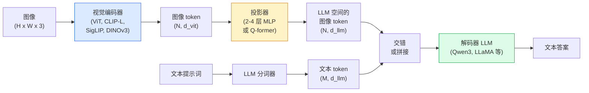

# 视觉-语言模型 — ViT-MLP-LLM 架构

> 视觉编码器将图像转换为 token。MLP 投影器将这些 token 映射到 LLM 的 embedding 空间。语言模型完成后续工作。这一模式 — ViT-MLP-LLM — 是 2026 年所有生产级 VLM 的共同架构。

**类型：** 学习 + 使用
**语言：** Python
**前置条件：** 阶段 4 第 14 课 (ViT)、阶段 4 第 18 课 (CLIP)、阶段 7 第 2 课 (自注意力)
**时间：** 约 75 分钟

## 学习目标

- 阐述 ViT-MLP-LLM 架构，解释三个组成部分各自贡献什么
- 从参数量、上下文长度和基准性能方面对比 Qwen3-VL、InternVL3.5、LLaVA-Next 和 GLM-4.6V
- 解释 DeepStack：为什么多层级 ViT 特征比单一末层特征能更好地实现视觉-语言对齐
- 用跨模态错误率（CMER）衡量生产环境中的 VLM 幻觉，并依据该指标采取行动

## 问题

CLIP（阶段 4 第 18 课）为你提供了图像和文本的共享 embedding 空间，这足以完成零样本分类和检索。但它无法回答"这张图里有多少辆红色汽车？"——因为 CLIP 不生成文本，只做相似度评分。

视觉-语言模型（VLM）—— Qwen3-VL、InternVL3.5、LLaVA-Next、GLM-4.6V —— 将一个 CLIP 系列图像编码器与一个完整语言模型连接起来。模型同时看到图像和问题，然后生成答案。2026 年的开源 VLM 在多模态基准（MMMU、MMBench、DocVQA、ChartQA、MathVista、OSWorld）上已经能与 GPT-5 和 Gemini-2.5-Pro 匹敌或超越。

三件套（ViT、投影器、LLM）是标准配置。各模型之间的差异在于：用哪个 ViT、用哪个投影器、用哪个 LLM、训练数据是什么、对齐方法是什么。一旦理解了这个模式，换任何组件都是机械操作。

## 概念

### ViT-MLP-LLM 架构



1. **视觉编码器** — 一个预训练的 ViT（CLIP-L/14、SigLIP、DINOv3 或微调变体）。生成 patch token。
2. **投影器** — 一个小型模块（2-4 层 MLP，或 Q-former），将视觉 token 映射到 LLM 的 embedding 维度。这是大部分微调发生的地方。
3. **LLM** — 一个仅解码器的语言模型（Qwen3、Llama、Mistral、GLM、InternLM）。按顺序读取视觉 + 文本 token，生成文本。

理论上三个组件都可以训练。实际上，视觉编码器和 LLM 几乎冻结，只训练投影器——用几十亿参数量的信号换来低成本。

### DeepStack

普通投影只使用最后一个 ViT 层。DeepStack（Qwen3-VL）从多个 ViT 深度层采样特征并堆叠。更深的层携带高层语义；更浅的层携带细粒度的空间和纹理信息。将两者都喂给 LLM，弥合了"图像包含什么"（语义）与"具体在哪里"（空间定位）之间的差距。

### 三个训练阶段

现代 VLM 分阶段训练：

1. **对齐** — 冻结 ViT 和 LLM，只在图像-标题对上训练投影器。教投影器将视觉空间映射到语言空间。
2. **预训练** — 解冻所有组件，在大规模交错的图像-文本数据（5 亿+ 对）上训练。建立模型的视觉知识。
3. **指令微调** — 在精挑细选的（图像、问题、答案）三元组上微调。教对话行为和任务格式。这步将一个"有视觉感知能力的 LM"转变为一个可用的助手。

大多数 LoRA 微调针对第三阶段，使用小型标注数据集。

### 模型家族对比（2026 年初）

| 模型 | 参数量 | 视觉编码器 | LLM | 上下文 | 优势 |
|-------|--------|----------------|-----|---------|-----------|
| Qwen3-VL-235B-A22B (MoE) | 235B（22B 激活） | 自定义 ViT + DeepStack | Qwen3 | 256K | 通用 SOTA，GUI 智能体 |
| Qwen3-VL-30B-A3B (MoE) | 30B（3B 激活） | 自定义 ViT + DeepStack | Qwen3 | 256K | 更小的 MoE 替代方案 |
| Qwen3-VL-8B (dense) | 8B | 自定义 ViT | Qwen3 | 128K | 生产环境 dense 默认选择 |
| InternVL3.5-38B | 38B | InternViT-6B | Qwen3 + GPT-OSS | 128K | MMBench / MMVet 表现强 |
| InternVL3.5-241B-A28B | 241B（28B 激活） | InternViT-6B | Qwen3 | 128K | 与 GPT-4o 竞争 |
| LLaVA-Next 72B | 72B | SigLIP | Llama-3 | 32K | 开源、易微调 |
| GLM-4.6V | ~70B | 自定义 | GLM | 64K | 开源、OCR 能力强 |
| MiniCPM-V-2.6 | 8B | SigLIP | MiniCPM | 32K | 边缘端友好 |

### 视觉智能体

Qwen3-VL-235B 在 OSWorld 上达到全球顶级性能——OSWorld 是一个面向操作 GUI（桌面、移动端、网页）的**视觉智能体**基准。模型看到截图、理解 UI 并输出动作（点击、输入、滚动）。配合工具使用，它能在常见桌面任务上形成闭环。这正是 2026 年大多数"AI PC"演示的底层运行方式。

### 智能体能力 + RoPE 变体

VLM 需要知道视频中某一帧的**时间**。Qwen3-VL 从 T-RoPE（时间旋转位置 embedding）演进到**基于文本的时间对齐**——在视频帧之间交错插入显式时间戳文本 token。模型看到"`timestamp 00:32` 帧，提示词"，就能推理时间关系。

### 对齐问题

爬取数据集中 12% 的图像-文本对包含的描述并非完全基于图像。在这样的数据上训练的 VLM 会悄悄学会产生幻觉——编造物体、误读数字、虚构关系。在生产环境中，这是主要的失败模式。

Skywork.ai 引入了**跨模态错误率（CMER）**来追踪这个问题：

```
CMER = 文本置信度高但图像-文本相似度（通过 CLIP 系列检查器）低的输出占比
```

高 CMER 意味着模型在说一些没有图像依据的话，但态度很自信。在他们的部署中，将 CMER 作为生产 KPI 监控并据此行动，使幻觉率降低了约 35%。诀窍不是"修复模型"，而是"将高 CMER 输出路由给人工审核"。

### 用 LoRA / QLoRA 微调

对大多数团队来说，全量微调 70B VLM 是不可承受的。在注意力层 + 投影器层上使用 LoRA（rank 16-64），或使用 4 位基础权重的 QLoRA，可以装进一张 A100 / H100。成本：5,000-50,000 个样本，$100-$5,000 计算费用，2-10 小时训练。

### 空间推理仍然薄弱

当前 VLM 在空间推理基准（上下、左右、计数、距离）上得分为 50-60%。如果你的用例依赖"哪个物体在另一个上面"，请大力验证——通用 VLM 表现低于人类水平。纯空间任务的 VLM 替代方案：专门的关键点/姿态估计器、深度模型，或经过盒子几何后处理的检测模型。

## 构建

### 第 1 步：投影器

这是你最常训练的部分。2-4 层 MLP，使用 GELU 激活。

```python
import torch
import torch.nn as nn


class Projector(nn.Module):
    def __init__(self, vit_dim=768, llm_dim=4096, hidden=4096):
        super().__init__()
        self.net = nn.Sequential(
            nn.Linear(vit_dim, hidden),
            nn.GELU(),
            nn.Linear(hidden, llm_dim),
        )

    def forward(self, x):
        return self.net(x)
```

输入是 `(N_patches, d_vit)` 的 token 张量。输出是 `(N_patches, d_llm)`。LLM 将每一行输出当作另一个 token 来处理。

### 第 2 步：从头组装 ViT-MLP-LLM

一个最小 VLM 的前向传递骨架。真实代码使用 `transformers`；这里展示的是概念结构。

```python
class MinimalVLM(nn.Module):
    def __init__(self, vit, projector, llm, image_token_id):
        super().__init__()
        self.vit = vit
        self.projector = projector
        self.llm = llm
        self.image_token_id = image_token_id  # 文本提示词中的占位符 token

    def forward(self, image, input_ids, attention_mask):
        # 1. 视觉特征
        vision_tokens = self.vit(image)                     # (B, N_patches, d_vit)
        vision_embeds = self.projector(vision_tokens)       # (B, N_patches, d_llm)

        # 2. 文本 embedding
        text_embeds = self.llm.get_input_embeddings()(input_ids)  # (B, M, d_llm)

        # 3. 用真实视觉 embedding 替换图像占位符 token
        merged = self._merge(text_embeds, vision_embeds, input_ids)

        # 4. 运行 LLM
        return self.llm(inputs_embeds=merged, attention_mask=attention_mask)

    def _merge(self, text_embeds, vision_embeds, input_ids):
        out = text_embeds.clone()
        expected = vision_embeds.size(1)
        for b in range(input_ids.size(0)):
            positions = (input_ids[b] == self.image_token_id).nonzero(as_tuple=True)[0]
            if len(positions) != expected:
                raise ValueError(
                    f"batch item {b} has {len(positions)} image tokens but vision_embeds has {expected} patches."
                    " Every sample in the batch must be pre-padded to the same number of image placeholder tokens.")
            out[b, positions] = vision_embeds[b]
        return out
```

文本中的 `<image>` 占位符 token 被真实的图像 embedding 替换——LLaVA、Qwen-VL 和 InternVL 都使用相同模式。

### 第 3 步：CMER 计算

一个轻量级的运行时检查。

```python
import torch.nn.functional as F


def cross_modal_error_rate(image_emb, text_emb, text_confidence, sim_threshold=0.25, conf_threshold=0.8):
    """
    image_emb, text_emb: 图像和生成文本的 embedding（内部自行归一化）
    text_confidence:     每个 token 的平均概率，范围 [0, 1]
    Returns:             高置信度但低图像-文本对齐的输出占比
    """
    image_emb = F.normalize(image_emb, dim=-1)
    text_emb = F.normalize(text_emb, dim=-1)
    sim = (image_emb * text_emb).sum(dim=-1)        # 余弦相似度
    high_conf_low_sim = (text_confidence > conf_threshold) & (sim < sim_threshold)
    return high_conf_low_sim.float().mean().item()
```

将 CMER 作为生产 KPI 来对待。按端点、按提示词类型、按客户监控它。CMER 上升表明模型开始在某些输入分布上产生幻觉。

### 第 4 步：玩具 VLM 分类器（可运行）

演示投影器可以训练。假"ViT 特征"输入；一个小型 LLM 风格 token 预测类别。

```python
class ToyVLM(nn.Module):
    def __init__(self, vit_dim=32, llm_dim=64, num_classes=5):
        super().__init__()
        self.projector = Projector(vit_dim, llm_dim, hidden=64)
        self.head = nn.Linear(llm_dim, num_classes)

    def forward(self, vision_tokens):
        projected = self.projector(vision_tokens)
        pooled = projected.mean(dim=1)
        return self.head(pooled)
```

用合成（特征，类别）对在不到 200 步内就能拟合——足以证明投影器模式是有效的。

## 使用

2026 年生产团队使用 VLM 的三种方式：

- **托管 API** — OpenAI Vision、Anthropic Claude Vision、Google Gemini Vision。零基础设施，但有供应商风险。
- **开源自托管** — 通过 `transformers` 和 `vllm` 部署 Qwen3-VL 或 InternVL3.5。完全控制，但前期投入更高。
- **领域微调** — 加载 Qwen2.5-VL-7B 或 LLaVA-1.6-7B，在 5k-50k 自定义样本上用 LoRA 微调，用 `vllm` 或 `TGI` 服务。

```python
from transformers import AutoProcessor, AutoModelForVision2Seq
import torch
from PIL import Image

model_id = "Qwen/Qwen3-VL-8B-Instruct"
processor = AutoProcessor.from_pretrained(model_id)
model = AutoModelForVision2Seq.from_pretrained(model_id, torch_dtype=torch.bfloat16, device_map="auto")

messages = [{
    "role": "user",
    "content": [
        {"type": "image", "image": Image.open("plot.png")},
        {"type": "text", "text": "What does this chart show?"},
    ],
}]
inputs = processor.apply_chat_template(messages, add_generation_prompt=True, tokenize=True, return_dict=True, return_tensors="pt").to("cuda")
generated = model.generate(**inputs, max_new_tokens=256)
answer = processor.decode(generated[0][inputs["input_ids"].shape[1]:], skip_special_tokens=True)
```

`apply_chat_template` 隐藏了 `<image>` 占位符分词；模型在内部处理合并。

## 交付

本课产出：

- `outputs/prompt-vlm-selector.md` — 根据准确率、延迟、上下文长度和预算选择 Qwen3-VL / InternVL3.5 / LLaVA-Next / API。
- `outputs/skill-cmer-monitor.md` — 发出代码来为生产 VLM 端点植入跨模态错误率指标，按端点的仪表盘，以及告警阈值。

## 练习

1. **（简单）** 用任何开源 VLM 对五张图像运行三个提示词（"这是什么？"、"数数有多少个物体"、"描述这个场景"）。手动将每个答案评为正确 / 部分正确 / 幻觉。计算类似 CMER 的比率。
2. **（中等）** 用 LoRA（rank 16）在 500 张目标领域图像及其标题上微调 Qwen2.5-VL-3B 或 LLaVA-1.6-7B。对比零样本 vs 微调后的 MMBench 风格准确率。
3. **（困难）** 将 VLM 的图像编码器换成 DINOv3（而不是默认的 SigLIP/CLIP）。只重新训练投影器（冻结 LLM + 冻结 DINOv3）。测量密集预测任务（计数、空间推理）是否有改善。

## 关键术语

| 术语 | 大家怎么说的 | 实际含义 |
|------|----------------|----------------------|
| ViT-MLP-LLM | "VLM 模式" | 视觉编码器 + 投影器 + 语言模型；2026 年所有 VLM 都采用此架构 |
| 投影器 (Projector) | "桥梁" | 2-4 层 MLP（或 Q-former），将视觉 token 映射到 LLM embedding 空间 |
| DeepStack | "Qwen3-VL 特征技巧" | 多层级 ViT 特征堆叠，而非仅用末层 |
| 图像 token | "<image> 占位符" | 文本流中被投影后的视觉 embedding 替换的特殊 token |
| CMER | "幻觉 KPI" | 跨模态错误率；当文本置信度高但图像-文本相似度低时较高 |
| 视觉智能体 (Visual agent) | "能点击的 VLM" | 操作 GUI（OSWorld、移动端、网页）并调用工具的 VLM |
| Q-former | "固定数量 token 桥" | BLIP-2 风格投影器，产生固定数量的视觉查询 token |
| 对齐 / 预训练 / 指令微调 | "三阶段" | 标准 VLM 训练流程 |

## 延伸阅读

- [Qwen3-VL 技术报告 (arXiv 2511.21631)](https://arxiv.org/abs/2511.21631)
- [InternVL3.5 推进开源多模态模型 (arXiv 2508.18265)](https://arxiv.org/html/2508.18265v1)
- [LLaVA-Next 系列](https://llava-vl.github.io/blog/2024-05-10-llava-next-stronger-llms/)
- [BentoML: 2026 年最佳开源 VLM](https://www.bentoml.com/blog/multimodal-ai-a-guide-to-open-source-vision-language-models)
- [MMMU: 多学科多模态理解基准](https://mmmu-benchmark.github.io/)
- [制造业中的 VLM（Robotics Tomorrow, 2026 年 3 月）](https://www.roboticstomorrow.com/story/2026/03/when-machines-learn-to-see-like-experts-the-rise-of-vision-language-models-in-manufacturing/26335/)