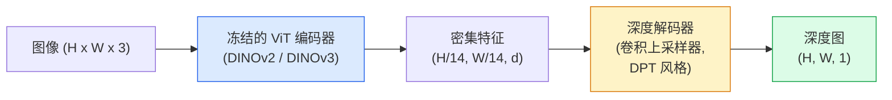

# 单目深度估计与几何推断

> 深度图是一张单通道图像，每个像素代表到摄像头的距离。过去在没有立体视觉或激光雷达的情况下，从单张 RGB 图像预测深度几乎是不可能的。到 2026 年，一个冻结的 ViT 编码器加上一个轻量级解码头，就能将预测误差控制在真实值的百分之几以内。

**类型：** 构建 + 使用
**语言：** Python
**前置条件：** 阶段 4 第 14 课（ViT）、阶段 4 第 17 课（自监督视觉）、阶段 4 第 7 课（U-Net）
**时间：** 约 60 分钟

## 学习目标

- 区分相对深度与度量深度，并说明 MiDaS、Marigold、Depth Anything V3、ZoeDepth 等生产模型各自解决的是哪一种
- 使用 Depth Anything V3（DINOv2 主干网络）预测任意单张图像的深度，无需标定
- 解释单目深度为什么能从单张图像work：利用哪些透视线索、纹理梯度和学习到的先验知识；以及它无法恢复什么（绝对尺度、被遮挡的几何）
- 利用深度图和针孔相机内参，将 2D 检测结果提升到 3D 点云

## 问题

深度是 2D 计算机视觉中缺失的那一维。有了 RGB，你知道物体在图像平面上的位置，却不知道它们有多远。深度传感器（立体视觉装置、激光雷达、飞行时间传感器）能直接解决这个问题，但价格昂贵、容易损坏且探测范围有限。

单目深度估计——从单张 RGB 图像预测深度——过去只能产生模糊、不可靠的结果。到 2026 年，大型预训练编码器改变了这一局面：Depth Anything V3 使用冻结的 DINOv2 主干网络，生成的深度图能够跨室内、室外、医疗、卫星等多种场景泛化。Marigold 将深度估计重新定义为一个条件扩散问题。ZoeDepth 则回归到真实的度量距离。

深度也是连接 2D 检测与 3D 理解的桥梁：将检测框的像素乘以深度，就能把 2D 物体提升到 3D 点云中。这正是所有 AR 遮挡系统、所有避障流程、以及所有"把杯子拿起来"机器人的核心。

## 概念

### 相对深度 vs 度量深度

- **相对深度** —— 有序的 `z` 值，没有现实世界的单位。"像素 A 比像素 B 近，但距离的比值没有锚定到米。"
- **度量深度** —— 到摄像头的绝对距离，单位为米。要求模型学习了图像线索与真实距离之间的统计关系。

MiDaS 和 Depth Anything V3产生相对深度。Marigold 产生相对深度。ZoeDepth、UniDepth 和 Metric3D 产生度量深度。度量模型对相机内参敏感；相对模型则不敏感。

### 编码器-解码器模式



Depth Anything V3 冻结编码器，只训练 DPT 风格的解码器。编码器提供丰富的特征；解码器将特征插值回图像分辨率并回归深度。

### 为什么单张图像能产生深度

2D 图像中包含许多与深度相关的单目线索：

- **透视** —— 3D 中的平行线在 2D 中会聚拢。
- **纹理梯度** —— 远处的表面纹理更小、更密集。
- **遮挡顺序** —— 近的物体遮挡远的物体。
- **大小恒常性** —— 已知大小的物体（汽车、人）提供近似尺度。
- **大气透视** —— 在户外场景中，远处的物体看起来更模糊、更偏蓝。

一个在数十亿张图像上训练过的 ViT 将这些线索内化了。有了足够的数据和强大的主干网络，单目深度可以在没有任何显式 3D 监督的情况下达到合理的精度。

### 单目深度做不到什么

- **没有内参或场景中的已知物体就无法获得绝对度量尺度**。网络可以预测"杯子离得是勺子的两倍远"，但不知道杯子究竟是 1 米还是 10 米远。
- **被遮挡的几何** —— 椅子的背面是不可见的，无法可靠地推断出来。
- **完全无纹理 / 反射表面** —— 镜子、玻璃、均匀的墙面。网络会给出看似合理但实际错误的深度。

### 2026 年的 Depth Anything V3

- 使用 Vanilla DINOv2 ViT-L/14 作为编码器（冻结）。
- DPT 解码器。
- 在来自多种源的带位姿图像对上进行训练（除了光度一致性之外，不需要显式的深度监督）。
- 能够从**任意数量的视觉输入中**预测空间一致的几何结构，无论是否已知相机位姿。
- 在单目深度、任意视角几何、视觉渲染、相机位姿估计上均达到 SOTA。

这就是2026 年你需要深度时的首选模型。

### Marigold —— 用扩散做深度

Marigold（Ke 等人，CVPR 2024）将深度估计重新定义为条件性的图像到图像扩散。条件：RGB。目标：深度图。使用预训练的 Stable Diffusion 2 U-Net 作为主干网络。输出的深度图在物体边界处格外清晰。权衡：比前向模型推理更慢（需要10-50 步去噪）。

### 内参与针孔相机模型

要将像素 `(u, v)` 和深度 `d` 提升到相机坐标系中的 3D 点 `(X, Y, Z)`：

```
fx, fy, cx, cy = 相机内参
X = (u - cx) * d / fx
Y = (v - cy) * d / fy
Z = d
```

内参来自 EXIF 元数据、标定图案，或单目内参估计器（Perspective Fields、UniDepth）。没有内参时，仍可以通过假设 60-70° 的视场角和中等分辨率的主点来渲染点云——可用于可视化，但不可用于精确测量。

### 评估指标

两个标准指标：

- **AbsRel**（绝对相对误差）：`mean(|d_pred - d_gt| / d_gt)`。越低越好。生产模型的典型范围是 0.05-0.1。
- **delta < 1.25**（阈值准确率）：满足 `max(d_pred/d_gt, d_gt/d_pred) < 1.25` 的像素比例。越高越好。SOTA 模型通常达到 0.9+。

对于相对深度（Depth Anything V3、MiDaS），评估使用对尺度和偏移不变版本的指标。

## 构建

### 第 1 步：深度评估指标

```python
import torch

def abs_rel_error(pred, target, mask=None):
    if mask is not None:
        pred = pred[mask]
        target = target[mask]
    return (torch.abs(pred - target) / target.clamp(min=1e-6)).mean().item()


def delta_accuracy(pred, target, threshold=1.25, mask=None):
    if mask is not None:
        pred = pred[mask]
        target = target[mask]
    ratio = torch.maximum(pred / target.clamp(min=1e-6), target / pred.clamp(min=1e-6))
    return (ratio < threshold).float().mean().item()
```

在评估前务必掩膜掉无效深度像素（零值、NaN、过饱和）。

### 第 2 步：尺度和偏移对齐

对于相对深度模型，在计算指标前先将预测值对齐到真值。用最小二乘拟合 `a * pred + b = target`：

```python
def align_scale_shift(pred, target, mask=None):
    if mask is not None:
        p = pred[mask]
        t = target[mask]
    else:
        p = pred.flatten()
        t = target.flatten()
    A = torch.stack([p, torch.ones_like(p)], dim=1)
    coeffs, *_ = torch.linalg.lstsq(A, t.unsqueeze(-1))
    a, b = coeffs[:2, 0]
    return a * pred + b
```

在计算 MiDaS / Depth Anything 的 AbsRel 前，先运行 `align_scale_shift`。

### 第 3步：将深度提升为点云

```python
import numpy as np

def depth_to_point_cloud(depth, intrinsics):
    H, W = depth.shape
    fx, fy, cx, cy = intrinsics
    v, u = np.meshgrid(np.arange(H), np.arange(W), indexing="ij")
    z = depth
    x = (u - cx) * z / fx
    y = (v - cy) * z / fy
    return np.stack([x, y, z], axis=-1)


depth = np.random.uniform(0.5, 4.0, (240, 320))
intr = (320.0, 320.0, 160.0, 120.0)
pc = depth_to_point_cloud(depth, intr)
print(f"point cloud shape: {pc.shape}  (H, W, 3)")
```

一个函数，适用所有 3D 提升场景。将点云导出为 `.ply` 格式，用 MeshLab 或 CloudCompare 打开。

### 第 4 步：合成深度场景冒烟测试

```python
def synthetic_depth(size=96):
    yy, xx = np.meshgrid(np.arange(size), np.arange(size), indexing="ij")
    # 地面：近处（顶部）到远处（底部）的线性梯度
    depth = 1.0 + (yy / size) * 4.0
    # 中间的盒子：更近
    mask = (np.abs(xx - size / 2) < size / 6) & (np.abs(yy - size * 0.6) < size / 6)
    depth[mask] = 2.0
    return depth.astype(np.float32)


gt = torch.from_numpy(synthetic_depth(96))
pred = gt + 0.3 * torch.randn_like(gt)  # 模拟预测
aligned = align_scale_shift(pred, gt)
print(f"对齐前  absRel = {abs_rel_error(pred, gt):.3f}")
print(f"对齐后  absRel = {abs_rel_error(aligned, gt):.3f}")
```

### 第 5 步：Depth Anything V3 使用方法（参考）

```python
import torch
from transformers import pipeline
from PIL import Image

pipe = pipeline(task="depth-estimation", model="LiheYoung/depth-anything-v2-large")

image = Image.open("street.jpg").convert("RGB")
out = pipe(image)
depth_np = np.array(out["depth"])
```

三行代码。`out["depth"]` 是一个 PIL 灰度图；转换为 numpy 数组以便计算。Depth Anything V3 发布后只需更换模型 ID；API 保持不变。

## 使用

- **Depth Anything V3**（Meta AI / 字节跳动，2024-2026）—— 相对深度的默认选择。生产环境中速度最快的 ViT-large 主干模型。
- **Marigold**（苏黎世联邦理工学院，2024）—— 视觉质量最高，推理速度较慢。
- **UniDepth**（苏黎世联邦理工学院，2024）—— 带内参估计的度量深度。
- **ZoeDepth**（英特尔，2023）—— 度量深度；较老，但仍可靠。
- **MiDaS v3.1**—— 历史遗留但稳定；适合作为对比基线。

典型集成流程：

1. RGB 帧输入。
2. 深度模型生成深度图。
3. 检测器生成检测框。
4. 将检测框质心通过深度提升到 3D；如果可用则与点云合并。
5. 下游：AR 遮挡、路径规划、物体尺寸估计、替代立体匹配。

对于实时应用，Depth Anything V2 Small（INT8 量化）在 518x518 分辨率下可在消费级 GPU 上达到约 30 fps。

## 交付

本课产出：

- `outputs/prompt-depth-model-picker.md` —— 根据延迟、度量 vs 相对需求和场景类型，在 Depth Anything V3、Marigold、UniDepth、MiDaS 之间做出选择的提示词。
- `outputs/skill-depth-to-pointcloud.md` —— 将深度图构建为点云的技能，包含正确的内参处理和 `.ply` 格式导出。

## 练习

1. **（简单）** 对桌面上的任意 10 张图像运行 Depth Anything V2。将深度保存为灰度 PNG 并检查。找出一个深度预测明显错误的物体，解释为什么单目线索在这里失效了。
2. **（中等）** 给定 Depth Anything V2 的 RGB + 深度图，提升到点云并用 `open3d` 渲染。对比两个场景（室内 / 室外），注意哪个看起来更可信。
3. **（困难）** 取五对仅在某个物体位置上有差异的图像（例如瓶子移近了 30 cm）。用 UniDepth 预测两者的度量深度。报告预测的距离差值与真实 30 cm 之间的差异。

## 关键术语

| 术语 | 大家怎么说的 | 实际含义 |
|------|----------------|----------------------|
| 单目深度 | "单图像深度" | 从一张 RGB 帧估计深度，无需立体视觉或激光雷达 |
| 相对深度 | "有序深度" | 有序的 z 值，没有现实世界的单位 |
| 度量深度 | "绝对距离" | 以米为单位的深度；需要标定或使用度量监督训练的模型 |
| AbsRel | "绝对相对误差" | |d_pred - d_gt| / d_gt 的均值；标准深度指标 |
| Delta 准确率 | "delta < 1.25" | 预测值在真值 25% 以内的像素比例 |
| 针孔相机 | "fx, fy, cx, cy" | 用于将 (u, v, d) 提升到 (X, Y, Z) 的相机模型 |
| DPT | "密集预测Transformer" | 在冻结 ViT 编码器之上使用的卷积解码器，用于深度估计 |
| DINOv2 主干网络 | "它work的原因" | 自监督特征，能够跨领域泛化，无需深度标签 |

## 扩展阅读

- [Depth Anything V3 论文页面](https://depth-anything.github.io/) —— 基于 DINOv2 编码器的 SOTA 单目深度
- [Marigold（Ke 等人，CVPR 2024）](https://marigoldmonodepth.github.io/) —— 基于扩散的深度估计
- [UniDepth（Piccinelli 等人，2024）](https://arxiv.org/abs/2403.18913) —— 带内参估计的度量深度
- [MiDaS v3.1（英特尔 ISL）](https://github.com/isl-org/MiDaS) —— 经典的相对深度基线
- [DINOv3 博客文章（Meta）](https://ai.meta.com/blog/dinov3-self-supervised-vision-model/) —— 提升深度准确率的编码器家族