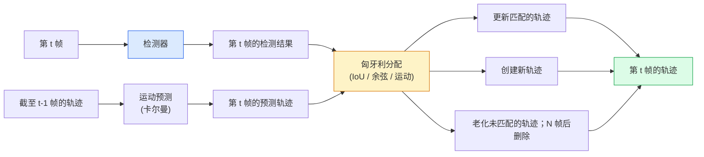

# 多目标跟踪与视频记忆

> 跟踪就是检测加关联。每帧检测，将第 t 帧的检测结果与第 t-1 帧的轨迹按 ID 匹配。

**类型：** 构建型
**语言：** Python
**前置条件：** 阶段 4 第 06课（YOLO 检测）、阶段 4 第 08 课（Mask R-CNN）、阶段 4 第 24 课（SAM 3）
**时间：** 约 60 分钟

## 学习目标

- 区分检测后跟踪与基于查询的跟踪，熟悉算法族（SORT、DeepSORT、ByteTrack、BoT-SORT、SAM 2 记忆跟踪器、SAM 3.1 目标复用）
- 从零实现 IoU + 匈牙利分配，完成经典检测后跟踪
- 解释 SAM 2 的记忆库，以及为何它比基于 IoU 的关联能更好地处理遮挡
- 读懂三个跟踪指标（MOTA、IDF1、HOTA），并根据具体应用场景选择合适的指标

## 问题

检测器告诉你单个帧中物体在哪里。跟踪器告诉你第 t 帧中的哪个检测结果与第 t-1 帧中的某个检测结果是同一个物体。没有跟踪，你就无法统计跨越某条线的物体、让球穿过遮挡飞行，或者知道"4 号车已经在这个车道里8 秒了"。

跟踪是每个视频相关产品的必备能力：体育分析、监控、自动驾驶、医学视频分析、野生动物监测、品牌统计。核心构建块是共享的：每帧检测器、运动模型（卡尔曼滤波器或其他更复杂的模型）、关联步骤（基于 IoU / 余弦相似度 / 学习特征的匈牙利算法），以及轨迹生命周期（创建、更新、消亡）。

2026 年出现了两种新模式：**基于 SAM 2 记忆的跟踪**（特征记忆而非运动模型关联）和 **SAM 3.1 目标复用**（同一概念的多个实例共享记忆）。本课先讲经典架构，再讲基于记忆的方法。

## 概念

### 检测后跟踪



你在 2026 年遇到的任何跟踪器都是这个循环的变体。差异在于：

- **SORT**（2016）：卡尔曼滤波器 + IoU 匈牙利算法。简单快速，无外观模型。
- **DeepSORT**（2017）：SORT + 每条轨迹基于 CNN 的外观特征（ReID embedding）。更好地处理交叉。
- **ByteTrack**（2021）：将低置信度检测作为第二阶段关联；不需要外观特征，但在 MOT17 上表现顶尖。
- **BoT-SORT**（2022）：Byte + 相机运动补偿 + ReID。
- **StrongSORT / OC-SORT** —— ByteTrack 后代，运动和外观更优。

### 卡尔曼滤波器一句话概括

卡尔曼滤波器为每条轨迹维护一个状态 `(x, y, w, h, dx, dy, dw, dh)` 及其协方差。每帧先用常速模型**预测**状态，再用匹配的检测结果**更新**。当预测不确定性高时，更新更信任检测结果。这提供了平滑的轨迹，并能在短时遮挡（1-5 帧）期间维持跟踪。

每个经典跟踪器都在运动预测步骤中使用卡尔曼滤波器。

### 匈牙利算法

给定一个 `M x N` 成本矩阵（轨迹 x 检测），找到使总成本最小的一对一分配。成本通常是 `1 - IoU(track_bbox, detection_bbox)` 或外观特征负余弦相似度。运行时间为 O((M+N)^3)；当 M、N 在 1000 以内时，通过 `scipy.optimize.linear_sum_assignment` 在 Python 中足够快。

### ByteTrack 的核心思想

标准跟踪器会丢弃低置信度检测（< 0.5）。ByteTrack 将它们保留为**第二阶段候选**：在将轨迹与高置信度检测匹配后，未匹配的轨迹以略微宽松的 IoU 阈值尝试与低置信度检测匹配。可恢复短时遮挡，减少人群附近的 ID 切换。

### SAM 2 基于记忆的跟踪

SAM 2 通过维护每个实例的时空特征**记忆库**来处理视频。给定某一帧上的提示（点击、框、文本），它将实例编码到记忆中。在后续帧中，记忆与新帧的特征进行交叉注意力，解码器为同一实例在新帧中产生掩码。

没有卡尔曼滤波器，没有匈牙利分配。关联隐含在记忆注意力操作中。

优点：
- 对大遮挡具有鲁棒性（记忆在多帧之间携带实例身份）。
- 与 SAM 3 的文本提示结合时支持开放词汇。
- 不需要独立的运动模型。

缺点：
- 多目标跟踪时比 ByteTrack 慢。
- 记忆库增长；限制上下文窗口。

### SAM 3.1 目标复用

此前的 SAM 2 / SAM 3跟踪为每个实例维护独立记忆库。50 个物体，50 个记忆库。目标复用（2026 年3 月）将它们折叠为一个共享记忆，带有**每实例查询 token**。成本随实例数量亚线性增长。

复用在 2026 年成为人群跟踪的新默认：音乐会人群、仓库工人、交通路口。

### 三个必须知道的指标

- **MOTA（多目标跟踪准确度）** —— 1 - (FN + FP + ID 切换数) / GT。按误差类型加权；一个综合了检测和关联失败的单一指标。
- **IDF1（ID F1）** —— ID 精确率和召回率的调和均值。专门关注每条真值轨迹在时间上保持 ID 的程度。在 ID 切换敏感任务中优于 MOTA。
- **HOTA（高阶跟踪准确度）** —— 分解为检测准确度（DetA）和关联准确度（AssA）。自 2020 年以来的社区标准；最全面。

对于监控（谁是谁）：报告 IDF1。对于体育分析（统计传球次数）：用 HOTA。对于通用学术比较：用 HOTA。

## 构建

### 第 1 步：基于 IoU 的成本矩阵

```python
import numpy as np


def bbox_iou(a, b):
    """
    a, b: (N, 4) arrays of [x1, y1, x2, y2].
    Returns (N_a, N_b) IoU matrix.
    """
    ax1, ay1, ax2, ay2 = a[:, 0], a[:, 1], a[:, 2], a[:, 3]
    bx1, by1, bx2, by2 = b[:, 0], b[:, 1], b[:, 2], b[:, 3]
    inter_x1 = np.maximum(ax1[:, None], bx1[None, :])
    inter_y1 = np.maximum(ay1[:, None], by1[None, :])
    inter_x2 = np.minimum(ax2[:, None], bx2[None, :])
    inter_y2 = np.minimum(ay2[:, None], by2[None, :])
    inter = np.clip(inter_x2 - inter_x1, 0, None) * np.clip(inter_y2 - inter_y1, 0, None)
    area_a = (ax2 - ax1) * (ay2 - ay1)
    area_b = (bx2 - bx1) * (by2 - by1)
    union = area_a[:, None] + area_b[None, :] - inter
    return inter / np.clip(union, 1e-8, None)
```

### 第 2 步：最小化 SORT 风格跟踪器

为简洁省略了固定常速卡尔曼滤波器——这里使用简单的 IoU 关联；在生产环境中卡尔曼预测是必需的。`sort` Python 包提供了完整版本。

```python
from scipy.optimize import linear_sum_assignment


class Track:
    def __init__(self, tid, bbox, frame):
        self.id = tid
        self.bbox = bbox
        self.last_frame = frame
        self.hits = 1

    def update(self, bbox, frame):
        self.bbox = bbox
        self.last_frame = frame
        self.hits += 1


class SimpleTracker:
    def __init__(self, iou_threshold=0.3, max_age=5):
        self.tracks = []
        self.next_id = 1
        self.iou_threshold = iou_threshold
        self.max_age = max_age

    def step(self, detections, frame):
        if not self.tracks:
            for d in detections:
                self.tracks.append(Track(self.next_id, d, frame))
                self.next_id += 1
            return [(t.id, t.bbox) for t in self.tracks]

        track_boxes = np.array([t.bbox for t in self.tracks])
        det_boxes = np.array(detections) if len(detections) else np.empty((0, 4))

        iou = bbox_iou(track_boxes, det_boxes) if len(det_boxes) else np.zeros((len(track_boxes), 0))
        cost = 1 - iou
        cost[iou < self.iou_threshold] = 1e6

        matched_track = set()
        matched_det = set()
        if cost.size > 0:
            row, col = linear_sum_assignment(cost)
            for r, c in zip(row, col):
                if cost[r, c] < 1.0:
                    self.tracks[r].update(det_boxes[c], frame)
                    matched_track.add(r); matched_det.add(c)

        for i, d in enumerate(det_boxes):
            if i not in matched_det:
                self.tracks.append(Track(self.next_id, d, frame))
                self.next_id += 1

        self.tracks = [t for t in self.tracks if frame - t.last_frame <= self.max_age]
        return [(t.id, t.bbox) for t in self.tracks]
```

60 行代码。接收每帧检测结果，返回每帧轨迹 ID。真实系统会加入卡尔曼预测、ByteTrack 的第二阶段重新匹配以及外观特征。

### 第 3 步：合成轨迹测试

```python
def synthetic_frames(num_frames=20, num_objects=3, H=240, W=320, seed=0):
    rng = np.random.default_rng(seed)
    starts = rng.uniform(20, 200, size=(num_objects, 2))
    velocities = rng.uniform(-5, 5, size=(num_objects, 2))
    frames = []
    for f in range(num_frames):
        dets = []
        for i in range(num_objects):
            cx, cy = starts[i] + f * velocities[i]
            dets.append([cx - 10, cy - 10, cx + 10, cy + 10])
        frames.append(dets)
    return frames


tracker = SimpleTracker()
for f, dets in enumerate(synthetic_frames()):
    tracks = tracker.step(dets, f)
```

三个物体沿直线移动，应该在全部 20 帧中保持其 ID。

### 第 4 步：ID 切换指标

```python
def count_id_switches(tracks_per_frame, gt_per_frame):
    """
    tracks_per_frame:  list of list of (track_id, bbox)
    gt_per_frame:      list of list of (gt_id, bbox)
    Returns number of ID switches.
    """
    prev_assignment = {}
    switches = 0
    for tracks, gts in zip(tracks_per_frame, gt_per_frame):
        if not tracks or not gts:
            continue
        t_boxes = np.array([b for _, b in tracks])
        g_boxes = np.array([b for _, b in gts])
        iou = bbox_iou(g_boxes, t_boxes)
        for g_idx, (gt_id, _) in enumerate(gts):
            j = iou[g_idx].argmax()
            if iou[g_idx, j] > 0.5:
                t_id = tracks[j][0]
                if gt_id in prev_assignment and prev_assignment[gt_id] != t_id:
                    switches += 1
                prev_assignment[gt_id] = t_id
    return switches
```

这是一个简化版 IDF1 相邻指标：统计真值物体改变其分配的预测轨迹 ID 的次数。真实的 MOTA / IDF1 / HOTA 工具在 `py-motmetrics` 和 `TrackEval` 中。

## 使用

2026 年的生产跟踪器：

- `ultralytics` —— YOLOv8 + 内置 ByteTrack / BoT-SORT。`results = model.track(source, tracker="bytetrack.yaml")`。默认选择。
- `supervision`（Roboflow）—— ByteTrack 封装器及标注工具。
- SAM 2 / SAM 3.1 —— 通过 `processor.track()` 进行基于记忆的跟踪。
- 自定义栈：检测器（YOLOv8 / RT-DETR）+ `sort-tracker` / `OC-SORT` / `StrongSORT`。

如何选择：

- 行人 / 汽车 / 框体在 30+ fps：**ultralytics 的 ByteTrack**。
- 人群中同一类别的多个实例：**SAM 3.1 目标复用**。
- 有可识别外观的大量遮挡：**DeepSORT / StrongSORT**（ReID 特征）。
- 体育 / 复杂交互：**BoT-SORT** 或学习型跟踪器（MOTRv3）。

## 交付

本课产出：

- `outputs/prompt-tracker-picker.md` —— 根据场景类型、遮挡模式和延迟预算选择 SORT / ByteTrack / BoT-SORT / SAM 2 / SAM 3.1。
- `outputs/skill-mot-evaluator.md` —— 编写完整的评估工具，用 MOTA / IDF1 / HOTA 对比真值轨迹。

## 练习

1. **（简单）** 用3、10、30 个物体运行上面的合成跟踪器。报告每种情况下的 ID 切换次数。找出简单 IoU -only关联开始失效的地方。
2. **（中等）** 在关联前加入常速卡尔曼预测步骤。证明短时遮挡（2-3 帧）不再导致 ID 切换。
3. **（困难）** 将 SAM 2 的基于记忆的跟踪器（通过 `transformers`）集成为替代跟踪后端。在30 秒人群片段上运行 SimpleTracker 和 SAM 2，比较 ID 切换次数，并为 5 个显著人物手动标注真值 ID。

## 关键术语

| 术语 | 大家怎么说 | 实际含义 |
|------|----------------|----------------------|
| 检测后跟踪 | "先检测再关联" | 每帧检测器 + 基于 IoU / 外观的匈牙利分配 |
| 卡尔曼滤波器 | "运动预测" | 线性动力学 + 协方差，用于平滑轨迹预测和处理遮挡 |
| 匈牙利算法 | "最优分配" | 求解最小成本二部图匹配问题；`scipy.optimize.linear_sum_assignment` |
| ByteTrack | "低置信度第二遍" | 将未匹配轨迹与低置信度检测重新匹配以恢复短时遮挡 |
| DeepSORT | "SORT + 外观" | 添加 ReID 特征用于跨帧匹配；更好地保持 ID |
| 记忆库 | "SAM 2 技巧" | 跨帧存储的每实例时空特征；交叉注意力替代显式关联 |
| 目标复用 | "SAM 3.1 共享记忆" | 带每实例查询的单一共享记忆，用于快速多目标跟踪 |
| HOTA | "现代跟踪指标" | 分解为检测和关联准确度；社区标准 |

## 延伸阅读

- [SORT (Bewley et al., 2016)](https://arxiv.org/abs/1602.00763) ——最小化检测后跟踪论文
- [DeepSORT (Wojke et al., 2017)](https://arxiv.org/abs/1703.07402) —— 添加外观特征
- [ByteTrack (Zhang et al., 2022)](https://arxiv.org/abs/2110.06864) —— 低置信度第二遍
- [BoT-SORT (Aharon et al., 2022)](https://arxiv.org/abs/2206.14651) —— 相机运动补偿
- [HOTA (Luiten et al., 2020)](https://arxiv.org/abs/2009.07736) —— 分解式跟踪指标
- [SAM 2视频分割 (Meta, 2024)](https://ai.meta.com/sam2/) —— 基于记忆的跟踪器
- [SAM 3.1 目标复用 (Meta, 2026 年 3 月)](https://ai.meta.com/blog/segment-anything-model-3/)