# 目标检测 — 从零实现 YOLO

> 检测就是分类加回归，在特征图的每个位置运行，然后用非极大值抑制清理。

**类型：** 构建型
**语言：** Python
**前置条件：** 阶段 4 第 3 课（CNN）、阶段 4 第 4 课（图像分类）、阶段 4 第 5 课（迁移学习）
**时间：** 约 75 分钟

## 学习目标

- 解释将检测转化为密集预测问题的网格-锚框设计，并说出输出张量中每个数字的含义
- 计算两个框之间的交并比（IoU），并从零实现非极大值抑制
- 在预训练backbone之上构建一个极简 YOLO 检测头，包括分类、目标性（objectness）和边界框回归损失
- 读懂一行检测指标（precision@0.5、recall、mAP@0.5、mAP@0.5:0.95），并判断下一步该调哪个旋钮

## 问题

分类说"这张图里有一只狗"。检测说"在像素 (112, 40, 280, 210) 处有一只狗，在 (400, 180, 560, 310) 处有一只猫，帧中没有其他东西"。这一个结构性的改变——为每张图像预测一组数量可变的带标签框，而不是一个标签——正是所有自动驾驶系统、所有监控产品、所有文档布局解析器和所有工厂视觉线所依赖的。

检测也是所有视觉工程权衡同时出现的地方。你想要准确的框（回归头），你想要每个框对应正确的类别（分类头），你想要模型知道什么时候什么都没有（目标性分数），你想要每个真实物体恰好有一个预测（非极大值抑制）。漏掉任何一个，流水线就会漏检物体、报告幻觉框，或者把同一个物体以略微不同的位置预测十五次。

YOLO（You Only Look Once，Redmon 等，2016）通过用单个卷积网络前向传递完成这一切，使实时运行成为可能，而且相同的结构性决策至今仍是现代检测器的骨架（YOLOv8、YOLOv9、YOLO-NAS、RT-DETR）。学通核心，每个变体都只是同一批部件的重新排列。

## 概念

### 检测作为密集预测

分类器每张图像输出 C 个数字。YOLO 风格检测器每张图像输出 `(S × S × (5 + C))` 个数字，其中 S 是空间网格大小。

```mermaid
flowchart LR
    IMG["输入 416×416 RGB"]
    BB["Backbone<br/>(ResNet, DarkNet, ...)"]
    FM["特征图<br/>(C_feat, 13, 13)"]
    HEAD["检测头<br/>(1×1 卷积)"]
    OUT["输出张量<br/>(13, 13, B × (5 + C))"]
    DEC["解码<br/>(网格 + sigmoid + exp)"]
    NMS["非极大值抑制"]
    RESULT["最终框"]

    IMG --> BB
    BB --> FM
    FM --> HEAD
    HEAD --> OUT
    OUT --> DEC
    DEC --> NMS
    NMS --> RESULT

    style IMG fill:#dbeafe,stroke:#2563eb
    style HEAD fill:#fef3c7,stroke:#d97706
    style NMS fill:#fecaca,stroke:#dc2626
    style RESULT fill:#dcfce7,stroke:#16a34a
```



每个 `S × S` 网格单元格预测 B 个框。对每个框：

- 4 个数字描述几何：`tx, ty, tw, th`
- 1 个数字是目标性分数："这个单元格中心是否有物体？"
- C 个数字是类别概率

每单元格共 `B × (5 + C)` 个数。对于 VOC，`S=13, B=2, C=20`，每单元格 50 个数。

### 为什么用网格和锚框

普通回归会为每个物体预测绝对坐标的 `(x, y, w, h)`。这对卷积网络来说很难，因为图像平移不应该把所有预测按相同量平移——每个物体在空间上是有锚定位置的。网格通过将每个真实框分配给其中心落入的网格单元格来回答这个问题；只有那个单元格对该物体负责。

锚框解决第二个问题。3×3 卷积核无法从一个 16 像素感受野的特征单元格轻松回归出一个 500 像素宽的框。相反，我们为每个单元格预定义 B 个先验框形状（锚框），然后预测每个锚框的微小偏移量。模型学习选择正确的锚框并微调它，而不是从零开始回归。

```
锚框先验（416×416 输入的示例）：

  小尺度：  (30,  60)
  中尺度：  (75,  170)
  大尺度：  (200, 380)

在每个网格单元格，每个锚框输出 (tx, ty, tw, th, obj, c_1, ..., c_C)。
```

现代检测器通常使用 FPN，每个分辨率使用不同的锚框集合——浅层高分辨率特征图用小锚框，深层低分辨率特征图用大锚框。思想相同，更多尺度。

### 解码预测

原始的 `tx, ty, tw, th` 不是框坐标；它们是回归目标，在绘制前需要转换：

```
中心 x  = (sigmoid(tx) + cell_x) × stride
中心 y  = (sigmoid(ty) + cell_y) × stride
宽度    = anchor_w × exp(tw)
高度    = anchor_h × exp(th)
```

`sigmoid` 把中心偏移量限制在单元格内。`exp` 让宽度从锚框自由缩放，没有符号翻转问题。`stride` 把网格坐标映射回像素。这个解码步骤在所有 YOLO 版本（从 v2 开始）中都是相同的。

### IoU

检测中两个框之间的通用相似度度量：

```
IoU(A, B) = area(A ∩ B) / area(A ∪ B)
```

IoU = 1 表示完全重合；IoU = 0 表示无重叠。预测与真实框之间的 IoU 决定该预测是否算作真正例（通常 IoU ≥ 0.5）。两个预测之间的 IoU 是 NMS 用来去重的。

### 非极大值抑制

在相邻锚框上训练的卷积网络经常为同一物体预测重叠的框。NMS 保留置信度最高的预测，删除与所选框 IoU 超过阈值的任何其他预测。

```
NMS(boxes, scores, iou_threshold):
    按分数降序排列 boxes
    keep = []
    while boxes 不为空:
        选分数最高的框，加入 keep
        删除每个与所选框 IoU > iou_threshold 的框
    return keep
```

典型阈值：目标检测用 0.45。现代检测器用 `soft-NMS`、`DIoU-NMS` 或直接学习抑制（RT-DETR）来替代标准 NMS，但结构性目的是相同的。

### 损失

YOLO 损失是三个损失的加权和：

```
L = lambda_coord × L_box(pred, target, 其中 obj=1)
  + lambda_obj   × L_obj(pred, 1,     其中 obj=1)
  + lambda_noobj × L_obj(pred, 0,     其中 obj=0)
  + lambda_cls   × L_cls(pred, target, 其中 obj=1)
```

只有包含物体的单元格贡献边界框回归和分类损失。没有物体的单元格只贡献目标性损失（教模型保持沉默）。`lambda_noobj` 通常较小（≈0.5），因为绝大多数单元格是空的，否则会主导总损失。

现代变体把 MSE 框损失换成 CIoU / DIoU（直接优化 IoU），用 focal loss 处理类别不平衡，用 quality focal loss 平衡目标性。三个组成部分的结构保持不变。

### 检测指标

准确率不能直接迁移到检测。以下四个数字可以：

- **Precision@IoU=0.5** — 被计为正例的预测中，实际正确的比例。
- **Recall@IoU=0.5** — 真实物体中，我们找到了多少。
- **AP@0.5** — IoU 阈值 0.5 下的 precision-recall 曲线下面积；每个类一个数字。
- **mAP@0.5:0.95** — 在 IoU 阈值 0.5、0.55、...、0.95 上的 AP 平均。COCO 指标；最严格，信息量最大。

报告所有四个。mAP@0.5 强但 mAP@0.5:0.95 弱的检测器定位粗糙但不紧凑；用更好的边界框回归损失来修复。精确率高但召回率低的检测器过于保守；降低置信度阈值或增加目标性权重。

## 从零构建

### 第 1 步：IoU

整个lesson的主力。输入两组 `(x1, y1, x2, y2)` 格式的框。

```python
import numpy as np

def box_iou(boxes_a, boxes_b):
    ax1, ay1, ax2, ay2 = boxes_a[:, 0], boxes_a[:, 1], boxes_a[:, 2], boxes_a[:, 3]
    bx1, by1, bx2, by2 = boxes_b[:, 0], boxes_b[:, 1], boxes_b[:, 2], boxes_b[:, 3]

    inter_x1 = np.maximum(ax1[:, None], bx1[None, :])
    inter_y1 = np.maximum(ay1[:, None], by1[None, :])
    inter_x2 = np.minimum(ax2[:, None], bx2[None, :])
    inter_y2 = np.minimum(ay2[:, None], by2[None, :])

    inter_w = np.clip(inter_x2 - inter_x1, 0, None)
    inter_h = np.clip(inter_y2 - inter_y1, 0, None)
    inter = inter_w * inter_h

    area_a = (ax2 - ax1) * (ay2 - ay1)
    area_b = (bx2 - bx1) * (by2 - by1)
    union = area_a[:, None] + area_b[None, :] - inter
    return inter / np.clip(union, 1e-8, None)
```

返回 `(N_a, N_b)` 的成对 IoU 矩阵。用单个真实框测试时，把其中一个数组设为形状 `(1, 4)`。

### 第 2 步：非极大值抑制

```python
def nms(boxes, scores, iou_threshold=0.45):
    order = np.argsort(-scores)
    keep = []
    while len(order) > 0:
        i = order[0]
        keep.append(i)
        if len(order) == 1:
            break
        rest = order[1:]
        ious = box_iou(boxes[[i]], boxes[rest])[0]
        order = rest[ious <= iou_threshold]
    return np.array(keep, dtype=np.int64)
```

确定性，`O(N log N)`（来自排序），在相同输入上与 `torchvision.ops.nms` 行为一致。

### 第 3 步：框的编码和解码

在像素坐标和网络实际回归的 `(tx, ty, tw, th)` 目标之间转换。

```python
def encode(box_xyxy, cell_x, cell_y, stride, anchor_wh):
    x1, y1, x2, y2 = box_xyxy
    cx = 0.5 * (x1 + x2)
    cy = 0.5 * (y1 + y2)
    w = x2 - x1
    h = y2 - y1
    tx = cx / stride - cell_x
    ty = cy / stride - cell_y
    tw = np.log(w / anchor_wh[0] + 1e-8)
    th = np.log(h / anchor_wh[1] + 1e-8)
    return np.array([tx, ty, tw, th])


def decode(tx_ty_tw_th, cell_x, cell_y, stride, anchor_wh):
    tx, ty, tw, th = tx_ty_tw_th
    cx = (sigmoid(tx) + cell_x) * stride
    cy = (sigmoid(ty) + cell_y) * stride
    w = anchor_wh[0] * np.exp(tw)
    h = anchor_wh[1] * np.exp(th)
    return np.array([cx - w / 2, cy - h / 2, cx + w / 2, cy + h / 2])


def sigmoid(x):
    return 1.0 / (1.0 + np.exp(-x))
```

测试：编码一个框然后解码——你应该得到非常接近原始值的结果（逆 sigmoid 在 `tx` 不在 post-sigmoid 范围内时不能完美可逆）。

### 第 4 步：极简 YOLO 检测头

在一个特征图上做一个 1×1 卷积，reshape 为 `(B, S, S, num_anchors, 5 + C)`。

```python
import torch
import torch.nn as nn

class YOLOHead(nn.Module):
    def __init__(self, in_c, num_anchors, num_classes):
        super().__init__()
        self.num_anchors = num_anchors
        self.num_classes = num_classes
        self.conv = nn.Conv2d(in_c, num_anchors * (5 + num_classes), kernel_size=1)

    def forward(self, x):
        n, _, h, w = x.shape
        y = self.conv(x)
        y = y.view(n, self.num_anchors, 5 + self.num_classes, h, w)
        y = y.permute(0, 3, 4, 1, 2).contiguous()
        return y
```

输出形状：`(N, H, W, num_anchors, 5 + C)`。最后一个维度保存 `[tx, ty, tw, th, obj, cls_0, ..., cls_{C-1}]`。

### 第 5 步：真实标签分配

对每个真实框，决定哪个 `(cell, anchor)` 对它负责。

```python
def assign_targets(boxes_xyxy, classes, anchors, stride, grid_size, num_classes):
    num_anchors = len(anchors)
    target = np.zeros((grid_size, grid_size, num_anchors, 5 + num_classes), dtype=np.float32)
    has_obj = np.zeros((grid_size, grid_size, num_anchors), dtype=bool)

    for box, cls in zip(boxes_xyxy, classes):
        x1, y1, x2, y2 = box
        cx, cy = 0.5 * (x1 + x2), 0.5 * (y1 + y2)
        gx, gy = int(cx / stride), int(cy / stride)
        bw, bh = x2 - x1, y2 - y1

        ious = np.array([
            (min(bw, aw) * min(bh, ah)) / (bw * bh + aw * ah - min(bw, aw) * min(bh, ah))
            for aw, ah in anchors
        ])
        best = int(np.argmax(ious))
        aw, ah = anchors[best]

        target[gy, gx, best, 0] = cx / stride - gx
        target[gy, gx, best, 1] = cy / stride - gy
        target[gy, gx, best, 2] = np.log(bw / aw + 1e-8)
        target[gy, gx, best, 3] = np.log(bh / ah + 1e-8)
        target[gy, gx, best, 4] = 1.0
        target[gy, gx, best, 5 + cls] = 1.0
        has_obj[gy, gx, best] = True
    return target, has_obj
```

锚框选择策略是"与真实框形状的 IoU 最大化"——一个便宜的代理，与 YOLOv2/v3 的分配方式一致。v5 及之后使用更复杂的策略（task-aligned matching、dynamic k）来改进同一个思想。

### 第 6 步：三个损失

```python
def yolo_loss(pred, target, has_obj, lambda_coord=5.0, lambda_obj=1.0, lambda_noobj=0.5, lambda_cls=1.0):
    has_obj_t = torch.from_numpy(has_obj).bool()
    target_t = torch.from_numpy(target).float()

    # 框回归损失：只在有物体的单元格上
    box_pred = pred[..., :4][has_obj_t]
    box_true = target_t[..., :4][has_obj_t]
    loss_box = torch.nn.functional.mse_loss(box_pred, box_true, reduction="sum")

    # 目标性损失
    obj_pred = pred[..., 4]
    obj_true = target_t[..., 4]
    loss_obj_pos = torch.nn.functional.binary_cross_entropy_with_logits(
        obj_pred[has_obj_t], obj_true[has_obj_t], reduction="sum")
    loss_obj_neg = torch.nn.functional.binary_cross_entropy_with_logits(
        obj_pred[~has_obj_t], obj_true[~has_obj_t], reduction="sum")

    # 分类损失：在有物体的单元格上
    cls_pred = pred[..., 5:][has_obj_t]
    cls_true = target_t[..., 5:][has_obj_t]
    loss_cls = torch.nn.functional.binary_cross_entropy_with_logits(
        cls_pred, cls_true, reduction="sum")

    total = (lambda_coord * loss_box
             + lambda_obj * loss_obj_pos
             + lambda_noobj * loss_obj_neg
             + lambda_cls * loss_cls)
    return total, {"box": loss_box.item(), "obj_pos": loss_obj_pos.item(),
                   "obj_neg": loss_obj_neg.item(), "cls": loss_cls.item()}
```

五个超参数，每个 YOLO 教程要么硬编码要么调参。比率很重要：`lambda_coord=5, lambda_noobj=0.5` 呼应原始 YOLOv1 论文，至今仍是合理的默认值。

### 第 7 步：推理流水线

解码原始检测头输出，应用 sigmoid/exp，在目标性上阈值筛选，然后 NMS。

```python
def postprocess(pred_tensor, anchors, stride, img_size, conf_threshold=0.25, iou_threshold=0.45):
    pred = pred_tensor.detach().cpu().numpy()
    grid_h, grid_w = pred.shape[1], pred.shape[2]
    num_anchors = len(anchors)

    boxes, scores, classes = [], [], []
    for gy in range(grid_h):
        for gx in range(grid_w):
            for a in range(num_anchors):
                tx, ty, tw, th, obj, *cls = pred[0, gy, gx, a]
                score = sigmoid(obj) * sigmoid(np.array(cls)).max()
                if score < conf_threshold:
                    continue
                cls_idx = int(np.argmax(cls))
                cx = (sigmoid(tx) + gx) * stride
                cy = (sigmoid(ty) + gy) * stride
                w = anchors[a][0] * np.exp(tw)
                h = anchors[a][1] * np.exp(th)
                boxes.append([cx - w / 2, cy - h / 2, cx + w / 2, cy + h / 2])
                scores.append(float(score))
                classes.append(cls_idx)

    if not boxes:
        return np.zeros((0, 4)), np.zeros((0,)), np.zeros((0,), dtype=int)
    boxes = np.array(boxes)
    scores = np.array(scores)
    classes = np.array(classes)
    keep = nms(boxes, scores, iou_threshold)
    return boxes[keep], scores[keep], classes[keep]
```

这是完整的评估路径：检测头 → 解码 → 阈值筛选 → NMS。

## 使用

`torchvision.models.detection` 提供了具有相同概念结构的工业级检测器。加载预训练模型只需三行。

```python
import torch
from torchvision.models.detection import fasterrcnn_resnet50_fpn_v2

model = fasterrcnn_resnet50_fpn_v2(weights="DEFAULT")
model.eval()
with torch.no_grad():
    predictions = model([torch.randn(3, 400, 600)])
print(predictions[0].keys())
print(f"boxes:  {predictions[0]['boxes'].shape}")
print(f"scores: {predictions[0]['scores'].shape}")
print(f"labels: {predictions[0]['labels'].shape}")
```

对于实时推理流水线，`ultralytics`（YOLOv8/v9）是标准：`from ultralytics import YOLO; model = YOLO('yolov8n.pt'); model(img)`。模型在内部处理解码和 NMS，返回与上面构建的相同的 `boxes / scores / labels` 三元组。

## 交付物

本课产出：

- `outputs/prompt-detection-metric-reader.md` — 一个提示词，把 `precision, recall, AP, mAP@0.5:0.95` 这一行指标转化为一行的诊断和最有用的下一步实验建议。
- `outputs/skill-anchor-designer.md` — 一个技能，给定真实框的数据集，对 `(w, h)` 做 k-means，返回每个 FPN 层的锚框集合以及覆盖统计，你需要这些来选择正确数量的锚框。

## 练习

1. **（简单）** 实现 `box_iou`，在 1000 个随机框对上与 `torchvision.ops.box_iou` 对比。验证最大绝对误差低于 `1e-6`。
2. **（中等）** 把 `yolo_loss` 移植到使用 CIoU 框损失而非 MSE 的版本。在 100 张图像的合成数据集上展示，CIoU 在相同 epoch 数下比 MSE 收敛到更好的最终 mAP@0.5:0.95。
3. **（困难）** 实现多尺度推理：把同一张图像以三个分辨率送入模型，合并框预测，最后跑一次 NMS。在保留集上测量 vs 单尺度推理的 mAP 提升。

## 关键术语

| 术语 | 大家怎么说的 | 实际含义 |
|------|----------------|----------------------|
| 锚框 (Anchor) | "框先验" | 每个网格单元格上的预定义框形状，网络从它预测偏移量而不是绝对坐标 |
| IoU | "重叠度" | 两个框的交并比；检测中的通用相似度度量 |
| NMS | "去重" | 贪心算法，保留最高分预测，删除 IoU 超过阈值的重叠预测 |
| 目标性 (Objectness) | "这里有没有东西" | 每个锚框、每个单元格一个标量，预测是否有物体中心落在该单元格 |
| 网格步长 (Grid stride) | "下采样因子" | 每个网格单元格的像素数；416 像素输入配合 13 网格检测头，步长为 32 |
| mAP | "平均精度均值" | precision-recall 曲线下面积的均值，在类别间以及（COCO 的情况下）IoU 阈值间取平均 |
| AP@0.5 | "PASCAL VOC AP" | IoU 阈值 0.5 下的平均精度；指标的宽松版本 |
| mAP@0.5:0.95 | "COCO AP" | 在 IoU 阈值 0.5..0.95（步长 0.05）上的 AP 平均；严格版本，当前的社区标准 |

## 延伸阅读

- [YOLOv1: You Only Look Once（Redmon 等，2016）](https://arxiv.org/abs/1506.02640) — 创始论文；每个 YOLO 都是对这个结构的改进
- [YOLOv3（Redmon & Farhadi，2018）](https://arxiv.org/abs/1804.02767) — 引入了多尺度 FPN 风格检测头的论文；图示最清晰
- [Ultralytics YOLOv8 文档](https://docs.ultralytics.com) — 当前工业级参考；涵盖数据集格式、增强策略、训练配方
- [Object Detection Illustrated Guide（Jonathan Hui）](https://jonathan-hui.medium.com/object-detection-series-24d03a12f904) — 最通俗的检测器全景观光；对理解 DETR、RetinaNet、FCOS 和 YOLO 的关系无价