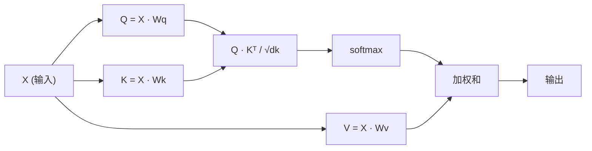

# 自注意力从零实现

> 注意力是一张查询表，每个词都在问："谁对我重要？"——然后学习答案。

**类型：** 学习型
**语言：** Python
**前置条件：** 阶段 3（深度学习核心）、阶段 5 第 10 课（序列到序列）
**时间：** 约 90 分钟

## 学习目标

- 仅使用 NumPy 从零实现缩放点积自注意力，包括 query/key/value 投影和 softmax 加权和
- 构建一个将 heads 拆分、并行计算注意力并拼接结果的多头注意力层
- 追踪注意力矩阵如何捕获 token 关系，并解释为什么除以 sqrt(d_k) 可以防止 softmax 饱和
- 应用因果掩码将双向注意力转换为自回归（解码器风格）注意力

## 问题

RNN 一次处理一个 token。当你到达第 50 个 token 时，来自第 1 个 token 的信息已经被压缩通过了 50 个压缩步骤。长距离依赖被压入固定大小的隐藏状态——这是一个没有任何 LSTM 门控能完全解决的瓶颈。

2014 年的 Bahdanau 注意力论文展示了修复方法：让解码器回看每个编码器位置，并决定哪些对当前步骤重要。但它仍然是作为 RNN 的附加物。2017 年的《Attention Is All You Need》论文提出了一个更尖锐的问题：如果注意力是*唯一的*机制呢？没有循环。没有卷积。只有注意力。

自注意力让序列中的每个位置在单个并行步骤中关注所有其他位置。这就是使 Transformer 快速、可扩展和占主导地位的原因。

## 概念

### 数据库查询类比

把注意力想象成一个软数据库查询：

```
传统数据库：
  查询："法国的首都"  -->  精确匹配  -->  "巴黎"

注意力：
  查询："法国的首都"  -->  与所有键的相似度  -->  所有值的加权混合
```

每个 token 生成三个向量：
- **Query (Q)**："我在找什么？"
- **Key (K)**："我包含什么？"
- **Value (V)**："如果被选中，我提供什么信息？"

query 与所有 key 的点积产生注意力分数。高分意味着"这个 key 与我的 query 匹配。"这些分数对 value 进行加权。输出是 value 的加权和。

### Q、K、V 计算

每个 token embedding 通过三个学习到的权重矩阵进行投影：

```
输入 embedding（n 个 token 的序列，每个 d 维）：

  X = [x1, x2, x3, ..., xn]       shape: (n, d)

三个权重矩阵：

  Wq  shape: (d, dk)
  Wk  shape: (d, dk)
  Wv  shape: (d, dv)

投影：

  Q = X @ Wq    shape: (n, dk)      每个 token 的 query
  K = X @ Wk    shape: (n, dk)      每个 token 的 key
  V = X @ Wv    shape: (n, dv)      每个 token 的 value
```

对于一个 token，可视化如下：

```
             Wq
  x_i ------[*]------> q_i    "我在找什么？"
       |
       |     Wk
       +----[*]------> k_i    "我包含什么？"
       |
       |     Wv
       +----[*]------> v_i    "我提供什么？"
```

### 注意力矩阵

一旦你有了所有 token 的 Q、K、V，注意力分数就形成一个矩阵：

```
Scores = Q @ K^T    shape: (n, n)

              k1    k2    k3    k4    k5
        +-----+-----+-----+-----+-----+
   q1   | 2.1 | 0.3 | 0.1 | 0.8 | 0.2 |   <- q1 对每个 key 的关注程度
        +-----+-----+-----+-----+-----+
   q2   | 0.4 | 1.9 | 0.7 | 0.1 | 0.3 |
        +-----+-----+-----+-----+-----+
   q3   | 0.2 | 0.6 | 2.3 | 0.5 | 0.1 |
        +-----+-----+-----+-----+-----+
   q4   | 0.9 | 0.1 | 0.4 | 1.7 | 0.6 |
        +-----+-----+-----+-----+-----+
   q5   | 0.1 | 0.3 | 0.2 | 0.5 | 2.0 |
        +-----+-----+-----+-----+-----+

每行：一个 token 对整个序列的注意力
```

观察一个 query 一次扫过所有 key：每行对每个 token 打分，softmax 将分数转换为权重，上下文向量是值的加权混合。

```figure
attention-matrix
```

### 为什么需要缩放？

点积随维度 dk 增长。如果 dk = 64，点积可能在几十的范围内，将 softmax 推向梯度消失的区域。修复方法：除以 sqrt(dk)。

```
缩放后的分数 = (Q @ K^T) / sqrt(dk)
```

这将值保持在 softmax 产生有效梯度的范围内。

### Softmax 将分数转换为权重

Softmax 将原始分数转换为每行上的概率分布：

```
q1 的原始分数：   [2.1, 0.3, 0.1, 0.8, 0.2]
                            |
                         softmax
                            |
注意力权重：   [0.52, 0.09, 0.07, 0.14, 0.08]   （总和约为 1.0）
```

现在每个 token 有一组权重，说明要关注其他每个 token 多少。

### 加权和

每个 token 的最终输出是所有 value 向量的加权和：

```
output_i = sum( attention_weight[i][j] * v_j  for all j )

对于 token 1：
  output_1 = 0.52 * v1 + 0.09 * v2 + 0.07 * v3 + 0.14 * v4 + 0.08 * v5
```

### 完整流程



一行公式：

```
Attention(Q, K, V) = softmax( Q @ K^T / sqrt(dk) ) @ V
```

## 从零构建

### 第 1 步：Softmax 从零实现

Softmax 将原始 logit 转换为概率。为了数值稳定性，减去最大值。

```python
import numpy as np

def softmax(x):
    shifted = x - np.max(x, axis=-1, keepdims=True)
    exp_x = np.exp(shifted)
    return exp_x / np.sum(exp_x, axis=-1, keepdims=True)

logits = np.array([2.0, 1.0, 0.1])
print(f"logits:  {logits}")
print(f"softmax: {softmax(logits)}")
print(f"sum:     {softmax(logits).sum():.4f}")
```

### 第 2 步：缩放点积注意力

核心函数。接收 Q、K、V 矩阵，返回注意力输出和权重矩阵。

```python
def scaled_dot_product_attention(Q, K, V):
    dk = Q.shape[-1]
    scores = Q @ K.T / np.sqrt(dk)
    weights = softmax(scores)
    output = weights @ V
    return output, weights
```

### 第 3 步：带学习投影的自注意力类

一个完整的自注意力模块，Wq、Wk、Wv 权重矩阵使用类似 Xavier 的缩放初始化。

```python
class SelfAttention:
    def __init__(self, d_model, dk, dv, seed=42):
        rng = np.random.default_rng(seed)
        scale = np.sqrt(2.0 / (d_model + dk))
        self.Wq = rng.normal(0, scale, (d_model, dk))
        self.Wk = rng.normal(0, scale, (d_model, dk))
        scale_v = np.sqrt(2.0 / (d_model + dv))
        self.Wv = rng.normal(0, scale_v, (d_model, dv))
        self.dk = dk

    def forward(self, X):
        Q = X @ self.Wq
        K = X @ self.Wk
        V = X @ self.Wv
        output, weights = scaled_dot_product_attention(Q, K, V)
        return output, weights
```

### 第 4 步：在句子上运行

为一句话创建假 embedding，观察注意力权重。

```python
sentence = ["The", "cat", "sat", "on", "the", "mat"]
n_tokens = len(sentence)
d_model = 8
dk = 4
dv = 4

rng = np.random.default_rng(42)
X = rng.normal(0, 1, (n_tokens, d_model))

attn = SelfAttention(d_model, dk, dv, seed=42)
output, weights = attn.forward(X)

print("注意力权重（每行：该 token 看向哪里）:\n")
print(f"{'':>6}", end="")
for token in sentence:
    print(f"{token:>6}", end="")
print()

for i, token in enumerate(sentence):
    print(f"{token:>6}", end="")
    for j in range(n_tokens):
        w = weights[i][j]
        print(f"{w:6.3f}", end="")
    print()
```

### 第 5 步：用 ASCII 热力图可视化注意力

将注意力权重映射为字符以便快速可视化。

```python
def ascii_heatmap(weights, tokens, chars=" ░▒▓█"):
    n = len(tokens)
    print(f"\n{'':>6}", end="")
    for t in tokens:
        print(f"{t:>6}", end="")
    print()

    for i in range(n):
        print(f"{tokens[i]:>6}", end="")
        for j in range(n):
            level = int(weights[i][j] * (len(chars) - 1) / weights.max())
            level = min(level, len(chars) - 1)
            print(f"{'  ' + chars[level] + '   '}", end="")
        print()

ascii_heatmap(weights, sentence)
```

## 实际使用

PyTorch 的 `nn.MultiheadAttention` 做了我们构建的完全相同的事情，外加多头拆分和输出投影：

```python
import torch
import torch.nn as nn

d_model = 8
n_heads = 2
seq_len = 6

mha = nn.MultiheadAttention(embed_dim=d_model, num_heads=n_heads, batch_first=True)

X_torch = torch.randn(1, seq_len, d_model)

output, attn_weights = mha(X_torch, X_torch, X_torch)

print(f"输入 shape:            {X_torch.shape}")
print(f"输出 shape:           {output.shape}")
print(f"注意力权重 shape: {attn_weights.shape}")
print(f"\n注意力权重（跨 head 平均）：")
print(attn_weights[0].detach().numpy().round(3))
```

关键区别：多头注意力并行运行多个注意力函数，每个都有自己大小为 dk = d_model / n_heads 的 Q、K、V 投影，然后拼接结果。这让模型能够同时关注不同类型的关系。

## 交付物

本课产出：
- `outputs/prompt-attention-explainer.md` - 一个用数据库查询类比解释注意力的提示词

## 练习

1. 修改 `scaled_dot_product_attention` 以接受一个可选的掩码矩阵，在 softmax 之前将某些位置设置为负无穷（这就是因果/解码器掩码的工作方式）
2. 从零实现多头注意力：将 Q、K、V 拆分到 `n_heads` 个块，在每个上运行注意力，拼接，然后用最终的权重矩阵 Wo 投影
3. 取两个相同长度的不同句子，通过同一个 SelfAttention 实例处理，比较它们的注意力模式。什么变了？什么没变？

## 关键术语

| 术语 | 大家怎么说的 | 实际含义 |
|------|----------------|-----------------------|
| Query (Q) | "问题向量" | 输入的一个学习投影，表示这个 token 正在寻找什么信息 |
| Key (K) | "标签向量" | 一个学习投影，表示这个 token 包含什么信息，与 query 匹配 |
| Value (V) | "内容向量" | 一个学习投影，携带根据注意力分数聚合的实际信息 |
| 缩放点积注意力 | "注意力公式" | softmax(QK^T / sqrt(dk)) @ V - 缩放防止高维度的 softmax 饱和 |
| 自注意力 | "token 看向自己和他人" | Q、K、V 都来自同一序列的注意力，让每个位置关注所有其他位置 |
| 注意力权重 | "关注多少" | 位置的概率分布，由缩放点积的 softmax 产生 |
| 多头注意力 | "并行注意力" | 用不同投影运行多个注意力函数，然后拼接结果以获得更丰富的表示 |

## 延伸阅读

- [Attention Is All You Need (Vaswani et al., 2017)](https://arxiv.org/abs/1706.03762) - 原始 transformer 论文
- [The Illustrated Transformer (Jay Alammar)](https://jalammar.github.io/illustrated-transformer/) - 完整架构的最佳可视化walkthrough
- [The Annotated Transformer (Harvard NLP)](https://nlp.seas.harvard.edu/annotated-transformer/) - 逐行 PyTorch 实现带解释